 ---------------------------------------------[ 第1页 ]---------------------------------------------  

CHAPTER  

# 11 Finite Impulse Response Digital Filter  

# 11.1 INTRODUCTION TO DIGITAL FILTERS  

A filter is a frequency-selective device, that is, the device passes signal components at some frequencies and attenuates signal components at other frequencies. In other words, the device processes the signal in some known way. In contrast to analog filters, digital filters are described by two types of transfer functions of finite impulse response (FIR) filters and infinite impulse response (IIR) filters. In this chapter, we will discuss the properties of FIR filters and their design techniques. The design of a filter starts with a set of specifications that can be either in discrete-time or frequency domain. In the discrete-time domain, the desired impulse response of the filter is usually specified, whereas in the frequency domain, the specifications include certain parameters of the magnitude response and/or phase response. The goal is then to design the digital filter transfer function $H(z)$.  

# 11.1.1 Advantages and Disadvantages of Digital Filters  

A digital filter is a discrete-time system designed to reshape the spectrum of the input signal in order to produce the desired spectral characteristics in the output signal. An analog and a digital filter perform the same filtering function. However, a digital filter operates with digital samples of the input signal together with the digital samples of the filter characteristics. The analog filter theory is based on linear differential equations, where as the digital filter theory is based on linear difference equations. The analog filters operate on analog signals and consists of resistors, capacitors, inductors, and active components. Digital filters operate on discrete-time signals and consists of adders, multipliers, and delay elements (shift registers) implemented in digital logic.  

# Advantages of Digital Filters  

Some advantages of digital filters are as follows:  

1. Thermal stability: The temperature changes affecting resistors, capacitors, and inductors are eliminated because digital filters are implemented with adders, multipliers, and shift registers.

2. Linear phase characteristics: The digital filters can have characteristics that are not possible with analog filters, for example, a truly linearphase response.

3. Precision: The filter performance enhancement can be obtained, with respect to accuracy, dynamic range, stability, and frequency response tolerance, by increasing the processor register bit-length.  

 ---------------------------------------------[ 第2页 ]---------------------------------------------  

4. Adaptability: The digital filter frequency response can be automatically adjusted if it is implemented using a programmable processor, and due to which, they are widely used in adaptive filters.

5. Multiplexing: Various input signals or channels can be filtered by one digital filter without replicating the hardware.

6. Data logging: Both filtered and unfiltered data can be saved for further use.

7. Perfect reproducibility: The performance of digital filters is repeatable from unit to unit.  

# Disadvantages of Digital Filters  

Some disadvantages of digital filters are follows:  

1. Limited bandwidth: The sampling process of the analog-to-digital converter limits the bandwidth of real discrete-time signals to half the sampling frequency.

2. Finite register length effects: The implementation of a discrete-time system in hardware can result in performance degradation. This effect results from using data and coefficient registers with a finite number of bits.

3. Speed: The digital filter is not as fast due to the limits on the sampling rates of the converter circuits.

4. Frequency dynamic range: The frequency dynamic range of digital filter is low. The frequency response of digital filters is almost always plotted on a linear frequency scale, whereas analog filters are usually displayed with a logarithmic frequency. This is because the digital filters require a linear scale to show their exceptional filter performance, whereas analog filters require a logarithmic scale to show their huge dynamic range.  

# 11.1.2 Types of Digital Filters  

The digital filters are divided into two classes, namely IIR and FIR filters. Both types of filters can be represented by its impulse response $h(n)$ as shown in Fig. 11.1. The input and output signals to the filters are related by the convolution sum. The output of IIR filter is given as  

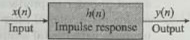{width=15%}  
Fig. 11.1 Representation of input, output, and impulse response of a digital filter  

$$
y ( n ) = \sum _ { k = 0 } ^{\infty} h ( k ) x ( n - k )
$$  

The impulse response of IIR filters is of infinite duration. In practical, it is not feasible to compute the output of IIR filter using Eq. (11.1) because the length of $h(n)$ is infinite. However, the IIR filtering equation is expressed in a recursive form as  

$$
y ( n ) = \sum _ { k = 0 } ^{\infty} h ( k ) x ( n - k ) = - \sum _ { k = 1 } ^{N - 1} a _ { k } y ( n - k ) + \sum _ { k = 0 } ^{M - 1} b _ { k } x ( n - k )
$$  

where $a_{k}$ and $b_{k}$ are the coefficients of the filter. The output of FIR filter is given as  

$$
y ( n ) = \sum _ { k = 0 } ^{M - 1} h ( k ) x ( n - k ) = \sum _ { k = 0 } ^{M - 1} b _ { k } x ( n - k )
$$  

The impulse response of FIR filters is of finite duration. The values of $h(k) = b_k$, for FIR, or $a_k$ and $b_k$, for IRR, are the objectives of most filter design problems.  

# 11.1.3 Differences Between Finite Impulse Response and Infinite Impulse Response Filters  

The differences between FIR and IIR filters are as follows:  

1. As the poles of FIR filters are all located at the origin, the FIR filters are always stable. The stability of IIR filters depends on the locations of the poles. The IIR filters are stable if all its poles lie inside the unit circle.

2. The FIR filters tend to be less sensitive to finite word length effects. The quantized IIR filters can become unstable or can exhibit limit-cycle oscillations.

3. The FIR filters can have an exactly linear phase response. This is an important characteristic because the different spectral components of the input signal are delayed by the same amount as they are processed by the filter. A linear-phase filter does not distort a signal within the pass-band; it only delays it. Linear phase is an important requirement in many signal processing applications. For example, it makes possible precise time alignment in speech processing applications. In data transmission applications, the linear phase prevents pulse dispersion. The phase response of IIR filters is non-linear, especially at the hand edges.

4. In FIR filters, the present output depend on the present and past inputs; hence, there is no feedback. The FIR filters are realized non-recursively, whereas the IIR filters are realized recursively.

5. The disadvantage of an FIR filter is that, if an IIR filter satisfies the same specification as an FIR filter, then the IIR filter will typically be faster and require less memory. Thus, for a given magnitude response specification, more processing time and storage will be required for FIR filter implementation.

6. Analog filter can be transformed into equivalent IIR digital filters meeting similar specifications, but this is not possible with FIR filters as they have no analog counterparts. However, FIR filters can be designed to have arbitrary magnitude responses.  

FIR filters can be used if no phase distortion is desired and the number of filter coefficients is not too large. When the requirements are only sharp cut-off and high throughput, an IIR filter can be used because it involves less coefficients, requires less memory, and has lower complex computational complexity.  

# 11.2 DESIRABILITY OF LINEAR-PHASE FILTERS  

The magnitude response of a filter is the description of attenuation of various frequency components in the signal that is produced by the filter. The phase response describes how the filter modifies the time relationship between the frequency components passing through the filter (see Section 5.8.4).  

A digital filter modifies the input signal spectrum $Y(e^{j\omega}) = X(e^{j\omega})H(e^{j\omega})$. In a sense, $H(e^{j\omega})$ acts as a weighting function or a spectral shaping function to the different frequency components in the input signal. Let us now consider the simple case of band-pass magnitude response, which is given as  

 ---------------------------------------------[ 第3页 ]---------------------------------------------  

$$
| H ( e ^{i \pi} ) | = \left\{ \begin{array}{ll} { 1 } & { 0 } \\{ 0 } & { \frac { \pi } { 2 } \leq \frac { \pi } { 2 } < w _ { h } } \\{ 0 } & { \frac { \pi } { 2 } < w _ { h } } \end{array} \right. \mathrm { ~ a n d ~ } \varepsilon _ { h } < \frac { \pi } { 2 } \leq \pi } \end{array}
$$  

We apply an input $x(n)=x_{1}(n)+x_{2}(n)$ to this filter, where $x_{1}(n)$ lies in the pass-band of the filter and $x_{2}(n)$ lies in the stop-band. For example, $x_{1}(n)$ may represent the signal of a desired radio channel and $x_{2}(n)$ may represent the signals of the other radio channels. The output spectrum is given as  

$$
\begin{aligned} Y ( e ^{j \omega} ) & = X ( e ^{j \omega} ) H ( e ^{j \omega} ) = [ X _ { 1 } ( e ^{j \omega} ) + X _ { 2 } ( e ^{j \omega} ) ] H ( e ^{j \omega} ) \\& = X _ { 1 } ( e ^{j \omega} ) H ( e ^{j \omega} ) + X _ { 2 } ( e ^{j \omega} ) H ( e ^{j \omega} ) \end{aligned}
$$  

Since only $X_1(e^{j\omega})$ passes unattenuated through the filter, the output is given as (see Section 4.4)  

$$
Y ( e ^{j \omega} ) = X _ { 1 } ( e ^{j \omega} ) H ( e ^{j \omega} ) = X _ { 1 } ( e ^{j \omega} ) | H ( e ^{j \omega} ) | e ^{j \angle H ( e ^ { j \omega} ) } = X _ { 1 } ( e ^{j \omega} ) e ^{j \angle H ( e ^ { j \omega} ) }
$$  

If the filter has a linear phase response in the pass-band, or  

$$
\angle H ( e ^{2 \mu} ) = - \tau \omega  \omega _ { 1 } \leq | \omega | \leq \omega _ { h }
$$  

then the output spectrum is given as  

$$
Y ( e ^{j \omega} ) = X _ { 1 } ( e ^{j \omega} ) e ^{- j \tau \omega}
$$  

The filtered output signal is given by  

$$
y ( n ) = x _ { 1 } ( n - \tau )
$$  

This filtered output signal is identical to the desired part of the input sequence except for the time delay of $\tau$ samples. A linear phase response maintains the phase relationship of the frequency components of the input signal in the pass-band.  

A filter is said to have a linear phase response if its phase response satisfies one of the following relationships:  

$$
\begin{array}{rl} { \angle H ( e ^{j \omega} ) = - \tau \omega } \\{ \angle H ( e ^{j \omega} ) = \beta - \tau \omega } \end{array}
$$  

where $\beta$ and $\tau$ are constant. If a filter satisfies Eq. (11.4), then it will have both constant phase and constant group delay responses, and the impulse response $h(n)$ is symmetric about $\tau$, that is,  

$$
h ( n ) = h ( M - 1 - n )  0 \leq n \leq M - 1  { \mathrm { a n d } }  \tau = { \frac { M - 1 } { 2 } } .
$$  

The following table provides Eq. (11.5), then it will have constant group delay only. In this case, the impulse response $h(n)$ is antisymmetric about $\tau$, that is,  

$$
H ( e ^{j \omega} ) = e ^{- j k \omega}
$$  

$$
h ( n ) = - h ( M - 1 - n )  0 \leq n \leq M - 1 ,  \beta = \pm { \frac { \pi } { 2 } } ,  { \mathrm { a n d } }  \tau = { \frac { M - 1 } { 2 } } .
$$  

# 11.2.1 Effect of Phase Distortion  

Let the desired phase Distortion  

where $\omega_{0}=\frac{\pi}{12}$. If the filter has a transfer function with a linear phase response, then  

where $k=4$. Then, the output signal is given as  

$$
\mathrm { ~ s ~ e ~ c ~ t ~ u ~ r ~ e ~ d ~ p ~ a ~ r ~ t ~ o ~ f ~ t ~ h ~ e ~ i ~ n ~ p ~ u ~ t ~ s ~ e ~ q ~ u ~ e ~ n ~ c ~ e ~ b ~ e ~ }
$$  

$$
y ( n ) = x _ { 1 } ( n - k ) = \cos \omega _ { 0 } ( n - k ) + \cos 2 \omega _ { 0 } ( n - k )
$$  

As shown in Fig. 11.2(b), the output signal is the delayed version of the input signal shown in Fig. 11.2(a). However, the shape of the signal is maintained.  

Now consider a filter having the same magnitude response, equal to 1, but having the phase response as  

$$
\angle H ( e ^{5 w} ) = \left\{ \begin{array}{ll} { { - \frac { \pi } { 4 } } } & { { 0 \leq w \leq \frac { 3 } { 2 } w _ { 0 } } } \\{ { - \pi } } & { { \frac { 3 } { 2 } w _ { 0 } < w \leq \pi } } \end{array} \right.
$$  

The filtered output is then equal to:  

$$
y ( n ) = \cos \left( \omega _ { 0 } n - \frac { \pi } { 4 } \right) + \cos \left( 2 \omega _ { 0 } n - \pi \right)
$$  

and is also shown in Fig. 11.2(c). The shape of the filtered output signal has been altered, even though there was no amplitude distortion, and this illustrates the effect of phase distortion.  

A filter with a non-linear phase characteristic will cause a phase distortion in the signal that passes through it. This is because the frequency components in the signal  

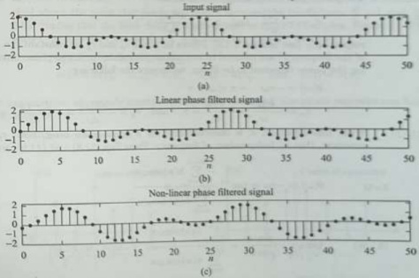{width=37%}  
Fig. 11.2 Illustration of phase distortion (a) Input signal (b) Linear-phase filtered signal (c) Non-linear phase filtered signal  

 ---------------------------------------------[ 第4页 ]---------------------------------------------  

will each be delayed by an amount not properly described in their harmonic relationships.  

11.2.2 Condition for Filter to have Linear-phase Res

The transfer function of a FIR filter of length $M$ is given as  

$$
H ( z ) = \sum _ { n = 0 } ^{M - 1} h ( n ) z ^{- n}
$$  

Its frequency response is given as  

$$
\begin{array}{rl} { H ( e ^{j \omega} ) = | H ( e ^{j \omega} ) | e ^{j \angle H ( e ^ { j \omega} ) } = \sum _ { n = 0 } ^{M - 1} h ( n ) e ^{- j \omega n} } \\{ = \sum _ { n = 0 } ^{M - 1} h ( n ) \cos \omega n - j \sum _ { n = 0 } ^{M - 1} h ( n ) \sin \omega n } \end{array}
$$  

where the magnitude and phase response are defined as:  

$$
\begin{array}{rl} & { M ( \omega ) = | H ( e ^{2 \omega} ) | } \\& { \theta ( \omega ) = \angle H ( e ^{2 \omega} ) = \tan ^{- 1} \frac { \operatorname { I m } \{ H ( e ^{2 \omega} ) \} } { R e \{ H ( e ^{2 \omega} ) \} } = \tan ^{- 1} \frac { - \sum _ { n = 0 } ^{M - 1} h ( n ) \sin \omega n } { \sum _ { n = 0 } ^{M - 1} h ( n ) \cos \omega n } } \end{array}
$$  

The phase and group delays of a filter are  

$$
\tau _ { p } = - \frac { \theta ( \omega ) } { \omega }  \mathrm { a n d }  \tau _ { g } = - \frac { d \theta ( \omega ) } { d \omega }
$$  

respectively (see Section 5.8.5). Filters for which $\tau_{p}$ and $\tau_{g}$ are constant (i.e., independent of the frequency) are referred to as constant time delay or linear-phase filters. Therefore, for the phase response to be linear, we require the following:  

$$
\begin{array}{rl} { \theta ( \omega ) = - \tau \omega } & { { } - \pi < \omega < \pi } \\{ \frac { \tau _ { p } } { \tau _ { p } } = - \frac { \theta ( \omega ) } { \omega } = - \frac { - \tau \omega } { \omega } = \tau ,  \mathrm { a n d }  \tau _ { g } = - \frac { d \theta ( \omega ) } { d \omega } = - \frac { d ( - \tau \omega ) } { d \omega } = \tau } \end{array}
$$  

From this equation, it is observed that for a linear-phase filter, both $\tau_{p}$ and $\tau_{g}$ are constant, that is, independent of frequency. From Eqs (11.8) and (11.9), we have  

$$
\begin{aligned} \theta(\omega) & = -\tau \omega = \tan ^{-1} \frac { - \sum _ { n = 0 } ^{M - 1} h ( n ) \sin \omega n } { \sum _ { n = 0 } ^{M - 1} h ( n ) \cos \omega n } \\\tan \omega \tau & = \frac { \sin \omega \tau } { \cos \omega \tau } = \frac { \sum _ { n = 0 } ^{M - 1} h ( n ) \sin \omega n } { \sum _ { n = 0 } ^{M - 1} h ( n ) \cos \omega n } \\& \sum _ { n = 0 } ^{M - 1} h ( n ) \cos \omega n \sin \omega \tau - \sum _ { n = 0 } ^{M - 1} h ( n ) \sin \omega n \cos \omega \tau & = \Theta \end{aligned}
$$  

$$
\sum _ { n = 0 } ^{M - 1} h ( n ) ( \cos \omega n \sin \omega \tau - \sin \omega n \cos \omega \tau ) = 0
$$  

The solution of this equation is  

$$
\begin{array}{rl} { \tau = { \frac { M - 1 } { 2 } } } & { { } } \\{ h ( n ) = h ( M - 1 - n ) ,  0 \leq n \leq M - 1 } & { { } } \end{array}
$$  

Eqs (11.11) and (11.12) are satisfied. The impulse response $h(\pi)$ is symmetric about $\tau$, which is the centre of symmetry. Consider the following symmetrical conditions of the impulse response for $M$-odd and $M$-even:  

1. $M$-odd: In this case, $\tau=\frac{M-1}{2}$ is an integer and the impulse response is symmetrical about the sample point $\frac{M-1}{2}$. This implies that the filter delay is an integer number of samples. Figure 11.3(a) shows the impulse response for $M=7$. From Eq. (11.12), we have  

$$
\begin{array}{rl} & { h ( n ) = h ( 6 - n ) ,  0 \leq n \leq 6 } \\& { h ( 0 ) = h ( 6 ) ,  h ( 1 ) = h ( 5 ) ,  h ( 2 ) = h ( 4 ) ,  \mathrm { a n d }  h ( 3 ) = h ( 3 ) } \end{array}
$$  

2. $M$-even: In this case, $\tau=\frac{M-1}{2}$ is not an integer and the impulse response is symmetrical about the point that lies in the centre between the coefficients $\frac{M}{2}-1$ and $\frac{M}{2}$. This implies that the filter delay is a non-integer number of samples. Figure 11.3(b) shows the impulse response for $M=8$. From Eq. (11.12), we have  

$$
\begin{array}{rl} & { h ( n ) = \hbar ( 7 - n ) ,  0 \leq n \leq 7 } \\& { h ( 0 ) = \hbar ( 7 ) ,  \hbar ( 1 ) = \hbar ( 6 ) ,  \hbar ( 2 ) = \hbar ( 5 ) ,  \mathrm { a n d }  \hbar ( 3 ) = \hbar ( 4 ) } \end{array}
$$  

In applications where only constant group delay is desired, the phase response can have the form as  

$$
\theta ( \omega ) = \beta - \tau \omega
$$  

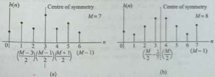{width=34%}  
Fig. 11.3 Symmetric impulse response for linear-phase FIR filters (a) $M$-odd (b) $M$-even  

 ---------------------------------------------[ 第5页 ]---------------------------------------------  

$$
\begin{aligned} \tau _ { g } & = - \frac { d \theta ( \omega ) } { d \omega } = - \frac { d ( \beta - \tau \omega ) } { d \omega } = \tau  ( \mathrm { c o n s t a n t } ) \\m \mathrm { E q s } \left( 11 . 8 \right) \mathrm { a n d } \left( 11 . 13 \right) , \mathrm { ~ w e ~ h a v e ~ } \\\theta ( \omega ) & = \beta - \tau \omega = \tan ^{- 1} \frac { - \sum _ { n = 0 } ^{M - 1} h ( n ) \sin \omega n } { \sum _ { n = 0 } ^{M - 1} h ( n ) \cos \omega n } \\\tan \left( \beta - \tau \omega \right) & = \frac { \sin \left( \beta - \tau \omega \right) } { \cos \left( \beta - \tau \omega \right) } = - \frac { \sum _ { n = 0 } ^{M - 1} h ( n ) \sin \omega n } { \sum _ { n = 0 } ^{M - 1} h ( n ) \cos \omega n } \\\tan \left( \beta - \tau \omega \right) & = \frac { \sin \left( \beta - \tau \omega \right) } { \cos \left( \beta - \tau \omega \right) } + \sum _ { n = 0 } ^{M - 1} h ( n ) \sin \omega n \cos \left( \beta - \tau \omega \right) = 0 \\\sum _ { n = 0 } ^{M - 1} h ( n ) \cos \omega n \sin \left( \beta - \tau \omega \right) + \sum _ { n = 0 } ^{M - 1} h ( n ) \sin \omega n \cos \left( \beta - \tau \omega \right) = 0 \\\sum _ { n = 0 } ^{M - 1} h ( n ) [ \cos \omega n \sin \left( \beta - \tau \omega \right) + \sin \omega n \cos \left( \beta - \tau \omega \right) ] = 0 \\\sum _ { n = 0 } ^{M - 1} h ( n ) \sin \left[ \beta - \left( \tau - n \right) \omega \right] = 0 \end{aligned}
$$  

If $\beta=\frac{\pi}{2}$, then this equation can be rewritten as  

$$
\sum _ { n = 0 } ^{M - 1} h ( n ) \cos ( \tau - n ) \omega = 0
$$  

This equation will be satisfied when  

$$
\begin{array}{rl} { \tau = { \frac { M - 1 } { 2 } } } & { { } } \\{ h ( n ) = - h ( M - 1 - n ) ,  0 \leq n \leq M - 1 } & { { } } \end{array}
$$  

In this case, the impulse response $h(n)$ is antisymmetric about $\tau$. Once again, we have two possible classes, one for $M$-odd and one for $M$-even, which are as follows:  

1. $M$-odd: In this case, $\tau=\frac{M-1}{2}$ is an integer and the impulse response is antisymmetrical about the sample point $\frac{M-1}{2}$. Note that the sample $h(\tau)$ at $\tau=\frac{M-1}{2}$ must necessarily be equal to zero, that is, $h\left(\frac{M-1}{2}\right)=0$. Figure 11.4(a) shows the impulse response for $M=7$. From Eq. (11.15), we have  

$$
\begin{array}{rl} & { h ( n ) = - h ( 6 - n ) ,  0 \leq n \leq 6 } \\& { h ( 0 ) = - h ( 6 ) ,  h ( 1 ) = - h ( 5 ) ,  h ( 2 ) = - h ( 4 ) ,  \mathrm { a n d }  h ( 3 ) = - h ( 3 ) = 0 } \end{array}
$$  

2. $M$-even: In this case, $\tau=\frac{M-1}{2}$ is not an integer and the impulse response is anti-symmetrical about the point that lies in the centre between the coefficients $\frac{M}{2}-1$ and $\frac{M}{2}$. Figure 11.4(b) shows the impulse response for $M=8$. From Eq. (11.15), we have  

$$
\begin{array}{r} { h ( n ) = - h ( 7 - n ) ,  0 \leq n \leq 6 } \\{ h ( 0 ) = - h ( 7 ) ,  h ( 1 ) = - h ( 6 ) ,  h ( 2 ) = - h ( 5 ) ,  \mathrm { a n d }  h ( 3 ) = - h ( 4 ) } \end{array}
$$  

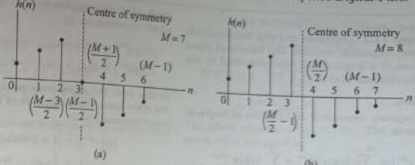{width=33%}  
Fig. 11.4 Antisymmetric impulse response for linear-phase FIR filters (a) $M$-odd (b) $M$-even  

Example 11.1 For FIR filters to have linear phase, the properties described by Eqs (11.11) and (11.12) must be satisfied. Given $M = 9$, show that Eq. (11.10) is satisfied.  

# Solution:  

Given that $M = 9$. From Eq. (11.11), we have $r = \frac{M - 1}{2} = 4$, and from Eq. (11.12), we have $h(n) = h(M - 1 - n) = h(8 - n)$.  

$$
\begin{array}{rl} { h ( n ) = h ( 8 - n ) ,  0 \leq n \leq 8 } & { } \\{ h ( 0 ) = h ( 8 ) ,  h ( 1 ) = h ( 7 ) ,  h ( 2 ) = h ( 6 ) , } & { } \\{ h ( 3 ) = h ( 5 ) ,  \mathrm { a n d }  h ( 4 ) } & { } \end{array}
$$  

$$
\begin{aligned} & \sum _ { n = 0 } ^{M - 1} h ( n ) \sin \left( \omega \tau - \omega n \right) \\& = \sum _ { n = 0 } ^{M - 1} h ( n ) \sin \left( \tau - n \right) \omega = \sum _ { n = 0 } ^{N} h ( n ) \sin \left( 4 - n \right) \omega \\& = h ( 0 ) \sin \left( 4 \omega \right) + h ( 1 ) \sin \left( 3 \omega \right) + h ( 2 ) \sin \left( 2 \omega \right) \\& + h ( 3 ) \sin \left( \omega \right) + h ( 4 ) \sin \left( 0 \right) \\& [ 2 p t ]  + h ( 5 ) \sin \left( - \omega \right) + h ( 6 ) \sin \left( - 2 \omega \right) \\& + h ( 7 ) \sin \left( - 3 \omega \right) + h ( 8 ) \sin \left( - 4 \omega \right) \\& = h ( 0 ) \sin \left( 4 \omega \right) + h ( 1 ) \sin \left( 3 \omega \right) + h ( 2 ) \sin \left( 2 \omega \right) \\& + h ( 3 ) \sin \left( \omega \right) + h ( 4 ) \sin \left( 0 \right) \\& - h ( 3 ) \sin \left( \omega \right) - h ( 2 ) \sin \left( 2 \omega \right) \\& - h ( 1 ) \sin \left( 3 \omega \right) - h ( 0 ) \sin \left( 4 \omega \right) \\& = 0 \end{aligned}
$$  

Consider the left-hand side of Eq. (11.10),  

# 11.3 FREQUENCY RESPONSE OF LINEAR-PHASE FINITE IMPULSE RESPONSE FILTERS  

When the cases of symmetry and antisymmetry are combined with odd and even $M$, we obtain four types of linear-phase FIR filters. To simplify the design of linear-phase FIR filters, it is convenient to use the real function $H_{r}(e^{j\omega})$, which is defined as  

$$
H ( e ^{j \omega} ) = H _ { r } ( e ^{j \omega} ) e ^{j \theta ( \omega )}
$$  

where $\theta(\omega) = \beta - \tau\omega$ with $\beta = 0$ and $\beta = \frac{\pi}{2}$ for symmetric and antisymmetric impulse responses, respectively. $H_r(e^{j\omega})$ is the amplitude response (or zero phase response, see Section 7.3) and not the magnitude response. The amplitude response is a real function and it may be both positive and negative. The magnitude response is always positive. The phase response associated with the magnitude response is a discontinuous linear function, whereas those associated with the amplitude response is a continuous linear function. The following example will clear the difference between the amplitude and magnitude (or between the linear-phase and the piecewise linear) responses.  

 ---------------------------------------------[ 第6页 ]---------------------------------------------  

Example 11.2 Determine and plot the amplitude response, magnitude response, and associated phase responses of a length-3 FIR filter described by the impulse response $h(n) = \{1, 1, 1\}$.  

Solution:  

The frequency response of an FIR filter of length-$M$ is given as  

From this, the amplitude and the corresponding phase responses are $m_{\mathrm{\~s\~}}$  

$$
\begin{array}{rl} { H ( e ^{j \omega} ) = \sum _ { n = 0 } ^{M - 1} h ( n ) e ^{- j \omega n} = \sum _ { n = 0 } ^{2} h ( n ) e ^{- j \omega n} } & { { } } \\{ = 1 + e ^{- j \omega} + e ^{- j 2 \omega} } & { { } } \\{ = ( e ^{j \omega} + 1 + e ^{- j \omega} ) e ^{- j \omega} } & { { } } \\{ H ( e ^{j \omega} ) = ( 1 + 2 \cos \omega ) e ^{- j \omega} } & { { } } \\{ = H _ { r } ( e ^{j \omega} ) e ^{j \Phi ( \omega )} } & { { } } \end{array}
$$  

$$
\begin{array}{rl} { H _ { r } ( e ^{j \omega} ) = 1 + 2 \cos \omega , } & { { } - \pi < \omega \leq \pi } \\{ \angle H ( e ^{j \omega} ) = \theta ( \omega ) = - \omega , } & { { } - \pi < \omega \leq \pi } \end{array}
$$  

In this case, the phase response is truly linear. On the other hand, the magnitude of the corresponding phase responses is as  

$$
\begin{array}{rl} { | H ( e ^{j \omega} ) | = | 1 + 2 \cos \omega | , } & { 0 < \omega \leq \pi } \\{ \angle H ( e ^{j \omega} ) = \theta ( \omega ) = \left\{ \begin{array}{ll} { - \omega } & { 0 < \omega < \frac { 2 \pi } { 3 } } \\{ \pi - \omega } & { \frac { 2 \pi } { 3 } < \omega < \pi } \end{array} \right. } & \end{array}
$$  

In this case, the phase response is piecewise linear. There is a phase jumps of $\pi$ where the amplitude $H_{r}(e^{j\omega})$ changes sign. These responses are shown in Fig. 11.5.  

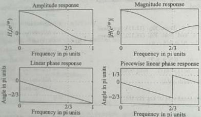{width=31%}  
Fig. 11.5 Frequency responses as in Example 11.2  

Example 11.3 A FIR digital filter is characterized by the following transfer function ($M = \text{II}$). Determine the amplitude response and show that the phase and group delay of the causal filter are constant.  

$$
H ( z ) = \sum _ { n = 0 } ^{M - 1} h ( n ) z ^{- n}
$$  

$$
\begin{aligned} & = h ( 0 ) + h ( 1 ) z ^{- 1} + h ( 2 ) z ^{- 2} + h ( 3 ) z ^{- 3} \\& + h ( 4 ) z ^{- 4} + h ( 5 ) z ^{- 5} \\& + h ( 6 ) z ^{- 6} + h ( 7 ) z ^{- 7} + h ( 8 ) z ^{- 8} \\& + h ( 9 ) z ^{- 9} + h ( 10 ) z ^{- 10} . \end{aligned}
$$  

Forte Impulse Response Digital Filter 593  

Since $h(n)=h(M-1-n)=h(10-n)$, $0\leq n\leq10$, we have  

Solution:  

Since $\tau=\frac{M-1}{2}=5$, the transfer function $H(z)$ can be written as  

$$
\begin{array}{rl} { H ( z ) = z ^{- 5} \left[ h ( 0 ) ( z ^{3} + z ^{- 5} ) + h ( 1 ) ( z ^{4} + z ^{- 4} ) \right. } \\{ \left. + h ( 2 ) ( z ^{3} + z ^{- 3} ) + h ( 3 ) ( z ^{2} + z ^{- 2} ) \right. } \\{ \left. + h ( 4 ) ( z ^{1} + z ^{- 1} ) + h ( 5 ) \right] } \end{array}
$$  

Consider the given transfer function  

$$
H ( z ) = \sum _ { n = 0 } ^{M - 1} h ( n ) z ^{- n} = \sum _ { n = 0 } ^{10} h ( n ) z ^{- n}
$$  

$$
\begin{array}{rl} { \left. + 2 h ( 2 ) \cos { ( 3 \omega ) } + 2 h ( 3 ) \cos { ( 2 \omega ) } \right. } & { { } } \\{ \left. + 2 h ( 4 ) \cos { ( \omega ) } + h ( 5 ) \right] } & { { } } \\{ H ( e ^{j \omega} ) = e ^{- j 5 \omega} \left[ \sum _ { k = 1 } ^{5} 2 h ( 5 - k ) \cos { ( k \omega ) } + h ( 5 ) \right] } & { { } } \\{ = e ^{j \varphi ( \omega )} H _ { * } ( e ^{j \omega} ) } & { { } } \end{array}
$$  

The frequency response is obtained by substituting $z=e^{\gamma\omega}$. We then obtain  

The phase response $\theta(\omega) = -5\omega$. The phase and group delay are given as  

$$
H ( e ^{i \omega} ) = e ^{- j S \omega} \Big [ 2 h ( 0 ) \cos { ( 5 \omega ) } + 2 h ( 1 ) \cos { ( 4 \omega ) } \Big ] ,  \tau _ { g } = - \frac { \theta ( \omega ) } { \omega } = 3 ,  \tau _ { g } = - \frac { d \theta ( \omega ) } { d \omega } = 5
$$  

$$
\begin{array}{rl} { H ( z ) = z ^{- 5} \bigg [ h ( 0 ) z ^{5} + h ( 1 ) z ^{4} + h ( 2 ) z ^{3} + h ( 3 ) z ^{2} } & { { } } \\{ + h ( 4 ) z ^{1} + h ( 5 ) + h ( 6 ) z ^{- 1} + h ( 7 ) z ^{- 2} } & { { } } \\{ + h ( 8 ) z ^{- 3} + h ( 9 ) z ^{- 4} + h ( 10 ) z ^{- 5} \bigg ] } & { { } } \end{array}
$$  

# 11.3.1 Type-1: Symmetric Impulse Response with Odd Length (M Odd)  

In this case, the length $M$ is odd and the order $M-1$ is even, $\beta=0$, $\tau=\frac{M-1}{2}$ is an integer, and $h(n)=h(M-1-n)$, $0\leq n\leq M-1$. The frequency response is given by  

$$
H ( e ^{i \omega} ) = \sum _ { n = 0 } ^{M - 1} h ( n ) e ^{- j \omega n}
$$  

As shown in Fig. 11.3(a), the impulse response is symmetrical about the sample point $\frac{M-1}{2}$. Hence, $H(e^{i\omega})$ can be expressed as  

$$
H ( e ^{j \omega} ) = \sum _ { n = 0 } ^{( M - 3 ) / 2} h ( n ) e ^{- j \omega n} + h \left( \frac { M - 1 } { 2 } \right) e ^{- j \omega \frac { M - 1} { 2 } } + \sum _ { n = ( M + 1 ) / 2 } ^{M - 1} h ( n ) e ^{- j \omega n}
$$  

Using Eq. (11.12), this summation can be expressed as  

$$
\sum _ { n = ( M + 1 ) / 2 } ^{M - 1} h ( n ) e ^{- i \omega n} = \sum _ { n = ( M + 1 ) / 2 } ^{M - 1} h ( M - 1 - n ) e ^{- i \omega n}
$$  

A change of variable is performed by letting $k = M-1-n$, which also yields $n = M-1-k$, $k = \frac{M-2}{2}$ as $n = \frac{M+1}{2}$, and $k = 0$ as $n = M-1$. Therefore,  

$$
\sum _ { n = ( M + 1 ) / 2 } ^{M - 1} h ( n ) e ^{- j \omega n} = \sum _ { n = ( M + 1 ) / 2 } ^{M - 1} h ( M - 1 - n ) e ^{- j \omega n} = \sum _ { k = 0 } ^{( M - 1 ) / 2} h ( k ) e ^{- j \omega ( M - 1 - k )}
$$  

Now replacing $k$ by $n$, this summation becomes  

$$
\sum _ { n = ( M + 1 ) / 2 } ^{M - 1} h ( n ) e ^{- j \omega n} = \sum _ { k = 0 } ^{( M - 3 ) / 2} h ( k ) e ^{- j \omega ( M - 1 - k )} = \sum _ { n = 0 } ^{( M - 3 ) / 2} h ( n ) e ^{- j \omega ( M - 1 - n )}
$$  

Substituting Eq. (11.18) into Eq. (11.17), we obtain  

$$
H ( e ^{j \omega} ) = \sum _ { n = 0 } ^{( M - 3 ) / 2} h ( n ) e ^{- j \omega n} + h \left( \frac { M - 1 } { 2 } \right) e ^{- j \omega \frac { M - 1} { 2 } } + \sum _ { n = 0 } ^{( M - 3 ) / 2} h ( n ) e ^{- j \omega ( M - 1 - n )}
$$  

 ---------------------------------------------[ 第7页 ]---------------------------------------------  

$$
\begin{aligned} & = \sum _ { n = 0 } ^{( M - 3 ) / 2} h ( n ) \left[ e ^{- j \omega n} + e ^{- 3 \omega ( M - 1 - n )} \right] + h \left( \frac { M - 1 } { 2 } \right) e ^{- j \omega \frac { M - 1} { 2 } } \\& = e ^{- j \omega \frac { M - 1} { 2 } } \left\{ \sum _ { n = 0 } ^{( M - 3 ) / 2} h ( n ) \left[ e ^{j \omega ( \frac { M - 1} { 2 } - n ) } + e ^{- j \omega ( \frac { M - 1} { 2 } - n ) } \right] + h \left( \frac { M - 1 } { 2 } \right) \right\} \\H ( e ^{j \omega} ) = e ^{- j \omega \frac { M - 1} { 2 } } \left\{ \sum _ { n = 0 } ^{( M - 3 ) / 2} 2 h ( n ) \cos \left[ \omega \left( \frac { M - 1 } { 2 } - n \right) \right] + h \left( \frac { M - 1 } { 2 } \right) \right\} \end{aligned}
$$  

A change of variable is performed by letting $k=\frac{M-1}{2}-n$, which also yields $n=\frac{M-1}{2}-k$, $k=\frac{M-1}{2}$ as $n=0$, and $k=1$ as $n=\frac{M-3}{2}$. Therefore,  

$$
H ( e ^{j \omega} ) = e ^{- j \omega \frac { M - 1} { 2 } } \left\{ \sum _ { k = 1 } ^{( M - 1 ) / 2} 2 h \left( \frac { M - 1 } { 2 } - k \right) \cos \left( k \omega \right) + h \left( \frac { M - 1 } { 2 } \right) \right\} H ( e ^{j \omega} ) = e ^{- j \omega \frac { M - 1} { 2 } } \sum _ { k = 0 } ^{( M - 1 ) / 2} a ( k ) \cos \left( k \omega \right) = e ^{j \theta ( \omega )} H _ { r } ( e ^{j \omega} )
$$  

where  

$$
\begin{array}{rl} { a ( 0 ) = h \left( { \frac { M - 1 } { 2 } } \right) } & { } \\{ a ( k ) = 2 h \left( { \frac { M - 1 } { 2 } } - k \right) ,  1 \leq k \leq { \frac { M - 1 } { 2 } } } & { } \\{ \tau = - { \frac { \theta ( \omega ) } { \omega } } = - { \frac { \omega { \frac { M - 1 } { 2 } } } { \omega } } = { \frac { M - 1 } { 2 } } } & { } \end{array}
$$  

For $M=11$, the results are obtained in Example 11.3. The amplitude response is given as  

$$
H _ { r } ( e ^{3 \omega} ) = \sum _ { k = 0 } ^{( M - 1 ) / 2} a ( k ) \cos ( k \omega )
$$  

A typical amplitude response of Type-1 FIR filter is shown in Fig. 11.6. The amplitude response is symmetric about both $\omega=0$ and $\omega=\pi$, and both $H_{\tau}(e^{j0})$ and $H_{\tau}(e^{j\pi})$ can be nonzero. This type is by far the most widely used for filter design because it allows to design any filter type by appropriate choice of filter coefficients.  

11.3.2 Type-2: Symmetric Impulse Response with Even Length ($M$ Even)

In this case, the length $M$ is even and the order $M-1$ is odd, $\beta=0$, $\tau=\frac{M-1}{2}$ is not an integer, and $h(n)=h(M-1-n)$, $0\leq n\leq M-1$. The frequency response is given as  

$$
H ( e ^{j \omega} ) = \sum _ { n = 0 } ^{M - 1} h ( n ) e ^{- j \omega n}
$$  

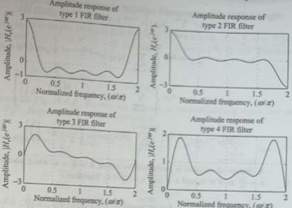{width=33%}  
Fig. 11.6 Amplitude responses of the four types of linear-phase FIR filters  

As shown in Fig. 11.3(b), the impulse response is symmetrical about $\frac{M-1}{2}$. Hence, $\vec{H}(e^{j\omega})$ can be expressed as  

$$
H ( e ^{j \omega} ) = \sum _ { n = 0 } ^{( M / 2 ) - 1} h ( n ) e ^{- j \omega n} + \sum _ { n = M / 2 } ^{M - 1} h ( n ) e ^{- j \omega n}
$$  

Using Eq. (11.12), this summation can be expressed as  

$$
\sum _ { n = M / 2 } ^{M - 1} h ( n ) e ^{- j \omega n} = \sum _ { n = M / 2 } ^{M - 1} h ( M - 1 - n ) e ^{- j \omega n}
$$  

A change of variable is performed by letting $k = M-1-n$, which also yields $n = M-1-k$, $k = \frac{M}{2} - 1$ as $n = \frac{M}{2}$, and $k = 0$ as $n = M-1$. Therefore,  

$$
\sum _ { n = M / 2 } ^{M - 1} h ( n ) e ^{- j \omega n} = \sum _ { n = M / 2 } ^{M - 1} h ( M - 1 - n ) e ^{- j \omega n} = \sum _ { k = 0 } ^{( M / 2 ) - 1} h ( k ) e ^{- j \omega ( M - 1 - k )}
$$  

Now replacing $k$ by $n$, this summation becomes  

$$
\sum _ { n = M / 2 } ^{M - 1} h ( n ) e ^{- j \omega n} = \sum _ { k = 0 } ^{( M / 2 ) - 1} h ( k ) e ^{- j \omega ( M - 1 - k )} = \sum _ { n = 0 } ^{( M / 2 ) - 1} h ( n ) e ^{- j \omega ( M - 1 - n )}
$$  

Substituting Eq. (11.24) into Eq. (11.23), we obtain  

$$
H ( e ^{j \omega} ) = \sum _ { n = 0 } ^{( M / 2 ) - 1} h ( n ) e ^{- j \omega n} + \sum _ { n = 0 } ^{( M / 2 ) - 1} h ( n ) e ^{- j \omega ( M - 1 - n )}
$$  

 ---------------------------------------------[ 第8页 ]---------------------------------------------  

$$
\begin{aligned} & = \sum _ { n = 0 } ^{( M / 2 ) - 1} h ( n ) \left[ e ^{- j \omega n} + e ^{- j \omega ( M - 1 - n )} \right] \\& = e ^{- j \omega \frac { M - 1} { 2 } } \left\{ \left( \sum _ { n = 0 } ^{( M / 2 ) - 1} h ( n ) \left[ e ^{j \omega ( \frac { M - 1} { 2 } - n ) } + e ^{- j \omega ( \frac { M - 1} { 2 } - n ) } \right] \right\} \\& H ( e ^{j \omega} ) = e ^{- j \omega \frac { M - 1} { 2 } } \left\{ \left( \sum _ { n = 0 } ^{( M / 2 ) - 1} 2 h ( n ) \cos \left[ \omega \left( \frac { M - 1 } { 2 } - n \right) \right] \right\} \\& H ( e ^{2 \omega} ) = e ^{- j \omega \frac { M - 1} { 2 } } \sum _ { n = 0 } ^{( M / 2 ) - 1} 2 h ( n ) \cos \left[ \omega \left( \frac { M } { 2 } - n - \frac { 1 } { 2 } \right) \right] \end{aligned}
$$  

A change of variable is performed by letting $k=\frac{M}{2}-n$, which also yields $n=\frac{M}{2}-k$, $k=\frac{M}{2}$ as $n=0$, and $k=1$ as $n=\frac{M}{2}-1$. Therefore,  

$$
\begin{array}{rl} & { H ( e ^{j \omega} ) = e ^{- j \omega \frac { M - 1} { 2 } } \sum _ { k = 1 } ^{( M / 2 )} 2 h \left( \frac { M } { 2 } - k \right) \cos \left[ \omega \left( k - \frac { 1 } { 2 } \right) \right] } \\& { H ( e ^{j \omega} ) = e ^{- j \omega \frac { M - 1} { 2 } } \sum _ { k = 1 } ^{( M / 2 )} b ( k ) \cos \left[ \omega \left( k - \frac { 1 } { 2 } \right) \right] = e ^{j \theta ( \omega )} H _ { r } ( e ^{j \omega} ) } \end{array}
$$  

where  

$$
b ( k ) = 2 \hbar \left( { \frac { M } { 2 } } - k \right) ,  1 \leq k \leq { \frac { M } { 2 } }
$$  

$$
\tau = - \frac { \theta ( \omega ) } { \omega } = - \frac { \omega ^{\frac { M - 1} { 2 } } } { \omega } = \frac { M - 1 } { 2 }
$$  

and the amplitude response is given as  

$$
H _ { r } ( e ^{2 \varphi} ) = \sum _ { k = 1 } ^{( M / 2 )} b ( k ) \cos \left[ \omega \left( k - \frac { 1 } { 2 } \right) \right]
$$  

Note that at $\omega=\pi$, we get  

# 11.3.3 Finite Impulse Response Digital Filter 597
#(M Odd) (M Odd) Finite Impulse Response with Odd Length  

In this case, the length $M$ is odd and the order $M-1$ is even, $\beta=\frac{\pi}{2}$, $\tau=\frac{M-1}{2}$ is an response is given as  

$$
\left. H _ { r } ( e ^{j \varpi} ) \right| _ { \varpi = \pi } = H _ { r } ( e ^{j \pi} ) = \underbrace { \sum _ { k = 1 } ^{( M / 2 )} b ( k ) \cos \left[ \pi \left( k - \frac { 1 } { 2 } \right) \right] } _ { = 0 } = 0
$$  

A typical amplitude response of Type-2 FIR filter is shown in Fig. 11.6. The amplitude response is symmetric about $\omega = 0$ and antisymmetric about $\omega = \pi$, and as a result, $H_r(e^{j\pi})$ is always zero. Hence, we cannot use this type (i.e., symmetric $h(n)$, $M$ even) to design either a high-pass filter (HPF) or a band-stop filter(BSF).  

$$
H ( e ^{j \omega} ) = \sum _ { n = 0 } ^{M - I} h ( n ) e ^{- j \omega n}
$$  

As shown in Fig. 11 $A(\alpha)$, the impulse response is antisymmetrical about the sample point $\frac{M-1}{2}$. Hence, $H(e^{i\omega})$ can be expressed as  

$$
\begin{array}{rl} { H ( e ^{i \omega} ) = } & { { } \sum _ { n = 0 } ^{( M - 3 ) / 2} h ( n ) e ^{- j \omega n} + h \left( { \frac { M - 1 } { 2 } } \right) e ^{- j \omega { \frac { M + 1} { 2 } } } + \sum _ { n = ( M + 1 ) / 2 } ^{M - 1} h ( n ) e ^{- j \omega n} } \\{ = } & { { } \sum _ { n = 0 } ^{( M - 3 ) / 2} h ( n ) e ^{- j \omega n} + 0 + \sum _ { n = ( M + 1 ) / 2 } ^{M - 1} h ( n ) e ^{- j \omega n} } \end{array}  ( 11 . 2 )
$$  

Using Eq. (11.15), this summation can be expressed as  

$$
\sum _ { n = ( M + 1 ) / 2 } ^{M - 1} h ( n ) e ^{- j \omega n} = - \sum _ { n = ( M - 1 ) / 2 } ^{M - 1} h ( M - 1 - n ) e ^{- j \omega n}
$$  

A change of variable is performed by letting $k = M - 1 - n$, which also yields $n = M - 1 - k$, $k = \frac{M - 3}{2}$ as $n = \frac{M + 1}{2}$, and $k = 0$ as $n = M - 1$. Therefore,  

$$
\begin{aligned} & \sum _ { n = ( M + 1 ) / 2 } ^{M - 1} h ( n ) e ^{- j \omega n} = - \sum _ { n = ( M + 1 ) / 2 } ^{M - 1} h ( M - 1 - n ) e ^{- j \omega n} \\& = - \sum _ { k = 0 } ^{( M - 3 ) / 2} h ( k ) e ^{- j \omega ( M - 1 - k )} \end{aligned}
$$  

Now replacing $k$ by $n$, this summation becomes  

$$
\begin{aligned} & \sum _ { n = ( M + 1 ) / 2 } ^{M - 1} h ( n ) e ^{- j \omega n} = - \sum _ { k = 0 } ^{( M - 3 ) / 2} h ( k ) e ^{- j \omega ( M - 1 - k )} \\& = - \sum _ { n = 0 } ^{( M - 3 ) / 2} h ( n ) e ^{- j \omega ( M - 1 - n )} \end{aligned}
$$  

Substituting Eq. (11.30) into Eq. (11.29), we obtain  

$$
\begin{array}{rl} { H ( e ^{j \omega t} ) = } & { { } \sum _ { n = 0 } ^{( M - 3 ) / 2} h ( n ) e ^{- j \omega n} - \sum _ { n = 0 } ^{( M - 3 ) / 2} h ( n ) e ^{- j \omega ( M - 1 - n )} } \\{ = } & { { } \sum _ { n = 0 } ^{( M - 3 ) / 2} h ( n ) \left[ e ^{- j \omega n} - e ^{- j \omega ( M - 1 - n )} \right] } \end{array}
$$  

 ---------------------------------------------[ 第9页 ]---------------------------------------------  

$$
\begin{aligned} & = e ^{- j \omega \frac { M - 1} { 2 } } \left\{ \sum _ { n = 0 } ^{( M - 3 ) / 2} h ( n ) \left[ e ^{j \omega \left( \frac { M - 3} { 2 } - n \right) } - e ^{- j \omega \left( \frac { M - 1} { 2 } - n \right) } \right] \right\} \\& = e ^{- j \omega \frac { M - 1} { 2 } } \sum _ { n = 0 } ^{( M - 3 ) / 2} 2 j \, h ( n ) \sin \left[ \omega \left( \frac { M - 1 } { 2 } - n \right) \right] \\& H ( e ^{j \omega} ) = j \, e ^{- j \omega \frac { M - 1} { 2 } } \sum _ { n = 0 } ^{( M - 3 ) / 2} 2 h ( n ) \sin \left[ \omega \left( \frac { M - 1 } { 2 } - n \right) \right] \end{aligned}
$$  

Since $e^{j\frac{\pi}{2}}=j$, this equation can be written as  

$$
H ( e ^{j \omega} ) = e ^{j \left( \frac { \pi} { 2 } - \omega \frac { M - 1 } { 2 } \right) } \sum _ { n = 0 } ^{( M - 3 ) / 2} 2 h ( n ) \sin \left[ \omega \left( \frac { M - 1 } { 2 } - n \right) \right]
$$  

A change of variable is performed by letting $k=\frac{M-1}{2}-n$, which also yields $n=\frac{M-1}{2}-k$, $k=\frac{M-1}{2}$ as $n=0$, and $k=1$ as $n=\frac{M-3}{2}$. Therefore,  

$$
\begin{array}{rl} { H ( e ^{\tilde { f} \omega } ) = e ^{\beta \left( \frac { \pi} { 2 } - \omega \frac { M - 1 } { 2 } \right) } \sum _ { k = 1 } ^{( M - 1 ) / 2} 2 \hbar \left( \frac { M - 1 } { 2 } - k \right) \sin \left( k \omega \right) } & { } \\{ H ( e ^{\tilde { f} \omega } ) = e ^{\beta \left( \frac { \pi} { 2 } - \omega \frac { M - 1 } { 2 } \right) } \sum _ { k = 1 } ^{( M - 1 ) / 2} c ( k ) \sin \left( k \omega \right) = e ^{\beta \theta ( \omega )} H _ { \tau } ( e ^{\tilde { f} \omega } ) } & { } \end{array}
$$  

where  

$$
c ( k ) = 2 h \left( \frac { M - 1 } { 2 } - k \right) ,  1 \leq k \leq \frac { M - 1 } { 2 }
$$  

$$
\tau _ { \theta } = - \frac { d \theta ( \omega ) } { d \omega } = - \frac { d } { d \omega } \left( \frac { \pi } { 2 } - \omega \frac { M - 1 } { 2 } \right) = \frac { M - 1 } { 2 }
$$  

and the amplitude response is given by  

$$
H _ { r } ( e ^{j \omega} ) = \sum _ { k = 1 } ^{( M - 1 ) / 2} c ( k ) \sin ( k \omega )
$$  

Note that at $\omega=0$ and $\omega=\pi$, we get  

$$
\begin{array}{rl} & { \left. H _ { r } ( e ^{j \omega} ) \right| _ { \omega = 0 } = H _ { r } ( e ^{j 0} ) = \sum _ { k = 1 } ^{( M - 1 ) / 2} c ( k ) \sin { ( 0 ) } = 0 } \\& { \left. H _ { r } ( e ^{j \omega} ) \right| _ { \omega = \pi } = H _ { r } ( e ^{j \pi} ) = \sum _ { k = 1 } ^{( M - 1 ) / 2} c ( k ) \sin { ( k \pi ) } = 0 } \end{array}
$$  

Finite Impulse Response Digital Filter 599 type is purely imaginary, it is suitable for the designing of digital Hilbert transformers and differentiators.  

A typical amplitude response of Type-3 FIR filter is shown in Fig. 11.6. The amplitude response is antisymmetric about both $\omega = 0$ and $\omega = \pi$, and as a result, $H_r(e^{j0})$ and $H_r(e^{j^*})$ are always zero. Hence, this type cannot be used to design either a low-pass filter (LPF) or a HPF or a BSF. We know that the frequency response of digital differentiators and Hilbert transformers is purely imaginary (see Sections 7.15 and 7.16), that is, each can provide $90^\circ$ phase shift. As the frequency response [Eq. (11.31)] of this  

# 11.3.4 Type-4: Antisymmetric Impulse Response with Even Lenath (M Even)  

In this case, the length $M$ is even and the order $M-1$ is odd, $\beta=\frac{\pi}{2}$, $\tau=\frac{M-1}{2}$ is not as  

$$
H ( e ^{j \omega} ) = \sum _ { n = 0 } ^{M - 1} h ( n ) e ^{- j \omega n}
$$  

As shown in Fig. 11.4(b), the impulse response is symmetrical about $\frac{M-1}{2}$. Hence, $H(e^{j\omega})$ can be expressed as  

$$
H ( e ^{j \omega} ) = \sum _ { n = 0 } ^{( M / 2 ) - 1} h ( n ) e ^{- j \omega n} + \sum _ { n = M / 2 } ^{M - 1} h ( n ) e ^{- j \omega n}
$$  

Using Eq. (11.15), this summation can be expressed as  

$$
\sum _ { n = M / 2 } ^{M - 1} h ( n ) e ^{- 2 \omega n} = - \sum _ { n = M / 2 } ^{M - 1} h ( M - 1 - n ) e ^{- 2 \omega n}
$$  

A change of variable is performed by letting $k = M-1-n$, which also yields $n = M-1-k$, $k = \frac{M}{2} - 1$ as $n = \frac{M}{2}$, and $k = 0$ as $n = M-1$. Therefore,  

$$
\sum _ { n = M / 2 } ^{M - 1} h ( n ) e ^{- j \omega n} = - \sum _ { n = M / 2 } ^{M - 1} h ( M - 1 - n ) e ^{- j \omega n} = - \sum _ { k = 0 } ^{( M / 2 ) - 1} h ( k ) e ^{- j \omega ( M - 1 - k )}
$$  

Now replacing $k$ by $n$, this summation becomes  

$$
\sum _ { n = M / 2 } ^{M - 1} h ( n ) e ^{- j \omega n} = - \sum _ { k = 0 } ^{( M / 2 ) - 1} h ( k ) e ^{- j \omega ( M - 1 - k )} = - \sum _ { n = 0 } ^{( M / 2 ) - 1} h ( n ) e ^{- j \omega ( M - 1 - n )}
$$  

Substituting Eq. (11.37) into Eq. (11.36), we obtain  

$$
\begin{aligned} H \left( e ^{j \omega} \right) & = \sum _ { n = 0 } ^{( M / 2 ) - 1} h ( n ) e ^{- j \omega n} - \sum _ { n = 0 } ^{( M / 2 ) - 1} h ( n ) e ^{- j \omega ( M - 1 - n )} \\& = \sum _ { n = 0 } ^{( M / 2 ) - 1} h ( n ) \left[ e ^{- j \omega n} - e ^{- j \omega ( M - 1 - n )} \right] \\& = e ^{- j \omega \frac { M - 1} { 2 } } \left\{ \sum _ { n = 0 } ^{( M / 2 ) - 1} h ( n ) \left[ e ^{j \omega ( \frac { M - 1} { 2 } - n ) } - e ^{- j \omega ( \frac { M - 1} { 2 } - n ) } \right] \right\} \\H \left( e ^{j \omega} \right) & = e ^{- j \omega \frac { M - 1} { 2 } } \left\{ \sum _ { n = 0 } ^{( M / 2 ) - 1} 2 j \, h ( n ) \sin \left[ - \left( \frac { M - 1 } { 2 } - n \right) \right] \right\} \end{aligned}
$$  

 ---------------------------------------------[ 第10页 ]---------------------------------------------  

$$
H ( e ^{j \omega} ) = j e ^{- j \omega \frac { M} { 2 } - \frac { 1 } { 2 } } \sum _ { n = 0 } ^{( M / 2 ) - 1} 2 h ( n ) \sin \left[ \omega \left( \frac { M } { 2 } - n - \frac { 1 } { 2 } \right) \right]
$$  

Since $e^{j\frac{1}{2}}=j$, this equation can be written as  

$$
H ( e ^{\beta \omega} ) = e ^{\beta \left( \frac { \pi} { 2 } - \omega \frac { M - 1 } { 2 } \right) } \sum _ { n = 0 } ^{( M / 2 ) - 1} 2 h ( n ) \sin \left[ \omega \left( \frac { M } { 2 } - n - \frac { 1 } { 2 } \right) \right]
$$  

A change of variable is performed by letting $k=\frac{M}{2}-n$, which also yields $n=\frac{M}{2}-k$, $k=\frac{M}{2}$ as $n=0$, and $k=1$ as $n=\frac{M}{2}-1$. Therefore,  

$$
\begin{array}{rl} { H ( e ^{j \omega} ) = e ^{j \left( { \frac { \pi} { 2 } } - \omega { \frac { M - 1 } { 2 } } \right) } \sum _ { k = 1 } ^{( M / 2 )} 2 h \left( { \frac { M } { 2 } } - k \right) \sin \left[ \omega \left( k - { \frac { 1 } { 2 } } \right) \right] } & { } \\{ H ( e ^{j \omega} ) = e ^{j \left( { \frac { \pi} { 2 } } - \omega { \frac { M - 1 } { 2 } } \right) } \sum _ { k = 1 } ^{( M / 2 )} d ( k ) \sin \left[ \omega \left( k - { \frac { 1 } { 2 } } \right) \right] = e ^{j \theta ( \omega )} H _ { + } ( e ^{j \omega} ) } & { } \end{array}
$$  

where  

$$
d ( k ) = 2 h \left( { \frac { M } { 2 } } - k \right) ,  1 \leq k \leq { \frac { M } { 2 } }
$$  

$$
\tau _ { g } = - \frac { d \theta ( \omega ) } { d \omega } = - \frac { d } { d \omega } \left( \frac { \pi } { 2 } - \omega \frac { M - 1 } { 2 } \right) = \frac { M - 1 } { 2 }
$$  

and the amplitude response is given as  

$$
H _ { r } ( e ^{j \omega} ) = \sum _ { k = 1 } ^{( M / 2 )} d ( k ) \sin \left[ \omega \left( k - \frac { 1 } { 2 } \right) \right]
$$  

Note that at $\omega=0$, we get  

$$
\left. H _ { r } ( e ^{j \omega} ) \right| _ { \omega = 0 } = H _ { r } ( e ^{j 0} ) = \sum _ { k = 1 } ^{( M - 1 ) / 2} d ( k ) \sin ( 0 ) = 0
$$  

Table 11.1 Amplitude response characteristics of the four types of linear-phase sequences   

| Type | h(n) | M | $H r (e iω )$ | $H r (e iω )$ | Applications |
| --- | --- | --- | --- | --- | --- |
| 1 | Symmetric | Odd | $∑ 2/2 a(k) cos(kω)$ | Even and no restriction | All filter types, only sequence for BSF |
| 2 | Symmetric | Even | $∑ 2/2 b(k) cos[ω(k-1/2)]$ | Odd and H(e jx )=0 | Only LPF and BPF |
| 3 | Antisymmetric | Odd | $∑ 2/2 c(k) sin(kω)$ | Odd and H(e jx )=0, H(e jx )=0 | BPF, differentiators, and Hilbert transformers |
| 4 | Antisymmetric | Even | $∑ 2/2 d(k)sin[ω(k-1/2)]$ | Even and H(e jx )=0 | HPF, BPF, differentiators, and Hilbert transformers |  

A typical amplitude response of Type-4 FIR filter is shown in Fig. 11.6. The amplitude response is antisymmetric about $\omega = 0$ and symmetric about $\omega = \pi$, and as a result, $H_{r}(e^{j0})$ is always zero. Hence, this type cannot be used to design either an LPF or a BSF. As the frequency response [Eq. (11.38)] of this type is purely imaginary, it is suitable for the designing of digital Hilbert transformers and differentiation.  

linear-phase sequences and their use in FIR filter design.  

$$
\mathrm { f r e q u e n c y ~ r e s p o n s e ~ i s ~ g i v e n ~ a s }
$$  

Example 11.4 Does $H(z)=1+2z^{-1}+2z^{-2}+z^{-3}$ describe a linear-phase filter? Determine its frequency response and calculate the phase delay and group delay.  

Solution: Taking the inverse $z$-transform of $H(z)$, we get  

$$
\begin{array}{rl} { H ( z ) \bigg | _ { z \ldots \ldots } = H ( e ^{j \omega} ) = 1 + 2 e ^{- j \omega} + 2 e ^{- j 2 \omega} + e ^{- j 3 \omega} } & { { } } \\{ = e ^{- j 1 \frac { 1} { 2 } \omega } \left[ e ^{j \frac { 1} { 2 } \omega } + 2 e ^{j \frac { 1} { 3 } } + 2 e ^{- j \frac { 1} { 5 } } + e ^{- j \frac { 1} { 3 } \omega } \right] } & { { } } \\{ H ( e ^{j \omega} ) = e ^{- j \frac { 1} { 2 } \omega } \left[ 4 \cos \left( \frac { \omega } { 2 } \right) + 2 \cos \left( \frac { 3 \omega } { 2 } \right) \right] } & { { } } \\{ = e ^{j \theta ( \omega )} H _ { r } ( e ^{j \omega} ) } & { { } } \end{array}
$$  

$$
\begin{array}{rl} { H ( z ) = 1 + 2 z ^{- 1} + 2 z ^{- 2} + z ^{- 3} } & { } \\{ h ( n ) = \delta ( n ) + 2 \delta ( n - 1 ) + 2 \delta ( n - 2 ) + \delta ( n - 3 ) } & { } \\{ = \{ { \frac { 1 } { 1 } } , 2 , 2 , 1 \} } & { } \end{array}
$$  

The phase response is given by $\theta(\omega) = -\frac{3}{2}\omega$. The phase delay and group delay are given as  

Here $M=4$. Since $h(n)$ is symmetric about $\frac{M-1}{2}=1.5$, $H(z)$ describes a linear-phase FIR filter. The  

$$
\tau _ { \theta } = - \frac { \theta ( \omega ) } { \omega } = \frac { 3 } { 2 } ,  \tau _ { \theta } = - \frac { d \theta ( \omega ) } { d \omega } = \frac { 3 } { 2 }
$$  

# 11.3.5 Location of Zeros of Linear-phase Finite Impulse Response Transfer Functions  

We know that for a FIR filter of length-$M$ (filter order $= M-1$), there are $(M-1)$ (trivial) poles at the origin and $(M-1)$ zeros located somewhere in the $z$-plane. For linear-phase FIR filters, these zeros possess certain symmetries that are due to the symmetry conditions on $h(n)$. The impulse response of a linear-phase filter is either symmetric or antisymmetric, that is, $h(n) = \pm h(M-1-n)$. Let $H(z)$ be the $z$-transform of $h(n)$, that is,  

$$
\begin{array}{rl} & { \hbar ( n ) \longleftrightarrow H ( z ) } \\& { \hbar ( n + M - 1 ) \longleftrightarrow z ^{M - 1} H ( z )  \mathrm { t i m e ~ s h i f t i n g ~ p r o p e r t y } } \\& { \hbar ( - n + M - 1 ) = \hbar ( M - 1 - n ) \longleftrightarrow z ^{- ( M - 1 )} H ( z ^{- 1} )  \mathrm { t i m e ~ r e v e r s a l ~ p r o p e r t y } } \end{array}
$$  

An FIR filter has linear phase if its impulse response satisfies the following condition:  

$$
\begin{array}{rl} { h ( n ) = \pm h ( M - 1 - n ) , } & { 0 \leq n \leq M - 1 } \\{ H ( z ) = \pm z ^{- ( M - 1 )} H ( z ^{- 1} ) = \pm z ^{- ( M - 1 )} H \left( { \frac { 1 } { z } } \right) } & { } \end{array}
$$  

A polynomial $H(z)$, which has symmetric coefficients, is a mirror image polynomial and one with antisymmetric coefficients is an anti-mirror image polynomial.

Suppose $z = z_0$ is a zero of $H(z)$, that is, $H(z_0) = 0$, then it follows from Eq. (11.43) that $H(z_0^{-1}) = 0$. Consequently, we can say that if $z_0$ is a zero of $H(z)$, then so is its  

 ---------------------------------------------[ 第11页 ]---------------------------------------------  

reciprocal $z_{0}^{-1}=\frac{1}{z_{0}}$. We have shown that the zeros of a mirror image and an anti-mirror image polynomial occur in pairs $z_{0}$ and $z_{0}^{-1}$. In most applications, $h(n)$ is real, that is,  

$$
\begin{array}{rl} { h ( n ) = h ^{*} ( n ) } \\{ H ( z ) = H ^{*} ( z ^{*} ) } \end{array}
$$  

then, we have $H(z)=H^{*}(z^{*})$  

Hence, a zero at $z = z_0$ is associated with a zero at $z = z_0^*$. When $h(n)$ is real and satisfies the symmetrical condition, we have  

$$
\begin{array}{rl} & { h ( n ) = \pm h ( M - 1 - n ) = h ^{*} ( n ) = \pm h ^{*} ( M - 1 - n ) } \\& { H ( z ) = \pm z ^{- ( M - 1 )} H \left( \frac { 1 } { z } \right) = H ^{*} ( z ^{*} ) = \pm \left( z ^{*} \right) ^{- ( M - 1 )} H ^{*} \left( \frac { 1 } { z ^{*} } \right) } \end{array}
$$  

Thus, if $H(z)$ has a zero at $z = z_1 = re^{j\theta}$, then there must be a zero at $z = \frac{1}{z_1} = \frac{1}{r}e^{-j\theta}$, $z = z_1^* = re^{-j\theta}$, and $z = \frac{1}{z_1^*} = \frac{1}{r}e^{j\theta}$. Thus, a general zero constellation is a quadruplet, that is,  

$$
z _ { 1 } = r e ^{j \theta} ,  \frac { 1 } { z _ { 1 } } = \frac { 1 } { r } e ^{- j \theta} ,  z _ { 1 } ^{*} = r e ^{- j \theta} ,  \mathrm { a n d }  \frac { 1 } { z _ { 1 } ^{*} } = \frac { 1 } { r } e ^{j \theta}
$$  

as shown in Fig. 11.7. Clearly, if $r=1$, then $\frac{1}{r}=1$, and hence, the zeros are on the unit circle and occur in pairs. For example, if $z=z_{2}$ is a zero on the unit circle, that is, $z=z_{2}=e^{j\theta}$, $|z_{2}|=1$, then $z_{2}^{-1}=z_{2}^{*}$. There are two zeros in this group, namely  

$$
z _ { 2 } = e ^{j \theta} ,  \mathrm { a n d }  z _ { 2 } ^{- 1} = z _ { 2 } ^{*} = e ^{- j \theta}
$$  

as shown in Fig. 11.7. If $\theta=0$ or $\theta=\pi$, the zeros are on the real line and occur in pairs. A real zero is paired with its reciprocal zero appearing at  

$$
z _ { 3 } = r ,  \mathrm { a n d }  z _ { 3 } ^{- 1} = \frac { 1 } { r }
$$  

as shown in Fig. 11.7. If $r=1$ and $\theta=0$ or $\theta=\pi$, then the zeros are either at $z=z_4=1$ or $\cdot z=z_5=-1$. Note that a zero at $z=\pm1$ is its own reciprocal, implying that this group contains only one zero.  

For a Type-2 FIR filter, we have $H(z) = z^{-(M-1)}H(z^{-1})$. At $z = -1$, we get  

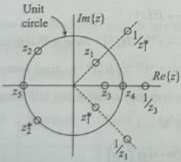{width=14%}  
Fig. 11.7 Location of zeros  

$$
H ( - 1 ) = ( - 1 ) ^{- \langle M - 1 \rangle} H ( - 1 ) = - H ( - 1 )
$$  

implying that $H(-1)=0$. Therefore, a Type-2 FIR filter must have a zero at $z=-1$.  

For a Type-3 FIR filter, we have $H(z) = -z^{-(M-1)}H(z^{-1})$. At $z = 1$ and $z = -1$, we get  

$$
\begin{array}{rl} { H ( 1 ) = - ( 1 ) ^{- ( M - 1 )} H ( 1 ) = - H ( 1 ) } & { } \\{ H ( - 1 ) = - ( - 1 ) ^{- ( M - 1 )} H ( - 1 ) = - H ( - 1 ) } & { } \end{array}
$$  

Finite Impulse Response Digital Filter 603 implying that $H(1)=H(-1)=0$. Therefore, a Type-3 FIR filter must have zeros at $z=1$ and $z=-1$.

For a Type-4 FIR filter, we have $H(z)=-2^{-(M-1)}H(z^{-1})$. At $z=1$, we get $H(1)=-(1)^{-(M-1)}H(1)=-H(1)$  

implying that $H(1)=0$. Therefore, a Type-4 FIR filter must have zeros at $z=1$.
Note that a simple zero either at $z=\pm1$ is zero.  

$1 \pm z^{-1}$, which does not satisfy Eq. (11.43). An even number of zeros results in a power of $(1 \pm z^{-1})^2 = (1 \pm 2z^{-1} + z^{-2})$, which is symmetric. Summarizing the above discussion, we conclude the following:  

1. Type-1 FIR filters have either an even number of zeros or no zeros at $z=1$ and $z=-1$.

2. Type-2 FIR filters have an even number of zeros or no zeros at $z=1$ and an odd number of zeros at $z=-1$.

3. Type-3 FIR filters have an odd number of zeros at $z=1$ and $z=-1$.

4. Type-4 FIR filters have an odd number of zeros at $z=1$ and either an even number of zeros or no zeros at $z=-1$.  

These four summary points confirm our discussion on the frequency response of the four types of linear-phase FIR filters as discussed in previous sections. A zero at $z=1$ corresponds to $\omega=0$, and a zero at $z=-1$ corresponds to $\omega=\pi$. The Type-1 FIR filters have no restriction on zeros and can be used to design any type of filter. The Type-2 FIR filter always has a zero at $z=-1$, and therefore, it cannot be used to design either a HPF or a BSF. The Type-3 FIR filter always has zeros at both $z=1$ and $z=-1$, and therefore, it cannot be used to design either an LPF or a HPF or a BSF. The Type-4 FIR filter always has a zero at $z=1$ and therefore, it cannot be used to design either an LPF or a BSF filter.  

Example 11.5 Find all the zero locations and the transfer function of a causal Type-1 linear-phase FIR filter of minimum length if it has a zero at $z=0.5$ $e^{j\frac{7}{5}}$ and a zero at $z=1$.  

# Solution:  

The zero at $z = z_0 = 0.5$ $e^{j\frac{7}{2}}$ implies the quadruple zeros.  

$$
\begin{array}{rl} { z _ { 0 } = 0 . 5 \ e ^{j \frac { \pi} { 3 } } , } & { { } \frac { 1 } { z _ { 0 } } = 2 \ e ^{- j \frac { \pi} { 3 } } , } \\{ z _ { 0 } ^{*} = 0 . 5 \ e ^{- j \frac { \pi} { 3 } } , } & { { } \mathrm { a n d }  \frac { 1 } { z _ { 0 } ^{*} } = 2 \ e ^{j \frac { \pi} { 3 } } } \end{array}
$$  

For a Type-1 linear-phase FIR filter, the number of zeros at $z = 1$ must be even. Hence, there must be another zero at $z = 1$. Thus, we have a total of six zeros. The transfer function has the following form:  

$$
H ( z ) = ( z - z _ { 0 } ) \left( z - z _ { 0 } ^{*} \right) \left( z - \frac { 1 } { z _ { 0 } } \right)
$$  

$$
\begin{aligned} & \times \left( z - \frac { 1 } { z _ { 0 } ^{2} } \right) \left( z - 1 \right) ^{2} \\& = \left( z - 0 . 5 \, e ^{i \frac { \pi} { 2 } } \right) \left( z - 0 . 5 \, e ^{- j \frac { \pi} { 2 } } \right) \\& \times \left( z - 2 \, e ^{- j \frac { \pi} { 2 } } \right) \left( z - 2 \, e ^{i \frac { \pi} { 2 } } \right) \left( z - 1 \right) ^{2} \\& = \left( z ^{2} - z \cos \frac { \pi } { 3 } + 0 . 25 \right) \\& \times \left( z ^{2} - 4 z \cos \frac { \pi } { 3 } + 4 \right) \left( z ^{2} - 2 z + 1 \right) \\& = \left( z ^{2} - 0 . 5 z + 0 . 25 \right) \left( z ^{2} - 2 z + 4 \right) \\& \times \left( z ^{2} - 2 z + 1 \right) \\& ( z ) = z ^{4} - 4 . 5 z ^{4} + 11 . 25 z ^{4} \\& - 15 . 5 z ^{2} + 11 . 25 z ^{2} - 4 . 5 z + 1 \end{aligned}
$$  

The transfer function and impulse response of the causal Type-I linear-phase FIR filter with minimum delay is as  

 ---------------------------------------------[ 第12页 ]---------------------------------------------  

$$
\begin{array}{rl} { H ( z ) = 1 - 4 . 5 z ^{- 1} + 11 . 25 z ^{- 2} - 15 . 5 z ^{- 3} } & { { } } \\{                                                                                                                                                                                                                                                                                                                                                                                                                                                                                                                                                                                                                                                                                                                                                                                                                                                                                                                                                                                                                                                                                                                                                                                                                                                                                                                                                                                                                                                                                                                                                                                                                                                                                                                                                                                                                                                                                                                                                                                                                                                                                             
$$  

Since the impulse response is symmetric, it is a linear-phase FIR filter.  

Example 11.6 Find the transfer function and impulse response of a causal Type-3 linear-phase FIR filter of minimum length if it has a zero at $z=j$ and two zeros at $z=1$.  

Solution:  

The zero at $z=\tilde{z}_0=j$ must be paired with its conjugate $z=z_0^*=-j$. A Type-3 FIR filters have an odd number of zeros at $z=1$ and $z=-1$. Hence, the minimum number of zeros required is one zero at $z=-1$ and three zeros at $z=1$ (with two already present). Thus, we have a total of six zeros. The transfer function has the following form:  

$$
\begin{array}{rl} { H ( z ) = ( z - z _ { 0 } ) \left( z - z _ { 0 } ^{*} \right) ( z + 1 ) \left( z - 1 \right) ^{3} } & { { } } \\{ = ( z - j ) ( z + j ) ( z + 1 ) ( z - 1 ) ^{3} } & { { } } \\{ H ( z ) = z ^{6} - 2 z ^{6} + z ^{4} - z ^{2} + 2 z - 1 } & { { } } \end{array}
$$  

The transfer function and impulse response of the causal Type-3 linear-phase FIR filter with minimum delay is as  

$$
\begin{array}{rl} { H ( z ) = 1 - 2 z ^{- 1} + z ^{- 2} - z ^{- 4} + 2 z ^{- 5} - z ^{- 6} } & { } \\{ h ( n ) = \{ 1 , - 2 , 1 , 0 , - 1 , 2 , - 1 \} } & { } \end{array}
$$  

Since the impulse response is antisymmetric, it is a linear-phase FIR filter.  

The magnitude response specifications of a digital filter are given for frequencies $[0, \pi]$ due to the periodicity and the even characteristics of the magnitude response. The phase response of digital filters is not often specified as the magnitude response. In many  

Example 11.7 A length 9 Type-1 real coefficient FIR filter has the following zeros $z_1 = -0.5$, $z_2 = 0.3 + j0.5$, and $z_3 = \frac{1}{2} + j\frac{\sqrt{3}}{2}$. (a) Determine the locations of the remaining zeros. (b) What is the transfer function?  

# 11.4 FILTER SPECIFICATIONS  

# Solution:  

A real zero at $z_{1}=-0.5$ is paired with its reciprocal $\frac{1}{z_{1}}=-\frac{1}{0.5}=-2$. The zero at $z_{2}=0.3+j0.5$ implies that $|z_{2}|=0.5831$. This zero is located inside the unit circle. There are four zeros in this group.  

$$
\begin{array}{rl} { z _ { 2 } = 0 . 3 + j 0 . 5 , } & { { } \frac { 1 } { z _ { 2 } } = \frac { 15 } { 17 } - j \frac { 25 } { 17 } , } \\{ z _ { 2 } ^{*} = 0 . 3 - j 0 . 5 , } & { { } \mathrm { a n d }  \frac { 1 } { z _ { 2 } ^{*} } = \frac { 15 } { 17 } + j \frac { 25 } { 17 } } \end{array}
$$  

The zero at $z_3 = \frac{1}{2} + j\frac{\sqrt{3}}{2} = e^{j\frac{8}{5}}$ implies that $|z_3| = 1$. This zero is located on the unit circle. There are two zeros in this group:  

$$
z _ { 3 } = e ^{2 \frac { \pi} { 3 } }  \mathrm { a n d }  z _ { 3 } ^{*} = e ^{- j \frac { \pi} { 3 } } .
$$  

Thus, we have a total of seven zeros. The transfer function has the following form:  

$$
\begin{aligned} H(z) & =\left(z-z_{1}\right)\left(z-\frac{1}{z_{1}}\right)\left(z-z_{2}\right)\left(z-z_{2}^{\bullet}\right) \\& \times\left(z-\frac{1}{z_{2}}\right)\left(z-\frac{1}{z_{2}^{2}}\right)\left(z-z_{3}\right)\left(z-z_{3}^{\bullet}\right) \\& =\left(z+0.5\right)\left(z+2\right)\left(z-0.3-j0.5\right) \\& \times\left(z-0.3+j0.5\right)\left(z-\frac{15}{17}+j\frac{25}{17}\right) \\& \times\left(z-\frac{15}{17}-j\frac{25}{17}\right) \\& \times\left(z-e^{\prime\frac{\pi}{3}}\right)\left(z-e^{-j\frac{\pi}{3}}\right) \\& =\left(z^{2}+2.5z+1\right)\left(z^{2}-0.6z+0.34\right) \\& \times\left(z^{2}-\frac{30}{17}z+\frac{50}{17}\right)\left(z^{2}-x+1\right) \\& H(z) & z^{8}-0.8647z^{7}+0.2929z^{8}+6.8276z^{5} \\& +7.2641z^{4}+6.8276z^{3}+0.2929z^{2} \\& -0.8647z+1 \end{aligned}
$$  

The transfer function of the causal Type-1 linear-phase FIR filter is as  

Finite Impulse Response Digital Filter 605 cases, it is sufficient to indicate that the phase distortion is of concern or that linear phase response is desirable.

Filters are typically specified by frequency specifications and attenuation (or gain) specifications. Frequency specifications include the pass-band and stop-band edge frequencies. Typical magnitude (or gain) specifications include the pass-band attenuation (or gain or ripple) and the stop-band attenuation (or gain or ripple). On a linear scale, attenuation equals the reciprocal of gain, that is.  

$$
\begin{array}{rl} { H ( z ) = 1 - 0 . 86 47 z ^{- 1} + 0 . 29 29 z ^{- 2} + 6 . 82 76 z ^{- 3} } \\{ + 7 . 26 41 z ^{- 4} + 6 . 82 76 z ^{- 5} + 0 . 29 29 z ^{- 6} } \\{ - 0 . 86 47 z ^{- 7} + z ^{- 8} } \end{array}
$$  

Gain: $G = |H(e^{j\omega})|$ and attenuation: $A = \frac{1}{G} = \frac{1}{|H(e^{j\omega})|}$

On a decibel (dB) scale, attenuation equals the negative of dB gain, that is,

Gain: $G_{\text{dB}} = 20\log_{10} G$

$= 20\log_{10}|H(e^{j\omega})|$

Attenuation: $A_{\text{dB}} = 20\log_{10}\left(\frac{1}{G}\right) = 20\log_{10}\left(\frac{1}{|H(e^{j\omega})|\right) = -20\log_{10}|H(e^{j\omega})|$  

The pass-band $[0,\omega_{p}]$ is the band of frequencies for which the attenuation-specification is the smallest; the stop-band $[\omega_{s},\pi]$ is the band of frequencies for which the attenuation specification is the greatest; and the transition band $[\omega_{p},\omega_{s}]$ is the frequency band where the filter is not specified. The width of the transition band determines how sharp the filter is. The magnitude response decreases monotonically from the pass-band to the stop-band in this region. The frequency $\omega_{p}$ is the pass-band edge frequency and $\omega_{s}$ is the stop-band edge frequency.  

# 11.4.1 Absolute Specifications  

A typical absolute specification of an LPF is shown in Fig. 11.8. The band [0, $\omega_{p}$] is called the pass-band, and $\delta_{p}$ is the pass-band tolerance. The band $[\omega_{s},\pi]$ is called the stop-band, and $\delta_{s}$ is the stop-band tolerance. The band $[\omega_{p},\omega_{s}]$ is called the transition band, and there are no restrictions on the magnitude response in this band.  

In the pass-band, the magnitude response oscillates between $1-\delta_{p}$ and $1+\delta_{p}$, where $\delta_{p}$ is the maximum deviation from unity gain. $\delta_{p}$ is also called as pass-band ripple (or  

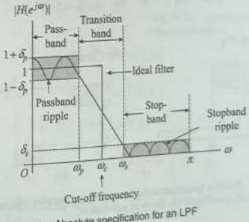{width=20%}  

 ---------------------------------------------[ 第13页 ]---------------------------------------------  

pass-band tolerance). In the stop-band, the magnitude response oscillates between $-\delta$, and $\delta_{s}$, where $\delta_{s}$ is the maximum deviation from zero gain. It is also called as stop-band ripple (or stop-band tolerance). The pass-band and stop-band are specified as  

$$
\begin{array}{r} { 1 - \delta _ { p } \leq | H ( e ^{j \omega} ) | \leq 1 + \delta _ { p }  \mathrm { f o r }  0 \leq \omega \leq \omega _ { p }  \mathrm { w i t h }  \delta _ { p } \ll 1 } \\{ | H ( e ^{j \omega} ) | \leq \delta _ { s } ,  \mathrm { f o r }  \omega _ { s } \leq \omega \leq \pi  \mathrm { w i t h }  \delta _ { s } \ll 1 } \end{array}
$$  

The ripple values $\delta_{p}$ and $\delta_{s}$ specify the acceptable tolerances in terms of absolute values and hence the term absolute specifications. Absolute specifications are generally used for FIR filters.  

# 11.4.2 Relative Specifications  

A typical relative specification of LPF is shown in Fig. 11.9(a). We can obtain the relative specification by normalizing the absolute specification. In absolute specification, $|H(e^{j\omega})|_{\max} = 1 + \delta_{\mathrm{p}}$. The relative specifications are defined as  

$$
\begin{array}{rl} { { \frac { 1 - \delta _ { p } } { 1 + \delta _ { p } } } \leq | H ( e ^{j \omega} ) | \leq 1 } & { { \mathrm { f o r ~ } } 0 \leq \omega \leq \omega _ { p } } \\{ | H ( e ^{j \omega} ) | \leq { \frac { \delta _ { s } } { 1 + \delta _ { p } } } } & { { \mathrm { f o r ~ } } \omega _ { s } \leq \omega \leq \pi } \end{array}
$$  

or equivalently  

$$
\begin{array}{r} { \delta _ { 1 } \leq | H ( e ^{j \omega} ) | \leq 1  \mathrm { f o r }  0 \leq \omega \leq \omega _ { p } } \\{ | H ( e ^{j \omega} ) | \leq \delta _ { 2 }  \mathrm { f o r }  \omega _ { s } \leq \omega \leq \pi } \end{array}
$$  

where $\delta_{1}=\frac{1-\delta_{p}}{1+\delta_{p}}$ and $\delta_{2}=\frac{\delta_{s}}{1+\delta_{p}}$. The maximum pass-band attenuation $A_{p}$ is also called as peak-to-peak pass-band ripple or peak pass-band ripple by some authors. Relative specifications are also defined in logarithmic unit (dB) as shown in Fig. 11.9(b) and (c). The dB scale is an indicator of attenuation. On the dB scale, the unit gain corresponds to 0 dB attenuation. The maximum pass-band attenuation and minimum stop-band attenuation are measured by $A_{p}$-dB and $A_{s}$-dB, respectively. These corresponds to minimum pass-band gain of $-A_{p}$-dB and a maximum stop-band gain of $-A_{s}$-dB, respectively. The relative (dB) specifications are defined (in terms of gain) as  

$$
\begin{array}{r} { - A _ { p } \leq | H ( e ^{j \omega} ) | _ { \mathrm { d B } } \leq 0  \mathrm { f o r }  0 \leq \omega \leq \omega _ { p } } \\{ | H ( e ^{j \omega} ) | _ { \mathrm { d B } } \leq - A _ { s }  \mathrm { f o r }  \omega _ { s } \leq \omega \leq \pi } \end{array}
$$  

$$
\begin{array}{rl} { 0 \leq | H ( e ^{j \omega} ) | _ { \mathrm { d B } } \leq A , } & { \mathrm { f o r }  0 \leq \omega \leq \omega _ { p } } \\{ | H ( e ^{j \omega} ) | _ { \mathrm { d B } } \geq A , } & { \mathrm { f o r }  \omega _ { p } = \omega _ { p } . } \end{array}
$$  

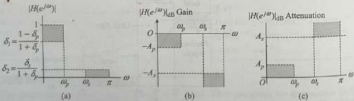{width=40%}  
Fig. 11.9 Relative specification (a) For an LPF (b) Relative (dB) specification in terms of gain (c) Relative (dB) specification in terms of attenuation  

where  

$$
\begin{array}{rl} { A _ { p } } & { { } = 20 \log _ { 10 } \left( { \frac { 1 + \delta _ { p } } { 1 - \delta _ { p } } } \right) = - 20 \log _ { 10 } \left( { \frac { 1 - \delta _ { p } } { 1 + \delta _ { p } } } \right) } \\{ A _ { s } } & { { } = 20 \log _ { 10 } \left( { \frac { 1 + \delta _ { p } } { \delta _ { s } } } \right) = - 20 \log _ { 10 } \left( { \frac { \delta _ { s } } { 1 + \delta _ { s } } } \right) . } \end{array}
$$  

Eqs (11.49) and (11.50) implies that  

$$
\begin{array}{rl} { \delta _ { p } = { \frac { 10 ^{A _ { p} / 20 } - 1 } { 10 ^{A _ { p} / 20 } + 1 } } } \\{ \delta _ { s } = ( 1 + \delta _ { p } ) \mathrm { I } 0 ^{- A _ { s} / 20 } \approx 10 ^{- A _ { s} / 20 } } \end{array}
$$  

(11.52)

For a well-designed filter, typically $A_{p} \simeq 0$ and $A_{*} \gg 1$. Suppose maximum pass-band attenuation ($A'_{p}$) and minimum stop-band attenuation ($A'_{*}$) are given, then it may or may not be possible to achieve the required specifications exactly. If it is possible, then that would be just fine. If it is not possible to get the exact specifications, then the next best thing is to design a filter such that $A_{p} \leq A'_{p}$, and $A_{*} \geq A'_{p}$.  

# 11.4.3 Continuous-time (Analog) Filter Specifications The analog filter  

The analog filters are traditionally specified using the quantities $\epsilon$ and $A$, where $\epsilon$ is the pass-band ripple parameter and $A$ is the stop-band attenuation parameter. Since the design of IIR filters is usually done by converting analog filters into equivalent digital filters, the specifications for a digital LPF may be given in terms of its magnitude response as shown in Fig. 11.10.  

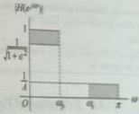{width=12%}  
Fig. 11.10 Continuous-time (analog) filter specification  

$$
\begin{array}{rl} { { \frac { 1 } { \sqrt { 1 + \epsilon ^{2} } } } \leq | H ( e ^{2 \omega} ) | \leq 1 } & { { \mathrm { f o r ~ } } 0 \leq \omega \leq \omega _ { p } } \\{ | H ( e ^{2 \omega} ) | \leq { \frac { 1 } { A } } } & { { \mathrm { f o r ~ } } \omega _ { s } \leq \omega \leq \pi } \end{array}
$$  

Comparing Eq. (11.53) with Eqs (11.45) and (11.46), we obtain  

$$
\begin{array}{rl} { { \frac { 1 } { \sqrt { 1 + \epsilon ^{2} } } } = { \frac { 1 - \delta _ { p } } { 1 + \delta _ { p } } } = \delta _ { 1 } } & { { \mathrm { o r ~ } } \epsilon = { \frac { 2 \sqrt { \delta _ { p } } } { 1 - \delta _ { p } } } = { \sqrt { { \frac { 1 } { \delta _ { 1 } ^{2} } } - 1 } } } \\{ { \frac { 1 } { A } } = { \frac { \delta _ { s } } { 1 + \delta _ { p } } } = \delta _ { 2 } } & { { \mathrm { o r ~ } } A = { \frac { 1 + \delta _ { s } } { \delta _ { s } } } = { \frac { 1 } { \delta _ { 2 } } } } \end{array}
$$  

 ---------------------------------------------[ 第14页 ]---------------------------------------------  

Therefore,  

$$
\begin{array}{rl} { A _ { p } = - 20 \log _ { 10 } \left( { \frac { 1 - \delta _ { p } } { 1 + \delta _ { p } } } \right) = - 20 \log _ { 10 } \left( { \frac { 1 } { \sqrt { 1 + \epsilon ^{2} } } } \right) = 20 \log _ { 10 } \left( { \sqrt { 1 + \epsilon ^{2} } } \right) } & { } \\{ A _ { s } = - 20 \log _ { 10 } \left( { \frac { \delta _ { s } } { 1 + \delta _ { p } } } \right) = - 20 \log _ { 10 } \left( { \frac { 1 } { A } } \right) = 20 \log _ { 10 } ( A ) } & { } \end{array}
$$  

which gives  

$$
\epsilon = \sqrt { 10 ^{A _ { r} / 10 } - 1 }
$$  

$$
A = 10 ^{A _ { *} / 20 }
$$  

In most applications, the pass-band and stop-band edge frequencies are specified in Hertz (Hz). Let $F_{T}$ be the sampling frequency in Hz, and $F_{pass}$ and $F_{stop}$ denote the pass-band and stop-band edge frequencies in Hertz, respectively. Then the digital pass-band and stop-band edge frequencies are given as  

$$
\omega _ { p } = \frac { \Omega _ { \mathrm { p a s s } } } { F _ { T } } = \frac { 2 \pi F _ { \mathrm { p a s s } } } { F _ { T } } ,  \omega _ { s } = \frac { \Omega _ { \mathrm { s t o p } } } { F _ { T } } = \frac { 2 \pi F _ { \mathrm { s t o p } } } { F _ { T } }
$$  

$$
\delta _ { p } = \frac { 10 ^{A _ { p} / 20 } - 1 } { 10 ^{A _ { p} / 20 } + 1 } = \frac { 10 ^{0 . 00 5} - 1 } { 10 ^{0 . 00 5} + 1 }
$$  

Example 11.8 A low-pass digital filter is specified by the following relative specifications:  

$$
\begin{array}{rl} { \omega _ { p } = 0 . 3 \pi , } & { { }  A _ { p } = 0 . 1 \, \mathrm { d B } ; } \\{ \omega _ { s } = 0 . 5 \pi , } & { { }  \mathrm { a n d }  A _ { s } = 35 \, \mathrm { d B } } \end{array}
$$  

$$
= 0 . 00 58
$$  

$$
\begin{array}{rl} { \delta _ { s } = ( 1 + \delta _ { p } ) 10 ^{- \lambda _ { s} / 20 } = ( 1 + 0 . 00 58 ) 10 ^{- 1 . 75} } \\{ = 0 . 01 79 } \end{array}
$$  

Determine the absolute specifications: $\delta_{p}$ and $\delta_{s}$, and analog filter specifications: $\varepsilon$ and $A$.  

Solution: From Eqs (11.51) and (11.52), the absolute specifications are given as  

From Eqs (11.56) and (11.57), the analog filter specifications are given as  

$$
\begin{array}{rl} { \epsilon = { \sqrt { 10 ^{A _ { p} } / 10 ^{- 1} } } = { \sqrt { 10 ^{0 . 01} - 1 } } = 0 . 15 26 } \\{ A = 10 ^{A _ { p} / 20 } = 10 ^{1 . 75} = 56 . 23 41 } \end{array}
$$  

# 11.4.4 Estimation of Finite Impulse Response Filter Order  

For the design of FIR LPF, several authors developed various formulae to determine the filter length $M$ (filter order $M-1$) from the digital filter specifications: $\delta_{\mathbf{p}}$, $\delta_{\mathbf{s}}$, $\omega_{\mathbf{p}}$, and $\omega_{\mathbf{s}}$. A simple approximate formula developed by Kaiser is as  

$$
M = \frac { - 20 \log _ { 10 } \left( \sqrt { \delta _ { p } \delta _ { s } } \right) - 13 } { 14 . 6 ( \omega _ { s } - \omega _ { p } ) / 2 \pi } + 1
$$  

The formula given by Kaiser may not give a robust estimate of the filter order for all the cases of FIR filters. The formula developed by Herrmann, Rabiner and Chan gives a more accurate value for the length and is given as  

where (for $\delta_{\mu} \geq \delta_{s}$)  

$$
\begin{array}{rl} { D _ { \infty } ( \delta _ { p } , \delta _ { e } ) = } & { { } \left[ \alpha _ { 1 } ( \log _ { 10 } \delta _ { p } ) ^{2} + \alpha _ { 2 } ( \log _ { 10 } \delta _ { p } ) + \alpha _ { 3 } \right] \log _ { 10 } \delta _ { e } } \\{ } & { { } - \left[ \alpha _ { 4 } ( \log _ { 10 } \delta _ { p } ) ^{2} + \alpha _ { 5 } ( \log _ { 10 } \delta _ { p } ) + \alpha _ { 6 } \right] } \end{array}
$$  

and  

$F(\delta_{p},\delta_{s})=b_{1}+b_{2}\left[\log_{10}\delta_{p}-\log_{10}\delta_{s}\right]$  

$$
M = \frac { D _ { \infty } ( \delta _ { p } , \delta _ { s } ) - F ( \delta _ { p } , \delta _ { s } ) \left[ \frac { \omega _ { s } - \omega _ { p } } { 2 \pi } \right] ^{2} } { \left[ \frac { \omega _ { s } - \omega _ { p } } { 2 \pi } \right] } + 1
$$  

with $a_{1}=0.005309$, $\alpha_{2}=0.07114$, $\alpha_{3}=-0.4761$, $\alpha_{4}=0.00266$, $\alpha_{5}=0.5941$, $\alpha_{6}=0.4278$, $b_{1}=11.01217$, and $b_{2}=0.51244$. When $\delta_{p}<\delta_{s}$, they are interchanged in the expression for $D_{\infty}(\delta_{p},\delta_{s})$ and $F(\delta_{p},\delta_{s})$.  

Example 11.9 Estimate the filter order of a linear-phase low-pass FIR filter using both Kaiser formula and Herrmann formula with the following specifications: pass-band edge frequency $F_{p} = 1.8$ KHz, stop-band edge frequency $F_{s} = 3$ KHz, maximum pass-band attenuation (or peak pass-band ripple) $A_{p} = 0.1$ dB, minimum pass-band attenuation $A_{s} = 35$ dB, and sampling frequency $F_{\mathcal{T}} = 12$ KHz.  

Using Kaiser formula [Eq. (11.58)], the filter length is given as  

# Solution:  

$$
\begin{aligned} M & = \frac { - 20 \log _ { 10 } \left( \sqrt { \delta _ { y } \delta _ { t } } \right) - 13 } { 14 . 6 \left( \omega _ { x } - \omega _ { y } \right) / 2 \pi } + 1 \\& = \frac { - 20 \log _ { 10 } \left( \sqrt { 0 . 00 58 \times 0 . 01 79 } \right) - 13 } { 14 . 6 \left( 0 . 5 \pi - 0 . 3 \pi \right) / 2 \pi } + 1 \\& = 19 . 38 16 \end{aligned}
$$  

From Eqs (11.51) and (11.52), the absolute specifications are given as  

Since the length must be an integer, we chose the next higher integer that give $M = 20$. The filter order $M - 1 = 19$.  

$$
\begin{array}{rl} { \delta _ { p } = { \frac { 10 ^{A _ { p} / 20 } - 1 } { 10 ^{A _ { p} / 20 } + 1 } } = { \frac { 10 ^{0 . 00 5} - 1 } { 10 ^{0 . 00 5} + 1 } } = 0 . 00 58 } \\{ \delta _ { s } = ( 1 + \delta _ { p } ) 10 ^{- A _ { s} / 20 } } \\{ = ( 1 + 0 . 00 58 ) 10 ^{- 1 . 75} = 0 . 01 79 } \end{array}
$$  

The digital pass-band and stop-band edge frequencies are given as  

Using Herrmann formula [Eq. (11.59)], the filter length is given as  

$$
\begin{array}{rl} { \omega _ { p } = { \frac { 2 \pi F _ { p } } { F _ { T } } } = { \frac { 3 . 6 \pi } { 12 } } = 0 . 3 \pi { \mathrm { a n d } } } \\{ \omega _ { s } = { \frac { 2 \pi F _ { s } } { F _ { T } } } = { \frac { 6 \pi } { 12 } } = 0 . 5 \pi } \end{array}
$$  

$$
\begin{aligned} M & = \frac { D _ { \infty } ( \delta _ { p } , \delta _ { s } ) - F ( \delta _ { p } , \delta _ { s } ) \left[ \frac { - \delta _ { p } - \delta _ { s } } { 2 \pi } \right] ^{2} } { \left[ \frac { - \delta _ { p } - \delta _ { s } } { 2 \pi } \right] } + 1 \\& = \frac { 1 . 95 10 - 10 . 76 14 \times 0 . 01 } { 0 . 1 } + 1 \\& = 20 . 40 24 \end{aligned}
$$  

Since the length must be an integer, we chose the next higher integer that give $M = 21$. The filter order $M - 1 = 20$.  

The filter order computed using Kaiser formula and Herrmann formula is slightly different. Both formulae provide only an estimate of the required filter order. The frequency response of the FIR filter designed using this estimated order may or may not meet the required specifications exactly. If the specifications are met, then that would be just fine. If the specifications are not met, then it is recommended that the filter order be gradually increased until the specifications are met.  

# 11.5 IMPULSE RESPONSES OF IDEAL FILTERS  

The Four commonly used frequency selective filters are the LPF, HPF, BSF, and band-pass filter (BPF). The magnitude response of these four ideal classical types of digital filters is shown in Fig. 11.11. An ideal filter is described by constant (typically unit)  

 ---------------------------------------------[ 第15页 ]---------------------------------------------  

gain in the pass-band and zero gain in the stop-band. In this section, we develop their corresponding impulse responses.  

# 11.5.1 Ideal Low-pass Filter  

The magnitude response of an ideal LPF is shown in Fig. 11.11(a) in which the cut-off frequency is given as $\omega_{c}$. It has a constant magnitude of one and zero phase over the frequency $|\omega| \leq \omega_{c}$. The frequency response of an ideal LPF is given as  

$$
H _ { L P } ( e ^{3 \omega} ) = \mathrm { r e c t } \left( \frac { \omega } { 2 \omega _ { c } } \right) = \left\{ \begin{array}{ll} { 1 } & { | \omega | \leq \omega _ { c } } \\{ 0 } & { \omega _ { c } < | \omega | \leq \pi . } \end{array} \right.
$$  

Its impulse response $h_{LP}(n)$ is found using the inverse discrete-time Fourier transform (DTFT) to give the following:  

$$
\begin{aligned} h_{L P}(n) & = \frac{1}{2 \pi} \int_{-\pi}^{\pi} H_{L P}\left(e^{j \omega n}\right) e^{j \omega n} d \omega = \frac{1}{2 \pi} \int_{-\omega_{c}}^{\omega_{c}} e^{j \omega n} d \omega \\& = \frac{1}{2 \pi}\left(\frac{e^{j \omega n}}{j n}\right)\bigg|_{-\omega_{c}}^{\omega_{c}} & = \frac{1}{\pi n} \left(\frac{e^{j \omega_{c} n}}{2 j}\right) \\h_{L P}(n) & = \frac{\sin \omega_{c} n}{\pi n} & = \frac{\omega_{c}}{\pi} \left(\frac{\sin \omega_{c} n}{\omega_{c} n}\right) & = \left\{\frac{\omega_{c}}{\pi} & n=0 \\& \frac{\sin \omega_{c} n}{\pi n} & |n|>0\end{aligned}
$$  

The impulse response of an ideal LPF shown in Fig. 11.12 is symmetric about $n=0$. Since $h_{LP}(n)$ is two-sided, it is non-causal and can never be realized. Moreover, the ideal LPF is unstable because $h_{LP}(n)$ is not absolutely summable. One way to approximate an ideal LPF is by truncation of its impulse response such that $h_{LP}(n)=0$ outside the range $-\frac{M-1}{2}\leq n\leq\frac{M-1}{2}$, where $M$ is odd, to get  

$$
h _ { M } ( n ) = \left\{ \begin{array}{ll} { { h _ { L P } ( n ) } } & { { - \frac { M - 1 } { 2 } \leq n \leq \frac { M - 1 } { 2 } } } \\{ { 0 } } & { { \mathrm { o t h e r w i s e } } } \end{array} \right.
$$  

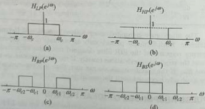{width=27%}  
Fig. 11:11 Magnitude responses of four ideal filters (a) Ideal LPF (b) Ideal HPF (c) Ideal BPF (d) Ideal BSF  

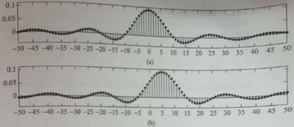{width=38%}  
Fig. 11.12 Impulse response of an ideal LPF (a) $h_{\mathrm{LP}}(n)$ (b) $\tilde{h}_{\mathrm{LP}}(n)$  

Still it is non-causal. To obtain a causal filter, we must also delay the truncated impulse response by $\alpha=\frac{M-1}{2}$ samples so that its first sample appears at the origin.  

The desired low-pass frequency response is as  

$$
\widehat { H } _ { \mathrm { L P } } ( e ^{2 \omega} ) = \left\{ \begin{array}{ll} { { e ^{- j \omega \alpha} } } & { { | \omega | \leq \omega _ { c } } } \\{ { 0 } } & { { \omega _ { c } < | \omega | \leq \pi } } \end{array} \right.
$$  

Its impulse response $\hat{h}_{L}p(n)$ is given as  

$$
\begin{aligned} \hat { h } _ { L P } ( n ) & = \frac { 1 } { 2 \pi } \int _ { - \pi } ^{\pi} \widehat { H } _ { L P } ( e ^{2 \omega} ) e ^{i \omega n} d \omega \\& = \frac { 1 } { 2 \pi } \int _ { - \omega _ { c } } ^{- \omega _ { c} } e ^{- i \omega _ { c} } e ^{j \omega n} d \omega = \frac { 1 } { 2 \pi } \int _ { - \omega _ { c } } ^{- \omega _ { c} } e ^{j \omega ( n - \alpha )} d \omega \\& = \frac { 1 } { 2 \pi } \left( \frac { e ^{2 \omega ( n - \alpha )} } { j ( n - \alpha ) } \right) \bigg | _ { - \omega _ { c } } ^{\infty} = \frac { 1 } { \pi ( n - \alpha ) } \left( \frac { e ^{2 \omega _ { c} ( n - \alpha ) } - e ^{- j \omega _ { c} ( n - \alpha ) } } { 2 j } \right) \\\hat { h } _ { L P } ( n ) & = \frac { \sin \omega _ { c } ( n - \alpha ) } { \pi ( n - \alpha ) } = \frac { \omega _ { c } } { \pi } \left( \frac { \sin \omega _ { c } ( n - \alpha ) } { \omega _ { c } ( n - \alpha ) } \right) = \left\{ \begin{array}{ll} { \frac { \omega _ { c } } { \pi } } & { n = \alpha } \\{ \frac { \sin \omega _ { c } ( n - \alpha ) } { \pi ( n - \alpha ) } } & { n \neq \alpha } \end{array} \right. \end{aligned}
$$  

The impulse response $\hat{h}_{LP}(n)$, shown in Fig. 11.12(b), is symmetric about $\alpha$. $h_{LP}(n)$ is a delayed version of $h_{LP}(n)$, that is, $\hat{h}_{LP}(n)=h_{LP}(n-\alpha)$ or equivalently $\widehat{H}_{LP}(e^{j\omega})=e^{-j\omega\alpha}H_{LP}(e^{j\omega})$. Since $\hat{h}_{LP}(n)$ is two-sided, it is non-causal. A causal filter $h(n)$ is obtained by truncating the impulse response such that $\hat{h}_{LP}(n)=0$ outside the range $0\leq n\leq M-1$; therefore, we get.  

$$
\tilde { h } ( n ) = \left\{ \begin{array}{ll} { \tilde { h } _ { L P } ( n ) } & { 0 \leq n \leq M - 1 } \\{ 0 } & { \mathrm { o t h e r w i s e } } \end{array} \right.
$$  

It should be noted that this expression also holds for $M$ even in which $\alpha = \frac{M-1}{2}$ is a fraction.  

 ---------------------------------------------[ 第16页 ]---------------------------------------------  

# 11.5.2 Ideal High-pass Filter  

The magnitude response of an ideal HPF is shown Fig. 11.11(b) in which the cut-off frequency is given as $\omega_{c}$. It has a constant magnitude of one and zero phase over the frequency $\omega_{c} \leq |\omega| \leq \pi$. The frequency response of an ideal HPF is given as  

$$
H _ { H P } ( e ^{j \varphi} ) = \left\{ \begin{array}{ll} { 1 } & { e _ { c } \leq \frac { | e | } { | e | } \leq \pi } \\{ 0 } & { \frac { | e | } { | e | } < \omega _ { c } } \end{array} \right.
$$  

Its impulse response $h_{HP}(n)$ is found using the inverse DTFT to give the following:  

$$
\begin{aligned} h _ { H P } ( n ) & = \frac { 1 } { 2 \pi } \int _ { - \pi } ^{\pi} H _ { H P } ( e ^{j \omega n} ) e ^{j \omega n} d \omega = \frac { 1 } { 2 \pi } \left[ \int _ { - \pi } ^{- \omega _ { c} } e ^{j \omega n} d \omega + \int _ { \omega _ { c } } ^{\pi} e ^{j \omega n} d \omega \right] \\& = \frac { 1 } { 2 \pi } \left[ \left( \frac { e ^{j \omega n} } { j n } \right) \left| _ { - \pi } ^{- \omega _ { c} } + \left( \frac { e ^{j \omega n} } { j n } \right) \right| _ { \omega _ { c } } ^{\pi} \right] \\& = \frac { 1 } { 2 j \pi n } \left[ \left( e ^{- j \omega _ { c} n } - e ^{- j \pi n} + e ^{j \pi n} - e ^{j \omega _ { c} n } \right] \\h _ { H P } ( n ) & = \frac { 1 } { \pi n } \left[ \left( \frac { e ^{j \pi n} - e ^{- j \pi n} } { 2 j } \right) - \left( \frac { e ^{j \omega _ { c} n } - e ^{- j \omega _ { c} n } } { 2 j } \right) \right] = \frac { \sin \pi n } { \pi n } - \frac { \sin \omega _ { c } n } { \pi n } \end{aligned}
$$  

Since $\frac{\sin\pi n}{\pi n}=\delta(n)$, we can write  

$$
\hbar _ { H P } ( n ) = \delta ( n ) - \frac { \sin \omega _ { c } n } { \pi n } = \delta ( n ) - \frac { \omega _ { c } } { \pi } \left( \frac { \sin \omega _ { c } n } { \omega _ { c } } \right) = \left\{ \begin{array}{ll} { 1 - \frac { \omega _ { c } } { \pi } } & { n = 0 } \\{ - \frac { \sin \omega _ { c } n } { \pi n } } & { | n | > 0 } \end{array} \right.
$$  

The impulse response $h_{HP}(n)$ is symmetric and of infinite length. Since $h_{HP}(n)$ is two-sided, it is non-causal.  

# 11.5.3 Ideal Band-pass Filter  

The magnitude response of an ideal BPF is shown Fig. 11.11(c), in which the cut-off frequencies are given as $\omega_{c1}$ and $\omega_{c2}$. It has a constant magnitude of one and zero phase over the frequency $\omega_{c1} \leq |\omega| \leq \omega_{c2}$. The frequency response of an ideal BPF is given as  

$$
H _ { B P } ( e ^{2 \omega} ) = \left\{ \begin{array}{ll} { 1 } & { \omega _ { c 1 } \leq | \omega | \leq \omega _ { c 2 } } \\{ 0 } & { | \omega | < \omega _ { c 1 }  \mathrm { a n d }  \omega _ { c 2 } < | \omega | \leq \pi } \end{array} \right.
$$  

Its impulse response $\hat{h}_{BP}(\pi)$ is found using the inverse DTFT to give the following:  

$$
\begin{aligned} h_{B P}(n) & = \frac{1}{2 \pi} \int_{-\pi}^{\pi} H_{B P}\left(e^{j \omega} n\right) e^{j \omega n} d \omega = \frac{1}{2 \pi} \left[ \int_{-\omega_{c 1}}^{\omega_{c 1}}} e^{j \omega n} d \omega + \int_{\omega_{c 1}}^{\omega_{c 2}} e^{j \omega n} d \omega \right] \\& = \frac{1}{2 \pi} \left[ \left( \frac{e^{j \omega n}}{j n} \right) \left|_{-\omega_{c 1}}^{-\omega_{c 1}}+\left( \frac{e^{j \omega n}}{j n}\right) \left|_{\omega_{c 1}}^{\omega_{c 1}}\right. \right] \\& = \frac{1}{2 j \pi n} \left[ \left( e^{-j \omega_{c 1}} n - e^{-j \omega_{c 1}} n + e^{j \omega_{c 1}} n - e^{j \omega_{c 1}} n \right) \right] \end{aligned}
$$  

$$
\begin{array}{rl} { h _ { B P } ( n ) = } & { { } { \frac { 1 } { \pi n } } \left[ \left( { \frac { e ^{j \omega _ { c} n } - e ^{- j \omega _ { c} n } } { 2 j } } \right) - \left( { \frac { e ^{j \omega _ { c} n } - e ^{- j \omega _ { c} n } } { 2 j } } \right) \right] } \\{ } & { { } = { \frac { \sin \omega _ { c 2 } n } { \pi n } } - { \frac { \sin \omega _ { c 1 } n } { \pi n } } } \\{ h _ { B P } ( n ) = } & { { } { \frac { \sin \omega _ { c 2 } n } { \pi n } } - { \frac { \sin \omega _ { c 1 } n } { \pi n } } = \left\{ \begin{array}{ll} { { \frac { e ^{j \omega _ { c 1} n } } { \pi n } } } & { n = 0 } \\{ { \frac { \sin \omega _ { c 1 } n } { \pi n } } - { \frac { \sin \omega _ { c 1 } n } { \pi n } } } & { | n | > 0 } \end{array} \right. } \end{array}
$$  

The impulse response $h_{BP}(n)$ is symmetric and of infinite length. Since $h_{BP}(n)$ is two-sided, it is non-causal.  

# 11.5.4 Ideal Band-stop Filter  

The magnitude response of an ideal BSF is shown Fig. II.11(d) in which the cut-off frequencies are given as $\omega_{c1}$ and $\omega_{c2}$. It has a constant magnitude of one and zero phase over the frequency $|\omega| \leq \omega_{c1}$ and $\omega_{c2} \leq |\omega| \leq \pi$. The frequency response of an ideal BSF is given as  

$$
H _ { B S } ( e ^{j \omega} ) = \left\{ \begin{array}{ll} { 1 } & { | \omega | \leq \omega _ { c 1 } \mathrm { ~ a n d ~ } \omega _ { c 1 } \leq | \omega | \leq \pi } \\{ 0 } & { \omega _ { c 1 } < | \omega | < \omega _ { c 2 } } \end{array} \right.
$$  

Its impulse response $h_{BS}(n)$ is found using the inverse DTFT to give the following:  

$$
\begin{aligned} h _ { B S } ( n ) & = \frac { 1 } { 2 \pi } \int _ { - \pi } ^{\pi} H _ { B S } ( e ^{j \omega} ) e ^{j \omega n} d \omega \\& = \frac { 1 } { 2 \pi } \left[ \int _ { - \pi } ^{- \omega _ { c 1} } e ^{j \omega n} d \omega + \int _ { - \omega _ { c 1 } } ^{\omega _ { c 1} } e ^{j \omega n} d \omega + \int _ { \omega _ { c 2 } } ^{\infty} e ^{j \omega n} d \omega \right] \\& = \frac { 1 } { 2 \pi } \left[ \left( \frac { e ^{j \omega n} } { j n } \right) \Big [ \frac { - \omega _ { c 1 } } { - \varepsilon } + \left( \frac { e ^{j \omega n} } { j n } \right) \Big ] \Big [ \frac { - \omega _ { c 1 } } { - \omega _ { c 1 } } + \left( \frac { e ^{j \omega n} } { j n } \right) \Big ] \Big [ \frac { - \omega _ { c 2 } } { - \omega _ { c 2 } } \right] \\& = \frac { 1 } { 2 j \pi n } \left[ \left( e ^{- j \omega _ { c 1} n } - e ^{- j \pi n} + e ^{j \omega _ { c 1} n } - e ^{- j \omega _ { c 1} n } + e ^{j \pi n} - e ^{j \omega _ { c 2} n } \right] \\& = \frac { 1 } { \pi n } \left[ \left( \frac { e ^{j \pi n} - e ^{- j \pi n} } { 2 j } \right) + \left( \frac { e ^{j \omega _ { c 1} n } - e ^{- j \omega _ { c 1} n } } { 2 j } \right) - \left( \frac { e ^{j \omega _ { c 2} n } - e ^{- j \omega _ { c 2} n } } { 2 j } \right) \right] \\h _ { B S } ( n ) & = \frac { \sin \pi n } { \pi n } + \frac { \sin \omega _ { c 1 } n } { \pi n } - \frac { \sin \omega _ { c 2 } n } { \pi n } = \delta ( n ) + \frac { \sin \omega _ { c 1 } n } { \pi n } - \frac { \sin \omega _ { c 2 } n } { \pi n } \\h _ { B S } ( n ) = \delta ( n ) + \frac { \sin \omega _ { c 1 } n } { \pi n } - \frac { \sin \omega _ { c 2 } n } { \pi n } = \left\{ \begin{array}{ll} { 1 - \frac { ( \omega _ { c 2 } - \omega _ { c 1 } ) } { \pi } } & { n = 0 } \\{ \frac { \sin \omega _ { c 1 } n } { \pi n } - \frac { \sin \omega _ { c 2 } n } { \pi n } } & { | n | > 0 } \end{array} \right.  ( 11 . 69 ) \end{aligned}
$$  

The impulse response $h_{BS}(n)$ is symmetric and of infinite length. Since $h_{BS}(n)$ is two-sided, it is non-causal.  

# 11.6 DESIGN TECHNIQUES FOR LINEAR-PHASE FINITE IMPULSE RESPONSE FILTERS  

The design of a digital filter is carried out in three steps:  

1. Specifications: Before we design a filter, we must have some specifications. These specifications are determined by the applications.  

 ---------------------------------------------[ 第17页 ]---------------------------------------------  

2. Approximations: This step is the topic of filter design. The approximation step is the process of generating a transfer function that would satisfy the desired specifications. Approximation methods can be classified as direct or indirect. In the direct method, the discrete-time transfer function $H(z)$ is obtained directly in the z-domain. In the indirect method, a continuous-time transfer function $H(s)$ is first obtained and then converted into a corresponding discrete-time transfer function $H(z)$. Approximations can also be classified as noniterative or iterative. In the noniterative method, the problem is solved through a small number of design steps using a set of closed-form formulae, whereas iterative methods are based on optimization algorithms. In the iterative method, an initial design is assumed and is progressively improved until a discrete-time transfer function is obtained that satisfies the prerequisite specifications.

3. Implementation: The output of step 2 is a filter description in the form of a difference equation, or a system function $H(z)$ or an impulse response $h(n)$. From this description, we can implement the filter in hardware or through simulation on a computer.  

There are four well-known design methods for designing the FIR filters with linear phase. These methods are Fourier series method, window method, frequency-sampling method, and optimal or minimax or equirpple design. The Fourier series method, window method, and frequency-sampling method are noniterative methods. These methods provide closed-form solutions. Unfortunately, the design obtained are suboptimal with respect to filter complexity whereby a filter design is said to be optimal if the filter order is the lowest that can be achieved for the required specifications. The optimal or minimax design method is based on an optimization algorithm known as Remez exchange algorithm (or Parks-McClellan algorithm). The Parks-McClellan algorithm is developed based on the idea of minimizing the maximum approximation error in a Chebyshev polynomial approximation to the desired filter magnitude frequency response. This method yields optimal designs but a huge amount of computation is required to complete a design.  

# 11.7 FOURIER SERIES METHOD  

Let $z(t)$ be a continuous-time periodic signal with fundamental period $T$ and fundamental frequency $\Omega_0 = \frac{2\pi}{T}$. The Fourier series of a continuous-time periodic signal is given as  

$$
x ( t ) = \sum _ { n = - \infty } ^{\infty} X _ { n } e ^{j n \Omega _ { 0} t }
$$  

$$
X _ { n } = \frac { 1 } { T } \int _ { - T / 2 } ^{T / 2} x ( t ) e ^{- 2 n \Omega _ { n} t } d t
$$  

where $X_{n}$ is the Fourier series coefficient. This Fourier series can also be written as  

$$
x ( t ) = \sum _ { n = - \infty } ^{\infty} X _ { n } e ^{- m \Omega _ { 0} t }
$$  

This Fourier series is applied for the time-domain representation of signals, but in the present application, it will be applied for frequency domain representation of filters. Since the desired frequency response $H_{d}(e^{j\omega})$ of a FIR filter is a periodic function of $\omega$ with fundamental period $T=2\pi$ and fundamental frequency  

$$
x _ { n } = \frac { 1 } { T } \int _ { - T / 2 } ^{T / 2} x ( t ) e ^{2 m \Omega _ { n} t } d t
$$  

$$
\Omega _ { 0 } = \frac { 2 \pi } { \mathrm { p e r i o d ~ o f ~ w a v e f o r m } } = \frac { 2 \pi } { T } = \frac { 2 \pi } { 2 \pi } = 1
$$  

$H_{d}(e^{i\omega})$ can be expressed as a Fourier series with $h_{d}(n)$ as Fourier series coefficients. Replacing $t$ by $\omega$, $z(t)$ by $H_{d}(e^{i\omega})$, and $X_{n}$ by $h_{d}(n)$, and substituting $\Omega_{0}=1$ in Eqs (11.72) and (11.73), we obtain the following equations:  

$$
H _ { d } ( e ^{j \omega} ) = \sum _ { n = - \infty } ^{\infty} h _ { d } ( n ) e ^{- j \omega n}
$$  

$$
h _ { \alpha } ( n ) = \frac { 1 } { 2 \pi } \int _ { - \pi } ^{\pi} H _ { \beta } ( e ^{i \omega} ) e ^{i \omega n} d \omega
$$  

If we Substitute $e^{j\omega} = z$ in Eq. (11.74), we obtain the following equation:  

$$
H _ { d } ( z ) = \sum _ { n , m = - \infty } ^{\infty} h _ { d } ( n ) z ^{- n}
$$  

$H_{d}(z)$ is the transfer function. However, this is non-causal and of infinite order since $h_{d}(n)$ is defined over the range $-\infty < n < \infty$ according to Eq. (11.76). One way to get an FIR filter of length $M$ is by truncation of the infinite length impulse response $h_{d}(n)$. Let $h_{M}(n)$ be the impulse response of an FIR filter of length $M$.  

$$
\hbar _ { M } ( n ) = \left\{ \begin{array}{ll} { { h _ { d } ( n ) } } & { { - \frac { M - 1 } { 2 } \leq n \leq \frac { M - 1 } { 2 } } } \\{ { 0 } } & { { \mathrm { o t h e r w i s e } } } \end{array} \right.
$$  

To obtain a causal filter $h(n)$, we must also delay the impulse response $h_{M}(n)$ by $\frac{M-1}{2}$ samples so that its first sample appears at the origin.  

$$
h ( n ) = h _ { M } \left( n - \frac { M - 1 } { 2 } \right)
$$  

$$
H ( e ^{j \omega} ) = e ^{- j \frac { M} { 2 } \frac { 1 } { 2 } } H _ { M } ( e ^{j \omega} ) = e ^{- j \frac { M} { 2 } \frac { 1 } { 2 } } \sum _ { n = - ( M - 1 ) / 2 } ^{( M - 1 ) / 2} h _ { M } ( n ) e ^{- j \omega n}
$$  

Consider the example of an ideal LPF. The desired frequency response $H_{d}(e^{j\omega}) = H_{LP}(e^{j\omega})$. The frequency response and the impulse response of an ideal LPF are given by [Eqs (11.60) and (11.61)]  

$$
\begin{array}{r} { H _ { d } ( e ^{2 \omega} ) = H _ { L P } ( e ^{2 \omega} ) = \left\{ \begin{array}{ll} { 1 } & { | \omega | \leq \omega _ { c } } \\{ 0 } & { \omega _ { c } < | \omega | \leq \pi } \end{array} \right. } \\{ h _ { d } ( n ) = h _ { L P } ( n ) = \frac { \sin \omega _ { c } n } { \pi n } = \frac { \omega _ { c } } { \pi } \left( \frac { \sin \omega _ { c } n } { \omega _ { c } n } \right) = \left\{ \begin{array}{ll} { \frac { \omega _ { c } } { \pi } } & { n = 0 } \\{ \frac { \sin \omega _ { c } n } { \pi n } } & { | n | > 0 } \end{array} \right. } \end{array}
$$  

 ---------------------------------------------[ 第18页 ]---------------------------------------------  

$h_{d}(n)$ is shown in Fig. 11.12(a). It is of infinite length. Let $h_{M}(n)$ be the impulse response of an FIR filter of length $M=11$, which is obtained by truncating $h_{d}(n)$.  

$$
h _ { M } ( n ) = \left\{ \begin{array}{ll} { h _ { d } ( n ) } & { - \frac { M - 1 } { 2 } \leq n \leq \frac { M - 1 } { 2 } } \\{ 0 } & { \mathrm { o t h e r w i s e } } \end{array} \right. = \left\{ \begin{array}{ll} { h _ { d } ( n ) } & { - 5 \leq n \leq 5 } \\{ 0 } & { \mathrm { o t h e r w i s e } } \end{array} \right.
$$  

To obtain a causal filter $h(n)$, we must also delay the impulse response $h_{M}(n)$ by 5 samples so that its first sample appears at the origin, that is,  

$$
\begin{array}{rl} { h ( n ) = h _ { M } ( n - 5 ) } & { } \\{ H ( e ^{j \omega} ) = e ^{- j \delta \omega} H _ { M } ( e ^{j \omega} ) = e ^{- j \delta \omega} \sum _ { n = - \delta } ^{\delta} h _ { M } ( n ) e ^{- j \omega n} } & { } \end{array}
$$  

# 11.7.1 Gibbs Phenomenon  

Figure 11.13 shows the frequency response $H_{M}(e^{j\omega})$ of an LPF for two values of $M$. The abrupt truncation of Fourier series results in oscillations (or ripples) in the pass-band and stop-band. These oscillations are due to slow convergence of the Fourier series. These are known as Gibbs' oscillations. As the length $M$ of the filter increases, the number of ripples in both pass-band and stop-band increases, and at both low and high frequencies, their amplitude decreases except near the point of discontinuity (pass-band edge). Moreover, the transition band between pass-band and stop-band becomes steeper. These are some of the features of Gibbs' phenomenon, which was mathematically derived by Gibbs. The amplitude of the oscillations can be reduced by multiplying the desired impulse response $h_{\mathrm{d}}(\pi)$ by an appropriate window function. This leads to the windowing method.  

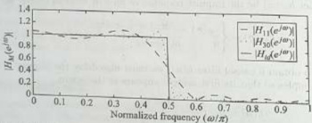{width=27%}  
Fig.11.13 Frequency response of an LPF showing Gibbs oscillations  

Design an ideal FIR LPF of length $M = 11$ with a frequency response  

Solution:  

$$
H _ { d } ( e ^{2 \omega} ) = \left\{ \begin{array}{ll} { { 1 } } & { { 0 } } \\{ { \frac { \sqrt { 3 } } { E } } } & { { \leq \frac { \sqrt { 3 } } { E } \leq \frac { \sqrt { 3 } } { E } } } \\{ { \leq \frac { \sqrt { 3 } } { E } } } & { { \leq \frac { \sqrt { 3 } } { E } } } \end{array} \right.
$$  

Given that the cut-off frequency $F_{c} = 1$ KHz, and sampling frequency $F_{T} = 4$ KHz. The digital cut-off frequency is given as  

$$
\begin{array}{rl} { \omega _ { c } = { \frac { 2 \pi F _ { c } } { F _ { T } } } = { \frac { 2 \pi \times 1 \times 10 ^{3} } { 4 \times 10 ^{3} } } } \\{ = { \frac { \pi } { 2 } } = 0 . 5 \pi  \mathrm { r a d / s a m p l e } } \end{array}
$$  

The desired frequency response of an ideal LPF is given as (Fig. 11.11a)  

using Fourier series method. Find the non-causal FIR filter impulse response $h_{M}(n)$ and system function $H_{M}(z)$. Moreover, find the causal FIR filter system function $H(z)$ and frequency response $H(e^{j\omega})$.  

$$
H _ { d } ( e ^{i \omega} ) = \left\{ \begin{array}{ll} { { 1 } } & { { | \omega | \leq \omega _ { c } } } \\{ { 0 } } & { { \frac { | \omega | } { \omega _ { c } } \leq \frac { \omega _ { c } } { \omega _ { c } } } } \end{array} \right.
$$  

where $\omega_{e}=\frac{\pi}{2}$. The desired impulse response of an ideal LPF is given as [Eq. (11.61)]  

$$
\begin{array}{rl} { h _ { d } ( n ) = { \frac { 1 } { 2 \pi } } \int _ { - \pi } ^{\infty} H _ { \varepsilon } ( e ^{2 \omega} ) e ^{2 \omega n} d \omega } \\{ = { \frac { 1 } { 2 \pi } } \int _ { - \omega _ { c } } ^{\infty} e ^{i \omega n} d \omega = { \frac { \sin \omega _ { c } n } { \pi n } } } \\{ = { \frac { \omega _ { c } } { \pi } } \left( { \frac { \sin \omega _ { c } n } { \omega _ { c } n } } \right) = \left\{ \begin{array}{ll} { { \frac { \omega _ { c } } { \pi } } } & { n = 0 } \\{ { \frac { m \omega _ { c } n } { \pi n } } } & { | n | > 0 } \end{array} \right. } \end{array}
$$  

Note that $h_{d}(n)$ is of infinite length and symmetric, that is, $h_{d}(n) = h_{d}(-n)$. The symmetric impulse response $h_{M}(n)$ of a length $M = 11$ FIR filter is obtained by truncating $h_{d}(n)$, that is,  

$$
\begin{array}{rl} { h _ { M } ( n ) = { \left\{ \begin{array}{ll} { h _ { \ell } ( n ) } & { - 5 \leq n \leq 5 } \\{ 0 } & { { \mathrm { o t h e r w i s e } } } \end{array} \right. } } & { { } } \\{ = { \left\{ \begin{array}{ll} { { \frac { \sin \omega _ { \ell } n } { \pi n } } } & { - 5 \leq n \leq 5 } \\{ 0 } & { { \mathrm { o t h e r w i s e } } } \end{array} \right. } } & { { } } \\{ = { \left\{ \begin{array}{ll} { { \frac { \sin \omega _ { \ell } n } { \pi n } } } & { n = 0 } \\{ 0 } & { 1 \leq | n | \leq 4 } \\{ 0 } & { { \mathrm { o t h e r w i s e } } } \end{array} \right. } } & { { } } \end{array}
$$  

$$
\begin{array}{rl} { h _ { M } ( 4 ) = h _ { M } ( - 4 ) = { \frac { \sin \left( 0 . 5 \pi \times 4 \right) } { \pi \times 4 } } = 0 } \\{ h _ { M } ( 5 ) = h _ { M } ( - 5 ) = { \frac { \sin \left( 0 . 5 \pi \times 5 \right) } { \pi \times 5 } } = 0 . 06 37 } \end{array}
$$  

The system function $H_{M}(z)$ of a non-causal FIR filter is given as  

Since $h_{M}(n)$ is symmetric, that is, $h_{M}(n)=h_{M}(-n)$, we obtain the following:  

$$
\begin{aligned} h_{M}(0) & = \frac{\omega_{c}}{\pi}=\frac{0.5 \pi}{\pi}=0.5 \\h_{M}(1) & =h_{M}(-1)=\frac{\sin \omega_{c} n}{\pi n} \\& = \frac{\sin \left(0.5 \pi \times 1\right)}{\pi \times 1}=0.3183 \\h_{M}(2) & =h_{M}(-2)=\frac{\sin \left(0.5 \pi \times 2\right)}{\pi \times 2}=0 \\h_{M}(3) & =h_{M}(-3)=\frac{\sin \left(0.5 \pi \times 3\right)}{\pi \times 3}=-0.1061 \end{aligned}
$$  

$$
\begin{aligned} H _ { M } ( z ) & = \sum _ { n = - ( M - 1 ) / 2 } ^{( M - 1 ) / 2} h _ { M } ( n ) z ^{- n} = \sum _ { n = - 5 } ^{5} h _ { M } ( n ) z ^{- n} \\& = \sum _ { n = - 5 } ^{- 1} h _ { M } ( n ) z ^{- n} + h _ { M } ( 0 ) + \sum _ { n = 1 } ^{5} h _ { M } ( n ) z ^{- n} \\& = h _ { M } ( 0 ) + \sum _ { n = 1 } ^{5} h _ { M } ( - n ) z ^{n} + \sum _ { n = 1 } ^{5} h _ { M } ( n ) z ^{- n} \\& = h _ { M } ( 0 ) + \sum _ { n = 1 } ^{5} h _ { M } ( n ) z ^{n} + \sum _ { n = 1 } ^{5} h _ { M } ( n ) z ^{- n} \\H _ { M } ( z ) & = h _ { M } ( 0 ) + \sum _ { n = 1 } ^{5} h _ { M } ( n ) [ z ^{n} + z ^{- n} ] \\& = 0 . 5 + 0 . 31 83 \left[ z + z ^{- 1} \right] \\& - 0 . 10 61 \left[ z ^{3} + z ^{- 2} \right] + 0 . 06 37 \left[ z ^{5} + z ^{- 5} \right] \end{aligned}
$$  

To obtain a causal filter $h(n)$, we must also delay the impulse response $h_{M}(n)$ by $\frac{M-1}{2}=5$ samples so that its first sample appears at the origin.  

$$
\begin{array}{rl} { h ( n ) = h _ { M } \left( n - 5 \right) } & { } \\{ H ( z ) = z ^{- 5} H _ { M } ( z ) = z ^{- 5} \left[ 0 . 5 + 0 . 31 83 \left[ z + z ^{- 1} \right] \right. } & { } \\{ \left. - 0 . 10 61 \left[ z ^{3} + z ^{- 3} \right] + 0 . 06 37 \left[ z ^{5} + z ^{- 5} \right] \right] } & { } \end{array}
$$  

Substituting $z=\epsilon^{\omega}$, we get the frequency response of the causal FIR filter as  

$$
\begin{array}{rl} { H ( e ^{i \omega} ) = e ^{- j 5 \omega} H _ { M } ( e ^{i \omega} ) } & { { } } \\{ = e ^{- j 5 \omega} \left[ 0 . 5 + 0 . 31 83 \left[ e ^{j \omega} + e ^{- j \omega} \right] \right. } & { { } } \\{ \left. - 0 . 10 61 \left[ e ^{j \omega} + e ^{- j 3 \omega} \right] \right. } & { { } } \\{ \left. + 0 . 06 37 \left[ e ^{j \omega} + e ^{- j 5 \omega} \right] \right] } & { { } } \\{ = e ^{- j 5 \omega} \left[ 0 . 5 + 0 . 31 83 \times 2 \cos \omega - 0 . 10 61 \right. } & { { } } \\{ \left. \times 2 \cos 3 \omega + 0 . 06 37 \times 2 \cos 5 \omega \right] } & { { } } \\{ H ( e ^{j \omega} ) = e ^{- j 5 \omega} \left[ 0 . 5 + 0 . 63 06 \cos \omega - 0 . 21 22 \cos 3 \omega \right. } & { { } } \\{ \left. + 0 . 12 74 \cos 5 \omega \right] } & { { } } \end{array}
$$  

The magnitude response $|H(c^{2\omega})|$ is shown in Fig. 11.14.  

 ---------------------------------------------[ 第19页 ]---------------------------------------------  

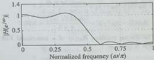{width=20%}  
Fig. 11.14 Frequency response of LPF of Example 11.10  

Example 11.11 Design an ideal FIR HPF of length $M=11$ with cut-off frequency of $F_{c}=1.5$ KHz and sampling frequency of $F_{T}=5$ KHz using Fourier series method. Find the non-causal FIR filter impulse response $h_{M}(n)$ and system function $H_{M}(z)$. Moreover, find the causal FIR filter system function $H(z)$ and frequency response $H(e^{j\omega})$.
(or)
Design an ideal FIR HPF of length $M=11$ with a frequency response  

$$
H _ { 4 } ( e ^{2 \pi} ) = \left\{ \begin{array}{ll} { { 1 } } & { { \frac { 3 \pi } { 5 } \leq \frac { 1 } { 2 } } } \\{ { 0 } } & { { \frac { 1 } { 2 } \leq \frac { 3 \pi } { 5 } } } \end{array} \right.
$$  

using Fourier series method. Find the non-causal FIR filter impulse response $h_{M}(n)$ and system function $H_{M}(z)$. Moreover, find the causal FIR filter system function $H(z)$ and frequency response $H(e^{i\omega})$.

Solution:  

Given that the cut-off frequency $F_{c} = 1.5$ KHz, and sampling frequency $F_{T} = 5$ KHz. The digital cut-off frequency is given as  

$$
\begin{array}{rl} { \omega _ { c } = { \frac { 2 \pi F _ { c } } { F \tau } } = { \frac { 2 \pi \times 1 . 5 \times 10 ^{3} } { 5 \times 10 ^{3} } } } \\{ = { \frac { 3 \pi } { 5 } } = 0 . 6 \pi  { \mathrm { r a d / s a m p l e } } } \end{array}
$$  

The desired frequency response of an ideal HPF is given by (Fig. 11.11b)  

$$
H _ { d } ( e ^{i \omega} ) = \left\{ \begin{array}{ll} { 1 } & { w _ { 0 } \leq | \omega | \leq \pi } \\{ 0 } & { | \omega | < \omega _ { 0 } } \end{array} \right.
$$  

where $\omega_{c}=\frac{\frac{n}{2\pi}}{\delta}$. The desired impulse response of an ideal HPF is given as [Eq. (11-65)]  

$$
\begin{aligned} h _ { d } ( n ) & = \frac { 1 } { 2 \pi } \int _ { - \pi } ^{\infty} H _ { d } ( e ^{2 \omega} ) e ^{\omega n} d \omega \\& = \frac { 1 } { 2 \pi } \left[ \int _ { - \pi } ^{- \infty} e ^{2 \omega n} d \omega + \int _ { \omega _ { c } } ^{\infty} e ^{2 \omega n} d \omega \right] \\& = \frac { \sin \pi n } { \pi n } - \frac { \sin \omega _ { c } n } { \pi n } = \delta ( n ) - \frac { \sin \omega _ { c } n } { \pi n } \end{aligned}
$$  

$$
\begin{array}{rl} { = \delta ( n ) - { \frac { \omega _ { c } } { \pi } } \left( { \frac { \sin \omega _ { c } n } { \omega _ { c } n } } \right) } \\{ = \left\{ { \frac { 1 - { \frac { w _ { c } } { \pi } } } { - { \frac { \sin \omega _ { c } n } { \pi n } } } }  n = 0  \left| n \right| > 0 } \end{array}
$$  

Note that $h_{d}(n)$ is of infinite length and symmetric, that is, $h_{d}(n) = h_{d}(-n)$. The symmetric impulse response $h_{M}(n)$ of a length $M = 11$ FIR filter is obtained by truncating $h_{d}(n)$, that is,  

$$
\begin{array}{rl} { h _ { M } ( n ) = { \left\{ \begin{array}{ll} { h _ { d } ( n ) } & { - 5 \leq n \leq 5 } \\{ 0 } & { { \mathrm { o t h e r w i s e } } } \end{array} \right. } } & { { } } \\{ = { \left\{ \begin{array}{ll} { \delta ( n ) - { \frac { \sin \omega _ { c } n } { \pi n } } } & { - 5 \leq n \leq 5 } \\{ 0 } & { { \mathrm { o t h e r w i s e } } } \end{array} \right. } } & { { } } \\{ = { \left\{ \begin{array}{ll} { { \frac { 1 - { \frac { \omega _ { c } } { \pi } } } { \frac { \sin \omega _ { c } n } { \pi n } } } } & { n = 0 } \\{ 0 } & { 1 \leq | n | \leq 4 } \end{array} \right. } } & { { } } \end{array}
$$  

Since $h_{M}(n)$ is symmetric, that is, $h_{M}(n)=h_{M}(-n)$, we obtain the following:  

$$
\begin{aligned} h _ { M } ( 0 ) & = 1 - \frac { \omega _ { c } } { \pi } = 1 - \frac { 0 . 6 \pi } { \pi } = 0 . 4 \\h _ { M } ( 1 ) & = h _ { M } ( - 1 ) = - \frac { \sin \omega _ { c } n } { \pi n } \\& = \frac { - \sin ( 0 . 6 \pi \times 1 ) } { \pi \times 1 } = - 0 . 30 27 \\h _ { M } ( 2 ) & = h _ { M } ( - 2 ) = - \frac { \sin ( 0 . 6 \pi \times 2 ) } { \pi \times 2 } = 0 . 09 35 \\h _ { M } ( 3 ) & = h _ { M } ( - 3 ) = - \frac { \sin ( 0 . 6 \pi \times 3 ) } { \pi \times 3 } = 0 . 06 24 \\h _ { M } ( 4 ) & = h _ { M } ( - 4 ) = - \frac { \sin ( 0 . 6 \pi \times 4 ) } { \pi \times 4 } = - 0 . 07 57 \\h _ { M } ( 5 ) & = h _ { M } ( - 5 ) = - \frac { \sin ( 0 . 6 \pi \times 5 ) } { \pi \times 5 } = 0 \end{aligned}
$$  

$$
\begin{array}{rl} { H _ { M } ( z ) = 0 . 4 - 0 . 30 27 \left[ z + z ^{- 1} \right] } & { { } } \\{ + 0 . 09 35 \left[ z ^{2} + z ^{- 2} \right] + 0 . 06 24 \left[ z ^{3} + z ^{- 3} \right] } & { { } } \\{ - 0 . 07 57 \left[ z ^{4} + z ^{- 4} \right] } & { { } } \end{array}
$$  

To obtain a causal filter $h(n)$, we must also delay the impulse response $h_{\mathcal{M}}(n)$ by $\frac{M-1}{2}=5$ samples so that its first sample appears at the origin.  

The system function $H_{M}(z)$ of a non-causal FIR filter is given as  

$$
\begin{aligned} H _ { M } ( z ) & = \sum _ { n = - \langle M - 1 \rangle / 2 } ^{( M - 1 ) / 2} h _ { M } ( n ) z ^{- n} = \sum _ { n = - \zeta } ^{5} h _ { M } ( n ) z ^{- n} \\& = \sum _ { n = - 5 } ^{1} h _ { M } ( n ) z ^{- n} + h _ { M } ( 0 ) + \sum _ { n = 1 } ^{5} h _ { M } ( n ) z ^{- n} \\& = h _ { M } ( 0 ) + \sum _ { n = 1 } ^{5} h _ { M } ( - n ) z ^{n} + \sum _ { n = 1 } ^{5} h _ { M } ( n ) z ^{- n} \\& = h _ { M } ( 0 ) + \sum _ { n = 1 } ^{5} h _ { M } ( n ) z ^{n} + \sum _ { n = 1 } ^{5} h _ { M } ( n ) z ^{- n} \\H _ { M } ( z ) & = h _ { M } ( 0 ) + \sum _ { n = 2 } ^{5} h _ { M } ( n ) [ z ^{n} + z ^{- n} ] \end{aligned}
$$  

$$
\begin{array}{rl} { h ( n ) = h _ { M } \left( n - 5 \right) } & { } \\{ H ( z ) = z ^{- 5} H _ { M } ( z ) } & { } \\{ = z ^{- 5} \left[ 0 . 4 - 0 . 30 27 \left[ z + z ^{- 1} \right] \right. } & { } \\{ \left. + 0 . 09 35 \left[ x ^{2} + x ^{- 2} \right] + 0 . 06 24 \left[ x ^{3} + x ^{- 3} \right] \right. } & { } \\{ \left. - 0 . 07 57 \left[ x ^{4} + x ^{- 4} \right] \right] } & { } \end{array}
$$  

Substituting $z=e^{j\pi}$, we get the frequency response of the causal FIR filter as  

$$
\begin{aligned} H \left( e ^{j \omega} \right) & = e ^{- j \frac { 5 \omega} { 2 } } H _ { M } \left( e ^{j \omega} \right) \\& = e ^{- j \frac { 5 \omega} { 2 } } \left[ 0 . 4 - 0 . 30 27 \left[ e ^{j \omega} + e ^{- j \omega} \right] \right. \\& \left. + 0 . 09 35 \left[ e ^{j \omega} + e ^{- j \omega} \right] \right. \\& + 0 . 06 24 \left[ e ^{j \omega} + e ^{- j \omega} \right] \\& - 0 . 07 57 \left[ e ^{j \omega} + e ^{- j \omega} \right] \right] \\& = e ^{- j 5 \omega} \left[ 0 . 4 - 0 . 30 27 \times 2 \cos \omega t + 0 . 09 35 \times 2 \cos 2 \omega t + 0 . 06 24 \times 2 \cos 3 \omega t - 0 . 07 57 \times 2 \cos 4 \omega \right] \\& - 0 . 07 57 \times 2 \cos 4 \omega \right] \\H \left( e ^{j \omega} \right) & = e ^{- j 5 \omega} \left[ 0 . 4 - 0 . 60 55 \cos \omega t + 0 . 18 71 \cos 2 \omega t + 0 . 12 47 \cos 3 \omega t - 0 . 15 14 \cos 4 \omega \right] \end{aligned}
$$  

The magnitude response $|H(e^{i\omega})|$ is shown in Fig. 11.15.  

Example 11.12 Design an ideal FIR BPF of length $M=11$ to pass frequencies in the range 1 KHz to 3 KHz and sampling frequency of $F_{\mathcal{T}}=8$ KHz using Fourier series method. Find the non-causal FIR filter impulse response $h_{\mathcal{M}}(n)$ and system function $H_{\mathcal{M}}(z)$. Moreover, find the causal FIR filter system function $H(z)$, and frequency response $H(e^{i\omega})$.  

Design an ideal FIR BPF of length $M = 11$ with a frequency response  

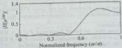{width=19%}  
Fig. 11.15 Frequency response of HPF of Example 11.11  

$$
H _ { 4 } ( e ^{j \pi} ) = \left\{ \begin{array}{ll} { 1 } & { \frac { \pi } { 4 } \leq | x | \leq \frac { 2 \pi } { 4 } } \\{ 0 } & { \frac { \pi } { 4 } < \frac { \pi } { 4 }  \mathrm { a n d }  \frac { 2 \pi } { 4 } < | x | \leq \pi } \end{array} \right.
$$  

using Fourier series method. Find the non-causal FIR filter impulse response $h_{M}(z)$ and system function $H_{M}(z)$. Moreover, find the causal FIR filter system function $H(z)$ and frequency response $H(e^{i\omega})$.  

# Solution:  

Given that the cut-off frequencies $F_{c1} = 1$ KHz, $F_{c2} = 3$ KHz, and sampling frequency $F_{T} = 8$ KHz. The digital cut-off frequencies are given as  

$GTR$  

$$
\begin{array}{rl} { \omega _ { c 1 } = { \frac { 2 \pi F _ { c 1 } } { F \tau } } = { \frac { 2 \pi \times 1 \times 10 ^{3} } { 8 \times 10 ^{3} } } } \\{ = { \frac { \pi } { 4 } } = 0 . 25 \pi  \mathrm { r s d / s a m p l e } } \\{ \omega _ { c 2 } = { \frac { 2 \pi F _ { c 2 } } { F \tau } } = { \frac { 2 \pi \times 3 \times 10 ^{3} } { 8 \times 10 ^{3} } } } \\{ = { \frac { 3 \pi } { 4 } } = 0 . 75 \pi  \mathrm { r s d / s a m p l e } } \end{array}
$$  

The desired frequency response of an ideal BPF is given as (Fig. 11.11c)  

$$
H _ { d } ( e ^{j \omega} ) = \left\{ \begin{array}{ll} { 1 } & { \nu _ { c 1 } \leq \frac { | \kappa | } { | \kappa | } \leq \nu _ { c 2 } , } \\{ 0 } & { | \kappa | < \nu _ { c 3 }  \mathrm { a n d }  \nu _ { c 2 } < | \kappa | \leq \pi } \end{array} \right.
$$  

where $\omega_{c1}=\frac{\pi}{4}$ and $\omega_{c2}=\frac{2\pi}{4}$. The desired impulse response of an ideal BPF is given as [Eq. (11.67)]  

$$
\begin{aligned} h _ { 4 } ( n ) & = \frac { 1 } { 2 \pi } \int _ { - \infty } ^{\infty} H _ { 4 } ( \varepsilon ^{j \omega} ) \varepsilon ^{j \omega - n} d \omega \\& = \frac { 1 } { 2 \pi } \left[ \int _ { - \infty } ^{- \infty} e ^{j \omega n} d \omega + \int _ { \omega , 1 } ^{\infty} e ^{j \omega n} d \omega \right] \\& = \frac { \sin \omega / 2 n } { \pi n } - \frac { \sin \omega / 1 n } { \pi n } \\& = \left\{ \begin{array}{ll} { \frac { \cos \omega - \cos \omega } { \pi n } } & { n = 0 } \\{ \frac { \sin \omega - \cos \omega } { \pi n } - \frac { \sin \omega - \cos \omega } { \pi n } } & { | n | > 0 } \end{array} \right. \end{aligned}
$$  

 ---------------------------------------------[ 第20页 ]---------------------------------------------  

Note that $h_{d}(n)$ is of infinite length and symmetric, that is, $h_{d}(n) = h_{d}(-n)$. The symmetric impulse response $h_{M}(n)$ of a length $M = 11$ FIR filter is obtained by truncating $h_{d}(n)$, that is,  

$$
\begin{array}{rl} { h _ { M } ( n ) = } & { { \left\{ \begin{array}{ll} { h _ { d } ( n ) } & { - 5 \leq n \leq 5 } \\{ 0 } & { { \mathrm { o t h e r w i s e } } } \end{array} \right. } } \\{ h _ { M } ( n ) = } & { { \left\{ \begin{array}{ll} { \frac { \sin \omega _ { d } n } { n n } - \frac { \sin \omega _ { d } n } { \pi n } } & { - 5 \leq n \leq 5 } \\{ 0 } & { { \mathrm { o t h e r w i s e } } } \end{array} \right. } } \\{ = } & { { \left\{ \begin{array}{ll} { \frac { \omega _ { d } - \omega _ { d } } { \pi } } & { n = 0 } \\{ \frac { \sin \omega _ { d } n } { \pi n } - \frac { \sin \omega _ { d } n } { \pi n } } & { 1 \leq | n | \leq 4 } \\{ 0 } & { { \mathrm { o t h e r w i s e } } } \end{array} \right. } } \end{array}
$$  

Since $h_{M}(n)$ is symmetric, that is, $h_{M}(n) = h_{M}(-n)$, we obtain the following:  

$$
\begin{aligned} h _ { M } ( 0 ) & = \frac { \omega _ { c 2 } - \omega _ { c 1 } } { \pi } = \frac { 0 . 75 \pi - 0 . 25 \pi } { \pi } = 0 . 5 \\h _ { M } ( 1 ) & = h _ { M } ( - 1 ) = \frac { \sin \omega _ { c 2 } n } { \pi n } - \frac { \sin \omega _ { c 1 } n } { \pi n } \\& = \frac { \sin \left( \frac { 3 \pi } { 4 } \times 1 \right) } { \pi \times 1 } - \frac { \sin \left( \frac { \pi } { 4 } \times 1 \right) } { \pi \times 1 } = 0 \\h _ { M } ( 2 ) & = h _ { M } ( - 2 ) = \frac { \sin \left( \frac { 3 \pi } { 4 } \times 2 \right) } { \pi \times 2 } - \frac { \sin \left( \frac { \pi } { 4 } \times 2 \right) } { \pi \times 2 } \\& = - 0 . 31 83 \\h _ { M } ( 3 ) & = h _ { M } ( - 3 ) = \frac { \sin \left( \frac { 3 \pi } { 4 } \times 3 \right) } { \pi \times 3 } - \frac { \sin \left( \frac { \pi } { 4 } \times 3 \right) } { \pi \times 3 } \\& = 0 \\h _ { M } ( 4 ) & = h _ { M } ( - 4 ) = \frac { \sin \left( \frac { 3 \pi } { 4 } \times 4 \right) } { \pi \times 4 } - \frac { \sin \left( \frac { \pi } { 4 } \times 4 \right) } { \pi \times 4 } \\& = 0 \\h _ { M } ( 5 ) & = h _ { M } ( - 5 ) = \frac { \sin \left( \frac { 3 \pi } { 4 } \times 5 \right) } { \pi \times 5 } - \frac { \sin \left( \frac { \pi } { 4 } \times 5 \right) } { \pi \times 5 } \\& = 0 \end{aligned}
$$  

The system function $H_{M}(z)$ of a non-causal FIR BPF is given as  

$$
\begin{array}{rl} { H _ { M } ( z ) = } & { { } \sum _ { n = - ( M - 1 ) / 2 } ^{( M - 1 ) / 2} h _ { M } ( n ) z ^{- n} = \sum _ { n = - 5 } ^{5} h _ { M } ( n ) z ^{- n} } \\{ H _ { M } ( z ) = } & { { } h _ { M } ( 0 ) + \sum _ { n = 1 } ^{5} h _ { M } ( n ) [ z ^{n} + z ^{- n} ] } \\{ H _ { M } ( z ) = } & { { } 0 . 5 - 0 . 31 83 \left[ z ^{2} + z ^{- 2} \right] } \end{array}
$$  

To obtain a causal filter $h(n)$, we must also delay the impulse response $h_{M}(n)$ by $\frac{M-1}{2}=5$ samples so that its first sample appears at the origin.  

$$
H ( z ) = z ^{- 5} H _ { M } ( z ) = z ^{- 5} \left[ 0 . 5 - 0 . 31 83 \left[ z ^{2} + z ^{- 2} \right] \right]
$$  

Substituting $z = c^{i\omega}$, we get the frequency response of the causal FIR filter as  

$$
\begin{array}{rl} { H ( e ^{j \omega} ) = e ^{- j 5 \omega} H _ { M } ( e ^{j \omega} ) } & { { } } \\{ = e ^{- j 5 \omega} \left[ 0 . 5 - 0 . 31 83 \left[ e ^{j 2 \omega} + e ^{- j 2 \omega} \right] \right. } & { { } } \\{ = e ^{- j 5 \omega} \left[ 0 . 5 - 0 . 31 83 \times 2 \cos 2 \omega \right] } & { { } } \\{ H ( e ^{j \omega} ) = e ^{- j 5 \omega} \left[ 0 . 5 - 0 . 63 66 \cos 2 \omega \right] } & { { } } \end{array}
$$  

The magnitude response $|H(e^{l\omega})|$ is shown in Fig. 11.16.  

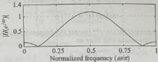{width=20%}  
Fig. 11.16 Frequency response of BPF of Example 11.12  

Example 11.13 Design an ideal FIR BSF of length $M = 11$ to pass frequencies in the range 1 KHz to 3 KHz and sampling frequency of $F_T = 8$ KHz using Fourier series method. Find the non-causal FIR filter impulse response $h_M(\mathbf{n})$ and system function $H_M(\mathbf{z})$. Moreover, find the causal FIR filter system function $H(z)$ and frequency response $H(e^{\omega})$.  

Design an ideal FIR BSF of length $M = 11$ with a frequency response  

$$
r s d / s a m p l e
$$  

using Fourier series method. Find the non-causal FIR filter impulse response $h_{M}(n)$ and system function $H_{M}(z)$. Moreover, find the causal FIR filter system function $H(z)$ and frequency response $H(e^{2\omega})$.  

$$
\begin{array}{rl} { { \frac { 1 } { 7 T } } = { \frac { 2 \pi \times 3 \times 10 ^{3} } { 8 \times 10 ^{3} } } } \\{ = { \frac { 3 \pi } { 4 } } = 0 . 75 \pi  { \mathrm { r a d / s a m p l e } } } \end{array}
$$  

$$
h ( n ) = h _ { M } \left( n - 5 \right)
$$  

$$
H _ { d } ( e ^{i \omega} ) = \left\{ \begin{array}{ll} { 1 } & { | \omega | \leq \omega _ { c i }  \mathrm { a n d }  \omega _ { i c } \leq | \omega | \leq \pi } \\{ 0 } & { \omega _ { i c } < | \frac { \pi } { k } | < \omega _ { c i } } \end{array} \right.
$$  

The desired frequency response of an ideal BSF is given as (Fig. 11.11d)  

$$
\begin{array}{rl} { h _ { M } ( 2 ) = h _ { M } ( - 2 ) = { \frac { \sin \left( { \frac { \pi } { 4 } } \times 2 \right) } { \pi \times 2 } } - { \frac { \sin \left( { \frac { 3 \pi } { 4 } } \times 2 \right) } { \pi \times 2 } } } & { { } } \\{ = 0 . 31 83 } & { { } } \\{ h _ { M } ( 3 ) = h _ { M } ( - 3 ) = { \frac { \sin \left( { \frac { \pi } { 4 } } \times 3 \right) } { \pi \times 3 } } - { \frac { \sin \left( { \frac { 3 \pi } { 4 } } \times 3 \right) } { \pi \times 3 } } } & { { } } \\{ = 0 } & { { } } \\{ h _ { M } ( 4 ) = h _ { M } ( - 4 ) = { \frac { \sin \left( { \frac { \pi } { 4 } } \times 4 \right) } { \pi \times 4 } } - { \frac { \sin \left( { \frac { 3 \pi } { 4 } } \times 4 \right) } { \pi \times 4 } } } & { { } } \\{ = 0 } & { { } } \\{ h _ { M } ( 5 ) = h _ { M } ( - 5 ) = { \frac { \sin \left( { \frac { \pi } { 4 } } \times 5 \right) } { \pi \times 5 } } - { \frac { \sin \left( { \frac { 3 \pi } { 4 } } \times 5 \right) } { \pi \times 5 } } } & { { } } \\{ = 0 } & { { } } \end{array}
$$  

where $\omega_{c1}=\frac{\pi}{4}$ and $\omega_{c2}=\frac{3\pi}{4}$. The desired impulse response of an ideal BSF is given as [Eq. (11.69)]  

$$
H _ { d } ( e ^{\beta \omega} ) = \left\{ \begin{array}{ll} { 1 } & { | \omega | \leq \omega _ { c 1 }  \mathrm { a n d }  \omega _ { c 2 } \leq | \omega | \leq \pi } \\{ 0 } & { \omega _ { c 1 } < | \omega | < \omega _ { c 2 } } \end{array} \right.
$$  

$$
\begin{aligned} h _ { d } ( n ) & = \frac { 1 } { 2 \pi } \int _ { - \pi } ^{\infty} H _ { d } ( e ^{i \omega} ) e ^{i \omega _ { d} } d \omega \\& = \frac { 1 } { 2 \pi } \left[ \int _ { - \pi } ^{\infty} e ^{i \omega _ { d} } d \omega + \int _ { - \pi } ^{\infty} e ^{i \omega _ { d} } d \omega \right. \\& \left. + \int _ { \omega _ { d } } ^{\infty} e ^{j \omega _ { d} } d \omega \right] \\& = \frac { \sin \pi n } { \pi n } + \frac { \sin \omega _ { c 1 } n } { \pi n } - \frac { \sin \omega _ { c 2 } n } { \pi n } \\h _ { d } ( n ) & = \delta ( n ) + \frac { \sin \omega _ { c 1 } n } { \pi n } - \frac { \sin \omega _ { c 2 } n } { \pi n } \\& = \left\{ \begin{array}{ll} { 1 - \frac { ( \omega _ { d } - \omega _ { c 1 } ) } { \pi n } } & { n = 0 } \\{ \frac { \sin \omega _ { c 1 } n } { \pi n } - \frac { \sin \omega _ { c 2 } n } { \pi n } } & { | n | > 0 } \end{array} \right. \end{aligned}
$$  

# Solution:  

Given that the cut-off frequencies $F_{c1} = 1$ KHz, $F_{c2} = 3$ KHz, and sampling frequency $F_{T} = 8$ KHz. The digital cut-off frequencies are given as:  

Note that $h_{d}(n)$ is of infinite length and symmetric, that is, $h_{d}(n) = h_{d}(-n)$. The symmetric impulse response $h_{M}(n)$ of a length $M = 11$ FIR filter is obtained by truncating $h_{d}(n)$, that is,  

$$
\omega _ { \mathrm { s t } } = \frac { 2 \pi F _ { \mathrm { c l } } } { F _ { T } } = \frac { 2 \pi \times 1 \times 10 ^{3} } { 8 \times 10 ^{3} }
$$  

$$
\begin{array}{rl} { h _ { M } ( n ) = } & { { \left\{ \begin{array}{ll} { h _ { d } ( n ) } & { - 5 \leq n \leq 5 } \\{ 0 } & { { \mathrm { o t h e r w i s e } } } \end{array} \right. } } \\{ h _ { M } ( n ) = } & { { \left\{ \begin{array}{ll} { \delta ( n ) + { \frac { \sin \omega _ { 1 } n } { \pi n } } - { \frac { \sin \omega _ { 2 } n } { \pi n } } } & { - 5 \leq n \leq 5 } \\{ 0 } & { { \mathrm { o t h e r w i s e } } } \end{array} \right. } } \\{ = } & { { \left\{ \begin{array}{ll} { { \frac { 1 - { \frac { ( \omega _ { 1 } - \omega _ { 2 } ) n } { \pi n } } } { \pi n } } } & { n = 0 } \\{ 0 } & { 1 \leq | n | \leq 4 } \end{array} \right. } } \end{array}
$$  

Since $h_{M}(n)$ is symmetric, that is, $h_{M}(n)=h_{M}(-n)$, we obtain the following:  

$$
\begin{aligned} h _ { M } ( 0 ) & = 1 - \frac { ( \omega _ { c 2 } - \omega _ { c 1 } ) } { \pi } \\& = 1 - \frac { ( 0 . 75 \pi - 0 . 25 \pi ) } { \pi } = 0 . 5 \\h _ { M } ( 1 ) & = h _ { M } ( - 1 ) = \frac { \sin \omega _ { c 1 } n } { \pi n } - \frac { \sin \omega _ { c 2 } n } { \pi n } \\& = \frac { \sin \left( \frac { \pi } { 4 } \times 1 \right) } { \pi \times 1 } - \frac { \sin \left( \frac { 3 \pi } { 4 } \times 1 \right) } { \pi \times 1 } = 0 \end{aligned}
$$  

The system function $H_{M}(z)$ of a non-causal FIR BSF is given as  

$$
\begin{array}{rl} { H _ { M } ( z ) = \sum _ { n = - ( M - 1 ) / 2 } ^{( M - 1 ) / 2} h _ { M } ( n ) z ^{- n} = \sum _ { n = - 5 } ^{5} h _ { M } ( n ) z ^{- n} } & { } \\{ H _ { M } ( z ) = h _ { M } ( 0 ) + \sum _ { n = 3 } ^{5} h _ { M } ( n ) [ z ^{n} + z ^{- n} ] } & { } \\{ H _ { M } ( z ) = 0 . 5 + 0 . 31 83 \left[ x ^{2} + x ^{- 2} \right] } & { } \end{array}
$$  

To obtain a causal filter $h(n)$, we must also delay the impulse response $h_{M}(n)$ by $\frac{M-1}{2}=5$ samples so that its first sample appears at the origin.  

$$
\begin{array}{rl} { h ( n ) = h _ { M } \left( n - 5 \right) } & { { } } \\{ H ( z ) = z ^{- 5} H _ { M } ( z ) = z ^{- 3} \left[ 0 . 5 + 0 . 31 83 \left[ z ^{2} + z ^{- 2} \right] \right] } & { { } } \end{array}
$$  

Substituting $z=e^{i\omega}$, we get the frequency response of the causal FIR filter as  

$$
\begin{array}{rl} { H ( e ^{j \omega} ) = e ^{- j \omega} H _ { M } ( e ^{j \omega} ) } & { { } } \\{ = e ^{- j \omega} \left[ 0 . 5 + 0 . 31 83 \left[ e ^{j \omega} + e ^{- j 2 \omega} \right] \right. } & { { } } \\{ = e ^{- j \omega} \left[ 0 . 5 + 0 . 31 83 \times 2 \cos 2 \omega \right] } & { { } } \\{ H ( e ^{j \omega} ) = e ^{- j \omega} \left[ 0 . 5 + 0 . 63 66 \cos 2 \omega \right] } & { { } } \end{array}
$$  

The magnitude response $|H(e^{2\omega})|$ is shown in Fig. 11.17.  

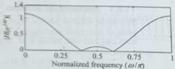{width=20%}  
Fig. 11.17 Frequency response of BSF of Example 11.13  

 ---------------------------------------------[ 第21页 ]---------------------------------------------  

# 11.8 WINDOWING METHOD  

A window is a finite-length sequence. Windowing is a process of forming a finite-length sequence from an infinite-length sequence by multiplying the infinite-length sequence with a window. In Section 11.7, we have truncated the desired non-causal impulse response $h_{d}(n)$ to obtain a non-causal FIR filter impulse response $h_{M}(n)$. Truncation of the impulse response $h_{d}(n)$ is equivalent to multiplication of the impulse response by a rectangular window, that is,  

$$
h _ { M } ( n ) = h _ { d } ( n ) w ( n )
$$  

where $w(n)$ is the (non-causal) rectangular window, which is defined as  

$$
w ( n ) = \left\{ \begin{array}{ll} { { 1 } } & { { - \frac { M - 1 } { 2 } \leq n \leq \frac { M - 1 } { 2 } } } \\{ { 0 } } & { { \mathrm { o t h e r w i s e } } } \end{array} \right.
$$  

Using multiplication property of the DTFT (Section 5.5.10), The DTFT of Eq. (11.80) is given as  

$$
H _ { M } ( e ^{j \omega} ) = \frac { 1 } { 2 \pi } \left[ H _ { d } ( e ^{j \omega} ) \circledast W ( e ^{j \omega} ) \right] = \frac { 1 } { 2 \pi } \int _ { 2 \pi } H _ { d } ( e ^{j \theta} ) W ( e ^{j ( \omega - \theta )} ) d \theta
$$  

where $W(e^{j\omega})$ is the DTFT of $w(n)$, and $\oplus$ is the circular convolution. This equation shows that the FIR filter frequency response $H_{M}(e^{j\omega})$ depends on the frequency response $W(e^{j\omega})$ of the window $w(n)$. As $W(e^{j\omega})$ has the classic $\frac{\sin x}{x}$ shape, truncation of $h_{d}(n)$ leads to the undesirable oscillations (or ripples) in the pass-band and stop-band (Gibbs' phenomenon) of the frequency response $H_{M}(e^{j\omega})$, which results from the slow convergence of the Fourier series. The Gibbs' phenomenon can be reduced by using a window $w(n)$ that tapers smoothly to zero at each end. Some of the commonly used windows are as follows:  

1. Rectangular window 4. Hamming window
2. Triangular (or Bartlett) window 5. Blackman window
3. Hann window 6. Kaiser window  

The first five windows have only one adjustable parameter, that is, the window length $M$. The Kaiser window has two adjustable parameters, that is, the window length and other parameter.  

# 11.8.1 Rectangular Window  

This is the simplest window function but provides the worst performance from the viewpoint of stop-band attenuation. The causal rectangular window, which can be used for both odd and even values of $M$, is given as  

The non-causal rectangular window, which is used only for odd values of $M$, is given by  

$$
w _ { r } ( n ) = \left\{ \begin{array}{ll} { 1 } & { 0 \leq n \leq M - 1 } \\{ 0 } & { \mathrm { o t h e r w i s e } } \end{array} \right.
$$  

$$
w _ { r } ( n ) = \left\{ \begin{array}{ll} { 1 } & { - \frac { M - 1 } { 2 } \leq n \leq \frac { M - 1 } { 2 } } \\{ 0 } & { \mathrm { o t h e r w i s e } } \end{array} \right.
$$  

Figure 11.18(a) shows the non-causal rectangular window for $M = 41$. The frequency response of non-causal rectangular window is given as  

$$
W _ { r } ( e ^{j \omega} ) = \sum _ { n = - \infty } ^{\infty} w _ { r } ( n ) e ^{- j \omega n} = \sum _ { n = - ( M - 1 ) / 2 } ^{( M - 1 ) / 2} e ^{- j \omega n}
$$  

A change of variables is performed by letting $k=n+M\frac{-1}{2}$, which also yields $k=0$ as $n=-\frac{M-\frac{1}{2}}{2}$ and $k=M-1$ as $n=\frac{M-1}{2}$. Therefore,  

$$
\begin{aligned} W _ { r } ( e ^{2 \omega} ) & = \sum _ { k = 0 } ^{M - 1} e ^{- j \omega \left( k - \frac { \pi} { 2 } \right) } = e ^{j \omega \left( \frac { \pi} { 2 } \right) } \sum _ { k = 0 } ^{M - 1} e ^{- j \omega k} = e ^{j \omega \left( \frac { M - 1} { 2 } \right) } \frac { 1 - e ^{- j \omega M} } { 1 - e ^{- j \omega} } \\& = e ^{j \omega \left( \frac { N - 1} { 2 } \right) } \frac { e ^{- j \omega \frac { N} { 2 } } e ^{j \times \frac { N} { 2 } } - e ^{- j \times \frac { N} { 2 } } e ^{- j \times \frac { N} { 2 } } } { e ^{- j \frac { N} { 2 } } e ^{j \frac { N} { 2 } } - e ^{- j \frac { N} { 2 } } e ^{- j \frac { N} { 2 } } } \\& = e ^{j \omega \frac { N} { 2 } } e ^{- j \frac { N} { 2 } } \frac { e ^{- j \omega \frac { N} { 2 } } \left( e ^{j \times \frac { N} { 2 } } - e ^{- j \times \frac { N} { 2 } } \right) } { e ^{- j \frac { N} { 2 } } \left( e ^{j \frac { N} { 2 } } - e ^{- j \times \frac { N} { 2 } } \right) } \\W _ { r } ( e ^{j \omega} ) & = \frac { \left( e ^{j \times \frac { N} { 2 } } - e ^{- j \times \frac { N} { 2 } } \right) } { \left( e ^{j \frac { N} { 2 } } - e ^{- j \times \frac { N} { 2 } } \right) } = \frac { \sin \frac { \pi M } { 2 } } { \sin \frac { \pi } { 2 } } \end{aligned} \tag{11}
$$  

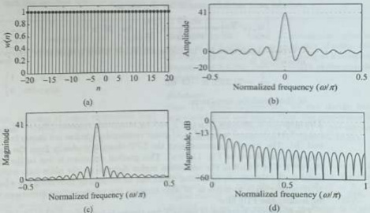{width=37%}  
Fig. 11.18 Rectangular window ($M = 41$) (a) Window sequence (b) Amplitude response (c) Magnitude response (d) Magnitude response in dB  

 ---------------------------------------------[ 第22页 ]---------------------------------------------  

The frequency response $W_{r}(e^{j\omega})$ for $M=41$ is shown in Fig. 11.18(b). The frequency response $W_{r}(e^{j\omega})$ has a narrow main lobe centred at $\omega=0$. All other ripples in the frequency response are called the sidelobes. The frequency response $W_{r}(e^{j\omega})$ has two features that are important for FIR filter design application, namely the main lobe width and the relative sidelobe level. The main lobe width is defined as the distance between the two points closest to $\omega=0$ where $W_{r}(e^{j\omega})=0$. The width of the transition band of $H_{M}(e^{j\omega})$ depends on the main lobe width of $W_{r}(e^{j\omega})$. The wider the main lobe, the wider will be the width of the transition band. The relative sidelobe level is defined as the difference in dB between the amplitudes of the largest sidelobe and the main lobe. The sidelobes of $W_{r}(e^{j\omega})$ produce ripples in both the pass-band and stop-band of $H_{M}(e^{j\omega})$. Figure 11.18(c) shows the magnitude response, and Fig. 11.18(d) shows the magnitude response in dB. From Fig. 11.18 we can make the following observations:  

1. The amplitude response $W_{r}(e^{j\omega})=\frac{\sin\frac{\omega M}{2}}{\sin\frac{\omega}{2}}=0$ when $\sin\frac{\omega M}{2}=0$, which implies that $\frac{\omega M}{2}=q\pi$, where $q=\pm1,\pm2,\pm3,\cdots$. The amplitude response $W_{r}(e^{j\omega})$ has the first zero at $\omega=\omega_{1}$, where  

$$
\frac { \omega _ { 1 } M } { 2 } = \pi  o r  \omega _ { 1 } = \frac { 2 \pi } { M }
$$  

Hence, the width of the main lobe is $2\omega_{1}=\frac{4\pi}{M}$. Therefore the approximate transition bandwidth is $\frac{4\pi}{M}$.  

2. The magnitude of the sidelobes will be maximum when $\sin\frac{\omega M}{2}=1$, which implies that $\frac{\omega M}{2}=\frac{g\pi}{2}$, where $q=\pm3,\pm5,\pm7,\cdots$. The magnitude of the first sidelobe (which is also the peak sidelobe magnitude) is at  

$$
\frac { \omega M } { 2 } = \frac { 3 \pi } { 2 }  o r  \omega = \frac { 3 \pi } { M }
$$  

and the peak sidelobe magnitude is given as  

$$
\left| W _ { r } ( e ^{2 \frac { 3 \pi} { 2 M } } ) \right| = \left| \frac { \sin \frac { 3 \pi } { 2 } } { \sin \frac { 2 \pi } { 2 M } } \right| \simeq \frac { 2 M } { 3 \pi }  \mathrm { f o r }  M \gg 1
$$  

Comparing this with the mainlobe amplitude, which is equal to $M$, the peak sidelobe magnitude is  

$$
\frac { 2 } { 3 \pi } = 21 . 22 \% \equiv - 13 ~ \mathrm { d B }
$$  

of the mainlobe amplitude,  

The magnitude response $|H_{M}(e^{j\omega})|$ and log magnitude response $|H_{M}(e^{j\omega})|_{\mathrm{dB}}$ of the LPF ($\omega_{c}=0.5\pi$) designed using $M=41$-point rectangular window are shown in Fig. 11.19(a) and (b). The frequency response of the LPF changes gradually from the pass-band to stop-band as shown in Fig. 11.19(a). This gradual transition is due to the main lobe of $W_{r}(e^{j\omega})$. The width of the transition region depends on the main lobe width, which is equal to $\frac{4\pi}{M}$. Hence, the transition width can be reduced by increasing the window length $M$. However, this increase in $M$ also increase the number of computations required to implement the FIR filter.  

The frequency response of the LPF has ripples in both the pass-band and stop-band as shown in Fig. 11.19(a). These ripples are due to the sidelobes of $W_{r}(e^{j\omega})$. The amplitude of these ripples is dictated by the amplitude of the sidelobes. As $M$ increases, the number  

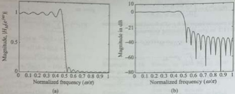{width=36%}  
Fig. 11.19 Low-pass filter of cut-off frequency $\omega_{\mathrm{C}}=0.5 \tau$ (a) Magnitude response of FIR LPF designed using a rectangular window ($M=41$) (b) Magnitude response in dB  

of ripples in both pass-band and stop-band increases, and at both low and high frequencies, their amplitude decreases except near the point of discontinuity (pass-band edge). This oscillatory behaviour at the point of discontinuity is known as Gibbs' phenomenon. The minimum stop-band attenuation is $A_{\mathrm{\~m\~a\~x\~}}=21$ dB as shown in Fig. 11.19(b).  

The rectangular window has an abrupt transition to zero. It is the abrupt truncation of the infinite length impulse response $h_{d}(n)$ that causes the oscillations associated with Gibbs' phenomenon. The Gibbs' phenomenon can be reduced by tapering the impulse response to zero more gradually with the help of tapered windows that tapers smoothly to zero at each end. The basic window design idea is that for the given filter specifications, choose the filter length $M$ and a window function $w(n)$ for the narrowest main lobe width and the smallest sidelobe attenuation possible.  

Example 11.14 Determine the frequency response (DTFT) of the causal rectangular window which is given as  

$$
w _ { r } ( n ) = \left\{ \begin{array}{ll} { 1 } & { 0 \leq n \leq M - 1 } \\{ 0 } & { o t h e r w i s e } \end{array} \right.
$$  

Solution:  

Example 11.15 Using a rectangular window, design an LPF with a pass-band gain of unity, cut-off frequency of 1000 Hz, and working at a sampling frequency of 5 KHz. Take the length of the impulse response as 7.  

The frequency response of causal rectangular window is given as  

# Solution:  

$$
\begin{aligned} W _ { r } ( e ^{j \omega} ) & = \sum _ { n = 0 } ^{M - 1} w _ { r } ( n ) e ^{- j \omega n} = \sum _ { n = 0 } ^{M - 1} e ^{- j \omega n} \\& = \frac { 1 - e ^{- j \omega N} } { 1 - e ^{- j \omega} } \\& = \frac { e ^{- j \times \frac { j} { 2 } } \left( e ^{j \times \frac { j} { 2 } } - e ^{- j \times \frac { j} { 2 } } \right) } { e ^{- j \frac { j} { 2 } } \left( e ^{j \frac { j} { 2 } } - e ^{- j \frac { j} { 2 } } \right) } \\W _ { r } ( e ^{j \omega} ) & = e ^{j \omega \left( \frac { j - 1} { 2 } \right) } \frac { \sin \frac { j M } { 2 } } { \sin \frac { j M } { 2 } } \end{aligned}
$$  

From the given information, we can design both non-causal filter and causal filter. For non-causal filter, the symmetry condition is $h(n) = h(-n)$, and for causal filter, the symmetry condition is $h(n) = h(M - 1 - n)$.  

Method 1 for non-causal filter design: Given that gain = 1, cut-off frequency $F_{c} = 1000$ Hz, sampling frequency $F_{T} = 5000$ Hz, and length $M = 7$. The digital cut-off frequency is given by $\omega_{c} = \frac{2\pi F_{c}}{F_{T}} = 2\pi \times 10^{1000} = 0.4\pi$. The symmetry condition is $h(n) = h(-n)$. Therefore, the desired frequency response of an ideal LPF is given as  

 ---------------------------------------------[ 第23页 ]---------------------------------------------  

$$
H _ { d } ( e ^{w} ) = \left\{ \begin{array}{ll} { 1 } & { | \omega | \leq \omega _ { c } } \\{ 0 } & { \omega _ { c } < | \omega | \leq \pi } \end{array} \right.
$$  

Its impulse response $h_{d}(n)$ is found using the inverse DTFT to give the following expression:  

$$
\begin{aligned} h _ { d } ( n ) & = \frac { 1 } { 2 \pi } \int _ { - \pi } ^{\pi} H _ { d } ( e ^{2 \omega} ) e ^{2 \omega n} d \omega \\& = \frac { 1 } { 2 \pi } \int _ { - \omega _ { c } } ^{\omega _ { c} } e ^{3 \omega n} d \omega \\& = \frac { 1 } { 2 \pi } \left( \frac { e ^{2 \omega n} } { j n } \right) \Big | _ { - \omega _ { c } } ^{\omega _ { c} } = \frac { 1 } { \pi n } \left( \frac { e ^{2 \omega n} - e ^{- j \omega _ { c} n } } { 2 j } \right) \\h _ { d } ( n ) & = \frac { \sin \omega _ { c } n } { \pi n } = \frac { \sin 0 . 4 \pi n } { \pi n } \end{aligned}
$$  

The desired impulse response is symmetric about $n=0$, that is, $h_{d}(n)=h_{d}(-n)$. At $n=0$, the $h_{d}(n)$ become $\frac{9}{5}$, which is indeterminate. Therefore, at $n=0$, the filter coefficient can be determined by applying L'Hospital's rule to this expression. Thus,  

$$
\begin{array}{rl} { h _ { d } ( 0 ) = \left. { \frac { { \frac { d } { d n } } \sin 0 . 4 \pi n } { { \frac { d } { d n } } \pi n } } \right| _ { n = 0 } } \\{ = { \frac { 0 . 4 \pi \cos 0 . 4 \pi n } { \pi } } \bigg | _ { n = 0 } = 0 . 4 } \end{array}
$$  

The other filter coefficients are given as  

$$
\begin{array}{rl} & { h _ { d } ( 1 ) = h _ { d } ( - 1 ) = 0 . 30 27 , } \\& { h _ { d } ( 2 ) = h _ { d } ( - 2 ) = 0 . 09 35 , } \\& { h _ { d } ( 3 ) = h _ { d } ( - 3 ) = - 0 . 06 24 } \\& { h _ { d } ( n ) = \{ - 0 . 06 24 , \, 0 . 09 35 , \, 0 . 30 27 , \, 0 . 4 , \, 0 . 30 27 , } \\& { 0 . 09 35 , \, - 0 . 06 24 \} } \end{array}
$$  

The non-causal rectangular window is given by  

$$
w ( n ) = { \left\{ \begin{array}{ll} { 1 } & { - 3 \leq n \leq 3 } \\{ 0 } & { { \mathrm { o t h e r w i s e } } } \end{array} \right. }
$$  

response of the designed non-causal FIR filter is given as  

The impulse response of the length-7 non-causal FIR filter is given as  

$$
\begin{array}{rl} { h ( n ) = h _ { d } ( n ) w ( n ) } & { { } } \\{ = \{ h _ { d } ( - 3 ) w ( - 3 ) , \ h _ { d } ( - 2 ) w ( - 2 ) , } & { { } } \\{ h _ { d } ( - 1 ) w ( - 1 ) , \ h _ { d } ( 0 ) w ( 0 ) , \ h _ { d } ( 1 ) w ( 1 ) , } & { { } } \\{ h _ { d } ( 2 ) w ( 2 ) , \ h _ { d } ( 3 ) w ( 3 ) \} } & { { } } \\{ h ( n ) = \{ - 0 . 06 24 , \ 0 . 09 35 , \ 0 . 30 27 , \ 0 . 4 , \ 0 . 30 27 , } & { { } } \\{ 0 . 09 35 , \ - 0 . 06 24 \} } & { { } } \end{array}
$$  

Note that the impulse response $h(n)$ satisfies the symmetry condition $h(n) = h(-n)$. The frequency  

$$
\begin{aligned} H \left( e ^{j \omega} \right) & = \sum _ { n = - 3 } ^{3} h ( n ) e ^{- j \omega n} \\& = h ( - 3 ) e ^{j 2 \omega} + h ( - 2 ) e ^{j 2 \omega} + h ( - 1 ) e ^{j \omega} \\& + h ( 0 ) + h ( 1 ) e ^{- j \omega} + h ( 2 ) e ^{- j 2 \omega} \\& + h ( 3 ) e ^{- j 3 \omega} \\& = h ( 0 ) + h ( 1 ) \left[ e ^{j \omega} + e ^{- j \omega} \right] \\& + h ( 2 ) \left[ e ^{j 2 \omega} + e ^{- j 2 \omega} \right] \\& + h ( 3 ) \left[ e ^{j 3 \omega} + e ^{- j 3 \omega} \right] \\& = h ( 0 ) + 2 h ( 1 ) \cos \omega + 2 h ( 2 ) \cos 2 \omega \\& + 2 h ( 3 ) \cos 3 \omega . \\H \left( e ^{j \omega} \right) & = 0 . 4 + 0 . 60 54 \cos \omega + 0 . 18 70 \cos 2 \omega \\& - 0 . 12 48 \cos 3 \omega . \end{aligned}
$$  

Method 2 for causal filter design: Given that gain = 1, cut-off frequency $F_{c} = 1000$ Hz, sampling frequency $F_{T} = 5000$ Hz, and length $M = 7$. The digital cut-off frequency is given by $\omega_{c} = \frac{2\pi F_{x}}{F_{T}} = \frac{2\pi \times 1000}{5000} = 0.4\pi$. The symmetry condition is $\hbar(n) = \hbar(M - 1 - n)$. Therefore, the desired frequency response of an ideal LPF is given as  

$$
H _ { d } ( e ^{i \omega} ) = \left\{ \begin{array}{ll} { { e ^{- j \pi \omega} } } & { { | \omega | \leq \omega _ { c } } } \\{ { 0 } } & { { | \omega | < \omega _ { c } } } \end{array} \right.
$$  

where $\tau=\frac{M-1}{2}=3$. Its impulse response $h_{d}(n)$ is found using the inverse DFT to give the following expression:  

$$
\begin{aligned} h _ { d } ( n ) & = \frac { 1 } { 2 \pi } \int _ { - \pi } ^{\infty} H _ { d } ( e ^{j \omega} ) e ^{j \omega n} d \omega \\& = \frac { 1 } { 2 \pi } \int _ { - \omega _ { c } } ^{\omega _ { c} } e ^{- j \tau \omega} e ^{j \omega n} d \omega \\& = \frac { 1 } { 2 \pi } \int _ { - \omega _ { c } } ^{\omega _ { c} } e ^{j \omega ( n - \tau )} d \omega \\& = \frac { 1 } { 2 \pi } \left( \frac { e ^{j \omega ( n - \tau )} } { j ( n - \tau ) } \right) \bigg | _ { - \omega _ { c } } ^{\omega _ { c} } \\& = \frac { 1 } { \pi ( n - \tau ) } \left( \frac { e ^{j \omega _ { c} ( n - \tau ) } - e ^{- j \omega _ { c} ( n - \tau ) } } { 2 j } \right) \\h _ { d } ( n ) & = \frac { \sin \omega _ { c } ( n - \tau ) } { \pi ( n - \tau ) } = \frac { \sin 0 . 4 \pi ( n - 3 ) } { \pi ( n - 3 ) } \end{aligned}
$$  

can be determined by applying L'Hospital's rule to this expression. Thus,  

$$
\begin{array}{rl} { h _ { d } ( 3 ) = \left. { \frac { \frac { d } { d \pi } \sin 0 . 4 \pi ( n - 3 ) } { \frac { d } { d \pi } \pi ( n - 3 ) } } \right| _ { n = 3 } } \\{ = \left. { \frac { 0 . 4 \pi \cos 0 . 4 \pi ( n - 3 ) } { \pi } } \right| _ { n = 3 } = 0 . 4 } \end{array}
$$  

The desired impulse response is symmetric about $n=3$, that is $h_{d}(n)=h_{d}(M-1-n)=h_{d}(6-n)$. At $n=\tau=3$, the $h_{d}(n)$ become $\frac{9}{0}$, which is indeterminate. Therefore, at $n=3$ the filter coefficient  

The other filter coefficients are given as  

$$
\begin{array}{rl} & { h _ { d } ( 0 ) = h _ { d } ( 6 ) = - 0 . 06 24 , } \\& { h _ { d } ( 1 ) = h _ { d } ( 5 ) = 0 . 09 35 , } \\& { h _ { d } ( 2 ) = h _ { d } ( 4 ) = 0 . 30 27 } \\& { h _ { d } ( n ) = \left\{ - 0 . 06 24 , ~ 0 . 09 35 , ~ 0 . 30 27 , ~ 0 . 4 , ~ 0 . 30 27 , \right. } \\& { \left. ~ ~ ~ ~ ~ ~ ~ ~ ~ ~ ~ ~ ~ ~ ~ ~ ~ ~ ~ ~ ~ ~ ~ ~ ~ ~ ~ ~ ~ ~ ~ ~ ~ ~ ~ ~ ~ ~ ~ ~ ~ ~ ~ ~ ~ ~ ~ ~ ~ ~ ~ ~ ~ ~ ~ ~ ~ ~ ~ ~ ~ ~ ~ ~ ~ ~ ~ ~ ~ ~ ~ ~ ~ ~ ~ ~ ~ ~ ~ ~ ~ ~ ~ ~ ~ ~ ~ ~ ~ ~ ~ ~ ~ ~ ~ ~ ~ ~ ~ ~ ~ ~ ~ ~ ~ ~ ~ ~ ~ ~ ~ ~ ~ ~ ~ ~ ~ ~ ~ ~ ~ ~ ~ ~ ~ ~ ~ ~ ~ ~ ~ ~ ~ ~ ~ ~ ~ ~ ~ ~ ~ ~ ~ ~ ~ ~ ~ ~ ~ ~ ~ ~ ~ ~ ~ ~ ~ ~ ~ ~ ~ ~ ~ ~ ~ ~ ~ ~ ~ ~ ~ ~ ~ ~ ~ ~ ~ ~ ~ ~ ~ ~ ~ ~ ~ ~ ~ ~ ~ ~ ~ ~ ~ ~ ~ ~ ~ ~ ~ ~ ~ ~ ~ ~ ~ ~ ~ ~ ~ ~ ~ ~ ~ ~ ~ ~ ~ ~ ~ ~ ~ ~ ~ ~ ~ ~ ~ ~ ~ ~ ~ ~ ~ ~ ~ ~ ~ ~ ~ ~ ~ ~ ~ ~ ~ ~ ~ ~ ~ ~ ~ ~ ~ ~ ~ ~ ~ ~ ~ ~ ~ ~ ~ ~ ~ ~ ~ ~ ~ ~ ~ ~ ~ ~ ~ ~ ~ ~ ~ ~ ~ ~ ~ ~ ~ ~ ~ ~ ~ ~ ~ ~ ~ ~ ~ ~ ~ ~ ~ ~ ~ ~ ~ ~ ~ ~ ~ ~ ~ ~ ~ ~ ~ ~ ~ ~ ~ ~ ~ ~ ~ ~ ~ ~ ~ ~ ~ ~ ~ ~ ~ ~ ~ ~ ~ ~ ~ ~ ~ ~ ~ ~ ~ ~ ~ ~ ~ ~ ~ ~ ~ ~ ~ ~ ~ ~ ~ ~ ~ ~ ~ ~ ~ ~ ~ ~ ~ ~ ~ ~ ~ ~ ~ ~ ~ ~ ~ ~ ~ ~ ~ ~ ~ ~ ~ ~ ~ ~ ~ ~ ~ ~ ~ ~ ~ ~ ~ ~ ~ ~ ~ ~ ~ ~ ~ ~ ~ ~ ~ ~ ~ ~ ~ ~ ~ ~ ~ ~ ~ ~ ~ ~ ~ ~ ~ ~ ~ ~ ~ ~ ~ ~ ~ ~ ~ ~ ~ ~ ~ ~ ~ ~ ~ ~ ~ ~ ~ ~ ~ ~ ~ ~ ~ ~ ~ ~ ~ ~ ~ ~ ~ ~ ~ ~ ~ ~ ~ ~ ~ ~ ~ ~ ~ ~ ~ ~ ~ ~ ~ ~ ~ ~ ~ ~ ~ ~ ~ ~ ~ ~ ~ ~ ~ ~ ~ ~ ~ ~ ~ ~ ~ ~ ~ ~ ~ ~ ~ ~ ~ ~ ~ ~ ~ ~ ~ ~ ~ ~ ~ ~ ~ ~ ~ ~ ~ ~ ~ ~ ~ ~ ~ ~ ~ ~ ~ ~ ~ ~ ~ ~ ~ ~ ~ ~ ~ ~ ~ ~ ~ ~ ~ ~ ~ ~ ~ ~ ~ ~ ~ ~ ~ ~ ~ ~ ~ ~ ~ ~ ~ ~ ~ ~ ~ ~ ~ ~ ~ ~ ~ ~ ~ ~ ~ ~ ~ ~ ~ ~ ~ ~ ~ ~ ~ ~ ~ ~ ~ ~ ~ ~ ~ ~ ~ ~ ~ ~ ~ ~ ~ ~ ~ ~ ~ ~ ~ ~ ~ ~ ~ ~ ~ ~ ~ ~ ~ ~ ~ ~ ~ ~ ~ ~ ~ ~ ~ ~ ~ ~ ~ ~ ~ ~ ~ ~ ~ ~ ~ ~ ~ ~ ~ ~ ~ ~ ~ ~ ~ ~ ~ ~ ~ ~ ~ ~ ~ ~ ~ ~ ~ ~ ~ ~ ~ ~ ~ ~ ~ ~ ~ ~ ~ ~ ~ ~ ~ ~ ~ ~ ~ ~ ~ ~ ~ ~ ~ ~ ~ ~ ~ ~ ~ ~ ~ ~ ~ ~ ~ ~ ~ ~ ~ ~ ~ ~ ~ ~ ~ ~ ~ ~ ~ ~ ~ ~ ~ ~ ~ ~ ~ ~ ~ ~ ~ ~ ~ ~ ~ ~ ~ ~ ~ ~ ~ ~ ~ ~ ~ ~ ~ ~ ~ ~ ~ ~ ~ ~ ~ ~ ~ ~ ~ ~ ~ ~ ~ ~ ~ ~ ~ ~ ~ ~ ~ ~ ~ ~ ~ ~ ~ ~ ~ ~ ~ ~ ~ ~ ~ ~ ~ ~ ~ ~ ~ ~ ~ ~ ~ ~ ~ ~ ~ ~ ~ ~ ~ ~ ~ ~ ~ ~ ~ ~ ~ ~ ~ ~ ~ ~ ~ ~ ~ ~ ~ ~ ~ ~ ~ ~ ~ ~ ~ ~ ~ ~ ~ ~ ~ ~ ~ ~ ~ ~ ~ ~ ~ ~ ~ ~ ~ ~ ~ ~ ~ ~ ~ ~ ~ ~ ~ ~ ~ ~ ~ ~ ~ ~ ~ ~ ~ ~ ~ ~ ~ ~ ~ ~ ~ ~ ~ ~ ~ ~ ~ ~ ~ ~ ~ ~ ~ ~ ~ ~ ~ ~ ~ ~ ~ ~ ~ ~ ~ ~ ~ ~ ~ ~ ~ ~ ~ ~ ~ ~ ~ ~ ~ ~ ~ ~ ~ ~ ~ ~ ~ ~ ~ ~ ~ ~ ~ ~ ~ ~ ~ ~ ~ ~ ~ ~ ~ ~ ~ ~ ~ ~ ~ ~ ~ ~ ~ ~ ~ ~ ~ ~ ~ ~ ~ ~ ~ ~ ~ ~ ~ ~ ~ ~ ~ ~ ~ ~ ~ ~ ~ ~ ~ ~ ~ ~ ~ ~ ~ ~ ~ ~ ~ ~ ~ ~ ~ ~ ~ ~ ~ ~ ~ ~ ~ ~ ~ ~ ~ ~ ~ ~ ~ ~ ~ ~ ~ ~ ~ ~ ~ ~ ~ ~ ~ ~ ~ ~ ~ ~ ~ ~ ~ ~ ~ ~ ~ ~ ~ ~ ~ ~ ~ ~ ~ ~ ~ ~ ~ ~ ~ ~ ~ ~ ~ ~ ~ ~ ~ ~ ~ ~ ~ ~ ~ ~ ~ ~ ~ ~ ~ ~ ~ ~ ~ ~ ~ ~ ~ ~ ~ ~ ~ ~ ~ ~ ~ ~ ~ ~ ~ ~ ~ ~ ~ ~ ~ ~ ~ ~ ~ ~ ~ ~ ~ ~ ~ ~ ~ ~ ~ ~ ~ ~ ~ ~ ~ ~ ~ ~ ~ ~ ~ ~ ~ ~ ~ ~ ~ ~ ~ ~ ~ ~ ~ ~ ~ ~ ~ ~ ~ ~ ~ ~ ~ ~ ~ ~ ~ ~ ~ ~ ~ ~ ~ ~ ~ ~ ~ ~ ~ ~ ~ ~ ~ ~ ~ ~ ~ ~ ~ ~ ~ ~ ~ ~ ~ ~ ~ ~ ~ ~ ~ ~ ~ ~ ~ ~ ~ ~ ~ ~ ~ ~ ~ ~ ~ ~ ~ ~ ~ ~ ~ ~ ~ ~ ~ ~ ~ ~ ~ ~ ~ ~ ~ ~ ~ ~ ~ ~ ~ ~ ~ ~ ~ ~ ~ ~ ~ ~ ~ ~ ~ ~ ~ ~ ~ ~ ~ ~ ~ ~ ~ ~ ~ ~ ~ ~ ~ ~ ~ ~ ~ ~ ~ ~ ~ ~ ~ ~ ~ ~ ~ ~ ~ ~ ~ ~ ~ ~ ~ ~ ~ ~ ~ ~ ~ ~ ~ ~ ~ ~ ~ ~ ~ ~ ~ ~ ~ ~ ~ ~ ~ ~ ~ ~ ~ ~ ~ ~ ~ ~ ~ ~ ~ ~ ~ ~ ~ ~ ~ ~ ~ ~ ~ ~ ~ ~ ~ ~ ~ ~ ~ ~ ~ ~ ~ ~ ~ ~ ~ ~ ~ ~ ~ ~ ~ ~ ~ ~ ~ ~ ~ ~ ~ ~ ~ ~ ~ ~ ~ ~ ~ ~ ~ ~ ~ ~ ~ ~ ~ ~ ~ ~ ~ ~ ~ ~ ~ ~ ~ ~ ~ ~ ~ ~ ~ ~ ~ ~ ~ ~ ~ ~ ~ ~ ~ ~ ~ ~ ~ ~ ~ ~ ~ ~ ~ ~ ~ ~ ~ ~ ~ ~ ~ ~ ~ ~ ~ ~ ~ ~ ~ ~ ~ ~ ~ ~ ~ ~ ~ ~ ~ ~ ~ ~ ~ ~ ~ ~ ~ ~ ~ ~ ~ ~ ~ ~ ~ ~ ~ ~ ~ ~ ~ ~ ~ ~ ~ ~ ~ ~ ~ ~ ~ ~ ~ ~ ~ ~ ~ ~ ~ ~ ~ ~ ~ ~ ~ ~ ~ ~ ~ ~ ~ ~ ~ ~ ~ ~ ~ ~ ~ ~ ~ ~ ~ ~ ~ ~ ~ ~ ~ ~ ~ ~ ~ ~ ~ ~ ~ ~ ~ ~ ~ ~ ~ ~ ~ ~ ~ ~ ~ ~ ~ ~ ~ ~ ~ ~ ~ ~ ~ ~ ~ ~ ~ ~ ~ ~ ~ ~ ~ ~ ~ ~ ~ ~ ~ ~ ~ ~ ~ ~ ~ ~ ~ ~ ~ ~ ~ ~ ~ ~ ~ ~ ~ ~ ~ ~ ~ ~ ~ ~ ~ ~ ~ ~ ~ ~ ~ ~ ~ ~ ~ ~ ~ ~ ~ ~ ~ ~ ~ ~ ~ ~ ~ ~ ~ ~ ~ ~ ~ ~ ~ ~ ~ ~ ~ ~ ~ ~ ~ ~ ~ ~ ~ ~ ~ ~ ~ ~ ~ ~ ~ ~ ~ ~ ~ ~ ~ ~ ~ ~ ~ ~ ~ ~ ~ ~ ~ ~ ~ ~ ~ ~ ~ ~ ~ ~ ~ ~ ~ ~ ~ ~ ~ ~ ~ ~ ~ ~ ~ ~ ~ ~ ~ ~ ~ ~ ~ ~ ~ ~ ~ ~ ~ ~ ~ ~ ~ ~ ~ ~ ~ ~ ~ ~ ~ ~ ~ ~ ~ ~ ~ ~ ~ ~ ~ ~ ~ ~ ~ ~ ~ ~ ~ ~ ~ ~ ~ ~ ~ ~ ~ ~ ~ ~ ~ ~ ~ ~ ~ ~ ~ ~ ~ ~ ~ ~ ~ ~ ~ ~ ~ ~ ~ ~ ~ ~ ~ ~ ~ ~ ~ ~ ~ ~ ~ ~ ~ ~ ~ ~ ~ ~ ~ ~ ~ ~ ~ ~ ~ ~ ~ ~ ~ ~ ~ ~ ~ ~ ~ ~ ~ ~ ~ ~ ~ ~ ~ ~ ~ ~ ~ ~ ~ ~ ~ ~ ~ ~ ~ ~ ~ ~ ~ ~ ~ ~ ~ ~ ~ ~ ~ ~ ~ ~ ~ ~ ~ ~ ~ ~ ~ ~ ~ ~ ~ ~ ~ ~ ~ ~ ~ ~ ~ ~ ~ ~ ~ ~ ~ ~ ~ ~ ~ ~ ~ ~ ~ ~ ~ ~ ~ ~ ~ ~ ~ ~ ~ ~ ~ ~ ~ ~ ~ ~ ~ ~ ~ ~ ~ ~ ~ ~ ~ ~ ~ ~ ~ ~ ~ ~ ~ ~ ~ ~ ~ ~ ~ ~ ~ ~ ~ ~ ~ ~ ~ ~ ~ ~ ~ ~ ~ ~ ~ ~ ~ ~ ~ ~ ~ ~ ~ ~ ~ ~ ~ ~ ~ ~ ~ ~ ~ ~ ~ ~ ~ ~ ~ ~ ~ ~ ~ ~ ~ ~ ~ ~ ~ ~ ~ ~ ~ ~ ~ ~ ~ ~ ~ ~ ~ ~ ~ ~ ~ ~ ~ ~ ~ ~ ~ ~ ~ ~ ~ ~ ~ ~ ~ ~ ~ ~ ~ ~ ~ ~ ~ ~ ~ ~ ~ ~ ~ ~ ~ ~ ~ ~ ~ ~ ~ ~ ~ ~ ~ ~ ~ ~ ~ ~ ~ ~ ~ ~ ~ ~ ~ ~ ~ ~ ~ ~ ~ ~ ~ ~ ~ ~ ~ ~ ~ ~ ~ ~ ~ ~ ~ ~ ~ ~ ~ ~ ~ ~ ~ ~ ~ ~ ~ ~ ~ ~ ~ ~ ~ ~ ~ ~ ~ ~ ~ ~ ~ ~ ~ ~ ~ ~ ~ ~ ~ ~ ~ ~ ~ ~ ~ ~ ~ ~ ~ ~ ~ ~ ~ ~ ~ ~ ~ ~ ~ ~ ~ ~ ~ ~ ~ ~ ~ ~ ~ ~ ~ ~ ~ ~ ~ ~ ~ ~ ~ ~ ~ ~ ~ ~ ~ ~ ~ ~ ~ ~ ~ ~ ~ ~ ~ ~ ~ ~ ~ ~ ~ ~ ~ ~ ~ ~ ~ ~ ~ ~ ~ ~ ~ ~ ~ ~ ~ ~ ~ ~ ~ ~ ~ ~ ~ ~ ~ ~ ~ ~ ~ ~ ~ ~ ~ ~ ~ ~ ~ ~ ~ ~ ~ ~ ~ ~ ~ ~ ~ ~ ~ ~ ~ ~ ~ ~ ~ ~ ~ ~ ~ ~ ~ ~ ~ ~ ~ ~ ~ ~ ~ ~ ~ ~ ~ ~ ~ ~ ~ ~ ~ ~ ~ ~ ~ ~ ~ ~ ~ ~ ~ ~ ~ ~ ~ ~ ~ ~ ~ ~ ~ ~ ~ ~ ~ ~ ~ ~ ~ ~ ~ ~ ~ ~ ~ ~ ~ ~ ~ ~ ~ ~ ~ ~ ~ ~ ~ ~ ~ ~ ~ ~ ~ ~ ~ ~ ~ ~ ~ ~ ~ ~ ~ ~ ~ ~ ~ ~ ~ ~ ~ ~ ~ ~ ~ ~ ~ ~ ~ ~ ~ ~ ~ ~ ~ ~ ~ ~ ~ ~ ~ ~ ~ ~ ~ ~ ~ ~ ~ ~ ~ ~ ~ ~ ~ ~ ~ ~ ~ ~ ~ ~ ~ ~ ~ ~ ~ ~ ~ ~ ~ ~ ~ ~ ~ ~ ~ ~ ~ ~ ~ ~ ~ ~ ~ ~ ~ ~ ~ ~ ~ ~ ~ ~ ~ ~ ~ ~ ~ ~ ~ ~ ~ ~ ~ ~ ~ ~ ~ ~ ~ ~ ~ ~ ~ ~ ~ ~ ~ ~ ~ ~ ~ ~ ~ ~ ~ ~ ~ ~ ~ ~ ~ ~ ~ ~ ~ ~ ~ ~ ~ ~ ~ ~ ~ ~ ~ ~ ~ ~ ~ ~ ~ ~ ~ ~ ~ ~ ~ ~ ~ ~ ~ ~ ~ ~ ~ ~ ~ ~ ~ ~ ~ ~ ~ ~ ~ ~ ~ ~ ~ ~ ~ ~ ~ ~ ~ ~ ~ ~ ~ ~ ~ ~ ~ ~ ~ ~ ~ ~ ~ ~ ~ ~ ~ ~ ~ ~ ~ ~ ~ ~ ~ ~ ~ ~ ~ ~ ~ ~ ~ ~ ~ ~ ~ ~ ~ ~ ~ ~ ~ ~ ~ ~ ~ ~ ~ ~ ~ ~ ~ ~ ~ ~ ~ ~ ~ ~ ~ ~ ~ ~ ~ ~ ~ ~ ~ ~ ~ ~ ~ ~ ~ ~ ~ ~ ~ ~ ~ ~ ~ ~ ~ ~ ~ ~ ~ ~ ~ ~ ~ ~ ~ ~ ~ ~ ~ ~ ~ ~ ~ ~ ~ ~ ~ ~ ~ ~ ~ ~ ~ ~ ~ ~ ~ ~ ~ ~ ~ ~ ~ ~ ~ ~ ~ ~ ~ ~ ~ ~ ~ ~ ~ ~ ~ ~ ~ ~ ~ ~ ~ ~ ~ ~ ~ ~ ~ ~ ~ ~ ~ ~ ~ ~ ~ ~ ~ ~ ~ ~ ~ ~ ~ ~ ~ ~ ~ ~ ~ ~ ~ ~ ~ ~ ~ ~ ~ ~ ~ ~ ~ ~ ~ ~ ~ ~ ~ ~ ~ ~ ~ ~ ~ ~ ~ ~ ~ ~ ~ ~ ~ ~ ~ ~ ~ ~ ~ ~ ~ ~ ~ ~ ~ ~ ~ ~ ~ ~ ~ ~ ~ ~ ~ ~ ~ ~ ~ ~ ~ ~ ~ ~ ~ ~ ~ ~ ~ ~ ~ ~ ~ ~ ~ ~ ~ ~ ~ ~ ~ ~ ~ ~ ~ ~ ~ ~ ~ ~ ~ ~ ~ ~ ~ ~ ~ ~ ~ ~ ~ ~ ~ ~ ~ ~ ~ ~ ~ ~ ~ ~ ~ ~ ~ ~ ~ ~ ~ ~ ~ ~ ~ ~ ~ ~ ~ ~ ~ ~ ~ ~ ~ ~ ~ ~ ~ ~ ~ ~ ~ ~ ~ ~ ~ ~ ~ ~ ~ ~ ~ ~ ~ ~ ~ ~ ~ ~ ~ ~ ~ ~ ~ ~ ~ ~ ~ ~ ~ ~ ~ ~ ~ ~ ~ ~ ~ ~ ~ ~ ~ ~ ~ ~ ~ ~ ~ ~ ~ ~ ~ ~ ~ ~ ~ ~ ~ ~ ~ ~ ~ ~ ~ ~ ~ ~ ~ ~ ~ ~ ~ ~ ~ ~ ~ ~ ~ ~ ~ ~ ~ ~ ~ ~ ~ ~ ~ ~ ~ ~ ~ ~ ~ ~ ~ ~ ~ ~ ~ ~ ~ ~ ~ ~ ~ ~ ~ ~ ~ ~ ~ ~ ~ ~ ~ ~ ~ ~ ~ ~ ~ ~ ~ ~ ~ ~ ~ ~ ~ ~ ~ ~ ~ ~ ~ ~ ~ ~ ~ ~ ~ ~ ~ ~ ~ ~ ~ ~ ~ ~ ~ ~ ~ ~ ~ ~ ~ ~ ~ ~ ~ ~ ~ ~ ~ ~ ~ ~ ~ ~ ~ ~ ~ ~ ~ ~ ~ ~ ~ ~ ~ ~ ~ ~ ~ ~ ~ ~ ~ ~ ~ ~ ~ ~ ~ ~ ~ ~ ~ ~ ~ ~ ~ ~ ~ ~ ~ ~ ~ ~ ~ ~ ~ ~ ~ ~ ~ ~ ~ ~ ~ ~ ~ ~ ~ ~ ~ ~ ~ ~ ~ ~ ~ ~ ~ ~ ~ ~ ~ ~ ~ ~ ~ ~ ~ ~ ~ ~ ~ ~ ~ ~ ~ ~ ~ ~ ~ ~ ~ ~ ~ ~ ~ ~ ~ ~ ~ ~ ~ ~ ~ ~ ~ ~ ~ ~ ~ ~ ~ ~ ~ ~ ~ ~ ~ ~ ~ ~ ~ ~ ~ ~ ~ ~ ~ ~ ~ ~ ~ ~ ~ ~ ~ ~ ~ ~ ~ ~ ~ ~ ~ ~ ~ ~ ~ ~ ~ ~ ~ ~ ~ ~ ~ ~ ~ ~ ~ ~ ~ ~ ~ ~ ~ ~ ~ ~ ~ ~ ~ ~ ~ ~ ~ ~ ~ ~ ~ ~ ~ ~ ~ ~ ~ ~ ~ ~ ~ ~ ~ ~ ~ ~ ~ ~ ~ ~ ~ ~ ~ ~ ~ ~ ~ ~ ~ ~ ~ ~ ~ ~ ~ ~ ~ ~ ~ ~ ~ ~ ~ ~ ~ ~ ~ ~ ~ ~ ~ ~ ~ ~ ~ ~ ~ ~ ~ ~ ~ ~ ~ ~ ~ ~ ~ ~ ~ ~ ~ ~ ~ ~ ~ ~ ~ ~ ~ ~ ~ ~ ~ ~ ~ ~ ~ ~ ~ ~ ~ ~ ~ ~ ~ ~ ~ ~ ~ ~ ~ ~ ~ ~ ~ ~ ~ ~ ~ ~ ~ ~ ~ ~ ~ ~ ~ ~ ~ ~ ~ ~ ~ ~ ~ ~ ~ ~ ~ ~ ~ ~ ~ ~ ~ ~ ~ ~ ~ ~ ~ ~ ~ ~ ~ ~ ~ ~ ~ ~ ~ ~ ~ ~ ~ ~ ~ ~ ~ ~ ~ ~ ~ ~ ~ ~ ~ ~ ~ ~ ~ ~ ~ ~ ~ ~ ~ ~ ~ ~ ~ ~ ~ ~ ~ ~ ~ ~ ~ ~ ~ ~ ~ ~ ~ ~ ~ ~ ~ ~ ~ ~ ~ ~ ~ ~ ~ ~ ~ ~ ~ ~ ~ ~ ~ ~ ~ ~ ~ ~ ~ ~ ~ ~ ~ ~ ~ ~ ~ ~ ~ ~ ~ ~ ~ ~ ~ ~ ~ ~ ~ ~ ~ ~ ~ ~ ~ ~ ~ ~ ~ ~ ~ ~ ~ ~ ~ ~ ~ ~ ~ ~ ~ ~ ~ ~ ~ ~ ~ ~ ~ ~ ~ ~ ~ ~ ~ ~ ~ ~ ~ ~ ~ ~ ~ ~ ~ ~ ~ ~ ~ ~ ~ ~ ~ ~ ~ ~ ~ ~ ~ ~ ~ ~ ~ ~ ~ ~ ~ ~ ~ ~ ~ ~ ~ ~ ~ ~ ~ ~ ~ ~ ~ ~ ~ ~ ~ ~ ~ ~ ~ ~ ~ ~ ~ ~ ~ ~ ~ ~ ~ ~ ~ ~ ~ ~ ~ ~ ~ ~ ~ ~ ~ ~ ~ ~ ~ ~ ~ ~ ~ ~ ~ ~ ~ ~ ~ ~ ~ ~ ~ ~ ~ ~ ~ ~ ~ ~ ~ ~ ~ ~ ~ ~ ~ ~ ~ ~ ~ ~ ~ ~ ~ ~ ~ ~ ~ ~ ~ ~ ~ ~ ~ ~ ~ ~ ~ ~ ~ ~ ~ ~ ~ ~ ~ ~ ~ ~ ~ ~ ~ ~ ~ ~ ~ ~ ~ ~ ~ ~ ~ ~ ~ ~ ~ ~ ~ ~ ~ ~ ~ ~ ~ ~ ~ ~ ~ ~ ~ ~ ~ ~ ~ ~ ~ ~ ~ ~ ~ ~ ~ ~ ~ ~ ~ ~ ~ ~ ~ ~ ~ ~ ~ ~ ~ ~ ~ ~ ~ ~ ~ ~ ~ ~ ~ ~ ~ ~ ~ ~ ~ ~ ~ ~ ~ ~ ~ ~ ~ ~ ~ ~ ~ ~ ~ ~ ~ ~ ~ ~ ~ ~ ~ ~ ~ ~ ~ ~ ~ ~ ~ ~ ~ ~ ~ ~ ~ ~ ~ ~ ~ ~ ~ ~ ~ ~ ~ ~ ~ ~ ~ ~ ~ ~ ~ ~ ~ ~ ~ ~ ~ ~ ~ ~ ~ ~ ~ ~ ~ ~ ~ ~ ~ ~ ~ ~ ~ ~ ~ ~ ~ ~ ~ ~ ~ ~ ~ ~ ~ ~ ~ ~ ~ ~ ~ ~ ~ ~ ~ ~ ~ ~ ~ ~ ~ ~ ~ ~ ~ ~ ~ ~ ~ ~ ~ ~ ~ ~ ~ ~ ~ ~ ~ ~ ~ ~ ~ ~ ~ ~ ~ ~ ~ ~ ~ ~ ~ ~ ~ ~ ~ ~ ~ ~ ~ ~ ~ ~ ~ ~ ~ ~ ~ ~ ~ ~ ~ ~ ~ ~ ~ ~ ~ ~ ~ ~ ~ ~ ~ ~ ~ ~ ~ ~ ~ ~ ~ ~ ~ ~ ~ ~ ~ ~ ~ ~ ~ ~ ~ ~ ~ ~ ~ ~ ~ ~ ~ ~ ~ ~ ~ ~ ~ ~ ~ ~ ~ ~ ~ ~ ~ ~ ~ ~ ~ ~ ~ ~ ~ ~ ~ ~ ~ ~ ~ ~ ~ ~ ~ ~ ~ ~ ~ ~ ~ ~ ~ ~ ~ ~ ~ ~ ~ ~ ~ ~ ~ ~ ~ ~ ~ ~ ~ ~ ~ ~ ~ ~ ~ ~ ~ ~ ~ ~ ~ ~ ~ ~ ~ ~ ~ ~ ~ ~ ~ ~ ~ ~ ~ ~ ~ ~ ~ ~ ~ ~ ~ ~ ~ ~ ~ ~ ~ ~ ~ ~ ~ ~ ~ ~ ~ ~ ~ ~ ~ ~ ~ ~ ~ ~ ~ ~ ~ ~ ~ ~ ~ ~ ~ ~ ~ ~ ~ ~ ~ ~ ~ ~ ~ ~ ~ ~ ~ ~ ~
$$  

The causal rectangular window is given as  

$$
w ( n ) = \left\{ \begin{array}{ll} { 1 } & { 0 \leq n \leq 6 } \\{ 0 } & { o t h e r w i s e } \end{array} \right.
$$  

The impulse response of the length-7 causal FIR filter is given as  

$$
\begin{array}{rl} { h ( n ) = h _ { d } ( n ) w ( n ) } & { { } } \\{ = \{ h _ { d } ( 0 ) w ( 0 ) , \, h _ { d } ( 1 ) w ( 1 ) , \, h _ { d } ( 2 ) w ( 2 ) , } & { { } } \\{ h _ { d } ( 3 ) w ( 3 ) , \, h _ { d } ( 4 ) w ( 4 ) , \, h _ { d } ( 5 ) w ( 5 ) , } & { { } } \\{ h _ { d } ( 6 ) w ( 6 ) \} } & { { } } \\{ h ( n ) = \{ - 0 . 06 24 , \, 0 . 09 35 , \, 0 . 30 27 , \, 0 . 4 , \, 0 . 30 27 , \, 0 . 09 35 , \, - 0 . 06 24 \} } & { { } } \end{array}
$$  

Note that $h(n) = h(M - 1 - n) = h(6 - n)$. This is a Type-1 filter (Section 11.3.1). The frequency response of the designed causal FIR filter is given as  

$$
\begin{aligned} H ( e ^{2 \omega} ) & = \sum _ { n = 0 } ^{\infty} h ( n ) e ^{- j \omega n} \\& = h ( 0 ) + h ( 1 ) e ^{- j \omega} + h ( 2 ) e ^{- j 2 \omega} \\& + h ( 3 ) e ^{- j 3 \omega} + h ( 4 ) e ^{- j 4 \omega} + h ( 5 ) e ^{- j 5 \omega} \\& + h ( 6 ) e ^{- j 5 \omega} \\& = e ^{- j 3 \omega} \left[ h ( 0 ) e ^{j 3 \omega} + h ( 1 ) e ^{j 2 \omega} + h ( 2 ) e ^{j \omega} \right. \\& \left. + h ( 3 ) + h ( 4 ) e ^{- j \omega} + h ( 5 ) e ^{- j 2 \omega} \right. \\& \left. + h ( 6 ) e ^{- j 3 \omega} \right] \\& = e ^{- j 3 \omega} \left[ h ( 3 ) + h ( 2 ) [ e ^{j \omega} + e ^{- j 2 \omega} ] \right. \\& \left. + h ( 1 ) [ e ^{j 2 \omega} + e ^{- j 2 \omega} ] \right. \end{aligned}
$$  

$$
\begin{aligned} & \left. + h ( 0 ) [ e ^{- j 3 \omega} + e ^{- j 3 \omega} ] \right| \\& = e ^{- j 3 \omega} \left[ h ( 3 ) + 2 h ( 2 ) \cos \omega \right. \\& \left. + 2 h ( 1 ) \cos 2 \omega + 2 h ( 0 ) \cos 3 \omega \right] \\& H ( e ^{j \omega} ) = e ^{- j 3 \omega} \left[ 0 . 4 + 0 . 60 54 \cos \omega \right. \\& \left. + 0 . 18 70 \cos 2 \omega - 0 . 12 48 \cos 3 \omega \right] \end{aligned}
$$  

Example 11.16 Design an FIR digital BPF of unity gain using rectangular window whose upper and lower cut-off frequencies are 1 and 2 rad/sample, respectively, and length of the window $M = 9$.  

From the given information, we can design both non-causal filter and causal filter. For non-causal filter, the symmetry condition is $h(n) = h(-n)$, and for causal filter, the symmetry condition is $h(n) = h(M - 1 - n)$.  

# Solution:  

Method 1 for non-causal filter design: Given that gain = 1, lower cut-off frequency $\omega_{c1} = 1$ rad/sample, upper cut-off frequency $\omega_{c2} = 2$ rad/sample, and length $M = 9$. The symmetry condition is $h(n) = h(-n)$. Therefore, the frequency response of an ideal BPF is given as  

$$
H _ { 4 } ( \omega ^{2} ) = \left\{ \begin{array}{ll} { 1 } & { w _ { 13 } \leq w _ { 13 } } \\{ 0 } & { \frac { | \omega | } { | \omega | } < w _ { 13 } } \\{ \frac { | \omega | } { | \omega | } < w _ { 13 } } & { \mathrm { a n d } \ w _ { 13 } < \frac { | \omega | } { | \omega | } \leq \pi } \end{array} \right.
$$  

Its impulse response $h_{d}(n)$ is given as  

$$
\begin{aligned} h _ { 4 } ( n ) & = \frac { 1 } { 2 \pi } \int _ { - \infty } ^{\infty} H _ { 4 } ( e ^{j \omega} ) e ^{j \omega n} d \omega \\& = \frac { 1 } { 2 \pi } \left[ \int _ { - \infty } ^{- \infty} e ^{j \omega n} d \omega + \int _ { \omega , 1 } ^{- \infty} e ^{j \omega n} d \omega \right] \\& = \frac { 1 } { 2 \pi } \left[ \left( \frac { e ^{j \omega n} } { j n } \right) \left[ \begin{array}{l} { - \omega , 1 } \\{ - \omega , 2 } \end{array} \right] + \left( \frac { e ^{j \omega n} } { j n } \right) \left| \begin{array}{l} { \omega , 2 } \\{ \omega , 1 } \end{array} \right] \right] \\& = \frac { 1 } { 2 \gamma \pi n } \left[ \left( e ^{- j \omega , 1} n ^{-} - e ^{- j \omega , 2} n ^{+} + e ^{j \omega , 3} n ^{-} - e ^{j \omega , 1} n \right) \right] \\h _ { 4 } ( n ) & = \frac { 1 } { \pi n } \left[ \left( \frac { e ^{j \omega n} - e ^{- j \omega , n} } { 2 j } \right) \right. \\& \left. - \left( \frac { e ^{j \omega n} - e ^{- j \omega , n} } { 2 j } \right) \right] \\& = \frac { \sin \omega , 2 n } { \pi n } - \frac { \sin \omega , 1 n } { \pi n } \\h _ { 4 } ( n ) & = \frac { \sin \omega , 2 n } { \pi n } - \frac { \sin \omega , 2 n } { \pi n } - \frac { \sin n } { \pi n } \end{aligned}
$$  

The impulse response $h_{d}(n)$ is symmetric, that is, $h_{d}(n) = h_{d}(-n)$. At $n = 0$, the $h_{d}(n)$ become $\frac{1}{2}$, which is indeterminate. Therefore, at $n = 0$,  

 ---------------------------------------------[ 第24页 ]---------------------------------------------  

the filter coefficient can be determined by applying L'Hospital's rule to this expression. Thus,  

$$
\begin{array}{rl} { h _ { d } ( 0 ) = \left. { \frac { { \frac { d } { d n } } \sin 2 n } { { \frac { d } { d n } } \pi n } } \right| _ { n = 0 } - \left. { \frac { { \frac { d } { d n } } \sin n } { { \frac { d } { d n } } \pi n } } \right| _ { n = 0 } } \\{ = \left. { \frac { 2 \cos 2 n } { \pi } } \right| _ { n = 0 } - \left. { \frac { \cos n } { \pi } } \right| _ { n = 0 } } \\{ = { \frac { 2 } { \pi } } - { \frac { 1 } { \pi } } = { \frac { 1 } { \pi } } = 0 . 31 83 } \end{array}
$$  

The other filter coefficients are given as  

$$
\begin{array}{rl} & { h _ { d } ( 1 ) = h _ { d } ( - 1 ) = 0 . 02 16 , } \\& { h _ { d } ( 2 ) = h _ { d } ( - 2 ) = - 0 . 26 52 , } \\& { h _ { d } ( 3 ) = h _ { d } ( - 3 ) = - 0 . 04 46 , } \\& { h _ { d } ( 4 ) = h _ { d } ( - 4 ) = 0 . 13 90 } \\& { h _ { d } ( n ) = \{ 0 . 13 90 , \, - 0 . 04 46 , \, - 0 . 26 52 , \, 0 . 02 16 , } \\& { 0 . 31 83 , \, 0 . 02 16 , \, - 0 . 26 52 , } \\& { - 0 . 04 46 , \, 0 . 13 90 \} } \end{array}
$$  

The non-causal rectangular window is given as  

$$
w ( n ) = { \left\{ \begin{array}{ll} { 1 } & { - 4 \leq n \leq 4 } \\{ 0 } & { { \mathrm { o t h e r w i s e } } } \end{array} \right. }
$$  

The impulse response of the length-9 non-causal FIR filter is given as  

$$
\begin{array}{rl} { h ( n ) = h _ { d } ( n ) w ( n ) } & { { } } \\{ = \{ 0 . 13 90 , - 0 . 04 46 , - 0 . 26 52 , 0 . 02 16 , 0 . 31 83 , } & { { } } \\{ 0 . 02 16 , - 0 . 26 52 , - 0 . 04 46 , 0 . 13 90 \} } & { { } } \end{array}
$$  

Note that the impulse response $h(n)$ satisfies the symmetry condition $h(n) = h(-n)$. The frequency response of the designed FIR BPF is given as  

$$
\begin{aligned} H ( e ^{j \omega} ) & = \sum _ { n = - 4 } ^{4} h ( n ) e ^{- j \omega n} \\& = h ( - 4 ) e ^{j \omega} + h ( - 3 ) e ^{j 3 \omega} + h ( - 2 ) e ^{j 2 \omega} \\& + h ( - 1 ) e ^{j \omega} + h ( 0 ) + h ( 1 ) e ^{- j \omega} . \\& + h ( 2 ) e ^{- j 2 \omega} + h ( 3 ) e ^{- j 3 \omega} + h ( 4 ) e ^{- j 4 \omega} \\& = h ( 0 ) + h ( 1 ) [ e ^{j \omega} + e ^{- j \omega} ] \\& + h ( 2 ) [ e ^{j 2 \omega} + e ^{- j 2 \omega} ] \\& + h ( 3 ) [ e ^{j 3 \omega} + e ^{- j 3 \omega} ] \\& + h ( 4 ) [ e ^{j 4 \omega} + e ^{- j 4 \omega} ] \\& = h ( 0 ) + 2 h ( 1 ) \cos \omega + 2 h ( 2 ) \cos 2 \omega \\& + 2 h ( 3 ) \cos 3 \omega + 2 h ( 4 ) \cos 4 \omega \end{aligned}
$$  

$$
\begin{array}{r} { H ( e ^{j \omega} ) = 0 . 31 83 + 0 . 04 32 \cos \omega - 0 . 53 04 \cos 2 \omega } \\{ - 0 . 08 92 \cos 3 \omega + 0 . 27 8 \cos 4 \omega } \end{array}
$$  

Method 2 for causal filter design: Given that gain = 1, lower cut-off frequency $\omega_{c1} = 1$ rad/sample, upper cut-off frequency $\omega_{c2} = 2$ rad/sample, and length $M = 9$. The symmetry condition is $h(n) = h(M - 1 - n) = h(8 - n)$. Therefore, the frequency response of an ideal BPF is given as  

$$
H _ { d } ( e ^{j \omega} ) = \left\{ \begin{array}{ll} { e ^{- j \pi \omega} } & { \omega _ { c 1 } \leq | w | \leq \omega _ { c 2 } } \\{ 0 } & { | w | < \omega _ { c 1 }  \mathrm { a n d }  \omega _ { c 2 } < | w | \leq \pi } \end{array} \right.
$$  

where $\tau=\frac{M-1}{2}=4$. Its impulse response $h_{d}(n)$ is given as  

$$
\begin{aligned} h _ { d } ( n ) & = \frac { 1 } { 2 \pi } \int _ { - \pi } ^{\pi} H _ { d } ( e ^{j \omega} ) e ^{j \omega n} d \omega \\& = \frac { 1 } { 2 \pi } \left[ \int _ { - \omega _ { d } } ^{- \omega _ { d} } e ^{- j \tau \omega} e ^{j \omega n} d \omega \\& + \int _ { \omega _ { d } } ^{\omega _ { d} } e ^{- j \tau \omega} e ^{j \omega n} d \omega \right] \\& = \frac { 1 } { 2 \pi } \left[ \int _ { - \omega _ { c 2 } } ^{- \omega _ { c 1} } e ^{j \omega ( n - \tau )} d \omega + \int _ { \omega _ { c 3 } } ^{\omega _ { c 2} } e ^{j \omega ( n - \tau )} d \omega \right] \\& = \frac { 1 } { 2 \pi } \left[ \left( \frac { e ^{j \omega ( n - \tau )} } { j ( n - \tau ) } \right) \left| _ { - \omega _ { d } } ^{- \omega _ { d 1} } + \left( \frac { e ^{j \omega ( n - \tau )} } { j ( n - \tau ) } \right) \right| _ { \omega _ { d 1 } } ^{u _ { d 2} } \right] \\h _ { d } ( n ) & = \frac { 1 } { \pi ( n - \tau ) } \left[ \left( \frac { e ^{j \omega _ { c 2} ( n - \tau ) } - e ^{- j \omega _ { c 2} ( n - \tau ) } } { 2 j } \right) \right. \\& \left. - \left( \frac { e ^{j \omega _ { c 1} ( n - \tau ) } - e ^{- j \omega _ { c 1} ( n - \tau ) } } { 2 j } \right) \right] \\h _ { d } ( n ) & = \frac { \sin \omega _ { c 2 } ( n - \tau ) } { \pi ( n - \tau ) } - \frac { \sin \omega _ { c 1 } ( n - \tau ) } { \pi ( n - \tau ) } \\& = \frac { \sin 2 ( n - 4 ) } { \pi ( n - 4 ) } - \frac { \sin ( n - 4 ) } { \pi ( n - 4 ) } \end{aligned}
$$  

The other filter coefficients are given as  

$$
\begin{array}{rl} & { h _ { d } ( 0 ) = h _ { d } ( 8 ) = 0 . 13 90 , } \\& { h _ { d } ( 1 ) = h _ { d } ( 7 ) = - 0 . 04 46 } \\& { h _ { d } ( 2 ) = h _ { d } ( 6 ) = - 0 . 26 52 , } \\& { h _ { d } ( 3 ) = h _ { d } ( 5 ) = 0 . 02 16 } \\& { h _ { d } ( n ) = \{ 0 . 13 90 , - 0 . 04 46 , - 0 . 26 52 , 0 . 02 16 , } \\& { \stackrel { \circ } { 0 . 31 83 } , 0 . 02 16 , - 0 . 26 52 , } \\& { - 0 . 04 46 , 0 . 13 90 \} } \end{array}
$$  

The causal rectangular window is given as  

The impulse response $h_{d}(n)$ is symmetric about $n=4$, that is, $h_{d}(n)=h_{d}(M-1-n)=h_{d}(8-n)$. At $n=4$, the $h_{d}(n)$ become $\frac{0}{6}$, which is indeterminate. Therefore, at $n=4$, the filter coefficient can be determined by applying L'Hospital's rule to this expression. Thus,  

$$
w ( n ) = { \left\{ \begin{array}{ll} { 1 } & { 0 \leq n \leq 8 } \\{ 0 } & { { \mathrm { o t h e r w i s e } } } \end{array} \right. }
$$  

The impulse response of the length-9 causal FIR filter is given as  

$$
\begin{array}{rl} { h _ { d } ( 4 ) = \left. { \frac { \frac { d } { d n } \sin 2 ( n - 4 ) } { \frac { d } { d n } \pi ( n - 4 ) } } \right| _ { n = 4 } } & { { } - \left. { \frac { \frac { d } { d n } \sin ( n - 4 ) } { \frac { d } { d n } \pi ( n - 4 ) } } \right| _ { n = 4 } } \\{ = { \frac { 2 \cos 2 ( n - 4 ) } { \pi } } \bigg | _ { n = 4 } } & { { } - { \frac { \cos ( n - 4 ) } { \pi } } \bigg | _ { n = 4 } } \\{ = { \frac { 2 } { \pi } } - { \frac { 1 } { \pi } } = { \frac { 1 } { \pi } } = 0 . 31 83 } \end{array}
$$  

$$
\begin{array}{rl} { h ( n ) = h _ { d } ( n ) w ( n ) } & { { } } \\{ = \{ 0 . 13 90 , - 0 . 04 46 , - 0 . 26 52 , 0 . 02 16 , 0 . 31 83 , } \\{ 0 . 02 16 , - 0 . 26 52 , - 0 . 04 46 , 0 . 13 90 \} } & { { } } \end{array}
$$  

Example 11.17 An LPF is to be designed with the following desired frequency response:  

Note that the impulse response $h(n)$ satisfies the symmetry condition $h(n)=h(M-1-n)=h(8-n)$. The frequency response of the designed FIR BPF is given as  

$$
H _ { 4 } ( e ^{2 \varphi} ) = \left\{ \begin{array}{ll} { { e ^{- 32 \varphi} } } & { { - \frac { \pi } { 2 } \leq \omega \leq \frac { \pi } { 4 } } } \\{ { 0 } } & { { - \frac { \pi } { 2 } < \frac { \pi } { 4 } \leq \omega \leq \frac { \pi } { 4 } } } \end{array} \right.
$$  

Determine the filter coefficients $h(n)$ if the window function is defined as  

$$
\begin{aligned} H \left( \epsilon ^{j \omega} \right) & = \sum _ { n = 0 } ^{\infty} h ( n ) \epsilon ^{- j \omega n} \\& = h ( 0 ) + h ( 1 ) \epsilon ^{- j \omega} + h ( 2 ) \epsilon ^{- j 2 \omega} \\& + h ( 3 ) \epsilon ^{- j 3 \omega} + h ( 4 ) \epsilon ^{- j 4 \omega} + h ( 5 ) \epsilon ^{- j 3 \omega} \\& + h ( 6 ) \epsilon ^{- j 6 \omega} + h ( 7 ) \epsilon ^{- j 7 \omega} + h ( 8 ) \epsilon ^{- j 8 \omega} \\& = \mathrm { e } ^{- j 4 \omega} \left[ h ( 0 ) \epsilon ^{\omega 4 \omega} + h ( 1 ) \epsilon ^{\omega 3 \omega} + h ( 2 ) \epsilon ^{j 2 \omega} \right. \\& + h ( 3 ) \epsilon ^{j \omega} + h ( 4 ) + h ( 5 ) \epsilon ^{- j \omega} \\& + h ( 6 ) \epsilon ^{- j 2 \omega} + h ( 7 ) \epsilon ^{- j 3 \omega} + h ( 8 ) \epsilon ^{- j 4 \omega} \right] \\& = \mathrm { e } ^{- j 2 \omega} \left[ h ( 4 ) + h ( 3 ) [ \epsilon ^{j \omega} + \epsilon ^{- j \omega} ] \right. \\& \left. + h ( 2 ) [ \epsilon ^{j 2 \omega} + \epsilon ^{- j 2 \omega} ] \right. \\& + h ( 1 ) [ \epsilon ^{j 3 \omega} + \epsilon ^{- j 3 \omega} ] \right. \\& + h ( 0 ) [ \epsilon ^{j 4 \omega} + \epsilon ^{- j 4 \omega} ] \right. \\& = \mathrm { e } ^{- j 4 \omega} [ h ( 4 ) + 2 h ( 3 ) \cos \omega + 2 h ( 2 ) \cos 2 \omega } \\& + 2 h ( 1 ) \cos 3 \omega + 2 h ( 0 ) \cos 4 \omega | \\H \left( \epsilon ^{j \omega} \right) = \mathrm { e } ^{- j 4 \omega} [ 0 . 31 83 + 0 . 04 32 \cos \omega } \\& - 0 . 53 04 \cos 2 \omega - 0 . 08 92 \cos 3 \omega } \\& + 0 . 27 80 \cos 4 \omega | \end{aligned}
$$  

$$
w ( n ) = { \left\{ \begin{array}{ll} { 1 } & { 0 \leq n \leq 4 } \\{ 0 } & { { \mathrm { o t h e r w i s e } } } \end{array} \right. }
$$  

Determine and plot the frequency response $H(e^{i\omega})$ of the designed filter. Moreover, determine the system function and difference equation of the filter.  

# Solution:  

With cut-off frequency $\omega_{c}=\frac{\pi}{4}$, the given desired frequency response can be written as  

$$
H _ { 4 } ( e ^{i \pi} ) = \left\{ \begin{array}{ll} { { e ^{- i 2 \pi} } } & { { - \omega _ { 1 } \leq w \leq w _ { 1 } } } \\{ { 0 } } & { { \omega _ { 2 } < | w | \leq \pi } } \end{array} \right.
$$  

The desired impulse response $h_{d}(n)$ is given as  

$$
\begin{array}{rl} { h _ { d } ( n ) = } & { { } { \frac { 1 } { 2 \pi } } \int _ { - \infty } ^{\infty} H _ { d } ( e ^{j \omega t} ) e ^{j \omega t} d \omega } \\{ } & { { } = { \frac { 1 } { 2 \pi } } \int _ { - \infty } ^{\infty} e ^{- j \omega t} e ^{j \omega t} d \omega } \\{ } & { { } = { \frac { 1 } { 2 \pi } } \int _ { - \infty } ^{\infty} e ^{j \omega ( n - 2 )} d \omega } \\{ } & { { } = { \frac { 1 } { 2 \pi } } \left( { \frac { e ^{j \omega ( n - 2 )} } { j ( n - 2 ) } } \right) \left[ \begin{array}{l} { { \omega } } \\{ { - \omega } } \end{array} \right] } \\{ } & { { } = { \frac { 1 } { \pi ( n - 2 ) } } \left( { \frac { e ^{j \omega t} ( n - 2 ) - e ^{- j \omega t} ( n - 2 ) } { 2 j } } \right) } \\{ h _ { d } ( n ) = } & { { } { \frac { \sin \omega _ { c } ( n - 2 ) } { \pi ( n - 2 ) } } = { \frac { \sin { \frac { \pi } { 4 } } ( n - 2 ) } { \pi ( n - 2 ) } } } \end{array}
$$  

The impulse response $\mathcal{H}_{d}(n)$ is symmetric about $n=2$. At $n=2$, the $\mathcal{H}_{d}(n)$ become $\frac{9}{2}$, which is indeterminate. Therefore, at $n=2$, the filter coefficient can be determined by applying L'Hospital's rule to this expression. Thus,  

$$
\begin{array}{rl} { \lambda _ { 0 } ( 2 ) = \left. { \frac { \frac { 1 } { 4 } \cos \frac { \pi } { 4 } ( n - 2 ) } { \frac { 1 } { 4 } \pi ( n - 2 ) } } \right| _ { n = 2 } } \\{ = \left. { \frac { \frac { 1 } { 4 } \cos \frac { \pi } { 4 } ( n - 2 ) } { \pi } } \right| _ { n = 2 } = { \frac { 1 } { 4 } } } \end{array}
$$  

The other filter coefficients are given as  

$$
\delta _ { d } ( 0 ) = h _ { d } ( 4 ) = \frac { 1 } { 2 \pi } ,  h _ { d } ( 1 ) = h _ { d } ( 3 ) = \frac { 1 } { \sqrt { 2 \pi } }
$$  

 ---------------------------------------------[ 第25页 ]---------------------------------------------  

Multiplying the desired impulse response $h_{d}(n)$ by specified window $w(n)$ to get the causal FIR filter impulse response $h(n)$, that is,  

The system function is given as  

$$
\begin{array}{rl} { h ( n ) = h _ { d } ( n ) w ( n ) } & { { } } \\{ = \{ h _ { d } ( 0 ) w ( 0 ) , \ h _ { d } ( 1 ) w ( 1 ) , \ h _ { d } ( 2 ) w ( 2 ) , } & { { } } \\{ h _ { d } ( 3 ) w ( 3 ) , \ h _ { d } ( 4 ) w ( 4 ) \} } & { { } } \\{ h ( n ) = \left\{ { \frac { 1 } { 2 \pi } } , \ { \frac { 1 } { \sqrt { 2 \pi } } } , \ { \frac { 1 } { 4 } } , \ { \frac { 1 } { \sqrt { 2 \pi } } } , \ { \frac { 1 } { 2 \pi } } \right\} } & { { } } \end{array}
$$  

Note that $h(n) = h(M-1-n) = h(4-n)$. The frequency response of the designed FIR filter is given as  

$$
\begin{aligned} H ( z ) & = \sum _ { n = 0 } ^{4} h ( n ) z ^{- n} = h ( 0 ) + h ( 1 ) z ^{- 1} \\& + h ( 2 ) z ^{- 2} + h ( 3 ) z ^{- 3} + h ( 4 ) z ^{- 4} \\& = k ( 0 ) + h ( 1 ) z ^{- 1} + \dot { h } ( 2 ) z ^{- 2} \\& + h ( 1 ) z ^{- 3} + h ( 0 ) z ^{- 4} \\& = k ( 0 ) [ 1 + z ^{- 4} ] + h ( 1 ) [ z ^{- 1} + z ^{- 3} ] \\& + h ( 2 ) z ^{- 2} \\H ( z ) & = \frac { 1 } { 2 \pi } [ 1 + z ^{- 4} ] + \frac { 1 } { \sqrt { 2 \pi } } [ z ^{- 1} + z ^{- 3} ] + \frac { 1 } { 4 } z ^{- 2} \end{aligned}
$$  

The difference equation is given as  

$$
\begin{aligned} H ( e ^{j \omega} ) & = \sum _ { n = 0 } ^{4} h ( n ) e ^{- j \omega n} = h ( 0 ) + h ( 1 ) e ^{- j \omega} \\& + h ( 2 ) e ^{- j 2 \omega} + h ( 3 ) e ^{- j 3 \omega} + h ( 4 ) e ^{- j 4 \omega} \\& = e ^{- j 2 \omega} \left[ h ( 0 ) e ^{j 2 \omega} + h ( 1 ) e ^{j \omega} + h ( 2 ) \right. \\& \left. + h ( 3 ) e ^{- j \omega} + h ( 4 ) e ^{- j 2 \omega} \right] \\& = e ^{- j 2 \omega} \left[ h ( 2 ) + h ( 1 ) [ e ^{j \omega} + e ^{- j \omega} ] \right. \\& \left. + h ( 0 ) [ e ^{j 2 \omega} + e ^{- j 2 \omega} ] \right] \\& = e ^{- j 2 \omega} \left[ h ( 2 ) + 2 h ( 1 ) \cos \omega + 2 h ( 0 ) \cos 2 \omega \right] \\H ( e ^{j \omega} ) & = e ^{- j 2 \omega} \left[ \frac { 1 } { 4 } + \frac { \sqrt { 2 } } { \pi } \cos \omega + \frac { 1 } { \pi } \cos 2 \omega \right] \end{aligned}
$$  

$$
\begin{array}{rl} { H ( z ) = { \frac { Y ( z ) } { X ( z ) } } = { \frac { 1 } { 2 \pi } } [ 1 + z ^{- 4} ] } & { { } } \\{                                                                                                                                                                                                                                                                                                                                                                                                                                                                                                                                                                                                                                                                                                                                                                                                                                                                                                                                                                                                                                                                                                                                                                                                                                                                                                                                                                                                \
$$  

The magnitude response is shown in Fig. 11.20(a) and is given as  

$$
| H ( e ^{2 \omega} ) | = \left| \frac { 1 } { 4 } + \frac { \sqrt { 2 } } { \pi } \cos \omega + \frac { 1 } { \pi } \cos 2 \omega \right|
$$  

This difference equation is used to draw the linear-phase structure, which is shown in Fig. 11.20(b).  

# 11.8.2 Triangular (or Bartlett) Window  

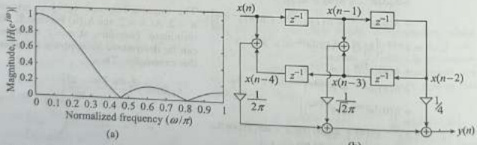{width=37%}  
Fig. 11.20 Figures for Example 11.17 (a) Magnitude response (b) Linear-phase structure (b)  

$$
w _ { t } ( n ) = \left\{ \begin{array}{ll} { 1 - \frac { 2 ( n - M - 1 ) } { M - 1 } } & { 0 \leq n \leq M - 1 } \\{ 0 } & { o t h e r w i s e } \end{array} \right.
$$  

The causal triangular window, which can be used for both odd and even values of $M$, is given as  

The non-causal triangular window, which is used only for odd values of $M$, is given as  

$$
w _ { 2 } ( n ) = \operatorname { t r i } \left( { \frac { n } { ( M - 1 ) / 2 } } \right) = { \left\{ \begin{array}{ll} { 1 - { \frac { 2 | n | } { M - 1 } } } & { - { \frac { M - 1 } { 2 } } \leq n \leq { \frac { M - 1 } { 2 } } } \\{ 0 } & { { \mathrm { o t h e r w i s e } } . } \end{array} \right. }
$$  

Figure 11.21(a) shows the non-causal triangular window for $M = 41$. The frequency response of non-causal triangular window is given as  

$$
W _ { t } ( e ^{2 \omega} ) = \frac { 2 } { M - 1 } \left( \frac { \sin \left( \omega \frac { M - 1 } { 4 } \right) } { \sin \frac { \pi } { 2 } } \right) ^{2}
$$  

The frequency response $W_{\mathrm{f}}(e^{i\omega})$ for $M=41$ is shown in Fig. 11.21(b). Note that the spectrum is always positive. Figure 11.21(c) shows the magnitude response, and Fig. 11.21(d) shows the magnitude response in dB. From Fig. 11.21, we can make the following observations:  

1. The main lobe width is approximately equal to $\frac{7\pi}{2}$, which is twice that of the rectangular window having the same duration. Therefore, the approximate transition bandwidth is $\frac{6\pi}{2}$.

2. The magnitude of the first sidelobe (which is also the peak sidelobe magnitude) is $-26$ dB relative to the maximum, which is smaller than that of the rectangular window ($-13$ dB).  

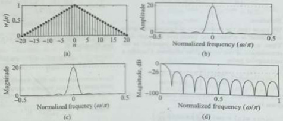{width=37%}  
Fig. 11.21 Triangular window ($M = 41$) (a) Window sequence (b) Amplitude response (c) Magnitude response (d) Magnitude response in dB  

 ---------------------------------------------[ 第26页 ]---------------------------------------------  

The magnitude response $|H_{M}(e^{j\omega})|$ and log magnitude response $|H_{M}(e^{j\omega})|_{\mathrm{dB}}$ of the LPF ($\omega_{e}=0.5\pi$) designed using $M=41$-point triangular window are shown in Fig. 11.22(a) and (b). The triangular window produces a smoother magnitude response. Note that the attenuation in the stop-band is now 26 dB, and furthermore, the response is also more flat in the pass-band in comparison with the rectangular window in Fig. 11.19. However, this improvement in pass-band ripple and stop-band attenuation is achieved at the cost of a wider transition band.  

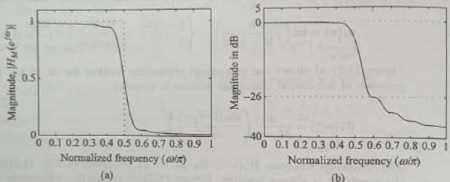{width=35%}  
Fig. 11.22 Low-pass filter of cut-off frequency $\omega_{c} = 0.5\pi$ (a) Magnitude response of FIR LPF designed using triangular window ($M = 41$) (b) Magnitude response in dB  

Example 11.18 Determine the frequency response (DTFT) of the non-causal triangular window, which is given by  

$$
w _ { t } ( n ) = \left\{ \begin{array}{ll} { { 1 - \frac { 2 | n | } { M - 1 } } } & { { - \frac { M - 1 } { 2 } \leq n \leq \frac { M - 1 } { 2 } } } \\{ { 0 } } & { { \mathrm { o t h e r w i s e } } } \end{array} \right.
$$  

# Solution:  

$$
= \left( { \frac { M - 1 } { 2 } } \right) \operatorname { t r i } \left( { \frac { n } { ( M - 1 ) / 2 } } \right)
$$  

where $2N+1=\frac{M-1}{2}$ or equivalently $N=\frac{M-3}{4}$. We may, thus, express a triangular window $w_{i}(n)$ in terms of the convolution.  

We know that the convolution of a rectangular pulse with itself is a triangular pulse (see Example 3.4). Thus, a triangular window may be regarded as the convolution of two rectangular windows. Consider a rectangular pulse  

$$
\begin{array}{rl} { W _ { 1 } ( e ^{i \omega} ) = { \frac { 2 } { M - 1 } } \left[ W ( e ^{j \omega} ) \right] ^{2} } \\{ = { \frac { 2 } { M - 1 } } \left( { \frac { \sin \left( \omega { \frac { M - 1 } { 4 } } \right) } { \sin { \frac { \pi } { 2 } } } } \right) ^{2} } \end{array}
$$  

$$
w ( n ) = \operatorname { r e c t } \left( { \frac { n } { 2 N } } \right) = { \left\{ \begin{array}{ll} { 1 } & { - N \leq n \leq N } \\{ 0 } & { { \mathrm { o t h e r w i s e } } } \end{array} \right. }
$$  

The convolution of a rectangular pulse with itself is given by  

$$
\begin{array}{rl} { w _ { t } ( n ) = \operatorname { t r i } \left( { \frac { n } { ( M - 1 ) / 2 } } \right) } \\{ = { \frac { 2 } { M - 1 } } [ w ( n ) * w ( n ) ] } \end{array}
$$  

The DTFT of the rectangular pulse $w(\eta)$ is given by (see Example 5.6)  

$$
W ( e ^{i \omega} ) = \frac { \sin \left( \frac { \pi } { 2 } ( 2 N + 1 ) \right) } { \sin \frac { \pi } { 2 } } = \frac { \sin \left( \omega \frac { M - 1 } { 4 } \right) } { \sin \frac { \pi } { 2 } }
$$  

$$
\begin{array}{rl} { w ( n ) * w ( n ) = \operatorname { r e c t } \left( { \frac { n } { 2 N } } \right) * \operatorname { r e c t } \left( { \frac { n } { 2 N } } \right) } & { { } } \\{ = ( 2 N + 1 ) \operatorname { t r i } \left( { \frac { n } { 2 N + 1 } } \right) } & { { } } \end{array}
$$  

Since convolution in the time domain corresponds to multiplication in the frequency domain, the DTFT of the triangular window may be written as  

Example 11.19: Design a linear-phase low-pass digital filter if the desired frequency response is given as  

$$
H _ { d } ( e ^{2 \nu} ) = \left\{ \begin{array}{ll} { { e ^{- j 3 \omega} } } & { { 0 \leq | \omega | \leq \frac { \pi } { 2 } } } \\{ { 0 } } & { { \frac { | \omega | } { 2 } \leq | \omega | } } \end{array} \right.
$$  

Using the Bartlett window and choosing a suitable value of filter length $M$, find the impulse response and frequency response of the designed filter. Determine the system function and difference equation of the designed FIR filter. Draw the linear-phase structure of the filter.  

Solution:  

With cut-off frequency $\omega_{c}=\frac{\pi}{2}$ and $\tau=3$, the given desired frequency response can be written as  

$$
H _ { d } ( e ^{j \omega} ) = \left\{ \begin{array}{ll} { { e ^{- j \tau w} } } & { { - w _ { c } \leq w _ { c } \leq w _ { c } } } \\{ { 0 } } & { { \frac { E } { \sqrt { 1 + \eta _ { c } } } \leq w _ { c } } } \end{array} \right.
$$  

where $\tau=\frac{M-1}{2}$; thus, $M=2\tau+1=7$. The desired impulse response $h_{d}(n)$ is given by  

$$
h _ { d } ( 2 ) = h _ { d } ( 4 ) = \frac { 1 } { \pi }
$$  

$$
\begin{aligned} h _ { d } ( n ) & = \frac { 1 } { 2 \pi } \int _ { - \infty } ^{\infty} H _ { d } ( e ^{j - n} ) e ^{j - n} d \omega \\& = \frac { 1 } { 2 \pi } \int _ { - \omega _ { c } } ^{\omega _ { c} } e ^{- j \tau \omega} e ^{j \omega _ { c} } d \omega \\& = \frac { 1 } { 2 \pi } \int _ { - \omega _ { c } } ^{\omega _ { c} } e ^{j \omega ( n - \tau )} d \omega \\& = \frac { 1 } { 2 \pi } \left( \frac { e ^{2 \omega ( n - \tau )} } { j ( n - \tau ) } \right) \bigg | _ { - \omega _ { c } } ^{\omega _ { c} } \\& = \frac { 1 } { \pi ( n - \tau ) } \left( \frac { e ^{2 \omega _ { c} ( n - \tau ) } - e ^{- j \omega _ { c} ( n - \tau ) } } { 2 j } \right) \\h _ { d } ( n ) & = \frac { \sin \omega _ { c } ( n - \tau ) } { \pi ( n - \tau ) } = \frac { \sin \frac { \pi } { 2 } ( n - 3 ) } { \pi ( n - 3 ) } \end{aligned}
$$  

The impulse response $h_{d}(n)$ is symmetric about n = 3. At n = 3, the $h_{d}(n)$ become $\frac{0}{0}$, which is indeterminate. Therefore, at n = 3, the filter coefficient can be determined by applying L'Hospital's rule to this expression. Thus,  

The causal Bartlett window is given as  

$$
\begin{array}{rl} { w _ { 1 } ( n ) = \left\{ \begin{array}{ll} { 1 - { \frac { 2 | n - { \frac { n - 1 } { 2 } } | } { M - 1 } } } & { 0 \leq n \leq M - 1 } \\{ 0 } & { { \mathrm { o t h e r w i s e } } } \end{array} \right. } \\{ = \left\{ \begin{array}{ll} { 1 - { \frac { 2 | n - 3 | } { 8 } } } & { 0 \leq n \leq 6 } \\{ 0 } & { { \mathrm { o t h e r w i s e } } } \end{array} \right. } \\{ w _ { 1 } ( n ) = \left\{ \begin{array}{ll} { 0 , } & { { \frac { 1 } { 3 } } , \ { \frac { 2 } { 3 } } , \ 1 , \ { \frac { 2 } { 3 } } , \ { \frac { 1 } { 3 } } , \ 0 } \end{array} \right\} } \end{array}
$$  

$$
\begin{array}{rl} { h _ { d } ( 3 ) = \left. { \frac { { \frac { d } { d n } } \sin { \frac { \pi } { 2 } } ( n - 3 ) } { { \frac { d } { d n } } \pi ( n - 3 ) } } \right| _ { n = 3 } } \\{ = \left. { \frac { \pi } { \frac { d } { d n } } \cos { \frac { \pi } { 2 } } ( n - 3 ) } \right| _ { n = 3 } = { \frac { 1 } { 2 } } } \end{array}
$$  

Multiplying the desired impulse response $h_{d}(n)$ by Bartlett window $w(n)$ to get the causal FIR filter impulse response $h(n)$, that is,  

The other filter coefficients are given as  

$$
\begin{array}{rl} { h ( n ) = h _ { d } ( n ) w ( n ) } & { { } } \\{ = \{ h _ { d } ( 0 ) w ( 0 ) , \ h _ { d } ( 1 ) w ( 1 ) , \ h _ { d } ( 2 ) w ( 2 ) , } & { { } } \\{ h _ { d } ( 3 ) w ( 3 ) , \ h _ { d } ( 4 ) w ( 4 ) , \ h _ { d } ( 5 ) w ( 5 ) , } & { { } } \\{ h _ { d } ( 6 ) w ( 6 ) \} } & { { } } \\{ h ( n ) = \left\{ 0 , \ 0 , \ \frac { 2 } { 3 \pi } , \ \frac { 1 } { 2 } , \ \frac { 2 } { 3 \pi } , \ 0 , \ 0 \right\} } & { { } } \end{array}
$$  

Note that $\hbar(n) = \hbar(M - 1 - n) = \hbar(6 - n)$. The frequency response of the designed FIR filter is given as  

$$
h _ { d } ( 0 ) = h _ { d } ( 6 ) = \frac { 1 } { 3 \pi } ,  h _ { d } ( 1 ) = h _ { d } ( 5 ) = 0 ,
$$  

$$
\begin{aligned} H \left( e ^{j \omega} \right) & = \sum _ { n = 0 } ^{\infty} h ( n ) e ^{- j \omega n} \\& = h ( 0 ) + h ( 1 ) e ^{- j \omega} + h ( 2 ) e ^{- j 2 \omega} \\& + h ( 3 ) e ^{- j 3 \omega} + h ( 4 ) e ^{- j 4 \omega} + h ( 5 ) e ^{- j 5 \omega} \\& + h ( 6 ) e ^{- j 6 \omega} \\& = e ^{- j 3 \omega} \left[ h ( 0 ) e ^{j 5 \omega} + h ( 1 ) e ^{j 2 \omega} + h ( 2 ) e ^{j \omega} \right. \\& + h ( 3 ) + h ( 4 ) e ^{- j \omega} + h ( 5 ) e ^{- j 2 \omega} \\& + h ( 6 ) e ^{- j 3 \omega} \right] \\& = e ^{- j 3 \omega} \left[ h ( 3 ) + h ( 2 ) [ e ^{j \omega} + c ^{- j \omega} ] \right. \\& \left. + h ( 1 ) [ e ^{j 2 \omega} + e ^{- j 2 \omega} ] + h ( 0 ) [ e ^{j 3 \omega} + e ^{- j 3 \omega} ] \right] \\& = e ^{- j 3 \omega} \left[ h ( 3 ) + 2 h ( 2 ) \cos \omega + 2 h ( 1 ) \cos 2 \omega \right. \\& \left. + 2 h ( 0 ) \cos 3 \omega \right] \\H \left( e ^{j \omega} \right) = e ^{- j 3 \omega} \left[ \frac { 1 } { 2 } + \frac { 4 } { 3 \pi } \cos \omega \right] \end{aligned}
$$  

 ---------------------------------------------[ 第27页 ]---------------------------------------------  

The system function of the designed FIR filter is given as  

$$
\begin{array}{rl} { Y ( z ) = { \frac { 2 } { 3 \pi } } [ z ^{- 2} X ( z ) + z ^{- 4} X ( z ) ] + { \frac { 1 } { 2 } } z ^{- 3} X ( z ) } \\{ y ( n ) = { \frac { 2 } { 3 \pi } } [ x ( n - 2 ) + x ( n - 4 ) ] + { \frac { 1 } { 2 } } x ( n - 3 ) } \end{array}
$$  

$$
\begin{aligned} H(z) & =\sum_{n=0}^{6} h(n) z^{-n}=h(0)+h(1) z^{-1} \\& +h(2) z^{-2}+h(3) z^{-3}+h(4) z^{-4} \\& +h(5) z^{-5}+h(6) z^{-6} \\& =h(0)+h(1) z^{-1}+h(2) z^{-2}+h(3) z^{-3} \\& +h(2) z^{-4}+h(1) z^{-5}+h(0) z^{-6} \\& =h(0)[1+z^{-6}]+h(1)[z^{-1}+z^{-5}] \\& +h(2)[z^{-2}+z^{-4}]+h(3) z^{-3} \\& H(z)=\frac{2}{3 \pi}\left[z^{-2}+z^{-4}\right]+\frac{1}{2} z^{-3} \end{aligned}
$$  

This difference equation can be used to draw the linear-phase structure, which is shown in Fig. 11.23.  

The difference equation is given as  

$$
H ( z ) = \frac { Y ( z ) } { X ( z ) } = \frac { 2 } { 3 \pi } [ z ^{- 2} + z ^{- 4} ] + \frac { 1 } { 2 } z ^{- 3}
$$  

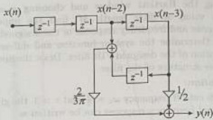{width=19%}  
Fig. 11.23 Linear-phase structure for Example 11.19  

# 11.8.3 Hann (or Hanning) Window  

The Hanning window is also known as raised-cosine window. The causal Hanning window, which can be used for both odd and even values of $M$, is given as  

$$
w _ { h a n } ( n ) = \left\{ \begin{array}{ll} { 0 . 5 - 0 . 5 \cos \left( \frac { 2 \pi n } { M - 1 } \right) } & { 0 \leq n \leq M - 1 } \\{ 0 } & { \mathrm { o t h e r w i s e } } \end{array} \right.
$$  

The non-causal Hanning window, which is used only for odd values of $M$, is given as  

$$
w _ { h a n } ( n ) = \left\{ \begin{array}{ll} { 0 . 5 + 0 . 5 \cos \left( \frac { 2 \pi n } { M - 1 } \right) } & { - \frac { M - 1 } { 2 } \leq n \leq \frac { M - 1 } { 2 } } \\{ 0 } & { \mathrm { o t h e r w i s e } } \end{array} \right.
$$  

Note that $w\left(-\frac{M-1}{2}\right)=w\left(\frac{M-1}{2}\right)=0$. Figure 11.24(a) shows the non-causal Hanning window for $M=41$. The frequency response of non-causal Hanning window is given as  

$$
W _ { h a n } ( e ^{j \omega} ) = 0 . 5 \frac { \sin \frac { \omega M } { 2 } } { \sin \frac { \omega } { 2 } } + 0 . 25 \frac { \sin \left( \frac { \omega M } { 2 } - \frac { \pi M } { M - 1 } \right) } { \sin \left( \frac { \omega } { 2 } - \frac { \pi } { M - 1 } \right) } + 0 . 25 \frac { \sin \left( \frac { \omega M } { 2 } + \frac { \pi M } { M - 1 } \right) } { \sin \left( \frac { \omega } { 2 } + \frac { \pi } { M - 1 } \right) }
$$  

The frequency response $W_{\mathrm{han}}(e^{3\omega})$ for $M=41$ is shown in Fig. 11.24(b). Figure 11.24(c) shows the magnitude response, and Fig. 11.24(d) shows the magnitude response in dB. From Fig. 11.24, we can make the following observations:  

1. The main lobe width is approximately equal to $\frac{8\pi}{M}$, which is twice that of the rectangular window having the same duration. Therefore, the approximate transition bandwidth is $\frac{8\pi}{M}$.  

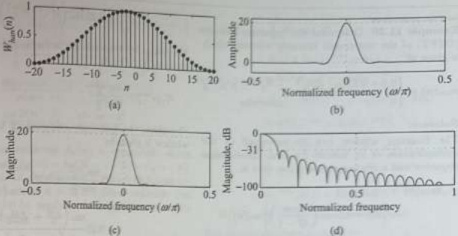{width=36%}  
Fig. 11.24 Hanning window ($M = 41$) (a) Window sequence (b) Amplitude response (c) Magnitude response (d) Magnitude response in dB  

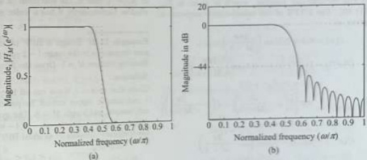{width=36%}  
Fig. 11.25 Low-pass filter of cut-off frequency $\omega_{\mathrm{c}}=0.5 \pi$ (a) Magnitude response of FIR LPF designed using Hanning window ($M=41$) (b) Magnitude response in dB  

2. The magnitude of the first sidelobe (which is also the peak sidelobe magnitude) is $-31$ dB relative to the maximum, which is smaller than that of the rectangular window ($-13$ dB).  

The magnitude response $|H_{M}(e^{j\omega})|$ and log magnitude response $|H_{M}(e^{j\omega})|_{\mathrm{dB}}$ of the LPF ($\omega_{c}=0.5\pi$) designed using $M=41$-point Hanning window are shown in Fig. 11.25(a) and (b). Note that the attenuation in the stop-band is now 44 dB, and furthermore, the response is also more flat in the pass-band in comparison with the rectangular window in Fig. 11.19. The Hanning window improves the high-frequency decay (at the expense of a larger peak sidelobe level).  

 ---------------------------------------------[ 第28页 ]---------------------------------------------  

Example 11.20 Determine the frequency response (DTFT) of the non-causal Hanning window, which is given as  

$$
w _ { \mathrm { h a n } } ( n ) = \left\{ \begin{array}{ll} { 0 . 5 + 0 . 5 \cos \left( \frac { 2 \pi n } { M - 1 } \right) } & { - \frac { M - 1 } { 2 } \leq n \leq \frac { M - 1 } { 2 } } \\{ 0 } & { \mathrm { o t h e r w i s e } } \end{array} \right.
$$  

# Solution:  

The Hanning window can be expressed as the multiplication of an infinite-duration raised-cosine sequence and a rectangular window, that is,  

$$
\begin{aligned} w _ { \mathrm { h a n } } ( n ) & = c ( n ) w _ { r } ( n ) \\& = \left[ 0 . 5 + 0 . 5 \cos \left( \frac { 2 \pi n } { M - 1 } \right) \right] w _ { r } ( n ) \\& = \left\{ \begin{array}{ll} { 0 . 5 + 0 . 5 \cos \left( \frac { 2 \pi n } { M - 1 } \right) } & { - \frac { M - 1 } { 2 } \leq n \leq \frac { M - 1 } { 2 } } \\{ 0 } & { \mathrm { o t h e r w i s e } } \end{array} \right. \end{aligned}
$$  

where $c(n)$ is the raised-cosine sequence and $w_{r}(n)$ is the rectangular window, which is given in Eq. (11.83). The DTFT of the raised-cosine sequence is given as  

$$
\begin{aligned} c(n) & = 0.5 + 0.5 \cos \left( \frac { 2 \pi n } { M - 1 } \right) \\C ( e ^{2 \omega} ) & = D T F T \left[ 0 . 5 + 0 . 5 \cos \left( \frac { 2 \pi n } { M - 1 } \right) \right] \\& = 0 . 5 \times 2 \pi \delta ( \omega ) + 0 . 5 \\& \times \pi \left[ \delta \left( \omega - \frac { 2 \pi } { M - 1 } \right) + \delta \left( \omega - \frac { 2 \pi } { M - 1 } \right) \right] \\&  - \pi \leq \omega \leq \pi \\C ( e ^{2 \omega} ) & = \pi \delta ( \omega ) + 0 . 5 \pi \delta \left( \omega - \frac { 2 \pi } { M - 1 } \right) \\&  + 0 . 5 \pi \delta \left( \omega - \frac { 2 \pi } { M - 1 } \right) ,  - \pi \leq \omega \leq \pi \end{aligned}
$$  

As multiplication in the discrete-time domain corresponds to the circular convolution in the frequency domain, the DTFT of the Hanning window is given as  

$$
\begin{aligned} W _ { h a n } ( e ^{j \omega} ) & = \frac { 1 } { 2 \pi } \left[ C ( e ^{j \omega} ) \textcircled { \times } W _ { r } ( e ^{j \omega} ) \right] \\& = \frac { 1 } { 2 \pi } \left\{ \left[ \pi \delta ( \omega ) + 0 . 5 \pi \delta \left( \omega - \frac { 2 \pi } { M - 1 } \right) \right. \\& \left. + 0 . 5 \pi \delta \left( \omega - \frac { 2 \pi } { M - 1 } \right) \right] \otimes W ( e ^{j \omega} ) \right\} \\W _ { h a n } ( e ^{j \omega} ) & = 0 . 5 \, W _ { r } ( e ^{j \omega} ) + 0 . 25 \, W _ { r } \left( e ^{j \left( \omega - \frac { 2 \pi} { M - 1 } \right) } \right) \end{aligned}
$$  

The frequency response of the rectangular window is given as [Eq. (11.84)]  

$$
W _ { r } ( e ^{i \omega} ) = \frac { \sin \frac { \omega M } { 2 } } { \sin \frac { \omega E } { 2 } }
$$  

Therefore, the frequency response of the Hanning window is given by  

$$
+ \ 0 . 25 \, W _ { + } \left( e ^{j \left( \omega _ { +} \frac { \partial ^{2} z _ { - 1 } } { \partial t } \right) } \right)
$$  

$$
\begin{array}{rl} { W _ { h a n } ( e ^{i \omega} ) = 0 . 5 { \frac { \sin { \frac { \omega M } { 2 } } } { \sin { \frac { \omega } { 2 } } } } + 0 . 25 { \frac { \sin \left( { \frac { \omega M } { 2 } } - { \frac { \pi M } { M - 1 } } \right) } { \sin \left( { \frac { \omega } { 2 } } - { \frac { \pi M } { M - 1 } } \right) } } } \\{ + 0 . 25 { \frac { \sin \left( { \frac { \omega M } { 2 } } + { \frac { \pi M } { M - 1 } } \right) } { \sin \left( { \frac { \omega } { 2 } } + { \frac { \pi } { M - 1 } } \right) } } } \end{array}
$$  

Note that the spectrum of the Hanning window is the sum of three different frequency shifted versions of $W_{r}(e^{i\omega})$, that is, the spectrum of a rectangular window. Consequently, it has a wider main lobe.  

Example 11.21 Design a BPF of unity gain to pass frequencies in the range $1-2$ rad/sample using Hanning window $M=5$. Draw the filter structure.  

# Solution:  

$$
\begin{aligned} h _ { d } ( n ) & = \frac { 1 } { \pi ( n - \tau ) } \left[ \left( \frac { e ^{j \omega _ { c l} ( n - \tau ) } - e ^{- j \omega _ { c l} ( n - \tau ) } } { 2 j } \right) \right. \\& - \left( \frac { e ^{j \omega _ { c l} ( n - \tau ) } - e ^{- j \omega _ { c l} ( n - \tau ) } } { 2 j } \right) \right] \\h _ { d } ( n ) & = \frac { \sin \omega _ { c l } ( n - \tau ) } { \pi ( n - \tau ) } - \frac { \sin \omega _ { c l } ( n - \tau ) } { \pi ( n - \tau ) } \\& = \frac { \sin 2 ( n - 2 ) } { \pi ( n - 2 ) } - \frac { \sin ( n - 2 ) } { \pi ( n - 2 ) } \end{aligned}
$$  

Given that gain = 1, lower cut-off frequency $\omega_{c1} = 1$ rad/sample, upper cut-off frequency $\omega_{c2} = 2$ rad/sample, and length $M = 5$. The symmetry condition is $h(n) = h(M - 1 - n) = h(4 - n)$. Therefore, the frequency response of an ideal BPF is given by  

$$
H _ { d } ( e ^{j \omega} ) = \left\{ \begin{array}{ll} { { e ^{- j \pi \omega} } } & { { u _ { c 1 } \leq | \omega | \leq u _ { c 2 } } } \\{ { 0 } } & { { | \omega | < u _ { c 1 } \; \mathrm { a n d } \; u _ { c 2 } < | \omega | \leq \pi } } \end{array} \right.
$$  

where $\tau=\frac{M-1}{2}=2$. Its impulse response $h_{d}(n)$ is given by  

The impulse response $h_{d}(\pi)$ is symmetric about $\bar{n}=2$, that is, $h_{d}(n)=h_{d}(M-1-n)=h_{d}(4-n)$. At $n=2$, the $h_{d}(n)$ become $\frac{9}{6}$, which is indeterminate. Therefore, at $n=2$, the filter coefficient can be determined by applying L'Hospital's rule to this expression. Thus,  

$$
\begin{aligned} h _ { d } ( n ) & = \frac { 1 } { 2 \pi } \int _ { - \pi } ^{\infty} H _ { d } \left( e ^{j \omega n} \right) e ^{j \omega n} d \omega \\& = \frac { 1 } { 2 \pi } \left[ \int _ { - \omega _ { c l } } ^{- \omega _ { c l} } e ^{- j \tau \omega} e ^{j \omega n} d \omega \\& + \int _ { \omega _ { c l } } ^{\omega _ { c l} } e ^{- j \tau \omega} e ^{j \omega n} d \omega \right] \\& = \frac { 1 } { 2 \pi } \left[ \int _ { - \omega _ { c l } } ^{- \omega _ { c l} } e ^{j \omega ( n - \tau )} d \omega + \int _ { \omega _ { c l } } ^{\omega _ { c l} ^{2} } e ^{j \omega ( n - \tau )} d \omega \right] \\& = \frac { 1 } { 2 \pi } \left[ \left( \frac { e ^{j \omega ( n - \tau )} } { j ( n - \tau ) } \right) \left| _ { - \omega _ { c l } } ^{- \omega _ { c l} } + \left( \frac { e ^{j \omega ( n - \tau )} } { j ( n - \tau ) } \right) \bigg | _ { \omega _ { c l } } ^{\omega _ { c l} } \right] \end{aligned}
$$  

$$
\begin{array}{rl} { h _ { d } ( 2 ) = \left. { \frac { \frac { d } { d n } \sin 2 ( n - 2 ) } { \frac { d } { d n } \pi ( n - 2 ) } } \right| _ { n = 2 } } & { { } - \left. { \frac { \frac { d } { d n } \sin ( n - 2 ) } { \frac { d } { d n } \pi ( n - 2 ) } } \right| _ { n = 2 } } \\{ = \left. { \frac { 2 \cos 2 ( n - 2 ) } { \pi } } \right| _ { n = 2 } } & { { } - \left. { \frac { \cos ( n - 2 ) } { \pi } } \right| _ { n = 2 } } \\{ = { \frac { 2 } { \pi } } - { \frac { 1 } { \pi } } = { \frac { 1 } { \pi } } = 0 . 31 83 } \end{array}
$$  

The other filter coefficients are given as  

$$
\begin{array}{rl} { h _ { d } ( 0 ) = h _ { d } ( 4 ) = - 0 . 26 52 , } & { } \\{ h _ { d } ( 1 ) = h _ { d } ( 3 ) = 0 . 02 16 } & { } \\{ h _ { d } ( n ) = \left\{ - 0 . 26 52 , \, 0 . 02 16 , \, 0 . 31 83 , \right. } & { } \\{ \left.  0 . 02 16 , \, - 0 . 26 52 \right\} } & { } \end{array}
$$  

The causal Hanning window is given as  

$$
\begin{array}{rl} { w ( n ) = \left\{ \begin{array}{ll} { 0 . 5 - 0 . 5 \cos \left( { \frac { 2 \pi n } { N - 1 } } \right) } & { 0 \leq n \leq M - 1 } \\{ 0 } & { { \mathrm { o t h e r w i s e } } } \end{array} \right. } \\{ = \left\{ \begin{array}{ll} { 0 . 5 - 0 . 5 \cos \left( { \frac { \pi n } { 2 } } \right) } & { 0 \leq n \leq 4 } \\{ 0 } & { { \mathrm { o t h e r w i s e } } } \end{array} \right. } \\{ w ( n ) = \{ 0 , \ 0 . 5 , \ 1 , \ 0 . 5 , \ 0 \} } \end{array}
$$  

The impulse response of the length-5 causal FIR filter is given as  

$$
\begin{array}{rl} { h ( n ) = h _ { d } ( n ) w ( n ) } & { { } } \\{ = \{ h _ { d } ( 0 ) w ( 0 ) , \ h _ { d } ( 1 ) w ( 1 ) , \ h _ { d } ( 2 ) w ( 2 ) , } & { { } } \\{ h _ { d } ( 3 ) w ( 3 ) , \ h _ { d } ( 4 ) w ( 4 ) \} } & { { } } \\{ h ( n ) = \{ 0 , \ 0 . 01 08 , \ 0 . 31 83 , \ 0 . 01 08 , \ 0 \} } & { { } } \end{array}
$$  

$$
\begin{aligned} H \left( e ^{j \omega} \right) & = \sum _ { n = 0 } ^{4} h ( n ) e ^{- j \omega n} \\& = h ( 0 ) + h ( 1 ) e ^{- j \omega} + h ( 2 ) e ^{- j 2 \omega} \\& + h ( 3 ) e ^{- j 2 \omega} + h ( 4 ) e ^{- j 4 \omega} \\& = e ^{- j 2 \omega} \left[ h ( 0 ) e ^{j 2 \omega} + h ( 1 ) e ^{j \omega} + h ( 2 ) \right. \\& \left. + h ( 3 ) e ^{- j \omega} + h ( 4 ) e ^{- j 2 \omega} \right] \\& = e ^{- j 2 \omega} \left[ h ( 2 ) + h ( 1 ) [ e ^{j \omega} + e ^{- j \omega} ] \right. \\& \left. + h ( 0 ) [ e ^{j 2 \omega} + e ^{- j 2 \omega} ] \right] \\& = e ^{- j 2 \omega} \left[ h ( 2 ) + 2 h ( 1 ) \cos \omega + 2 h ( 0 ) \cos 2 \omega . \right. \\H \left( e ^{j \omega} \right) & = e ^{- j 2 \omega} \left[ 0 . 31 83 + 0 . 02 16 \cos \omega \right] \end{aligned}
$$  

Note that the impulse response $h(n)$ satisfies the symmetry condition $h(n)=h(M-1-n)=h(4-n)$. The frequency response of the designed FIR BPF is given as  

The system function is given as  

$$
\begin{aligned} H(z) & =\sum_{n=0}^{4} h(n) z^{-n}=h(0)+h(1) z^{-1} \\& +h(2) z^{-2}+h(3) z^{-3}+\hbar(4) z^{-4} \\& =h(0)+h(1) z^{-1}+h(2) z^{-2} \\& +h(1) z^{-3}+h(0) z^{-4} \\& =h(0)[1+z^{-4}] \\& +h(1)[z^{-1}+z^{-3}]+\hbar(2) z^{-2} \\H(z)=0.0108[z^{-1}+z^{-3}]+\hbar(2) z^{-2}\end{aligned}
$$  

The difference equation is given as  

$$
\begin{array}{rl} { H ( z ) = { \frac { Y ( z ) } { X ( z ) } } = 0 . 01 08 [ z ^{- 1} + z ^{- 3} ] + 0 . 31 83 z ^{- 2} } \\{ Y ( z ) = 0 . 01 08 [ z ^{- 1} X ( z ) + z ^{- 3} X ( z ) ] } \\{ + 0 . 31 83 z ^{- 2} X ( z ) } \\{ y ( n ) = 0 . 01 08 [ x ( n - 1 ) + z ( n - 3 ) ] } \\{ + 0 . 31 83 z ( n - 2 ) } \end{array}
$$  

This difference equation can be used to draw the linear-phase structure, which is shown in Fig. 11.26.  

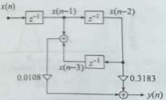{width=16%}  
Fig. 11.26 Linear-phase structure for Example 11.21  

 ---------------------------------------------[ 第29页 ]---------------------------------------------  

# 11.8.4 Hamming Window  

The Hamming window is also called a raised-cosine window with a platform. This window is similar to the Hanning window except that it has a small amount of discontinuity. The causal Hamming window, which can be used for both odd and even values of $M$, is given as  

$$
w _ { h a m } \left( n \right) = \left\{ \begin{array}{ll} { 0 . 54 - 0 . 46 \cos \left( \frac { 2 \pi n } { M - 1 } \right) } & { 0 \leq n \leq M - 1 } \\{ 0 } & { \mathrm { o t h e r w i s e } } \end{array} \right.
$$  

The non-causal Hamming window, which is used only for odd values of $M$, is given as  

$$
w _ { h a m } ( \pi ) = \left\{ \begin{array}{ll} { 0 . 54 + 0 . 46 \cos \left( \frac { 2 \pi n } { M - 1 } \right) } & { - \frac { M - 1 } { 2 } \leq n \leq \frac { M - 1 } { 2 } } \\{ 0 } & { \mathrm { o t h e r w i s e } } \end{array} \right.
$$  

Figure 11.27(a) shows the non-causal Hamming window for $M = 41$. The frequency response of non-causal Hamming window is given as  

$$
W _ { h a m } ( e ^{j \omega} ) = 0 . 54 \frac { \sin \frac { \omega M } { 2 } } { \sin \frac { \omega } { 2 } } + 0 . 23 \frac { \sin \left( \frac { \omega M } { 2 } - \frac { \pi M } { M - 1 } \right) } { \sin \left( \frac { \omega } { 2 } - \frac { \pi } { M - 1 } \right) } + 0 . 23 \frac { \sin \left( \frac { \omega M } { 2 } + \frac { \pi M } { M - 1 } \right) } { \sin \left( \frac { \omega } { 2 } + \frac { \pi } { M - 1 } \right) }
$$  

The frequency response $W_{ham}(e^{j\omega})$ for $M=41$ is shown in Fig. 11.27(b). Figure 11.27(c) shows the magnitude response, and Fig. 11.27(d) shows the magnitude response in dB. From Fig. 11.27, we can make the following observations:  

1. The main lobe width is approximately equal to $\frac{8\pi}{M}$, which is twice that of the rectangular window having the same duration. Therefore, the approximate transition bandwidth is $\frac{8\pi}{M}$.  

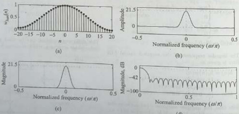{width=39%}  
Fig. 11.27 Hamming window ($M = 41$) (a) Window sequence (b) Amplitude response (c) Magnitude response in dB  

The magnitude of the first sidelobe (which is also the peak sidelobe magnitude) is window (-13 dB).  

The magnitude response $|H_{M}(e^{\beta\omega})|$ and log magnitude response $|H_{M}(e^{\beta\omega})|_{\mathrm{dB}}$ of the LPF ($\omega_{c}=0.5\pi$) designed using $M=41$-point Hamming window are shown in Fig. 11.28(a) and (b). Notice that the attenuation in the stop-band is now 54.5 dB, and furthermore, the response is also more flat in the pass-band in comparison with the rectangular window in Fig. 11.19. The Hamming window minimizes the sidelobe level (at the expense of a slower high-frequency decay).  

{width=36%}  
Fig. 11.28 Low-pass filter of cut-off frequency $w_{\mathrm{C}}=0.5\pi$ (a) Magnitude response of FIR LPF designed using Hamming window ($M=41$) (b) Magnitude response in dB  

Eq. (11.83). The DTFT of $x(n)$ is given as  

Example 11.22 Determine the frequency response (DTFT) of the non-causal Hamming window, which is given as  

$$
w _ { h a m } ( n ) = \left\{ \begin{array}{ll} { 0 . 54 + 0 . 46 \cos \left( \frac { 2 \pi n } { M - 1 } \right) - \frac { M - 1 } { 2 } \leq n \leq \frac { M - 1 } { 2 } } \\{ 0 } \end{array} \right.
$$  

# Solution:  

The Hamming window can be expressed as the multiplication of an infinite-duration sequence $x(n)$ and a rectangular window $w_r(n)$, that is,  

$$
\begin{aligned} z(n) & =0.54+0.46 \cos\left(\frac{2 \pi n}{M-1}\right) \\X\left(e^{2 \omega}\right) & = \mathrm{D T F T}\left[0.54+0.46 \cos\left(\frac{2 \pi n}{M-1}\right)\right] \\& =0.54 \times 2 \pi \delta(\omega)+0.46 \\& \times \pi\left[\delta\left(\omega-\frac{2 \pi}{M-1}\right)+\delta\left(\omega-\frac{2 \pi}{M-1}\right)\right]\end{aligned}
$$  

$$
\begin{array}{rl} { w _ { h a m } ( n ) = x ( n ) w _ { r } ( n ) } & { { } } \\{ = \left[ 0 . 54 + 0 . 46 \cos \left( { \frac { 2 \pi n } { M - 1 } } \right) \right] w _ { r } ( n ) } & { { } } \\{ = \left\{ \begin{array}{ll} { 0 . 54 + 0 . 46 \cos \left( { \frac { 2 \pi n } { M - 1 } } \right) } & { - { \frac { M - 1 } { 2 } } \leq n \leq { \frac { M - 1 } { 2 } } } \\{ 0 } & { { \mathrm { o t h e r w i s e } } } \end{array} \right. } & { { } } \end{array}
$$  

where $x(n)$ is the infinite-length sequence and $w_{r}(n)$ is the rectangular window, which is given in  

Since multiplication in the discrete-time domain corresponds to the circular convolution in the frequency domain, the DTFT of the Hamming window is given as  

$$
W _ { \mathrm { h o m } } ( e ^{j \omega} ) = \frac { 1 } { 2 \pi } \left[ X ( e ^{j \omega} ) \odot W _ { r } ( e ^{j \omega} ) \right]
$$  

 ---------------------------------------------[ 第30页 ]---------------------------------------------  

$$
\begin{aligned} & = \frac { 1 } { 2 \pi } \left\{ [ 1 . 08 \pi \delta ( \omega ) \right. \\& \left. + 0 . 46 \pi \delta \left( \omega - \frac { 2 \pi } { M - 1 } \right) \right. \\& \left. + 0 . 46 \pi \delta \left( \omega - \frac { 2 \pi } { M - 1 } \right) \right] \otimes W ( e ^{j \omega} ) \right\} \\& W _ { h a m } ( e ^{j \omega} ) = 0 . 54 W _ { r } ( e ^{j \omega} ) + 0 . 23 W _ { r } \left( e ^{j ( \omega - \frac { 2 \pi} { M - 1 } ) } \right) \\& \left. + 0 . 23 W _ { r } \left( e ^{j ( \omega + \frac { 2 \pi} { M - 1 } ) } \right) \right. \end{aligned}
$$  

$$
W _ { * } ( \sigma ^{2} ) = \frac { \sin \frac { w M } { r } } { \sin \frac { w } { r } }
$$  

Therefore, the frequency response of the Hamming window is given by  

The frequency response of the rectangular window is given as [Eq. (11.84)]  

$$
\begin{array}{rl} { W _ { h a m } ( e ^{i \omega} ) = 0 . 54 { \frac { \sin { \frac { \omega M } { 2 } } } { \sin { \frac { \omega } { 2 } } } } + 0 . 23 { \frac { \sin \left( { \frac { \omega M } { 2 } } - { \frac { \pi M } { M - 1 } } \right) } { \sin \left( { \frac { \omega } { 2 } } - { \frac { \pi } { M - 1 } } \right) } } } \\{ + 0 . 23 { \frac { \sin \left( { \frac { \omega M } { 2 } } + { \frac { \pi M } { M - 1 } } \right) } { \sin \left( { \frac { \omega E } { 2 } } + { \frac { \pi } { M - 1 } } \right) } } } \end{array}
$$  

The Hanning and Hamming windows are special cases of the generalized Hamming window. The causal window is given as  

$$
w ( n ) = \left\{ \begin{array}{ll} { { \alpha - ( 1 - \alpha ) \cos \left( \frac { 2 \pi n } { N - 1 } \right) } } & { { 0 \leq n \leq M - 1 } } \\{ { 0 } } & { { o t h e r w i s e } } \end{array} \right.
$$  

The non-causal window is given by  

$$
w ( n ) = \left\{ \begin{array}{ll} { { \alpha + ( 1 - \alpha ) \cos \left( \frac { 2 \pi n } { M - 1 } \right) } } & { { - \frac { M - 1 } { 2 } \leq n \leq \frac { M - 1 } { 2 } } } \\{ { 0 } } & { { \mathrm { o t h e r w i s e } } } \end{array} \right.
$$  

where $\alpha$ is in the range $0 \leq \alpha \leq 1$. The Hamming window results when $\alpha = 0.5$, and $\alpha = 0.54$ yields the Hamming window.  

Example 11.23 Design an linear-phase FIR LPF with the following desired frequency response:  

$$
H _ { d } ( e ^{j \omega} ) = \left\{ \begin{array}{ll} { { e ^{- j 2 \omega} } } & { { 0 \leq \frac { | e | } { | E | } \leq \frac { \pi } { 4 } } } \\{ { 0 } } & { { \frac { \pi } { 4 } \leq \frac { | e | } { | E | } \leq \frac { \pi } { 4 } } } \end{array} \right.
$$  

Use a Hamming window.  

where $\tau=\frac{M-1}{2}$; thus, $M=2\tau+1=5$. The desired impulse response $h_{d}(n)$ is given by  

Solution:  

With cut-off frequency $\omega_{c}=\frac{\pi}{4}$ and $\tau=2$, the given desired frequency response can be written as  

$$
H _ { \ell } ( e ^{j \omega} ) = \left\{ \begin{array}{ll} { { e ^{- j \pi \omega} } } & { { 0 \leq | \omega | \leq \omega _ { c } } } \\{ { 0 } } & { { \omega _ { c } < | \omega | \leq \pi } } \end{array} \right.
$$  

$$
h _ { d } ( 0 ) = h _ { d } ( 4 ) = \frac { 1 } { 2 \pi } ,  h _ { d } ( 1 ) = h _ { d } ( 3 ) = \frac { 1 } { \sqrt { 2 \pi } }
$$  

The other filter coefficients are given by  

$$
\begin{aligned} & = \frac { 1 } { 2 \pi } \int _ { - \omega _ { c } } ^{\omega _ { c} } e ^{j \omega ( n - \tau )} d \omega \\& = \frac { 1 } { 2 \pi } \left( \frac { e ^{j \omega ( n - \tau )} } { j ( n - \tau ) } \right) \bigg | _ { - \omega _ { c } } ^{\omega _ { c} } \\& = \frac { 1 } { \pi ( n - \tau ) } \left( \frac { e ^{j \omega _ { c} ( n - \tau ) } - e ^{- j \omega _ { c} ( n - \tau ) } } { 2 j } \right) \\& _ { d } ( n ) = \frac { \sin \omega _ { c } ( n - \tau ) } { \pi ( n - \tau ) } = \frac { \sin \frac { \pi } { 4 } ( n - 2 ) } { \pi ( n - 2 ) } \end{aligned}
$$  

$$
\begin{aligned} h _ { d } ( n ) & = \frac { 1 } { 2 \pi } \int _ { - \infty } ^{n} H _ { d } ( e ^{i \omega n} ) e ^{i \omega n} d \omega \\& = \frac { 1 } { 2 \pi } \int _ { - \infty } ^{\infty} e ^{- j \omega n} e ^{i \omega n} d \omega \end{aligned}
$$  

$$
\begin{array}{rl} { w ( n ) = \left\{ \begin{array}{ll} { 0 . 54 - 0 . 46 \cos \left( { \frac { 3 \pi n } { M - 1 } } \right) } & { 0 \leq n \leq M - 1 } \\{ 0 } & { { \mathrm { o t h e r w i s e } } } \end{array} \right. } \\{ = \left\{ \begin{array}{ll} { 0 . 54 - 0 . 46 \cos \left( { \frac { \pi n } { 2 } } \right) } & { 0 \leq n \leq 4 } \\{ 0 } & { { \mathrm { o t h e r w i s e } } } \end{array} \right. } \\{ w ( n ) = \left\{ \begin{array}{ll} { 0 . 08 , } & { 0 . 54 , } \\{ \dagger } & { 1 , } \end{array} \right. } \end{array}
$$  

The impulse response $h_{d}(n)$ is symmetric about $n=2$. At $n=2$, the $h_{d}(n)$ become $\frac{0}{0}$, which is indeterminate. Therefore, at $n=2$, the filter coefficient can be determined by applying L'Hospital's rule to this expression. Thus,  

The causal Hamming window is given by  

Multiplying the desired impulse response $h_{d}(n)$ by Hamming window $w(n)$ to get the causal FIR filter impulse response $h(n)$, that is,  

$$
\begin{array}{rl} { h _ { d } ( 2 ) = \left. { \frac { { \frac { d } { d n } } \sin { \frac { \pi } { 4 } } ( n - 2 ) } { { \frac { d } { d n } } \pi ( n - 2 ) } } \right| _ { n = 2 } } \\{ = { \frac { \pi } { 4 } } \cos { \frac { \pi } { 4 } } ( n - 2 ) \left| _ { n = 2 } = { \frac { 1 } { 4 } } } \end{array}
$$  

$$
\begin{array}{rl} { h ( n ) = h _ { d } ( n ) w ( n ) } & { { } } \\{ = \{ h _ { d } ( 0 ) w ( 0 ) , \ h _ { d } ( 1 ) w ( 1 ) , \ h _ { d } ( 2 ) w ( 2 ) , } & { { } } \\{ h _ { d } ( 3 ) w ( 3 ) , \ h _ { d } ( 4 ) w ( 4 ) \} } & { { } } \\{ h ( n ) = \left\{ \begin{array}{ll} { 0 . 01 27 , \ 0 . 12 15 , \ 0 . 25 , \ 0 . 12 15 , \ 0 . 01 27 } & { { } } \end{array} \right. } \end{array}
$$  

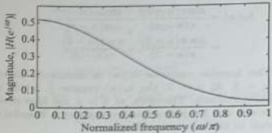{width=21%}  
Fig. 11.29 Magnitude response of the designed filter for Example 11.23  

Example 11.24 The desired frequency response of a HPF is given by  

$$
H _ { d } ( e ^{i \omega} ) = \left\{ \begin{array}{ll} { { e ^{- j \omega} } } & { { 0 } } \\{ { 0 } } & { { \frac { \omega } { 3 } \leq \frac { \omega _ { c } } { 3 } } } \\{ { \frac { \omega _ { c } } { 3 } \leq \frac { \omega _ { c } } { 3 } } } & { { 0 } } \end{array} \right.
$$  

Design a linear-phase FIR filter using Hamming window for $M = 7$ and $\omega_c = 2$ rnd/sample.  

Note that $h(n) = h(M - 1 - n) = \hbar(4 - n)$. The frequency response of the designed FIR filter is given by  

# Solution:  

$$
\begin{aligned} H \left( e ^{j \omega} \right) & = \sum _ { n = 0 } ^{4} h ( n ) e ^{- j \omega n} \\& = h ( 0 ) + h ( 1 ) e ^{- j \omega} + h ( 2 ) e ^{- j 2 \omega} \\& + h ( 3 ) e ^{- j 3 \omega} + h ( 4 ) e ^{- j 4 \omega} \\& = e ^{- j 2 \omega} \left[ h ( 0 ) e ^{j 2 \omega} + h ( 1 ) e ^{j \omega} + h ( 2 ) \right. \\& \left. + h ( 3 ) e ^{- j \omega} + h ( 4 ) e ^{- j 2 \omega} \right] \\& = e ^{- j 2 \omega} \left[ h ( 2 ) + h ( 1 ) [ e ^{j \omega} + e ^{- j \omega} ] \right. \\& \left. + h ( 0 ) [ e ^{j 2 \omega} + e ^{- j 2 \omega} ] \right] \\& = e ^{- j 2 \omega} \left[ h ( 2 ) + 2 h ( 1 ) \cos \omega + 2 h ( 0 ) \cos 2 \omega \right. \\H \left( e ^{j \omega} \right) & = e ^{- j 2 \omega} \left[ 0 . 25 + 0 . 24 30 \cos \omega \right. \\& \left. + 0 . 02 54 \cos 2 \omega \right] \end{aligned}
$$  

With cut-off frequency $\omega_{c}=2$ and $\tau=3$, the given desired frequency response can be written as  

$$
\begin{array}{rl} { H _ { d } ( e ^{j w} ) = \left\{ \begin{array}{ll} { e ^{- j \pi w} } & { w _ { c } \leq | w | \leq \pi } \\{ 0 } & { w _ { c } } \end{array} \right. } \\{ = \frac { 5 } { 2 } \frac { | w | } { | w | } \leq \frac { | w | } { w _ { c } } } \end{array}
$$  

where $\tau=\frac{M-1}{2}$; thus, $M=2\tau+1=7$. The desired impulse response $h_{4}(n)$ is given by  

$$
| H ( e ^{j \omega} ) | = | 0 . 25 + 0 . 24 30 \cos \omega + 0 . 02 54 c o s 2 \omega |
$$  

The magnitude response is shown in Fig. 11.29 and is given by  

$$
\begin{aligned} h _ { d } ( n ) & = \frac { 1 } { 2 \pi } \int _ { - \pi } ^{\pi} H _ { d } ( e ^{j \omega} ) e ^{j \omega - n} d \omega \\& = \frac { 1 } { 2 \pi } \left[ \int _ { - \pi } ^{- \infty} e ^{- j \tau \omega} e ^{j \omega n} d \omega \\& + \int _ { \omega } ^{\pi} e ^{- j \tau \omega} e ^{j \omega n} d \omega \right] \\& = \frac { 1 } { 2 \pi } \left[ \int _ { - \pi } ^{- \infty} e ^{- \omega ( n - \tau )} d \omega + \int _ { \omega } ^{\pi} e ^{j \omega ( n - \tau )} d \omega \right] \\& = \frac { 1 } { 2 \pi } \left( \frac { e ^{j \omega ( n - \tau )} } { j ( n - \tau ) } \right) \left| _ { - \infty } ^{- \infty} + \frac { 1 } { 2 \pi } \left( \frac { e ^{j \omega ( n - \tau )} } { j ( n - \tau ) } \right) \right| _ { \omega } ^{\pi} \\& = \frac { 1 } { \pi ( n - \tau ) } \left( \frac { e ^{j \pi ( n - \tau )} - e ^{- j \pi ( n - \tau )} } { 2 j } \right) \\& - \frac { 1 } { \pi ( n - \tau ) } \left( \frac { e ^{j \omega _ { c} ( n - \tau ) } - e ^{- j \omega _ { c} ( n - \tau ) } } { 2 j } \right) \end{aligned}
$$  

 ---------------------------------------------[ 第31页 ]---------------------------------------------  

$$
\begin{array}{rl} { h _ { d } ( n ) = { \frac { \sin \pi ( n - \tau ) } { \pi ( n - \tau ) } } - { \frac { \sin \omega _ { c } ( n - \tau ) } { \pi ( n - \tau ) } } } \\{ = { \frac { \sin \pi ( n - 3 ) } { \pi ( n - 3 ) } } - { \frac { \sin 2 ( n - 3 ) } { \pi ( n - 3 ) } } } \end{array}
$$  

The impulse response $h_{d}(n)$ is symmetric about $n=3$. At $n=3$, the $h_{d}(n)$ become $\frac{0}{\sigma}$, which is indeterminate. Therefore, at $n=3$, the filter coefficient can be determined by applying L'Hospital's rule to this expression. Thus,  

$$
\begin{array}{rl} { h _ { d } ( 3 ) = \left. { \frac { \frac { d } { d n } \sin \pi ( n - 3 ) } { \frac { d } { d n } \pi ( n - 3 ) } } \right| _ { n = 3 } - \left. { \frac { \frac { d } { d n } \sin 2 ( n - 3 ) } { \frac { d } { d n } \pi ( n - 3 ) } } \right| _ { n = 3 } } \\{ = \left. { \frac { \pi \cos \pi ( n - 3 ) } { \pi } } \right| _ { n = 3 } - \left. { \frac { 2 \cos 2 ( n - 3 ) } { \pi } } \right| _ { n = 3 } } \\{ = 1 - { \frac { 2 } { \pi } } = 0 . 36 34 } \end{array}
$$  

The other filter coefficients are given by  

$$
\begin{array}{r} { h _ { d } ( 0 ) = h _ { d } ( 6 ) = 0 . 02 96 ,  h _ { d } ( 1 ) = h _ { d } ( 5 ) = 0 . 12 04 , } \\{ h _ { d } ( 2 ) = h _ { d } ( 4 ) = - 0 . 28 94 } \end{array}
$$  

The causal Hamming window is given by  

$$
\begin{array}{rl} { w ( n ) = } & { { \left\{ \begin{array}{ll} { 0 . 54 - 0 . 46 \cos \left( { \frac { 2 \pi n } { M - 1 } } \right) } & { 0 \leq n \leq M - 1 } \\{ 0 } & { { \mathrm { o t h e r w i s e } } } \end{array} \right. } } \\{ = } & { { \left\{ \begin{array}{ll} { 0 . 54 - 0 . 46 \cos \left( { \frac { \pi n } { 3 } } \right) } & { 0 \leq n \leq 6 } \\{ 0 } & { { \mathrm { o t h e r w i s e } } } \end{array} \right. } } \\{ w ( n ) = } & { { \left\{ \begin{array}{ll} { 0 . 08 , \, 0 . 31 , \, 0 . 77 , \, 1 , \, 0 . 77 , \, 0 . 31 , \, 0 . 08 } \end{array} \right\} } } \end{array}
$$  

Multiplying the desired impulse response $h_{d}(n)$ by Hamming window $w(n)$ to get the causal FIR filter impulse response $h(n)$, that is,  

$$
\begin{aligned} & \left. + h ( 3 ) e ^{- j 3 \omega} + h ( 4 ) e ^{- j 4 \omega} \\& + h ( 5 ) e ^{- j 5 \omega} + h ( 6 ) e ^{- j 6 \omega} \\& = e ^{- j 3 \omega} \left[ h ( 0 ) e ^{j 3 \omega} + h ( 1 ) e ^{j 2 \omega} + h ( 2 ) e ^{j \omega} \right. \\& + h ( 3 ) + h ( 4 ) e ^{- j \omega} + h ( 5 ) e ^{- j 2 \omega} \\& + h ( 6 ) e ^{- j 3 \omega} \right] \\& = e ^{- j 3 \omega} \left[ h ( 3 ) + h ( 2 ) [ e ^{j \omega} + e ^{- j \omega} ] \right. \\& + h ( 1 ) [ e ^{j 2 \omega} + e ^{- j 2 \omega} ] \\& + h ( 0 ) [ e ^{j 3 \omega} + e ^{- j 3 \omega} ] \\& = e ^{- j 3 \omega} \left[ h ( 3 ) + 2 h ( 2 ) \cos \omega + 2 h ( 1 ) \cos 2 \omega \right. \\& \left. + 2 h ( 0 ) \cos 3 \omega \right] \\& = e ^{- j 3 \omega} \left[ 0 . 36 34 - 0 . 44 56 \cos \omega \right. \\& + \ 0 . 07 46 \cos 2 \omega + 0 . 00 48 \cos 3 \omega \right] \end{aligned}
$$  

$$
\begin{array}{rl} { h ( n ) = h _ { d } ( n ) w ( n ) } & { { } } \\{ = \{ h _ { d } ( 0 ) w ( 0 ) , \ h _ { d } ( 1 ) w ( 1 ) , \ h _ { d } ( 2 ) w ( 2 ) , } & { { } } \\{ h _ { d } ( 3 ) w ( 3 ) , \ h _ { d } ( 4 ) w ( 4 ) , \ h _ { d } ( 5 ) w ( 5 ) , } & { { } } \\{ h _ { d } ( 6 ) w ( 6 ) \} } & { { } } \\{ h ( n ) = \left\{ \begin{array}{ll} { 0 . 00 24 , \ 0 . 03 73 , \ - 0 . 22 28 , \ 0 . 36 34 , } & { { } } \\{ - 0 . 22 28 , \ 0 . 03 73 , \ 0 . 00 24 \} } & { { } } \end{array} \right. } & { { } } \end{array}
$$  

Note that $h(n) = h(M - 1 - n) = h(6 - n)$. The frequency response of the designed FIR filter is given by  

$$
\begin{array}{rl} { H ( e ^{j \omega} ) = \sum _ { n = 0 } ^{6} h ( n ) e ^{- j \omega n} } & { { } } \\{ = h ( 0 ) + h ( 1 ) e ^{- j \omega n} + h ( 2 ) e ^{- j 2 \omega} } & { { } } \end{array}
$$  

Example 11.25 Design a linear-phase FIR digital low-pass digital filter of unity gain using Hamming window whose cut-off frequency is 1.2 rad/sample and length of window $M = 9$. Assume the necessary data.  

Solution:  

Given that gain = 1; cut-off frequency $\omega_{c}$ = 1:2 rad/sample, and length $M$ = 9. The symmetry condition is $h(n) = h(M - 1 - n) = h(8 - n)$. Therefore, the frequency response of an ideal LPF is given by  

$$
H _ { d } ( e ^{j \omega} ) = \left\{ \begin{array}{ll} { { e ^{- j \pi \omega} } } & { { 0 \leq | \omega | \leq \omega _ { c } } } \\{ { 0 } } & { { \omega _ { c } < | \omega | \leq \pi } } \end{array} \right.
$$  

The impulse response $h_{d}(n)$ is symmetric about $n=4$. At $n=4$, the $h_{d}(n)$ become $\frac{9}{5}$, which is indeterminate. Therefore, at $n=4$, the filter coefficient can be determined by applying L'Hospital's rule to this expression. Thus,  

where $\tau=\frac{M-1}{2}=4$. The desired impulse response $h_{d}(n)$ is given by  

$$
\begin{array}{rl} { h _ { 4 } ( 4 ) = \left. { \frac { \frac { d } { d n } \sin 1 . 2 ( n - 4 ) } { \frac { d } { d n } \pi ( n - 4 ) } } \right| _ { n = 4 } } \\{ = { \frac { 1 . 2 \cos 1 . 2 ( n - 4 ) } { \pi } } { \Bigg | } _ { n = 4 } = { \frac { 1 . 2 } { \pi } } = 0 . 38 2 } \end{array}
$$  

The other filter coefficients are given by  

$$
\begin{aligned} h _ { d } ( n ) & = \frac { 1 } { 2 \pi } \int _ { - \pi } ^{\pi} H _ { d } ( e ^{j \omega} ) e ^{j \omega n} d \omega \\& = \frac { 1 } { 2 \pi } \int _ { - \omega _ { c } } ^{\omega _ { c} } e ^{- j \tau \omega} e ^{j \omega n} d \omega \\& = \frac { 1 } { 2 \pi } \int _ { - \omega _ { c } } ^{\omega _ { c} } e ^{j \omega ( n - \tau )} d \omega \\& = \frac { 1 } { 2 \pi } \left( \frac { e ^{j \omega ( n - \tau )} } { j ( n - \tau ) } \right) \bigg | _ { - \omega _ { c } } ^{\omega _ { c} } \\& = \frac { 1 } { \pi ( n - \tau ) } \left( \frac { e ^{j \omega _ { c} ( n - \tau ) } - e ^{- j \omega _ { c} ( n - \tau ) } } { 2 j } \right) \\h _ { d } ( n ) & = \frac { \sin \omega _ { c } ( n - \tau ) } { \pi ( n - \tau ) } = \frac { \sin 1 . 2 ( n - 4 ) } { \pi ( n - 4 ) } \end{aligned}
$$  

$$
\begin{array}{rl} { h _ { d } ( 0 ) = h _ { d } ( 8 ) = - 0 . 07 93 , } & { } \\{ h _ { d } ( 1 ) = h _ { d } ( 7 ) = - 0 . 04 70 , } & { } \\{ h _ { d } ( 2 ) = h _ { d } ( 6 ) = 0 . 10 75 , } & { } \\{ h _ { d } ( 3 ) = h _ { d } ( 5 ) = 0 . 29 67 } & { } \end{array}
$$  

For $M=9$, the causal Hamming window is given by  

$$
\begin{array}{r} { w ( n ) = \left\{ \begin{array}{ll} { 0 . 54 - 0 . 46 \cos \left( \frac { z ^{n} } { 4 } \right) } & { 0 \leq n \leq 8 } \\{ 0 } & { o t h e r w i s e } \end{array} \right. } \\{ w ( n ) = \left\{ \begin{array}{ll} { 0 . 08 , } & { 0 . 21 47 , } \\{ \top } & { 0 . 54 , } \end{array} \right. } \\{ 0 . 54 , } & { 0 . 21 47 , } \\{ 0 . 54 , } & { 0 . 21 47 , } \end{array} \right\} } \end{array}
$$  

Multiplying the desired impulse response $h_{d}(n)$ by Hamming window $w(n)$ to get the causal FIR filter impulse response $h(n)$, that is,  

$$
\begin{aligned} & = e ^{- j \delta \omega} \left[ h ( 4 ) + h ( 3 ) [ e ^{j \omega} + e ^{- j \omega} ] \right. \\& \left. + h ( 2 ) [ e ^{j \omega} + e ^{- j 2 \omega} ] \right. \\& + h ( 1 ) [ e ^{j \omega} + e ^{- j 3 \omega} ] \\& + h ( 0 ) [ e ^{j 4 \omega} + e ^{- j 4 \omega} ] \end{aligned}
$$  

Example 11.26 Design a fifth order band-pass linear-phase filter for the following specifications: (a) lower cut-off frequency = $0.4\pi$ rad/sample, (b) upper cut-off frequency = $0.6\pi$ rad/s, and (c) window type is Hamming. Draw the filter structure.  

Note that $h(n) = h(M - 1 - n) = \hbar(S - n)$. The frequency response of the designed FIR filter is given by  

$$
\begin{array}{rl} { h ( n ) = h _ { d } ( n ) w ( n ) } & { { } } \\{ = \left\{ \begin{array}{ll} { - 0 . 00 63 , } & { - 0 . 01 01 , } \\{ \uparrow } & { 0 . 05 81 , } \\{ 0 . 25 67 , } & { 0 . 05 81 , } \\{ - 0 . 01 01 , } & { - 0 . 00 63 } \end{array} \right\} } & { { } } \end{array}
$$  

$$
\begin{aligned} H \langle e ^{j \omega} \rangle & = \sum _ { n = 0 } ^{8} h ( n ) e ^{- j \omega n} \\& = h ( 0 ) + h ( 1 ) e ^{- j \omega} + h ( 2 ) e ^{- j 2 \omega} \\& + h ( 3 ) e ^{- j 3 \omega} + h ( 4 ) e ^{- j 4 \omega} + h ( 5 ) e ^{- j 5 \omega} \\& + h ( 6 ) e ^{- j 6 \omega} + h ( 7 ) e ^{- j 7 \omega} + h ( 8 ) e ^{- j 8 \omega} \\& = e ^{- j 4 \omega} \left[ h ( 0 ) e ^{j 4 \omega} + h ( 1 ) e ^{j 3 \omega} + h ( 2 ) e ^{j 2 \omega} \right. \\& \left. + h ( 3 ) e ^{j \omega} + h ( 4 ) + h ( 5 ) e ^{- j \omega} \right. \\& \left. + h ( 6 ) e ^{- j 2 \omega} + h ( 7 ) e ^{- j 5 \omega} + h ( 8 ) e ^{- j 4 \omega} \right] \end{aligned}
$$  

# Solution:  

Filter order = $M-1=5$; thus, the filter length $M=6$. Given that lower cut-off frequency $\omega_{\mathrm{cl}}=0.4\pi$ rad/sample, upper cut-off frequency $\omega_{\mathrm{cl}}=0.6\pi$ rad/sample, and assume that gain = 1. The symmetry condition is $h(n)=h(M-1-n)=h(5-n)$. Therefore, the frequency response of an ideal BPF is given by  

$$
H _ { 4 } ( e ^{i \pi} ) = \left\{ \begin{array}{ll} { { e ^{- j \pi \omega} } } & { { w _ { c 1 } \leq | \omega | \leq w _ { c 2 } } } \\{ { 0 } } & { { | \omega | < \omega _ { c 1 } \mathrm { ~ a n d ~ } \omega _ { c 2 } < | \omega | \leq \pi } } \end{array} \right.
$$  

where $\tau=\frac{M-\frac{1}{2}}{2}=2.5$, which is a non-integer. Its impulse response $h_{d}(n)$ is given by  

$$
\begin{aligned} h _ { d } ( n ) & = \frac { 1 } { 2 \pi } \int _ { - \infty } ^{\infty} H _ { d } ( e ^{j \omega} ) e ^{- j \omega} d \omega \\& = \frac { 1 } { 2 \pi } \left[ \int _ { - \omega _ { c l } } ^{- \omega _ { c l} } e ^{- j \tau _ { c} } e ^{j \omega _ { c l} } d \omega \\& + \int _ { \omega _ { c l } } ^{\omega _ { c l} } e ^{- j \tau _ { c l} } e ^{j \omega _ { c l} } d \omega \right] \\& = \frac { 1 } { 2 \pi } \left[ \int _ { - \omega _ { c l } } ^{- \omega _ { c l} } e ^{j \omega ( n - \tau )} d \omega + \int _ { - \omega _ { c l } } ^{- \omega _ { c l} } e ^{j \omega ( n - \tau )} d \omega \right] \\& = \frac { 1 } { 2 \pi } \left[ \left( \frac { e ^{j \omega ( n - \tau )} } { j ( n - \tau ) } \right) \Big | _ { - \omega _ { c l } } ^{- \omega _ { c l} } + \left( \frac { e ^{j \omega ( n - \tau )} } { j ( n - \tau ) } \right) \Big | _ { \omega _ { c l } } ^{\omega _ { c l} } \right] \\h _ { d } ( n ) & = \frac { 1 } { \pi ( n - \tau ) } \left[ \left( \frac { e ^{j \omega _ { c l} ( n - \tau ) } } { 2 j } - e ^{- j \omega _ { c l} ( n - \tau ) } \right) \right] \end{aligned}
$$  

 ---------------------------------------------[ 第32页 ]---------------------------------------------  

$$
\begin{aligned} & - \left( \frac { e ^{2 \omega _ { c 1} ( n - \tau ) } - e ^{- j \omega _ { c 1} ( n - \tau ) } } { 2 j } \right) \\& h _ { d } ( n ) = \frac { \sin \omega _ { c 2 } ( n - \tau ) } { \pi ( n - \tau ) } - \frac { \sin \omega _ { c 1 } ( n - \tau ) } { \pi ( n - \tau ) } \\& = \frac { \sin 0 . 6 \pi ( n - 2 . 5 ) } { \pi ( n - 2 . 5 ) } - \frac { \sin 0 . 4 \pi ( n - 2 . 5 ) } { \pi ( n - 2 . 5 ) } \end{aligned}
$$  

The impulse response $h_{d}(n)$ is symmetric about $n=2.5$, that is, $h_{d}(n)=h_{d}(M-1-n)=h_{d}(5-n)$. The filter coefficients are given by  

$$
\begin{array}{r} { h _ { d } ( n ) = \left\{ - 0 . 12 73 , \ - 0 . 13 62 , \ 0 . 14 08 , \ 0 . 14 08 , \ \right. } \\{ \left. - \ 0 . 13 62 , \ - 0 . 12 73 \right\} } \end{array}
$$  

For $M=6$, the causal Hamming window is given by  

$$
\begin{array}{rl} { w ( n ) = \left\{ \begin{array}{ll} { 0 . 54 - 0 . 46 \cos \left( \frac { 2 \pi n } { 8 } \right) } & { 0 \leq n \leq 5 } \\{ 0 } & { o t h e r w i s e } \end{array} \right. } \\{ w ( n ) = \{ \underbrace { 0 . 08 , \ 0 . 39 79 , \ 0 . 91 21 , \ 0 . 91 21 , } _ { 0 . 39 79 , \ 0 . 08 } \} } \end{array}
$$  

The impulse response of the length-5 causal FIR filter is given by  

$$
\begin{array}{rl} & { h ( n ) = h _ { d } ( n ) w ( n ) } \\& {  = \{ h _ { d } ( 0 ) w ( 0 ) , \ h _ { d } ( 1 ) w ( 1 ) , \ h _ { d } ( 2 ) w ( 2 ) , } \\& {  h _ { d } ( 3 ) w ( 3 ) , \ h _ { d } ( 4 ) w ( 4 ) , \ h _ { d } ( 5 ) w ( 5 ) \} } \\& { h ( n ) = \{ - 0 . 01 02 , \ - 0 . 05 42 , \ 0 . 12 85 , \ 0 . 12 85 , } \\& {  - \ 0 . 05 42 , \ - 0 . 01 02 \} } \end{array}
$$  

Note that the impulse response $h(n)$ satisfies the symmetry condition $h(n)=h(M-1-n)=h(5-n)$. The frequency response of the designed FIR BPF is given by  

$$
\begin{aligned} H ( e ^{j \omega} ) & = \sum _ { n = 0 } ^{5} h ( n ) e ^{- j \omega n} \\& = h ( 0 ) + h ( 1 ) e ^{- j \omega} + h ( 2 ) e ^{- j 2 \omega} \\& + h ( 3 ) e ^{- 33 \omega} + h ( 4 ) e ^{- j 4 \omega} + h ( 5 ) e ^{- j 5 \omega} \\& = e ^{- j 2 . 5 \omega} \left[ h ( 0 ) e ^{j 2 . 5 \omega} + h ( 1 ) e ^{j 1 . 5 \omega} \right. \\& + h ( 2 ) e ^{j 0 . 5 \omega} + h ( 3 ) e ^{- j 0 . 5 \omega} \\& + h ( 4 ) e ^{- j 1 . 5 \omega} + h ( 5 ) e ^{- j 2 . 5 \omega} \right] \\& = e ^{- j 2 . 5 \omega} \left[ h ( 2 ) [ e ^{j 0 . 5 \omega} + e ^{- j 0 . 5 \omega} ] \right. \\& + h ( 1 ) [ e ^{j 1 . 5 \omega} + e ^{- j 1 . 5 \omega} ] \\& + h ( 0 ) [ e ^{j 2 . 5 \omega} + e ^{- j 2 . 5 \omega} ] \end{aligned}
$$  

$$
\begin{aligned} & = e ^{- j 2 . 5 \omega} \left[ 2 h ( 2 ) \cos 0 . 5 \omega + 2 h ( 1 ) \cos 1 . 5 \omega \right. \\& \left. + 2 h ( 0 ) \cos 2 . 5 \omega \right] \\& H \left( e ^{j 2 . 5 \omega} \right) \right] = e ^{- j 2 . 5 \omega} \left[ 0 . 25 69 \cos 0 . 5 \omega - 0 . 10 84 \cos 1 . 5 \omega \right. \\& \left. - 0 . 02 04 \cos 2 . 5 \omega \right] \end{aligned}
$$  

The system function is given by  

$$
\begin{aligned} H(z) & =\sum_{n=0}^{5} h(n) z^{-n}=h(0)+h(1) z^{-1}+h(2) z^{-2} \\& +h(3) z^{-3}+h(4) z^{-4}+h(5) z^{-5} \\& =h(0)+h(1) z^{-1}+h(2) z^{-2}+h(2) z^{-3} \\& +h(1) z^{-4}+h(0) z^{-5} \\& =h(0)[1+z^{-5}]+h(1)[z^{-1}+z^{-4} \\& +h(2)[z^{-2}+z^{-3}]\end{aligned}
$$  

The difference equation is given by  

$$
\begin{array}{rl} { H ( z ) = { \frac { Y ( z ) } { X ( z ) } } = - 0 . 01 02 [ 1 + z ^{- 5} ] } & { } \\{ - 0 . 05 42 [ z ^{- 1} + z ^{- 4} ] + 0 . 12 85 [ z ^{- 2} + z ^{- 3} ] } & { } \\{ Y ( z ) = - 0 . 01 02 [ X ( z ) + z ^{- 5} X ( z ) ] } & { } \\{ - 0 . 05 42 [ z ^{- 1} X ( z ) + z ^{- 4} X ( z ) ] } & { } \\{ + 0 . 12 85 [ z ^{- 2} X ( z ) + z ^{- 3} X ( z ) ] } & { } \\{ y ( n ) = - 0 . 01 02 [ x ( n ) + x ( n - 5 ) ] } & { } \\{ - 0 . 05 42 [ x ( n - 1 ) + x ( n - 4 ) ] } & { } \\{ + 0 . 12 85 [ x ( n - 2 ) + x ( n - 3 ) ] } & { } \end{array}
$$  

# 11.8.5 Blackman Window  

This window is similar to the previous two windows but contains a second harmonic term. The causal Blackman window, which can be used for both odd and even values of $M$, is given by.  

This difference equation can be used to draw the linear-phase structure, which is shown in Fig. 11.30.  

$$
w _ { 6 } ( n ) = \left\{ \begin{array}{ll} { 0 . 42 - 0 . 5 \cos \left( \frac { 2 \pi n } { M - 1 } \right) + 0 . 08 \cos \left( \frac { 4 \pi n } { M - 1 } \right) } & { 0 \leq n \leq M - 1 } \\{ 0 . } & { \mathrm { o t h e r w i s e } } \end{array} \right.
$$  

The non-causal Blackman window, which is used only for odd values of $M$, is given by  

$$
w _ { b } ( n ) = \left\{ \begin{array}{ll} { 0 . 42 + 0 . 5 \cos \left( \frac { 2 \pi n } { M - 1 } \right) + 0 . 08 \cos \left( \frac { 4 \pi n } { M - 1 } \right) } & { - \frac { M - 1 } { 2 } \leq n \leq \frac { M - 1 } { 2 } } \\{ 0 } & { o t h e r w i s e } \end{array} \right.
$$  

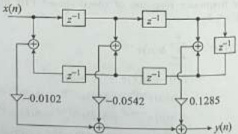{width=19%}  
Fig. 11.30 Linear-phase structure for Example 11.26  

Figure 11.31(a) shows the non-causal Blackman window for $M = 41$. The frequency response of non-causal Blackman window is given by  

$$
W _ { 6 } ( e ^{j \omega} ) = 0 . 42 \frac { \sin \frac { x M } { 2 } } { \sin \frac { y } { 2 } } + 0 . 25 \frac { \sin \left( \frac { x M } { 2 } - \frac { x M } { M - 1 } \right) } { \sin \left( \frac { y } { 2 } - \frac { x M } { M - 1 } \right) } + 0 . 25 \frac { \sin \left( \frac { x M } { 2 } + \frac { x M } { M - 1 } \right) } { \sin \left( \frac { y } { 2 } + \frac { x M } { M - 1 } \right) }
$$  

$$
+ 0 . 04 \frac { \sin \left( \frac { u M } { 2 } - \frac { 7 \pi M } { M - 1 } \right) } { \sin \left( \frac { \pi } { 2 } - \frac { 2 \pi } { M - 1 } \right) } + 0 . 04 \frac { \sin \left( \frac { u M } { 2 } + \frac { 2 \pi M } { M - 1 } \right) } { \sin \left( \frac { \pi } { 2 } + \frac { 2 \pi } { M - 1 } \right) }
$$  

The frequency response $W_{\mathrm{b}}(e^{i\omega})$ for $M=41$ is shown in Fig. 11.31(b). Figure 11.31(c) shows the magnitude response, and Fig. 11.31(d) shows the magnitude response in dB.  

{width=37%}  
Fig. 11.31 Blackman window ($M = 41$) (a) Window sequence (b) Amplitude response (c) Magnitude response (d) Magnitude response in dB  

 ---------------------------------------------[ 第33页 ]---------------------------------------------  

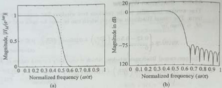{width=35%}  
Fig. 11.32 Low-pass filter of cut-off frequency $\omega_{c} = 0.5\pi$ (a) Magnitude response of FIR LPF designed using Blackman window ($M = 41$) (b) Magnitude response in dB  

From Fig. 11.31, we can make the following observations:  

1. The main lobe width is approximately equal to $\frac{12\pi}{M}$.

2. The magnitude of the first sidelobe (which is also the peak sidelobe magnitude) is $-59$ dB relative to the maximum, which is smaller than that of the rectangular window ($-13$ dB).  

The magnitude response $|H_{M}(e^{j\omega})|$ and log magnitude response $|H_{M}(e^{j\omega})|_{\rm dB}$ of the LPF $\langle w_{c}=0.5\pi\rangle$ designed using $M=41$-point Blackman window are shown in Fig. 11.32(a) and (b). Note that the attenuation in the stop-band is now 75 dB, and furthermore, the response is also more flat in the pass-band in comparison with the rectangular window in Fig. 11.19. However, this improvement in pass-band ripple and stop-band attenuation is achieved at the cost of a wider transition band. The Blackman window minimizes the sidelobe level. The main lobe width of the Blackman window is wider than that of the Hamming/Hanning windows.  

Example 11.27 Determine the frequency response (DTFT) of the non-causal Blackman window, which is given by  

$$
w _ { b } ( n ) = \left\{ \begin{array}{ll} { 0 . 42 + 0 . 5 \cos \left( \frac { 2 \pi n } { M - 1 } \right) } & { - \frac { M - 1 } { 2 } \leq n \leq \frac { M - 1 } { 2 } } \\{ + 0 . 08 \cos \left( \frac { 4 \pi n } { M - 1 } \right) } & { 0  \mathrm { o t h e r w i s e } } \end{array} \right.
$$  

Since multiplication in the discrete-time domain corresponds to the circular convolution in the frequency domain, the DTFT of the Blackman window is given by  

Solution:  

The Blackman window can be expressed as the multiplication of an infinite-duration sequence $x(n)$ and a rectangular window $w_r(n)$, that is,  

$$
\begin{aligned} & \left. + 0 . 08 \cos \left( \frac { 4 \pi n } { M - 1 } \right) \right] w _ { r } ( n ) \\= & \left\{ \begin{array}{l} { { 0 . 42 + 0 . 5 \cos \left( \frac { 2 \pi n } { M - 1 } \right) } } \\{ { + 0 . 08 \cos \left( \frac { 4 \pi n } { M - 1 } \right) } } \end{array} - \frac { M - 1 } { 2 } \leq n \leq \frac { M - 1 } { 2 } } \\{ 0 } & \mathrm { o t h e r w i s e } \end{aligned}
$$  

where $x(n)$ is the infinite-length sequence and $w_r(n)$ is the rectangular window, which is given in Eq. (11.83). The DTFT of $x(n)$ is given by  

$$
\begin{array}{rl} { w _ { b } ( n ) = x ( n ) w _ { r } ( n ) } & { { } } \\{ = \left[ 0 . 42 + 0 . 5 \cos \left( { \frac { 2 \pi n } { M - 1 } } \right) \right. } & { { } } \end{array}
$$  

$$
\begin{aligned} & \left. + 0 . 08 \cos \left( \frac { 4 \pi n } { M - 1 } \right) \right] \\& = 0 . 42 \times 2 \pi \delta ( \omega ) + 0 . 5 \\& \times \pi \left[ \delta \left( \omega - \frac { 2 \pi } { M - 1 } \right) + \delta \left( \omega - \frac { 2 \pi } { M - 1 } \right) \right] \\& + 0 . 08 \times \pi \left[ \delta \left( \omega - \frac { 4 \pi } { M - 1 } \right) \right. \\& \left. + 6 \left( \omega - \frac { 4 \pi } { M - 1 } \right) \right] ,  - \pi \leq \omega \leq \pi \\& X \left( e ^{2 \mu \omega} \right) = 0 . 84 \pi \delta ( \omega ) + 0 . 5 \pi \delta \left( \omega - \frac { 2 \pi } { M - 1 } \right) \\& + 0 . 5 \pi \delta \left( \omega - \frac { 2 \pi } { M - 1 } \right) \\& + 0 . 08 \pi \delta \left( \omega - \frac { 4 \pi } { M - 1 } \right) \\& + 0 . 08 \pi \delta \left( \omega - \frac { 4 \pi } { M - 1 } \right) ,  - \pi \leq \omega \leq \pi \end{aligned}
$$  

$$
\begin{array}{rl} { x ( n ) = 0 . 42 + 0 . 5 \cos \left( { \frac { 2 \pi n } { M - 1 } } \right) } & { { } } \\{ + 0 . 08 \cos \left( { \frac { 4 \pi n } { M - 1 } } \right) } & { { } } \\{ X ( e ^{2 \pi} ) = \mathrm { D T F T } \left[ 0 . 42 + 0 . 5 \cos \left( { \frac { 2 \pi n } { M - 1 } } \right) \right. } & { { } } \end{array}
$$  

$$
\begin{aligned} W _ { b } ( e ^{2 \omega} ) & = \frac { 1 } { 2 \pi } \left[ X ( e ^{2 \omega} ) \oplus W _ { r } ( e ^{2 \omega} ) \right] \\& = \frac { 1 } { 2 \pi } \left\{ \left[ 0 . 84 \pi \delta ( \omega ) + 0 . 5 \pi \delta \left( \omega - \frac { 2 \pi } { M - 1 } \right) \right. \\& \left. + 0 . 5 \pi \delta \left( \omega - \frac { 2 \pi } { M - 1 } \right) \right. \\& \left. + 0 . 08 \pi \delta \left( \omega - \frac { 4 \pi } { M - 1 } \right) \right. \\& \left. + 0 . 08 \pi \delta \left( \omega - \frac { 4 \pi } { M - 1 } \right) \right] \oplus W ( e ^{2 \omega} ) \right\} \\W _ { b } ( e ^{2 \omega} ) & = 0 . 42 W _ { r } ( e ^{2 \omega} ) + 0 . 25 W _ { r } \left( e ^{2 ( \omega - \frac { 2 \pi} { M - 1 } ) } \right) \\& \left. + 0 . 25 W _ { r } \left( e ^{2 ( \omega + \frac { 2 \pi} { M - 1 } ) } \right) \right. \\& \left. + 0 . 04 W _ { r } \left( e ^{2 ( \omega - \frac { 2 \pi} { M - 1 } ) } \right) \right. \\& + 0 . 04 W _ { r } \left( e ^{2 ( \omega + \frac { 2 \pi} { M - 1 } ) } \right) \end{aligned}
$$  

Therefore, the frequency response of the Blackman window is given by  

The frequency response of the rectangular window is given by [Eq. (11.84)]  

$$
\begin{aligned} W _ { 6 } ( e ^{2 \pi} ) & = 0 . 42 \frac { \sin \frac { x M } { 2 } } { \sin \frac { x } { 2 } } + 0 . 25 \frac { \sin \left( \frac { x M } { 2 } - \frac { x M } { M - 1 } \right) } { \sin \left( \frac { x } { 2 } - \frac { x M } { M - 1 } \right) } \\& + 0 . 25 \frac { \sin \left( \frac { x M } { 2 } + \frac { x M } { M - 1 } \right) } { \sin \left( \frac { y } { 2 } + \frac { x } { M - 1 } \right) } \\& + 0 . 04 \frac { \sin \left( \frac { x M } { 2 } - \frac { 2 x M } { M - 1 } \right) } { \sin \left( \frac { y } { 2 } - \frac { 2 x } { M - 1 } \right) } \\& + 0 . 04 \frac { \sin \left( \frac { x M } { 2 } + \frac { 2 x M } { M - 1 } \right) } { \sin \left( \frac { y } { 2 } + \frac { 2 x } { M - 1 } \right) } \end{aligned}
$$  

$$
W _ { r } ( e ^{j \omega} ) = \frac { \sin \frac { \omega M } { 2 } } { \sin \frac { \omega } { 2 } }
$$  

Example 11.28 For the desired frequency response  

$$
H _ { d } ( e ^{j \omega} ) = \left\{ \begin{array}{ll} { { e ^{- j 3 \omega} } } & { { \omega _ { c 1 } \leq | \omega | \leq \omega _ { c 2 } } } \\{ { 0 } } & { { | \omega | < \omega _ { c 3 } , \ \omega _ { c 2 } < | \omega | \leq \pi } } \end{array} \right.
$$  

determine $H(e^{i\omega})$ for $M=7$ using Blackman window if $\omega_{c1}=\frac{\pi}{4}$ and $\omega_{c2}=\frac{\pi}{3}$.  

Solution:  

Given that lower cut-off frequency $\omega_{c1} = \frac{\pi}{4}$, upper cut-off frequency $\omega_{c2} = \frac{\pi}{2}$, and $\tau = 3$. The given desired frequency response can be written as  

$$
H _ { d } ( e ^{j \pi} ) = \left\{ \begin{array}{ll} { { e ^{- j \pi} } } & { { w _ { c 1 } \leq | w | \leq w _ { c 2 } } } \\{ { 0 } } & { { | w | < w _ { c 1 } \mathrm { ~ a n d ~ } w _ { c 2 } < | w | \leq \pi } } \end{array} \right.
$$  

where $\tau=\frac{M-1}{2}=3$; thus, $M=2\tau+1=7$. The desired impulse response $h_{d}(\mathbf{n})$ is given by  

$$
\begin{aligned} h _ { d } ( n ) & = \frac { 1 } { 2 \pi } \int _ { - \infty } ^{\infty} H _ { 4 } ( e ^{j \omega} ) e ^{j - n} d \omega \\& = \frac { 1 } { 2 \pi } \left[ \int _ { - \infty } ^{- \infty} e ^{- j \tau} e ^{j \omega n} d \omega \\& + \int _ { - \infty } ^{\infty} e ^{- j \tau} e ^{j \omega n} d \omega \right] \\& = \frac { 1 } { 2 \pi } \left[ \int _ { - \infty } ^{- \infty} e ^{j \omega ( n - \tau )} d \omega \\& + \int _ { - \infty } ^{- \infty} e ^{j \omega ( n - \tau )} d \omega \right] \\& = \frac { 1 } { 2 \pi } \left[ \left( \frac { e ^{j \omega ( n - \tau )} } { j ( n - \tau ) } \right) \left[ ^{- \infty} + \left( \frac { e ^{j \omega ( n - \tau )} } { j ( n - \tau ) } \right) \Bigg | _ { \omega , \tau } ^{\omega} \right] \end{aligned}
$$  

 ---------------------------------------------[ 第34页 ]---------------------------------------------  

$$
\begin{aligned} h _ { d } ( n ) & = \frac { 1 } { \pi ( n - \tau ) } \left[ \left( \frac { e ^{j \omega _ { c 2} ( n - \tau ) } - e ^{- j \omega _ { c 2} ( n - \tau ) } } { 2 j } \right) \right. \\& \left. - \left( \frac { e ^{j \omega _ { c 2} ( n - \tau ) } - e ^{- j \omega _ { c 2} ( n - \tau ) } } { 2 j } \right) \right] \\h _ { d } ( n ) & = \frac { \sin \omega _ { c 2 } ( n - \tau ) } { \pi ( n - \tau ) } - \frac { \sin \omega _ { c 1 } ( n - \tau ) } { \pi ( n - \tau ) } \\& = \frac { \sin \frac { \pi } { 2 } ( n - 3 ) } { \pi ( n - 3 ) } - \frac { \sin \frac { \pi } { 4 } ( n - 3 ) } { \pi ( n - 3 ) } \end{aligned}
$$  

The impulse response $h_{d}(n)$ is symmetric about $n=3$, that is, $h_{d}(n)=h_{d}(M-1-n)=h_{d}(6-n)$. At $n=3$, the $h_{d}(n)$ become $\frac{0}{9}$, which is indeterminate. Therefore, at $n=3$, the filter coefficient can be determined by applying L'Hospital's rule to this expression. Thus,  

$$
\begin{array}{rl} { h _ { d } ( 3 ) = \left. { \frac { { \frac { d } { d n } } \sin { \frac { \pi } { 2 } } ( n - 3 ) } { { \frac { d } { d n } } \pi ( n - 3 ) } } \right| _ { n = 3 } - \left. { \frac { { \frac { d } { d n } } \sin { \frac { \pi } { 4 } } ( n - 3 ) } { { \frac { d } { d n } } \pi ( n - 3 ) } } \right| _ { n = 3 } } \\{ = \left. { \frac { { \frac { \pi } { 2 } } \cos { \frac { \pi } { 2 } } ( n - 3 ) } { \pi } } \right| _ { n = 3 } - \left. { \frac { \pi } { 4 } } \cos { \frac { \pi } { 4 } } ( n - 3 ) \right| _ { n = 3 } } \\{ = { \frac { 1 } { 2 } } - { \frac { 1 } { 4 } } = { \frac { 1 } { 4 } } = 0 . 25 } \end{array}
$$  

The other filter coefficients are given by  

The impulse response of the length-7 causal FIP filter is given by  

$$
\begin{array}{rl} & { \left\{ \begin{array}{ll} { 0 . 42 - 0 . 5 \cos \left( \frac { \pi n } { 3 } \right) } & { 0 \leq n \leq 6 } \\{ + 0 . 08 \cos \left( \frac { 2 \pi n } { 3 } \right) } & { \mathrm { o t h e r w i s e } } \\{ 0 } & { \mathrm { o t h e r w i s e } } \end{array} \right. } \\& { w ( n ) = \{ 0 , \, 0 . 13 , \, 0 . 63 , \, 1 , \, 0 . 63 , \, 0 . 13 , \, 0 \} } \end{array}
$$  

$$
\begin{array}{rl} & { h _ { d } ( 0 ) = h _ { d } ( 6 ) = - 0 . 18 11 , } \\& { h _ { d } ( 1 ) = h _ { d } ( 5 ) = - 0 . 15 92 , } \\& { h _ { d } ( 2 ) = h _ { d } ( 4 ) = 0 . 09 32 } \\& { h _ { d } ( n ) = \{ - 0 . 18 11 , - 0 . 15 92 ; 0 . 09 32 , 0 . 25 , } \\& { 0 . 09 32 , - 0 . 15 92 , - 0 . 18 11 \} } \end{array}
$$  

The causal Blackman window is given by  

$$
w ( n ) = \left\{ \begin{array}{ll} { 0 . 42 - 0 . 5 \cos \left( \frac { 2 \pi n } { M - 1 } \right) } & { 0 \leq n \leq M - 1 } \\{ 0 } & { \mathrm { o t h e r w i s e } } \end{array} \right.
$$  

$$
\begin{array}{rl} { h ( n ) = h _ { d } ( n ) w ( n ) } & { { } } \\{ = \{ h _ { d } ( 0 ) w ( 0 ) , \ h _ { d } ( 1 ) w ( 1 ) , \ h _ { d } ( 2 ) w ( 2 ) , } & { { } } \\{ h _ { d } ( 3 ) w ( 3 ) , h _ { d } ( 4 ) w ( 4 ) , \ h _ { d } ( 5 ) w ( 5 ) , \ h _ { d } ( 6 ) w ( 6 ) \} } & { { } } \\{ h ( n ) = \{ 0 , \ - 0 . 02 07 , \ 0 . 05 87 , \ 0 . 25 , } & { { } } \\{ 0 . 05 87 , \ - 0 . 02 07 , \ 0 \} } & { { } } \end{array}
$$  

Note that the impulse response $h(n)$ satisfies the symmetry condition $h(n)=h(M-1-n)=h(6-n)$. The frequency response of the designed FIR BPF is given by  

$$
\begin{aligned} H \left( e ^{j \omega} \right) & = \sum _ { n = 0 } ^{6} h ( n ) e ^{- j \omega n} \\& = h ( 0 ) + h ( 1 ) e ^{- j \omega} + h ( 2 ) e ^{- j 2 \omega} \\& + h ( 3 ) e ^{- j 3 \omega} + h ( 4 ) e ^{- j 4 \omega} \\& + h ( 5 ) e ^{- j 5 \omega} + h ( 6 ) e ^{- j 6 \omega} \\& = e ^{- j 3 \omega} \left[ h ( 0 ) e ^{j 3 \omega} + h ( 1 ) e ^{j 2 \omega} \right. \\& \left. + h ( 2 ) e ^{j \omega} + h ( 3 ) + h ( 4 ) e ^{- j \omega} \right. \\& + h ( 5 ) e ^{- j 2 \omega} + h ( 6 ) e ^{- j 3 \omega} \right] \\& = e ^{- j 3 \omega} \left[ h ( 3 ) + h ( 2 ) [ e ^{j \omega} + e ^{- j \omega} ] \right. \\& \left. + h ( 1 ) [ e ^{j 2 \omega} + e ^{- j 2 \omega} ] \right. \\& + h ( 0 ) [ e ^{j 3 \omega} + e ^{- j 3 \omega} ] \right. \\& = e ^{- j 3 \omega} [ h ( 3 ) + 2 h ( 2 ) \cos \omega . \\& + 2 h ( 1 ) \cos 2 \omega + 2 h ( 0 ) \cos 3 \omega ] \\H \left( e ^{j \omega} \right) & = e ^{- j 3 \omega} [ 0 . 25 + 0 . 11 75 \cos \omega - 0 . 04 \end{aligned}
$$  

Table 11.2 summarizes the windows commonly used in FIR filter design and their spectral features. It should be pointed out that the numbers listed in Table 11.2 are for $\omega_{c}=0.5\pi$ and $M=41$. From Table 11.2, we see that the main lobe width is inversely proportional to the window length $M$, that is, increasing the window length decreases the main lobe width. The peak-to-peak width across the transition band is roughly equal to the main lobe width of the window. The actual transition width ($\Delta\omega$) of the windowed spectrum (when the response first reaches $1-\delta_{p}$ and $\delta_{s}$) is less than this width. The transition width ($\Delta\omega$) is inversely related to the window length $M$ (with $\Delta\omega\approx\frac{C}{M}$, where $C$  

Table 11.2 Some windows for FIR filter design   

| Window name | $Main lobe width(≈Δω)$ | $Exact transition width(Δω)$ | Relative sidelobe level | $δ r ≈δ r$ | Maximum pass-band attenuation(A opp ) | Minimum stop-band attenuation(A ∞∞ ) |
| --- | --- | --- | --- | --- | --- | --- |
| Rectangular | 47/32 | 1.6x/32 | -13 dB | 0.005 | 1.6553 dB | 21 dB |
| Triangular | 8x/32 | 6.1x/32 | -26 dB | 0.051 | 0.8961 dB | 26 dB |
| Hanning | 8x/32 | 5.2x/32 | -31 dB | 0.0063 | 0.1094 dB | 44 dB |
| Hamming | 47x/32 | 5.0x/32 | -42 dB | 0.0019 | 0.0030 dB | 54.5 dB |
| Blackman | 12x/32 | 11x/32 | -50 dB | 0.00018 | 0.0001 dB | 75 dB |  

is more or less a constant for each window). The minimum stop-band attenuation $A$, depends only on the window we choose and not on the value of $M$. Therefore, to achieve a desired stop-band attenuation, the designer must find a window that meets the design specifications.  

FIR filter design steps using fixed window functions Given the design specifications: $\omega_{p}$, $\omega_{s}$, $A_{p}$, and $A_{s}$.  

1. Determine the desired impulse response $h_{d}(n)$ using inverse DFT.  

$$
\begin{array}{rl} { H _ { d } ( e ^{2 \varpi} ) = \left\{ \begin{array}{ll} { 1 } & { | \omega | \leq \omega _ { c } } \\{ 0 } & { \omega _ { c } < | \omega | \leq \pi } \end{array} \right. } \\{ \omega _ { c } = { \frac { 1 } { 2 } } [ \omega _ { p } + \omega _ { s } ] . } \end{array}
$$  

2. The transition width is given by  

$$
\Delta \omega = \omega _ { s } - \omega _ { p } ,  \Delta f = \frac { \omega _ { s } - \omega _ { p } } { 2 \pi }
$$  

3. Compute the pass-band ripple $\delta_{\mathrm{p}}$ and the stop-band ripple $\delta_{\mathrm{s}}$, and choose the smallest of these as the ripple parameter $\delta$.  

$$
\delta _ { p } = \frac { 10 ^{4 _ { p} / 20 } - 1 } { 10 ^{4 _ { p} / 20 } + 1 } \; \; \; \delta _ { s } = 10 ^{- 4 _ { s} / 20 } \; \; \; \delta = \operatorname* { m i n } ( \delta _ { p } , \delta _ { s } )
$$  

4. The ripple parameter $\delta$ is used to recompute the actual stop-band attenuation $A$ in dB as  

$$
A = - 20 \log _ { 10 } \delta  \mathrm { d B }
$$  

5. From the Table 11.2, choose the window function that provides the smallest stop-band attenuation greater than $A$, that is, $A_{\mathrm{\~s\~t\~}} \geq A$.  

6. For this window function, determine the filter length $M$ (or filter order $M-1$), which is given by  

$$
\Delta \omega \approx { \frac { C } { M } } \cdot \omega \cdot M = { \frac { C } { \Delta \omega } }
$$  

where the value of the constant $C$ is obtained from Table 11.2  

 ---------------------------------------------[ 第35页 ]---------------------------------------------  

7. Compute the FIR filter impulse response $h_{M}(n) = h_{d}(n)w(n)$ using the chosen window.

8. Check whether the designed filter satisfies the prescribed specifications, if not increase the length $M$.  

This procedure can be applied to the design of HPF, BPF, and BSF. The specifications of these filters are shown in Fig. 11.33.  

For HPF $H_{d}(e^{j\omega})$ is given in Eq. (11.64) and  

$$
\Delta \omega = \omega _ { p } - \omega _ { s } ,  \omega _ { c } = \frac { 1 } { 2 } [ \omega _ { s } + \omega _ { p } ]
$$  

For BPF $H_{d}(e^{j\omega})$ is given in Eq. (11.66) and  

$$
\Delta \omega = \operatorname* { m i n } [ ( \omega _ { p 1 } - \omega _ { s 1 } ) , ( \omega _ { s 2 } - \omega _ { p 2 } ) ] , \; \omega _ { c 1 } = \omega _ { p 1 } - \frac { \Delta \omega } { 2 } , \; \omega _ { c 2 } = \omega _ { p 2 } + \frac { \Delta \omega } { 2 }
$$  

For BSF $H_{d}(e^{j\omega})$ is given in Eq. (11.68) and  

$$
\Delta \omega = \operatorname* { m i n } [ ( \omega _ { s 1 } - \omega _ { p 1 } ) , ( \omega _ { p 2 } - \omega _ { s 2 } ) ] , \; \omega _ { c 1 } = \omega _ { p 1 } + \frac { \Delta \omega } { 2 } , \; \omega _ { c 2 } = \omega _ { p 2 } - \frac { \Delta \omega } { 2 }
$$  

{width=39%}  
Fig. 11.33 Idealized frequency responses (a) LPF (b) HPF (c) BPF (d) BSF  

Example 11.29 Design a linear-phase FIR filter using windowing method with the following specifications:  

1. $M=7$ and $\omega_{c}=1$ rad/sample

2. Desired frequency response: $H_{4}(e^{i\omega})=\begin{cases}e^{-j3\omega}&-\omega_{c}\leq\omega\leq\omega_{c}\\0&\omega_{c}<|\omega|\leq\tau\end{cases}$

3. The window $w(n)$ has main lobe width $=\frac{\pi}{\omega}$ and peak sidelobe magnitude (or relative sidelobe level) = -31 dB.  

$$
\begin{array}{r} { h _ { d } ( 1 ) = h _ { d } ( 5 ) = 0 . 14 47 , } \\{ h _ { d } ( 2 ) = h _ { d } ( 4 ) = 0 . 26 78 } \end{array}
$$  

# Solution:  

With cut-off frequency $\omega_{c} = 1$ rad/sample and $\tau = 3$, the given desired frequency response can be written as  

$$
H _ { d } ( c ^{2 \omega} ) = \left\{ \begin{array}{ll} { { e ^{- j \pi \omega} } } & { { - \omega _ { c } \leq \omega \leq \omega _ { c } } } \\{ { 0 } } & { { \omega _ { c } < | \omega | \leq \pi } } \end{array} \right.
$$  

where $\tau=\frac{M-1}{2}$; thus, $M=2\tau+1=7$. The desired impulse response $h_{d}(n)$ is given by  

$$
\begin{aligned} h _ { d } ( n ) & = \frac { 1 } { 2 \pi } \int _ { - \pi } ^{\infty} H _ { d } ( e ^{j \omega} ) e ^{j \omega n} d \omega \\& = \frac { 1 } { 2 \pi } \int _ { - \omega } ^{\omega _ { c} } e ^{- j \omega} e ^{j \omega n} d \omega \\& = \frac { 1 } { 2 \pi } \int _ { - \omega } ^{\omega _ { c} } e ^{j - ( n - \tau )} d \omega \\& = \frac { 1 } { 2 \pi } \left( \frac { e ^{j \omega ( n - \tau )} } { j ( n - \tau ) } \right) \Bigg | _ { - \omega _ { c } } \\& = \frac { 1 } { \pi ( n - \tau ) } \left( \frac { e ^{j \omega _ { c} ( n - \tau ) } - e ^{- j \omega _ { c} ( n - \tau ) } } { 2 j } \right) \\h _ { d } ( n ) & = \frac { \sin \omega _ { c } ( n - \tau ) } { \pi ( n - \tau ) } = \frac { \sin ( n - 3 ) } { \pi ( n - 3 ) } \end{aligned}
$$  

The impulse response $h_{d}(n)$ is symmetric about $n=3$. At $n=3$, the $h_{d}(n)$ become $\frac{9}{3}$, which is indeterminate. Therefore, at $n=3$, the filter coefficient can be determined by applying L'Hospital's rule to this expression. Thus,  

$$
\begin{array}{rl} { h _ { d } ( 3 ) = \left. { \frac { { \frac { d } { d n } } \sin \left( n - 3 \right) } { { \frac { d } { d n } } \pi \left( n - 3 \right) } } \right| _ { n = 3 } } \\{ = { \frac { \cos \left( n - 3 \right) } { \pi } } \left| _ { n = 3 } { \frac { 1 } { \pi } } = 0 . 31 83 } \end{array}
$$  

The window $w(n)$ that has main lobe width = $\frac{5\pi}{M}$ and peak sidelobe magnitude = $-31$ dB is the Hanning window. For $M=7$, the causal Hanning window is given by  

The other filter coefficients are given by  

$$
\begin{array}{rl} { w ( n ) = \left\{ \begin{array}{ll} { 0 . 5 - 0 . 5 \cos \left( \frac { \pi n } { 2 } \right) } & { 0 \leq n \leq 6 } \\{ 0 } & { o t h e r w i s e } \end{array} \right. } \\{ w ( n ) = \left\{ \begin{array}{ll} { 0 , } & { 0 . 25 , } \\{ \frac { 1 } { 2 } } & { 0 . 75 , } \end{array} \right. 1 , } & { 0 . 75 , } \\{ 0 } & { 0 . 25 , } \end{array} \right\}
$$  

$$
h _ { d } ( 0 ) = h _ { d } ( 6 ) = 0 . 01 5 ,
$$  

Multiplying the desired impulse response $h_{d}(n)$ by Hanning window $w(n)$ to get the causal FIR filter impulse response $h(n)$, that is,  

$$
\begin{array}{rl} { h ( n ) = h _ { d } ( n ) w ( n ) } & { { } } \\{ = \left\{ h _ { d } ( 0 ) w ( 0 ) , \ h _ { d } ( 1 ) w ( 1 ) , \ h _ { d } ( 2 ) w ( 2 ) , \right. } & { { } } \\{ \left. h _ { d } ( 3 ) w ( 3 ) , \ h _ { d } ( 4 ) w ( 4 ) , \ h _ { d } ( 5 ) w ( 5 ) , \right. } & { { } } \\{ \left. h _ { d } ( 6 ) w ( 6 ) \right\} } & { { } } \\{ h ( n ) = \left\{ \begin{array}{ll} { 0 , } & { 0 . 03 62 , } \\{ \uparrow } & { 0 . 20 09 , } \\{ 0 . 20 09 , } & { 0 . 03 62 , } \end{array} \right. } & { { } } \end{array}
$$  

Note that $h(n)=h(M-1-n)=h(6-n)$. The frequency response of the designed FIR filter is given by  

$$
\begin{aligned} H \left( e ^{j \omega} \right) & = \sum _ { n = 0 } ^{6} h ( n ) e ^{- j \omega n} \\& = h ( 0 ) + h ( 1 ) e ^{- j \omega} + h ( 2 ) e ^{- j 2 \omega} \\& + h ( 3 ) e ^{- j 2 \omega} + h ( 4 ) e ^{- j 4 \omega} \\& + h ( 5 ) e ^{- j 5 \omega} + h ( 6 ) e ^{- j 6 \omega} \\& = e ^{- j 3 \omega} \left[ h ( 0 ) e ^{j 3 \omega} + h ( 1 ) e ^{j 2 \omega} + h ( 2 ) e ^{j \omega} \right. \\& \left. + h ( 3 ) + h ( 4 ) e ^{- j \omega} + h ( 5 ) e ^{- j 2 \omega} \right. \\& + h ( 6 ) e ^{- j 3 \omega} \right] \\& = e ^{- j 3 \omega} \left[ h ( 3 ) + h ( 2 ) [ e ^{j \omega} + e ^{- j \omega} ] \right. \\& \left. + h ( 1 ) [ e ^{j 2 \omega} + e ^{- j 2 \omega} ] \right. \\& + h ( 0 ) [ e ^{j 3 \omega} + e ^{- j 3 \omega} ] \right] \\& = e ^{- j 3 \omega} \left[ h ( 3 ) + 2 h ( 2 ) \cos \omega + 2 h ( 1 ) \cos 2 \omega \right. \\& \left. + 2 h ( 0 ) \cos 3 \omega \right] \\H \left( e ^{j \omega} \right) & = e ^{- j 3 \omega} \left[ 0 . 31 83 + 0 . 40 18 \cos \omega \right. \\& \left. + 0 . 07 24 \cos 2 \omega \right] \end{aligned}
$$  

 ---------------------------------------------[ 第36页 ]---------------------------------------------  

Example 11.30 Design an ideal LPF with the desired frequency response  

$$
H _ { d } ( \varepsilon ^{\beta \nu} ) = \left\{ \begin{array}{ll} { 1 } & { - \frac { \pi } { 2 } \leq \omega \leq \frac { \pi } { 2 } } \\{ 0 } & { \frac { \pi } { 2 } < | \omega | \leq \pi } \end{array} \right.
$$  

using the window having minimum stop-band attenuation $A_{\mathrm{ws}} = -75$ dB for $M = 7$.  

# Solution:  

The symmetry condition is $h(n) = h(-n)$, and the filter is non-causal. With cut-off frequency $\omega_{c} = \frac{\pi}{2} = 0.5\pi$, the given desired frequency response can be written as  

$$
H _ { d } ( e ^{i \omega} ) = \left\{ \begin{array}{ll} { { 1 } } & { { - \omega _ { c } \leq \frac { \omega _ { c } } { c } \leq \frac { \omega _ { c } } { c } } } \\{ { 0 } } & { { \leq \frac { \omega _ { c } } { c } \leq \frac { \omega _ { c } } { c } } } \end{array} \right.
$$  

The desired impulse response $h_{d}(n)$ is given by  

$$
\begin{array}{rl} { h _ { d } ( n ) = { \frac { 1 } { 2 \pi } } \int _ { - \pi } ^{\pi} H _ { d } ( e ^{j \omega} ) e ^{j \omega n} d \omega } & { { } } \\{ = { \frac { 1 } { 2 \pi } } \int _ { - \omega _ { c } } ^{\omega _ { c} } e ^{j \omega n} d \omega } & { { } } \\{ = { \frac { 1 } { 2 \pi } } \left( { \frac { e ^{j \omega n} } { j n ! } } \right) \bigg | _ { - \omega _ { c } } ^{\omega _ { c} } } & { { } } \\{ = { \frac { 1 } { \pi n } } \left( { \frac { e ^{j \omega _ { c} n } - e ^{- j \omega _ { c} n } } { 2 j } } \right) } & { { } } \\{ h _ { d } ( n ) = { \frac { \sin \omega _ { c } n } { \pi n } } = { \frac { \sin 0 . 5 \pi n } { \pi n } } } & { { } } \end{array}
$$  

The impulse response $h_{d}(n)$ is symmetric about $n=0$, that is, $h_{d}(n)=h_{d}(-n)$. At $n=0$, the $h_{d}(n)$ become $\frac{q}{0}$, which is indeterminate. Therefore, at $n=0$, the filter coefficient can be determined by applying L'Hospital's rule to this expression. Thus,  

The window $w(n)$ that has minimum stop-band attenuation = -75 dB is the Blackman window. For $M = 7$, the non-causal Blackman window is given by  

$$
\begin{array}{rl} { h _ { d } ( 0 ) = \left. { \frac { { \frac { d } { d n } } \sin 0 . 5 \pi n } { { \frac { d } { d n } } \pi n } } \right| _ { n = 0 } } \\{ = { \frac { 0 . 5 \pi \cos 0 . 5 \pi n } { \pi } } \left| _ { n = 0 } = { \frac { 1 } { 2 } } = 0 . 5 } \end{array}
$$  

$$
\begin{array}{rl} { w ( n ) = \left\{ \begin{array}{ll} { 0 . 42 + 0 . 5 \cos \left( { \frac { \pi n } { 3 } } \right) } & { - 3 \leq n \leq 3 } \\{ + 0 . 08 \cos \left( { \frac { 2 \pi n } { 3 } } \right) } & { { \mathrm { o t h e r w i s e } } } \\{ 0 } & { { \mathrm { o t h e r w i s e } } } \end{array} \right. } & { { } } \\{ w ( n ) = \{ 0 , \ 0 . 13 , \ 0 . 63 , \ { \frac { 1 } { 1 } } , \ 0 . 63 , \ 0 . 13 , \ 0 \} . } & { { } } \end{array}
$$  

Let us choose $M = 23$. For $M = 23$, the causal Hanning window is given by  

Multiplying the desired impulse response $h_{d}(n)$ by the Blackman window $w(n)$ to get the causal FIR filter impulse response $h(n)$, that is,  

$$
\begin{array}{rl} { h ( n ) = \hbar _ { d } ( n ) w ( n ) } & { { } } \\{ = \left\{ 0 , \ 0 , \ 0 . 20 05 , \ 0 . 5 , \ 0 . 20 05 , \ 0 , \ 0 \right\} } & { { } } \end{array}
$$  

Note that $h(n)=h(-n)$. The frequency response of the designed FIR filter is given by  

$$
\begin{aligned} H \left( e ^{j \omega} \right) & = \sum _ { n = - 3 } ^{3} h ( n ) e ^{- j \omega n} \\& = h ( - 3 ) e ^{j 3 \omega} + h ( - 2 ) e ^{j 2 \omega} + h ( - 1 ) e ^{j \omega} \\& + h ( 0 ) + h ( 1 ) e ^{- j \omega t} + h ( 2 ) e ^{- j 2 \omega} \\& + h ( 3 ) e ^{- j 3 \omega} \\& = h ( 0 ) + h ( 1 ) \left[ e ^{j \omega} + e ^{- j \omega t} \right] \\& + h ( 2 ) \left[ e ^{j 2 \omega} + e ^{- j 2 \omega t} \right] \\& + h ( 3 ) \left[ e ^{j 3 \omega} + e ^{- j 3 \omega t} \right] \\& = h ( 0 ) + 2 h ( 1 ) \cos \omega + 2 h ( 2 ) \cos 2 \omega \\& + 2 h ( 3 ) \cos 3 \omega \\H \left( e ^{j \omega} \right) & = 0 . 5 + 0 . 40 1 \cos \omega \end{aligned}
$$  

The other filter coefficients are given by  

$$
\omega _ { s } = \frac { 2 \pi F _ { s } } { F _ { T } } = \frac { 2 \pi \times 5 \times 10 ^{3} } { 20 \times 10 ^{3} } = 0 . 5 \pi
$$  

# Solution:  

The cut-off frequency is given by  

$$
\omega _ { e } = \frac { 1 } { 2 } [ \omega _ { p } + \omega _ { e } ] = \frac { 1 } { 2 } [ 0 . 2 \pi + 0 . 5 \pi ] = 0 . 35 \pi
$$  

$$
\begin{array}{rl} { h _ { d } ( - 3 ) = h _ { d } ( 3 ) = - { \frac { 1 } { 3 \pi } } , } & { } \\{ h _ { d } ( - 2 ) = h _ { d } ( 2 ) = 0 , } & { } \\{ h _ { d } ( - 1 ) = h _ { d } ( 1 ) = { \frac { 1 } { \pi } } } & { } \\{ h _ { d } ( n ) = \left\{ - { \frac { 1 } { 3 \pi } } , \, 0 , \, { \frac { 1 } { \pi } } , \, { \frac { 1 } { \frac { 1 } { \pi } } } , \, 0 , \, - { \frac { 1 } { 3 \pi } } \right\} } & { } \end{array}
$$  

The transition width is given by  

$$
\Delta \omega = \omega _ { p } - \omega _ { p } = 0 . 5 \pi - 0 . 2 \pi = 0 . 3 \pi
$$  

The pass-band ripple is given by  

1. pass-band edge: $F_{p} = 2$ KHz
2. stop-band edge: $F_{s} = 5$ KHz
3. Pass-band attenuation: $A_{p} = 2$ dB
4. stop-band attenuation: $A_{s} = 42$ dB
5. Sampling frequency: $F_{T} = 20$ KHz  

$$
\delta _ { P } = \frac { 10 ^{A _ { p} / 20 } - 1 } { 10 ^{A _ { p} / 20 } + 1 } = \frac { 10 ^{2 / 20} - 1 } { 10 ^{2 / 20} + 1 } = 0 . 11 46
$$  

The stop-band ripple is given by  

Example 11.31 Design an FIR filter to meet the following specifications:  

$$
\delta _ { s } = 10 ^{- \lambda , / 20} = 10 ^{- 62 / 20} = 0 . 00 79
$$  

The smallest of these two ripple parameters is given by  

$$
\delta = \operatorname* { m i n } ( \delta _ { p } , \, \delta _ { s } ) = \operatorname* { m i n } ( 0 . 11 46 , \, 0 . 00 79 ) = 0 . 00 79
$$  

Recomputing the actual stop-band attenuation $A$, we get  

Since stop-band edge frequency is greater than pass-band edge frequency ($F_{s} > F_{p}$), this describes an LPF. The digital frequencies are as follows:  

$$
A = - 20 \log _ { 10 } \delta = - 20 \log _ { 10 } 0 . 00 79 = 42 \ d B
$$  

$$
w ( n ) = \left\{ \begin{array}{ll} { 0 . 5 - 0 . 5 \cos \left( \frac { n } { 11 } \right) } & { 0 \leq n \leq 22 } \\{ 0 } & { \mathrm { o t h e r w i s e } } \end{array} \right.
$$  

Hanning window can provide attenuation of more than 42 dB. Let us choose the Hanning window. The approximate filter length for this window is  

With cut-off frequency $\omega_{c}=0.35\pi$ and $\tau=\frac{M-1}{2}=11$, the desired frequency response can be written as  

$$
\omega _ { p } = \frac { 2 \pi F _ { p } } { F _ { T } } = \frac { 2 \pi \times 2 \times 10 ^{3} } { 20 \times 10 ^{3} } = 0 . 2 \pi \mathrm { ~ a n d }
$$  

$$
M \approx { \frac { 6 . 2 \pi } { \Delta \omega } } \approx { \frac { 6 . 2 \pi } { 0 . 3 \pi } } \approx 21
$$  

The desired impulse response $h_{d}(n)$ is given by  

$$
\begin{aligned} h _ { d } ( n ) & = \frac { 1 } { 2 \pi } \int _ { - \infty } ^{\infty} H _ { d } ( e ^{i \omega} ) e ^{i \omega n} d \omega \\& = \frac { 1 } { 2 \pi } \int _ { - \infty } ^{\infty} e ^{- j \tau \omega} e ^{j \omega n} d \omega \\& = \frac { 1 } { 2 \pi } \int _ { - \infty } ^{\infty} e ^{j \omega ( n - \tau )} d \omega \\h _ { d } ( n ) & = \frac { \sin \omega _ { c } ( n - \tau ) } { \pi ( n - \tau ) } = \frac { \sin 0 . 35 \pi ( n - 11 ) } { \pi ( n - 11 ) } \end{aligned}
$$  

$$
H _ { d } ( e ^{j \omega} ) = \left\{ \begin{array}{ll} { { e ^{- j t w} } } & { { - \omega _ { c } \leq \omega \leq \omega _ { c } } } \\{ { 0 } } & { { \omega _ { c } < | \omega | \leq \pi } } \end{array} \right.
$$  

Multiplying $h_{d}(n)$ and $w(n)$, we get the FIR filter impulse response $h(n)$.  

$$
h ( n ) = h _ { d } ( n ) w ( n )
$$  

The values of $h_{d}(n)$, $w(n)$, and $\hbar(n)$ for $0 \leq n \leq 22$, are shown in Table 11.3. Note that $\hbar(n) = h(M - 1 - n) = h(22 - n)$. This is a Type-1 FIR filter. For $M = 23$, the frequency response is given by  

Table 11.3 Table for Example 11.31   

| n | w(n)=w(22-n) | h d (n)=h d (22-n) | h(n)=h(22-n) |
| --- | --- | --- | --- |
| 0 | 0 | -0.0131 | 0 |
| 1 | 0.0203 | -0.0318 | -0.0006 |
| 2 | 0.0794 | -0.0161 | -0.0013 |
| 3 | 0.1726 | 0.0234 | 0.004 |
| 4 | 0.2923 | 0.0449 | 0.0131 |
| 5 | 0.4288 | 0.0164 | 0.007 |
| 6 | 0.5712 | -0.045 | -0.0257 |
| 7 | 0.7077 | -0.0757 | -0.0536 |
| 8 | 0.8274 | -0.0166 | -0.0137 |
| 9 | 0.9206 | 0.1288 | 0.01185 |
| 10 | 0.9797 | 0.2836 | 0.2779 |
| 11 | 1 | 0.35 | 0.35 |  

 ---------------------------------------------[ 第37页 ]---------------------------------------------  

[Eqs. (11.19) and (11.20)]  

$$
H ( e ^{i \omega} ) = e ^{- j 11 \omega} \sum _ { k = 0 } ^{11} a ( k ) \cos ( k \omega )
$$  

where  

$$
\begin{array}{rl} { \alpha ( 0 ) = h ( 11 ) , } & { } \\{ \alpha ( k ) = 2 h ( 11 - k ) , } & { 1 \leq k \leq 11 } \end{array}
$$  

Although we do not use the pass-band attenuation (or pass-band ripple) of $A_{p} = 2$ dB in the design, we will have to check the actual ripple from the design and verify that it is indeed within the given tolerance. The maximum pass-band ripple occur at $\omega = \omega_{p} = 0.2\pi$. Therefore,  

The smallest of these two ripple parameters is given by  

$$
\begin{aligned} A_{p} & = -20 \log _ { 10 } \left( \left| H \left( e ^{j \omega _ { p} } \right) \right| \right) \\& = -20 \log _ { 10 } \left( \left| H \left( e ^{j \omega _ { p} } \right) \right| \right) = 0 . 07 41 \end{aligned}
$$  

$$
A = - 20 \log _ { 10 } \delta = - 20 \log _ { 10 } 0 . 01 = 40 \ \mathrm { d B }
$$  

Hanning window can provide attenuation of more than 40 dB. Let us choose the Hanning window. The approximate filter length for this window is  

Recomputing the actual stop-band attenuation $A$, we get  

$$
\delta = \operatorname* { m i n } ( \delta _ { p } , \, \delta _ { s } ) = \operatorname* { m i n } ( 0 . 11 46 , \, 0 . 01 ) = 0 . 01
$$  

Clearly, the pass-band ripple is satisfied by this design.  

Example 11.32 Design an FIR filter to meet the following specifications:  

Let us choose $M = 33$. For $M = 33$, the causal Hanning window is given by  

$$
M \approx { \frac { 6 . 2 \pi } { \Delta \omega } } \approx { \frac { 6 . 2 \pi } { 0 . 2 \pi } } \approx 31
$$  

$$
w ( n ) = \left\{ \begin{array}{ll} { 0 . 5 - 0 . 5 \cos \left( \frac { \pi n } { 16 } \right) } & { 0 \leq n \leq 32 } \\{ 0 } & { \mathrm { o t h e r w i s e } } \end{array} \right.
$$  

$$
\delta _ { p } = \frac { 10 ^{A _ { p} / 20 } - 1 } { 10 ^{A _ { p} / 20 } + 1 } = \frac { 10 ^{2 / 20} - 1 } { 10 ^{2 / 20} + 1 } = 0 . 11 46
$$  

1. pass-band edge: $F_{p} = 4$ KHz
2. stop-band edge: $F_{s} = 2$ KHz
3. Pass-band attenuation: $A_{p} = 2$ dB
4. stop-band attenuation: $A_{s} = 40$ dB
5. Sampling frequency: $F_{T} = 20$ KHz  

$$
H _ { d } ( e ^{j \omega} ) = \left\{ \begin{array}{ll} { { e ^{- j \pi \omega} } } & { { \omega _ { c } \leq | \omega | \leq \pi } } \\{ { 0 } } & { { | \omega | < \omega _ { c } } } \end{array} \right.
$$  

Since stop-band edge frequency is smaller than pass-band edge frequency ($F_{s} < F_{p}$), this describes a HPF. The digital frequencies are as follows:  

# Solution:  

The desired impulse response $h_{d}(n)$ is given by  

$$
\begin{array}{rl} { \omega _ { p } = { \frac { 2 \pi F _ { p } } { F _ { T } } } = { \frac { 2 \pi \times 4 \times 10 ^{3} } { 20 \times 10 ^{3} } } = 0 . 4 \pi , } \\{ \omega _ { s } = { \frac { 2 \pi F _ { s } } { F _ { T } } } = { \frac { 2 \pi \times 2 \times 10 ^{3} } { 20 \times 10 ^{3} } } = 0 . 2 \pi } \end{array}
$$  

The cut-off frequency is given by  

With cut-off frequency $\omega_{c}=0.3\pi$ and $\tau=\frac{M-1}{2}=16$, the desired frequency response can be written as  

$$
\omega _ { c } = \frac { 1 } { 2 } [ \omega _ { p } + \omega _ { s } ] = \frac { 1 } { 2 } [ 0 . 2 \pi + 0 . 4 \pi ] = 0 . 3 \pi
$$  

The transition width is given by  

$$
a ( 0 ) = h ( 10 ) ,  a ( k ) = 2 h ( 16 - k ) ,  1 \leq k \leq 16
$$  

$$
\Delta \omega = \omega _ { p } - \omega _ { s } = 0 . 4 \pi - 0 . 2 \pi = 0 . 2 \pi
$$  

$$
\begin{aligned} h _ { d } ( n ) & = \frac { 1 } { 2 \pi } \int _ { - \pi } ^{\pi} H _ { d } ( e ^{j \omega} ) e ^{j \omega n} d \omega \\& = \frac { 1 } { 2 \pi } \left[ \int _ { - \pi } ^{- \omega _ { c} } e ^{- j \tau \omega} e ^{j \omega n} d \omega \\& + \int _ { \omega _ { c } } ^{\pi} e ^{- j \tau \omega} e ^{j \omega n} d \omega \right] \\h _ { d } ( n ) & = \frac { \sin \pi ( n - \tau ) } { \pi ( n - \tau ) } - \frac { \sin \omega _ { c } ( n - \tau ) } { \pi ( n - \tau ) } \\& = \frac { \sin \pi ( n - 16 ) } { \pi ( n - 16 ) } - \frac { \sin 0 . 3 \pi ( n - 16 ) } { \pi ( n - 16 ) } \end{aligned}
$$  

The pass-band ripple is given by  

The stop-band ripple is given by  

where  

tolerance. The maximum pass-band ripple occur at $\omega=\omega_{p}=0.2\pi$. Therefore,  

Although we do not use the pass-band attenuation (or pass-band ripple) of $A_{p} = 2$ dB in the design, we will have to check the actual ripple from the design and verify that it is indeed within the given  

$$
H ( e ^{j \omega} ) = e ^{- j 16 \omega} \sum _ { k = 0 } ^{16} a ( k ) \cos ( k \omega )
$$  

$$
\begin{array}{rl} { A _ { \gamma } = - 20 \log _ { 10 } ( \left\{ H ( e ^{i \omega r} ) \right\} ) } & { { } } \\{ = - 20 \log _ { 10 } ( \left\{ H ( e ^{i 0 . 2 \pi} ) \right\} ) = 0 . 07 95 } & { { } } \end{array}
$$  

$$
h ( n ) = h _ { d } ( n ) w ( n )
$$  

Clearly, the pass-band ripple is satisfied by this design.  

Table 11.4 Table for Example 11.32   

| n | w(n)=w(32-n) | h d (n)=h d (32-n) | h(n)=h(32-n) |
| --- | --- | --- | --- |
| 0 | 0 | -0.0117 | 0 |
| 1 | 0.0096 | -0.0212 | -0.0002 |
| 2 | 0.0381 | -0.0134 | -0.0005 |
| 3 | 0.0843 | 0.0076 | 0.0006 |
| 4 | 0.1464 | 0.0252 | 0.0037 |
| 5 | 0.2222 | 0.0234 | 0.0052 |
| 6 | 0.3087 | 0 | 0 |
| 7 | 0.4025 | -0.0286 | -0.0115 |
| 8 | 0.5 | -0.0378 | -0.0189 |
| 9 | 0.5975 | -0.0141 | -0.0084 |
| 10 | 0.6913 | 0.0312 | 0.0216 |
| 11 | 0.7778 | 0.0637 | 0.0495 |
| 12 | 0.8536 | 0.0468 | 0.0399 |
| 13 | 0.9157 | -0.0328 | -0.03 |
| 14 | 0.9619 | -0.1514 | -0.1456 |
| 15 | 0.9904 | -0.2575 | -0.255 |
| 16 | 1 | 0.7 | 0.7 |  

Multiplying $h_{d}(n)$ and $w(n)$, we get the FIR filter impulse response $h(n)$ as  

The values of $h_{d}(n)$, $w(n)$, and $h(n)$ for $0 \leq n \leq 16$ are shown in Table 11.4. Note that $h(n) = h(M - 1 - n) = h(32 - n)$. This is a Type-1 FIR filter. For $M = 33$, the frequency response is given by [Eqs (11.19) and (11.20)]  

$$
\delta _ { s } = 10 ^{- A _ { s} / 20 } = 10 ^{- 40 / 20} = 0 . 01
$$  

Example 11.33 Design a low-pass FIR filter that has the following specifications:  

$$
\omega _ { s } = \frac { 2 \pi F _ { s } } { F _ { T } } = \frac { 2 \pi \times 21 50 } { 80 00 } = 0 . 53 75 \pi
$$  

The cut-off frequency is given by  

1. pass-band: $0-1850$ Hz

2. stop-band: $2150-4000$ Hz

3. pass-band attenuation (or ripple): 2 dB

4. stop-band attenuation: 20 dB

5. Sampling rate: 8000 Hz  

$$
\omega _ { c } = \frac { 1 } { 2 } [ \omega _ { p } + \omega _ { s } ] = \frac { 1 } { 2 } [ 0 . 46 25 \pi + 0 . 53 75 \pi ] = 0 . 5 \pi
$$  

The transition width is given by  

# Solution:  

$$
\Delta \omega = \omega _ { s } - \omega _ { p } = 0 . 53 75 \pi - 0 . 46 25 \pi = 0 . 07 5 \pi
$$  

Given that the pass-band edge frequency $F_{p} = 1850$ Hz, stop-band edge frequency $F_{s} = 2150$ Hz, and the sampling frequency $F_{T} = 8000$ Hz. The digital frequencies are as follows:  

The pass-band ripple is given by  

$$
\omega _ { p } = \frac { 2 \pi F _ { p } } { F _ { T } ^{2} } = \frac { 2 \pi \times 18 50 } { 80 00 } = 0 . 46 25 \pi ,
$$  

$$
\delta _ { p } = \frac { 10 ^{4} s / 20 } { 10 ^{4} s / 20 } + 1 = \frac { 10 ^{2} / 20 } { 10 ^{2} / 20 } + 1 = 0 . 11 46
$$  

The stop-band ripple is given by  

$$
\delta _ { s } = 10 ^{- A _ { s} / 20 } = 10 ^{- 20 / 20} = 0 . 1
$$  

 ---------------------------------------------[ 第38页 ]---------------------------------------------  

The smallest of these two ripple parameters is given by  

$$
\delta = \operatorname* { m i n } ( \delta _ { p } , \, \delta _ { s } ) = \operatorname* { m i n } ( 0 . 11 46 , \, 0 . 1 ) = 0 . 1
$$  

Recomputing the actual stop-band attenuation $A$, we get  

$$
A = - 20 \log _ { 10 } \delta = - 20 \log _ { 10 } 0 . 1 = 20 ~ \mathrm { d B }
$$  

With $A=20$ dB, let us choose the rectangular window (with $A_{uu}=21$ dB), which provides the smaller transition band and hence the smaller filter length. The approximate filter length for this window is  

$$
M \approx { \frac { 1 . 8 \pi } { \Delta \omega } } \approx { \frac { 1 . 8 \pi } { 0 . 07 5 \pi } } = 24
$$  

For $M=24$, the causal rectangular window is given by  

$$
w ( n ) = { \left\{ \begin{array}{ll} { 1 } & { 0 \leq n \leq 23 } \\{ 0 } & { { \mathrm { o t h e r w i s e } } } \end{array} \right. }
$$  

$$
\begin{array}{rl} { h _ { d } ( n ) = { \frac { 1 } { 2 \pi } } \int _ { - w _ { s } } ^{w _ { c} } e ^{i w ( n - \tau )} d w } \\{ h _ { d } ( n ) = { \frac { \sin w _ { c } ( n - \tau ) } { \pi ( n - \tau ) } } = { \frac { \sin 0 . 5 \pi ( n - 11 . 5 ) } { \pi ( n - 11 . 5 ) } } } \end{array}
$$  

Multiplying $h_{d}(n)$ and $w(n)$, we get the FIR filter impulse response $h(n)$ as  

$$
h ( n ) = h _ { d } ( n ) w ( n )
$$  

The values of $h_{d}(n)$, $w(n)$, and $h(n)$ for $0 \leq n \leq 11$, are shown in Table 11.5. Note that $h(n) = h(M - 1 - n) = h(23 - n)$. This is a Type-2 FIR filter. For $M = 24$, the frequency response is given by [Eqs (11.25) and (11.26)]  

$$
H ( e ^{j \omega} ) = e ^{- j 11 . 5 \omega} \sum _ { k = 1 } ^{12} b ( k ) \cos \left[ \omega \left( k - \frac { 1 } { 2 } \right) \right]
$$  

where  

$$
b ( k ) = 2 h \left( 12 - k \right) ,  1 \leq k \leq 12
$$  

With cut-off frequency $\omega_{c} = 0.5\pi$ and $\tau = \frac{M-1}{2} = 11.5$, the desired frequency response can be written as  

$$
H _ { d } ( e ^{i \pi} ) = \left\{ \begin{array}{ll} { { e ^{- j \pi w} } } & { { - w _ { c } \leq w \leq w _ { c } } } \\{ { 0 } } & { { w _ { c } < \frac { w } { \pi } \leq \pi } } \end{array} \right.
$$  

The desired impulse response $h_{d}(n)$ is given by  

$$
\begin{aligned} h _ { d } ( n ) & = \frac { 1 } { 2 \pi } \int _ { - \infty } ^{\pi} H _ { d } ( e ^{2 \omega} ) e ^{i \omega n} d \omega \\& = \frac { 1 } { 2 \pi } \int _ { - \omega _ { c } } ^{\omega _ { c} } e ^{- i \omega _ { c} } e ^{i \omega n} d \omega \end{aligned}
$$  

Although we do not use the pass-band attenuation (or pass-band ripple) of $A_{p} = 2$ dB in the design, we will have to check the actual ripple from the design and verify that it is indeed within the given tolerance. The maximum pass-band ripple occur at $\omega = \omega_{p} = 0.4625\pi$. Therefore,  

$$
\begin{array}{rl} { A _ { p } = - 20 \log _ { 10 } \left( | H ( e ^{i \omega _ { p} } ) | \right) } & { { } } \\{ = - 20 \log _ { 10 } \left( | H ( e ^{i 0 . 46 25 \pi} ) | \right) = 0 . 90 59 . } \end{array}
$$  

Clearly, the pass-band ripple is satisfied by this design.  

Table 11.5 Table for Example 11.33  

| n | w(n)=w(23-n) | h d (n)=h a (23-n) | h(n)=h(23-n) |
| --- | --- | --- | --- |
| 0 | 1 | -0.0196 | -0.0196 |
| 1 | 1 | -0.0214 | -0.0214 |
| 2 | 1 | 0.0237 | 0.0237 |
| 3 | 1 | 0.0265 | 0.0265 |
| 4 | 1 | -0.03 | -0.03 |
| 5 | 1 | -0.0346 | -0.0346 |
| 6 | 1 | 0.0409 | 0.0409 |
| 7 | 1 | 0.05 | 0.05 |
| 8 | 1 | -0.0643 | -0.0643 |
| 9 | 1 | -0.09 | -0.09 |
| 10 | 1 | 0.1501 | 0.1501 |
| 11 | 1 | 0.4502 | 0.4502 |  

1. lower stop-band: $0-500$ Hz

2. pass-band: $1600-2300$ Hz

3. upper stop-band: $3500-4000$ Hz

4. pass-band attenuation (or ripple): $0.05$ dB

5. stop-band attenuation: $50$ dB

6. Sampling rate = $8000$ Hz  

# Solution:  

Recomputing the actual stop-band attenuation $A$, we get  

Given that the lower stop-band edge frequency $F_{s1} = 500$ Hz, lower pass-band edge frequency $F_{p1} = 1600$ Hz, upper pass-band edge frequency $F_{p2} = 2300$ Hz, upper stop-band edge frequency $F_{s2} = 3500$ Hz, and the sampling frequency $F_{T} = 8000$ Hz. The digital frequencies are as follows:  

$$
\begin{array}{rl} { \omega _ { s 1 } = { \frac { 2 \pi F _ { s 1 } } { F _ { T } } } = { \frac { 2 \pi \times 50 0 } { 80 00 } } = 0 . 12 5 \pi , } \\{ \omega _ { p 1 } = { \frac { 2 \pi F _ { p 1 } } { F _ { T } } } = { \frac { 2 \pi \times 16 00 } { 80 00 } } = 0 . 4 \pi , } \\{ \omega _ { p 2 } = { \frac { 2 \pi F _ { p 2 } } { F _ { T } } } = { \frac { 2 \pi \times 23 00 } { 80 00 } } = 0 . 57 5 \pi , } \\{ \omega _ { s 2 } = { \frac { 2 \pi F _ { s 2 } } { F _ { T } } } = { \frac { 2 \pi \times 35 00 } { 80 00 } } = 0 . 87 5 \pi } \end{array}
$$  

The lower and upper transition widths are given by  

$$
w ( n ) = \left\{ \begin{array}{ll} { 0 . 54 - 0 . 46 \cos \left( \frac { n } { n + 1 } \right) } & { 0 \leq n \leq 26 } \\{ 0 } & { o t h e r w i s e } \end{array} \right.
$$  

$$
A = - 20 \log _ { 10 } \delta = - 20 \log _ { 10 } 0 . 00 29 = 51 ~ \mathrm { d B }
$$  

The smallest of these two transition width is given by  

With $A=51$ dB, let us choose the Hamming window (with $A_{\mathrm{\~w\~s\~}}=54.5$ dB), which provides the smaller transition band and hence the smaller filter length. The approximate filter length for this window is  

$$
M \approx { \frac { 6 . 6 \pi } { \Delta \omega } } \approx { \frac { 6 . 6 \pi } { 0 . 27 5 \pi } } = 24
$$  

$$
\begin{aligned} \Delta \omega & = \operatorname* { m i n } \{ ( \omega _ { p 1 } - \omega _ { p 2 } ) , ( \omega _ { p 2 } - \omega _ { p 2 } ) \} \\& = \operatorname* { m i n } \{ \Delta \omega _ { 1 } , \Delta \omega _ { 2 } \} \\\left[ - 2 p t \right] & = \operatorname* { m i n } \{ 0 . 27 5 \pi , 0 . 3 \pi \} = 0 . 27 5 \pi \end{aligned}
$$  

The lower and upper cut-off frequencies are given by  

$$
\begin{array}{rl} { \omega _ { c 1 } = \omega _ { p 1 } - { \frac { \Delta \omega } { 2 } } = 0 . 4 \pi - { \frac { 0 . 27 5 \pi } { 2 } } = 0 . 26 25 \pi } \\{ \omega _ { c 2 } = \omega _ { p 2 } + { \frac { \Delta \omega } { 2 } } = 0 . 57 5 \pi + { \frac { 0 . 27 5 \pi } { 2 } } = 0 . 71 25 \pi } \end{array}
$$  

The desired impulse response $h_{s}(n)$ is given by  

The pass-band ripple is given by  

Example 11.34 Design a band-pass FIR filter that has the following specifications:  

$$
\begin{array}{r} { \Delta \omega _ { 1 } = \omega _ { p 1 } - \omega _ { s 1 } = 0 . 4 \pi - 0 . 12 5 \pi = 0 . 27 3 \pi } \\{ \Delta \omega _ { 2 } = \omega _ { s 2 } - \omega _ { p 2 } = 0 . 87 5 \pi - 0 . 57 3 \pi = 0 . 3 \pi } \end{array}
$$  

With cut-off frequency $\omega_{c1} = 0.2625\pi$, $\omega_{c2} = 0.7125\pi$, and $\tau = \frac{M-1}{2} = 13$, the desired frequency response can be written as  

Choose $M=27$ to have a flexible Type-1 filter. The causal Hamming window is given by  

$$
H _ { d } ( e ^{\pi} ) = \left\{ \begin{array}{ll} { { e ^{- 1 \pi \omega} } } & { { u _ { c t } \leq | w | \leq w _ { c t } } } \\{ { 0 } } & { { | w | < w _ { c t } \mathrm { ~ a n d ~ } w _ { c t } < | w | \leq \pi } } \end{array} \right.
$$  

$$
\delta _ { p } = \frac { 10 ^{A _ { s} / 20 } - 1 } { 10 ^{A _ { s} / 20 } + 1 } = \frac { 10 ^{0 . 05 / 20} - 1 } { 10 ^{0 . 05 / 20} + 1 } = 0 . 00 29
$$  

The stop-band ripple is given by  

$$
\delta _ { s } = 10 ^{- \Lambda _ { s} / 20 } = 10 ^{- 50 / 20} = 0 . 00 32
$$  

The smallest of these two ripple parameters is given by  

$$
\delta = \operatorname* { m i n } ( \delta _ { p } , \, \delta _ { r } ) = \operatorname* { m i n } ( 0 . 00 29 , \, 0 . 00 32 ) = 0 . 00 29
$$  

$$
\begin{aligned} h _ { 4 } ( n ) & = \frac { 1 } { 2 \pi } \int _ { - \infty } ^{\infty} H _ { 4 } ( e ^{i \omega} ) e ^{i \omega n} d \omega \\& = \frac { 1 } { 2 \pi } \left[ \int _ { - \infty } ^{- \infty} e ^{- j \pi _ { 4} } e ^{j \pi _ { 4} } d \omega \\& + \int _ { - \infty } ^{- \infty} e ^{- j \pi _ { 4} } e ^{j \pi _ { 4} } d \omega \right] \\& = \frac { 1 } { 2 \pi } \left[ \int _ { - \infty } ^{- \infty} e ^{j \pi ( n - \tau )} d \omega \\& + \int _ { - \infty } ^{- \infty} e ^{j \pi ( n - \tau )} d \omega \right] \\& = \frac { 1 } { 2 \pi } \left[ \left( \frac { e ^{j \omega ( n - \tau )} } { j ( n - \tau ) } \right) \Bigg | _ { - \infty , 1 } ^{- \infty} \right. \\& \left. + \left( \frac { e ^{j \omega ( n - \tau )} } { j ( n - \tau ) } \right) \Bigg | _ { - \infty , 2 } ^{- \infty} \right. \\& \left. + \left( \frac { e ^{j \omega ( n - \tau )} } { j ( n - \tau ) } \right) \Bigg | _ { - \infty , 3 } ^{- \infty} \right] \\h _ { 4 } ( n ) & = \frac { 1 } { \pi ( n - \tau ) } \left[ \left( \frac { e ^{j \omega _ { 4} ( n - \tau ) } - e ^{- j \omega _ { 4} ( n - \tau ) } } { 2 j } \right) \right. \\& \left. - \left( \frac { e ^{j \omega _ { 4} ( n - \tau ) } - e ^{- j \omega _ { 4} ( n - \tau ) } } { 2 j } \right) \right] \\h _ { 4 } ( n ) & = \frac { \sin \omega _ { 4 } ( n - \tau ) } { \pi ( n - \tau ) } - \frac { \sin \omega _ { 4 } ( n - \tau ) } { \pi ( n - \tau ) } \\& = \frac { \sin 0 . 71 25 \pi ( n - 13 ) } { \pi ( n - 13 ) } - \frac { \sin 0 . 26 25 \pi ( n - 13 ) } { \pi ( n - 13 ) } \end{aligned}
$$  

 ---------------------------------------------[ 第39页 ]---------------------------------------------  

Multiplying $h_{d}(n)$ and $w(n)$, we get the FIR filter impulse response $h(n)$ as  

$$
h ( n ) = h _ { d } ( n ) w ( n )
$$  

we will have to check the actual ripple from the design and verify that it is indeed within the given tolerance. The maximum pass-band ripple occur at $\omega=\omega_{p1}=0.4\pi$ and $\omega=\omega_{p2}=0.575\pi$. Therefore,  

The values of $h_{d}(n)$, $w(n)$, and $h(n)$ for $0 \leq n \leq 13$ are shown in Table 11.6. Note that $h(n) = h(M - 1 - n) = h(26 - n)$. This is a Type-1 FIR filter. For $M = 27$, the frequency response is given by [Eqs (11.19) and (11.20)]  

$$
H ( e ^{j \omega} ) = e ^{- j 13 \omega} \sum _ { k = 0 } ^{13} a ( k ) \cos ( k \omega )
$$  

where  

$$
\begin{aligned} A_{p} & = \min \left\{ A_{p 1}, A_{p 2} \right\} \\& = \min \left\{ -20 \log _ { 10 } \left( \left| H \left( e^{j \omega_{p 1}} \right) \right| \right) , \\& -20 \log _ { 10 } \left( \left| H \left( e^{j \omega_{p 2}} \right) \right| \right) \right\} \\& = \left\{ -20 \log _ { 10 } \left( \left| H \left( e^{j 0.4 \pi} \right) \right| \right) , \\& -20 \log _ { 10 } \left( \left| H \left( e^{j 0.57 5 \pi} \right) \right| \right) \right\} \\& = 0.0251 \end{aligned}
$$  

$$
a ( 0 ) = h \left( 13 \right) ,  a ( k ) = 2 h \left( 13 - k \right) ,  1 \leq k \leq 13
$$  

Although we do not use the pass-band attenuation (or pass-band ripple) of $A_{p} = 0.05$ dB in the design,  

Clearly, the pass-band ripple is satisfied by this design.  

Table 11.6 Table for Example 11.34   

| n | w(n)=w(26-n) | h d (n)=h d (26-n) | h(n)=h(26-n) |
| --- | --- | --- | --- |
| 0 | 0.08 | 0.0056 | 0.0004 |
| 1 | 0.0934 | 0.0382 | 0.0036 |
| 2 | 0.1327 | -0.0242 | -0.0032 |
| 3 | 0.1957 | -0.0416 | -0.0081 |
| 4 | 0.2787 | 0.0019 | 0.0005 |
| 5 | 0.3769 | -0.0445 | -0.0168 |
| 6 | 0.4846 | 0.024 | 0.0116 |
| 7 | 0.5954 | 0.0919 | 0.0547 |
| 8 | 0.7031 | -0.0095 | -0.0067 |
| 9 | 0.8013 | 0.0486 | 0.0389 |
| 10 | 0.8843 | -0.0213 | -0.0188 |
| 11 | 0.9473 | -0.3134 | -0.2969 |
| 12 | 0.9866 | 0.0162 | 0.0160 |
| 13 | 1 | 0.45 | 0.45 |  

The non-causal Kaiser window, which is used only for odd values of $M$, is given by  

The image contains a single character: "1"  

This is one of the most useful and optimum window. It is optimum in the sense of having the largest energy in the main lobe for a given peak sidelobe level. The Kaiser window has a variable parameter $\beta$ that controls the peak sidelobe level. The causal Kaiser window, which can be used for both odd and even values of $M$, is given by  

$$
w _ { k } ( n ) = \left\{ \begin{array}{ll} { { \frac { f _ { 0 } \left[ \beta \sqrt { 1 - \left( \frac { 2 n } { d - 1 } \right) ^{2} } \right] } { f _ { 0 } ( \beta ) } } } & { { - \frac { M - 1 } { 2 } \leq n \leq \frac { M - 1 } { 2 } } } \\{ { 0 } } & { { \mathrm { o t h e r w i s e } } } \end{array} \right.
$$  

where $I_{0}(\beta)$ is the zero-order modified Bessel functions of the first kind, and $\beta$ is a parameter that depends on $M$ and that can be chosen to yield various transition widths and near-optimum stop-band attenuation. This window can provide different transition widths for the same $M$, which is something other windows lack. The zero-order modified Bessel functions of the first kind $I_{0}(x)$ is given by  

$$
w _ { k } ( n ) = \left\{ \begin{array}{ll} { { \frac { I _ { 0 } \left[ \phi \sqrt { 1 - \left( 1 - \frac { 2 ^{2 n} } { M - 1 } \right) ^{2} } \right] } { I _ { 0 } ( \beta ) } } } & { { 0 \leq n \leq M - 1 } } \\{ { 0 } } & { { \mathrm { o t h e r w i s e } } } \end{array} \right.
$$  

$$
I _ { 0 } ( z ) = 1 + \sum _ { k = 1 } ^{\infty} \left[ \frac { 1 } { k ! } \left( \frac { z } { 2 } \right) ^{k ^ { \prime} } \right] ^{2} = 1 + \frac { 0 . 25 x ^{2} } { ( 11 ) ^{2} } + \frac { ( 0 . 25 x ^{2} ) ^{3} } { ( 2 ! ) ^{2} } + \frac { ( 0 . 25 x ^{2} ) ^{3} } { ( 31 ) ^{2} } + \cdots
$$  

This series converges rapidly where 25 terms are sufficient for most practical purposes. Figure 11.34(a) shows the non-causal Kaiser window for $M = 41$. The frequency response $W_{k}(e^{j\omega})$ for $M = 41$ is shown in Fig. 11.34(b). Figure 11.34(c) shows the magnitude response, and Fig. 11.34(d) shows the magnitude response in dB. From Fig. 11.34, we can make the following observations:  

1. For $\beta=4.5$, the main lobe width is approximately equal to $\frac{32\pi}{M}$.

2. The magnitude of the first sidelobe (which is also the peak sidelobe magnitude) is $-34.5$ dB.  

# 11.8.6 Kaiser Window  

The magnitude response $|H_{M}(e^{i\pi})|$ and log magnitude response $|H_{M}(e^{i\pi\omega})|_{\mathrm{dB}}$ of the LPF ($\omega_{c}=0.5\pi$) designed using $M=41$-point Kaiser window are shown in Fig. 11.35(a) and (b). The minimum stop-band attenuation is equal to 50 dB.  

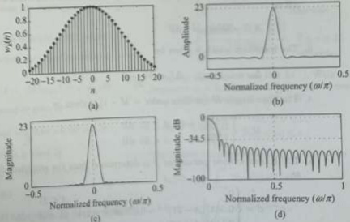{width=34%}  
Fig. 11.34 Kaiser window ($M = 41$, $\beta = 4.5$) (a) Window sequence (b) Amplitude response (c) Magnitude response (d) Magnitude response in dB  

 ---------------------------------------------[ 第40页 ]---------------------------------------------  

{width=31%}  
Fig. 11.35 Low-pass filter of cut-off frequency $\omega_{c} = 0.5\pi$ (a) Magnitude response of FIR LPF designed using Kaiser window ($M = 41$) (b) Magnitude response in dB  

FIR filter design procedure using Kaiser window function Given the design specifications: $\omega_{p}$, $\omega_{s}$, $A_{p}$, and $A_{s}$.  

1. Compute the pass-band ripple $\delta_{p}$ and the stop-band ripple $\delta_{s}$, and choose the smallest of these as the ripple parameter $\delta$ as  

$$
\delta _ { p } = \frac { 10 ^{A _ { s} / 20 } - 1 } { 10 ^{A _ { s} / 20 } + 1 } \; \; \delta _ { s } = 10 ^{- A _ { s} / 20 } \; \; \delta = \operatorname* { m i n } ( \delta _ { p } , \delta _ { s } )
$$  

2. The ripple parameter $\delta$ is used to recompute the actual stop-band attenuation $A$ in dB as  

$$
A = - 20 \log _ { 10 } \delta  d B
$$  

3. The transition width is given by  

$$
\Delta \omega = \omega _ { s } - \omega _ { p } ,  \Delta f = \frac { \omega _ { s } - \omega _ { p } } { 2 \pi }
$$  

4. The filter length $M$ (or filter order $=M-1$) is given by  

7. Determine the desired impulse response $h_{4}(n)$ using inverse DFT.  

$$
M \geq \left\{ \begin{array}{ll} { { \frac { A - 7 . 95 } { 14 . 36 \Delta f } + 1 } } & { { A \geq 21 \ \mathrm { d B } } } \\{ { \frac { 0 . 92 22 } { \Delta f } + 1 } } & { { A < 21 \ \mathrm { d B } } } \end{array} \right.
$$  

5. The Kaiser window parameter $\beta$ is determined from the empirical design equation as  

$$
H _ { d } ( e ^{2 \pi} ) = \left\{ \begin{array}{ll} { { e ^{- \pi \tau _ { w} } } } & { { | w | \leq \omega _ { c } } } \\{ { 0 } } & { { \omega _ { c } < | w | \leq \pi } } \end{array} \right.
$$  

$$
\dot { \beta } = \left\{ \begin{array}{ll} { { 0 } } & { { A \leq 21 } } \\{ { 0 . 58 42 ( A - 21 ) ^{0 . 4} + 0 . 07 88 6 ( A - 21 ) } } & { { 21 < A \leq 50 } } \\{ { 0 . 11 02 ( A - 8 . 7 ) } } & { { A > 50 } } \end{array} \right.
$$  

6. Compute the window sequence $w_{k}(n)$ using Eq. (11.108).  

where $\tau=\frac{M-1}{2}$, and $\omega_{c}=\frac{1}{2}[\omega_{p}+\omega_{s}]$.  

8. Compute the FIR filter impulse response using  

$$
\hbar _ { \mathcal { M } } ( n ) = \hbar _ { d } ( n ) w _ { k } ( n )  \mathrm { f o r }  0 \leq n \leq M - 1
$$  

This procedure can be applied to the design of HPF, BPF, and BSF. The specifications of these filters are shown in Fig. 11.33.  

Example 11.35 Design a low-pass discrete-time filter with the following specifications:  

$$
M \geq 23 . 31 89
$$  

$$
\geq \frac { 40 - 7 . 95 } { 14 . 36 \times 0 . 1 } + 1
$$  

$$
\begin{array}{rl} { 0 . 99 \leq | H ( e ^{j \omega} ) | \leq 1 . 01 } & { { } \mathrm { f o r }  | \omega | \leq 0 . 4 \pi } \\{ | H ( e ^{j \omega} ) | \leq 0 . 01 } & { { } \mathrm { f o r }  0 . 6 \pi \leq | \omega | \leq \pi } \end{array}
$$  

Use Kaiser window for the design.  

Choose $M = 25$ to have a flexible Type-1 filter. From Eq. (11.114) for $A = 40$ dB, the Kaiser window parameter $\beta$ is given by  

Solution:  

Comparing the given LPF specifications with  

$$
\begin{array}{rl} { \beta = 0 . 58 42 ( A - 21 ) ^{0 . 4} + 0 . 07 88 6 ( A - 21 ) } \\{ = 0 . 58 42 ( 40 - 21 ) ^{0 . 4} + 0 . 07 88 6 ( 40 - 21 ) } \\{ = 3 . 39 53 } \end{array}
$$  

$$
\begin{array}{rl} { 1 - \delta _ { p } \leq | H ( e ^{j \omega} ) | \leq 1 + \delta _ { p } } & { { } \mathrm { f o r }  | \omega | \leq \omega _ { p } } \\{ | H ( e ^{j \omega} ) | \leq \delta _ { s } } & { { } \mathrm { f o r }  \omega _ { s } \leq | \omega | \leq \pi } \end{array}
$$  

we get  

For $M=25$, the causal Kaiser window is given by [Eq. (11.107)]  

$$
\omega _ { p } = 0 . 4 \pi ,  \omega _ { s } = 0 . 6 \pi ,  \delta _ { p } = 0 . 01 ,  \delta _ { s } = 0 . 01
$$  

The smallest of these two ripple parameters is given by  

$$
\delta = \operatorname* { m i n } ( \delta _ { p } , \, \delta _ { s } ) = \operatorname* { m i n } ( 0 . 01 , \, 0 . 01 ) = 0 . 01
$$  

Computing the actual stop-band attenuation $A$, we get  

$$
A = - 20 \log _ { 10 } \delta = - 20 \log _ { 10 } 0 . 01 = 40 ~ \mathrm { d B }
$$  

$$
\begin{array}{rl} { w ( n ) = } & { { \left\{ \begin{array}{ll} { { \frac { J _ { 0 } \left[ \beta { \sqrt { 1 - \left( 1 - { \frac { 3 n } { n - 1 } } \right) ^{2} } } \right] } { J _ { 0 } ( \beta ) } } } & { 0 \leq n \leq M - 1 } \\{ 0 } & { { \mathrm { o t h e r w i s e } } } \end{array} \right. } } \\{ = } & { { \left\{ \begin{array}{ll} { { \frac { J _ { 0 } \left[ 3 . 39 53 { \sqrt { 1 - \left( 1 - { \frac { 3 } { n } } \right) ^{2} } } \right] } { J _ { 0 } ( 3 . 29 53 ) } } } & { 0 \leq n \leq 24 } \\{ 0 } & { { \mathrm { o t h e r w i s e } } } \end{array} \right. } } \end{array}
$$  

$$
M \geq { \frac { A - 7 . 95 } { 14 . 36 \Delta f } } + 1
$$  

$$
\omega _ { c } = \frac { 1 } { 2 } [ \omega _ { p } + \omega _ { s } ] = \frac { 1 } { 2 } [ 0 . 4 \pi + 0 . 6 \pi ] = 0 . 5 \pi
$$  

Using Eq. (11.109), we can find $J_{0}(\cdot)$. With cut-off frequency $\omega_{c}=0.5\pi$ and $\tau=\frac{M-1}{2}=12$, the desired frequency response can be written as  

The transition width is given by  

$$
H _ { d } ( e ^{i \omega} ) = \left\{ \begin{array}{ll} { { e ^{- j \pi \omega} } } & { { - \omega _ { c } \leq \omega \leq \omega _ { c } } } \\{ { 0 } } & { { \omega _ { c } < | e | \leq \pi } } \end{array} \right.
$$  

$$
\begin{array}{rl} { \Delta \omega = \omega _ { s } - \omega _ { p } = 0 . 6 \pi - 0 . 4 \pi = 0 . 2 \pi , } \\{ \Delta f = { \frac { \Delta \omega } { 2 \pi } } = 0 . 1 } \end{array}
$$  

The desired impulse response $h_{d}(n)$ is given by  

From Eq. (11.113) for $A = 40$ dB, the filter length is given by  

The cut-off frequency is given by  

$$
\begin{aligned} h _ { d } ( n ) & = \frac { 1 } { 2 \pi } \int _ { - \infty } ^{\infty} H _ { d } ( e ^{j \omega} ) e ^{j \omega n} d \omega \\& = \frac { 1 } { 2 \pi } \int _ { - \infty } ^{\infty} e ^{- j \tau \omega} e ^{j \omega n} d \omega \\& = \frac { 1 } { 2 \pi } \int _ { - \infty } ^{- \infty} e ^{j \omega ( n - \tau )} d \omega \end{aligned}
$$  

 ---------------------------------------------[ 第41页 ]---------------------------------------------  

$$
h _ { d } ( n ) = \frac { \sin \omega _ { c } ( n - \tau ) } { \pi ( n - \tau ) } = \frac { \sin 0 . 5 \pi ( n - 12 ) } { \pi ( n - 12 ) }
$$  

Multiplying $h_{d}(n)$ and $w(n)$, we get the FIR filter impulse response $h(n)$ as  

$$
( 11 . 19 ) \mathrm { ~ a n d ~ } ( 11 . 20 ) ] H ( e ^{j \omega} ) = e ^{- j 12 \omega} \sum _ { k = 0 } ^{12} a ( k ) \cos ( k \omega )
$$  

where  

$$
h ( n ) = h _ { d } ( n ) w ( n )
$$  

$$
\alpha ( 0 ) = h \left( 12 \right) ,  \alpha ( k ) = 2 h \left( 12 - k \right) ,  1 \leq k \leq 12
$$  

The values of $h_{d}(n)$, $w(n)$, and $h(n)$ for $0 \leq n \leq 12$ are shown in Table 11.7. Note that $h(n) = h(M - 1 - n) = h(24 - n)$. This is a Type-1 FIR filter. For $M = 31$, the frequency response is given by [Eqs  

Note that $h(n)=0$ for even $n$. This is a half-band FIR filter. A half-band FIR filter has an odd-length impulse response $h(n)$ whose alternate samples are zero.  

Table 11.7 Table for Example 11.35   

| n | w(n)=w(24-n) | h d (n)=h a (24-n) | h(n)=h(24-n) |
| --- | --- | --- | --- |
| 0 | 0.1480 | 0 | 0 |
| 1 | 0.2243 | -0.0289 | -0.0065 |
| 2 | 0.3099 | 0 | 0 |
| 3 | 0.4023 | 0.0354 | 0.0142 |
| 4 | 0.4984 | 0 | 0 |
| 5 | 0.5949 | -0.0455 | -0.0271 |
| 6 | 0.6883 | 0 | 0 |
| 7 | 0.7748 | 0.0637 | 0.0493 |
| 8 | 0.8512 | 0 | 0 |
| 9 | 0.9142 | -0.1061 | -0.0970 |
| 10 | 0.9612 | 0 | 0 |
| 11 | 0.9902 | 0.3183 | 0.3152 |
| 12 | 1 | 0.5 | 0.5 |  

# 11.8.7 Advantages and Disadvantages of Window Method The window design method for $D_{\mathrm{\~P\~}}$ is The window design method for FIR filters is a method of performing the design process.  

1. An important advantage of the window method is its simplicity: it is simple to apply and simple to understand. It involves a minimum amount of computational effort even for the more complicated Kaiser window.

2. The major disadvantage is its lack of flexibility. Both the peak pass-band and stop-band ripples are approximately equal, so that the designer may end up with either too small pass-band ripple or too large stop-band attenuation.

3. For a given window (except the Kaiser), the maximum ripple amplitude in the filter response is fixed regardless of how large we make $M$. Thus, the stop-band attenuation for a given window is fixed. Thus, for a given attenuation specification, the filter designer must find a suitable window.  

4. When the expression for the desired filter response $H_{d}(e^{j\omega})$ is complicated or cannot easily be put into a closed form mathematical expression, evaluation of $h_{d}(n)$ becomes difficult.  

# 11.9 HALF-BAND FINITE IMPULSE RESPONSE FILTERS  

A half-band PIR filter has an odd-length impulse response $h(n)$ whose alternate samples are zero. The main advantage of half-band filters is that their realization requires only about half the number of multipliers. The impulse response of an ideal LPF is $h(n)=\frac{\sin\omega_{c}n}{\pi n}$. If we choose $\omega_{c}=0.5\pi$, we obtain $h(n)=0$ for even $n$. Thus, the cut-off frequency of a half-band LPF is $\omega_{c}=0.5\pi$. A HPF also requires $\omega_{c}=0.5\pi$. If we choose $\omega_{c}=\frac{1}{2}[\omega_{p}+\omega_{s}]$, the sampling frequency $F_{T}$ must equal to $2(F_{p}+F_{s})$ to ensure $\omega_{c}=0.5\pi$ and cannot be selected arbitrarily. Similarly, the centre frequency of half-band BPF and half-band BSF is $\omega_{0}=\frac{1}{2}[\omega_{c2}+\omega_{c1}]=0.5\pi$. Once again, the sampling frequency $F_{T}$ cannot be arbitrarily chosen and must equal to $4F_{0}$ to ensure $\omega_{0}=\frac{2\pi F_{0}}{F_{T}}=0.5\pi$. Even though the choice of sampling rate may cause aliasing, the aliasing will be restricted primarily to the transition band, where its effects are not critical.  

Example 11.36 Design a low-pass half-band FIR filter using Kaiser window for the following specifications:  

Recomputing the actual stop-band attenuation $A$, we get  

$$
A = - 20 \log _ { 10 } \delta = - 20 \log _ { 10 } 0 . 00 32 = 50 ~ \mathrm { d B }
$$  

1. Pass-band edge frequency: $F_{p}=4$KHz

2. Stop-band edge frequency: $F_{s}=8$KHz

3. Maximum pass-band attenuation: $A_{p}=1$dB

4. Minimum stop-band attenuation: $A_{s}=50$dB  

The cut-off frequency is given by  

$$
\omega _ { c } = \frac { 1 } { 2 } [ \omega _ { p } + \omega _ { s } ] = \frac { 1 } { 2 } \left[ \frac { \pi } { 3 } + \frac { 2 \pi } { 3 } \right] = 0 . 5 \pi
$$  

# Solution:  

The transition width is given by  

Given that $F_{p}=4$ KHz and $F_{s}=8$ KHz. We choose sampling frequency $F_{T}=2(F_{p}+F_{s})=24$ KHz. The Digital pass-band and stop-band edge frequencies are  

$$
\Delta \omega = \omega _ { s } - \omega _ { p } = \frac { 2 \pi } { 3 } - \frac { \pi } { 3 } = \frac { \pi } { 3 } ,  \Delta f = \frac { \Delta \omega } { 2 \pi } = \frac { 1 } { 6 }
$$  

$$
\begin{array}{rl} { \omega _ { p } = { \frac { 2 \pi F _ { p } } { F _ { T } } } = { \frac { 2 \pi \times 4 \times 10 ^{3} } { 24 \times 10 ^{3} } } = { \frac { \pi } { 3 } } } & { { \mathrm { ~ a n d } } } \\{ \omega _ { s } = { \frac { 2 \pi F _ { s } } { F _ { T } } } = { \frac { 2 \pi \times 8 \times 10 ^{3} } { 24 \times 10 ^{3} } } = { \frac { 2 \pi } { 3 } } } & { { } } \end{array}
$$  

From Eq. (11.113) for $A = 50$ dB, the filter length is given by  

Choose $M = 19$ to have a flexible Type-1 filter. From Eq. (11.114) for $A = 50$ dB, the Kaiser window parameter $\beta$ is given by  

The pass-band ripple is given by  

$$
\begin{array}{rl} { M \geq { \frac { A - 7 . 95 } { 14 . 36 \Delta f } } + 1 \geq { \frac { 40 - 7 . 95 } { 14 . 36 \times { \frac { 1 } { 6 } } } } + 1 } \\{ M \geq 18 . 57 } \end{array}
$$  

$$
\delta _ { p } = \frac { 10 ^{A _ { p} / 20 } - 1 } { 10 ^{A _ { p} / 20 } + 1 } = \frac { 10 ^{1 / 20} - 1 } { 10 ^{1 / 20} + 1 } = 0 . 05 75
$$  

The stop-band ripple is given by  

$$
\delta _ { 4 } = 10 ^{- \lambda _ { 4} / 20 } = 10 ^{- 50 / 20} = 0 . 00 32
$$  

$$
\begin{array}{rl} { \beta = 0 . 58 42 ( A - 21 ) ^{0 . 4} + 0 . 07 88 6 ( A - 21 ) } \\{ = 0 . 58 42 ( 50 - 21 ) ^{0 . 4} + 0 . 07 88 6 ( 50 - 21 ) } \\{ = 4 . 53 35 } \end{array}
$$  

The smallest of these two ripple parameters is given by  

For $M = 19$, the causal Kaiser window is given by [Eq. (11.107)]  

$$
\delta = \operatorname* { m i n } ( \delta _ { p } , \, \delta _ { s } ) = \operatorname* { m i n } ( 0 . 05 75 , \, 0 . 00 32 ) = 0 . 00 32
$$  

$$
w ( n ) = \left\{ \begin{array}{ll} { { \frac { t _ { 0 } \left[ 4 . 53 33 \sqrt { 1 - ( 1 - \frac { n } { 9 } ) ^{n} } \right] } { t _ { 0 } ( 4 . 53 33 5 ) } } } & { { 0 \leq n \leq 18 } } \\{ { 0 } } & { { o t h e r w i s e } } \end{array} \right.
$$  

 ---------------------------------------------[ 第42页 ]---------------------------------------------  

Multiplying $h_{d}(n)$ and $w(n)$, we get the FIR filter impulse response $h(n)$ as  

Using Eq. (11.109), we can find $I_{0}(\cdot)$. With cut-off frequency $\omega_{c}=0.5\pi$ and $\tau=\frac{M-1}{2}=9$, the desired frequency response can be written as  

$$
h ( n ) = h _ { d } ( n ) w ( n )
$$  

$$
H _ { d } ( e ^{j \omega} ) = \left\{ \begin{array}{ll} { { e ^{- j \pi \omega} } } & { { - \omega _ { c } \leq \omega \leq \omega _ { c } } } \\{ { 0 } } & { { \omega _ { c } < | \omega | \leq \pi } } \end{array} \right.
$$  

The desired impulse response $h_{d}(n)$ is given by  

The values of $h_{d}(n)$, $w(n)$, and $h(n)$ for $0 \leq n \leq 9$ are shown in Table 11.8. Note that $h(\bar{n}) = h(M - 1 - n) = h(18 - n)$. This is a Type-1 FIR filter. For $M = 19$, the frequency response is given by [Eqs (11.19) and (11.2)]  

$$
H ( e ^{i \omega} ) = e ^{- j \vartheta \omega} \sum _ { k = 0 } ^{g} a ( k ) \cos ( k \omega )
$$  

$$
\begin{aligned} h _ { d } ( n ) & = \frac { 1 } { 2 \pi } \int _ { - \pi } ^{\infty} H _ { d } ( e ^{j \omega} ) e ^{j \omega n} d \omega \\& = \frac { 1 } { 2 \pi } \int _ { - \omega _ { c } } ^{\infty} e ^{- j \tau \omega} e ^{j \omega n} d \omega \\& = \frac { 1 } { 2 \pi } \int _ { - \omega _ { c } } ^{\infty} e ^{j \omega ( n - \tau )} d \omega \\h _ { d } ( n ) & = \frac { \sin \omega _ { c } ( n - \tau ) } { \pi ( n - \tau ) } = \frac { \sin 0 . 5 \pi ( n - \tau ) } { \pi ( n - 9 ) } \end{aligned}
$$  

where  

$$
a ( 0 ) = h \left( 9 \right) ,  a ( k ) = 2 h \left( 9 - k \right) ,  1 \leq k \leq 9
$$  

Figure 11.36 shows the impulse response and magnitude response of the designed half-band FIR LPF.  

Table 11.8 Table for Example 11.36   

| n | w(n)=w(18-n) | h d (n)=h d (18-n) | h(n)=h(18-n) |
| --- | --- | --- | --- |
| 0 | 0.0555 | 0.0354 | 0.002 |
| 1 | 0.1337 | 0 | 0 |
| 2 | 0.2402 | -0.0455 | -0.0109 |
| 3 | 0.3703 | 0 | 0 |
| 4 | 0.5150 | 0.0637 | 0.0328 |
| 5 | 0.6618 | 0 | 0 |
| 6 | 0.7965 | -0.1061 | -0.0845 |
| 7 | 0.9051 | 0 | 0 |
| 8 | 0.9756 | 0.3183 | 0.3105 |
| 9 | 1 | 0.5 | 0.5 |  

An ideal differentiator has a frequency response that is linearly proportional to the frequency (see Section 7.15). The frequency response of an ideal digital differentiator is given by  

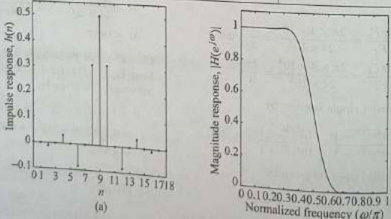{width=31%}  
Fig. 11.36 Responses of the designed half-band FIR LPF for Example 11.3 (a) Impulse response (b) Magnitude response  

# 11.10 DESIGN OF FINITE IMPULSE RESPONSE DIGITAL DIFFERENTIATORS  

$$
H _ { d } ( e ^{j \omega} ) = j \omega ,  | \omega | \leq \pi
$$  

$$
H _ { d } ( e ^{i \omega} ) = \left\{ \begin{array}{ll} { j \omega } & { 0 < \omega \leq \pi } \\{ - j \omega } & { - \pi < \omega < 0 } \end{array} \right. = \left\{ \begin{array}{ll} { \omega e ^{j \frac { \pi} { 2 } } } & { 0 < \omega \leq \pi } \\{ \omega e ^{- j \frac { \pi} { 2 } } } & { - \pi < \omega < 0 } \end{array} \right.
$$  

The magnitude response and phase response of a digital differentiator are given by  

$$
H _ { d } ( e ^{j \omega} ) = j \omega = | \omega | e ^{j \frac { \pi} { 2 } \exp ( \omega t ) } = | H _ { d } ( e ^{j \omega} ) | e ^{j \angle H _ { d} ( e ^{j \omega} ) } ,  | \omega | \leq \pi
$$  

$$
\begin{array}{rl} { | H _ { d } ( e ^{i \omega} ) | = | \omega | = \left\{ \begin{array}{ll} { \varepsilon } & { 0 < \omega \leq \pi } \\{ - \omega } & { - \pi < \omega < 0 } \end{array} \right. , } \\{ \angle H _ { d } ( e ^{i \omega} ) = \frac { \pi } { 2 } \operatorname { s g n } ( \omega ) = \left\{ \begin{array}{ll} { \frac { 2 \pi } { 2 } } & { 0 < \omega \leq \pi } \\{ - \frac { \pi } { 2 } } & { - \pi < \omega \leq 0 } \end{array} \right. } \end{array}
$$  

The magnitude response and phase response of digital differentiator are shown in Fig. 7.30. Since $H_{d}(e^{j\omega})$ is purely imaginary and odd, $h_{d}(n)$ will be purely real and odd (or antisymmetric). Applying the DTFT synthesis equation, we have  

$$
h _ { d } ( n ) = \frac { 1 } { 2 \pi } \int _ { - \pi } ^{\infty} H _ { d } ( e ^{2 \omega} ) e ^{i \omega n} d \omega = \frac { 1 } { 2 \pi } \int _ { - \pi } ^{\infty} j \omega e ^{i \omega n} d \omega
$$  

At $n=0$, we obtain  

$$
h _ { d } ( 0 ) = \frac { 1 } { 2 \pi } \int _ { - \pi } ^{\pi} j \omega d \omega = \frac { j } { 2 \pi } \frac { \omega ^{2} } { 2 } \left| _ { - \pi } ^{\pi} = \frac { j } { 2 \pi } \left[ \frac { \pi ^{2} } { 2 } - \frac { \pi ^{2} } { 2 } \right] = 0
$$  

At $n \neq 0$, we obtain  

$$
\begin{aligned} h _ { d } ( n ) & = \frac { 1 } { 2 \pi } \int _ { - \pi } ^{\pi} j w e ^{i w n} d w = \frac { j w e ^{j w n} } { 2 \pi j n } \left[ _ { - \pi } ^{\pi} - \frac { 1 } { 2 \pi } \int _ { - \pi } ^{\pi} \frac { e ^{j w n} } { j n } j d \omega \\& = \frac { j w e ^{j \omega n} } { 2 \pi j n } \left[ _ { - \pi } ^{\pi} - \frac { e ^{j \omega n} } { 2 \pi j n ^{2} } \right] _ { - \pi } ^{\pi} \\& = \frac { 1 } { 2 \pi n } \left[ \pi e ^{j \pi n} + \pi e ^{- j \pi n} \right] - \frac { 1 } { 2 j \pi n ^{2} } \left[ e ^{j \pi n} - e ^{- j \pi n} \right] \\& = \frac { \cos \left( \pi n \right) } { n } - \frac { 1 } { \underbrace { \pi n ^{2} } _ { = 0 } } \sin \left( \pi n \right) \\h _ { d } ( n ) & = \frac { \cos \left( \pi n \right) } { n } = \frac { \left( - 1 \right) ^{n} } { n } ,  n \neq 0 \end{aligned}
$$  

Combining these results for $n=0$ and $n\neq0$, we have the overall result as  

$$
h _ { d } ( n ) = \left\{ \begin{array}{ll} { { 0 } } & { { n = 0 } } \\{ { \frac { \cos ( \pi n ) } { n } } } & { { n \neq 0 } } \end{array} \right.
$$  

 ---------------------------------------------[ 第43页 ]---------------------------------------------  

We observe that the ideal differentiator has an antisymmetric impulse response [i.e., $h_{d}(n) = -h_{d}(-n)$], which implies that either a Type-3 or a Type-4 FIR filter can be used for its realization. For a Type-3 FIR filter $H_{r}(e^{j\pi}) = 0$, that is, it has a zero at $z = -1$. However, from Eq. (11.115), for an ideal differentiator, $H_{r}(e^{j\pi}) = \pi$. Hence, a Type-3 FIR cannot be used for its realization. As a result, only a Type-4 FIR filter can be used for its design.  

In practical applications, we seldom require filters that differentiate for the full frequency range up to $|\omega|=\pi$. Hence, both Type-3 and Type-4 FIR filters can be used to design a low-pass differentiator. If we require differentiation only up to a cut-off frequency of $\omega_{c}$, then  

$$
H _ { d } ( e ^{j \omega} ) = j \omega ,  | \omega | \leq \omega _ { c }
$$  

and its impulse response is given by  

$$
h _ { d } ( n ) = \left\{ \begin{array}{ll} { 0 } & { n = 0 } \\{ \frac { \omega _ { c } } { n \pi } \cos \left( \omega _ { c } n \right) - \frac { 1 } { n \pi ^{2} } \sin \left( \omega _ { c } n \right) } & { n \neq 0 } \end{array} \right.
$$  

Example 11.37 The frequency response of a digital differentiator is given by  

$$
H _ { d } ( e ^{f \omega} ) = j \omega - \pi \leq \omega \leq \pi
$$  

$$
= \left\{ - { \frac { 1 } { 4 } } , { \frac { 1 } { 3 } } , - { \frac { 1 } { 2 } } , 1 , 0 , - 1 , { \frac { 1 } { 2 } } , - { \frac { 1 } { 3 } } , { \frac { 1 } { 4 } } \right\}
$$  

Using a rectangular window of length $M = 9$, design a digital FIR differentiator.  

Note that $h(\pi) = -h(-\pi)$. The frequency response of the designed FIR differentiator is given by  

# Solution:  

The desired impulse response is given by  

$$
\begin{aligned} h _ { d } ( n ) & = \frac { 1 } { 2 \pi } \int _ { - \infty } ^{\infty} H _ { d } ( e ^{j \omega n} ) e ^{j \omega n} d \omega \\& = \frac { 1 } { 2 \pi } \int _ { - \infty } ^{\infty} j w e ^{j \omega n} d \omega = \left\{ \begin{array}{ll} { { 0 } } & { { n = 0 } } \\{ { \frac { \cos ( \pi n ) } { n } } } & { { n \neq 0 } } \end{array} \right. \end{aligned}
$$  

Computing $h_{d}(n)$ for $-4 \leq n \leq 4$, we get  

$$
h _ { d } ( \pi ) = \left\{ - \frac { 1 } { 4 } , \frac { 1 } { 3 } , - \frac { 1 } { 2 } , 1 , 0 , - 1 , \frac { 1 } { 2 } , - \frac { 1 } { 3 } , \frac { 1 } { 4 } \right\}
$$  

Note that $h_{d}(n) = -h_{d}(-n)$. For $M = 9$, the non-causal rectangular window is given by  

$$
\begin{array}{rl} { w ( n ) = \left\{ \begin{array}{ll} { 1 } & { - 4 \leq n \leq 4 } \\{ 0 } & { { \mathrm { o t h e r w i s e } } } \end{array} \right. } \\{ w ( n ) = \left\{ \begin{array}{ll} { 1 , } & { 1 , } \\{ 1 , } & { 1 , } \\{ 1 , } & { 1 , } \end{array} \right. } \end{array}
$$  

$$
\begin{aligned} H ( e ^{j \omega} ) & = \sum _ { n = - 4 } ^{4} h ( n ) e ^{- j \omega n} \\& = h ( - 4 ) e ^{j 4 \omega} + h ( - 3 ) e ^{j 3 \omega} + h ( - 2 ) e ^{j 2 \omega} \\& + h ( - 1 ) e ^{j \omega} + h ( 0 ) + h ( 1 ) e ^{- j \omega} \\& + h ( 2 ) e ^{- j 2 \omega} + h ( 3 ) e ^{- j 3 \omega} + h ( 4 ) e ^{- j 4 \omega} \\& = - h ( 4 ) e ^{j 4 \omega} - h ( 3 ) e ^{j 3 \omega} - h ( 2 ) e ^{j 2 \omega} \\& - h ( 1 ) e ^{j \omega} + h ( 0 ) + h ( 1 ) e ^{- j \omega} \\& + h ( 2 ) e ^{- j 2 \omega} + h ( 3 ) e ^{- j 3 \omega} + h ( 4 ) e ^{- j 4 \omega} \\& = h ( 0 ) - h ( 1 ) [ e ^{j \omega} - e ^{- j \omega} ] - h ( 2 ) [ e ^{j 2 \omega} \\& - e ^{- j 2 \omega} ] - h ( 3 ) [ e ^{j 3 \omega} \\& - e ^{- j 3 \omega} ] - h ( 3 ) [ e ^{j 3 \omega} \\& - e ^{- j 3 \omega} ] - h ( 4 ) [ e ^{j 4 \omega} - e ^{- j 4 \omega} ] \\& = h ( 0 ) - 2 j h ( 1 ) \sin \omega - 2 j h ( 2 ) \sin 2 \omega \\& - 2 j h ( 3 ) \sin 3 \omega - 2 j h ( 4 ) \sin 4 \omega \\& H ( e ^{j \omega} ) = j \left[ 2 \sin \omega - \sin 2 \omega + 1 . 5 \sin 3 \omega - 2 \sin 4 \omega \right] \end{aligned}
$$  

Multiplying the desired impulse response $h_{d}(n)$ by rectangular window $w(n)$ to get the impulse response $h(n)$ of non-causal FIR differentiator, that is,  

$$
h ( n ) = h _ { d } ( n ) w ( n )
$$  

The magnitude response is given by  

$|H(e^{j\omega})| = |2\sin\omega - \sin2\omega + 1.5\sin3\omega - 2\sin4\omega|$ Figure 11.37 shows the impulse response and magnitude response of the designed FIR differentiator  

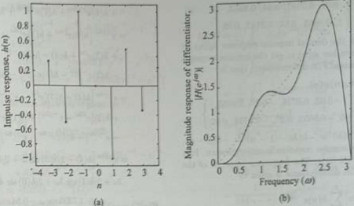{width=35%}  
Fig. 11.37 Responses of the FIR differentiator for Example 11.37 (a) Impulse response (b) Magnitude response  

Example 11.38 The frequency response of a linear-phase digital differentiator is given by  

$$
H _ { d } ( e ^{i \omega} ) = j \omega e ^{- j \pi \omega}  | u | \leq \pi
$$  

Using a Hamming window of length $M = 9$, design a digital FIR differentiator.  

# Solution:  

Given that $M=9$, then $\tau=\frac{M-1}{2}=4$ is an integer. The desired impulse response is given by  

$$
\begin{array}{rl} { h _ { d } ( n ) = { \frac { 1 } { 2 \pi } } \int _ { - \pi } ^{\infty} H _ { d } ( e ^{j \omega} ) e ^{j \omega n} d \omega } \\{ = { \frac { 1 } { 2 \pi } } \int _ { - \pi } ^{\infty} j \omega e ^{- j \omega} e ^{j \omega n} d \omega } \\{ = { \frac { 1 } { 2 \pi } } \int _ { - \pi } ^{\infty} j \omega e ^{j \omega ( n - r )} d \omega } \end{array}
$$  

$$
\begin{aligned} & = \frac { j \omega e ^{j \omega ( n - \tau )} } { 2 \pi j ( n - \tau ) } \left[ \begin{array}{l} { { \overline { { { \pi } } } } } \\{ { - \pi } } \end{array} \right] _ { - \pi } ^{\infty} - \frac { e ^{j \omega ( n - \tau )} } { 2 \pi j ( n - \tau ) ^{2} } \left| \begin{array}{l} { { \overline { { { \pi } } } } } \\{ { - \pi } } \end{array} \right| _ { - \pi } ^{\infty} \\& = \frac { 1 } { 2 \pi ( n - \tau ) } \left[ \pi e ^{j \pi ( n - \tau )} + \pi e ^{- j \pi ( n - \tau )} \right] \\& - \frac { 1 } { 2 j \pi ( n - \tau ) ^{2} } \left[ e ^{j \pi ( n - \tau )} - e ^{- j \pi ( n - \tau )} \right] \\h _ { d } ( n ) = \frac { \cos \pi ( n - \tau ) } { ( n - \tau ) ^{2} } - \frac { \sin \pi ( n - \tau ) } { \pi ( n - \tau ) ^{2} } \end{array}
$$  

At $n=\tau$, we obtain  

$$
\begin{array}{rl} { h _ { d } ( \tau ) = { \frac { 1 } { 2 \pi } } \int _ { - \pi } ^{\pi} j \omega d \omega = { \frac { j } { 2 \pi } } { \frac { v ^{2} } { 2 } } \bigg | _ { - \pi } ^{\infty} } \\{ = { \frac { j } { 2 \pi } } \left[ { \frac { \pi ^{2} } { 2 } } - { \frac { \pi ^{2} } { 2 } } \right] = 0 } \end{array}
$$  

Combining these results for $n = \tau$ and $n \neq \tau$, we have the overall result as  

$$
h _ { d } ( n ) = \left\{ \begin{array}{ll} { 0 } & { n = \tau } \\{ \frac { \cos \pi ( n - \tau ) } { ( n - \tau ) } - \frac { \sin \pi ( n - \tau ) } { \pi ( n - \tau ) ^{2} } } & { n \neq \tau } \end{array} \right.
$$  

At $n \neq \tau$, we obtain  

When $\tau=4$, the term $[\sin\pi(n-4)]=0$; therefore, the desired impulse response is given by  

$$
\begin{array}{rl} { h _ { d } ( n ) = { \frac { 1 } { 2 \pi } } \int _ { - \pi } ^{\infty} j \omega e ^{j \omega ( n - \tau )} \, d \omega = { \frac { j \omega e ^{j \omega ( n - \tau )} } { 2 \pi j ( n - \tau ) } } { \Bigg | } _ { - \infty } } \\{ - { \frac { 1 } { 2 \pi } } \int _ { - \pi } ^{\infty} { \frac { e ^{j \omega ( n - \tau )} } { j ( n - \tau ) } } j d \omega } \end{array}
$$  

$$
h _ { d } ( n ) = \left\{ \begin{array}{ll} { { 0 } } & { { n = 4 } } \\{ { \frac { \cos \pi ( n - 4 ) } { ( n - 4 ) } } } & { { n \neq 4 } } \end{array} \right.
$$  

Computing $\hbar_{4}(n)$ for $0 \leq n \leq 8$, we get  

$$
h _ { d } ( n ) = \left\{ - \frac { 1 } { 4 } , \frac { 1 } { 3 } , - \frac { 1 } { 2 } , 1 , 0 , - 1 , \frac { 1 } { 2 } , - \frac { 1 } { 3 } , \frac { 1 } { 4 } \right\}
$$  

For $M=9$, the causal Hamming window is given by  

$$
w ( n ) = \left\{ \begin{array}{ll} { 0 . 54 - 0 . 46 \cos \left( \frac { \pi n } { 4 } \right) } & { 0 \leq n \leq 8 } \\{ 0 } & { o t h e r w i s e } \end{array} \right.
$$  

 ---------------------------------------------[ 第44页 ]---------------------------------------------  

$$
w ( n ) = \left\{ \begin{array}{l} { { 0 . 08 , \, 0 . 21 47 , \, 0 . 54 , \, 0 . 86 53 , } } \\{ { 1 , \, 0 . 86 53 , \, 0 . 54 , \, 0 . 21 47 , \, 0 . 08 } } \end{array} \right\}
$$  

Multiplying the desired impulse response $h_{d}(n)$ by Hamming window $w(n)$ to get the impulse response $h(n)$ of a causal FIR differentiator, that is,  

$$
\begin{array}{rl} { h ( n ) = h _ { d } ( n ) w ( n ) } & { { } } \\{ = \left\{ \begin{array}{l} { - 0 . 02 , \, 0 . 07 16 , \, - 0 . 27 , \, 0 . 86 53 , } \\{ 0 , \, - 0 . 86 53 , \, 0 . 27 , \, - 0 . 07 16 , \, 0 . 02 } \end{array} \right\} } & { { } } \end{array}
$$  

Note that $h(n) = -h(M - 1 - n) = -h(8 - n)$, that is, the impulse response is antisymmetric. It is a Type-3 FIR filter. The frequency response of the designed FIR differentiator is given by  

$$
\begin{aligned} & \left. + h ( 6 ) e ^{- j 2 \omega} + h ( 7 ) e ^{- j 3 \omega} + h ( 8 ) e ^{- j 4 \omega} \right] \\& = e ^{- j 4 \omega} \left[ h ( 0 ) e ^{j 4 \omega} + h ( 1 ) e ^{j 3 \omega} + h ( 2 ) e ^{j 2 \omega} \right. \\& \left. + h ( 3 ) e ^{j \omega} + h ( 4 ) - h ( 3 ) e ^{- j \omega} \right. \\& \left. - h ( 2 ) e ^{- j 2 \omega} - h ( 1 ) e ^{- j 3 \omega} - h ( 0 ) e ^{- j 4 \omega} \right] \\& = e ^{- j 4 \omega} \left[ h ( 4 ) + h ( 3 ) [ e ^{j \omega} - e ^{- j \omega} ] \right. \\& \left. + h ( 2 ) [ e ^{j 2 \omega} - e ^{- j 2 \omega} ] + h ( 1 ) [ e ^{j 3 \omega} \right. \\& \left. - e ^{- j 3 \omega} ] + h ( 0 ) [ e ^{j 4 \omega} - e ^{- j 4 \omega} ] \right] \\& = e ^{- j 4 \omega} \left[ h ( 4 ) + 2 j h ( 3 ) \sin \omega + 2 j h ( 2 ) \sin \left. \right. \\& 2 \omega + 2 j h ( 1 ) \sin 3 \omega + 2 j h ( 0 ) \sin 4 \omega \right] \\& e ^{j \omega} ) = j e ^{- j 4 \omega} \left[ \begin{array}{l} { { 1 . 73 05 \sin \omega - 0 . 54 \sin 2 \omega } } \\{ { + 0 . 14 32 \sin 3 \omega - 0 . 04 \sin 4 \omega } } \end{array} \right] \end{aligned}
$$  

$$
\begin{aligned} H ( e ^{j \omega} ) & = \sum _ { n = 0 } ^{8} h ( n ) e ^{- j \omega n} \\& = h ( 0 ) + h ( 1 ) e ^{- j \omega} + h ( 2 ) e ^{- j 2 \omega} \\& + h ( 3 ) e ^{- j 3 \omega} + h ( 4 ) e ^{- j 4 \omega} + h ( 5 ) e ^{- j 5 \omega} \\& + h ( 6 ) e ^{- j 6 \omega} + h ( 7 ) e ^{- j 7 \omega} + h ( 8 ) e ^{- j 8 \omega} \\& = e ^{- j 4 \omega} \left[ h ( 0 ) e ^{j 4 \omega} + h ( 1 ) e ^{j 3 \omega} + h ( 2 ) e ^{j 2 \omega} \right. \\& \left. + h ( 3 ) e ^{j \omega} + h ( 4 ) + h ( 5 ) e ^{- j \omega} \right] \end{aligned}
$$  

The magnitude response is given by  

$$
\begin{array}{rl} { | H ( e ^{2 \omega} ) | = | 1 . 73 05 \sin \omega - 0 . 54 \sin 2 \omega } \\{ + 0 . 14 32 \sin 3 \omega - 0 . 04 \sin 4 \omega | } \end{array}
$$  

Figure 11.38 shows the impulse response and magnitude response of the designed FIR differentiator.  

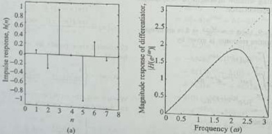{width=31%}  
(b)

Fig. 11.38 Responses of the FIR differentiator for Example 11.38 (a) Impulse response (b) Magnitude response  

The system function of linear-phase digital differentiator is given by  

$$
\begin{aligned} & = h ( 0 ) [ 1 - z ^{- 8} ] + h ( 1 ) [ z ^{- 1} - z ^{- 7} ] \\& + h ( 2 ) [ z ^{- 2} - z ^{- 6} ] + h ( 3 ) [ z ^{- 3} - z ^{- 5} ] \\& + h ( 4 ) z ^{- 4} \\H ( z ) = - 0 . 02 [ 1 - z ^{- 8} ] + 0 . 07 16 [ z ^{- 1} - z ^{- 7} ] \\& - 0 . 27 [ z ^{- 2} - z ^{- 6} ] + 0 . 86 53 [ z ^{- 3} - z ^{- 5} ] \end{aligned}
$$  

$$
\begin{aligned} H ( z ) & = \sum _ { n = 0 } ^{\infty} h ( n ) z ^{- n} \\& = h ( 0 ) + h ( 1 ) z ^{- 2} + h ( 2 ) z ^{- 2} + h ( 3 ) z ^{- 3} \\& = h ( 0 ) + h ( 1 ) z ^{- 1} + h ( 2 ) z ^{- 2} + h ( 3 ) z ^{- 3} \\& + h ( 4 ) z ^{- 4} - h ( 3 ) z ^{- 5} - h ( 2 ) z ^{- 6} \\& - h ( 1 ) z ^{- 7} - h ( 0 ) z ^{- 8} \end{aligned}
$$  

The difference equation is given by  

$$
\begin{array}{rl} { H ( z ) = { \frac { Y ( z ) } { X ( z ) } } = - 0 . 02 [ 1 - z ^{- 6} ] } & { } \\{ + 0 . 07 16 [ z ^{- 1} - z ^{- 7} ] - 0 . 27 [ z ^{- 2} - z ^{- 6} ] } & { } \\{ + 0 . 86 53 [ z ^{- 3} - z ^{- 5} ] } & { } \\{ Y ( z ) = - 0 . 02 [ 1 - z ^{- 8} ] X ( z ) } & { } \\{ + 0 . 07 16 [ z ^{- 1} - z ^{- 7} ] X ( z ) } & { } \\{ - 0 . 27 [ z ^{- 2} - z ^{- 6} ] X ( z ) } & { } \\{ + 0 . 86 53 [ z ^{- 3} - z ^{- 5} ] X ( z ) } & { } \\{ y ( n ) = - 0 . 02 [ x ( n ) - x ( n - 8 ) ] + 0 . 07 16 [ x ( n - 1 } & { } \\{ - x ( n - 7 ) ] - 0 . 27 [ x ( n - 2 ) - x ( n - 6 ) ] } & { } \\{ + 0 . 86 53 [ x ( n - 3 ) - x ( n - 5 ) ] } & { } \end{array}
$$  

This difference equation can be used to draw the linear-phase structure of the differentiator which is shown in Fig. 11.39.  

$$
\begin{aligned} h _ { d } ( n ) & = \frac { 1 } { 2 \pi } \int _ { - \pi } ^{\infty} H _ { d } ( e ^{j \omega} ) e ^{j \omega n} \, \mathrm { d } \omega \\& = \frac { 1 } { 2 \pi } \int _ { - \pi } ^{\infty} j \omega e ^{- j \tau \omega} e ^{j \omega n} \, \mathrm { d } \omega \\& = \frac { 1 } { 2 \pi } \int _ { - \pi } ^{\infty} j \omega e ^{j \omega ( n - \tau )} \, \mathrm { d } \omega \\& = \frac { j \omega \, e ^{j \omega ( n - \tau )} } { 2 \pi j ( n - \tau ) } \left| _ { - \pi } ^{\infty} - \frac { 1 } { 2 \pi } \int _ { - \pi } ^{\pi} \frac { e ^{j \omega ( n - \tau )} } { j ( n - \tau ) } j \mathrm { d } \omega \right. \\& = \frac { j \omega \, e ^{j \omega ( n - \tau )} } { 2 \pi j ( n - \tau ) } \left| _ { - \pi } ^{\infty} - \frac { e ^{j \omega ( n - \tau )} } { 2 \pi j ( n - \tau ) ^{2} } \right| _ { - \pi } ^{\infty} \\& = \frac { 1 } { 2 \pi ( n - \tau ) } \left[ \pi e ^{j \pi ( n - \tau )} + \pi e ^{- j \pi ( n - \tau )} \right] \\& - \frac { 1 } { 2 j \pi ( n - \tau ) ^{2} } \left[ e ^{j \pi ( n - \tau )} - e ^{- j \pi ( n - \tau )} \right] \\h _ { d } ( n ) & = \frac { \cos \pi ( n - \tau ) } { ( n - \tau ) } - \frac { \sin \pi ( n - \tau ) } { \pi ( n - \tau ) ^{2} } \end{aligned}
$$  

{width=21%}  
Fig. 11.39 Linear-phase structure of the differentiator for Example 11.38 (a) Impulse response (b) Magnitude response of the FIR differentiator for Example 11.38  

Example 11.39 The frequency response of a linear-phase digital differentiator is given by  

When $\tau = 3.5$, the term $[\cos\pi(n - 3.5)] = 0$; therefore, the desired impulse response is given by  

$$
H _ { d } ( e ^{2 \omega} ) = j \omega e ^{- j \pi \omega}  | \omega | \leq \pi
$$  

Using a Hamming window of length $M = 8$, design a digital FIR differentiator.  

Given that $M = 8$, then $\tau = \frac{M - 1}{2} = 3.5$ is a non-integer. The desired impulse response is given  

by  

$$
h _ { d } ( n ) = - \frac { \sin \pi ( n - 3 . 5 ) } { \pi ( n - 3 . 5 ) ^{2} }
$$  

Computing $h_{d}(n)$ for $0 \leq n \leq 7$, we get  

# Solution:  

$$
h _ { d } ( n ) = \left\{ \begin{array}{l} { { - 0 . 02 6 , ~ 0 . 05 09 , ~ - 0 . 14 15 , ~ 1 . 27 32 , } } \\{ { - 1 . 27 32 , ~ 0 . 14 15 , ~ - 0 . 05 09 , ~ 0 . 02 6 } } \end{array} \right\}
$$  

For $M=8$, the causal Hamming window is given by  

$$
\begin{array}{r} { w ( n ) = \left\{ \begin{array}{ll} { 0 . 54 - 0 . 46 \cos \left( \frac { 2 x n } { T } \right) } & { 0 \leq n \leq 7 } \\{ 0 } & { \mathrm { o t h e r w i s e } } \end{array} \right. } \\{ w ( n ) = \left\{ \begin{array}{ll} { 0 . 08 , } & { 0 . 25 32 , } \\{ \tau } & { 0 . 64 24 , } \\{ 0 . 64 24 , } & { 0 . 25 32 , } \end{array} \right\} } \end{array}
$$  

Multiplying the desired impulse response $h_{d}(n)$ by Hamming window $w(n)$ to get the impulse response $h(n)$ of a causal FIR differentiator, that is,  

$$
\begin{array}{rl} { h ( n ) = h _ { c } ( n ) w ( n ) } & { { } } \\{ = \left\{ \begin{array}{l} { - 0 . 00 \dot { 2 } 1 , \ 0 . 01 29 , \ - 0 . 09 09 , \ 1 . 21 52 , } \\{ - 1 . 21 52 , \ 0 . 09 09 , \ - 0 . 01 29 , \ 0 . 00 21 } \end{array} \right\} } \end{array}
$$  

Note that $h(n) = -h(M - 1 - n) = -h(7 - n)$, that is, the impulse response is antisymmetric. It is a Type-4 FIR filter. The frequency response of the  

 ---------------------------------------------[ 第45页 ]---------------------------------------------  

designed FIR differentiator is given by  

$$
\begin{aligned} & = e ^{- j 3 . 5 \omega} \left[ h ( 3 ) \left[ e ^{j 0 . 5 \omega} - e ^{- j 0 . 5 \omega} \right] \right. \\& \left. + h ( 2 ) [ e ^{j 1 . 5 \omega} - e ^{- j 1 . 5 \omega} ] \right. \\& + h ( 1 ) [ e ^{j 2 . 5 \omega} - e ^{- j 2 . 5 \omega} ] \right. \\& + h ( 0 ) [ e ^{j 3 . 5 \omega} - e ^{- j 3 . 5 \omega} ] \right] \\& = e ^{- j 3 . 5 \omega} \left[ 2 j \, h ( 3 ) \sin 0 . 5 \omega + 2 j \, h ( 2 ) \sin 1 . 5 \omega \right. \\& \left. + 2 j \, h ( 1 ) \sin 2 . 5 \omega + 2 j \, h ( 0 ) \sin 3 . 5 \omega \right] \\& H ( e ^{j \omega} ) = j e ^{- j 3 . 5 \omega} \left[ 2 . 43 05 \sin 0 . 5 \omega - 0 . 18 18 \sin 1 . 5 \omega \right. \\& \left. + 0 . 02 58 \sin 2 . 5 \omega - 0 . 00 42 \sin 3 . 5 \omega \right] \end{aligned}
$$  

$$
\begin{aligned} H ( e ^{j \omega} ) & = \sum _ { n = 0 } ^{7} h ( n ) e ^{- j \omega n} \\& = h ( 0 ) + h ( 1 ) e ^{- j \omega} + h ( 2 ) e ^{- j 2 \omega} \\& + h ( 3 ) e ^{- j 3 \omega} + h ( 4 ) e ^{- j 4 \omega} + h ( 5 ) e ^{- j 5 \omega} \\& + h ( 6 ) e ^{- j 6 \omega} + h ( 7 ) e ^{- j 7 \omega} \\& = e ^{- j 3 . 5 \omega} \left[ h ( 0 ) e ^{j 3 . 5 \omega} + h ( 1 ) e ^{j 2 . 5 \omega} \right. \\& \left. + h ( 2 ) e ^{j 1 . 5 \omega} + h ( 3 ) e ^{j 0 . 5 \omega} \right. \\& + h ( 4 ) e ^{- j 0 . 5 \omega} + h ( 5 ) e ^{- j 1 . 5 \omega} \right. \\& + h ( 6 ) e ^{- j 2 . 5 \omega} + h ( 7 ) e ^{- j 3 . 5 \omega} \right] \\& = e ^{- j 3 . 5 \omega} \left[ h ( 0 ) e ^{j 3 . 5 \omega} + h ( 1 ) e ^{j 2 . 5 \omega} \right. \\& + h ( 2 ) e ^{j 1 . 5 \omega} + h ( 3 ) e ^{j 0 . 5 \omega} \\& - h ( 3 ) e ^{- j 0 . 5 \omega} - h ( 2 ) e ^{- j 2 . 5 \omega} \\& - h ( 1 ) e ^{- j 2 . 5 \omega} - h ( 0 ) e ^{- j 3 . 5 \omega} \right] \end{aligned}
$$  

The magnitude response is given by  

$$
\begin{array}{r} { | H ( e ^{2 \omega} ) | = | 2 . 43 05 \sin 0 . 5 \omega - 0 . 18 18 \sin 1 . 5 \omega } \\{ + 0 . 02 58 \sin 2 . 5 \omega - 0 . 00 42 \sin 3 . 5 \omega | } \end{array}
$$  

Figure 11.40 shows the impulse response and magnitude response of the designed FIR differentiator.  

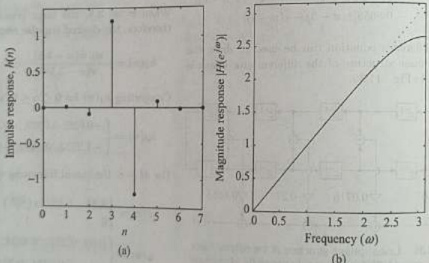{width=34%}  
Fig. 11.40 Responses of the FIR differentiator for Example 11.39 (a) Impulse response and (b) Magnitude response  

or, equivalently  

An ideal Hilbert transformer is an all-pass filter that imparts a 90° phase-shift on the signal at its input (see Section 7.16). Hence, the frequency response of the ideal Hilbert  

$$
H _ { \theta } ( e ^{j u} ) = - j \operatorname { s g n } ( \omega ) = \left\{ \begin{array}{ll} { { - j } } & { { 0 < \omega < \pi } } \\{ { j } } & { { - \pi < \omega < 0 } } \end{array} \right. = \left\{ \begin{array}{ll} { { e ^{- j \frac { \pi} { 2 } } } } & { { 0 < \omega < \pi } } \\{ { e ^{j \frac { \pi} { 2 } } } } & { { - \pi < \omega < 0 } } \end{array} \right.
$$  

$$
H _ { d } ( e ^{j \omega} ) = - j \operatorname { s g n } ( \omega ) ,  | \omega | < \pi
$$  

Thus, the magnitude response and the phase response of a digital Hilbert transformer are given by  

$$
| H _ { d } ( e ^{2 \omega} ) | = | \operatorname { s g n } ( \omega ) | = 1 - \pi < \omega < \pi
$$  

$$
\angle H _ { d } ( e ^{2 \pi} ) = - \frac { \pi } { 2 } \mathrm { s g n } ( \omega ) = \left\{ \begin{array}{ll} { { - \frac { \pi } { 2 } } } & { { 0 < \omega < \pi } } \\{ { \frac { \pi } { 2 } } } & { { - \pi < \omega < 0 } } \end{array} \right.
$$  

The magnitude response and the phase response of an ideal digital Hilbert transformer are shown in Fig. 7.33. Since $H_{d}(e^{j\omega})$ is purely imaginary and odd, $h_{d}(n)$ will be purely real and odd (or antisymmetric). Applying the DFTFT synthesis equation, we have  

$$
H _ { d } ( e ^{j \omega} ) = | \mathrm { s g n } ( \omega ) | e ^{- j \frac { 1} { 2 } \mathrm { s g n } ( \omega ) } = | H _ { d } ( e ^{j \omega} ) | \, | e ^{j < H _ { d} ( e ^{j \omega} ) } ,  \frac { | \omega | } { | e | } < \pi
$$  

$$
h _ { d } ( n ) = \frac { 1 } { 2 \pi } \int _ { - \infty } ^{\infty} H _ { d } ( e ^{j \omega} ) e ^{j \omega n} d \omega = \frac { 1 } { 2 \pi } \int _ { - \infty } ^{\infty} - j \mathrm { s g n } ( \omega ) e ^{j \omega n} d \omega
$$  

At $n=0$, we obtain  

$$
\begin{aligned} h _ { d } ( 0 ) & = \frac { 1 } { 2 \pi } \int _ { - \pi } ^{\pi} - j \operatorname { s g n } ( \omega ) d \omega = \frac { 1 } { 2 \pi } \int _ { - \pi } ^{0} j d \omega + \frac { 1 } { 2 \pi } \int _ { 0 } ^{\pi} - j d \omega \\& = \frac { j } { 2 \pi } [ ( 0 + \pi ) - ( \pi - 0 ) ] = 0 \end{aligned}
$$  

At $n \neq 0$, we obtain  

$$
\begin{aligned} h _ { d } ( \pi ) & = \frac { 1 } { 2 \pi } \int _ { - \pi } ^{\pi} - j \mathrm { s g n } ( \omega ) e ^{j \pi n} d \omega = \frac { 1 } { 2 \pi } \int _ { - \pi } ^{0} j e ^{j \pi n} d \omega + \frac { 1 } { 2 \pi } \int _ { 0 } ^{\infty} - j e ^{j \pi n} d \omega \\& = \frac { 2 } { n \pi } \sin ^{2} \left( \frac { n \pi } { 2 } \right) \end{aligned}
$$  

Combining these results for $n=0$ and $n\neq0$, we have the overall result as  

$$
h _ { d } ( n ) = \left\{ \begin{array}{ll} { 0 } & { n = 0 } \\{ \frac { 2 } { n \pi } \sin ^{2} \left( \frac { n \pi } { 2 } \right) } & { n \neq 0 } \end{array} \right\}  \mathrm { n ~ e v e n }
$$  

We observe that the ideal Hilbert transformer has an antisymmetric impulse response [i.e., $\hbar_{d}(n)=-\hbar_{d}(-n)$], which implies that either a Type-3 or a Type-4 FIR filter can be used for its realization. For a Type-3 FIR filter, $H_{r}(e^{j\theta})=H_{r}(e^{j\pi})=0$, and for a Type-4 FIR filter, $H_{r}(e^{j\theta})=0$. However, from Eq. (11.123), for an ideal Hilbert transformer, $|H_{d}(e^{j\omega})|=1$ for all $\omega$. Hence Type-3 and Type-4 FIR filters cannot be used for its realization.  

realizations

In practical applications, we seldom require filters that shift the phase for the full frequency range up to $|\omega| = \pi$. If we require phase shifting only up to a cut-off frequency of $\omega_c$, then  

$$
H ( e ^{i \omega} ) = - j \operatorname { s g n } ( \omega ) ,  | \omega | \leq \omega _ { c }
$$  

Hence, both Type-3 and Type-4 FIR filters can be used to design a Hilbert transformer. The digital Hilbert transformers find applications in modulators and demodulators  

 ---------------------------------------------[ 第46页 ]---------------------------------------------  

Signal Processing

(single-side band), speech processing, and medical imaging. It provides the mathematical basis for the representation of band-pass signals.  

Example 11.40 Design an ideal Hilbert transformer with frequency response  

$$
H _ { d } ( e ^{j \omega} ) = \left\{ \begin{array}{ll} { { - j } } & { { 0 < \omega < \pi } } \\{ { j } } & { { - \pi < \omega < 0 } } \end{array} \right.
$$  

using rectangular window for $M=9$.  

Solution:  

The desired impulse response is given by  

$$
\begin{aligned} h _ { d } ( n ) & = \frac { 1 } { 2 \pi } \int _ { - \infty } ^{\infty} H _ { 4 } ( e ^{2 \omega} ) e ^{2 \omega n} d \omega \\& = \frac { 1 } { 2 \pi } \int _ { - \infty } ^{\infty} - j \mathrm { s g n } ( \omega ) e ^{j \omega n} d \omega \end{aligned}
$$  

At $n=0$, we obtain  

$$
\begin{aligned} h _ { d } ( 0 ) & = \frac { 1 } { 2 \pi } \int _ { - \infty } ^{\pi} - j \mathrm { s g n } ( w ) d \omega \\& = \frac { 1 } { 2 \pi } \int _ { - \infty } ^{0} j d w + \frac { 1 } { 2 \pi } \int _ { 0 } ^{\pi} - j d \omega \\& = \frac { j } { 2 \pi } [ ( 0 + \pi ) - ( \pi - 0 ) ] = 0 \end{aligned}
$$  

At $n \neq 0$, we obtain  

$$
\begin{aligned} h _ { d } ( n ) & = \frac { 1 } { 2 \pi } \int _ { - \pi } ^{\pi} - j \mathrm { s g n } ( \omega ) e ^{j \pi n} d \omega \\& = \frac { 1 } { 2 \pi } \int _ { - \pi } ^{0} j e ^{i \pi n} d \omega + \frac { 1 } { 2 \pi } \int _ { 0 } ^{\pi} - j e ^{i \pi n} d \omega \\& = \frac { j } { 2 \pi } \int _ { - \pi } ^{0} e ^{j \pi n} d \omega - \frac { j } { 2 \pi } \int _ { 0 } ^{\pi} e ^{j \pi n} d \omega \\& = \frac { j } { 2 \pi } \left[ \frac { e ^{j \pi n} } { j n } \right] _ { - \pi } ^{0} - \frac { e ^{j \pi n} } { j n } \left[ \frac { n } { 0 } \right] \\& = \frac { 1 } { 2 n \pi } [ 1 - e ^{- j \pi} - e ^{j \pi n} + 1 ] \\h _ { d } ( n ) & = \frac { 1 } { 2 n \pi } \left[ 2 - 2 \left( \frac { e ^{j \pi n} + e ^{- j \pi n} } { 2 } \right) \right] \\& = \frac { 1 } { 2 n \pi } [ 2 - 2 \cos ( n \pi ) ] = \frac { 1 } { n \pi } [ 1 - \cos ( n \pi ) \\& = \frac { 2 } { n \pi } \sin ^{2} \left( \frac { n \pi } { 2 } \right) \end{aligned}
$$  

$$
\begin{array}{rl} { w ( n ) = { \left\{ \begin{array}{ll} { 1 } & { - 4 \leq n \leq 4 } \\{ 0 } & { { \mathrm { o t h e r w i s e } } } \end{array} \right. } } & { { } } \\{ w ( n ) = { \left\{ \begin{array}{ll} { 1 , } & { 1 , } & { 1 , } \\{ 1 , } & { 1 , } & { { \frac { 1 } { n } } , } \end{array} \right. } } & { { } } \end{array}
$$  

Combining these results for $n=0$ and $n\neq0$, we have the overall result as  

$$
\mathrm { C o m p u t i n g ~ } h _ { d } ( n ) \mathrm { ~ f o r ~ } - 4 \leq n \leq 4 , \mathrm { ~ w e ~ g e t }
$$  

$$
h _ { d } ( n ) = \left\{ 0 , - \frac { 2 } { 3 \pi } , 0 , - \frac { 2 } { \pi } , 0 , \frac { 2 } { \pi } , 0 , \frac { 2 } { 3 \pi } , 0 \right\}
$$  

Note that $h_{d}(n) = -h_{d}(-n)$. For $M = 9$, the non-causal rectangular window is given by  

Multiplying the desired impulse response $h_{d}(n)$ by rectangular window $w(n)$ to get the impulse response $h(n)$ of non-causal FIR Hilbert transformer, that is,  

$$
h ( n ) = h _ { d } ( n ) w ( n ) = \left\{ \begin{array}{ll} { { 0 , } } & { { - \frac { 2 } { 3 \pi } , } } \\{ { 0 , } } & { { \frac { 2 } { \pi } , } } \\{ { \frac { 1 } { \pi } , } } & { { 0 , } } \end{array} \right. \frac { 0 , } { 3 \pi } , } \end{array} \right.
$$  

Note that $h(n) = -h(-n)$. The frequency response of the designed FIR Hilbert transformer is given by  

$$
\begin{aligned} H ( e ^{j \omega} ) & = \sum _ { n = - 4 } ^{4} h ( n ) e ^{- j \omega n} \\& = h ( - 4 ) e ^{j 4 \omega} + h ( - 3 ) e ^{j 3 \omega} + h ( - 2 ) e ^{j 2 \omega} \\& + h ( - 1 ) e ^{j \omega} + h ( 0 ) + h ( 1 ) e ^{- j \omega} \\& + h ( 2 ) e ^{- j 2 \omega} + h ( 3 ) e ^{- j 3 \omega} + h ( 4 ) e ^{- j 4 \omega} \\& = - h ( 4 ) e ^{j 4 \omega} - h ( 3 ) e ^{j 3 \omega} - h ( 2 ) e ^{j 2 \omega} \\& - h ( 1 ) e ^{j \omega} + h ( 0 ) + h ( 1 ) e ^{- j \omega} \\& + h ( 2 ) e ^{- j 2 \omega} + h ( 3 ) e ^{- j 3 \omega} + h ( 4 ) e ^{- j 4 \omega} \\& = h ( 0 ) - h ( 1 ) [ e ^{j \omega} - e ^{- j \omega} ] \\& - h ( 2 ) [ e ^{j 2 \omega} - e ^{- j 2 \omega} ] \\& - h ( 3 ) [ e ^{j 3 \omega} - e ^{- j 3 \omega} ] \\& - h ( 4 ) [ e ^{j 4 \omega} - e ^{- j 4 \omega} ] \\& = h ( 0 ) - 2 j h ( 1 ) \sin \omega - 2 j h ( 2 ) \sin 2 \omega \\& - 2 j h ( 3 ) \sin 3 \omega - 2 j h ( 4 ) \sin 4 \omega \end{aligned}
$$  

$$
h _ { d } ( n ) = \left\{ \begin{array}{ll} { { 0 } } & { { n \simeq 0 } } \\{ { \frac { 2 } { n \pi } \sin ^{2} \left( \frac { n \pi } { 2 } \right) } } & { { n \neq 0 } } \end{array} \right.
$$  

$$
H ( e ^{\beta \omega} ) = j \left[ - \frac { 4 } { \pi } \sin \omega - \frac { 4 } { 3 \pi } \sin 3 \omega \right] = j H _ { r } ( e ^{\beta \omega} )
$$  

where the amplitude response $H_{r}(\mathbf{e}^{J\omega})$ is given by  

$$
H _ { r } ( e ^{j \omega} ) = - \frac { 4 } { \pi } \sin \omega - \frac { 4 } { 3 \pi } \sin 3 \omega
$$  

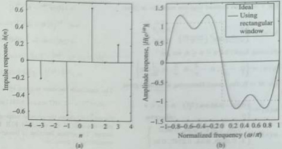{width=37%}  
Fig. 11.41 41 Responses of the FIR Hilbert transformer for Example 11.40 (a) Impulse response (b) Amplitude response  

Figure 11.41 shows the impulse response and amplitude response of the designed FIR Hilbert transformer.  

Example 11.41 Design a linear-phase Hilbert transformer with frequency response  

$$
\begin{aligned} H _ { d } ( e ^{j \omega} ) & = - j \mathrm { s g n } ( \omega ) e ^{- j \tau _ { w} } \\& = \left\{ \begin{array}{ll} { { - j e ^{- j \tau _ { w} } } } & { { 0 < \omega < \pi } } \\{ { j e ^{- j \tau _ { w} } } } & { { - \pi < \omega < 0 } } \end{array} \right. \end{aligned}
$$  

using Hamming window of length $M=9$.  

# Solution:  

Given that $M = 9$, then $\tau = \frac{M-1}{2} = 4$ is an integer. The desired impulse response of the Hilbert transformer is given by  

$$
\begin{aligned} h _ { d } ( n ) & = \frac { 1 } { 2 \pi } \int _ { - \pi } ^{\infty} - j \operatorname { s g n } ( \omega ) e ^{- j ( n - \tau )} d \omega \\& = \frac { 1 } { 2 \pi } \int _ { - \pi } ^{0} j e ^{j \omega ( n - \tau )} d \omega + \frac { 1 } { 2 \pi } \int _ { a } ^{\infty} \\& - j e ^{j \omega ( n - \tau )} d \omega \\& = \frac { j } { 2 \pi } \int _ { - \pi } ^{0} e ^{j \omega ( n - \tau )} d \omega - \frac { j } { 2 \pi } \int _ { 0 } ^{\infty} e ^{j \omega ( n - \tau )} d \omega \\& = \frac { j } { 2 \pi } \left[ \frac { e ^{j \omega ( n - \tau )} } { j ( n - \tau ) } \right] _ { - \pi } ^{0} - \frac { e ^{j \omega ( n - \tau )} } { j ( n - \tau ) } \left| \right] _ { 0 } \\& = \frac { 1 } { 2 \pi ( n - \tau ) } \left[ 1 - e ^{- j \pi ( n - \tau )} - e ^{j \pi ( n - \tau )} + 1 \right] \\& = \frac { 1 } { 2 \pi ( n - \tau ) } \left[ 2 - 2 \left( \frac { e ^{j \pi ( n - \tau )} + e ^{- j \pi ( n - \tau )} } { 2 } \right) \right] \\h _ { d } ( n ) & = \frac { 1 } { 2 \pi ( n - \tau ) } \left[ 2 - 2 \cos \pi ( n - \tau ) \right] \\& = \frac { 1 } { \pi ( n - \tau ) } [ 1 - \cos \pi ( n - \tau ) ] \\& = \frac { 2 } { \pi ( n - \tau ) } \sin ^{2} \left( \frac { \pi ( n - \tau ) } { 2 } \right) \end{aligned}
$$  

$$
\begin{array}{rl} { h _ { d } ( n ) = { \frac { 1 } { 2 \pi } } \int _ { - \pi } ^{\infty} H _ { d } ( e ^{j \omega} ) e ^{j \omega n} d \omega = { \frac { 1 } { 2 \pi } } \int _ { - \pi } ^{\infty} } & { { } } \\{ - j \operatorname { s g n } ( \omega ) e ^{- j \tau \omega} e ^{j \omega n} d \omega = { \frac { 1 } { 2 \pi } } \int _ { - \pi } ^{\infty} } & { { } } \\{ - j \operatorname { s g n } ( \omega ) e ^{j \omega ( n - \tau )} d \omega } & { { } } \end{array}
$$  

$$
A t \ n \neq \tau , \, w e \, o b t a i n
$$  

At $n=\tau$, we obtain  

$$
\begin{aligned} h _ { d } ( \tau ) & = \frac { 1 } { 2 \pi } \int _ { - \pi } ^{\tau} - j \operatorname { s g n } ( \omega ) d \omega \\& = \frac { 1 } { 2 \pi } \int _ { - \pi } ^{0} j d \omega + \frac { 1 } { 2 \pi } \int _ { 0 } ^{\tau} - j d \omega \\& = \frac { j } { 2 \pi } [ ( 0 + \pi ) - ( \pi - 0 ) ] = 0 \end{aligned}
$$  

Combining these results for $n=\tau$ and $n\neq\tau$, we have the overall result as  

$$
h _ { d } ( n ) = \left\{ \begin{array}{ll} { { 0 } } & { { n = \tau } } \\{ { \frac { 2 } { \pi ( n - \tau ) } \sin ^{2} \left( \frac { \pi ( n - \tau ) } { 2 } \right) } } & { { n \neq \tau } } \end{array} \right.
$$  

 ---------------------------------------------[ 第47页 ]---------------------------------------------  

674 Digital Signal Processing  

For $\tau=4$, the desired impulse response is given by  

$$
h _ { d } ( n ) = \left\{ \begin{array}{ll} { { 0 } } & { { n = 4 } } \\{ { \frac { 2 } { \pi ( n - 4 ) } \sin ^{2} \left( \frac { x ( n - 4 ) } { 2 } \right) } } & { { n \neq 4 } } \end{array} \right.
$$  

{width=1%}  

Computing $h_{d}(n)$ for $0 \leq n \leq 8$, we get  

$$
h _ { d } ( n ) = \left\{ 0 , - \frac { 2 } { 3 \pi } , 0 , - \frac { 2 } { \pi } , 0 , \frac { 2 } { \pi } , 0 , \frac { 2 } { 3 \pi } , 0 \right\}
$$  

For $M=9$, the causal Hamming window is given by  

$$
\begin{array}{r} { w ( n ) = \left\{ \begin{array}{ll} { 0 . 54 - 0 . 46 \cos \left( \frac { \pi n } { 4 } \right) } & { 0 \leq n \leq 8 } \\{ 0 } & { \mathrm { o t h e r w i s e } } \end{array} \right. } \\{ w ( n ) = \left\{ \begin{array}{ll} { 0 . 08 , } & { 0 . 21 47 , } \\{ 1 , } & { 0 . 86 53 , } \\{ 1 , } & { 0 . 86 53 , } \end{array} \right. } \end{array}
$$  

Multiplying the desired impulse response $h_{d}(n)$ by Hamming window $w(n)$ to get the impulse response $h(n)$ of a causal FIR differentiator, that is,  

$$
h ( n ) = h _ { d } ( n ) w ( n ) = \left\{ \begin{array}{ll} { 0 , \, - 0 . 04 56 , \, 0 , \, - 0 . 55 08 , } \\{ \frac { 1 } { 0 , \, 0 . 55 08 , \, 0 , \, 0 . 04 56 , \, 0 } } \end{array} \right\}
$$  

Note that $h(n) = -h(M - 1 - n) = -h(8 - n)$, that is, the impulse response is antisymmetric. It is a Type-3 FIR filter. The frequency response of the designed FIR Hilbert transformer is given by  

$$
\begin{aligned} H ( e ^{j \omega} ) & = \sum _ { n = 0 } ^{\infty} h ( n ) e ^{- j \omega n} \\& = h ( 0 ) + h ( 1 ) e ^{- j \omega} + h ( 2 ) e ^{- j 2 \omega} \\& + h ( 3 ) e ^{- j 3 \omega} + h ( 4 ) e ^{- j 4 \omega} + h ( 5 ) e ^{- j 5 \omega} \\& + h ( 6 ) e ^{- j 6 \omega} + h ( 7 ) e ^{- j 7 \omega} + h ( 8 ) e ^{- j 8 \omega} \\& = e ^{- j 4 \omega} \left[ h ( 0 ) e ^{j 4 \omega} + h ( 1 ) e ^{j 3 \omega} + h ( 2 ) e ^{j 2 \omega} \right. \\& \left. + h ( 3 ) e ^{j \omega} + h ( 4 ) + h ( 5 ) e ^{- j \omega} \right. \\& + h ( 6 ) e ^{- j 2 \omega} + h ( 7 ) e ^{- j 3 \omega} + h ( 8 ) e ^{- j 4 \omega} \right] \\& = e ^{- j 4 \omega} \left[ h ( 0 ) e ^{j 4 \omega} + h ( 1 ) e ^{j 3 \omega} + h ( 2 ) e ^{j 2 \omega} \right. \\& \left. + h ( 3 ) e ^{j \omega} + h ( 4 ) - h ( 3 ) e ^{- j \omega} \right. \\& - h ( 2 ) e ^{- j 2 \omega} - h ( 1 ) e ^{- j 3 \omega} - h ( 0 ) e ^{- j 4 \omega} \right] \\& = e ^{- j 4 \omega} \left[ h ( 4 ) + h ( 3 ) [ e ^{j \omega} - e ^{- j \omega} ] \right. \\& \left. + h ( 2 ) [ e ^{j 2 \omega} - e ^{j 2 \omega} ] \right. \\& + h ( 1 ) [ e ^{j 3 \omega} - e ^{- j 3 \omega} ] \end{aligned}
$$  

$$
\begin{aligned} & \left. + h ( 0 ) [ e ^{j 4 \omega} - e ^{- j 4 \omega} ] \right| \\& = e ^{- j 4 \omega} \left[ h ( 4 ) + 2 j h ( 3 ) \sin \omega + 2 j h ( 2 ) \sin 2 \omega \right. \\& \left. + 2 j h ( 1 ) \sin 3 \omega + 2 j h ( 0 ) \sin 4 \omega \right] \\& H ( e ^{2 \omega} ) = j e ^{- j 4 \omega} \left[ - 1 . 10 17 \sin \omega - 0 . 09 11 \sin 3 \omega \right] \\& = e ^{2 ( \frac { \pi} { 2 } - 4 \omega ) } \left[ - 1 . 10 17 \sin \omega - 0 . 09 11 \sin 3 \omega \right] \end{aligned}
$$  

The amplitude response is given by  

Figure 11.42 shows the impulse response and amplitude response of the designed FIR Hilbert transformer. The system function of linear-phase Hilbert transformer is given by  

$$
\begin{aligned} H(z) & =\sum_{n=0}^{8} h(n) z^{-n} \\& =h(0)+h(1) z^{-1}+h(2) z^{-2}+h(3) z^{-3} \\& +h(4) z^{-4}+h(5) z^{-5}+h(6) z^{-6} \\& +h(7) z^{-7}+\hbar(8) z^{-8} \\& =h(0)+h(1) z^{-1}+h(2) z^{-2}+h(3) z^{-3} \\& +h(4) z^{-4}-h(3) z^{-5}-h(2) z^{-6} \\& -h(1) z^{-7}-h(0) z^{-8} \\& =h(0)[1-z^{-8}]+h(1)[z^{-1}-z^{-7} \\& +h(2)[z^{-2}-z^{-6}]+h(3)[z^{-3}-z^{-5} \\& +h(4) z^{-4}\end{aligned}
$$  

$$
H ( z ) = - 0 . 04 56 [ z ^{- 1} - z ^{- 7} ] - 0 . 55 08 [ z ^{- 3} - z ^{- 5} ]
$$  

The difference equation is given by  

$$
\begin{array}{rl} { H ( z ) = { \frac { Y ( z ) } { X ( z ) } } = - 0 . 04 56 [ z ^{- 1} - z ^{- 7} ] } & { { } } \\{ - 0 . 55 08 [ z ^{- 3} - z ^{- 5} ] } & { { } } \\{ Y ( z ) = - 0 . 04 56 [ z ^{- 1} - z ^{- 7} ] X ( z ) } & { { } } \\{ - 0 . 55 08 [ z ^{- 3} - z ^{- 5} ] X ( z ) } & { { } } \\{ y ( n ) = - 0 . 04 56 [ x ( n - 1 ) - x ( n - 7 ) ] } & { { } } \\{ - 0 . 55 08 [ x ( n - 3 ) - x ( n - 5 ) ] } & { { } } \end{array}
$$  

$$
H _ { r } ( e ^{2 \omega} ) = - 1 . 10 17 \sin \omega - 0 . 09 11 \sin 3 \omega
$$  

This difference equation can be used to draw the linear-phase structure of the differentiator which is shown in Fig. 11.43.  

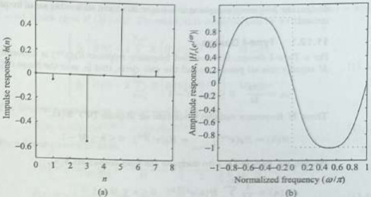{width=36%}  
Fig. 11.42 Responses of the FIR Hilbert transformer for Example 11.41 (a) Impulse response (b) Amplitude response  

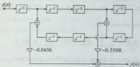{width=22%}  
Fig. 11.43 Linear-phase structure of the Hilbert transformer for Example 11.41  

# 11.12 FREQUENCY SAMPLING METHOD  

The frequency sampling method allows us to design FIR filters for both standard frequency selective filters and filters with arbitrary frequency response. In this method of FIR filter design, the specified frequency response $H_{d}(e^{j\omega})$ is uniformly sampled at $M$ equally spaced points $\omega_{k}$, $0 \leq k \leq M-1$, providing $M$ frequency samples $H(k) = H_{d}(e^{j\omega_{k}})$. These $M$ frequency samples constitute an $M$-point discrete Fourier transform (DFT) $H(k)$. The filter coefficients $h(n)$ can be obtained as the inverse DFT of the frequency samples. The general expression of the system function $H(z)$ is given by [Eq. (10.21)]  

$$
H ( z ) = \left( \frac { 1 - z ^{- M} } { M } \right) \sum _ { k = 0 } ^{M - 1} \frac { H ( k ) } { 1 - e ^{j \sqrt { M} } k ^{2} z ^{- 1} }
$$  

Two design techniques are available: Type-I design and Type-II design. In the type-I design, the set of frequency samples includes the sample at frequency $\omega = 0$. In Type-II  

 ---------------------------------------------[ 第48页 ]---------------------------------------------  

design, the frequency sample at $\omega=0$ is omitted and some other set of frequency samples is used.  

# 11.12.1 Type-I Design  

For a Type-I design, the specified frequency response $H_{d}(e^{j\omega})$ is uniformly sampled at $M$ equally spaced points around the unit circle, that is, over the range $0 \leq \omega < 2\pi$.  

$$
\omega _ { k } = \frac { 2 \pi k } { M }  0 \leq k \leq M - 1
$$  

These $M$ frequency samples constitute an $M$-point DFT $H(k)$.  

$$
H ( k ) = H _ { d } ( e ^{j \omega} ) \bigg | _ { \omega = \omega _ { k } } = H _ { d } ( e ^{j \frac { 2 \pi} { M } k } )  0 \leq k \leq M - 1
$$  

We can use inverse DFT to compute the filter coefficients $h(n)$,  

$$
h ( n ) = \frac { 1 } { M } \sum _ { k = 0 } ^{M - 1} H ( k ) e ^{j \frac { 3 \pi} { M } k n }  0 \leq n \leq M - 1
$$  

For a filter with real coefficients $h(n)$, the following symmetry conditions hold:  

$$
\begin{array}{rl} & { 1 . \ h ( n ) = h ^{*} ( n ) } \\& { 2 . \ H ( k ) = H ^{*} ( \langle - k \rangle _ { M } ) = H ^{*} ( M - k ) ,  e ^{j \frac { 2 \pi} { M } ( M - k ) } = e ^{- j \frac { 2 \pi} { M } k } } \end{array}
$$  

Therefore, we can write  

$$
\begin{aligned} h(n) & = \frac{1}{M} \sum_{k=0}^{M-1} H(k) e^{j \frac{2\pi}{M} k n} & 0 \leq n \leq M-1 \\h(n) & = \frac{1}{M} \left[ H(0) + H(1) e^{j \frac{2\pi}{M} n} + H(2) e^{j \frac{2\pi}{M} 2n} + \cdots + H(M-2)e^{-j \frac{2\pi}{M} 2n} \right. \\& \left. + H(M-1)e^{-j \frac{2\pi}{M} n} \right] \\& = \frac{1}{M} \left[ H(0) + H(1)e^{j \frac{2\pi}{M} n} + H(2)e^{j \frac{2\pi}{M} 2n} + \cdots + H^*(2)e^{-j \frac{2\pi}{M} 2n} \right. \\& \left. + H^*(1)e^{-j \frac{2\pi}{M} n} \right] \\& = \frac{1}{M} \left[ H(0) + \left( H(1)e^{j \frac{2\pi}{M} n} + H^*(1)e^{-j \frac{2\pi}{M} n} \right) \right. \\& + \left( H(2)e^{j \frac{2\pi}{M} 2n} + H^*(2)e^{-j \frac{2\pi}{M} 2n} \right) + \cdots \right] \end{aligned}
$$  

The DFT $H(k)$ occurs in complex conjugate pairs except the one at $k=0$, for $M$ odd, and the ones at $k=0$ and $k=\frac{M}{2}$, for $M$ even. Thus, we can write  

$$
h ( n ) = \left\{ \begin{array}{ll} { { \frac { 1 } { M } \left[ H ( 0 ) + 2 \sum _ { k = 1 } ^{\frac { M - 1} { 2 } } \Re \left[ H ( k ) e ^{j \frac { M} { 2 } k n } \right] \right] } } & { { M \ o d d } } \\{ { \frac { 1 } { M } \left[ H ( 0 ) + 2 \sum _ { k = 1 } ^{\frac { M} { 2 } - 1 } \Re \left[ H ( k ) e ^{j \frac { M} { 2 } k n } \right] \right] } } & { { M \ e v e n } } \end{array} \right.
$$  

The frequency samples can be expressed in the form  

$$
h ( n ) = \left\{ \begin{array}{ll} { { \frac { 1 } { M } \left[ H ( 0 ) + \sum _ { k = 1 } ^{\frac { M - 1} { 2 } } \left[ H ( k ) e ^{j \frac { 3 \pi} { 4 } k n } + H ^{*} ( k ) e ^{- j \frac { 3 \pi} { 4 } k n } \right] \right] } } & { { M \ o d d } } \\{ { \frac { 1 } { M } \left[ H ( 0 ) + H \left( \frac { M } { 2 } \right) + \sum _ { k = 1 } ^{\frac { M - 1} { 2 } - 1 } \left[ H ( k ) e ^{j \frac { 3 \pi} { 4 } k n } + H ^{*} ( k ) e ^{- j \frac { 3 \pi} { 4 } k n } \right] \right] } } & { { M \ e v e n } } \end{array} \right.
$$  

For a linear-phase FIR filter, the impulse response is symmetric, that is, $h(n) = h(M - 1 - n)$, which gives $H\left(\frac{M}{2}\right) = 0$. Therefore, this equation can be written as  

$$
H ( k ) = | H ( k ) | e ^{i 2 \angle H ( k )} = | H ( k ) | e ^{i \theta ( k )}
$$  

For a linear-phase FIR filter,  

$$
\begin{array}{rl} { \theta ( k ) = - \tau \omega | _ { \omega = 3 \pi k } = - \tau { \frac { 2 \pi } { M } } k = - \left( { \frac { M - 1 } { 2 } } \right) \left( { \frac { 2 \pi } { M } } k \right) } & { } \\{ \theta ( k ) = - \left( { \frac { M - 1 } { M } } \right) \pi k  0 \leq k \leq M - 1 } & { } \end{array}
$$  

We know that the magnitude response is an even function, that is,  

$$
| H ( k ) | = | H ( \langle - k \rangle _ { M } ) | = | H ( M - k ) |  0 \leq k \leq M - 1
$$  

and the phase response is an odd function, that is,  

$$
\vartheta ( k ) = - \theta ( \langle - k \rangle _ { M } ) = - \theta ( M - k )  0 \leq k \leq M - 1
$$  

Replacing $k$ by $M-k$ in Eq. (11.132), we get  

$$
\theta ( M - k ) = - \left( { \frac { M - 1 } { M } } \right) \pi ( M - k ) = - ( M - 1 ) \pi + \left( { \frac { M - 1 } { M } } \right) \pi k
$$  

Since phase response is an odd function, $\theta(k)$ for $M$ odd is given by  

$$
\theta ( k ) = \left\{ \begin{array}{ll} { { - \left( \frac { M - 1 } { M } \right) \pi k } } & { { 0 \leq k \leq \frac { M - 1 } { 2 } } } \\{ { ( M - 1 ) \pi - \left( \frac { M - 1 } { M } \right) \pi k } } & { { \frac { M + 1 } { 2 } \leq k \leq M - 1 } } \end{array} \right.
$$  

Similarly for $M$ even, we get  

$$
\theta ( k ) = \left\{ \begin{array}{ll} { { - \left( \frac { M - 1 } { M } \right) \pi k } } & { { 0 \leq k \leq \frac { M } { 2 } - 1 } } \\{ { 0 } } & { { k = \frac { M } { 2 } } } \\{ { ( M - 1 ) \pi - \left( \frac { M - 1 } { M } \right) \pi k } } & { { \frac { M } { 2 } + 1 \leq k \leq M - 1 } } \end{array} \right.
$$  

# Solution:  

Example 11.42 A low-pass digital filter has the desired frequency response as shown  

The ideal magnitude and phase responses with samples $M=7$ are shown in Fig. 11.44. The magnitude response and phase response of the given frequency response are given by  

$$
H _ { d } ( e ^{2 \pi} ) = \left\{ \begin{array}{ll} { { e ^{- j 3 \omega} } } & { { 0 \leq | \omega | \leq \frac { \pi } { 2 } } } \\{ { 0 } } & { { \frac { \pi } { 2 } < | \omega | \leq \pi } } \end{array} \right.
$$  

$$
| H _ { 4 } ( \sigma ^{2} ) | = \left\{ \begin{array}{ll} { 1 } & { 0 \leq \frac { 1 } { 3 } \leq \frac { 2 } { 3 } , } \\{ 0 } & { \frac { 2 } { 3 } < \frac { 2 } { 3 } \leq \frac { 2 } { 3 } , } \end{array} \right.
$$  

Determine the filter coefficients $h(n)$ for $M = 7$ using Type-I frequency sampling technique.  

In frequency sampling method, $|H_{d}(e^{j\omega})|$ is uniformly sampled at $M=7$ equally spaced points  

 ---------------------------------------------[ 第49页 ]---------------------------------------------  

around the unit circle, that is, over the range $0 \leq \omega < 2\pi$. The frequency samples are taken at intervals of $\omega_k = \frac{2\pi}{M}k$ for $0 \leq k \leq 6$, that is, at intervals of $\frac{2\pi}{7}$. Thus, the frequency samples as shown in Fig.11.44, are given by  

$$
| H ( k ) | = \left| H _ { d } ( e ^{j \omega} ) \right| _ { \omega = \omega _ { n } } = \left\{ \begin{array}{ll} { 1 } & { k = 0 , 1 , 6 } \\{ 0 } & { k = 2 , 3 , 4 , 5 } \end{array} \right.
$$  

From Eq. (11.134), we have  

$$
\theta ( k ) = \left\{ \begin{array}{ll} { { - \left( \frac { M - 1 } { M } \right) \pi k = - \frac { 6 \pi } { 7 } k } } & { { k = 0 , 1 , 2 , 3 } } \\{ { ( M - 1 ) \pi - \left( \frac { M - 1 } { M } \right) \pi k } } & { { k = 4 , 5 , 6 } } \\{ { = 6 \pi - \frac { 6 \pi } { 7 } k } } & { { } } \end{array} \right.
$$  

The sampled frequency response is given by  

$$
\begin{array}{rl} { H ( k ) = | H ( k ) | e ^{\beta \theta ( k )} = \left\{ \begin{array}{ll} { e ^{- j \frac { \pi} { T } k } } & { k = 0 , 1 } \\{ 0 } & { k = 2 , 3 , 4 , 5 } \\{ x ^{j} ( 6 \pi - \frac { \pi } { T } k ) } & { k = 6 } \end{array} \right. } & { } \\{ H ( k ) = \left\{ \begin{array}{ll} { e ^{- j \frac { \pi} { T } k } } & { k = 0 , 1 } \\{ 0 } & { k = 2 , 3 , 4 , 5 } \\{ e ^{- j \frac { \pi} { T } k } } & { k = 6 } \end{array} \right. } & { } \end{array}
$$  

The filter coefficients $h(n)$ are given by the inverse DFT.  

$$
\begin{aligned} & \left. \begin{array}{l} { { = \frac { 1 } { 7 } \sum _ { k = 0 } ^{6} H ( k ) e ^{j \frac { 2 \pi} { 7 } k n }  0 \leq n \leq 6 } } \\{ { = \frac { 1 } { 7 } \left[ H ( 0 ) + H ( 1 ) e ^{j \frac { 2 \pi} { 7 } n } + H ( 6 ) e ^{j \frac { 2 \pi} { 7 } 6 n } \right] } } \\{ { = \frac { 1 } { 7 } \left[ 1 + e ^{- j \frac { 4 \pi} { 7 } } e ^{j \frac { 2 \pi} { 7 } n } + e ^{- j \frac { 8 \pi} { 7 } 0 } e ^{j \frac { 2 \pi} { 7 } 6 n } \right] } } \\{ { = \frac { 1 } { 7 } \left[ 1 + e ^{j \frac { 2 \pi} { 7 } ( n - 3 ) } + e ^{j \frac { 2 \pi} { 7 } ( n - 3 ) } \right] } } \\{ { = \frac { 1 } { 7 } \left[ 1 + e ^{j \frac { 2 \pi} { 7 } ( n - 3 ) } + e ^{j \frac { 2 \pi} { 7 } ( n - 3 ) } \right] } } \\{ { + \underbrace { e ^{j 2 \pi ( n - 3 )} } _ { = 1 } e ^{- j \frac { 2 \pi} { 7 } ( n - 3 ) } } } \\{ { = \frac { 1 } { 7 } \left[ 1 + e ^{j \frac { 2 \pi} { 7 } ( n - 3 ) } + e ^{- j \frac { 2 \pi} { 7 } ( n - 3 ) } \right] } } \\{ { h ( n ) = \frac { 1 } { 7 } \left[ 1 + 2 \cos \left( \frac { 2 \pi } { 7 } ( n - 3 ) \right) \right]  0 \leq n \leq 6 } } \\{ { h ( 0 ) = h ( 6 ) = \frac { 1 } { 7 } \left[ 1 + 2 \cos \left( \frac { 6 \pi } { 7 } \right) \right] = - 0 . 11 46 } } \\{ { h ( 1 ) = h ( 5 ) = \frac { 1 } { 7 } \left[ 1 + 2 \cos \left( \frac { 4 \pi } { 7 } \right) \right] = 0 . 07 93 } } \\{ { h ( 2 ) = h ( 4 ) = \frac { 1 } { 7 } \left[ 1 + 2 \cos \left( \frac { 2 \pi } { 7 } \right) \right] = 0 . 32 1 , } } \\{ { h ( 3 ) = \frac { 1 } { 7 } [ 1 + 2 ] = \frac { 3 } { 7 } = 0 . 42 86 } } \end{aligned}
$$  

$$
h ( n ) = \frac { 1 } { M } \sum _ { k = 0 } ^{M - 2} H ( k ) e ^{j \frac { n} { k } k n }
$$  

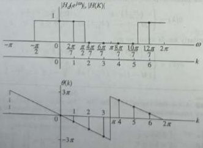{width=26%}  
Fig. 11.44 Ideal magnitude response and phase response of Example 11.42  

The frequency response of the designed filter is given by  

$$
\begin{aligned} & \left. + h ( 3 ) + h ( 2 ) e ^{- f \omega} + h ( 1 ) e ^{- f 2 \omega} \right. \\& \left. + h ( 0 ) e ^{- f 2 \omega} \right] \\& = e ^{- f 2 \omega} \left[ h ( 3 ) + 2 h ( 2 ) \cos \omega + 2 h ( 1 ) \cos 2 \omega \right. \\& \left. + 2 h ( 0 ) \cos 3 \omega \right] \\& H \left( e ^{f \omega} \right) = e ^{- f 2 \omega} \left[ 0 . 42 86 + 0 . 64 2 \cos \omega \right. \\& + \left. 0 . 15 86 \cos 2 \omega - 0 . 22 91 \cos 3 \omega \right] \end{aligned}
$$  

$$
\begin{aligned} H ( e ^{j \omega} ) & = \sum _ { n = 0 } ^{M - 1} h ( n ) e ^{- j \omega n} = \sum _ { n = 0 } ^{6} h ( n ) e ^{- j \omega n} \\& = h ( 0 ) + h ( 1 ) e ^{- j \omega} + h ( 2 ) e ^{- j 2 \omega} \\& + h ( 3 ) e ^{- j \omega} + h ( 4 ) e ^{- j 4 \omega} + h ( 5 ) e ^{- j \omega} \\& + h ( 6 ) e ^{- j \omega} \\& = e ^{- j 3 \omega} \left[ h ( 0 ) e ^{j 3 \omega} + h ( 1 ) e ^{j 2 \omega} + h ( 2 ) e ^{j \omega} \right] \end{aligned}
$$  

The magnitude response of the designed filter is shown in Fig. 11.45.  

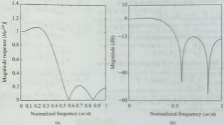{width=36%}  
Fig. 11.45 Magnitude response of a frequency sampled FIR LPF of Example 11.42  

With $\omega_{c}=\frac{5\pi}{9}$ and $\tau=\frac{M_{c}}{2}=4$, the desired frequency response is given by  

Example 11.43 A requirement exists for a linear-phase low-pass FIR filter satisfying the following specifications:  

1. Pass-band: $0-5\,\mathrm{KHz}$

2. Sampling frequency: $F_{T}=18\,\mathrm{KHz}$

3. Filter length: $M=9$  

$$
H _ { 4 } ( e ^{i \pi} ) = \left\{ \begin{array}{ll} { { e ^{- i \pi} } } & { { 0 \leq | w | \leq \frac { 5 } { 8 } } } \\{ { 0 } } & { { \frac { 5 } { 8 } \leq | w | < \frac { 5 } { 8 } } } \end{array} \right.
$$  

Determine the filter coefficients using Type-I frequency sampling method.  

The ideal magnitude and phase responses with samples $M=9$ are shown in Fig. 11-46. The magnitude response and phase response of the given frequency response are given by  

Solution:  

Given that $F_{\mathrm{L}}=5$ KHz and $F_{\mathrm{T}}=18$ KHz. The digital cut-off frequency is given by  

$$
| H _ { 2 } ( e ^{2 \pi} ) | = \left\{ \begin{array}{ll} { 1 } & { 0 \leq | \mu | \leq \frac { 3 \pi } { 8 } } \\{ 0 } & { \frac { 3 \pi } { 8 } < | \mu | \leq \pi ^{\prime} = - 4 \omega - \pi \leq \omega \leq \pi } \end{array} \right.
$$  

$$
\omega _ { c } = \frac { 2 \pi F _ { c } } { E _ { T } } = \frac { 2 \pi \times 5 \times 10 ^{3} } { 18 \times 10 ^{3} } = \frac { 5 \pi } { 9 }
$$  

In frequency sampling method, $|H_{d}(e^{j\omega})|$ is uniformly sampled at $M=9$ equally spaced points around the unit circle, that is, over the range $0\leq\omega<2\pi$. The frequency samples are taken at intervals  

 ---------------------------------------------[ 第50页 ]---------------------------------------------  

of $\omega_{k}=\frac{2\pi}{M}k$ for $0\leq k\leq8$, that is, at intervals of $\frac{2\pi}{9}$. Thus, the frequency samples as shown in Fig. 11.46 are given by  

$$
| B ( k ) | = | H _ { d } ( e ^{j \omega} ) | _ { \omega = \omega _ { s } } = \left\{ \begin{array}{ll} { 1 } & { k = 0 , 1 , 2 , 7 , 8 } \\{ 0 } & { k = 3 , 4 , 5 , 6 } \end{array} \right.
$$  

From Eq. (11.134), we have  

$$
\theta ( k ) = \left\{ \begin{array}{ll} { { - \left( \frac { M - 1 } { M } \right) \pi k = - \frac { 8 \pi } { 0 } k } } & { { k = 0 , 1 , 2 , 3 , 4 } } \\{ { ( M - 1 ) \pi - \left( \frac { M - 1 } { M } \right) \pi k } } & { { k = 5 , 6 , 7 , 8 } } \\{ { = 8 \pi - \frac { 8 \pi } { 0 } k } } & { { k = 5 , 6 , 7 , 8 } } \end{array} \right.
$$  

The sampled frequency response is given by  

$$
\begin{array}{rl} { H ( k ) = | H ( k ) | e ^{j \theta ( k )} = \left\{ \begin{array}{ll} { e ^{- j \frac { 3 \pi} { 5 } k } } & { k = 0 , 1 , 2 } \\{ 0 } & { k = 3 , 4 , 5 , 6 } \\{ e ^{j \left( B \pi - \frac { 3 \pi} { 5 } k \right) } } & { k = 7 , 8 } \end{array} \right. } & { k = 1 , 2 } \\{ H ( k ) = \left\{ \begin{array}{ll} { e ^{- j \frac { 3 \pi} { 5 } k } } & { k = 0 , 1 , 2 } \\{ 0 } & { k = 3 , 4 , 5 , 6 } \\{ e ^{- j \frac { 3 \pi} { 5 } k } } & { k = 7 , 8 } \end{array} \right. } & { k = 1 , 2 } \end{array}
$$  

$$
\begin{aligned} & = \frac { 1 } { 9 } \left[ H ( 0 ) + H ( 1 ) e ^{j \frac { 2 \pi} { 9 } n } + H ( 2 ) e ^{j \frac { 2 \pi} { 9 } 2 n } \right. \\& \left. + H ( 7 ) e ^{j \frac { 2 \pi} { 9 } 7 n } + H ( 8 ) e ^{j \frac { 2 \pi} { 9 } 8 n } \right] \\& = \frac { 1 } { 9 } \left[ 1 + e ^{- j \frac { 4 \pi} { 9 } } e ^{j \frac { 2 \pi} { 9 } n } + e ^{- j \frac { 8 \pi} { 9 } 2 } e ^{j \frac { 2 \pi} { 9 } 2 n } \right. \\& \left. + e ^{- j \frac { 4 \pi} { 9 } 7 } e ^{j \frac { 2 \pi} { 9 } 7 n } + e ^{- j \frac { 8 \pi} { 9 } 8 } e ^{j \frac { 2 \pi} { 9 } 8 n } \right] \\& = \frac { 1 } { 9 } \left[ 1 + e ^{j \frac { 2 \pi} { 9 } ( n - 4 ) } + e ^{j \frac { 4 \pi} { 9 } ( n - 4 ) } \right. \\& \left. + e ^{j \frac { 2 \pi} { 9 } 7 ( n - 4 ) } + e ^{j \frac { 2 \pi} { 9 } 8 ( n - 4 ) } \right] \\& = \frac { 1 } { 9 } \left[ 1 + e ^{j \frac { 2 \pi} { 9 } ( n - 4 ) } + e ^{j \frac { 4 \pi} { 9 } ( n - 4 ) } \right. \\& \left. + e ^{j \frac { 2 \pi} { 9 } ( n - 4 ) } e ^{- j \frac { 4 \pi} { 9 } ( n - 4 ) } \right. \\& = \frac { 1 } { 9 } \left[ 1 + e ^{j \frac { 2 \pi} { 9 } ( n - 4 ) } + e ^{j \frac { 4 \pi} { 9 } ( n - 4 ) } \right. \\& \left. + e ^{- j \frac { 4 \pi} { 9 } ( n - 4 ) } + e ^{- j \frac { 2 \pi} { 9 } ( n - 4 ) } \right] \\& = \frac { 1 } { 9 } \left[ 1 + \left( e ^{j \frac { 2 \pi} { 9 } ( n - 4 ) } + e ^{- j \frac { 2 \pi} { 9 } ( n - 4 ) } \right) \right. \\& \left. + \left( e ^{j \frac { 4 \pi} { 9 } ( n - 4 ) } + e ^{- j \frac { 4 \pi} { 9 } ( n - 4 ) } \right) \right. \\& \left. + \left( e ^{j \frac { 4 \pi} { 9 } ( n - 4 ) } + e ^{- j \frac { 4 \pi} { 9 } ( n - 4 ) } \right) \right] \end{aligned}
$$  

The filter coefficients $h(n)$ are given by the inverse DFT.  

$$
\begin{aligned} h ( n ) & = \frac { 1 } { M } \sum _ { k = 0 } ^{M - 1} H ( k ) e ^{j \frac { 2 \pi} { M } k n } \\& = \frac { 1 } { 9 } \sum _ { k = 0 } ^{8} H ( k ) e ^{j \frac { 2 \pi} { M } k n } & 0 \leq n \leq 8 \end{aligned}
$$  

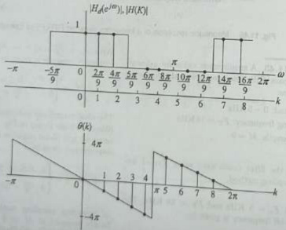{width=28%}  
Fig. 11.46 Ideal magnitude response and phase response of Example 11.43  

$$
\begin{aligned} h(n) & =\frac{1}{9}\left[1+2 \cos \left(\frac{2 \pi}{9}(n-4)\right) \right \\& +2 \cos \left(\frac{4 \pi}{9}(n-4)\right)\right] & 0 \leq n \leq 8 \\h(0) & =h(8)=\frac{1}{9}\left[1+2 \cos \left(\frac{3 \pi}{9}\right)+2 \cos \left(\frac{16 \pi}{9}\right)\right] \\& =0.0725 \\h(1) & =h(7)=\frac{1}{9}\left[1+2 \cos \left(\frac{6 \pi}{9}\right)+2 \cos \left(\frac{12 \pi}{9}\right)\right] \\& =-0.1111 \\h(2) & =h(6)=\frac{1}{9}\left[1+2 \cos \left(\frac{4 \pi}{9}\right)+2 \cos \left(\frac{8 \pi}{9}\right)\right] \\& =-0.0591 \\h(3) & =h(5)=\frac{1}{9}\left[1+2 \cos \left(\frac{2 \pi}{9}\right)+2 \cos \left(\frac{4 \pi}{9}\right)\right] \\& =0.3199 \\h(4) & =\frac{1}{9}[1+2+2]=\frac{5}{9}=0.5556 \end{aligned}
$$  

Determine the filter coefficients for $M=7$.  

Solution:  

Solution: Given that $F_{c1} = 1$ KHz, $F_{c2} = 3$ KHz, and $F_{T} = 8$ KHz. The digital cut-off frequencies are given by  

$$
\begin{array}{rl} { \omega _ { 1 } = { \frac { 2 \pi F _ { 1 } } { F _ { T } } } = { \frac { 2 \pi \times 1 \times 10 ^{3} } { 8 \times 10 ^{2} } } = { \frac { \pi } { 4 } } = 0 . 25 \pi , } \\{ \omega _ { 2 } = { \frac { 2 \pi F _ { 2 } } { F _ { T } } } = { \frac { 2 \pi \times 3 \times 10 ^{3} } { 8 \times 10 ^{3} } } = { \frac { 3 \pi } { 4 } } = 0 . 75 \pi } \end{array}
$$  

1. Sampling frequency $F_{T} = 8\,\mathrm{KHz}$

2. Cutoff frequencies $F_{c1} = 1\,\mathrm{KHz}$ and $F_{c2} = 3\,\mathrm{KHz}$  

With $\omega_{c1}=\frac{2}{4}$, $\omega_{c2}=\frac{3\pi}{4}$, and $\tau=\frac{M-1}{2}=3$, the desired frequency response is given by  

$$
H _ { d } ( e ^{i \omega} ) = \left\{ \begin{array}{ll} { { e ^{- j \omega} } } & { { \frac { 5 } { 4 } \leq | \omega | \leq \frac { 2 \pi } { 4 } } } \\{ { 0 } } & { { | \omega | < \frac { \pi } { 4 }  \mathrm { a n d }  \frac { 3 \pi } { 4 } < | \omega | \leq \pi } } \end{array} \right.
$$  

Example 11.44 Using frequency sampling method, design a BPF with the following specifications:  

The ideal magnitude and phase responses with samples $M=7$ are shown in Fig. 11.47. The magnitude response and phase response of the given frequency response are given by  

$$
\begin{array}{rl} { | H _ { 4 } ( e ^{2 \pi} ) | } & { { } } \\{ = \left\{ \begin{array}{ll} { 1 } & { \frac { \pi } { 4 } \leq | \omega | \leq \frac { 3 \pi } { 4 } } \\{ 0 } & { | \omega | < \frac { \pi } { 4 }  \mathrm { a n d } } \\{ 0 } & { \frac { 3 \pi } { 4 } < | \omega | \leq \pi } \end{array} \right. } & { { } } \end{array}
$$  

In frequency sampling method, $|H_{d}(\sigma^{2\pi})|$ is uniformly sampled at $M=7$ equally spaced points around the unit circle, that is over the range $0\leq\omega<2\pi$. The frequency samples are taken at  

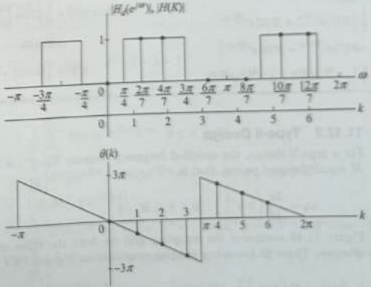{width=28%}  
Fig. 11.47 Ideal magnitude response and phase response of Example 11.44  

 ---------------------------------------------[ 第51页 ]---------------------------------------------  

intervals of $\omega_{k}=\frac{2\pi}{M}k$ for $0\leq k\leq6$, that is, at intervals of $\frac{2\pi}{7}$. Thus, the frequency samples as shown in Fig. 11.47 are given by  

$$
| H ( k ) | = \left| H _ { d } ( e ^{i \omega} ) \right| _ { \omega = \omega _ { k } } = \left\{ \begin{array}{ll} { { 1 } } & { { k = 1 , 2 , 5 , 6 } } \\{ { 0 } } & { { k = 0 , 3 , 4 } } \end{array} \right.
$$  

From Eq. (11.134), we have  

$$
\theta ( k ) = \left\{ \begin{array}{ll} { { - \left( \frac { M - 1 } { M } \right) \pi k = - \frac { 6 \pi } { 7 } k } } & { { k = 0 , 1 , 2 , 3 } } \\{ { ( M - 1 ) \pi - \left( \frac { M - 1 } { M } \right) \pi k } } & { { k = 4 , 5 , 6 } } \\{ { = 6 \pi - \frac { 6 \pi } { 7 } k } } & { { k = 4 , 5 , 6 } } \end{array} \right.
$$  

The sampled frequency response is given by  

$$
\begin{array}{rl} { H ( k ) = | H ( k ) | e ^{j \theta ( k )} = } & { { } \left\{ \begin{array}{ll} { e ^{- j \frac { 4 \pi} { 7 } k } } & { k = 1 , 2 } \\{ 0 } & { k = 0 , 3 , 4 } \\{ e ^{j \left( 6 \pi - \frac { 4 \pi} { 7 } k \right) } } & { k = 5 , 6 } \end{array} \right. } \\{ H ( k ) = } & { { } \left\{ \begin{array}{ll} { e ^{- j \frac { 4 \pi} { 7 } k } } & { k = 1 , 2 } \\{ 0 } & { k = 0 , 3 , 4 } \\{ e ^{- j \frac { 4 \pi} { 7 } k } } & { k = 5 , 6 } \end{array} \right. } \end{array}
$$  

The filter coefficients $h(n)$ are given by the inverse DFT.  

$$
\begin{aligned} h(n) & = \frac{1}{M} \sum_{k=0}^{M-1} H(k) e^{i \frac{2\pi}{T} k n} \\& = \frac{1}{7} \sum_{k=0}^{5} H(k) e^{i \frac{2\pi}{T} k n} & 0 \leq n \leq 6 \\& = \frac{1}{7} \left[ H(1) e^{i \frac{2\pi}{T} n} + H(2) e^{j \frac{2\pi}{T} 2 n} \\& + H(5) e^{i \frac{2\pi}{T} 5 n} + H(6) e^{j \frac{2\pi}{T} 0 n} \right] \\& = \frac{1}{7} \left[ e^{-j \frac{4\pi}{T} e^{j \frac{2\pi}{T} n} + e^{-j \frac{4\pi}{T} 2 e^{j \frac{2\pi}{T} 2 n}} \right] \end{aligned}
$$  

$$
\begin{aligned} & \left. + e ^{- j \frac { 2 \pi} { 7 } } 5 e ^{j \frac { 2 \pi} { 7 } } 5 n + e ^{- j \frac { 8 \pi} { 7 } } 6 e ^{j \frac { 2 \pi} { 7 } } 0 n \right] \\& = \frac { 1 } { 7 } \left[ e ^{j \frac { 2 \pi} { 7 } } ( n - 3 ) + e ^{j \frac { 4 \pi} { 7 } } ( n - 3 ) \right. \\& \left. + e ^{j \frac { 2 \pi} { 7 } } 5 ( n - 3 ) + e ^{j \frac { 2 \pi} { 7 } } 5 ( n - 3 ) \right] \\& = \frac { 1 } { 7 } \left[ e ^{j \frac { 2 \pi} { 7 } } ( n - 3 ) + e ^{j \frac { 4 \pi} { 7 } } ( n - 3 ) \right. \\& \left. + e ^{j \frac { 2 \pi} { 7 } } ( 7 - 2 ) ( n - 3 ) + e ^{j \frac { 2 \pi} { 7 } } ( 7 - 1 ) ( n - 3 ) \right] \\& = \frac { 1 } { 7 } \left[ e ^{j \frac { 2 \pi} { 7 } } ( n - 3 ) + e ^{j \frac { 4 \pi} { 7 } } ( n - 3 ) \right. \\& \left. + e ^{- j \frac { 4 \pi} { 7 } } ( n - 3 ) + e ^{- j \frac { 2 \pi} { 7 } } ( n - 3 ) \right] \\& = \frac { 1 } { 7 } \left[ \left( e ^{j \frac { 2 \pi} { 7 } } ( n - 3 ) + e ^{- j \frac { 2 \pi} { 7 } } ( n - 3 ) \right) \right. \\& \left. + \left( e ^{j \frac { 4 \pi} { 7 } } ( n - 3 ) + e ^{- j \frac { 4 \pi} { 7 } } ( n - 3 ) \right) \right] \\& h ( n ) = \frac { 1 } { 7 } \left[ 2 \cos \left( \frac { 2 \pi } { 7 } ( n - 3 ) \right) \right. \\& \left. + 2 \cos \left( \frac { 4 \pi } { 7 } ( n - 3 ) \right) \right]  0 \leq n \leq 6 \\& h ( 0 ) = h ( 6 ) = \frac { 1 } { 7 } \left[ 2 \cos \left( \frac { 6 \pi } { 7 } \right) + 2 \cos \left( \frac { 12 \pi } { 7 } \right) \right] \\& = - 0 . 07 93 \\& h ( 1 ) = h ( 5 ) = \frac { 1 } { 7 } \left[ 2 \cos \left( \frac { 4 \pi } { 7 } \right) + 2 \cos \left( \frac { 8 \pi } { 7 } \right) \right] \\& = - 0 . 32 1 \\& h ( 2 ) = h ( 4 ) = \frac { 1 } { 7 } \left[ 2 \cos \left( \frac { 2 \pi } { 7 } \right) + 2 \cos \left( \frac { 4 \pi } { 7 } \right) \right] \\& = 0 . 11 46 , \\& h ( 3 ) = \frac { 1 } { 7 } [ 2 + 2 ] = \frac { 4 } { 7 } = 0 . 57 14 \end{aligned}
$$  

# 11.12.2 Type-II Design  

for a type-II design, the specified frequency response $H_{d}(e^{j\omega})$ is uniformly sampled at $M$ equally spaced points, that is,  

$$
\omega _ { k } = \frac { 2 \pi } { M } \left( k + \frac { 1 } { 2 } \right)  0 \leq k \leq M - 1
$$  

Figure 11.48 compares the sampling grid for both the types of frequency sampling schemes. These $M$ frequency samples constitute an $M$-point DFT $H(k)$.  

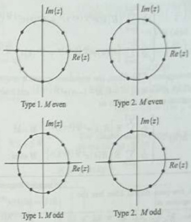{width=22%}  
Fig. 11.48 The four possible z-plane sampling grids for the two types of frequency sampling filters  

$$
\ddot { H } ( k ) = H \left( k + \frac { 1 } { 2 } \right) = H _ { d } ( e ^{j \omega} ) \bigg | _ { \omega = \omega _ { k } } = H _ { d } \left( e ^{j \frac { 2 \pi} { M } ( k + \frac { 1 } { 2 } ) } \right)  0 \leq k \leq M - 1
$$  

Taking $M$-point inverse DFT, we get  

$$
\tilde { h } ( n ) = h ( n ) e ^{- f \frac { \pi} { 2 } n }
$$  

For a filter with real coefficients $\bar{h}(n)$, the following symmetry conditions hold:  

$$
\begin{array}{rl} { 1 . } & { { } \tilde { h } ( n ) = \tilde { h } ^{*} ( n ) } \\{ 2 . } & { { } \tilde { h } ( n ) e ^{- j \, \vec { x} ^{n} } = \tilde { h } ^{*} ( n ) e ^{j \, \vec { x} ^{n} } } \\{ 3 . } & { { } \tilde { h } ( n ) = h ^{*} ( n ) e ^{j \, \vec { x} ^{n} } } \\{ 4 . } & { { } H ( k ) = H ^{*} ( \langle - k - 1 \rangle _ { M } ) = H ^{*} ( M - k - 1 ) } \end{array}
$$  

The filter coefficients are given by  

$$
\begin{aligned} h(n) & = \frac{1}{M} \sum_{k=0}^{M-1} H(k) e^{\frac{3 \pi}{2 (k+\frac{1}{2})^{n}}} & 0 \leq n \leq M-1 \\& = \frac{1}{M}\left[H(0) e^{\prime \frac{3}{2} \tilde{b}^{n}} + H(1) e^{\prime \frac{3}{2} \tilde{b}^{n}} + \cdots + H(M-2) e^{-\frac{3}{2} \tilde{b}^{n}} \right] \\& + H(M-1) e^{-\frac{3}{2} \tilde{b}^{n}} \\& = \frac{1}{M}\left[H(0) e^{\prime \frac{3}{2} \tilde{b}^{n}} + H(1) e^{\prime \frac{3}{2} \tilde{b}^{n}} + \cdots + H^{\ast}(1) e^{-\frac{3}{2} \tilde{b}^{n}} + H^{\ast}(0) e^{-\frac{3}{2} \tilde{b}^{n}} \right] \\& = \frac{1}{M}\left[(H(0) e^{\prime \frac{3}{2} \tilde{b}^{n}} + H^{\ast}(0) e^{-\prime \frac{3}{2} \tilde{b}^{n}}) +\left(H(1) e^{\prime \frac{3}{2} \tilde{b}^{n}} + H^{\ast}(1) e^{-\prime \frac{3}{2} \tilde{b}^{n}}\right) + \cdots\right] \\&  \text { for } M & \end{aligned}
$$  

The DFT $H(k)$ occurs in complex conjugate pairs except the one at $k=\frac{m-1}{2}$, for $M$ odd. Thus, we can write  

 ---------------------------------------------[ 第52页 ]---------------------------------------------  

$$
h ( n ) = \left\{ \begin{array}{ll} { \frac { 1 } { M } \sum _ { k = 0 } ^{\frac { M - 3} { 2 } } \left[ H ( k ) e ^{j \frac { 3 \pi} { 2 \pi } ( k + \frac { 1 } { 2 } ) ^{n} } + H ^{*} ( k ) e ^{- j \frac { 3 \pi} { 2 \pi } ( k + \frac { 1 } { 2 } ) } \right] + H \left( \frac { M - 1 } { 2 } \right) } & { M \mathrm { ~ o d d } } \\{ \frac { 3 } { M } \sum _ { k = 0 } ^{\frac { M - 3} { 2 } - 1 } \left[ H ( k ) e ^{j \frac { 3 \pi} { 2 \pi } ( k + \frac { 1 } { 2 } ) ^{n} } + H ^{*} ( k ) e ^{- j \frac { 3 \pi} { 2 \pi } ( k + \frac { 1 } { 2 } ) } \right] } & { M \mathrm { ~ e v e n } } \end{array} \right.
$$  

For a linear-phase FIR filter, the impulse response is symmetric, that is, $\hbar(n)=\hbar(M-1-n)$, which gives $h(n)=-\hbar(M-1-n)e^{i\frac{3\pi}{2}(n+\frac{1}{2})}$ and leads to $H\left(\frac{M-1}{2}\right)=0$. Therefore, this equation can be written as  

$$
h ( n ) = \left\{ \begin{array}{ll} { { \frac { 2 } { M } \sum _ { k = 0 } ^{\frac { M - 3} { 2 } } \Re \left[ H ( k ) e ^{j \frac { 2 \pi} { M } ( k + \frac { 1 } { 2 } ) n } \right] } } & { { M \ o d d } } \\{ { \frac { 2 } { M } \sum _ { k = 0 } ^{\frac { M - 1} { 2 } } \Re \left[ H ( k ) e ^{j \frac { 2 \pi} { M } ( k + \frac { 1 } { 2 } ) n } \right] } } & { { M \ e v e n } } \end{array} \right.
$$  

Example 11.45 A low-pass digital filter has the desired frequency response as  

$$
H _ { d } ( e ^{i \omega} ) = \left\{ \begin{array}{ll} { { e ^{- j 3 \omega} } } & { { 0 \leq \frac { | E | } { | E | } \leq \frac { \omega } { \omega _ { \mathrm { H } } } } } \\{ { 0 } } & { { 0 \leq \frac { | E | } { | E | } \leq \frac { \omega } { \omega _ { \mathrm { H } } } } } \end{array} \right.
$$  

Determine the filter coefficients $h(n)$ for $M = 7$ using Type-II frequency sampling technique.  

# Solution:  

The ideal magnitude and phase responses with samples $M=7$ are shown in Fig. 11.49. The magnitude response and phase response of the given frequency response are given by  

$$
| H _ { d } ( \tau ^{2 \omega} ) | = \left\{ \begin{array}{ll} { 1 } & { 0 \leq \frac { \omega } { 2 } \leq \frac { \pi } { 2 } , } \\{ 0 } & { \frac { \pi } { 2 } < \frac { \omega } { 2 } \leq \frac { \pi } { 2 } , } \end{array} \right.  \theta ( \omega ) = - 3 \omega
$$  

In frequency sampling method, $|H_{4}(e^{i\omega})|$ is uniformly sampled at $M=7$ equally spaced points around the unit circle, that is, over the range $0\leq\omega<2\pi$. In Type-II, the frequency samples are taken at intervals of $\omega_{k}=\frac{2\pi}{M}\left(k+\frac{1}{2}\right)$ for $0\leq k\leq6$, that is, at intervals of $\frac{2\pi}{\gamma}$. Thus, the frequency samples as shown in Fig. 11.49 are given by  

$$
| H ( k ) | = | H _ { d } ( e ^{j k} ) | \underset { \longrightarrow , \, \longrightarrow } { = } \left\{ \begin{array}{ll} { 1 } & { k = 0 , 1 , 5 , 6 } \\{ 0 } & { k = 2 , 3 , 4 } \end{array} \right.
$$  

The samples of the phase response are given by  

$$
\theta ( k ) = \left\{ \begin{array}{ll} { { - \frac { ( \frac { M } { M } - 1 ) } { \pi } = ( k + \frac { 1 } { 2 } ) } } & { { k = 0 , 1 ; 2 ; 3 } } \\{ { = - \frac { 9 \pi } { 7 } \left( k + \frac { 1 } { 2 } \right) } } & { { k = 0 , 1 ; 2 ; 3 } } \\{ { ( \frac { M } { M } - 1 ) \pi - ( \frac { M } { M } - 1 ) \pi } } & { { k = 4 , 5 ; 6 } } \\{ { ( k + \frac { 1 } { 2 } ) = 6 \pi - \frac { 6 \pi } { 7 } \left( k + \frac { 1 } { 2 } \right) } } & { { k = 4 , 5 ; 6 } } \end{array} \right.
$$  

The sampled frequency response is given by  

$$
\begin{array}{rl} { H ( k ) = | H ( k ) | e ^{j \theta ( k )} } & { { } } \\{ = { \left\{ \begin{array}{ll} { e ^{- j { \frac { 4 \pi} { 7 } } ( k + { \frac { 1 } { 2 } } ) } } & { k = 0 , 1 } \\{ 0 } & { k = 2 , 3 , 4 } \\{ e ^{j ( 6 \pi - { \frac { 4 \pi} { 7 } } ( k + { \frac { 1 } { 2 } } ) ) } } & { k = 5 , 6 } \end{array} \right. } } & { { } } \\{ H ( k ) = { \left\{ \begin{array}{ll} { e ^{- j { \frac { 4 \pi} { 7 } } ( k + { \frac { 1 } { 2 } } ) } } & { k = 0 , 1 } \\{ 0 } & { k = 2 , 3 , 4 } \\{ e ^{- j { \frac { 4 \pi} { 7 } } ( k + { \frac { 1 } { 2 } } ) } } & { k = 5 , 6 } \end{array} \right. } } & { { } } \end{array}
$$  

The filter coefficients $h(n)$ are given by the inverse DFT.  

$$
\begin{aligned} & \left. + e ^{j 2 \pi ( n - 3 )} e ^{- j \frac { 3 \pi} { 7 } ( n - 3 ) } \right. \\& \left. + e ^{2 \pi ( n - 3 )} e ^{- j \frac { 5} { 7 } ( n - 3 ) } \right] \\& = \frac { 1 } { 7 } \left[ e ^{j \frac { 5} { 7 } ( n - 3 ) } + e ^{j \frac { 3 \pi} { 7 } ( n - 3 ) } \right. \\& \left. + e ^{- j \frac { 4 \pi} { 7 } ( n - 3 ) } + e ^{- j \frac { 5} { 7 } ( n - 3 ) } \right] \\& = \frac { 1 } { 7 } \left[ \left( e ^{j \frac { 5} { 7 } ( n - 3 ) } + e ^{- j \frac { 5} { 7 } ( n - 3 ) } \right) \right. \\& \left. + \left( e ^{j \frac { 3 \pi} { 7 } ( n - 3 ) } + e ^{- j \frac { 5} { 7 } ( n - 3 ) } \right) \right] \\& h ( n ) = \frac { 2 } { 7 } \left[ \cos \left( \frac { \pi } { 7 } ( n - 3 ) \right) \right. \\& \left. + \cos \left( \frac { 3 \pi } { 7 } ( n - 3 ) \right) \right]  0 \leq n \leq 6 \end{aligned}
$$  

$$
\begin{aligned} h(n) & = \frac{1}{M} \sum_{k=0}^{M-1} H(k) e^{j \frac{2\pi}{M}}(k+\frac{1}{2}) n \\& = \frac{1}{7} \sum_{k=0}^{6} H(k) e^{j \frac{2\pi}{T}}(k+\frac{1}{2}) n & 0 \leq n \leq 6 \\& = \frac{1}{7} \left[ H(0) e^{j \frac{2\pi}{T} n} + H(1) e^{j \frac{2\pi}{T} n} \right. \\& \left. + H(5) e^{j \frac{1}{4} \frac{\pi}{T} n} + H(6) e^{j \frac{12\pi}{T} n} \right] \\& = \frac{1}{7} \left[ e^{-j \frac{2\pi}{T}} e^{j \frac{1}{T} n} + e^{-j \frac{8\pi}{T}} e^{j \frac{2\pi}{T} n} \right. \\& \left. + e^{-j \frac{2\pi}{T}} e^{j \frac{1}{T} n} + e^{-j \frac{3\pi}{T}} e^{j \frac{2\pi}{T} n} \right] \\& = \frac{1}{7} \left[ e^{j \frac{5}{T}(n-3)} + e^{j \frac{3}{T}(n-3)} \right. \\& \left. + e^{j \frac{4}{T} \frac{5}{(n-3)} + e^{j \frac{13}{T} (n-3)} \right. \\& = \frac{1}{7} \left[ e^{j \frac{5}{T}(n-3)} + e^{j \frac{4}{T} (n-3)} \right. \\& \left. + e^{j \frac{4}{T} \frac{5}{(n-3)} (n-3)} + e^{j \frac{13}{T} (n-3)} \right. \end{aligned}
$$  

$$
\begin{aligned} h ( 0 ) & = h ( 6 ) = \frac { 2 } { 7 } \left[ \cos \left( \frac { 3 \pi } { 7 } \right) + \cos \left( \frac { 9 \pi } { 7 } \right) \right] \\& = - 0 . 11 46 \\h ( 1 ) & = h ( 5 ) = \frac { 2 } { 7 } \left[ \cos \left( \frac { 2 \pi } { 7 } \right) + \cos \left( \frac { 6 \pi } { 7 } \right) \right] \\& = - 0 . 07 93 \\h ( 2 ) & = h ( 4 ) = \frac { 2 } { 7 } \left[ \cos \left( \frac { \pi } { 7 } \right) + \cos \left( \frac { 3 \pi } { 7 } \right) \right] = 0 . 32 1 , \\h ( 3 ) & = \frac { 2 } { 7 } [ 1 + 1 ] = \frac { 4 } { 7 } = 0 . 57 14 \end{aligned}
$$  

The magnitude response of the designed filter is shown in Fig. 11.50.  

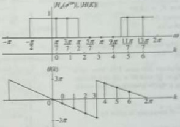{width=23%}  
Fig. 11.49 Ideal magnitude response and phase response of Example 11.45  

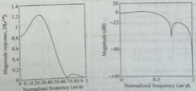{width=32%}  
Fig. 11.50 Magnitude response of a frequency sampled FIR LPF of Example 11.45  

 ---------------------------------------------[ 第53页 ]---------------------------------------------  

# 11.12.3 Transition-band Optimization  

The ripple in the magnitude response, which is evident in Figs 11.45 and 11.50, is caused by the abrupt transition from pass-band to stop-band in the desired magnitude response. This problem is similar to that of the rectangular window. We recall that the trade-off involved in using a window to reduce ripple is a wider transition band. To reduce the ripples at the expanse of a wider transition band, we can introduce frequency samples in the transition band. This increase in the width of the transition band has the effect of improving the pass-band ripple and stop-band attenuation as can be seen from the following example.  

Example 11.46 (a) Using frequency sampling method, design a linear-phase low-pass FIR filter with the following specifications:  

1. Cut-off frequency $F_{c} = 2\,\text{KHz}$

2. Sampling frequency $F_{T} = 8\,\text{KHz}$

3. Filter length $M = 15$  

(b) Repeat part (a) by inserting a single transition-band sample $|H(k)| = 0.5$.  

(a) Design a linear-phase low-pass FIR filter with cut-off frequency $F_{c}=\frac{P_{2}}{4}$ and $M=15$. (b) Repeat part (a) by inserting a single transition-band sample $|H(k)|=0.5$.  

Solution:  

(a) The digital cut-off frequency is given by  

$$
\omega _ { c } = \frac { 2 \pi F _ { c } } { F _ { T } } = \frac { \pi } { 2 } = 0 . 5 \pi
$$  

With $\omega_{c}=\frac{\pi}{2}$ and $\tau=\frac{M-1}{2}=7$, the desired frequency response is given by  

From Eq. (11.134), we have  

$$
H _ { 4 } ( e ^{2 \mu} ) = \left\{ \begin{array}{ll} { { e ^{- 2 \mu} } } & { { 0 } } \\{ { 0 } } & { { \frac { \mu } { 2 } \leq \frac { 1 } { 2 } \leq \frac { 1 } { 2 } } } \\{ { \frac { \mu } { 2 } \leq \frac { 1 } { 2 } \leq \frac { 1 } { 2 } } } & { { 0 } } \end{array} \right.
$$  

The magnitude response and the phase response of the given frequency response are given by  

$$
= { \left\{ \begin{array}{ll} { 1 } & { k = 0 , 1 , 2 , 3 , 12 , 13 , 14 } \\{ 0 } & { k = 4 , 5 , 6 , 7 , 8 , 9 , 10 , 11 } \end{array} \right. }
$$  

$$
\left| H ( t ) \right| = \left| H _ { d } ( e ^{2 t} ) \right| _ { t = t _ { d } }
$$  

In frequency sampling method, $|H_{d}(e^{j\omega})|$ is uniformly sampled at $M=15$ equally spaced points around the unit circle, that is, over the range $0\leq\omega<2\pi$. The frequency samples are taken at intervals of $\omega_{k}=\frac{2\pi}{3}k$ for $0\leq k\leq14$, that is, at intervals of $\frac{\gamma}{15}$. Thus the frequency samples are given by  

$$
| H _ { d } ( e ^{2 \pi} ) | = \left\{ \begin{array}{ll} { 1 } & { 0 \leq \frac { \pi } { 2 } \leq \frac { \pi } { 2 } , } \\{ 0 } & { \frac { \pi } { 2 } \leq \frac { \pi } { 2 } \leq \frac { \pi } { 2 } , } \end{array} \right.  \theta ( \omega ) = - 7 \omega
$$  

$$
\theta ( k ) = \left\{ \begin{array}{ll} { { - \left( \frac { M - 1 } { M } \right) \pi k = - \frac { 34 \pi } { 15 } k } } & { { k = 0 , 1 , 2 , 3 , 4 , } } \\{ { ( M - 1 ) \pi - \left( \frac { M - 1 } { M } \right) \pi k } } & { { k = 8 , 9 , 10 , 11 , } } \\{ { = 14 \pi - \frac { 34 \pi } { 15 } k } } & { { 12 , 13 , 14 } } \end{array} \right.
$$  

The sampled frequency response is given by  

The magnitude response of the designed filter is shown in Fig. 11.51.  

$$
\begin{array}{rl} { H ( k ) = | H ( k ) | e ^{J \theta ( k )} } & { } \\{ = \left\{ \begin{array}{ll} { e ^{- j \frac { 14 \pi} { 15 } k } } & { k = 0 , 1 , 2 , 3 } \\{ 0 } & { k = 4 , 5 , 6 , 7 , 8 , 9 , 10 , 11 } \\{ e ^{j ( 14 \pi - \frac { 14 \pi} { 15 } k ) } } & { k = 12 , 13 , 14 } \end{array} \right. } \\{ H ( k ) = \left\{ \begin{array}{ll} { e ^{- j \frac { 14 \pi} { 15 } k } } & { k = 0 , 1 , 2 , 3 } \\{ 0 } & { k = 4 , 5 , 6 , 7 , 8 , 9 , 10 , 11 } \\{ e ^{- j \frac { 14 \pi} { 25 } k } } & { k = 12 , 13 , 14 } \end{array} \right. } & \end{array}
$$  

$$
\begin{aligned} & \left. + 2 R \left[ e ^{- t \frac { \pi} { 15 } } e ^{t \frac { \pi} { 15 } } n \right] \right| \\& = \frac { 1 } { 15 } \left[ 1 + 2 R \left[ e ^{t \frac { \pi} { 15 } ( n - \tau ) } \right] + 2 R \left[ e ^{t \frac { \pi} { 15 } ( n - \tau ) } \right] \right. \\& \left. + 2 R \left[ e ^{t \frac { \pi} { 15 } ( n - \tau ) } \right] \right) \\h ( n ) = \frac { 1 } { 15 } \left[ 1 + 2 \cos \left( \frac { 2 \pi } { 15 } ( n - \tau ) \right) \right. \\& \left. + 2 \cos \left( \frac { 4 \pi } { 15 } ( n - \tau ) \right) + 2 \cos \left( \frac { 6 \pi } { 15 } ( n - \tau ) \right) \right. \end{aligned}
$$  

The filter coefficients $h(n)$ are given by the inverse DFT.  

(b) the frequency samples are given by  

$$
\begin{aligned} h ( n ) & = \frac { 1 } { M } \sum _ { k = 0 } ^{M - 1} H ( k ) e ^{j \frac { 2 \pi} { k } k n } \\& = \frac { 1 } { M } \left[ H ( 0 ) + 2 \sum _ { k = 1 } ^{M - 2} \Re \left[ H ( k ) e ^{j \frac { 2 \pi} { k } k n } \right] \right] \\& = \frac { 1 } { 15 } \left[ H ( 0 ) + 2 \sum _ { k = 1 } ^{7} \Re \left[ H ( k ) e ^{j \frac { 2 \pi} { k } k n } \right] \right] \\& = \frac { 1 } { 15 } \left[ H ( 0 ) + 2 \Re \left[ H ( 1 ) e ^{j \frac { 2 \pi} { k } k n } \right] \right. \\& \left. + 2 \Re \left[ H ( 2 ) e ^{j \frac { 2 \pi} { k } k n } \right] + 2 \Re \left[ H ( 3 ) e ^{j \frac { 2 \pi} { k } k n } \right] \right] \\& = \frac { 1 } { 15 } \left[ 1 + 2 \Re \left[ e ^{- j \frac { 4 \pi} { k ^{2} } k ^{2} } e ^{j \frac { 4 \pi} { k ^{2} } k n } \right] \right. \\& \left. + 2 \Re \left[ e ^{- j \frac { 4 \pi} { k ^{2} } k ^{2} } e ^{j \frac { 4 \pi} { k ^{2} } k n } \right] \right. \end{aligned}
$$  

$$
\left| H ( k ) \right| = \left\{ \begin{array}{ll} { 1 } & { k = 0 , 1 , 2 , 3 , 12 , 13 , 14 } \\{ 0 . 5 } & { k = - 4 , 11 } \\{ 0 } & { k = 5 , 6 , 7 , 8 , 9 , 10 } \end{array} \right.
$$  

$$
\begin{array}{rl} & { h ( 0 ) = h ( 14 ) = - 0 . 04 98 ,  h ( 4 ) = h ( 10 ) = - 0 . 10 79 } \\& { h ( 1 ) = h ( 13 ) = 0 . 04 12 ,  h ( 5 ) = h ( 9 ) = 0 . 03 41 } \\& { h ( 2 ) = h ( 12 ) = 0 . 06 67 ,  h ( 6 ) = h ( 8 ) = 0 . 31 89 } \\& { h ( 3 ) = h ( 11 ) = - 0 . 03 65 ,  h ( 7 ) = 0 . 46 67 } \end{array}
$$  

From Eq. (11.134), we have  

$$
\theta ( k ) = \left\{ \begin{array}{ll} { { - ( \frac { M - 1 } { 2 ^{k} } ) * k = - \frac { 1 } { 12 } k } } & { { k = 0 , 1 , 2 , 3 , } } \\{ { ( M - 1 ) * - ( \frac { M - 1 } { 12 } ) } } & { { k = 8 , 9 , 10 , } } \\{ { * k = 14 k - \frac { 1 } { 12 } k } } & { { 11 , 12 , 13 , 14 } } \end{array} \right.
$$  

The frequency response is given by  

The sampled frequency response is given by  

$$
H ( k ) = H ( k ) e ^{i \phi ( k )}
$$  

$$
\begin{aligned} H ( e ^{j \omega} ) & = \sum _ { n = 0 } ^{M - 1} h ( n ) e ^{- j \omega n} = \sum _ { n = 0 } ^{54} h ( n ) e ^{- j \omega n} \\& = e ^{- j \tau \omega} \left[ h ( 7 ) + 2 h ( 0 ) \cos 7 \omega t + 2 h ( 1 ) \cos 6 \omega \right] \\& + 2 h ( 2 ) \cos 5 \omega + 2 h ( 3 ) \cos 4 \omega \\& + 2 h ( 4 ) \cos 3 \omega + 2 h ( 5 ) \cos 2 \omega + 2 h ( 6 ) \cos \omega \right] \\H ( e ^{j \omega} ) & = e ^{- j \tau \omega} \left[ 0 . 46 67 - 0 . 09 96 \cos 7 \omega \right] \\& + 0 . 08 24 \cos 6 \omega + 0 . 13 33 \cos 5 \omega \\& - 0 . 07 30 \cos 4 \omega - 0 . 21 57 \cos 3 \omega \\& + 0 . 06 82 \cos 2 \omega + 0 . 62 78 \cos \omega \right] \end{aligned}
$$  

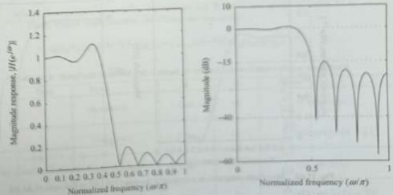{width=38%}  

Fig. 11.51 Magnitude response of a frequency sampled FIR LPF of Example 11.46(a)  

 ---------------------------------------------[ 第54页 ]---------------------------------------------  

The filter coefficients $h(n)$ are given by the inverse DFT.  

$$
\begin{aligned} h(n) & = \frac{1}{M} \sum_{k=0}^{M-1} H(k) e^{i \frac{2\pi}{M} k n} \\& = \frac{1}{M} \left[ H(0) + 2 \sum_{k=1}^{\frac{M-1}{2}} \Re \left[ H(k) e^{i \frac{2\pi}{M} k n} \right] \right] \\& = \frac{1}{15} \left[ H(0) + 2 \sum_{k=1}^{\frac{7}{2}} \Re \left[ H(k) e^{i \frac{2\pi}{M} k n} \right] \right] \\& = \frac{1}{15} \left[ H(0) + 2 \Re \left[ H(1) e^{i \frac{2\pi}{M} n} \right] \right. \\& \left. + 2 \Re \left[ H(2) e^{i \frac{2\pi}{M} 2n} \right] + 2 \Re \left[ H(3) e^{i \frac{2\pi}{M} 3n} \right] \right. \\& \left. + 2 \Re \left[ H(4) e^{i \frac{2\pi}{M} 4n} \right] \right] \\& = \frac{1}{15} \left[ 1 + 2 \Re \left[ e^{i \frac{2\pi}{M} (n - 7)} \right] + 2 \Re \left[ e^{i \frac{2\pi}{M} (n - 7)} \right. \right. \\& \left. + 2 \Re \left[ e^{i \frac{2\pi}{M} (n - 7)} \right] + \Re \left[ e^{i \frac{2\pi}{M} (n - 7)} \right] \right. \\& h(n) = \frac{1}{15} \left[ 1 + 2 \cos \left( \frac{2\pi}{15} (n - 7) \right) \right. \\& \left. + 2 \cos \left( \frac{4\pi}{15} (n - 7) \right) + 2 \cos \left( \frac{6\pi}{15} (n - 7) \right) \right. \\& \left. + \cos \left( \frac{8\pi}{15} (n - 7) \right) \right] \end{aligned}
$$  

$$
\begin{array}{rl} { h ( 0 ) = h ( 14 ) = - 0 . 00 52 , } & { h ( 4 ) = h ( 10 ) = - 0 . 08 73 } \\{ h ( 1 ) = h ( 13 ) = - 0 . 01 27 , } & { h ( 5 ) = h ( 9 ) = - 0 . 03 11 } \\{ h ( 2 ) = h ( 12 ) = 0 . 03 33 , } & { h ( 6 ) = h ( 8 ) = 0 . 31 19 } \\{ h ( 3 ) = h ( 11 ) = 0 . 02 44 , } & { h ( 7 ) = 0 . 53 33 } \end{array}
$$  

The frequency response is given by  

$$
\begin{aligned} H \left( e ^{j \omega} \right) & = \sum _ { n = 0 } ^{M - 1} h ( n ) e ^{- j \omega n} = \sum _ { n = 0 } ^{14} h ( n ) e ^{- j \omega n} \\& = e ^{- j 7 \omega} \left[ h ( 7 ) + 2 h ( 0 ) \cos 7 \omega + 2 h ( 1 ) \cos 6 \omega \right. \\& \left. + 2 h ( 2 ) \cos 5 \omega + 2 h ( 3 ) \cos 4 \omega \right. \\& \left. + 2 h ( 4 ) \cos 3 \omega + 2 h ( 5 ) \cos 2 \omega \right. \\& + 2 h ( 6 ) \cos \omega \right] \\H \left( e ^{j \omega} \right) & = e ^{- j 7 \omega} \left[ 0 . 53 33 - 0 . 01 04 \cos 7 \omega \right. \\& - 0 . 02 55 \cos 6 \omega + 0 . 06 67 \cos 5 \omega \right. \\& + 0 . 04 88 \cos 4 \omega - 0 . 17 45 \cos 3 \omega \right. \\& - 0 . 06 23 \cos 2 \omega + 0 . 62 38 \cos \omega \right] \end{aligned}
$$  

The magnitude response of the designed filter is shown in Fig. 11.52. Comparing Fig. 11.51 with Fig. 11.52, we see that by inserting a transition-band sample, we have increased the stop-band attenuation from 15 dB to 29.5 dB. The pass-band ripple has also been reduced.  

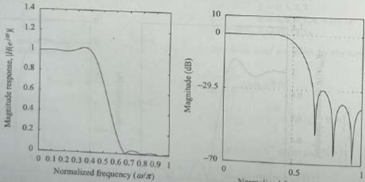{width=36%}  
Fig. 11.52 Magnitude response of a frequency sampled FIR LPF of Example 11.46 (b)  

# 11.13 OPTIMAL METHOD  

The FIR filter design methods discussed so far all involve optimization. The frequency-sampling method uses optimal placements of transition-band samples to maximize the stop-band attenuation. The windowing method (with a rectangular window) minimizes the mean-squared error. Note that a small mean-squared error does not preclude the possibility of large errors at individual frequencies. For example, in the window method, the approximation error (i.e., the difference between the ideal response and the desired response) is not uniformly distributed over the band intervals. The approximation error (peak pass-band ripple) is higher near the band edges and decreases away from the band edges.  

If the ripples were distributed more evenly over the pass-band and stop-band, a better approximation of the desired frequency response can be achieved. By distributing the error uniformly, we can obtain a lower-order filter, satisfying the same specifications. In this section, we examine an optimization technique that is based on minimizing the maximum value of the error within the pass-band and stop-band. It is viewed as an optimum design criterion in the sense that the weighted approximation error is spread evenly across both the pass-band and the stop-band of the filter, minimizing the maximum error (sometimes called the minimax or the Chebyshev error). Filters that have this property are called equiripple filters because the approximation error is uniformly distributed in both the pass-band and the stop-band. This results in lower-order filters.  

# 11.13.1 Minimax Criterion  

In Section 11.3, we showed that the frequency response of the four cases of linear-phase FIR filters can be written in the form  

$$
H ( e ^{2 \omega} ) = e ^{i \theta ( \omega )} H _ { r } ( e ^{i \omega} ) = e ^{i \left( \beta - \frac { H _ { r} } { c ^{2} } - \omega \right) } H _ { r } ( e ^{i \omega} )
$$  

where the values for $\beta$ and the expressions for $H_{r}(e^{j\omega})$ are given in Table 11.9. Using simple trigonometric identities, we can write  

$$
H ( e ^{2 \omega} ) = e ^{i ( \beta - \frac { M - 1} { 2 } \omega ) } H _ { r } ( e ^{2 \omega} ) = e ^{j ( \beta - \frac { M - 1} { 2 } \omega ) } Q ( \omega ) P ( \omega )
$$  

Amplitude response and $\beta$ values of the four types of linear-phase sequences   

| Type | h(n) | M | $β$ | $H e (e ∫ ω )$ |
| --- | --- | --- | --- | --- |
| 1 | Symmetric | Odd | 0 | $[1,2]a(k)cos(kω)$ |
| 2 | Symmetric | Even | 0 | $[1,2]b(k)cos[ω(k-1/2)]$ |
| 3 | Antisymmetric | Odd | $1/2$ | $[1,2]c(k)sin(kω)$ |
| 4 | Antisymmetric | Even | $1/2$ | $[1,2]d(k)sin[ω(k-1/2)]$ |  

 ---------------------------------------------[ 第55页 ]---------------------------------------------  

Table 11.10 $Q(\omega)$, $L$, and $P(\omega)$ for linear-phase FIR filters   

| Linear-phase FIR filter type | $Q(ω)$ | L | $P(ω)$ |
| --- | --- | --- | --- |
| Type-1 | 1 | $M-1/2$ | $∑k=0 a(k)cosωk$ |
| Type-2 | $cos Φ/2$ | $M/2-1$ | $∑k=0 b(k)cosωk$ |
| Type-3 | $sin ω$ | $M-3/2$ | $∑k=0 c(k)cosωk$ |
| Type-4 | $sin Φ/2$ | $M/2-1$ | $∑k=0 d(k)cosωk$ |  

Thus, the amplitude response for all the four types of linear-phase FIR filters can be expressed as  

$$
H _ { r } ( e ^{j \omega} ) = Q ( \omega ) P ( \omega )
$$  

where $Q(\omega)$ is a fixed function of $\omega$ and $P(\omega)$ is a sum of cosines as shown in Table 11.10. $P(\omega)$ is of the form  

$$
P ( \omega ) = \sum _ { k = 0 } ^{L} \alpha ( k ) \cos \omega k
$$  

The purpose of this analysis is to have a common form for $H_{r}(e^{j\omega})$ across all the four types of linear-phase FIR filters. It makes the problem formulation much easier.  

To formulate our problem as a minimax optimization (Chebyshev approximation) problem, we define the desired amplitude response $H_{dr}(e^{j\omega})$ and a weighing function $W(\omega)$, both defined over pass-bands and stop-bands. The weighing function is necessary so that we can have an independent control over $\delta_p$ and $\delta_s$. The weighted error is defined as  

$$
E ( \omega ) \triangleq W ( \omega ) \left[ H _ { d r } ( e ^{i \omega} ) - H _ { r } ( e ^{j \omega} ) \right] ,  \omega \in R \triangleq [ 0 , \omega _ { p } ] \cup [ \omega _ { s } , \pi ]
$$  

Figure 11.53(a) shows a typical equiripple filter response along with its ideal response. The error $\left[H_{dr}(e^{j\omega})-H_{r}(e^{j\omega})\right]$ response is shown in Fig. 11.53(b). The weighing function $W(\omega)$ is chosen as  

$$
W ( \omega ) = \left\{ \begin{array}{ll} { { \frac { \delta _ { t } } { \delta _ { r } } } } & { { \mathrm { i n ~ t h e ~ p a s s b a n d } } } \\{ { 1 } } & { { \mathrm { i n ~ t h e ~ s t o p b a n d } } } \end{array} \right.
$$  

The weighted error $E(\omega)$ response is shown in Fig. 11.53(c). The weighted error $E(\omega)$ has the same maximum error, equal to $\delta_{s}$, in both the pass-band and the stop-band. Therefore, if we succeed in minimizing the maximum weighted error, we automatically satisfy the specification in the pass-band. Substituting $H_{r}(e^{j\omega})$ from Eq. (11.141) into Eq. (11.143), we obtain  

$$
E ( \omega ) = W ( \omega ) \left[ H _ { d r } ( e ^{2 \omega} ) - Q ( \omega ) P ( \omega ) \right] = W ( \omega ) Q ( \omega ) \left[ \frac { H _ { d r } ( e ^{j \omega} ) } { Q ( \omega ) } - P ( \omega ) \right]
$$  

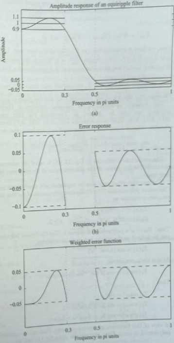{width=28%}  
The image contains a single character: 1  

 ---------------------------------------------[ 第56页 ]---------------------------------------------  

If we define  

$$
\tilde { W } ( \omega ) = W ( \omega ) Q ( \omega )  \mathrm { a n d }  \hat { H } _ { \omega ^{\prime} } ( \omega ) = \frac { H _ { d r } ( e ^{2 \omega} ) } { Q ( \omega ) } .
$$  

the we obtain  

$$
E ( \omega ) = \tilde { W } ( \omega ) \left[ \hat { H } _ { d r } ( \omega ) - P ( \omega ) \right] ,  \omega \in R
$$  

Thus, we have a common form of $E(\omega)$ for all the four cases. Let the peaks of $E(\omega)$ be at $\omega=\omega_{s}$, $0\leq i\leq L+1$, where $\frac{dE(\omega)}{d\omega}=0$. Since in the pass-band and the stop-band, $\hat{W}(\omega)$ and $\hat{H}_{dr}(\omega)$ are piecewise constant, it follows from Eq. (11.145) that  

$$
\frac { d E ( \omega ) } { d \omega } = - \frac { d P ( \omega ) } { d \omega } = 0  \mathrm { a t }  \omega = \omega _ { i }
$$  

consequently, the amplitude response $P(\omega)$ also has peaks at $\omega=\omega_{\mathrm{f}}$.  

The minimax optimization (or minimax criterion or Chebyshev approximation) problem can now be defined as: Determine the filter parameters {$\alpha(k)$} [or $a(k)$, $\bar{b}(k)$, $\bar{c}(k)$, $\bar{d}(k)$ or equivalently $a(k)$, $b(k)$, $c(k)$, $d(k)$] to minimize the maximum absolute value of $E(\omega)$ over the pass-band and stop-band, that is,  

$$
\underset { \alpha ( k ) } { \arg \operatorname* { m i n } } \left[ \operatorname* { m a x } _ { \omega \in R } | E ( \omega ) | \right] = \underset { \mathrm { o v e r } \ \alpha ( k ) } { \operatorname* { m i n } } \left[ \operatorname* { m a x } _ { \omega \in R } | E ( \omega ) | \right]
$$  

The performance criterion in Eq. (11.146) is called the minimax criterion because it minimizes the maximum of the absolute value of the error over the pass-band and the stop-band.  

The quantity $P(\omega)$ may also be expressed as a power series in $\cos\omega$ or as a sum of Chebyshev polynomials. The Chebyshev polynomials of the first kind are defined by the recurrence relation as  

$$
\begin{array}{rl} { T _ { 0 } ( x ) = 1 , } & { { } T _ { 1 } ( x ) = x } \\{ T _ { k } ( x ) = 2 x T _ { k - 1 } ( x ) - T _ { k - 2 } ( x )  k \geq 2 } \end{array}
$$  

Thus, $T_{k}(x)$ is a polynomial of degree $k$. The Chebyshev polynomials of the first kind can be defined as the unique polynomials satisfying  

$$
T _ { k } ( x ) = \cos \left( k \cos ^{- 1} x \right)
$$  

At $z=\cos\omega$, we obtain  

$$
T _ { k } ( \cos \omega ) = \cos \left( k \cos ^{- 1} \cos \omega \right) = \cos k \omega
$$  

Thus,  

$$
\begin{array}{rl} { T _ { 1 } ( \cos \omega ) = \cos \omega } & { } \\{ T _ { 2 } ( \cos \omega ) = \cos 2 \omega = 2 \cos ^{2} \omega - 1 } & { } \\{ T _ { 3 } ( \cos \omega ) = \cos 3 \omega = 4 \cos ^{3} \omega - 3 \cos \omega } & { } \end{array}
$$  

From this equation, we note that $P(\omega)$ is a $L$th-order polynomial in $\cos\omega$. Since $\cos\omega$ is a monotone function in the open interval $0 < \omega < \pi$, then it follows that the $L$th-order polynomial $P(\omega)$ in $\cos\omega$ should behave like an ordinary $L$th-order polynomial $P(x)$ in $x$. Therefore, $P(\omega)$ has at most $(L-1)$ local extrema (maxima and minima) in the open interval $0 < \omega < \pi$. For example,  

In view of this harmonic generating property, $P(\omega)$ can be converted to a trigonometric polynomial in $\cos\omega$. From this, we can write Eq. (11.142) as  

$$
\cos ^{2} \omega = { \frac { 1 } { 2 } } [ 1 + \cos 2 \omega ]
$$  

$$
P ( \omega ) = \sum _ { k = 0 } ^{L} \alpha ( k ) \cos k \omega = \sum _ { k = 0 } ^{L} \alpha ( k ) T _ { k } ( \cos \omega ) = \sum _ { k = 0 } ^{L} \beta ( k ) \cos ^{k} \omega
$$  

has only one minimum at $\omega=\frac{\pi}{2}$. However, it has three extrema in the closed interval $0\leq\omega\leq\pi$ (i.e., a maximum at $\omega=0$, a minimum at $\omega=\frac{\pi}{2}$, and a maximum at $\omega=\pi$). Now, if we include the end points $\omega=0$ and $\omega=\pi$, then $P(\omega)$ has at most $(L+1)$ local extrema in the closed interval $0\leq\omega\leq\pi$. Finally, we would like the filter specifications to be met exactly at band edge frequencies $\omega_{p}$ and $\omega_{s}$. As a consequence, for an LPF or a HPF, there are at most $(L+3)$ extremal frequencies in the $0\leq\omega\leq\pi$ interval. Therefore, there are at most $(L+3)$ extremal frequencies in the error function $E(\omega)$ for the unique, best approximation of the ideal LPF or HPF. The BPF and BSF can have up to $(L+5)$ extremal frequencies because there are two additional band edge frequencies.  

Example 11.47 Let $\hbar(n) = \frac{1}{15}[1,2,3,4,3,2,1]$. Determine $P(\omega)$.  

Solution:  

Given that $h(n) = \frac{1}{15}[1,2,3,4,3,2,1]$, $M = 7$, and $h(n)$ is symmetric; therefore, it is a Type-1 linear-phase filter. Hence, $L = \frac{M-1}{2} = 3$. Therefore,  

$$
\begin{array}{rl} { \alpha ( k ) = \alpha ( k ) = 2 \hbar ( 3 - k ) , } & { 1 \leq k \leq 2  \mathrm { a n d }  \alpha ( 0 ) } \\{ = \alpha ( 0 ) = h ( 3 ) } & { } \end{array}
$$  

Thus, $\alpha(k)=\frac{1}{15}\left[4,6,4,2\right]$. Hence,  

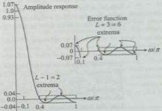{width=21%}  
Fig. 11.54 Amplitude response and the error function in Example 11.47  

$$
\begin{aligned} P(\omega) & = \sum_{k=0}^{3} \alpha(k) \cos k \omega = \frac{1}{15} \left[ 4 + 6 \cos \omega \\& + 4 \cos 2 \omega + 2 \cos 3 \omega \right] \\& = \frac{1}{15} \left[ 4 + 6 \cos \omega + 4 (2 \cos ^{2} \omega - 1 ) \\& + 2 ( 4 \cos ^{3} \omega - 3 \cos \omega ) \right] \\P(\omega) & = 0 + 0 + \frac{8}{15} \cos ^{2} \omega + \frac{8}{15} \cos ^{3} \omega \\& = \sum_{k=0}^{3} \beta(k) \cos ^{k} \omega \end{aligned}
$$  

Example 11.48 Show that the summation [Type-2, Eq. (11.28)]  

$$
H _ { r } ( \varepsilon ^{j \omega} ) = \sum _ { k = 1 } ^{n - 1} b ( k ) \cos \omega \left( k - \frac { 1 } { 2 } \right)
$$  

can be written as  

$$
H _ { r } ( e ^{j \omega} ) = \cos \frac { \omega } { 2 } \sum _ { k = 0 } ^{\infty} \tilde { b } ( k ) \cos \omega k
$$  

Therefore, $\beta(k) = \left[0, 0, \frac{s}{15}, \frac{s}{15}\right]$. $P(\omega)$ is shown in Fig. 11.54. Clearly, $P(\omega)$ has $(L-1) = 2$ extrema in the open interval $0 < \omega < \pi$. The error function has $(L+3) = 6$ extrema.  

Solution:  

Using the trigonometric identity  

$$
\cos \frac { \omega } { 2 } \cos \omega k = \frac { 1 } { 2 } \cos \omega \left( k + \frac { 1 } { 2 } \right) + \frac { 1 } { 2 } \cos \omega \left( k - \frac { 1 } { 2 } \right)
$$  

 ---------------------------------------------[ 第57页 ]---------------------------------------------  

we get  

$$
\begin{aligned} \cos \frac { \omega } { 2 } & \sum _ { k = 0 } ^{\frac { M - 1} { 2 } } \bar { b } ( k ) \cos \omega k \\& = \frac { 1 } { 2 } \sum _ { k = 0 } ^{\frac { M - 1} { 2 } } \bar { b } ( k ) \cos \omega \left( k + \frac { 1 } { 2 } \right) \\& + \frac { 1 } { 2 } \sum _ { k = 0 } ^{\frac { M - 1} { 2 } } \bar { b } ( k ) \cos \omega \left( k - \frac { 1 } { 2 } \right) \\& = \frac { 1 } { 2 } \sum _ { k = 1 } ^{\frac { M} { 2 } } \bar { b } ( k - 1 ) \cos \omega \left( k - \frac { 1 } { 2 } \right) \end{aligned}
$$  

$$
\begin{aligned} & \left. + \frac { 1 } { 2 } \sum _ { k = 1 } ^{\frac { M} { 2 } } \bar { b } ( k ) \cos \omega \left( k - \frac { 1 } { 2 } \right) \\& + \frac { 1 } { 2 } \bar { b } ( 0 ) \cos \frac { \varepsilon } { 2 } - \frac { 1 } { 2 } \bar { b } \left( \frac { M } { 2 } \right) \cos \omega \left( \frac { M - 1 } { 2 } \right) \\& = \sum _ { k = 1 } ^{M / 2} b ( k ) \cos \omega \left( k - \frac { 1 } { 2 } \right) \end{aligned}
$$  

Matching the multipliers in front of the cosine of the last two expressions, we get.  

$$
b ( k ) = \left\{ \begin{array}{ll} { { \frac { \tilde { b } ( 1 ) + 2 \tilde { b } ( 0 ) } { 2 } } } & { { k = 1 } } \\{ { \frac { \tilde { b } ( k ) + \tilde { b } ( k - 1 ) } { 2 } } } & { { 2 \leq k \leq \frac { M } { 2 } - 1 } } \\{ { \frac { \tilde { b } ( \frac { M } { 2 } - 1 ) } { 2 } } } & { { k = \frac { M } { 2 } } } \end{array} \right.
$$  

# 11.13.2 Alternation Theorem  

Let $R$ be any closed subset of the closed interval $[0, \pi]$. A necessary and sufficient condition for $P(\omega)$ to be the unique minimax approximation to $\hat{H}_{\mathrm{\~d\~r\~}}(\omega)$ in $R$ is that the error function $E(\omega)$ exhibit at least $(L+2)$ alternations or extremal frequencies in $R$. That is, there must exist at least $(L+2)$ frequencies $\omega_{i}$ in $R$ such that  

$$
\begin{array}{rl} { E ( \omega _ { i } ) = - E ( \omega _ { i - 1 } ) } & { { } { \mathrm { w i t h } }  | E ( \omega _ { i } ) | = \operatorname* { m a x } _ { \omega \in R } | E ( \omega ) | = \delta } \\{ \omega _ { 0 } < \omega _ { 1 } < \cdots < \omega _ { L + 1 } \in R } & { { } } \end{array}
$$  

Extremal frequencies are frequencies at which the magnitude of the error $|E(\omega)|$ achieves its extreme or maximum value within the pass-band and the stop-band. Extremal frequencies include local maxima and local minima, and they can also include band edge frequencies. The name alternation theorem arises from the fact that the sign of the error alternates as one traverses the extremal frequencies. The alternation theorem implies that the best minimax approximation must have an equiripple error function.  

Combining this theorem with our earlier conclusion, we infer that the optimal equip-pile LPF or HPF has either $(L+2)$ or $(L+3)$ alternations in its error function over $R$. In general, filter designs that contain more than $(L+2)$ alternations or ripples are called extra ripple filters. BPF and BSF can have up to $(L+5)$ extremal frequencies because there are two additional band edge frequencies.  

Solution:  

Filter order = $M - 1 = 128$, therefore, the filter length = $M = 129$. From table 11.10, for a Type-1 filter, $L = \frac{M - 1}{2} = 64$. For an equilibre BSF,  

$$
\begin{aligned} & \text { the minimum number of alterations } \\& = L + 2 = 15 + 2 = 17 \\& \text { the maximum number of alterations } \\& = L + 3 = 15 + 3 = 18 \end{aligned}
$$  

The minimum number of extremal frequencies  

$$
H _ { * } ( \epsilon ^{\nu} ) = \sum _ { k = 0 } ^{L} \beta ( k ) \cos ^{k} \omega
$$  

$$
= L + 2 = 64 + 2 = 66
$$  

The maximum number of extremal frequencies  

$$
= L + 5 = 64 + 5 = 69
$$  

The weighted error is defined as  

Example 11.51 Show that a Type-1 equiripple FIR LPF of length $M$ can have either $(L+2)$ or $(L+3)$ alternations where $L=\frac{M-1}{2}$.  

$$
\begin{array}{rl} { E ( \omega ) \triangleq W ( \omega ) \left[ H _ { \mathrm { e f f } } ( \epsilon ^{\omega} ) - H _ { \mathrm { r } } ( \epsilon ^{\omega} ) \right] , } & { } \\{ \omega \in R \triangleq [ 0 , \omega ] \cup [ \omega , \pi ] } & { } \end{array}
$$  

Since the desired amplitude response $H_{dr}(e^{i\omega})$ and the weighting function $W(\omega)$ are piecewise constant, we get  

# Solution:  

For a Type-1 linear-phase filter of length $M$ (order $=M-1$), the frequency response is  

$$
\begin{aligned} H \left( e ^{j \omega} \right) & = e ^{- j \frac { M - 1} { 2 } + \sum _ { k = 0 } ^{M - 1} \alpha ( k ) \cos \left( k \omega \right) } \\& = e ^{- j \frac { M - 1} { 2 } + \omega } H _ { r } \left( e ^{j \omega} \right) \end{aligned}
$$  

where $H_{r}(e^{i\omega})$ is the amplitude response.  

$$
\begin{aligned} \frac { d E ( \omega ) } { d \omega } & = \frac { d } { d \omega } \left\{ W ( \omega ) \left[ H _ { \mathrm { e f f } } ( e ^{i \omega} ) - H _ { \mathrm { e } } ( e ^{j \omega} ) \right] \right\} \\& = - \frac { d H _ { \mathrm { e } } ( e ^{j \omega} ) } { d \omega } = - \frac { d } { d \omega } \left( \sum _ { k = 0 } ^{l} \beta ( k ) \cos ^{k} \omega \right) \\& = - \sin \omega \sum _ { k = 0 } ^{L} k \beta ( k ) \cos ^{k - 1} \omega \end{aligned}
$$  

$$
H _ { r } ( e ^{j \omega} ) = \sum _ { k = 0 } ^{M - 1} \alpha ( k ) \cos ( k \omega ) = \sum _ { k = 0 } ^{i} \alpha ( k ) \cos ( k \omega )
$$  

Therefore, $\frac{\mathrm{d}E(\omega)}{\mathrm{d}\omega}=0$ at $\omega=0$ and $\omega=\pi$. In addition, $\frac{\mathrm{d}E(\omega)}{\mathrm{d}\omega}=0$ at $(L-1)$ other frequencies between $0$ and $\pi$, which corresponds to the roots of the $(L-1)$th order polynomial $\frac{\mathrm{d}E(\omega)}{\mathrm{d}\omega}$. Therefore, $H_{\infty}(\omega')$ may have at most $(L+1)$ local maxima and minima. In addition, we would like the filter specifications to be met exactly at the band edge frequencies $\omega_{p}$ and $\omega_{s}$. As a consequence, for an LPF or a HPF, there are at most $(L+3)$ extremal frequencies in the $0\leq\omega\leq\pi$ interval. Because the alternation theorem requires a minimum of $(L+2)$ alternations, the optimum filter may have either $(L+2)$ or $(L+3)$ alternations.  

with $L=\frac{M-1}{2}$. $H_{r}(e^{i\omega})$ can be converted to a trigonometric polynomial in $\cos\omega$,  

# 11.13.3 Parks-McClellan Algorithm  

The alternation theorem ensures that the solution to minimax approximation problem exists and unique, but it does not tell us how to obtain this solution. The most efficient algorithm for obtaining this solution is the Parks-McClellan algorithm. It is an iterative solution that uses the Remez-exchange algorithm. The Parks-McClellan algorithm requires the band edge frequencies $\omega_{p}$ and $\omega_{s}$, the ratio $\frac{\delta}{\delta_{p}}$ of the stop-band and pass-band ripples, and the filter length $M$. It returns the coefficients $\alpha(k)$ and the actual band values of $\delta_{s}$, and $\delta_{s}$ for the given filter length $M$.  

design values of $v_{p}$ and $\omega_{i}$.

From the alternation theorem, at the desired extremal frequencies $\omega_{i}$, we have the set of equations  

$$
\hat { W } ( \omega _ { i } ) \left[ \hat { H } _ { d x } ( \omega _ { i } ) - P ( \omega _ { i } ) \right] = ( - 1 ) ^{i} \delta  i = 0 , 1 , \ldots , L + 1
$$  

where $\delta$ represents the maximum value of the error function $E(\omega)$. Here, the quantity $(-1)^i$ brings out the alternating nature of the error.  

 ---------------------------------------------[ 第58页 ]---------------------------------------------  

Rearranging Eq. (11.149), we obtain  

$$
\begin{aligned} P ( \omega _ { i } ) + \frac { ( - 1 ) ^{4} \delta } { \hat { W } ( \omega _ { i } ) } = \hat { H } _ { d r } ( \omega _ { i } ) \\& \sum _ { k = 0 } ^{L} \alpha ( k ) \cos \omega _ { i } k + \frac { ( - 1 ) ^{4} \delta } { \hat { W } ( \omega _ { i } ) } = \hat { H } _ { d r } ( \omega _ { i } )  i = 0 , 1 , \ldots , L + 1 . \end{aligned}
$$  

This equation is rewritten in matrix form as  

$$
\begin{array}{r} { \left[ \begin{array}{llll} { 1 } & { \cos \omega _ { 0 } } & { \cos 2 \omega _ { 0 } } & { \cdots } & { \cos L \omega _ { 0 } } & { \frac { 1 } { W ( \omega _ { 0 } ) } } \\{ 1 } & { \cos \omega _ { 1 } } & { \cos 2 \omega _ { 1 } } & { \cdots } & { \cos L \omega _ { 1 } } & { \frac { - 1 } { W ( \omega _ { 1 } ) } } \\{ \vdots } & { \vdots } & { \vdots } & { \ddots } & { \vdots } & { \vdots } \\{ 1 } & { \cos \omega _ { L } } & { \cos 2 \omega _ { L } } & { \cdots } & { \cos L \omega _ { L } } & { \frac { ( - 1 ) ^{L} } { W ( \omega _ { L } ) } } \\{ 1 } & { \cos \omega _ { L + 1 } } & { \cos 2 \omega _ { L + 1 } } & { \cdots } & { \cos L \omega _ { L + 1 } } & { \frac { ( - 1 ) ^{L} } { W ( \omega _ { L + 1 } ) } } \end{array} \right] \left[ \begin{array}{l} { \alpha ( 0 ) } \\{ \alpha ( 1 ) } \\{ \vdots } \\{ \alpha ( L ) } \\{ \delta } \end{array} \right] = \left[ \begin{array}{l} { \tilde { H } _ { d r } ( \omega _ { 0 } ) } \\{ \tilde { H } _ { d r } ( \omega _ { 1 } ) } \\{ \vdots } \\{ \tilde { H } _ { d r } ( \omega _ { L } ) } \\{ \tilde { H } _ { d r } ( \omega _ { L + 1 } ) } \end{array} \right] } \end{array}
$$  

This set of equations serves as the basis for an iterative algorithm for finding the optimum $P(\omega)$. Initially, the extremal frequencies $\omega_{i}$, the parameters $\alpha(k)$, and $\delta$ are unknown. To find $\alpha(k)$, Parks and McClellan provided an iterative solution using the Remez-exchange algorithm. In the filter specifications, $\delta_{p}$, $\delta_{s}$, $\omega_{p}$, and $\omega_{s}$ are given. The filter length $M$ (or $L$) can be computed using the Kaiser formula:  

$$
M = \frac { - 10 \log _ { 10 } ( \delta _ { p } \delta _ { s } ) - 13 } { 14 . 6 \Delta f } + 1 ,  \Delta f = \frac { \omega _ { s } - \omega _ { p } } { 2 \pi }
$$  

The Parks-McClellan algorithm starts by choosing an initial guess of $(L+2)$ extremal frequencies $\omega_{1}$. Equation (11.151) is solved for $\alpha(k)$ and $\delta$, and then computed for the error function $E(\omega)$. The next set of extremal frequencies are those frequencies where $E(\omega)$ assumes maximum absolute values. Repeat this process iteratively until it converges to the optimal set of extremal frequencies $\omega_{1}$. Using these optimal frequencies, we can determine $P(\omega)$. From Eq. (11.147) coefficients $\beta(k)$ are determined. Finally, the coefficients $\alpha(k)$ as well as the impulse response $h(n)$ are computed.  

We can fit exchange algorithm because first we exchange an old set of frequencies $\omega_i$ for a new one. Then we exchange an old set of $\alpha(k)$ for a new one. Since $\alpha(k)$ and $\omega_i$ actually describes the impulse response and frequency response of the filter, we are in essence going back and forth between the two domains until the coefficients $\alpha(k)$ yield a spectrum with the desired optimal characteristics.  

We can summarize the Parks-McClellan algorithm in the following steps:

1. Choose an initial guess of $(L+2)$ extremal frequencies $\omega_{i}$.

2. Parks and McClellan found that, for an initial guess of $(L+2)$ extremal frequencies, we can compute $\delta$ analytically according to the expression derived by solving Eq. (11.151) which is given by  

where  

$$
\delta = \frac { \sum _ { k = 0 } ^{L + 1} b _ { k } \hat { H } _ { d r } ( w _ { k } ) } { \sum _ { k = 0 } ^{L + 1} \frac { b _ { k } ( - 1 ) ^{k} } { W ( w _ { k } ) } }
$$  

$$
b _ { k } = \prod _ { i \neq k } ^{l + 1} \frac { 1 } { \cos \omega _ { k } - \cos \omega _ { i } }
$$  

3. The values of the polynomial $P(\omega)$ at $\omega=\omega_i$ are then computed using  

$$
P ( \omega _ { i } ) = \hat { H } _ { \delta _ { c } } ( \omega _ { i } ) - \frac { ( - 1 ) ^{i} \delta } { \hat { W } ( \omega _ { i } ) }  i = 0 , 1 , \ldots , L + 1
$$  

4. We can use Lagrange interpolation formula to determine $P(\omega)$.  

$$
P ( \omega ) = \frac { \sum _ { k = 0 } ^{L} P ( \omega _ { k } ) [ c _ { k } / ( x - x _ { k } ) ] } { \sum _ { k = 0 } ^{L} [ c _ { k } / ( x - x _ { k } ) ] }
$$  

where $x = \cos \omega$, $\tau_k = \cos \omega_k$, and  

$$
c _ { k } = \prod _ { i = 0 } ^{L} \frac { 1 } { x _ { k } - x _ { i } }
$$  

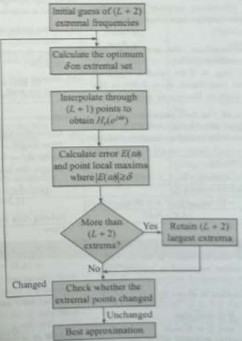{width=21%}  
Fig. 11.55 Flowchart of Parks-McClellan algorithm  

 ---------------------------------------------[ 第59页 ]---------------------------------------------  

5. We can now compute the error function $E(\omega)$ from  

$$
E ( \omega ) = \hat { W } ( \omega ) \left[ \hat { H } _ { d r } ( \omega ) - P ( \omega ) \right]
$$  

on a dense set of frequency points. Usually, a number of points equal to $16M$ is adequate. If $|E(\omega)| \geq \delta$ for some frequencies on the dense set, then determine a new set of $(L+2)$ extremal frequencies and go back to step 2.  

6. If $|E(\omega)| \leq \delta$ for all $\omega$, then the algorithm has converged.  

A flowchart for the Parks-McClellan algorithm is shown in Fig. 11.55.  

Example 11.52 We would like to design a BSF to satisfy the following specifications:  

1. $0.98 \leq |H(e^{2\omega})| \leq 1.02$ $0 \leq \omega \leq 0.2\pi$

2. $|H(e^{2\omega})| < 0.001$ $0.22\pi \leq \omega \leq 0.78\pi$

3. $0.95 \leq |H(e^{2\omega})| \leq 1.05$ $0.8\pi \leq \omega \leq \pi$  

$$
= { \left\{ \begin{array}{ll} { 0 . 05 } & { 0 \leq \omega \leq 0 . 2 \pi } \\{ 1 } & { 0 . 22 \pi \leq \omega \leq 0 . 78 \pi } \\{ 0 . 02 } & { 0 . 8 \pi \leq \omega \leq \pi } \end{array} \right. }
$$  

(a) Estimate the order of the equilibre filter required to meet these specifications.
(b) What weighting function $W(\omega)$ should be used to design this filter?
(c) What is the minimum number of extremal frequencies that the optimal filter must have?  

(c) Filter length $M=233$, which is a Type-1 FIR filter. Therefore, $L=\frac{M-1}{2}=116$. The minimum number of extremal frequencies = $L+2=118$.  

Solution:  

Example 11.53 Suppose that we want to design an LPF of 63 with a pass-band edge frequency $\omega_{p} = 0.3\pi$ and a stop-band edge frequency $\omega_{s} = 0.32\pi$.  

Using the filter specifications, the pass-band and stop-band edge frequencies are $\omega_{p1} = 0.2\pi$, $\omega_{s1} = 0.22\pi$, $\omega_{s2} = 0.78\pi$, $\omega_{p2} = 0.8\pi$, and a ripple of $\delta_1 = 0.02$ in the lower pass-band, $\delta_2 = 0.001$ in the stop-band, and $\delta_3 = 0.05$ in the upper pass-band.  

(a) With the smaller of the two pass-band ripples being equal to $\delta_{p}=\min\left(\delta_{1}, \delta_{3}\right)=0.02$, a stop-band ripple of $\delta_{s}=0.001$, and a transition width $\Delta \omega=\min\left[(\omega_{s 1}-\omega_{p 1}),\left(\omega_{p 2}-\omega_{s 2}\right)\right]=0.02 \pi$, the filter length is given by  

(a) What is the approximate stop-band attenuation that would be obtained if this filter was designed using the window design method with a Kaiser window?

(b) Repeat part (a) for a equiripple filter assuming that we want $\delta_{\mathbf{p}}=\delta_{\mathbf{s}}$.  

$$
\begin{aligned} M & = \frac { - 10 \log _ { 10 } \left( \delta _ { p } \delta _ { s } \right) - 13 } { 14 . 6 \Delta f } + 1 \\& = \frac { - 10 \log _ { 10 } \left( 0 . 02 \times 0 . 00 1 \right) - 13 } { 14 . 6 \times 0 . 01 } + 1 \\& = 23 3 \\\text { 等 order } = M - 1 = 23 2 \end{aligned}
$$  

Solving this for the stop-band attenuation, we have  

# Solution:  

However, because this estimate is for an LPF, the actual filter order required is greater than 232.  

(a) Given that filter order $M-1=63$; therefore, filter length $M=63+1=64$. The transition width $\Delta f=\frac{\omega_{s}-\omega_{p}}{2\pi}=0.01$. For a Kaiser window design, the filter length is given by  

$$
M = \frac { A - 7 . 95 } { 14 . 36 \Delta f } + 1
$$  

$$
W ( \omega ) = \left\{ \begin{array}{ll} { \frac { \frac { 3 } { 2 } } { \xi _ { 1 } } } & { 0 \leq \omega \leq \omega _ { p 1 } } \\{ \frac { 1 } { \xi _ { 1 } } } & { \omega _ { p 1 } \leq \omega \leq \omega _ { p 2 } } \\{ \frac { \frac { 6 } { 2 } } { \xi _ { 1 } } } & { \omega _ { p 2 } \leq \omega \leq \pi } \end{array} \right.
$$  

(b) The weighting function is given by  

$$
\begin{array}{rl} { A = 14 . 36 \Delta f ( M - 1 ) + 7 . 95 } \\{ = 14 . 36 \times 0 . 01 \times 63 + 7 . 95 } \\{ = 16 . 99 } \end{array}
$$  

$$
\begin{aligned} \mathbf { W i t h } \delta _ { p } & = \delta _ { s } , \mathrm { ~ t h i s ~ b e c o m e s } \\M & = \frac { - 20 \log _ { 10 } ( \delta _ { s } ) - 13 } { 14 . 6 \Delta f } + 1 \\& = \frac { A - 13 } { 14 . 6 \Delta f } + 1 \end{aligned}
$$  

where $A = -20\log_{10}(\delta_s)$. Solving for $A$, we have  

$$
M = \frac { - 10 ) \log _ { 10 } ( \delta _ { p } \delta _ { s } ) - 13 } { 14 . 6 \Delta f } + 1
$$  

(b) For an equiripple filter, the filter length is given by  

$$
\begin{array}{rl} { A = 14 . 6 \times \Delta f \times ( M - 1 ) + 13 } \\{ = 14 . 6 \times 0 . 01 \times 63 + 13 } \\{ = 22 . 04 } \end{array}
$$  

# 11.13.4 Disadvantages of Optimal Method  

The disadvantages of this method are as follows.  

1. The filter length is estimated by empirical formula.
2. We have no control over the actual ripple $\delta$ that the design yields. If this ripple is unacceptable, then we have to start afresh with a different set of weight function or with a different filter length.  

# 11.14 COMPARISONS OF DESIGN METHODS FOR LINEAR-PHASE FINITE IMPULSE RESPONSE FILTERS  

Table 11.11 shows the comparisons for the window, frequency sampling, and optimum methods.  

Table 11.11 Comparison of three design methods   

| Design method | Window method | Frequency sampling method | Optimal design method (Parks-McClellan algorithm) |
| --- | --- | --- | --- |
| Filter type | 1. Low-pass, high-pass, band-pass, band-stop 2. Formulae are not valid for arbitrary frequency selectivity | Any type filter | Any type filter |
| Linear-phase | Yes | Yes | Yes |
| Ripple and stop-band specifications | Used for determining the filter order and cut-off frequency | Need to be checked after each design trial | Used in the algorithm; need to be checked after each design trial |
| Algorithm complexity for coefficients | Moderate 1. Impulse sequence calculation 2. Window function weighting | Simple Single equation | Complicated 1. Parks-McClellan algorithm 2. Remez-exchange algorithm |
| Minimum design tool | Calculator | Calculator | Software |  

# SOLVED EXAMPLES  

Solution: Let $B(e^{i\pi})$ be the frequency response of the given LPF.  

Example 11.54 Let $H(z)$ be the transfer function of a low-pass digital filter with a pass-band edge at $\omega_{p}$, stop-band edge at $\omega_{x}$, pass-band ripple of $\delta_{p}$, and stop-band ripple of $\delta_{x}$. A new filter is formed by cascading $H(z)$ with itself. What are the pass-band and stop-band ripples at $\omega_{p}$ and $\omega_{x}$, respectively?  

$$
\begin{array}{rl} { 1 - \delta _ { p } \leq | H ( e ^{2 \pi} ) | \leq 1 + \delta _ { p } } & { { } 0 \leq \omega \leq \omega _ { p } } \\{ | H ( e ^{2 \pi} ) | \leq \delta _ { p } } & { { } \omega _ { s } \leq \omega \leq \pi } \end{array}
$$  

Let $\hat{h}(\alpha)$ be the impulse response of the given LPF and $g(\alpha)$ be the impulse response of the cascade  

 ---------------------------------------------[ 第60页 ]---------------------------------------------  

filter. The impulse response of the cascade filter is given by  

$$
\begin{array}{rl} { g ( n ) = h ( n ) * h ( n ) } & { } \\{ G ( e ^{j \omega} ) = H ( e ^{j \omega} ) H ( e ^{j \omega} ) = H ^{2} ( e ^{j \omega} ) } & { } \end{array}
$$  

Therefore, in the pass-band and stop-band, we have  

$$
\begin{array}{r} { ( 1 - \delta _ { p } ) ^{2} \leq | G ( e ^{j \omega} ) | \leq ( 1 + \delta _ { p } ) ^{2}  0 \leq \omega \leq \omega _ { p } } \\{ | G ( e ^{j \omega} ) | \leq \delta _ { s } ^{2}  \omega _ { s } \leq \omega \leq \pi } \end{array}
$$  

$$
h _ { L P } ( n ) = \left\{ \begin{array}{ll} { { \frac { w _ { c } } { \pi } } } & { { n = 0 } } \\{ { \frac { \sin w _ { c } n } { \pi n } } } & { { | n | > 0 } } \end{array} \right.
$$  

# Solution:  

Given that $A_{p} = 0.1$ dB and $A_{s} = 35$ dB.  

The impulse response of an ideal LPF is symmetric about $n=0$. Since $h_{LP}(n)$ is two-sided, it is non-causal and can never be realized. Moreover, the ideal LPF is unstable because $h_{LP}(n)$ is not absolutely summable. One way to approximate an ideal LPF is by truncation of its impulse response such that $h_{LP}(n)=0$ outside the range $-\frac{M-1}{2}\leq n\leq\frac{M-1}{2}$, where $M$ is odd, to get  

Example 11.55 Peak pass-band ripple $A_{p}$, and minimum stop-band attenuation $A_{s}$ of a digital filter are 0.1 dB and 35 dB, respectively. Determine their corresponding peak ripple values $\delta_{p}$ and $\delta_{s}$.  

$$
h _ { M } ( n ) = \left\{ \begin{array}{ll} { { h _ { L P } ( n ) } } & { { - \frac { M - 1 } { 2 } \leq n \leq \frac { M - 1 } { 2 } } } \\{ { 0 } } & { { \mathrm { o t h e r w i s e } } } \end{array} \right.
$$  

$$
\begin{array}{rl} { \delta _ { p } = { \frac { 10 ^{A _ { p} / 20 } - 1 } { 10 ^{A _ { p} / 20 } + 1 } } = { \frac { 10 ^{0 . 1 / 20} - 1 } { 10 ^{0 . 1 / 20} + 1 } } = 0 . 00 58 } \\{ \delta _ { s } = 10 ^{- A _ { s} / 20 } = 10 ^{- 35 / 20} = 0 . 01 78 } \end{array}
$$  

Example 11.56 Show that the impulse response of an ideal LPF is non-causal. How it can be made causal?  

# Solution:  

Still it is non-causal. To obtain a causal filter, we must also delay the truncated impulse response by $\alpha = \frac{M-1}{2}$ samples so that its first sample appears at the origin.  

The frequency response of an ideal LPF of cut-off frequency $\omega_{e}$ is given by  

$$
H _ { \mathrm { t f } } ( e ^{2 \omega} ) = \mathrm { r e c t } \left( \frac { \omega } { 2 \omega _ { c } } \right) = \left\{ \begin{array}{ll} { { \frac { 1 } { 0 } } } & { { \frac { | \omega | } { \omega _ { c } } \leq \omega _ { c } } } \\{ { \frac { | \omega | } { \omega _ { c } } < \frac { | \omega | } { \omega _ { c } } \leq \omega _ { c } } } \end{array} \right.
$$  

Its impulse response $h_{LP}(n)$ is found using the inverse DTFT to give  

Example 11.57 Determine the values of $\beta$ and $M$ for a Kaiser window if $\delta = 0.01$ and $\Delta f = 0.1$ are the desired LPF parameters.  

Solution:  

frequency of 5 KHz. Take the length of the impulse response as $M = 17$.  

Given that $\delta = 0.01$ and $\Delta f = 0.1$. The stop-band attenuation is given by  

$$
A = - 20 \log _ { 10 } \delta = - 20 \log _ { 10 } 0 . 01 = 40 \, \mathrm { d B }
$$  

$$
\begin{aligned} h _ { \mathrm { L P } } ( n ) & = \frac { 1 } { 2 \pi } \int _ { - \pi } ^{\pi} H _ { \mathrm { L P } } ( e ^{j \omega _ { n} } ) e ^{j \omega _ { n} } d \omega \\& = \frac { 1 } { 2 \pi } \int _ { - \omega _ { c } } ^{\omega _ { f} } e ^{2 \omega _ { n} } d \omega = \frac { 1 } { 2 \pi } \left( \frac { e ^{j \omega _ { n} } } { j n } \right) \bigg | _ { - \omega _ { c } } \\& = \frac { 1 } { \pi n } \left( \frac { e ^{j \omega _ { n} } - e ^{- j \omega _ { n} } } { 2 j } \right) \\& = \frac { \sin \omega _ { c } n } { \pi n } = \frac { \omega _ { c } } { \pi } \left( \frac { \sin \omega _ { c } n } { \omega _ { c } n } \right) \end{aligned}
$$  

For $A = 40$ dB, the filter length is given by  

$$
\begin{array}{rl} { M \geq { \frac { A - 7 . 95 } { 14 . 36 \Delta f } } + 1 } \\{ \geq { \frac { 40 - 7 . 95 } { 14 . 36 \times 0 . 1 } } + 1 } \\{ M \geq 23 . 31 89 } \end{array}
$$  

Choose $M = 25$ to have a flexible Type-1 filter. For $A = 40$ dB, the Kaiser window parameter $\beta$ is given by  

$$
\begin{array}{rl} { \beta = 0 . 58 42 ( A - 21 ) ^{0 . 4} + 0 . 07 88 6 ( A - 21 ) } \\{ = 0 . 58 42 ( 40 - 21 ) ^{0 . 4} + 0 . 07 88 6 ( 40 - 21 ) } \\{ = 3 . 39 53 } \end{array}
$$  

See Example 11.5. Here, the length of the FIR filter is $M=17$.

clc; clear all; close all;

M=17; tau=(M-1)/2;

n=0:M-1;

Fc=1000; Pt=5000;

wc=(2*pi*Fc)/Pt;

hd=(sin(wc*(n-tau)); /(pi*(n-tau));

hd(tau+1)=0.4;

wrect=rectwin(M)';

h=hd.*wrect;

w=0:0.01:pI;

Hw=freqz(h,1,w);

MagHw=abs(Hw);

HwdB=20*log10(MagHw/max(MgRw) ):  

Solution:  

In this section, MATLAB programs are provided to enable the students to repeat the examples on their computers.  

{width=43%}  

M 11.1 Using a rectangular window, design an LPF with a pass-band gain of unity, cut-off frequency of 1000 Hz, and working at a sampling  

ss subplot(221);stem(n,hd,'filled');
axis((-1 M -0.15 0.5)];xlabel('n'):ylabel('hd(n)');

title('Ideal impulse response')

subplot(222);stem(n,wrect,'filled');

axis([-1 M -0.1 1.2]);

xlabel('n');ylabel('w(n)');

title('Rectangular window')

subplot(223);stem(n,h,'filled');

axis([-1 M -0.15 0.5]);

xlabel('n');ylabel('h(n)');

title('Actual impulse response')

subplot(224);

plot(w/pi,HwdB)

xlabel('frequency in pi units');

ylabel('dB');

title('Magnitude response')

The resulting plot is shown in Fig. 11.56.  

{width=34%}  
Fig. 11.56 Results of M 11.1  

M 11.2 The desired frequency response of a HPF is given by  

$$
H _ { d } ( e ^{2 \pi} ) = \left\{ \begin{array}{ll} { { \frac { e ^{- j \pi u} } { 0 } } } & { { \frac { e ^{- \pi u} } { \sqrt { \epsilon _ { 0 } } } \leq \frac { \sqrt { \epsilon _ { 1 } } } { \sqrt { \epsilon _ { 2 } } } \leq \frac { \sqrt { \epsilon _ { 1 } } } { \sqrt { \epsilon _ { 2 } } } } } \\{ { 0 } } & { { \frac { \sqrt { \epsilon _ { 1 } } } { \sqrt { \epsilon _ { 2 } } } \leq \frac { \sqrt { \epsilon _ { 1 } } } { \sqrt { \epsilon _ { 2 } } } } } \end{array} \right.
$$  

Design a linear-phase FIR filter using Hamming window for $M=25$ and $\omega_{c}=2$.  

Solution: See Example 11.24 for $M = 7$ and $\tau = 3$. Here, $M = 25$; therefore, $\tau = \frac{M - 1}{2} = 12$.

cle: clear all; close all:  

M=25; cau=(M-1)/2;
n=0:M=1;wc=2;
hd=((sin(pi*(n-tau)))/(pi*(n-tau)))...
-((sin(wc*(n-tau)))/(pi*(n-tau));
hd(tau+1)=0.3634;
whamm=haming(M)';
h=hd, *whamm;
w=0:0.01:pi;
Hw=freq(h,l,w);
MagHw=abs(Hw);
HwDB=20*log10(MagHw/max(MagHw));
subplot(221):stem(n,hd,'filled');
axis([-1 M -0.4 0.5]);  

 ---------------------------------------------[ 第61页 ]---------------------------------------------  

CHAPTER  

# 12 Infinite Impulse Response
#Digital Filter  

# 12.1 INTRODUCTION  

In Chapter 11, the finite impulse response (FIR) filter was shown to exhibit linear phase behaviour. However, it was observed that a high-order FIR filter was required to achieve a sharp magnitude response. Compared to the FIR filter, the infinite impulse response (IIR) filter has the following features:  

1. It generally satisfies a given magnitude response design objective with a lower-order filter.

2. It does not generally exhibit linear phase or constant group delay behaviour.  

If the principal objective of the digital filter design is to satisfy the specified magnitude response alone, an IIR is usually the preferred choice. Since the order of an IIR is usually significantly less than that of an FIR, the IIR would require fewer coefficients. The impulse response of a linear phase filter must be either symmetric or antisymmetric and must ensure that $H(z) = \pm z^{-(M-1)}H(z^{-1})$. For every pole inside the unit circle, there is a reciprocal pole outside the unit circle; hence, the filter would be unstable. To make the infinitely long, symmetric impulse response sequence of an IIR filter causal, we need an infinite delay, which is not practical. Consequently, a causal and stable IIR filter cannot have a linear phase.  

Specialized IIR filters (e.g. resonators, comb filters, and notch filters) can be designed directly using gain matching and placement of poles and zeros (refer Chapter 7). A more general technique is to start with an analog prototype low-pass filter (LPF) and put it through a series of transformations to convert it to the desired digital filter. Four classical families of analog filters are used for prototype filters, and each is optimal in some sense. The magnitude responses of Butterworth filters are as flat as possible in the pass-band. These filters are easy to design, but they have a relatively wide transition band, which can be made narrower by allowing ripples in the magnitude response. Type-I Chebyshev filters have ripples of equal amplitude in the pass-band and exactly meet the pass-band specifications. Type-II Chebyshev filters have ripples of equal amplitude in the stop-band and exactly meet the stop-band specifications. Elliptic filters have a very narrow transition band, which is achieved by allowing ripples of equal size in both the pass-band and the stop-band. These filters have magnitude responses that are similar to the optimal equiripple FIR filters designed with the Parks-McClellan algorithm.  

# 12.2 DESIGN OF IIR FILTERS FROM ANALOG FILTERS  

Designing of IIR digital filters from analog filters is a reasonable approach for several reasons, some of which are as follows:  

1. There are several analog filter design methods having simple closed-form design formulas. Therefore, it is easy to design an IIR filter based on such standard analog filter design formulas.

2. If we apply the standard approximation methods directly to the IIR digital filter design, they do not lead to simple closed-form design formulas.

3. Direct design of IIR digital filters are complicated because it involves approximation by a rational function of z rather than polynomial approximation as required by FIR filters.  

# Filter Design Steps  

When designing digital filters via an analog prototype, the following steps are performed:  

1. Transform the given digital filter specifications to analog filter sp.
2. Design an appropriate prototype low-pass analog filter, $H_{LP}(s)$.
3. Perform the steps given in either approach 1 or approach 2:  

(a) Approach 1:

(i) Apply frequency band transformation in $s$-domain to obtain other frequency selective filters (high-pass, band-pass, and band-stop) $H(s)$.

(ii) Transform the analog filter $H(s)$ to a digital filter $H(z)$.

(b) Approach 2:

(i) Transform the analog LPF $H_{LP}(s)$ to a digital filter $H_{LP}(z)$.

(ii) Apply frequency band transformation in $z$-domain to obtain other frequency selective filters (high-pass, band-pass, and band-stop) $H(z)$.  

These two approaches are shown in Fig. 12.1.  

To convert an analog filter $H(s)$ into a digital filter $H(z)$, the transformation should possess the following properties:  

1. The $j\Omega$-axis of the $s$-plane should map onto the unit circle in the $z$-plane. This means that there will be a direct relationship between the analog frequency $\Omega$ and the digital frequency $\omega$.  

{width=32%}  
Fig. 12.1 IIR filter design steps (a) Approach 1 (b) Approach 2  

 ---------------------------------------------[ 第62页 ]---------------------------------------------  

2. The left half of the $s$-plane maps to the inside of the unit circle. This implies that the poles in the left half of the $s$-plane maps into the inside of the unit circle. Hence, a stable analog filter will be transformed to a stable digital filter.  

# 12.3 INFINITE IMPULSE RESPONSE FILTER DESIGN BY APPROXIMATION OF DERIVATIVES  

In the discrete-time domain, the operation of differentiation is replaced by numerical difference. The transformation is derived by equating the transfer function $H(s)$ of the ideal analog differentiator with the transfer function $H(z)$ of the numerical difference algorithm.  

# 12.3.1 Backward Difference Algorithm  

The differential equations can be converted to difference equations by using numerical differences. Numerical differences approximate the slope (derivative) at a point, as illustrated for the backward-difference algorithm in Fig. 12.2.  

Let $x(t)$ be the input to an analog differentiator. Its output is given by  

$$
\begin{array}{rl} { y ( t ) = { \frac { d x ( t ) } { d t } } \Rightarrow Y ( s ) = s X ( s ) } \\{ H ( s ) = { \frac { Y ( s ) } { X ( s ) } } = s } \end{array}
$$  

The analog differentiator has the system function $H(s)=s$. At $t=nT$, the backward Euler approximation of the derivative is given by  

$$
\begin{array}{rl} { y ( t ) { \bigg | } _ { t = n T } = { \frac { d x ( t ) } { d t } } { \bigg | } _ { t = n T } } & { } \\{ y ( n T ) = { \frac { x ( n T ) - x ( n T - T ) } { T } } } & { } \\{ y ( n ) = { \frac { x ( n ) - x ( n - 1 ) } { T } } } & { } \\{ Y ( z ) = { \frac { 1 - z ^{- 1} } { T } } X ( z ) } & { } \\{ H ( z ) = { \frac { Y ( z ) } { X ( z ) } } = { \frac { 1 - z ^{- 1} } { T } } = { \frac { z - 1 } { z T } } } & { } \end{array}
$$  

where $T$ is small and $H(z)$ is the system function of the backward difference algorithm. Comparing the analog differentiator system function $H(s)$ with $H(z)$, that is, equating Eqs (12.2) and (12.3), we get  

$$
\delta = \frac { 1 - z ^{- 1} } { T } = \frac { z - 1 } { z T }
$$  

{width=22%}  
Fig. 12.2 Backward difference algorithm  

With $H_{\alpha}(s)$ denoting the analog filter system function and $H(z)$ the digital IIR filter system function, the backward difference algorithm corresponds to replacing $s$ by $\frac{1-\frac{s}{T}}{T}$; that is,  

$$
H ( z ) = H _ { \alpha } ( s ) \bigg | _ { s = 1 - \frac { 1 } { \beta - \beta } }
$$  

Let us investigate the implications of the mapping from the $s$-plane to the $z$-plane as given by Eq. (12.4). From Eq. (12.4), we have  

$$
\begin{array}{rl} { z = { \frac { 1 } { 1 - s T } } = { \frac { 0 . 5 - 0 . 5 s T + 0 . 5 + 0 . 5 s T } { 1 - s T } } = { \frac { 0 . 5 ( 1 - s T ) + 0 . 5 ( 1 + s T ) } { 1 - s T } } } & { } \\{ z = 0 . 5 + 0 . 5 { \frac { 1 + s T } { 1 - s T } } } & { } \\{ z - 0 . 5 = 0 . 5 { \frac { 1 + s T } { 1 - s T } } } & { } \\{ z - 0 . 5 = 0 . 5 { \frac { 1 + ( \sigma + j \Omega ) T } { 1 - ( \sigma + j \Omega ) T } } } & { } \end{array}  ( 12 )
$$  

To find where the $j\Omega$-axis maps, we set $\sigma=0$ to obtain  

$$
\begin{array}{rl} { z - 0 . 5 = 0 . 5 { \frac { 1 + j \Omega T } { 1 - j \Omega T } } } \\{ | z - 0 . 5 | = 0 . 5 { \frac { { \sqrt { 1 + \Omega ^{2} T ^{2} } } } { { \sqrt { 1 + \Omega ^{2} T ^{2} } } } } } \\{ | z - 0 . 5 | = 0 . 5 } \end{array}
$$  

Equation (12.7) shows that the $j\Omega$-axis is mapped into a circle of radius 0.5 and centred at $z=0.5$, as shown in Fig. 12.3.  

The left half of the $s$-plane maps inside this circle and the right half of the $s$-plane maps outside this circle. Consequently, this mapping preserves stability; that is, a stable analog filter is transformed into a stable digital filter. However, this mapping restricts  

{width=26%}  
Fig. 12.3 Mapping region based on the backward difference algorithm  

 ---------------------------------------------[ 第63页 ]---------------------------------------------  

the pole locations of the digital filter. Since the frequencies are mapped into a smaller circle, this mapping is good for the design of LPFs and band-pass filters (BPFs) having relatively small resonant frequencies. It is not possible to transform a high-pass analog filter into a corresponding high-pass digital filter.  

Example 12.1 Consider the analog filter $H(s) = \frac{1}{++\delta}$, $\alpha > 0$. Convert $H(s)$ to a digital filter $H(z)$ using the mapping based on the backward difference algorithm.  

Solution:  

$$
\begin{aligned} & = \frac { 1 } { \frac { 1 - z ^{- 1} } { T } + \alpha } \\& = \frac { T } { 1 + \alpha T - z ^{- 1} } \\& = \frac { z T } { ( 1 + \alpha T ) z - 1 } \end{aligned}
$$  

The digital filter system function is given by  

$$
H ( z ) = H ( s ) \bigg | _ { z = 1 - \frac { 1 } { \beta } } = \frac { 1 } { \pi + \alpha } \bigg | _ { z = 1 - \frac { 1 } { \beta } }
$$  

The digital filter has a pole at $z=\frac{1}{1+\alpha^{2}}$. Since this is always less than unity if $\alpha>0$ and $T>0$, we have a stable $H(z)$.  

# 12.4 IMPULSE-INVARIANT METHOD  

A digital filter is equivalent to an analog filter, in the sense of time-domain invariance, if equivalent inputs yield equivalent outputs. The simplest invariant design method is the impulse-invariant method. In this method, we sample the impulse response $h_{\alpha}(t)$ of the analog filter to obtain the impulse response $h(\pi)$ of the digital filter. Consider an analog filter system function $H_{\alpha}(s)$. If $H_{\alpha}(s)$ has no repeated roots, it can be expressed in terms of a partial fraction expansion to produce  

$$
H _ { a } ( s ) = \sum _ { k = 1 } ^{N} \frac { A _ { k } } { s + p _ { k } }
$$  

The poles of the analog filter are located at $s = -p_k$, and $A_k$ is the residue of the pole at $-p_k$. The impulse response is obtained by an inverse Laplace transform as  

$$
h _ { a } ( t ) = \sum _ { k = 1 } ^{N} A _ { k } e ^{- p _ { k} t } u ( t )
$$  

If we sample $h_{\alpha}(t)$ at $t=nT$, we get  

$$
h ( n ) = h _ { a } ( n T ) = \sum _ { k = 1 } ^{N} A _ { k } e ^{- p _ { k} n T } u ( n ) = \sum _ { k = 1 } ^{N} A _ { k } \left( e ^{- p _ { k} T } \right) ^{n} u ( n )
$$  

Taking the z-transform of Eq. (12.10) gives the digital filter transfer function $z_{N}^{(1)}$.  

Substituting $s = j\Omega$ and $z = e^{j\omega}$ to get the frequency response of the analog filter and digital filter, we get.  

$$
H ( z ) = \sum _ { k = 1 } ^{N} \frac { A _ { k } } { 1 - e ^{- p _ { k} T _ { Z } - 1 } }
$$  

The poles of the digital IHR filter are located at $z = e^{-p\ell/T}$. Comparing Eqs (12.8) and (12.11), we get the transformation  

$$
H _ { s } ( j \Omega ) = \frac { 1 } { p _ { k } + j \Omega }  \mathrm { a n d }  H ( e ^{j \omega} ) = \frac { 1 } { 1 - e ^{- m ^ { 2} t } e ^{- j \omega} }
$$  

$$
\frac { 1 } { s + p _ { k } } \stackrel { \leftrightarrow } { \longrightarrow } \frac { 1 } { 1 - e ^{- p _ { k} T _ { z } - 1 } }
$$  

Comparing the values of the analog and digital filter frequency responses at zero frequency, we get  

$$
\begin{array}{rl} { H _ { * } ( j \Omega ) { \bigg | } _ { \Omega = 0 } } & { { } = H _ { * } ( j 0 ) = H _ { * } ( 0 ) = { \frac { 1 } { p _ { k } } }  \mathrm { a n d } } \\{ H ( e ^{i \omega} ) { \bigg | } _ { \omega = 0 } } & { { } = H ( e ^{i \theta} ) = H ( 1 ) = { \frac { 1 } { 1 - e ^{- p _ { k} T } } } } \end{array}
$$  

For small values of the sampling interval $T$, we can use the approximation $e^{-p_k T} \approx 1 - p_k T$, which gives $H(\varphi^{0}) = \frac{1}{p_k T}$. This suggests that the transfer function $H(z)$ must be multiplied by $T$ so that the gain of the analog and digital filters matches closely at zero frequency. This modification results if we use the transformation.  

$$
h ( n ) = T h _ { n } ( n T ) = T \sum _ { k = 1 } ^{N} A _ { k } \left( e ^{- p _ { k} T } \right) ^{n} u ( n )
$$  

Then, $H(z)$ is given by  

$$
H ( z ) = \sum _ { k = 1 } ^{N} \frac { T A _ { k } } { 1 - e ^{- \gamma _ { k} T _ { k - 1 } } }
$$  

Moreover, at zero frequency, we get $H_{s}(j0)=H(e^{j\theta})=\frac{1}{\pi}$. Thus, the factor $T$ causes the two filters to have approximately equal DC gains.  

When the impulse-invariant method is used as a means for designing a digital filter with a specified frequency response, we are especially interested in the relationship between the frequency responses of the digital and analog filters. From the discussion of sampling in Chapter 2 (Section 2.13), it follows that the frequency response of a digital filter obtained through $\delta(n) = \text{Th}_n(nT)$ is related to the frequency response of an analog filter by  

$$
H ( e ^{i \omega} ) = \sum _ { k = - \infty } ^{\infty} H _ { \alpha } \left( j \frac { \pi } { T } - j \frac { 2 \pi } { T } k \right)
$$  

If the analog filter is bandlimited so that  

$$
H _ { * } ( \mathcal { U } \Omega ) = 0  | \Omega | \geq \frac { \pi } { T }
$$  

then  

$$
H ( e ^{2 \varphi} ) = H \left( j \frac { \pi } { T } \right)  \overline { { E } } \leq \pi
$$  

Unfortunately, any practical analog filter cannot be exactly bandlimited and consequently aliasing occurs.  

# 12.4.1 Relationship Between Analog and Digital Filter Poles  

Comparing Eqs (12.8) and (12.11), we can see that a pole at $s = -p_{\lambda}$ in the $s$-plane transforms to a pole at $z = e^{-p_{\lambda}T}$ in the $z$-plane and the coefficients in the partial  

 ---------------------------------------------[ 第64页 ]---------------------------------------------  

fraction expansions of $H_{\mathrm{a}}(s)$ and $H(z)$ are equal. Consequently, the relationship between the s-plane and z-plane is given by  

$$
z = e ^{s T}
$$  

If $s=\sigma+j\Omega$ and $z=\mathrm{re}^{j\omega}$, then Eq. (12.14) becomes  

$$
r e ^{j \omega} = e ^{\sigma T} e ^{j \pi T}
$$  

Therefore, we have  

$$
\begin{array}{rl} { \omega = \Omega T } \\{ | z | = r = e ^{\sigma T} } \end{array}
$$  

The following observations can be made:  

1. Consider the following poles located on the $j\Omega$-axis where $\sigma = 0$, as shown in Fig. 12.4.  

$$
s _ { 1 } = - j \frac { \pi } { T } ,  s _ { 2 } = - j \frac { \pi } { 2 T } ,  s _ { 3 } = 0 ,  s _ { 4 } = j \frac { \pi } { 2 T } ,  s _ { 5 } = j \frac { \pi } { T }
$$  

These poles map onto the unit circle of the $z$-plane; that is, $|z|=r=e^{0T}=1$. The locations of these poles in the $z$-plane are given by  

$$
\begin{array}{rl} & { z _ { 1 } = e ^{s _ { 1} T } = e ^{- j \frac { \pi} { T } T } = e ^{- j \frac { \pi} { 2 T } } = - 1 ,  z _ { 2 } = e ^{s _ { 2} T } = e ^{- j \frac { \pi} { 2 T } T } = e ^{- j \frac { \pi} { 2 } } = - j , } \\& { z _ { 3 } = e ^{s _ { 3} T } = e ^{0 T} = 1 ,  z _ { 4 } = e ^{s _ { 4} T } = e ^{j \frac { \pi} { 2 T } T } = e ^{j \frac { \pi} { 2 T } } = j , } \\& { z _ { 5 } = e ^{s _ { 5} T } = e ^{j \frac { \pi} { T } T } = e ^{j \pi} = - 1 } \end{array}
$$  

2. Consider the following poles located in the left half of the $s$-plane where $\sigma < 0$, as shown in Fig. 12.5.  

$$
s _ { 1 } = - \sigma _ { 1 } + j \Omega ,  s _ { 2 } = - \sigma _ { 2 } + j \Omega
$$  

{width=30%}  
Fig. 12.4 Mapping of $j\Omega$-axis onto the unit circle  

{width=31%}  
Fig. 12.5 Mapping of the left-half of the $s$-plane inside the unit circle  

These poles map inside the unit circle because $|z|=r=e^{\phi T}<1$ for $\sigma<0$. The locations of these poles in the $z$-plane are given by  

$$
z _ { 1 } = e ^{\rho _ { 1} T } = e ^{[ - \sigma _ { 1} + j \Omega ] T } = e ^{- \sigma _ { 1} T } e ^{j \Omega T} \; \mathrm { a n d } \; z _ { 2 } = e ^{\eta _ { 2} T } = e ^{[ - \sigma _ { 2} + j \Omega ] T } = e ^{- \sigma _ { 2} T } e ^{j \Omega T}
$$  

3. Consider the following poles located in the right half of the $s$-plane where $\sigma > 0$, as shown in Fig. 12.6.  

$$
s _ { 1 } = \sigma _ { 1 } + j \Omega  \mathrm { a n d }  s _ { 2 } = \sigma _ { 2 } + j \Omega
$$  

These poles map outside the unit circle because $|z|=r=\epsilon^{e\tau}>1$ for $\sigma>0$. The locations of these poles in the $z$-plane are given by  

$$
z _ { 1 } = e ^{\kappa T} = e ^{( \sigma _ { 1} + j \Omega ) T } = e ^{\sigma _ { 1} T } e ^{j \Omega T}  \mathrm { a n d }  z _ { 2 } = e ^{\kappa T} = e ^{( \sigma _ { 2} + j \Omega ) T } = e ^{\sigma _ { 2} T } e ^{j \Omega T}
$$  

4. Impulse-invariant transformation is not one-to-one mapping. Since many points in the $s$-plane are mapped to a single point in the $z$-plane, it is many-to-one mapping. For example, consider the following poles located in the left half of the $s$-plane as shown in Fig. 12.7.  

$$
s _ { 1 } = - \sigma _ { 1 } + j \Omega ,  s _ { 2 } = - \sigma _ { 1 } + j \left( \Omega + \frac { 2 \pi } { T } \right) ,  \mathrm { a n d }  s _ { 3 } = - \sigma _ { 1 } + j \left( \Omega + \frac { 4 \pi } { T } \right)
$$  

{width=31%}  
Fig. 12.6 Mapping of the right half of the $s$-plane outside the unit circle  

 ---------------------------------------------[ 第65页 ]---------------------------------------------  

{width=30%}  
Fig. 12.7 Many-to-one mapping of impulse-invariant transformation  

These poles have the same real parts and their imaginary parts differ by an integer multiple of $\frac{2\pi}{T}$. The locations of these poles in the z-plane are given by  

$$
\begin{aligned} z _ { 1 } & = e ^{\sigma _ { 1} T } = e ^{( - \sigma _ { 1} + j \Omega ) T } = e ^{- \sigma _ { 1} T } e ^{j 2 \Omega T} , \\z _ { 2 } & = e ^{\sigma _ { 2} T } = e ^{[ - \sigma _ { 1} + j \left( \Omega + \frac { 2 \pi } { T } \right) T ] } = e ^{- \sigma _ { 1} T } e ^{j \left( \Omega T + 2 \pi \right)} \\& = e ^{- \sigma _ { 1} T } e ^{j \Omega T} \underbrace { e ^{j 2 \pi} } _ { = 1 } = e ^{- \sigma _ { 1} T } e ^{j \Omega T} = z _ { 1 } , \\z _ { 3 } & = e ^{\sigma _ { 3} T } = e ^{[ - \sigma _ { 1} + j \left( \Omega + \frac { 4 \pi } { T } \right) T ] } = e ^{- \sigma _ { 1} T } e ^{j \left( \Omega T + 4 \pi \right)} \\& = e ^{- \sigma _ { 1} T } e ^{j \Omega T} \underbrace { e ^{j 4 \pi} } _ { = 1 } = e ^{- \sigma _ { 1} T } e ^{j \Omega T} = z _ { 1 } \end{aligned}
$$  

and  

These equations show that the three poles $s_{1}, s_{2}$, and $s_{3}$ are mapped to the same location $z_{1}$ in the $z$-plane. Thus, those $s$-plane poles whose real parts are the same and whose imaginary parts differ by an integer multiple of $\frac{2\pi}{T}$ are mapped into the same location in the $z$-plane. Hence, impulse-invariant mapping is many-to-one mapping.  

Now, we can summarize the relationship between the $s$-plane and $z$-plane mapping. Since $s = -p_k$ and $z = e^{-p_kT}$, the relationship between the $s$-plane and $z$-plane is given by

$z = e^{s_T} \implies s = \frac{1}{T} \ln(z)$

If $s = \sigma + j\Omega$ and $z = re^{j\omega}$, then this equation becomes $r e^{j\omega} = e^{\sigma T} e^{j\Omega T}$. Therefore, we have $\omega = \Omega T$ and $|z| = r = e^{\sigma T}$. For different values of $\sigma$, we obtain

$|z| = r = e^{\sigma T} \left\{ \begin{array}{ll} < 1 & \text{if} & \sigma < 0 \\ = 1 & \text{if} & \sigma = 0 \\ > 1 & \text{if} & \sigma > 0 \end{array} \right.$

From Eq. (12.17), the following observations can be made:  

1. $\sigma<0$ implies the left half of the $s$-plane. In this case, $r<1$. This describes the inside of the unit circle. Thus, the left half of the $s$-plane maps into the inside of the unit circle. A causal and stable analog filter maps into a causal and stable digital filter.

2. $\sigma=0$ implies the $j\Omega$-axis. In this case, $r=1$. Thus, the $j\Omega$-axis of the $s$-plane maps onto the unit circle of the $z$-plane.

3. $\sigma>0$ implies the right half of the $s$-plane. In this case, $r>1$. This describes the outside of the unit circle. Thus, the right half of the $s$-plane maps to the outside of the unit circle.  

Figure 12.8 shows the mapping of the $s$-plane to the $z$-plane under the transformation $z=e^{sT}$.  

# 12.4.2 Relationship between Analog and Digital Frequencies  

From Eq. (12.15), the relationship between analog and digital frequencies is given by  

$$
\omega = \Omega T
$$  

Consider a strip of width $\frac{2\pi}{T}$ across the $s$-plane shown in Fig. 12.8. The relation $\omega=\Omega\mathcal{T}$ maps this strip of analog frequencies $-\frac{\pi}{T}\leq\Omega\leq\frac{\pi}{T}$ into $-\pi\leq\omega\leq\pi$. Since $e^{j\Omega\mathcal{T}}=e^{j\Omega(\Omega+\frac{2\pi}{T})\mathcal{T}}$, all frequencies $\Omega_{0}\pm\frac{2\pi}{T}$ are mapped to the same point in the $z$-plane. As $\Omega$ increases from $\Omega_{0}$ to $\Omega_{0}+\frac{2\pi}{T}$, the frequency $\omega$ increases from $\omega_{0}$ to $\omega_{0}+2\pi$, and the segments of the $j\Omega$-axis of length $\frac{2\pi}{T}$ thus map onto the unit circle over and over. In other words, strips of width $\frac{2\pi}{T}$ in the left half of the $s$-plane are mapped into the inside of the unit circle repeatedly.  

Hence, impulse-invariant transformation is many-to-one mapping. A one-to-one mapping is possible only if $\omega$ lies in the principal range $-\pi \leq \omega \leq \pi$, corresponding to the analog frequency range $-\frac{\pi}{\beta} \leq \Omega \leq \frac{\pi}{\beta}$.  

As the impulse response is sampled, we know that the spectrum of the sampled signal consists of replicas of the original spectrum at multiples of $\Omega_{s} = \frac{2\pi}{T}$. There is no aliasing if $\Omega_{s} > 2\Omega_{h}$, where $\Omega_{h}$ is the highest frequency component of the analog filter  

{width=30%}  
Fig. 12.8 Mapping of s-plane to the z-plane under the transformation $Z = \sigma^{sT}$  

 ---------------------------------------------[ 第66页 ]---------------------------------------------  

spectrum. However, no practical analog filter is bandlimited. Therefore, the impulse-invariant method will always cause aliasing, and the frequency response of the designed filter will be distorted. This is a drawback of this transformation. This method is suitable for the designing of LPFs and BPFs where the stop-bands overlap and the effect of aliasing is small. However, it is unsuitable for the designing of high-pass filters (BPFs) and band-stop filters (BSFs) where the pass-bands overlap, thereby magnifying the effect of aliasing.  

# 12.4.3 Advantages and Disadvantages of Impulse-living. 10.4.3 Advantages and Disadvantages of Impulse-invariant Method  

#  

The following are the advantages of the impulse-invariant method:  

1. It preserves the stability of the analog filter.
2. The relationship between analog and digital frequencies are linear; that is, $\omega = \Omega T$.
3. Since the relationship between the analog and digital frequencies is linear, the specifications for a digital filter can be easily transformed into those for an analog filter.  

The following are the disadvantages of the impulse-invariant method:  

1. The relation $z=e^{sT}$ does not describe a one-to-one mapping between the $s$-plane and the $z$-plane. Impulse-invariant mapping is many-to-one mapping.

2. Since no analog filter of finite order can be exactly bandlimited, some aliasing will occur.

3. This method is not suitable for designing HPFs and BSFs due to spectrum aliasing resulting from the sampling process.  

Example 12.2 Transform the analog filter transfer function  

$$
H _ { a } ( s ) = \frac { 0 . 5 ( s + 4 ) } { ( s + 1 ) ( s + 2 ) }
$$  

The $z$-transform of this equation yields  

into a digital filter $H(z)$ using the impulse-invariant method and gain matching at DC.  

Solution:  

We first expand $H_{s}(s)$ using partial fraction expansion  

$$
H _ { 0 } ( s ) = \frac { 0 . 5 ( s + 4 ) } { ( s + 1 ) ( s + 2 ) } = \frac { 1 . 5 } { s + 1 } - \frac { 1 } { s + 2 }
$$  

$$
H ( z ) = \frac { 1 . 5 T } { 1 - e ^{- T z ^ { - 1} } - \frac { T } { 1 - e ^{- 2 T z ^ { - 1} } } }
$$  

small, which yields  

Let us compare the frequency response of the two filters. For the analog filter, the frequency response is  

$$
H _ { \alpha } ( j \Omega ) = \frac { 0 . 5 ( 4 + j \Omega ) } { ( 1 + j \Omega ) ( 2 + j \Omega ) }
$$  

The unit impulse response of the analog filter is given by  

$$
\hbar ( n ) = T \hbar ( n T ) = 1 . 5 T e ^{- n T} u ( n ) - e ^{- 2 n T} u ( n )
$$  

whereas for the digital filter, it is  

$$
H ( e ^{2 \omega} ) = \frac { 1 . 5 T } { 1 - e ^{- T _ { e} - f \omega } } - \frac { T } { 1 - e ^{- 2 T _ { e} - f \omega } }
$$  

$$
h _ { \alpha } ( t ) = 1 . 5 e ^{- t} u ( t ) - e ^{- 2 t} u ( t )
$$  

Thus, the impulse response of the desired digital filter (with gain matching at DC) is  

The DC responses (frequency responses at zero frequency) of the analog and digital filters are given by  

$$
e ^{- T} \approx 1 - T  \mathrm { a n d }  e ^{- 2 T} \approx 1 - 2 T
$$  

which results in  

$$
H ( e ^{0} ) = H ( 1 ) \approx \frac { 1 . 5 T } { 1 - ( 1 - T ) } - \frac { T } { 1 - ( 1 - 2 T ) } = 1
$$  

Let $\Omega_{s} = 20$ rad/s, which gives $T = \frac{3\pi}{12} = \frac{3\pi}{22} = 0.31416$. The DC response for the digital filters is  

$$
\begin{array}{rl} { H ( e ^{j \theta} ) = H ( 1 ) } & { { } } \\{ = { \frac { 1 . 5 \times 0 . 31 41 6 } { 1 - e ^{- 0 . 31 41 6} } } - { \frac { 0 . 31 41 6 } { 1 - e ^{- 2 \times 0 . 31 41 6} } } } & { { } } \\{ = 1 . 07 45 } & { { } } \end{array}
$$  

$$
H _ { a } ( s ) = \frac { 4 s + 7 } { s ^{2} + 5 s + 4 }
$$  

$$
\begin{array}{rl} { H _ { a } ( j 0 ) = 1 } & { } \\{ H ( e ^{j a} ) = H ( 1 ) = { \frac { 1 . 5 T } { 1 - e ^{- T} } } - { \frac { T } { 1 - e ^{- 2 T} } } } & { } \end{array}
$$  

$$
h _ { a } ( t ) = t e ^{- \alpha t} u ( t )
$$  

which is slightly higher than the gain of the analog filter due to aliasing.  

Example 12.3 Transform the analog filter transfer function  

Thus, the DC responses are different due to aliasing. However, if the sampling frequency is high, $T$ is  

Therefore, the inverse Laplace transform of $H_{\alpha}(s)$ is  

If we sample $h_{\alpha}(t)$ at $t=nT$, we get  

Solution:  

into a digital filter $H(z)$ using the impulse-invariant method at $F_{*}=2$ Hz.  

By partial fraction expansion, we obtain  

$$
\begin{array}{rl} { h ( n ) = h _ { a } ( n T ) = n T \, e ^{- a n T} u ( n ) } & { { } } \\{ = T \, n ( \epsilon ^{- a T} ) ^{n} u ( n ) } & { { } } \end{array}
$$  

Using Eq. (6.32) of Chapter 6, the z-transform of this equation yields  

From Eq. (12.11), the impulse-invariant method with $T=\frac{1}{R_{\mathrm{\~s\~}}}=0.5$ gives  

$$
H ( z ) = \frac { T _ { e } ^{\prime} e ^{- \alpha T} z ^{- 1} } { ( 1 - e ^{- \alpha T} z ^{- 1} ) ^{2} }
$$  

$$
H _ { a } ( s ) = \frac { 4 s + 7 } { s ^{2} + 5 s + 4 } = \frac { 3 } { s + 4 } + \frac { 1 } { s + 1 }
$$  

$$
\begin{aligned} H ( z ) & = \frac { 3 } { 1 - e ^{- 4 T _ { z} - 1 } } + \frac { 1 } { 1 - e ^{- T _ { z} - 1 } } \\& = \frac { 3 } { 1 - e ^{- 2 z - 1} } + \frac { 1 } { 1 - e ^{- 0 . 5 z - 1} } \\& = \frac { 4 - 1 . 95 49 z ^{- 1} } { 1 - 0 . 74 19 z ^{- 1} + 0 . 08 21 z ^{- 2} } \end{aligned}
$$  

Thus  

Example 12.4 Transform the analog filter transfer function  

$$
\frac { 1 } { ( s + \alpha ) ^{2} } - \frac { T e ^{- \alpha T} z ^{- 1} } { ( 1 - e ^{- \alpha T} z ^{- 1} ) ^{2} }
$$  

$$
H _ { 0 } ( s ) = \frac { 1 } { ( s + a ) ^{2} }
$$  

Example 12.5 Transform the analog filter transfer function  

We know that  

into a digital filter $H(z)$ using the impulse-invariant method.  

$$
H _ { \alpha } ( s ) = \frac { s + \alpha } { ( s + \alpha ) ^{2} + b ^{2} }
$$  

into a digital filter $H(z)$ using the impulse-invariant method.  

Solution:  

Solution:  

We know that  

$$
\begin{array}{rl} { \cos ( b t ) u ( t ) \longrightarrow { \frac { s } { x ^{2} + b ^{2} } } } & { { } \mathrm { a n d } } \\{ e ^{- a t} \cos ( b t ) u ( t ) \longrightarrow { \frac { s + a } { ( x + a ) ^{2} + b ^{2} } } } & { { } } \end{array}
$$  

$$
e ^{- \alpha t} u ( t ) \longleftrightarrow \frac { 1 } { s + \alpha }  \mathrm { a n d }  t e ^{- \alpha t} u ( t ) \longleftrightarrow \frac { 1 } { ( s + \alpha ) ^{2} }
$$  

Therefore, the inverse Laplace transform of $H_{\alpha}(s)$ is given by  

$$
h _ { 4 } ( t ) = \epsilon ^{- \alpha \beta} \cos { ( \beta t ) } u ( t )
$$  

If we sample $h_{\alpha}(t)$ at $t=nT$, we get  

$$
\begin{aligned} h(n) & =h_{a}(n T)=e^{-\omega n T} \cos (b n T) u(n) \\& =e^{-\omega n T}\left(\frac{e^{3 b n T}+e^{-j i n T}}{2}\right) u(n) \\h(n) & =\frac{1}{2}\left[\left(\frac{e^{-(a-j b) T}}{2}\right)^{n} u(n)+\left(e^{-(a+j b) T}\right)^{n} u(n)\right] \end{aligned}
$$  

The $z$-transform of this equation yields  

$$
\begin{aligned} H ( z ) & = \frac { 1 } { 2 } \left[ \frac { 1 } { 1 - e ^{- ( a - j b ) T _ { z} - 1 } } + \frac { 1 } { 1 - e ^{- ( a + j b ) T _ { z} - 1 } } \right] \\& = \frac { 1 - e ^{- a T} \cos \left( b T \right) z ^{- 1} } { 1 - 2 e ^{- a T} \cos \left( b T \right) z ^{- 1} + e ^{- 2 a T} z ^{- 2} } \end{aligned}
$$  

 ---------------------------------------------[ 第67页 ]---------------------------------------------  

Thus  

$$
\frac { s + a } { ( s + a ) ^{2} + b ^{2} } + \frac { 1 - e ^{- a T} \cos ( b T ) z ^{- 1} } { 1 - 2 e ^{- a T} \cos ( b T ) z ^{- 1} + e ^{- 2 a T} z ^{- 2} } \eqno ( 12 . 19 )
$$  

$$
H _ { \alpha } ( s ) = \frac { b } { ( s + a ) ^{2} + b ^{2} }
$$  

Solution: We know that  

into a digital IIR filter using the impulse-invariant technique. Assume $T' = \text{ls}$.  

If we sample $h_{a}(t)$ at $t=nT$, we get  

Solution:  

$$
\begin{aligned} & = \frac { 1 } { s + 0 . 5 } - \frac { \frac { 1 } { 2 } s } { s ^{2} + 0 . 5 s + 2 } \\& = \frac { \frac { 1 } { 2 } s } { s + 0 . 5 } - \frac { \frac { 1 } { 2 } s } { s ^{2} + 0 . 5 s + ( \frac { 1 } { 4 } ) ^{2} + \frac { 31 } { 16 } } \\& = \frac { \frac { 1 } { 2 } s } { s + 0 . 5 } - \frac { \frac { 1 } { 2 } s + \frac { 1 } { s } - \frac { 1 } { s } } { ( s + \frac { 1 } { 4 } ) ^{2} + \left( \frac { \sqrt { 31 } } { 4 } \right) ^{2} } \\& = \frac { \frac { 1 } { 2 } s } { s + 0 . 5 } - \frac { \frac { 1 } { 2 } ( s + \frac { 1 } { 4 } ) } { ( s + \frac { 1 } { 4 } ) ^{2} + \left( \frac { \sqrt { 31 } } { 4 } \right) ^{2} } \\& + \frac { \frac { 1 } { s + \frac { 1 } { 4 } } } { ( s + \frac { 1 } { 4 } ) ^{2} + \left( \frac { \sqrt { 31 } } { 4 } \right) ^{2} } \\& l ( s ) = \frac { \frac { 1 } { s + 0 . 5 } } { s + 0 . 5 } - \frac { \frac { 1 } { 2 } ( s + \frac { 1 } { 4 } ) } { ( s + \frac { 1 } { 4 } ) ^{2} + \left( \frac { \sqrt { 31 } } { 4 } \right) ^{2} } \\& + \frac { \frac { 1 } { 2 \sqrt { 31 } } } { ( s + \frac { 1 } { 4 } ) ^{2} + \left( \frac { \sqrt { 31 } } { 4 } \right) ^{2} } \end{aligned}
$$  

Therefore, the inverse Laplace transform of $H_{\alpha}(s)$ is given by  

$$
h _ { a } ( t ) = e ^{- \alpha t} \sin ( b t ) u ( t )
$$  

$$
\begin{aligned} H(z) & = \frac { 1 } { 2 j } \left[ \frac { 1 } { 1 - e ^{- ( a + 2 b ) T _ { 2} - 1 } } \\& - \frac { 1 } { 1 - e ^{- ( a + 2 b ) T _ { 2} - 1 } } \right] \\& = \frac { e ^{- a T} \sin \left( b T \right) z ^{- 1} } { 1 - 2 e ^{- a T} \cos \left( b T \right) z ^{- 1} + e ^{- 2 a T _ { 2} - 2 } } \end{aligned} \\\text { Thus } & \frac { b } { ( s + a ) ^{2} + b ^{2} } \stackrel { \longrightarrow } { \frac { e ^{- a T} \sin \left( b T \right) z ^{- 1} } { 1 - 2 e ^{- a T} \cos \left( b T \right) z ^{- 1} + e ^{- 2 a T _ { 2} - 2 } } } \end{aligned}
$$  

into a digital filter $H(z)$ using the impulse-invariant method.  

$$
\begin{array}{rl} { ( 3 ) \sin ( b t ) u ( t ) \longrightarrow { \frac { b } { s ^{2} + b ^{2} } } } & { { } \mathrm { a n d } } \\{ e ^{- a ^ { 2} } \sin ( b t ) u ( t ) \longrightarrow { \frac { b } { ( s + a ) ^{2} + b ^{2} } } } & { { } } \end{array}
$$  

$$
\begin{array}{rl} { \cos \left( 3 t \right) u ( t ) \longleftrightarrow { \frac { s } { s ^{2} + 9 } } } & { { } { \mathrm { ~ a n d ~ } } } \\{ e ^{- 0 . 2 t} \cos \left( 3 t \right) u ( t ) \longleftrightarrow { \frac { s + 0 . 2 } { ( s + 0 . 2 ) ^{2} + 9 } } } & { { } } \end{array}
$$  

Therefore, the inverse Laplace transform of $H_{\alpha}(s)$ is given by  

$$
h _ { a } ( t ) = e ^{- 0 . 2 t} \cos \left( 3 t \right) u ( t )
$$  

$$
\begin{aligned} h(n) & =h_{a}(n T)^{T}=e^{-\frac{-\sin T}{2}} \sin \left(b n T\right) u(n) \\& =e^{-\frac{\sin T}{2}\left(\frac{e^{3 b n T}-e^{-j b n T}}{2 j}\right)} u(n) \\h(n) & =\frac{1}{2 j}\left[\left(e^{-\left(\alpha-j b\right) T}\right)^{n} u(n)-\left(e^{-\left(\alpha+j b\right) T}\right)^{n} u(n)\right] \end{aligned}
$$  

With $T=1$, if we sample $h_{\alpha}(t)$ at $t=nT=n$, we get  

$$
\begin{aligned} h ( n ) & = h _ { \alpha } ( n T ) = e ^{- 0 . 2 n} \cos \left( 3 n \right) u ( n ) \\& = e ^{- 0 . 2 n} \left( \frac { e ^{j 3 n} + e ^{- j 3 n} } { 2 } \right) u ( n ) \\h ( n ) & = \frac { 1 } { 2 } \left[ \left( e ^{- \left( 0 . 2 - j 3 \right)} \right) ^{n} u ( n ) + \left( e ^{- \left( 0 . 2 + j 3 \right)} \right) ^{n} u ( n ) \right] \end{aligned}
$$  

The $z$-transform of this equation yields  

The $z$-transform of this equation yields  

$$
\begin{aligned} H ( z ) & = \frac { 1 } { 2 } \left[ \frac { 1 } { 1 - e ^{- ( 0 . 2 - j 3 ) z - 1} } + \frac { 1 } { 1 - e ^{- ( 0 . 2 + j 3 ) z - 1} } \right] \\& = \frac { 1 - e ^{- 0 . 2} \cos ( 3 ) z ^{- 1} } { 1 - 2 e ^{- 0 . 2} \cos ( 3 ) z ^{- 1} + e ^{- 0 . 4 z - 2} } \\H ( z ) & = \frac { 1 + 0 . 81 05 z ^{- 1} } { 1 + 1 . 62 1 z ^{- 1} + 0 . 67 03 z ^{- 2} } \end{aligned}
$$  

Example 12.8 Use the impulse-invariant method to find the digital transfer function of  

If we sample $h_{n}(t)$ at $t=nT$, we get  

Example 12.7 Convert an analog filter with system function  

$$
H _ { a } ( s ) = \frac { 1 } { s ^{2} + 4 s + 5 } .
$$  

$$
H _ { s } ( s ) = \frac { s + 0 . 2 } { ( s + 0 . 2 ) ^{2} + g }
$$  

Solution:  

$$
\begin{array}{rl} { h ( n ) = h _ { \alpha } ( n T ) = e ^{- 2 n T} \sin ( n T ) u ( n ) } & { { } } \\{ = e ^{- 2 n T} \left( { \frac { e ^{n T} - e ^{- j n T} } { 2 j } } \right) u ( n ) } & { { } } \\{ h ( n ) = { \frac { 1 } { 2 j } } \left[ \left( e ^{- ( 2 - j ) T} \right) ^{n} u ( n ) - \left( e ^{- ( 2 + j ) T} \right) ^{n} u ( n ) \right] } & { { } } \end{array}
$$  

Given that  

The $z$-transform of this equation yields  

$$
\begin{aligned} H _ { a } ( s ) & = \frac { 1 } { s ^{2} + 4 s + 5 } = \frac { 1 } { s ^{2} + 4 s + 4 + 1 } \\& = \frac { 1 } { ( s + 2 ) ^{2} + 1 } \end{aligned}
$$  

$$
\begin{aligned} H ( z ) & = \frac { 1 } { 2 j } \left[ \frac { 1 } { 1 - e ^{- ( 2 - j ) T _ { z} - 1 } } - \frac { 1 } { 1 - e ^{- ( 2 + j ) T _ { z} - 1 } } \right] \\& = \frac { e ^{- 2 T} \sin ( T ) z ^{- 1} } { 1 - 2 e ^{- 2 T} \cos ( T ) z ^{- 1} + e ^{- 4 T _ { z} - 2 } } \end{aligned}
$$  

We know that  

Example 12.6 Transform the analog filter transfer function  

Example 12.9 Using the impulse-invariant method, obtain $H(z)$ from $H(s)$ when $T=1s$ and  

$$
\begin{array}{rl} { \sin ( t ) u ( t ) \longleftrightarrow { \frac { 1 } { s ^{2} + 1 } } } & { { } \mathrm { ~ a n d } } \\{ e ^{- 2 t} \sin ( t ) u ( t ) \longleftrightarrow { \frac { 1 } { ( s + 2 ) ^{2} + 1 } } } & { { } } \end{array}
$$  

$$
H ( s ) = \frac { 1 } { s ^{2} + 2 s + 1 } = \frac { 1 } { ( s + 1 ) ^{2} }
$$  

$$
H ( s ) = \frac { 1 } { s ^{2} + 2 s + 1 } .
$$  

Solution:  

Given that  

Therefore, the inverse Laplace transform of $H_{\alpha}(s)$ is given by  

We know that  

$$
e ^{- t} u ( t ) \longleftrightarrow \frac { 1 } { s + 1 }  \mathrm { a n d }  t e ^{- s} u ( t ) \longleftrightarrow \frac { 1 } { ( s + 1 ) ^{2} }
$$  

$$
h _ { u } ( t ) = e ^{- 2 t} \sin ( t ) u ( t )
$$  

Therefore, the inverse Laplace transform of $H_{\alpha}(s)$ is  

$$
h _ { \alpha } ( t ) = t e ^{- t} u ( t )
$$  

With $T=1$, if we sample $h_{\mathrm{a}}(t)$ at $t=nT=n$, we get  

$$
h ( n ) = h _ { 0 } ( n T ) = n \, e ^{- n} u ( n )
$$  

The $z$-transform of this equation yields  

We know that  

$$
H ( z ) = \frac { e ^{- 1} z ^{- 1} } { ( 1 - e ^{- 1} z ^{- 1} ) ^{2} } = \frac { 0 . 36 79 z ^{- 1} } { ( 1 - 0 . 36 79 z ^{- 1} ) ^{2} }
$$  

Example 12.10 Find $H(z)$ using the impulse-invariant method for the following analog system:  

$$
H ( s ) = \frac { 1 } { ( s + 0 . 5 ) ( s ^{2} + 0 . 5 s + 2 ) }
$$  

Solution:  

The inverse Laplace transform of $H(s)$ is  

$$
\begin{array}{rl} { h ( t ) = { \frac { 1 } { 2 } } e ^{- 0 . 5 t} u ( t ) - { \frac { 1 } { 2 } } e ^{- { \frac { 1} { 4 } } t } \cos \left( { \frac { \sqrt { 31 } } { 4 } } t \right) u ( t ) } \\{ + { \frac { 1 } { 2 { \sqrt { 31 } } } } e ^{- { \frac { 1} { 2 } } t } \sin \left( { \frac { \sqrt { 31 } } { 4 } } t \right) u ( t ) } \end{array}
$$  

Using partial fraction expansion, $H(s)$ can be written as  

Sampling $h(t)$ at $t=nT$, we get  

$$
H ( s ) = \frac { 1 } { ( s + 0 . 5 ) ( s ^{2} + 0 . 5 s + 2 ) }
$$  

$$
\begin{aligned} h ( n ) & = h ( n T ) = \frac { 1 } { 2 } e ^{- 0 . 5 n T} u ( n ) \\& - \frac { 1 } { 2 } e ^{- \frac { 1} { 4 } n x } \cos \left( \frac { \sqrt { 31 } } { 4 } n T \right) u ( n ) \\& + \frac { 1 } { 2 \sqrt { 31 } } e ^{- \frac { 1} { 4 } n x } \sin \left( \frac { \sqrt { 31 } } { 4 } n T \right) u ( n ) \end{aligned}
$$  

The z-transform of this equation yields  

$$
\begin{aligned} H ( z ) = & \frac { 1 } { 1 - e ^{- 0 . 5 T _ { z} - 1 } } \\& - \frac { \frac { 1 } { 2 } \left[ 1 - e ^{- \frac { 1} { 4 } T } \cos \left( \frac { \sqrt { 31 } } { 4 } T \right) z ^{- 1} \right] } { 1 - 2 e ^{- \frac { 1} { 4 } T } \cos \left( \frac { \sqrt { 31 } } { 4 } T \right) z ^{- 1} + e ^{- \frac { 1} { 4 } T _ { z } - 2 } } \\& + \frac { \frac { 1 } { 2 \sqrt { 31 } } \left[ e ^{- \frac { 1} { 4 } T } \sin \left( \frac { \sqrt { 31 } } { 4 } T \right) z ^{- 1} \right] } { 1 - 2 e ^{- \frac { 1} { 4 } T } \cos \left( \frac { \sqrt { 31 } } { 4 } T \right) z ^{- 1} + e ^{- \frac { 1} { 4 } T _ { z } - 2 } } \end{aligned}
$$  

 ---------------------------------------------[ 第68页 ]---------------------------------------------  

Example 12.11 Use the impulse-invariant method to find the digital transfer function of  

$$
H ( s ) = \frac { 4 ( 3 s + 7 ) } { ( s + 2 ) ( s ^{2} + 4 s + 5 ) } .
$$  

Solution:  

Using partial fraction expansion, $H(s)$ can be written as  

$$
\begin{aligned} H ( s ) & = \frac { 4 ( 3 s + 7 ) } { ( s + 2 ) ( s ^{2} + 4 s + 5 ) } \\& = \frac { 4 } { s + 2 } - \frac { 4 s - 4 } { s ^{2} + 4 s + 5 } \\& = \frac { 4 } { s + 2 } - \frac { 4 s + 8 - 12 } { s ^{2} + 4 s + 4 + 1 } \\H ( s ) & = \frac { 4 } { s + 2 } - \frac { 4 ( s + 2 ) } { ( s + 2 ) ^{2} + 1 } + \frac { 12 } { ( s + 2 ) ^{2} + 1 } \end{aligned}
$$  

The inverse Laplace transform of $H(s)$ is  

$$
\begin{array}{rl} { h ( t ) = 4 e ^{- 2 t} u ( t ) - 4 e ^{- 2 t} \cos ( t ) u ( t ) } & { { } } \\{ + 12 e ^{- 2 t} \sin ( t ) u ( t ) } & { { } } \end{array}
$$  

Sampling $h(t)$ at $t=nT$, we get  

$$
\begin{array}{rl} { h ( n ) = h ( n T ^{\prime} ) = 4 e ^{- 2 n T} u ( n ) } & { { } } \\{ - 4 e ^{- 2 n T} \cos ( n T ) u ( n ) } & { { } } \\{ + 12 e ^{- 2 n T} \sin ( n T ^{\prime} ) u ( n ) } & { { } } \end{array}
$$  

$$
\begin{aligned} & = \frac { 1 } { s ^{2} + \sqrt { 2 } s + \frac { 1 } { 2 } + \frac { 1 } { 2 } } \\& = \frac { 1 } { s ^{2} + \sqrt { 2 } s + \left( \frac { 1 } { \sqrt { 2 } } \right) ^{2} + \left( \frac { 1 } { \sqrt { 2 } } \right) ^{2} } \\H ( s ) = \frac { 1 } { \left( s + \frac { 1 } { \sqrt { 2 } } \right) ^{2} + \left( \frac { 1 } { \sqrt { 2 } } \right) ^{2} } \\& = \sqrt { 2 } \frac { \frac { 1 } { \sqrt { 2 } } } { \left( s + \frac { 1 } { \sqrt { 2 } } \right) ^{2} + \left( \frac { 1 } { \sqrt { 2 } } \right) ^{2} } \end{aligned}
$$  

Taking the z-transform of this equation, we get  

$$
\begin{aligned} H ( z ) = & \frac { 4 } { 1 - e ^{- 2 T z - 1} } \\& - \frac { 4 \left[ 1 - e ^{- 2 T} \cos \left( T \right) z ^{- 1} \right] } { 1 - 2 e ^{- 2 T} \cos \left( T \right) z ^{- 1} + e ^{- 4 T z - 2} } \\& + \frac { 12 e ^{- 2 T} \sin \left( T \right) z ^{- 1} } { 1 - 2 e ^{- 2 T} \cos \left( T \right) z ^{- 1} + e ^{- 4 T z - 2} } \end{aligned}
$$  

Example 12.12 Using the impulse-invariant method with $T=1$, determine $H(z)$ if  

Example 12.13 The following causal IIR digital transfer function was designed using the impulse-invariant method with $T = 0.3$ s:  

We know that  

Sampling $h_{n}(t)$ at $t=nT$, we have  

$$
\begin{array}{rl} { \sin \left( { \frac { 1 } { \sqrt { 2 } } } t \right) u ( t ) \longleftrightarrow { \frac { { \frac { 1 } { \sqrt { 2 } } } } { s ^{2} + \left( { \frac { 1 } { \sqrt { 2 } } } \right) ^{2} } } } & { { \mathrm { a n d } } } \\{ e ^{- { \frac { 1} { \sqrt { 2 } } } t } \sin \left( { \frac { 1 } { \sqrt { 2 } } } t \right) u ( t ) \longleftrightarrow { \frac { { \frac { 1 } { \sqrt { 2 } } } } { \left( s + { \frac { 1 } { \sqrt { 2 } } } \right) ^{2} + \left( { \frac { 1 } { \sqrt { 2 } } } \right) ^{2} } } } & { { } } \end{array}
$$  

Therefore, the inverse Laplace transform of $H(s)$ is given by  

$$
H ( s ) = \frac { 1 } { s ^{2} + \sqrt { 2 } s + 1 }
$$  

and find the order of the system.  

With $T=1$, if we sample $h(t)$ at $t=nT=n$, we get  

$$
h ( t ) = \sqrt { 2 } e ^{- \frac { 1} { \sqrt { 2 } } t } \sin \left( \frac { 1 } { \sqrt { 2 } } t \right) u ( t )
$$  

$$
\begin{aligned} h ( n ) & = h _ { a } ( n T ) = \sqrt { 2 } e ^{- \frac { 1} { \sqrt { 2 } } n } \sin \left( \frac { 1 } { \sqrt { 2 } } n \right) u ( n ) \\& = \sqrt { 2 } e ^{- \frac { 1} { \sqrt { 2 } } n } \left( \frac { e ^{j \frac { 1} { \sqrt { 2 } } n } - e ^{- j \frac { 1} { \sqrt { 2 } } n } } { 2 j } \right) u ( n ) \\h ( n ) & = \frac { \sqrt { 2 } } { 2 j } \left[ \left( e ^{- \frac { 1} { \sqrt { 2 } } ( 1 - j ) } \right) ^{n} u ( n ) - \left( e ^{- \frac { 1} { \sqrt { 2 } } ( 1 + j ) } \right) ^{n} u ( n ) \right] \end{aligned}
$$  

pole is represented as  

$$
H ( s ) = \frac { 1 } { s ^{2} + \sqrt { 2 s + 1 } }
$$  

Given that  

$$
H ( z ) = \frac { 2 z } { z - e ^{- 0 . 9} } + \frac { 3 z } { z - e ^{- 1 . 2} }
$$  

Determine its parent causal analog transfer function.  

Solution: Consider the given system function  

$$
\begin{aligned} H ( z ) & = \frac { 2 z } { z - e ^{- 0 . 9} } + \frac { 3 z } { z - e ^{- 1 . 2} } \\& = \frac { 2 } { 1 - e ^{- 0 . 9} z ^{- 1} } + \frac { 3 } { 1 - e ^{- 1 . 2 z ^ { - 1} } } \end{aligned}
$$  

The impulse-invariant transformation is given by  

Solution:  

The $z$-transform of this equation yields  

$$
\frac { A } { s + p _ { k } } \xrightarrow [ ] { } \frac { A } { 1 - e ^{- p _ { k} T _ { z } - 1 } }
$$  

$$
\begin{aligned} H ( z ) & = \frac { \sqrt { 2 } } { 2 j } \left[ \frac { 1 } { 1 - e ^{- \frac { 1} { \sqrt { 2 } } ( 1 - j ) } z ^{- 1} } \right. \\& \left. - \frac { 1 } { 1 - e ^{- \frac { 1} { \sqrt { 2 } } ( 1 + j ) } z ^{- 1} } \right] \\H ( z ) & = \frac { \sqrt { 2 } e ^{- \frac { 1} { \sqrt { 2 } } } \sin \left( \frac { 1 } { \sqrt { 2 } } \right) z ^{- 1} } { 1 - 2 e ^{- \frac { 1} { \sqrt { 2 } } } \cos \left( \frac { 1 } { \sqrt { 2 } } \right) z ^{- 1} + e ^{- \sqrt { 2} } z ^{- 2} } \\& = \frac { 0 . 45 3 z ^{- 1} } { 1 - 0 . 74 97 z ^{- 1} + 0 . 24 31 z ^{- 2} } \end{aligned}
$$  

Thus, with $T = 0.3$ we get  

$$
H _ { a } ( s ) = \frac { 1 } { ( s - s _ { k } ) ^{2} }
$$  

$$
\begin{array}{rl} { { \frac { 2 } { s + 3 } } \xrightarrow { \longrightarrow } { \frac { 2 } { 1 - e ^{- 0 . 9 z ^ { - 1} } } } } & { { \mathrm { a n d } } } \\{ { \frac { 3 } { s + 4 } } \xleftarrow { \longrightarrow } { \frac { 3 } { 1 - e ^{- 1 . 2 z ^ { - 1} } } } } & { { } } \end{array}
$$  

Taking inverse Laplace transform, we get  

$$
H ( s ) = \frac { 2 } { s + 3 } + \frac { 3 } { s + 4 }
$$  

The analog filter system function is  

$$
h _ { \alpha } ( t ) = t e ^{\alpha t} u ( t )
$$  

$$
\mathcal { H } ( n ) = \mathcal { h } _ { d } ( n T ) = n T e ^{n \mathbf { u} _ { d } T } u ( n ) = T \, n \big ( e ^{\mathbf { u} _ { d } t } \big ) ^{n} \mathbf { u } ( n )
$$  

Assume $h_{1}(n)=T\left(e^{i k t}\right)^{n} u(n)$, therefore, $H_{1}(z)=\frac{T}{1-e^{i \gamma_{1} z-1}}$. Thus, we can write $h(n)=nh_{1}(n)$. Now, using differentiation in $z$-domain property, we get  

Solution:  

Example 12.14 Using the impulse-invariant method, a first-order pole in $H_{\alpha}(s)$ at $s = s_{k}$ is mapped to a pole in $H(z)$ at $z = e^{i\alpha T}$. Using the same method, determine how a second-order pole is mapped.  

$$
\begin{aligned} H ( z ) & = - z \frac { d H _ { 1 } ( z ) } { d z } = - z \frac { d } { d z } \left( \frac { T } { 1 - e ^{s _ { 1} T _ { z } - 1 } } \right) \\& = \frac { T e ^{s _ { 1} T _ { z } - 1 } } { ( 1 - e ^{s _ { 1} T _ { z } - 1 } ) ^{2} } \end{aligned}
$$  

It is a second-order system.  

The transfer function $H_{\mathrm{a}}(\sigma)$ with a second-order  

Hence, the poles of $H(z)$ are located at $z=e^{i\pi T}$,  

Example 12.15 An ideal digital LPF with cut-off frequency $\omega_{c}=\frac{2\pi}{5}$ was designed using the impulse-invariant method from an ideal analog filter with cutoff frequency $\Omega_{c}=8000\pi$ rad/s. What was the value of $T$? Is this unique? If not, find another value of $T$ consistent with the information given.  

Solution:  

Using the relation $\omega=\Omega\mathcal{T}$, we have  

$$
T = \frac { \omega _ { c } } { \Omega _ { c } } = \frac { 2 \pi } { 5 \times 80 00 \pi } = 50 ~ \mu s
$$  

This value of $T$ is unique. Although one can find other values of $T$ that will alias the analog frequency $\Omega_{c}=8000\pi$ rsd/s to the digital frequency $\omega_{c}=\frac{2\pi}{\delta}$ rad, the resulting aliased filter will not be the ideal LPF.  

The results of impulse-invariant transformations are listed in Table 12.1. In this transformation, the poles are mapped from the $s$-plane to the $z$-plane by $z=e^{i\pi T}$. The zeros of $H_{a}(s)$ do not map in this manner. A transformation that maps the zeros as well as the poles directly by $z=e^{i\pi T}$ is called matched $z$-transformation.  

# 12.5 MATCHED z-TRANSFORMATION METHOD  

Impulse-invariant transformation can be expressed as  

$$
\frac { 1 } { s + \alpha } \Longrightarrow \frac { 1 } { 1 - e ^{- \alpha T _ { z} - 1 } } ,  s + \alpha \Longrightarrow 1 - e ^{- \alpha T _ { z} - 1 }
$$  

 ---------------------------------------------[ 第69页 ]---------------------------------------------  

Table 12.1 Impulse-invariant transformations   

| Form of H(s) | H(z) |
| --- | --- |
| A s o p | A s o p |
| A s o p 2 | A T E -p T z -1 s o p |
| A s o p m | A T E -p T z -1 s o p m -1 m T 2 |
| A s o p m | A T E -p T z -1 s o p m -1 m T 2 |
| A s o p m | A T E -p T z -1 s o p m -1 m T 2 |
| A s o p m | A T E -p T z -1 s o p m -1 m T 2 |
| B s o p m | A T E -p T z -1 s o p m -1 m T 2 |
| B s o p m | A T E -p T z -1 s o p m -1 m T 2 |  

In the matched z-transform method, each of the poles and zeros of the analog filter is mapped directly from the s-plane to the z-plane using the following mapping:  

$$
s + \alpha \Longrightarrow 1 - e ^{- \alpha T} z ^{- 1}  \mathrm { o r }  s - \alpha \Longrightarrow 1 - e ^{\alpha T} z ^{- 1}
$$  

where $T$ is the sampling period. This equation maps the pole (or zero) at the location $s=\alpha$ in the $s$-plane onto a pole (or zero) in the $z$-plane at $z=e^{\alpha T}$. The matched $z$-transform uses this mapping to convert each numerator and denominator term of a factored $H_{\alpha}(s)$ to yield the digital filter system function $H(z)$ in the factored form. Consider an analog filter system function  

$$
H _ { \alpha } ( s ) = C \frac { \prod _ { i = 1 } ^{M} ( s - z _ { i } ) } { \prod _ { k = 1 } ^{N} ( s - p _ { k } ) } = C \frac { ( s - z _ { 1 } ) ( s - z _ { 2 } ) \cdots ( s - z _ { M } ) } { ( s - p _ { 1 } ) ( s - p _ { 2 } ) \cdots ( s - p _ { N } ) }
$$  

where $z_k$ and $p_k$ are the zeros and poles of $H_a(s)$, respectively. Applying the matched z-transform to each factor separately,  

$$
s - z _ { l } \Longrightarrow 1 - e ^{z _ { k} T _ { z } - 1 }  \mathrm { a n d }  s - p _ { k } \Longrightarrow 1 - e ^{p _ { k} T _ { z } - 1 }
$$  

we get the digital filter system function $H(z)$, which is given by  

Example 12.16 Transform the given $H_{\mathrm{a}}(s)$ into $H(z)$ by the matched z-transform method:  

$$
\begin{aligned} H ( z ) & = K \frac { \prod _ { k = 1 } ^{M} \left( 1 - e ^{z _ { k} T _ { z } - 1 } \right) } { \prod _ { k = 1 } ^{N} \left( 1 - e ^{p _ { k} T _ { z } - 1 } \right) } \\& = K \frac { \left( 1 - e ^{z _ { k} T _ { z } - 1 } \right) \left( 1 - e ^{z _ { k} T _ { z } - 1 } \right) \cdots \left( 1 - e ^{z _ { k} T _ { z } - 1 } \right) } { \left( 1 - e ^{p _ { k} T _ { z } - 1 } \right) \left( 1 - e ^{p _ { k} T _ { z } - 1 } \right) \cdots \left( 1 - e ^{z _ { k} T _ { z } - 1 } \right) } \end{aligned}
$$  

$$
H _ { 0 } ( s ) = \frac { 4 } { ( s + 1 ) ( s + 2 ) }
$$  

Solution:  

Example 12.17 Convert the analog filter $H(s) = \frac{4s(s+1)}{(s+2)(s+3)}$ to a digital filter $H(z)$ at a sampling rate $F_s = 4$ Hz using the matched z-transform method.  

# Solution:  

The matched z-transform method maps the term $s + \alpha \implies 1 - e^{-\alpha T} z^{-1}$. Therefore, we use the following mappings:  

The constant $R$ is chosen to match the gains of $H_{\alpha}(s)$ and $H(z)$ at zero frequency. Since the polcs in the left half of the $s$-plane are mapped inside the unit circle in the $z$-plane the matched $z$-transform preserves stability.  

$$
s + 1 \Longrightarrow 1 - e ^{- T _ { z} - 1 } ,  s + 2 \Longrightarrow 1 - e ^{- 2 T _ { z} - 1 }
$$  

The matched z-transform method maps the term $s + \alpha \implies 1 - e^{-\alpha T} z^{-i}$. Therefore, we use the following mappings:  

Thus, matched z-transform yields  

$$
\begin{array}{rl} { s \implies 1 - z ^{- 1} , } & { { } s + 1 \implies 1 - e ^{- \mathcal { T} } z ^{- 1} } \\{ s + 2 \implies 1 - e ^{- \mathcal { T} } z ^{- 1} , } & { { } s + 3 \implies 1 - e ^{- \mathcal { T} } z ^{- 1} } \end{array}
$$  

$$
H ( z ) = \frac { 4 } { ( 1 - e ^{- T z - 1} ) ( 1 - e ^{- 2 T z - 1} ) }
$$  

Thus, matched z-transform yields  

$$
H ( z ) = \frac { 4 ( 1 - z ^{- 1} ) ( 1 - e ^{- 7} z ^{- 1} ) } { ( 1 - e ^{- 2 T} z ^{- 1} ) ( 1 - e ^{- 3 T} z ^{- 1} ) }
$$  

# 12.6 STEP-INVARIANT METHOD  

The step response $y(t)$ is defined as the output of a linear time invariant (LTI) system due to a unit step input signal $x(t)=u(t)$. Then, $X(s)=\frac{1}{2}$ and $Y(s)=X(s)H(s)=\frac{1}{x}H(s)$. We know that a digital filter is equivalent to an analog filter, in the sense of time-domain invariance, if equivalent inputs yield equivalent outputs. Therefore, the sampled input to a digital filter is $x(nT)=x(n)=u(n)$. Then, $X(z)=\frac{1}{1-\frac{1}{r-1}}$ and $y(n)=y(nT)$. The transfer function of the digital filter is given by  

$$
H ( z ) = \frac { Y ( z ) } { X ( z ) } = ( 1 - z ^{- 1} ) Y ( z )
$$  

Example 12.18 Transform the analog filter transfer function.  

$$
H ( s ) = \frac { 0 . 5 ( s + 4 ) } { ( s + 1 ) ( s + 2 ) }
$$  

into a digital filter $H(z)$ using the step-invariant method.  

Solution:  

The inverse Laplace transform of this equation yields the step response  

We choose $x(t)=u(t)$. Then, $X(s)=\frac{1}{s}$ and  

$$
\begin{array}{rl} { y ( n ) = y ( n T ) = u ( n ) } & { { } } \\{ - 1 . 5 e ^{- n T} u ( n ) + 0 . 5 e ^{- 2 \pi T} u ( n ) } & { { } } \end{array}
$$  

$$
\begin{array}{rl} { Y ( s ) = X ( s ) H ( s ) = { \frac { 1 } { s } } H ( s ) } \\{ = { \frac { 0 . 5 ( s + 4 ) } { s ( s + 1 ) ( s + 2 ) } } = { \frac { 1 } { s } } - { \frac { 1 . 5 } { s + 1 } } + { \frac { 0 . 5 } { s + 2 } } } \end{array}
$$  

Their z-transforms give  

$$
y ( t ) = u ( t ) - 1 . 5 e ^{- z} u ( t ) + 0 . 5 e ^{- z} u ( t )
$$  

$$
\begin{array}{rl} { X ( z ) = { \frac { 1 } { 1 - z ^{- 1} } } } \\{ Y ( z ) = { \frac { 1 } { 1 - z ^{- 1} } } - { \frac { 1 . 5 } { 1 - e ^{- x z ^ { - 1} } } } } \\{ + { \frac { 0 . 5 } { 1 - e ^{- 2 x z ^ { - 1} } } } } \end{array}
$$  

Sampling the input and output at $t=nT$, we get  

The transfer function of the digital filter is given by  

$$
\overline { { x ( n ) } } = x ( n T ) = u ( n )
$$  

$$
\begin{array}{rl} { H ( z ) = { \frac { Y ( z ) } { X ( z ) } } = ( 1 - z ^{- 1} ) Y ( z ) } & { { } } \\{ = ( 1 - z ^{- 1} ) \left[ { \frac { 1 } { 1 - z ^{- 1} } } - { \frac { 1 . 5 } { 1 - e ^{- T z ^ { - 1} } } } \right. } & { { } } \\{ \left. + { \frac { 0 . 5 } { 1 - e ^{- 2 T z ^ { - 1} } } } \right] } & { { } } \\{ H ( z ) = 1 - 1 . 5 { \frac { 1 - z ^{- 1} } { 1 - e ^{- T z ^ { - 1} } } } + 0 . 5 { \frac { 1 - z ^{- 1} } { 1 - e ^{- 2 T z ^ { - 1} } } } } & { { } } \end{array}
$$  

 ---------------------------------------------[ 第70页 ]---------------------------------------------  

# 12.7 BILINEAR TRANSFORMATION METHOD  

Bilinear transformation (or Tustin transformation) is based on the trapezoidal rule for integration. The trapezoidal rule is based on a piecewise linear approximation of the signal and sums the area of the trapezoidal strips, as shown in Fig. 12.9. Suppose that $x(t)$ is the input and $y(t)$ is the output of an integrator with the following transfer function:  

{width=16%}  
Fig. 12.9 Trapezoidal rule of integration  

$$
\begin{array}{rl} { H ( s ) = { \frac { Y ( s ) } { X ( s ) } } = { \frac { 1 } { s } } } & { } \\{ s Y ( s ) = X ( s )  \Longrightarrow  { \frac { d y ( t ) } { d t } } = x ( t ) } & { } \end{array}
$$  

Integrating both sides within the limits $(n-1)T$ and $nT$, we get  

$$
\begin{array}{rl} { \int _ { ( n - 1 ) T } ^{n T} { \frac { d y ( t ) } { d t } } d t = \int _ { ( n - 1 ) T } ^{n T} x ( t ) d t } \\{ y ( n T ) - y ( ( n - 1 ) T ) = \int _ { ( n - 1 ) T } ^{n T} x ( t ) d t } \end{array}
$$  

Now, we use the trapezoidal rule to approximate the right-hand side (RHS). This rule states that if $T$ is small, the integral (area) can be approximated by the average height of $x(t)$ between the limits and then multiplying it by the width. Hence, the equation becomes:  

$$
\begin{array}{rl} { y ( n T ) - y ( ( n - 1 ) T ) = { \frac { T } { 2 } } \left[ x ( n T ) + x ( ( n - 1 ) T ) \right] } \\{ y ( n ) - y ( n - 1 ) = { \frac { T } { 2 } } \left[ x ( n ) + x ( n - 1 ) \right] } \end{array}
$$  

Taking the z-transform of this equation gives  

$$
\begin{array}{rl} { Y ( z ) - z ^{- 1} Y ( z ) = { \frac { T } { 2 } } [ X ( z ) + z ^{- 1} X ( z ) ] } & { } \\{ Y ( z ) [ 1 - z ^{- 1} ] = { \frac { T } { 2 } } [ 1 + z ^{- 1} ] X ( z ) } & { } \\{ { \frac { Y ( z ) } { X ( z ) } } = H ( z ) = { \frac { T } { 2 } } \left( { \frac { 1 + z ^{- 1} } { 1 - z ^{- 1} } } \right) } & { } \end{array}
$$  

Comparing Eqs (12.23) and (12.24), we get the transformations  

Thus, the transfer function of a trapezoidal rule integrator is  

$$
z = \frac { 2 } { T } \left( \frac { 1 - x ^{- 1} } { 1 + z ^{- 1} } \right)  \Longrightarrow  z = \frac { 1 + \frac { c ^{2} } { 1 - z ^{2} } } { 1 - z ^{2} }
$$  

This transformation is also called linear fractional transformation, because when closed of fractions, we obtain  

$$
H ( z ) = \frac { T } { 2 } \left( \frac { 1 + z ^{- 1} } { 1 - z ^{- 1} } \right)
$$  

$$
\frac { T } { 2 } x z + \frac { T } { 2 } x - x + 1 = 0
$$  

which is linear in each variable if the other variable is fixed or bilinear in $s$ and $t$. Bilinear transformation always yields a stable $H(s)$ for any stable $H(s)$. Eq. (12.25) can be written as  

$$
z = \frac { 2 + \sqrt { T } } { 2 - \sqrt { T } }
$$  

Substituting $s=\sigma\neq j\Omega$ in this equation, we obtain  

$$
z = \frac { 2 + \sigma T + j \Omega T } { 2 - \sigma T - j \Omega T }  \Longrightarrow  | z | = \frac { \sqrt { ( 2 + \sigma T ) ^{2} + ( 3 R T ) ^{2} } } { \sqrt { ( 2 - \sigma T ) ^{2} + ( 3 R T ) ^{2} } }
$$  

From Eq. (12.26), the following observations can be made  

1. $\sigma<0\implies|z|<1$. The entire left half of the $s$-plane maps into the inside of the unit circle, as shown in Fig. 12.10. Hence, this is a stable transformation.

2. $\sigma=0\implies|z|=1$. The imaginary axis maps onto the unit circle in a one-to-one fashion. Hence, there is no aliasing in the frequency domain.

3. $\sigma>0\implies|z|>1$. The entire right half of the $s$-plane maps to the outside of the unit circle.  

# 12.7.1 Relationship Between Analog and Digital Frequencies  

By substituting $s = j\Omega$ and $z = e^{j\omega}$ in Eq. (12.25), we get  

$$
j \Omega = \frac { 2 } { T } \left[ \frac { 1 - e ^{- i \omega t} } { 1 + e ^{- j \omega t} } \right] = \frac { 2 } { T } \left[ \frac { e ^{- j \frac { 1} { 2 } } ( e ^{j \frac { 1} { 2 } } - e ^{- j \frac { 1} { 2 } } ) } { e ^{- j \frac { 1} { 2 } } ( e ^{j \frac { 1} { 2 } } + e ^{- j \frac { 1} { 2 } } ) } \right]
$$  

{width=31%}  
Fig. 12.10 Bilinear transformation mapping of s-plane into z-plane  

 ---------------------------------------------[ 第71页 ]---------------------------------------------  

$$
= \frac { 2 } { T } \left[ \frac { e ^{j \frac { \pi} { 2 } } - e ^{- j \frac { \pi} { 2 } } } { e ^{j \frac { \pi} { 2 } } + e ^{- j \frac { \pi} { 2 } } } \right] = j \frac { 2 } { T } \left[ \frac { \sin \frac { \pi } { 2 } } { \cos \frac { \pi } { 2 } } \right] = j \frac { 2 } { T } \tan \frac { \omega } { 2 }
$$  

$$
\mathrm { T h e r e f o r e , ~ ~ ~ } \Omega = \frac { 2 } { T } \tan \frac { \omega } { 2 }
$$  

$$
\omega = 2 \tan ^{- 1} \frac { \Omega T } { 2 }
$$  

This is a non-linear relation between the analog frequency $\Omega$ and the digital frequency $\omega$. When $\Omega = 0$, $\omega = 0$, and as $\Omega \to \infty$, $\omega' \to \pi$. It is thus a one-to-one mapping that non-linearly compresses (warping) the analog frequency range $-\infty < \Omega < \infty$ to the digital frequency range $-\pi < \omega < \pi$. This is called frequency warping or warping effect. This nonlinear relation avoids the effects of aliasing at the expense of com  

{width=23%}  
Fig. 12.11 Frequency mapping in bilinear transformation  

pressing, or warping, the analog frequencies, as shown in Fig. 12.11. The equal-width analog frequency regions are compressed more at higher frequencies, but the number of frequency regions is the same. Thus, warping is more severe at higher frequencies.  

# 12.7.2 Effect of Warping on Magnitude and Phase Responses  

The effect of warping on the magnitude response is illustrated in Fig. 12.12, where we transform an analog LPF to a digital filter. In general, for lower frequencies, the mapping  

{width=19%}  
Fig. 12.12 Warping effect of bilinear transformation on magnitude response  

{width=23%}  
Fig. 12.13 Warping effect of bilinear transformation on phase response  

is linear, and so the pass-band is hardly distorted. However, for higher frequencies, the mapping is non-linear, and hence the stop-band ripples are distorted. The effect of mapping on the  

form a linear phase response is illustrated in Fig. 12.13, where we transform a linear phase response to the digital from. The phase response of the corresponding digital filter is quite non-linear.  

Linear transform preserves the magnitude response of an analog filter only if the specification requires piecewise constant magnitude. However, the phase response of the analog filter is not preserved after transformation.  

# 12.7.3 Prewarping  

To compensate for the nonlinear relation between the frequencies, or the warping effect, it is common to prewarp the specifications. In a digital filter design problem, the specifications are given in terms of the digital frequency. The specified digital frequencies are transformed into the corresponding analog frequencies using Eq. (12.27). This process is called prewarping. We then design the analog filter $H(s)$ using the analog frequencies thus obtained. We then transform the analog filter $H(s)$ to a digital filter $H(z)$ by applying bilinear transform. The resulting digital filter will satisfy the digital frequency specifications.  

In summary, the design procedure for a digital IIR filter using bilinear transformation is as follows:  

1. Convert each specified band edge frequency of the digital filter to the corresponding band edge frequency of the analog filter using Eq. (12.27). Leave the pass-band tolerance and stop-band tolerance unchanged.

2. Design an analog filter $H(s)$ of the desired type, according to the transformed specifications.

3. Transform $H(s)$ to a digital filter $H(z)$ using bilinear transformation.  

# 12.7.4 Advantages and Disadvantages of Bilinear Transformation Method  

The following are the advantages of the bilinear transformation method:  

1. The bilinear transformation method is a stable and one-to-one mapping method; that is, there is a one-to-one relationship between $\Omega$ and $\omega$.

2. There is no aliasing.

3. There are no limitations on the use of bilinear transform; it is adequate for all filter types.

4. Bilinear transform preserves the magnitude response of an analog filter with piecewise constant magnitude.

5. Warping effect can be eliminated by prewarping the analog filter.  

The following are the disadvantages of the bilinear transformation method:  

1. The non-linear relationship between the analog frequency $\Omega$ and the digital frequency results in frequency warping or warping effect.

2. A linear phase analog filter cannot be transformed to a linear phase digital filter using bilinear transformation.  

 ---------------------------------------------[ 第72页 ]---------------------------------------------  

# 12.7.5 Comparison of Impulse-invariant and Bilinear Transformations  

Table 12.2 shows the comparison of the impulse-invariant and bilinear transformation methods.  

Table 12.2 Comparison of impulse-invariant and bilinear transformation methods   

| Impulse-invariant method | Bilinear transformation method |
| --- | --- |
| It is many-to-one mapping. | It is one-to-one mapping. |
| $The relation between analog frequency Ω and digital frequency ω is linear, given by ω = ΩT.$ | $The relation between analog frequency Ω and digital frequency ω is nonlinear, given by ω = 2tan -1 ΩT/2.$ |
| This method suffers from aliasing. | There is no aliasing. |
| It is useful for LPFs and BPFs, whose frequency response is bandlimited. | It is useful for all types of filters. |
| At high sampling frequencies (or low sampling interval T), the magnitude response and phase response of the analog filter can be preserved. | The magnitude response of the analog filter remains unchanged. Due to frequency warping, the phase response of the analog filter cannot be preserved. |  

# 12.7.6 Relationship Between Impulse-invariant and Bilinear Transformations  

Consider the impulse-invariant transformation  

$$
z = e ^{s T} \equiv \frac { e ^{s \frac { T} { 2 } } } { e ^{- s \frac { T} { 2 } } } \approx \frac { 1 + \frac { s T } { 2 } } { 1 - \frac { s T } { 2 } }
$$  

where $T$ is the numerical integration step size of the trapezoidal rule used in bilinear transformation. Equivalently, we can say that bilinear transformation is based on a first-order rational approximation of $s=\frac{1}{T}\ln(z)$ with $\ln(z)$ described by a power series and yields  

$$
\begin{aligned} s & = \frac { 1 } { T } \ln ( z ) = \frac { 2 } { T } \left[ \left( \frac { z - 1 } { z + 1 } \right) + \frac { 1 } { 3 } \left( \frac { z - 1 } { z + 1 } \right) ^{3} + \frac { 1 } { 5 } \left( \frac { z - 1 } { z + 1 } \right) ^{5} + \frac { 1 } { 7 } \left( \frac { z - 1 } { z + 1 } \right) ^{7} + \cdots \right] \\\approx \frac { 2 } { T } \left( \frac { z - 1 } { z + 1 } \right) = \frac { 2 } { T } \left( \frac { 1 - z ^{- 1} } { 1 + z ^{- 1} } \right) \end{aligned}
$$  

Example 12.19 For the transfer function  

$$
H ( s ) = \frac { 1 } { s ^{2} + \sqrt { 2 s + 1 } }
$$  

$$
S o l u t i o n :
$$  

find the corresponding system function $H(z)$ using bilinear transformation.  

$$
\begin{aligned} H(z) & = H(z) \\& = \frac{1}{s^2 + \sqrt{2}s + 1} \\& = \frac{1}{s^2 + \left(\frac{1-s-s-1}{3+s+1}\right)} \end{aligned}
$$  

$$
\begin{aligned} & = \frac { 1 } { \frac { 4 } { T ^{2} } \left( \frac { 1 - z - 1 } { 1 + z - 1 } \right) ^{2} + \sqrt { 2 } \frac { 2 } { T } \left( \frac { 1 - z - 1 } { 1 + z - 1 } \right) + 1 } \\& = \frac { T ^{2} ( 1 + z ^{- 1} ) ^{2} } { 4 ( 1 - z ^{- 1} ) ^{2} + 2 \sqrt { 2 } T ( 1 - z ^{- 1} ) } \\& = \frac { ( 1 + z ^{- 1} ) + ( 1 + z ^{- 1} ) ^{2} } { 4 ( 1 + z ^{- 1} ) ^{2} } \\& = \frac { T ^{2} ( 1 + z ^{- 1} ) ^{2} } { 4 ( 1 - 2 z ^{- 1} + z ^{- 2} ) } \\& + 2 \sqrt { 2 } T ( 1 - z ^{- 2} ) + ( 1 + 2 z ^{- 1} + z ^{- 2} ) } \end{aligned}
$$  

$$
H ( z ) = \frac { T ^{2} ( 1 + 2 z ^{- 1} + z ^{- 2} ) } { ( 5 + 2 \sqrt { 2 } T ) - 6 z ^{- 1} + ( 5 - 2 \sqrt { 2 } T ) z ^{- 2} }
$$  

For $T=1$, we get  

$$
\begin{aligned} H ( z ) & = \frac { 1 + 2 z ^{- 1} + z ^{- 2} } { 7 . 82 84 - 6 z ^{- 1} + 2 . 17 16 z ^{- 2} } \\& = \frac { 0 . 12 77 + 0 . 25 55 z ^{- 1} + 0 . 12 77 z ^{- 2} } { 1 - 0 . 76 64 z ^{- 1} + 0 . 27 74 z ^{- 2} } \end{aligned}
$$  

Example 12.20 Convert the analog filter with system function  

$$
H ( s ) = \frac { s + 0 . 1 } { ( s + 0 . 1 ) ^{2} + 16 }
$$  

into a digital IIR filter by means of bilinear transformation. The digital filter is to have a resonant frequency $\omega_{r}=\frac{\pi}{2}$. Give the location of the poles and zeros.  

Solution: Given that  

$$
H ( s ) = \frac { s + 0 . 1 } { ( s + 0 . 1 ) ^{2} + 16 } = \frac { s + a } { ( s + a ) ^{2} + \Omega _ { P } ^{2} }
$$  

The analog filter has a resonant frequency $\Omega_{r}=4$. The digital filter is to have a resonant frequency $\omega_{r}=\frac{\pi}{2}$. Using Eq. (12.27), we have  

$$
\begin{array}{rl} { \Omega _ { r } = { \frac { 2 } { T } } \tan { \frac { \omega _ { r } } { 2 } } } & { { } \Longrightarrow } \\{ T = { \frac { 2 } { \Omega _ { r } } } \tan { \frac { \omega _ { r } } { 2 } } = { \frac { 2 } { 4 } } \tan { \frac { \pi } { 4 } } = { \frac { 1 } { 2 } } } & { { } } \end{array}
$$  

Thus, the desired mapping is  

$$
s = \frac { 2 } { T } \left( \frac { 1 - x ^{- 1} } { 1 + x ^{- 1} } \right) = 4 \left( \frac { 1 - x ^{- 1} } { 1 + x ^{- 1} } \right)
$$  

The digital filter system function is given by  

$$
\begin{aligned} H(z) & = H(z) \bigg|_{z=4\left(\frac{1-x^{-1}}{1+x^{-1}}\right) } \\& = \frac{s+0.1}{(s+0.1)^{2}+16}\bigg|_{s=4\left(\frac{1-x^{-1}}{1+x^{-1}}\right)} \\& = \frac{s+0.1}{s^{2}+0.2 s+0.01+16}\bigg|_{s=4\left(\frac{1-x^{-1}}{1+x^{-1}}\right)} \\& = \frac{4\left(\frac{1-x^{-1}}{1+x^{-1}}\right)+0.1}{16\left(\frac{1-x^{-1}}{1+x^{-1}}\right)^{2}+0.8\left(\frac{1-x^{-1}}{1+x^{-1}}\right)+16.01} \\& = \frac{4(1-x^{-1})(1+z^{-1})}{16(1-z^{-1})^{2}+0.8(1-z^{-1})^{2}} \\& = \frac{+0.1(1+z^{-1})^{2}}{16(1-z^{-1})^{2}+0.8(1-z^{-1})^{2}} \\& = \frac{4(1-z^{-2})+0.1(1+2z^{-1}+z^{-2})}{16(1-2z^{-1}+z^{-2})+0.8(1-z^{-2})} \\& +16.01(1+2z^{-1}+z^{-2})\end{aligned}
$$  

We note that the coefficient of the $z^{-1}$ term in the denominator of $H(z)$ is extremely small and can be approximated to zero. Thus, we have the system function  

$$
H ( z ) = \frac { 0 . 12 5 + 0 . 00 61 z ^{- 1} - 0 . 11 89 z ^{- 2} } { 1 + 0 . 95 12 z ^{- 2} }
$$  

The poles are located at  

$$
\begin{array}{r} { p _ { 1 } = j \sqrt { 0 . 95 12 } = 0 . 97 53 \ e ^{j \frac { 1} { 2 } } \approx e ^{j \frac { 1} { 2 } } \mathrm { ~ a n d } } \\{ p _ { 2 } = - j \sqrt { 0 . 95 12 } = 0 . 97 53 \ e ^{- j \frac { 1} { 2 } } \approx e ^{- j \frac { 1} { 2 } } } \end{array}
$$  

and zeros are located at  

$$
z _ { 1 } = - 1 \; \mathrm { a n d } \; z _ { 2 } = 0 . 95 12 \approx 1
$$  

Therefore, the designed $H(z)$ resonates at $\omega=\frac{\pi}{2}$.  

 ---------------------------------------------[ 第73页 ]---------------------------------------------  

# 12.7.5 Comparison of Impulse-invariant and Bilinear Transformations  

Table 12.2 shows the comparison of the impulse-invariant and bilinear transformation methods.  

Table 12.2 Comparison of impulse-invariant and bilinear transformation methods   

| Impulse-invariant method | Bilinear transformation method |
| --- | --- |
| It is many-to-one mapping. | It is one-to-one mapping. |
| $The relation between analog frequency Ω and digital frequency ω is linear, given by ω = ΩT.$ | $The relation between analog frequency Ω and digital frequency ω is nonlinear, given by ω = 2tan -1 ΩT/2.$ |
| This method suffers from aliasing. | There is no aliasing. |
| It is useful for LPFs and BPFs, whose frequency response is bandlimited. | It is useful for all types of filters. |
| At high sampling frequencies (or low sampling interval T), the magnitude response and phase response of the analog filter can be preserved. | The magnitude response of the analog filter remains unchanged. Due to frequency warping, the phase response of the analog filter cannot be preserved. |  

# 12.7.6 Relationship Between Impulse-invariant and Bilinear Transformations  

Consider the impulse-invariant transformation  

$$
z = e ^{s T} = \frac { e ^{s \frac { T} { 2 } } } { e ^{- s \frac { T} { 2 } } } \approx \frac { 1 + \frac { s T } { 2 } } { 1 - \frac { s T } { 2 } }
$$  

where $T$ is the numerical integration step size of the trapezoidal rule used in bilinear transformation. Equivalently, we can say that bilinear transformation is based on a first-order rational approximation of $s=\frac{1}{T}\ln(z)$ with $\ln(z)$ described by a power series and yields  

$$
\begin{aligned} s & = \frac { 1 } { T } \ln ( z ) = \frac { 2 } { T } \left[ \left( \frac { z - 1 } { z + 1 } \right) + \frac { 1 } { 3 } \left( \frac { z - 1 } { z + 1 } \right) ^{3} + \frac { 1 } { 5 } \left( \frac { z - 1 } { z + 1 } \right) ^{5} + \frac { 1 } { 7 } \left( \frac { z - 1 } { z + 1 } \right) ^{7} + \cdots \right] \\& \approx \frac { 2 } { T } \left( \frac { z - 1 } { z + 1 } \right) = \frac { 2 } { T } \left( \frac { 1 - z ^{- 1} } { 1 + z ^{- 1} } \right) \end{aligned}
$$  

$$
H ( s ) = \frac { 1 } { s ^{2} + \sqrt { 2 } s + 1 }
$$  

Example 12.19 For the transfer function  

$$
S o l u t i o n :
$$  

$$
\begin{aligned} H(z) & = H(z) \\& = \frac{1}{s^2 + \sqrt{2}s + 1} \\& = \frac{1}{s^2 + \left(\frac{1-s-s-1}{1+s-s-1}\right)} \end{aligned}
$$  

find the corresponding system function $H(z)$ using bilinear transformation.  

$$
\begin{aligned} & = \frac { 1 } { \frac { 4 } { 72 } \left( \frac { 1 - z ^{- 1} } { 1 + z ^{- 1} } \right) ^{2} + \sqrt { 2 } \frac { 2 } { T } \left( \frac { 1 - z ^{- 1} } { 1 + z ^{- 1} } \right) + 1 } \\& = \frac { T ^{2} ( 1 + z ^{- 1} ) ^{2} } { 4 ( 1 - z ^{- 1} ) ^{2} + 2 \sqrt { 2 } T ( 1 - z ^{- 1} ) } \\&  \left( 1 + z ^{- 1} \right) + ( 1 + z ^{- 1} ) ^{2} } \\& = \frac { T ^{2} ( 1 + z ^{- 1} ) ^{2} } { 4 ( 1 - 2 z ^{- 1} + z ^{- 2} ) } \\&  + 2 \sqrt { 2 } T ( 1 - z ^{- 2} ) + ( 1 + 2 z ^{- 1} + z ^{- 2} ) } \end{aligned}
$$  

$$
H ( z ) = \frac { T ^{2} ( 1 + 2 x ^{- 2} + z ^{- 2} ) } { ( 5 + 2 \sqrt { 2 } T ) - 6 z ^{- 1} + ( 5 - 2 \sqrt { 2 } T ) z ^{- 2} }
$$  

For $T=1$, we get  

$$
\begin{aligned} H ( z ) & = \frac { 1 + 2 z ^{- 1} + z ^{- 2} } { 7 . 82 84 - 6 z ^{- 1} + 2 . 17 16 z ^{- 2} } \\& = \frac { 0 . 12 77 + 0 . 25 55 z ^{- 1} + 0 . 12 77 z ^{- 2} } { 1 - 0 . 76 64 z ^{- 1} + 0 . 27 74 z ^{- 2} } \end{aligned}
$$  

Example 12.20 Convert the analog filter with system function  

$$
H ( s ) = \frac { s + 0 . 1 } { ( s + 0 . 1 ) ^{2} + 16 }
$$  

into a digital IIR filter by means of bilinear transformation. The digital filter is to have a resonant frequency $\omega_{r}=\frac{\pi}{2}$. Give the location of the poles and zeros.  

Solution: Given that  

$$
H ( s ) = \frac { s + 0 . 1 } { ( s + 0 . 1 ) ^{2} + 16 } = \frac { s + a } { ( s + a ) ^{2} + \Omega _ { p } ^{2} }
$$  

The digital filter system function is given by  

The analog filter has a resonant frequency $\Omega_{r}=4$. The digital filter is to have a resonant frequency $\omega_{r}=\frac{\pi}{2}$, Using Eq. (12.27), we have  

$$
\begin{array}{rl} { \Omega _ { r } = { \frac { 2 } { T } } \tan { \frac { \omega _ { r } } { 2 } } } & { { } \Longrightarrow } \\{ T = { \frac { 2 } { \Omega _ { r } } } \tan { \frac { \omega _ { r } } { 2 } } = { \frac { 2 } { 4 } } \tan { \frac { \pi } { 4 } } = { \frac { 1 } { 2 } } } & { { } } \end{array}
$$  

$$
\begin{aligned} H(z) & = H(s) \\& = \frac{s+0.1}{(s+0.1)^2+16}\bigg|_{s=4\left(\frac{1-x^{-1}}{1+x^{-1}}\right)} \\& = \frac{s+0.1}{x^2+0.2s+0.01+16}\bigg|_{s=4\left(\frac{1-x^{-1}}{1+x^{-1}}\right)} \\& = \frac{4\left(\frac{1-x^{-1}}{1+x^{-1}}\right)+0.1}{16\left(\frac{1-x^{-1}}{1+x^{-1}}\right)^2+0.8\left(\frac{1-x^{-1}}{1+x^{-1}}\right)+16.01} \\& = \frac{4(1-z^{-1})(1+z^{-1})}{16(1-z^{-1})^2+0.8\left(\frac{1-x^{-1}}{1+z^{-1}}\right)+16.01} \\& = \frac{+0.1(1+z^{-1})^2}{16(1-z^{-1})^2+0.8(1-z^{-1})^2} \\& = \frac{4(1-z^{-2})+0.1(1+2z^{-1}+z^{-2})}{16(1-2z^{-1}+z^{-2})+0.8(1-z^{-2})} \\& +16.01(1+2z^{-1}+z^{-2})\end{aligned}
$$  

We note that the coefficient of the $z^{-1}$ term in the denominator of $H(z)$ is extremely small and can be approximated to zero. Thus, we have the system function  

$$
H ( z ) = \frac { 0 . 12 5 + 0 . 00 61 z ^{- 1} - 0 . 11 89 z ^{- 2} } { 1 + 0 . 95 12 z ^{- 2} }
$$  

Thus, the desired mapping is  

The poles are located at  

$$
\begin{array}{r} { p _ { 1 } = j \sqrt { 0 . 95 12 } = 0 . 97 53 \ e ^{j \frac { \pi} { 2 } } \approx e ^{j \frac { \pi} { 2 } } \mathrm { ~ a n d } } \\{ p _ { 2 } = - j \sqrt { 0 . 95 12 } = 0 . 97 53 \ e ^{- j \frac { \pi} { 2 } } \approx e ^{- j \frac { \pi} { 2 } } } \end{array}
$$  

$$
s = \frac { 2 } { T } \left( \frac { 1 - z ^{- 1} } { 1 + z ^{- 1} } \right) = 4 \left( \frac { 1 - z ^{- 1} } { 1 + z ^{- 1} } \right)
$$  

and zeros are located at  

$$
z _ { 1 } = - 1 \; \mathrm { a n d } \; z _ { 2 } = 0 . 95 12 \approx 1
$$  

Therefore, the designed $H(z)$ resonates at $\omega=\frac{\dot{\xi}}{2}$.  

 ---------------------------------------------[ 第74页 ]---------------------------------------------  

Given that  

$$
H ( s ) = \frac { 1 } { 1 + \frac { s } { \alpha _ { c } } }
$$  

where $\Omega_{c}$ is the 3-dB cut-off frequency of the analog filter. Verify your result.  

$(or)$  

The 3 dB cut-off frequency of the digital LPF is $\omega_{c}=0.25\pi$. The 3 dB cut-off frequency of the analog LPF is given by  

Solution:  

Example 12.21 Design a first-order digital LPF with a 3 dB cut-off frequency of $\omega_{c} = 0.25\pi$ by applying bilinear transformation to the analog Butterworth filter  

Design a first-order digital LPF with a 3 dB cut-off frequency of $0.25\pi$ by applying bilinear transformation to the analog Butterworth filter.  

Thus, the analog filter has the system function  

$$
H ( z ) = \frac { 4 ( x ^{2} + 3 z + 4 ) } { 10 z ^{2} + 4 z + 6 } = \frac { 2 z ^{2} + 6 z + 8 } { 5 z ^{2} + 2 z + 3 }
$$  

$$
\Omega _ { c } = \frac { 2 } { T } \tan \frac { \omega _ { c } } { 2 } = \frac { 2 } { T } \tan \frac { 0 . 25 \pi } { 2 } = \frac { 0 . 83 } { T }
$$  

The analog filter system function is given by  

# Solution:  

The digital filter system function is given by  

$$
H ( s ) = \frac { 1 } { 1 + \frac { \Omega _ { c } } { \Omega _ { a } } } = \frac { \Omega _ { c } } { s + \Omega _ { c } } = \frac { \frac { 0 . 83 } { T } } { s + \frac { 0 . 83 } { T } }
$$  

$$
\begin{aligned} H ( s ) & = H ( z ) \bigg | _ { x = \frac { 1 + s T / 2 } { 1 - s T / 2 } } \\& = \frac { 2 \left( \frac { 1 + s T / 2 } { 1 - s T / 2 } \right) ^{2} + 6 \left( \frac { 1 + s T / 2 } { 1 - s T / 2 } \right) + 8 } { 5 \left( \frac { 1 + s T / 2 } { 1 - s T / 2 } \right) ^{2} + 2 \left( \frac { 1 + s T / 2 } { 1 - s T / 2 } \right) + 3 } \\& = \frac { 2 ( 1 + s T / 2 ) ^{2} + 6 ( 1 + s T / 2 ) ( 1 - s T / 2 ) } { 5 ( 1 + s T / 2 ) ^{2} + 2 ( 1 + s T / 2 ) ( 1 - s T / 2 ) } \\&  + 8 ( 1 - s T / 2 ) ^{2} } \\&  + 3 ( 1 - s T / 2 ) ^{2} } \\& 2 ( 1 + s T + s ^{2} T ^{2} / 4 ) + 6 ( 1 - s ^{2} T ^{2} / 4 ) \\& = \frac { + 8 ( 1 - s T + s ^{2} T ^{2} / 4 ) } { 5 ( 1 + s T + s ^{2} T ^{2} / 4 ) + 2 ( 1 - s ^{2} T ^{2} / 4 ) } \\&  + 3 ( 1 - s T + s ^{2} T ^{2} / 4 ) } \end{aligned}
$$  

$$
\begin{aligned} H\left(z^{\prime}\right) & = H\left(s \right) \\& = \frac{0.83}{2}\left(\frac{1-x=-1}{1+z^{\prime}}\right) = \frac{2}{2}\left(\frac{1-x^{-1}}{1+z^{\prime-1}}\right) + \frac{0.83}{2} \\& = \frac{0.83\left(1+z^{-1}\right)}{2\left(1-z^{-1}\right) + 0.83\left(1+z^{-1}\right)} \\& = \frac{0.83\left(1+z^{-1}\right)}{2.83-1.17z^{-1}} = \frac{0.2933\left(1+z^{-1}\right)}{1-0.4134z^{-1}} \end{aligned}
$$  

The frequency response of the digital filter is  

$$
H ( e ^{j \omega} ) = \frac { 0 . 29 33 ( 1 + e ^{- j \omega} ) } { 1 - 0 . 41 34 e ^{- j \omega} }
$$  

At $\omega=0$, $H(e^{2\theta})=1$, and at $\omega=0.25\pi$, we have $|H(e^{2\theta,25\pi})|=0.707$, which is the desired response.  

$$
\begin{array}{rl} { H ( s ) = } & { { } { \frac { s ^{2} T ^{2} - 6 s T + 16 } { { \frac { 9 } { 4 } } T ^{2} s ^{2} + 2 s T + 10 } } } \\{ = } & { { } { \frac { s ^{2} - { \frac { 9 } { T } } s + { \frac { 16 } { T ^{2} } } } { s ^{2} + { \frac { 4 } { 3 T } } s + { \frac { 20 } { 3 T ^{2} } } } } } \end{array}
$$  

Example 12.23 The following causal IIR digital transfer function was designed using the bilinear transformation method with $T=2$:  

$$
\begin{aligned} H ( s ) & = \frac { 5 ( 1 + s ) ^{2} + 4 ( 1 - s ^{2} ) - ( 1 - s ) ^{2} } { 8 ( 1 + s ) ^{2} + 4 ( 1 - s ^{2} ) } \\H ( s ) & = \frac { 5 ( 1 + 2 s + s ^{2} ) + 4 ( 1 - s ^{2} ) - ( 1 - 2 s + s ^{2} ) } { 8 ( 1 + 2 s + s ^{2} ) + 4 ( 1 - s ^{2} ) } \\& = \frac { 12 s + 8 } { 4 s ^{2} + 16 s + 12 } = \frac { 3 s + 2 } { s ^{2} + 4 s + 3 } \end{aligned}
$$  

Example 12.24 An IIR digital LPF is to be designed by transforming an analog LPF with a pass-band edge frequency $P_{p} = 0.5$ KHz and $\mathcal{T} = 0.5$ ms. What is the normalized pass-band edge angular frequency $\omega_{p}$ of the digital filter if it is designed using (a) the impulse-invariant method and (b) the bilinear transformation method?  

$$
H ( z ) = \frac { 5 z ^{2} + 4 z - 1 } { 8 z ^{2} + 4 z }
$$  

# Solution:  

With $T = 2$, the analog filter system function is given by  

Determine its parent causal analog transfer function.  

# Solution:  

$$
H ( z ) = \frac { 4 ( z ^{2} + 3 z + 4 ) } { 10 z ^{2} + 4 z + 6 }
$$  

$$
\begin{array}{rl} { \omega _ { p } = \Omega _ { p } T = 2 \pi F _ { p } T } \\{ = 2 \pi \times 0 . 5 \times 10 ^{3} \times 0 . 5 \times 10 ^{- 3} = 0 . 5 \pi } \end{array}
$$  

$$
\begin{aligned} H ( s ) & = H ( z ) \Big| _ { s = \frac { 1 + s T / s ^{2} } { 1 - s } } \\& = H ( z ) \Big| _ { s = \frac { 1 + s } { 1 - s } } = \frac { 5 \left( \frac { 1 + s } { 1 - s } \right) ^{2} + 4 \left( \frac { 1 + s } { 1 - s } \right) - 1 } { 8 \left( \frac { 1 + s } { 1 - s } \right) ^{2} + 4 \left( \frac { 1 + s } { 1 - s } \right) } \\& = \frac { 5 ( 1 + s ) ^{2} + 4 ( 1 + s ) ( 1 - s ) - 1 ( 1 - s ) ^{2} } { 8 ( 1 + s ) ^{2} + 4 ( 1 + s ) ( 1 - s ) } \end{aligned}
$$  

(a) For the impulse-invariant method:  

(b) For the bilinear transformation method:  

Example 12.26 The system function of a digital filter is  

$$
\begin{array}{rl} { \omega _ { p } = 2 \tan ^{- 1} \left( { \frac { \Omega _ { p } T } { 2 } } \right) = 2 \tan ^{- 1} \left( \pi F _ { p } T \right) } & { { } } \\{ = 2 \tan ^{- 1} \left( 0 . 25 \pi \right) = 0 . 42 4 \pi } & { { } } \end{array}
$$  

(a) Assume that this digital filter was designed by the impulse-invariant method with gain matching at DC. Find the system function $H_{a}(s)$ of the analog filter that could have been the basis for the design. Is your answer unique? If not, find another system function $H_{a}(s)$. Assume $\mathcal{T}=2$.  

(b) Assume that $H(s)$ was obtained by the bilinear transformation method with $T = 2$. Find the system function $H_{\alpha}(s)$ of the analog filter that could have been the basis for the design. Is your answer unique? If not, find another $H_{\alpha}(s)$.  

Solution:  

(a) For the impulse-invariant method:  

$$
H ( z ) = \frac { 2 } { 1 - e ^{- 0 . 4 z - 1} } - \frac { 1 } { 1 - e ^{- 0 . 4 z - 1} }
$$  

$$
\begin{array}{rl} { \Omega _ { p } = 2 \pi F _ { p } = { \frac { \omega _ { p } } { T } } } & { { } \Longrightarrow } \\{ F _ { p } = { \frac { \omega _ { p } } { 2 \pi T } } = { \frac { 0 . 3 \pi } { 2 \pi \times 0 . 1 \times 10 ^{- 3} } } = 1 . 5 ~ \mathrm { K H z } } & { } \end{array}
$$  

(a) In the impulse-invariant method with gain matching at DC, we have $\hbar(\alpha)=\mathcal{Th}_{\alpha}(nT)=2\hbar_{\alpha}(2n)$. Using the impulse-invariant method, we have  

(b) For the bilinear transformation method:  

$$
\begin{aligned} & 2 \pi F _ { p } = \frac { 2 } { T } \tan \left( \frac { \omega _ { p } } { 2 } \right) \\& F _ { p } = \frac { 2 } { 2 \pi T } \tan \left( \frac { \omega _ { p } } { 2 } \right) \\& = \frac { 2 } { 2 \pi \times 0 . 1 \times 10 ^{- 3} } \tan \left( \frac { 0 . 3 \pi } { 2 } \right) = 1 . 62 2 \, \mathrm { K H z } \end{aligned}
$$  

# Solution:  

Example 12.25 An IIR digital LPF has a pass-band edge frequency $\omega_{\gamma} = 0.3\pi$. What is the pass-band edge frequency in Hz of the prototype analog LPF if the digital filter has been designed using (a) the impulse-invariant method and (b) the bilinear transformation method with $T = 0.1$ ms?  

$$
\frac { A _ { k } } { s + p _ { k } } \longleftrightarrow \frac { T A _ { k } } { 1 - e ^{- N / \tau _ { k} - 1 } }
$$  

Therefore,  

Example 12.22 If $H(z)$ was designed using bilinear transformation, determine its parent causal analog transfer function where  

$$
\begin{array}{rl} { { \frac { 2 / T } { t + 0 . 1 } } \xrightarrow [ ] { 2 } { \frac { 1 - e ^{- 0 . 2 x - 1} } { 1 - e ^{- 0 . 4 x - 1} } } } & { { } \mathrm { a n d } } \\{ { \frac { 1 / T } { t + 0 . 2 } } \xrightarrow [ ] { 1 } { \frac { 1 } { 1 - e ^{- 0 . 4 x - 1} } } } & { { } } \end{array}
$$  

The analog filter system function is given by  

$$
\begin{array}{rl} { H _ { n } ( s ) = } & { { } { \frac { 2 / T } { s + 0 . 1 } } - { \frac { 1 / T } { s + 0 . 2 } } } \\{ } & { { } = { \frac { 1 } { s + 0 . 1 } } - { \frac { 1 / 2 } { s + 0 . 2 } } } \end{array}
$$  

This solution is not unique because those $s$-plane poles whose real parts are the same and whose imaginary parts differ by an integer multiple of $\frac{2\pi}{T}$ are mapped into the same location in the $x$-plane. Hence, a more general answer is  

$$
H _ { 2 } ( s ) = \frac { 2 / T } { s + ( 0 . 1 + j \frac { 2 \pi k } { T } ) } - \frac { V / T } { s + ( 0 . 2 + j \frac { 2 \pi m } { T } ) }
$$  

where $k$ and $m$ are integers.  

(b) Using bilinear transformation, we have $z=\frac{1+e}{1+e}(T/2)=\frac{|x|}{|x|/2}$. Therefore,  

$$
H _ { 4 } ( s ) = H ( z ) \Big | _ { s = \frac { 1 - \pi s } { 2 } } .
$$  

 ---------------------------------------------[ 第75页 ]---------------------------------------------  

$$
\begin{aligned} & = \frac { 2 } { 1 - e ^{- 0 . 2} \left( \frac { 1 - e ^{- 1} } { 1 + e ^{- 0 . 4} } \right) } \\& - \frac { 1 } { 1 - e ^{- 0 . 4} \left( \frac { 1 - e ^{- 1} } { 1 + e ^{- 0 . 4} } \right) } \\& = \frac { 2 ( 1 + s ) } { ( 1 + s ) - e ^{- 0 . 2} ( 1 - s ) } \\& - \frac { ( 1 + s ) } { ( 1 + s ) - e ^{- 0 . 4} ( 1 - s ) } \\& = \frac { 2 ( s + 1 ) } { s ( 1 + e ^{- 0 . 2} ) + ( 1 - e ^{- 0 . 2} ) } \\& - \frac { ( s + 1 ) } { s ( 1 + e ^{- 0 . 4} ) + ( 1 - e ^{- 0 . 4} ) } \\& - \left( \frac { 2 } { 1 + e ^{- 0 . 2} } \right) \left( \frac { s + 1 } { s + \frac { 1 - e ^{- 0 . 2} } { 1 + e ^{- 0 . 2} } } \right) \\& - \left( \frac { 1 } { 1 + e ^{- 0 . 4} } \right) \left( \frac { s + 1 } { s + \frac { 1 - e ^{- 0 . 4} } { 1 + e ^{- 0 . 4} } } \right) \end{aligned}
$$  

Since bilinear transform does not introduce any ambiguity, this $H_{c}(s)$ is unique.  

$H_{n}(s)$, respectively. Which method(s) will guarantee that $H(z) = H_{1}(z) + H_{2}(z)$ whenever $H_{n}(s) = H_{a1}(s) + H_{a2}(s)$?  

# Solution:  

(a) A minimum-phase digital filter has all its poles and zeros inside the unit circle. Only the bilinear transformation method will guarantee that a minimum-phase analog filter is transformed into a minimum-phase digital filter.

Bilinear transform: The bilinear transform method maps a pole or zero at $s = s_0$ to a pole or zero at $z_0 = \frac{2 + s_0 T}{2 - s_0 T}$. Since $H_a(s)$ is minimum phase, all the poles and zeros of $H_a(s)$ are located in the left half of the $s$-plane. Therefore, a pole $s_0 = \sigma + j\Omega$ must have $\sigma < 0$.  

$$
\begin{array}{rl} { z _ { 0 } = { \frac { 2 + \sigma T + j \Omega T } { 2 - \sigma T - j \Omega T } } } & { { } \implies } \\{ | z _ { 0 } | = { \frac { { \sqrt { ( 2 + \sigma T ) ^{2} + ( \Omega T ) ^{2} } } } { { \sqrt { ( 2 - \sigma T ) ^{2} + ( \Omega T ) ^{2} } } } } } & { { } } \end{array}
$$  

From this equation, $\sigma < 0 \implies |z_0| < 1$. Thus, all poles and zeros will be inside the unit circle in the $z$-plane, and the digital filter will be minimum phase.  

Impulse-invariant method: Consider a minimum-phase analog filter  

Impulse-invariant method: The impulse-invariant method may result in aliasing, which can destroy the all-pass nature of the analog filter.  

$$
H _ { a } ( s ) = \frac { s + 10 } { ( s + 1 ) ( s + 2 ) } = \frac { 9 } { s + 1 } - \frac { 8 } { s + 2 }
$$  

Assume $T = 1$. Using the impulse-invariant method, we obtain  

$$
\begin{array}{rl} { H ( z ) = } & { { \frac { 9 } { 1 - e ^{- 1} z ^{- 1} } } - { \frac { 8 } { 1 - e ^{- 2 z ^ { - 1} } } } } \\{ = } & { { \frac { 9 z } { z - 0 . 36 79 } } - { \frac { 8 z } { z - 0 . 13 53 } } } \\{ = } & { { \frac { x ( z + 1 . 72 5 ) } { ( z - 0 . 36 79 ) ( z - 0 . 13 53 ) } } } \end{array}
$$  

This $H(z)$ has two poles and they lie inside the unit circle. However, one zero lies outside the unit circle. Hence, this digital filter is not minimum phase.  

(c) Only the bilinear transformation method will guarantee that $H(\epsilon^{i\omega})|_{j=0}=H_s(j\Omega)|_{j=0}$.

Bilinear transformation: Under bilinear transformation $\Omega=0$ maps to $\omega=0$. Thus $H(\epsilon^{i0})=H_s(j0)$.

Impulse-invariant method: Since impulse-invariant method may result in aliasing, $H(\epsilon^{i0})$ may not be equal to $H_s(j0)$.

(d) Only the bilinear transformation method will guarantee that a band-stop analog filter is transformed into a band-stop digital filter. If $H_s(s)$ is a BSF, the bilinear transformation method will preserves this because it warps just the frequency axis; however, in the impulse-invariant method, aliasing can fill in the stop-band.

(e) This property holds under the bilinear transform method but not under the impulse-invariant method.

Bilinear transformation:  

(b) Only the bilinear transformation method will guarantee that an all-pass analog filter is transformed into an all-pass digital filter.

Bilinear transform: The bilinear transform method warps only the frequency axis. The magnitude response is not affected. Therefore, an all-pass analog filter will map to an all-pass digital filter.  

$$
\begin{array}{rl} { H ( z ) = H _ { \alpha } \left( { \frac { 2 } { T } } \left[ { \frac { 1 - z ^{- 1} } { 1 + z ^{- 1} } } \right] \right) } & { { } } \\{ = H _ { \alpha 1 } \left( { \frac { 2 } { T } } \left[ { \frac { 1 - z ^{- 1} } { 1 + z ^{- 1} } } \right] \right) } & { { } } \\{ H _ { \alpha 2 } \left( { \frac { 2 } { T } } \left[ { \frac { 1 - z ^{- 1} } { 1 + z ^{- 1} } } \right] \right) = H _ { 1 } ( z ) H _ { 2 } ( z ) } & { { } } \end{array}
$$  

Impulse-invariant method: Allising may occur in the impulse-invariant method. Since the orders of aliasing and multiplication are not interchangeable, the desired identity does not hold.  

$$
\begin{array}{rl} { H ( e ^{2 \omega} ) = \sum _ { k = - \infty } ^{\infty} H _ { \infty } \left( j { \frac { u } { T } } - j { \frac { 2 \pi } { T } } k \right) } \\{ = \sum _ { k = - \infty } ^{\infty} \left[ H _ { 4 k } \left( j { \frac { u } { T } } - j { \frac { 2 \pi } { T } } k \right) \right] } \end{array}
$$  

$$
\begin{array}{rl} { H _ { 1 , 2 } \left( j { \frac { \omega } { T } } - j { \frac { 2 \pi } { T } } k \right) ] } & { { } } \\{ H ( e ^{i \varphi} ) \neq \sum _ { k = - \infty } ^{\infty} H _ { 1 , 2 } \left( j { \frac { \omega } { T } } - j { \frac { 2 \pi } { T } } k \right) } & { { } } \\{ \sum _ { k = - \infty } ^{\infty} H _ { 1 , 2 } \left( j { \frac { \omega } { T } } - j { \frac { 2 \pi } { T } } k \right) } & { { } } \\{ \neq H _ { 1 } ( e ^{i \varphi} ) H _ { 2 } ( e ^{i \varphi} ) } & { { } } \end{array}
$$  

(f) This property holds for both the bilinear transformation and impulse-invariant methods.  

Bilinear transformation:  

$$
\begin{aligned} H ( z ) & = H _ { n } \left( \frac { 2 } { T } \left[ \frac { 1 - z ^{- 1} } { 1 + z ^{- 1} } \right] \right) \\& = H _ { n + 1 } \left( \frac { 2 } { T } \left[ \frac { 1 - z ^{- 1} } { 1 + z ^{- 1} } \right] \right) \\& + H _ { n + 2 } \left( \frac { 2 } { T } \left[ \frac { 1 - z ^{- 1} } { 1 + z ^{- 1} } \right] \right) \\& = H _ { 1 } ( z ) + H _ { 2 } ( z ) \end{aligned}
$$  

Impulse-invariant method:  

$$
\begin{aligned} H \left( e ^{j \omega} \right) & = \sum _ { k = - \infty } ^{\infty} H _ { 2 } \left( j \frac { \pi } { T } - j \frac { 2 \pi } { T } k \right) \\& = \sum _ { k = - \infty } ^{\infty} \left[ H _ { 2 } \left( j \frac { \pi } { T } - j \frac { 2 \pi } { T } k \right) \right. \\& \left. + H _ { 2 } \alpha \left( j \frac { \pi } { T } - j \frac { 2 \pi } { T } k \right) \right] \\H \left( e ^{j \omega} \right) & = \sum _ { k = - \infty } ^{\infty} H _ { 2 } \alpha \left( j \frac { \pi } { T } - j \frac { 2 \pi } { T } k \right) \\& \left. + \sum _ { k = - \infty } ^{\infty} H _ { 2 } \alpha \left( j \frac { \pi } { T } - j \frac { 2 \pi } { T } k \right) \right. \\& = H _ { 1 } \left( e ^{j \omega} \right) + H _ { 2 } \left( e ^{j \omega} \right) \end{aligned}
$$  

# 2.8 INFINITE IMPULSE RESPONSE FILTER SPECIFICATIONS  

The most widely used design procedure for an IIR digital filter starts with a normalized analog LPF called a prototype filter. We then transform the prototype filter into the desired frequency selective digital filter. In the following sections, we will study three classical families (Butterworth, Chebyshev, and elliptic) of analog LPFs that are typically  

 ---------------------------------------------[ 第76页 ]---------------------------------------------  

used as prototype filters. Each family is optimal in some sense. Before we examine them, it is better to understand filter specifications.  

# 12.9 SPECIFICATIONS OF LOW-PASS FILTERS  

The specifications of an LPF were discussed in Chapter 11 (Section 11.4). In Section 11.4.3, we have explained the magnitude specifications of an IIR digital filter in terms of pass-band ripple parameter $\epsilon$ and stop-band attenuation parameter $A$. Here, we consider the magnitude-squared response specifications. These specifications are given on the relative linear scale. Let $H_{a}(j\Omega)$ be the frequency response of an analog filter. The magnitude-squared response specifications of an LPF are given by  

$$
\frac { 1 } { 1 + \epsilon ^{2} } \leq | H _ { u } ( j \Omega ) | ^{2} \leq 1  | \Omega | \leq \Omega _ { p }
$$  

$$
0 \leq | H _ { n } ( j \Omega ) | ^{2} \leq \frac { 1 } { A ^{2} }  | \Omega | \geq \Omega ,
$$  

where $\epsilon$ is the pass-band ripple parameter, $\Omega_{p}$ is the pass-band edge frequency in rad/s, $A$ is a stop-band attenuation parameter, and $\Omega_{s}$ is the stop-band edge frequency in rad/s. These specifications are shown in Fig. 12.14. We observe that  

$$
\begin{array}{rl} { { \mathrm { a t ~ } } w = w _ { p } } & { { } | H _ { \alpha } ( j \Omega _ { p } ) | ^{2} = { \frac { 1 } { 1 + \epsilon ^{2} } } } \\{ { \mathrm { a t ~ } } w = w _ { s } } & { { } | H _ { \alpha } ( j \Omega _ { s } ) | ^{2} = { \frac { 1 } { A ^{2} } } } \end{array}
$$  

The ripples $\delta_{p}$ and $\delta_{s}$ of the absolute specifications (Sections 11.4.1 and 11.4.2 of Chapter 11) are related to $\epsilon$ and $A$ by (refer Eqs 11.54 and 11.55 of Chapter 11)  

$$
\frac { 1 } { \sqrt { 1 + \epsilon ^{2} } } = \frac { 1 - \delta _ { p } } { 1 + \delta _ { p } }  \Longrightarrow  \epsilon = \frac { 2 \sqrt { \delta _ { p } } } { 1 - \delta _ { p } }
$$  

$$
\frac { 1 } { A } = \frac { \delta _ { s } } { 1 + \delta _ { p } }  \Longrightarrow  A = \frac { 1 + \delta _ { p } } { \delta _ { s } }
$$  

The parameters $A_{p}$ and $A_{s}$ of the relative specifications (Section 11.4.1 and 11.4.2 of Chapter 11) are related to $\epsilon$ and $A$ by (refer Eqs 11.56 and 11.57 of Chapter 11)  

$$
A _ { p } = - 10 \log _ { 10 } \left( \frac { 1 } { 1 + \epsilon ^{2} } \right)  \Longrightarrow  \epsilon = \sqrt { 10 ^{A _ { p} / 10 } - 1 }
$$  

$$
A _ { s } = - 10 \log _ { 10 } \left( \frac { 1 } { A ^{2} } \right)  \Rightarrow  A = 10 ^{A _ { c} / 20 }
$$  

# 12.9.1 Properties of Magnitude-squared Response $|H_{d}(J\Omega)|^{2}$  

{width=19%}  
Fig. 12.14 Analog LPF specifications  

Since the coefficients of $H_{\nu}(s)$ are real, $|H_{\nu}(\rho\Omega)|^{2}$ can be expressed as  

when an analog filter is designed with magnitude response alone, it is convenient to consider designs with the magnitude-squared response. Therefore, it is necessary to first develop a relationship between the analog transfer function $H_{s}(s)$ and the square of its magnitude response $|H_{s}(j\Omega)|^{2}$. The frequency response of an analog filter is given by  

$$
H _ { a } ( j \Omega ) = H _ { a } ( s ) \big | _ { s = 10 }
$$  

$$
\begin{array}{rl} & { | H _ { n } ( j \Omega ) | ^{2} = H _ { n } ( j \Omega ) H _ { n } ^{*} ( j \Omega ) = H _ { n } ( j \Omega ) H _ { n } ( - j \Omega ) = H _ { n } ( s ) H _ { n } ( - s ) \bigg | _ { s = s + 1 } } \\& { H _ { n } ( s ) H _ { n } ( - s ) = | H _ { n } ( j \Omega ) | ^{2} \bigg | _ { 0 = s / j } } \end{array}
$$  

Therefore, the poles and zeros of the magnitude-squared function are distributed in a mirror-image symmetry with respect to the $j\Omega$-axis. In addition, for real coefficient filters, the poles and zeros occur in complex conjugate pairs. If $H_{\alpha}(s)$ is to represent a causal and stable filter, then all its poles must lie within the left half of the $s$-plane. Hence, we assign all the left-half poles of $H_{\alpha}(s)H_{\alpha}(-s)$ to $H_{\alpha}(s)$. However, the zeros of $H_{\alpha}(s)$ can lie anywhere in the $s$-plane. We will choose the zeros of $H_{\alpha}(s)H_{\alpha}(-s)$ lying to the left of or on the $j\Omega$-axis as the zeros of $H_{\alpha}(s)$. The resulting filter is then called a minimum-phase filter.  

# 12.10 ANALOG BUTTERWORTH FILTERS  

magnitude-squared response of an $N$th-order Butterworth LPF is given by  

$$
\frac { \left( \mathrm { d } \Omega \right) ^{2} } { N } = \frac { 1 } { 1 + \left( \frac { \partial \Omega } { \partial t } \right) ^{2 N} } = \frac { 1 } { 1 + \left( \frac { \partial \Omega } { \partial t } \right) ^{2 N} }
$$  

where $\Omega_{c}$ is the 3 dB cut-off frequency in rad/s. It is evident from Eq. (12.37) that  

$$
| H _ { a } ( j 0 ) | ^{2} = 1 ,  | H _ { a } ( j \Omega _ { c } ) | ^{2} = \frac { 1 } { 2 }  \mathrm { a n d }  | H _ { a } ( j \infty ) | ^{2} = 0
$$  

{width=18%}  
Fig. 12.15 Low-pass Butterworth magnitude-squared response for several values of $N$  

 ---------------------------------------------[ 第77页 ]---------------------------------------------  

Butterworth filters do not have frequency ripples. The magnitude-squared response $|H_{a}(j\Omega)|^{2}$ is maximally flat at $\Omega=0$ since the first $2N-1$ derivatives of $|H_{a}(j\Omega)|^{2}$ are zero at $\Omega=0$. The plot of the magnitude-squared response is shown in Fig. 12.15. From this figure, we can observe the following properties:  

1. At $\Omega=0$, $|H_{a}(j\Omega)|^{2}=1$ for all $N$.

2. At $\Omega=\Omega_{c}$, $|H_{a}(j\Omega_{c})|^{2}=\frac{1}{2}$ for all $N$, which implies a 3 dB attenuation at $\Omega_{c}$.

3. $|H_{a}(j\Omega)|^{2}$ decreases monotonically as $\Omega$ increases.

4. $|H_{a}(j\Omega)|^{2}$ approaches an ideal LPF as $N\rightarrow\infty$.

5. $|H_{a}(j\Omega)|^{2}$ is maximally flat at $\Omega=0$ since the first $2N-1$ derivatives of $|H_{a}(j\Omega)|^{2}$ are zero at $\Omega=0$.  

To determine a causal and stable $H_{a}(s)$, we must find the poles of $H_{a}(s)H_{a}(-s)$ and select the plane poles in the left half for $H_{a}(s)$. As $s=j\Omega$ for the frequency response, we have $s^{2}=-\Omega^{2}$. To obtain the system function $H_{a}(s)$ from $|H_{a}(j\Omega)|^{2}$, Eq. (12.37) can be written as  

$$
H _ { a } ( s ) H _ { a } ( - s ) = \frac { 1 } { 1 + \left( \frac { - s ^{2} } { 12 c ^{2} } \right) ^{N} } = \frac { ( \Omega _ { c } ) ^{2 N} } { ( - s ^{2} ) ^{N} + ( \Omega _ { c } ) ^{2 N} }
$$  

The poles of $H_{\alpha}(s)H_{\alpha}(-s)$ are found by solving the equation  

$$
\begin{array}{rl} { ( - s ^{2} ) ^{N} + ( \Omega _ { c } ) ^{2 N} = 0 } & { { } } \\{ ( - s ^{2} ) ^{N} = - ( \Omega _ { c } ) ^{2 N} } & { { } } \\{ ( - 1 ) ^{N} s ^{2 N} = - ( \Omega _ { c } ) ^{2 N} } & { { } } \end{array}
$$  

Since $e^{j(2k+1)\pi} = -1$ for $k = 0, 1, 2, \cdots, 2N-1$, this equation can be written as  

$$
( - 1 ) ^{N} s ^{2 N} = e ^{j ( 2 k + 1 ) \pi ( \Omega _ { c} ) ^{2 N} }  k = 0 , 1 , 2 , \cdots , 2 N - 1
$$  

Case I: When $N$ is even, $(-1)^N = 1$. Hence, Eq. (12.39) can be written as  

$$
\begin{array}{rl} { s ^{2 N} = e ^{j ( 2 \varepsilon + 1 ) \pi} ( \Omega _ { c } ) ^{2 N} } & { } \\{ s = \Omega _ { c } \; e ^{j \frac { 1} { 2 \gamma } ( 2 k + 1 ) } = \Omega _ { c } \; e ^{j \left( \frac { 1} { 2 \bar { \varepsilon } } + \frac { k } { N } \right) } } & { k = 0 , 1 , 2 , \cdots , 2 N - 1 } \end{array}
$$  

herefore, when $N$ is even, the $2N$ poles of Butterworth filter are given by  

$$
p _ { k } = \Omega _ { c } \ e ^{j \left( \frac { \ddot { x} } { x } + \frac { k } { x } \right) }  k = 0 , 1 , 2 , \cdots , 2 N - 1
$$  

Case II: When $N$ is odd, $(-1)^N = -1$. Hence, Eq. (12.39) can be written as  

$$
\begin{array}{rl} { - \varepsilon ^{2 N} = e ^{j 2 k \pi} e ^{j \pi} ( \Omega _ { c } ) ^{2 N} = - e ^{j 2 k \pi} ( \Omega _ { c } ) ^{2 N} } \\{ s ^{2 N} = e ^{j 2 k \pi} ( \Omega _ { c } ) ^{2 N} } \\{ s = \Omega _ { c } \, e ^{j \frac { k \pi} { N } } \cdot k = 0 , 1 , 2 , \cdots , 2 N - 1 } \end{array}
$$  

The following are the interpretations of Eqs (12.40) and (12.41):  

1. There are $2N$ poles of $H_{a}(s)H_{a}(-s)$, which are equally distributed on a circle of radius $\Omega_{c}$ with an angular spacing of $\frac{\pi}{y}$ radians.

2. For an even $N$, the poles are given by $p_{b}=\Omega_{c}\ e^{i(\frac{\partial}{\partial t}+\frac{\pi}{y})}, k=0,1,2,\cdots,2N-1$.

3. For an odd $N$, the poles are given by $p_{b}=\Omega_{c}\ e^{i\frac{\pi}{\partial t}\mathcal{F}}, k=0,1,2,\cdots,2N-1$.

4. The poles are symmetrically located with respect to the $j\Omega$-axis.

5. A pole never falls on the imaginary axis, and it fails on the real axis only if $N$ is odd.  

Therefore, when $N$ is odd, the $2N$ poles of Butterworth filter are given by  

$$
p _ { k } = \Omega _ { c } \ e ^{i \frac { \pi} { 4 } }  k = 0 , 1 , 2 , \cdots , 2 N - 1
$$  

To ensure causality and stability, the left half of the $s$-plane poles is identified with $\mathcal{H}_{a}(s)$, and it can be written in the form  

$$
H _ { u } ( s ) = \frac { \Omega _ { c } ^{N} } { \prod _ { \mathrm { L B P \ p o l e s } } ( s - p _ { k } ) }
$$  

Note that the numerator is set equal to $\Omega_{c}^{\#}$ to ensure that $|H_{a}(j0)|=1$. A normalized LPF is an LPF whose cut-off frequency $\Omega_{c}=1$ rad/s. Note that for any $N$, the poles of a normalized Butterworth LPF are equally distributed on the unit circle with an angular spacing of $\frac{7}{N}$ radians.  

Example 12.28 Determine the system function $H_{a}(s)$ for a first-order Butterworth filter. (or)

Determine the poles of a Butterworth LPF for $N=1$. Sketch the poles of $H_{a}(s)H_{a}(-s)$ and hence determine the Butterworth LPF system function $H_{a}(s)$.  

The normalized system function ($\Omega_{c} = 1$ $r\mathrm{d}/s$) in given by  

# Solution:  

Given that the filter order $N = 1$ (odd). For odd $N$, the poles of $\mathcal{H}_a(s)\mathcal{H}_a(-s)$ are given by Eq. (12.43).  

$$
\begin{array}{rl} { p _ { k } = \Omega _ { c } \ e ^{j \frac { \pi} { N } } } & { k = 0 , 1 , 2 , \cdots , 2 N - 1 } \\{ \mathrm { f o r ~ } N = 1 , \ \ p _ { k } = \Omega _ { c } \ e ^{j \pi} } & { k = 0 , 1 } \\{ \mathrm { w h e n ~ } k = 0 , \ \ p _ { 0 } = \Omega _ { c } \ e ^{j \pi} } & { \Omega _ { c } = \Omega _ { c } } \\{ \mathrm { w h e n ~ } k = 1 , \ \ p _ { 1 } = \Omega _ { c } \ e ^{j \pi} } & { - \Omega _ { c } \frac { - b \pm \sqrt { b ^{2} - 4 a c } } { 2 a } } \end{array}
$$  

$$
H _ { n } ( s ) = \frac { 1 } { s + 1 }
$$  

Figure 12.16 shows the poles of $H_{a}(s)H_{a}(-s)$  

To ensure causality and stability, the left half of the $s$-plane poles is identified with $H_{\infty}(s)$. The pole $p_{1}$ lies in the left half of the $s$-plane. Therefore, $H_{\infty}(s)$ is given by  

$$
H _ { 0 } ( s ) = \frac { \Omega _ { c } ^{N} } { \prod _ { L H P \mathrm { ~ p e l e n . } } ( s - p _ { k } ) } = \frac { \Omega _ { c } } { s - p _ { 1 } } = \frac { \Omega _ { c } } { s + \Omega _ { c } }
$$  

{width=17%}  
Fig. 12.16 Pole plot when $N=1$ of Example 12.28  

 ---------------------------------------------[ 第78页 ]---------------------------------------------  

Solution: Given that the filter order $N=2$ (even). For even $N$, the poles of $H_{\alpha}(s)H_{\alpha}(-s)$ are given by Eq. (12.40).  

$$
H _ { 0 } ( s ) = \frac { 1 } { s ^{2} + \sqrt { 2 s + 1 } }
$$  

Figure 12.17 shows the poles of $H_{\odot}(s)H_{\odot}(-s)$.  

$$
\begin{aligned} p_{k} & = \Omega_{c} e^{j\left(\frac{\partial}{\partial t}+\frac{\pi}{2}\right)} \\& k=0,1,2,\cdots,2N-1 \\& \text { for } N=2, & p_{k}=\Omega_{c} e^{j\left(\frac{\pi}{2}+\frac{\pi}{2}\right)} & k=0,1,2,3 \\& \text { when } k=0, & p_{0}=\Omega_{c} e^{j\frac{\pi}{2}}=\Omega_{c}(0.707+j0.707) \\& \text { when } k=1, & p_{1}=\Omega_{c} e^{j\left(\frac{\pi}{2}+\frac{\pi}{2}\right)}=\Omega_{c} \\& e^{j\frac{\pi}{4}}=\Omega_{c}(-0.707+j0.707) \\& \underbrace{-b\pm\sqrt{b^{2}-4a c}}_{2 a} \\& \text { when } k=2, & p_{2}=\Omega_{c} e^{j\left(\frac{\pi}{2}+\pi\right)}=\Omega_{c} \\& e^{j\frac{\pi}{4}}=\Omega_{c}(-0.707-j0.707)=p_{1}^{*} \\& \text { when } k=3, & p_{3}=\Omega_{c} e^{j\left(\frac{\pi}{2}+\frac{\pi}{2}\right)}=\Omega_{c} \\& e^{j\frac{\pi}{4}}=\Omega_{c}(0.707-j0.707)=p_{0}^{*}\end{aligned}
$$  

{width=11%}  
Fig. 12.17 Pole plot when $N=2$ of Example 12.29  

To ensure causality and stability, the left half of the $s$-plane poles is identified with $H_{\alpha}(s)$. The poles lying in the left half of the $s$-plane are $p_{1}$ and $p_{2}$. Therefore, $H_{\alpha}(s)$ is given by  

$$
\begin{array}{rl} { H _ { a } ( s ) = { \frac { \Omega _ { c } ^{N} } { \prod _ { \mathrm { L H P } \, p o l e s } ( s - p _ { 1 } ) } } = { \frac { \Omega _ { c } ^{2} } { ( s - p _ { 1 } ) ( s - p _ { 2 } ) } } } \\{ = { \frac { \Omega _ { c } ^{2} } { ( s - p _ { 1 } ) ( s - p _ { 1 } ^{*} ) } } } \\{ = { \frac { \Omega _ { c } ^{2} } { \left( s - \Omega _ { c } \, e ^{j { \frac { 3 s} { 4 } } } \right) \left( s - \Omega _ { c } \, e ^{- j { \frac { 2 s} { 4 } } } \right) } } } \\{ = { \frac { \Omega _ { c } ^{2} } { s ^{2} - 2 \Omega _ { c } s \cos { \frac { 3 s } { 4 } } + \Omega _ { c } ^{2} } } } \\{ H _ { a } ( s ) = { \frac { \Omega _ { c } ^{2} } { s ^{2} + { \sqrt { 2 \Omega _ { c } s + \Omega _ { c } ^{2} } } } } } \end{array}
$$  

The normalized system function ($\Omega_{c} = 1$ rad/s) is given by  

Example 12.30 Determine the poles of Butterworth LPF for $N=3$. Sketch the poles of $H_{\alpha}(s)H_{\alpha}(-s)$ and hence determine the Butterworth LPF system function $H_{\alpha}(s)$.  

# Solution:  

Given that the filter order $N=3$ (odd). For odd $N$, the poles of $H_{a}(s)H_{a}(-s)$ are given by Eq. (12.41),  

$$
\begin{aligned} p_{k} & = \Omega_{c} e^{j \frac{\pi}{N}} & k=0,1,2,\cdots,2 N-\\\text{for } N=3, & p_{k} & = \Omega_{c} e^{j \frac{\pi}{N}} & k=0,1,2,3,4,5 \\\text{when } k=0, & p_{0} & = \Omega_{c} e^{j 0}=\Omega_{c} \\\text{when } k=1, & p_{1} & = \Omega_{c} e^{j \frac{\pi}{2}} \\& = \Omega_{c}\left(\cos \frac{\pi}{3}+j \sin \frac{\pi}{3}\right) \\& = \Omega_{c}(0.5+j0.886) \\\text{when } k=2, & p_{2} & = \Omega_{c} e^{j \frac{2 \pi}{3}} \\& = \Omega_{c}\left(\cos \frac{2 \pi}{3}+j \sin \frac{2 \pi}{3}\right) \\& = \Omega_{c}(-0.5+j0.886) \\\text{when } k=3, & p_{3} & = \Omega_{c} e^{j \pi}=-\Omega_{c} \\\text{when } k=4, & p_{4} & = \Omega_{c} e^{j \frac{\pi}{3}} \\& = \Omega_{c}\left(\cos \frac{4 \pi}{3}+j \sin \frac{4 \pi}{3}\right) \\& = \Omega_{c}(-0.5-j0.886)=p_{2}^{*} \\\text{when } k=5, & p_{5} & = \Omega_{c} e^{j \frac{\pi}{3}} \\& = \Omega_{c}\left(\cos \frac{5 \pi}{3}+j \sin \frac{5 \pi}{3}\right) \\& = \Omega_{c}(0.5-j0.886)=p_{1}^{*} \end{aligned}
$$  

Figure 12.18 shows the poles of $H_{\alpha}(s)H_{\alpha}(-s)$.  

To ensure causality and stability, the left half of the $s$-plane poles identified with $H_{4}(s)$. The poles lying in the left half of the $s$-plane are $p_{2}$, $p_{3}$, and $p_{4}$. Therefore, $H_{a}(s)$ is given by  

$$
\begin{array}{rl} { H _ { \mathrm { a } } ( s ) = } & { { } { \frac { \Omega _ { \mathrm { c } } ^{N} } { \prod _ { \mathrm { p o l e s } } ( s - p _ { k } ) } } } \\{ = } & { { } { \frac { \Omega _ { \mathrm { c } } ^{3} } { ( s - p _ { 2 } ) ( s - p _ { 3 } ) ( s - p _ { 4 } ) } } } \end{array}
$$  

$$
\begin{aligned} & = \frac { \Omega _ { c } ^{3} } { ( s - p _ { 2 } ) ( s - p _ { 1 } ) ( s - p _ { 2 } ^{*} ) } \\& = \frac { \Omega _ { c } ^{2} } { \left( s - \Omega _ { c } \, e ^{i \frac { 2 \pi} { 2 } } \right) ( s + \Omega _ { c } ) \left( s - \Omega _ { c } \, e ^{- i \frac { 2 \pi} { 2 } } \right) } \\& = \frac { \Omega _ { c } ^{3} } { ( s + \Omega _ { c } ) \left( \delta ^{2} - 2 \Omega _ { c } \, s \cos \frac { 2 \pi } { 2 } + \Omega _ { c } ^{2} \right) } \\& H _ { 0 } ( s ) = \frac { \Omega _ { c } ^{2} } { ( s + \Omega _ { c } ) \left( s ^{2} + \Omega _ { c } \, s + \Omega _ { c } ^{2} \right) } \end{aligned}
$$  

The normalized system function ($\Omega_{c} = 1$ rdd/s) is given by  

$$
H _ { a } ( s ) = \frac { 1 } { ( s + 1 ) ( s ^{2} + s + 1 ) }
$$  

{width=11%}  
Fig. 12.18 Pole plot when $N=3$ of Example 12.30  

Example 12.31 Determine the poles of Butterworth LPF for $N=4$. Sketch the poles of $H_{\alpha}(s)H_{\alpha}(-s)$ and hence determine the Butterworth LPF system function $H_{\alpha}(s)$.  

# Solution:  

Given that the filter order $N=4$ (even). For even $N$, the poles of $H_{\alpha}(s)H_{\alpha}(-s)$ are given by Eq. (12.40).  

$$
\begin{aligned} p_{k} & = \Omega_{c} \ e^{\prime\left(\frac{2}{32}+ \frac{\pi}{4}\right)} \\k=0,1,2,\cdots,2N-1 \\\text { for } N=4, & p_{k}=\Omega_{c} \ e^{\prime\left(\frac{7}{8}+\frac{6\pi}{4}\right)} \\k=0,1,2,3,4,5,6,7 \\\text { when } k=0, & p_{0}=\Omega_{c} \ e^{\prime\frac{\pi}{8}} \\& = \Omega_{c}(0.924+j0.383) \\\text { when } k=1, & p_{1}=\Omega_{c} \ e^{\prime\left(\frac{7}{8}+\frac{7}{4}\right)}=\Omega_{c} \ e^{\prime\frac{7\pi}{8}} \\& = \Omega_{c}(0.383+j0.0924) \\\text { when } k=2, & p_{2}=\Omega_{c} \ e^{\prime\left(1+\frac{\pi}{2}\right)}=\Omega_{c} \ e^{\prime\frac{7\pi}{8}} \\& = \Omega_{c}(-0.383+j0.924)\end{aligned}
$$  

$$
\begin{aligned} & \text { when } k = 3 ,  p _ { 3 } = \Omega _ { c } \ e ^{j \left( \frac { \pi} { 4 } + \frac { \pi } { 4 } \right) } = \Omega _ { c } \ e ^{j \frac { \pi} { 8 } } \\& = \Omega _ { c } ( - 0 . 92 4 + j 0 . 38 3 ) \\\text { when } k = 4 ,  p _ { 4 } = \Omega _ { c } \ e ^{j \left( \frac { \pi} { 4 } + \frac { \pi } { 4 } \right) } = \Omega _ { c } \ e ^{j \frac { \pi} { 8 } } \\& = \Omega _ { c } ( - 0 . 92 4 - j 0 . 38 3 ) = p _ { 3 } ^{*} \\\text { when } k = 5 ,  p _ { 5 } = \Omega _ { c } \ e ^{j \left( \frac { \pi} { 4 } + \frac { \pi } { 4 } \right) } = \Omega _ { c } \ e ^{j \frac { 11 \pi} { 8 } } \\& = \Omega _ { c } ( - 0 . 38 3 - j 0 . 92 4 ) = p _ { 2 } ^{*} \\\text { when } k = 6 ,  p _ { 6 } = \Omega _ { c } \ e ^{j \left( \frac { \pi} { 4 } + \frac { \pi } { 4 } \right) } = \Omega _ { c } \ e ^{j \frac { 12 \pi} { 8 } } \\& = \Omega _ { c } ( 0 . 38 3 - j 0 . 92 4 ) = p _ { 1 } ^{*} \\\text { when } k = 7 ,  p _ { 7 } = \Omega _ { c } \ e ^{j \left( \frac { \pi} { 4 } + \frac { \pi } { 4 } \right) } = \Omega _ { c } \ e ^{j \frac { 12 \pi} { 8 } } \\& = \Omega _ { c } ( 0 . 92 4 - j 0 . 38 3 ) = p _ { 0 } ^{*} \end{aligned}
$$  

Figure 12.19 shows the poles of $H_{a}(s)H_{a}(-s)$.  

{width=13%}  
Fig. 12.19 Pole plot when $N=4$ of Example 12.31  

To ensure causality and stability, the left half of the $s$-plane poles is identified with $H_{\alpha}(s)$. The poles lying in the left half of the $s$-plane are $p_{2}$, $p_{3}$, $p_{4}$, and $p_{5}$. Therefore, $H_{\alpha}(s)$ is given by  

$$
\begin{array}{rl} { H _ { \alpha } ( s ) = } & { { } { \frac { \Omega _ { c } ^{N} } { \operatorname { L i M P } _ { \mathrm { p o l e n } } } } } \\{ = } & { { } { \frac { \Omega _ { c } ^{4} } { ( s - p _ { 2 } ) ( s - p _ { 3 } ) ( s - p _ { 4 } ) ( s - p _ { 5 } ) } } } \\{ = } & { { } { \frac { \Omega _ { c } ^{4} } { ( s - p _ { 2 } ) ( s - p _ { 3 } ) ( s - p _ { 2 } ^{*} ) ( s - p _ { 2 } ^{*} ) } } } \\{ = } & { { } { \frac { \Omega _ { c } ^{4} } { \left( s - \Omega _ { c } \, e ^{j { \frac { \pi} { 4 } } } \right) \left( s - \Omega _ { c } \, e ^{- j { \frac { \pi} { 4 } } } \right) } } } \\{ = } & { { } { \frac { \Omega _ { c } ^{4} } { \left( s ^{2} - 2 \Omega _ { c } s \cos { \frac { b \pi } { p } } + \Omega _ { c } ^{2} \right) } } } \\{ H _ { \alpha } ( s ) = } & { { } { \frac { \Omega _ { c } ^{4} } { \left( s ^{2} + 0 . 76 6 \Omega _ { c } s + \Omega _ { c } ^{2} \right) } } } \\{ = } & { { } { \frac { \Omega _ { c } ^{4} } { \left( s ^{2} + 1 . 84 8 \Omega _ { c } s + \Omega _ { c } ^{2} \right) } } } \end{array}
$$  

 ---------------------------------------------[ 第79页 ]---------------------------------------------  

The normalized system function ($\Omega_{c} = 1$ rad/s) is given by  

$$
H _ { a } ( s ) = \frac { 1 } { ( s ^{2} + 0 . 76 6 s + 1 ) ( s ^{2} + 1 . 84 8 s + 1 ) }
$$  

Example 12.32 Given that $|H_{a}(j\Omega)|^{2}=\frac{1}{1+64\Omega^{6}}$, determine the analog filter system function $H_{a}(s)$. Solution: Consider the given magnitude-squared response  

$$
\begin{array}{rl} { | H _ { s } ( j \Omega ) | ^{2} = { \frac { 1 } { 1 + 64 \Omega ^{6} } } = { \frac { 1 } { 1 + ( 2 \Omega ) ^{6} } } } \\{ = { \frac { 1 } { 1 + \left( { \frac { \Omega } { 0 . 8 } } \right) ^{6} } } = { \frac { 1 } { 1 + \left( { \frac { \Omega } { \Omega _ { c } } } \right) ^{2 N} } } } \end{array}
$$  

which gives $N=3$ and $\Omega_{c}=0.5$. For odd $N$, the poles of $H_{a}(s)H_{a}(-s)$ are given by Eq. (12.41).  

$$
\begin{array}{rl} { p _ { k } = \Omega _ { c } \, e ^{j { \frac { 2 \pi} { N } } } } & { k = 0 , 1 , 2 , \cdots , 2 N - 1 } \\{ \mathrm { f o r ~ } N = 3 \mathrm { ~ a n d ~ } w _ { c } = 0 . 5 ,  p _ { k } = 0 . 5 \, e ^{j { \frac { 1} { N } } } } \\{   k = 0 , 1 , 2 , 3 , 4 , 5 } \\{ \mathrm { w h e n ~ } k = 0 ,  p _ { 0 } = 0 . 5 \, e ^{j 0} = 0 . 5 } \\{ \mathrm { w h e n ~ } k = 1 ,  p _ { 1 } = 0 . 5 \, e ^{j { \frac { 2 \pi} { N } } } } \\& { = 0 . 5 \left( \cos { \frac { \pi } { 3 } } + j \sin { \frac { \pi } { 3 } } \right) } \\& { = 0 . 5 ( 0 . 5 + j 0 . 88 6 ) } \\{ \mathrm { w h e n ~ } k = 2 ,  p _ { 2 } = 0 . 5 \, e ^{j { \frac { 2 \pi} { N } } } } \\& { = 0 . 5 \left( \cos { \frac { 2 \pi } { 3 } } + j \sin { \frac { 2 \pi } { 3 } } \right) } \\& { = 0 . 5 ( - 0 . 5 + j 0 . 88 6 ) } \\{ \mathrm { w h e n ~ } k = 3 ,  p _ { 3 } = 0 . 5 \, e ^{j \pi} = - 0 . 5 } \\{ \mathrm { w h e n ~ } k = 4 ,  p _ { 4 } = 0 . 5 \, e ^{j \pi} } \\& { = 0 . 5 \left( \cos { \frac { 4 \pi } { 3 } } + j \sin { \frac { 4 \pi } { 3 } } \right) } \\& { = 0 . 5 ( - 0 . 5 - j 0 . 88 6 ) = p _ { 2 } ^{*} } \\{ \mathrm { w h e n ~ } k = 5 ,  p _ { 5 } = 0 . 5 \, e ^{j { \frac { 2 \pi} { N } } } } \\& { = 0 . 5 \left( \cos { \frac { 5 \pi } { 3 } } + j \sin { \frac { 5 \pi } { 3 } } \right) } \\& { = 0 . 5 ( 0 . 5 - j 0 . 88 6 ) = p _ { 1 } ^{*} } \end{array}
$$  

Figure 12.20 shows the poles of $H_{\alpha}(s)H_{\alpha}(-s)$.  

Therefore, $H_{\alpha}(s)$ is given by  

$$
\begin{aligned} H _ { \mathrm { a } } ( s ) = & \frac { \Omega _ { c } ^{N} } { \prod _ { \mathrm { L H F \ p o l e s } } \left( s - p _ { k } \right) } \\& = \frac { 0 . 5 ^{3} } { \left( s - p _ { 2 } \right) \left( s - p _ { 3 } \right) \left( s - p _ { 4 } \right) } \\& = \frac { 0 . 12 5 } { \left( s - p _ { 2 } \right) \left( s - p _ { 3 } \right) \left( s - p _ { 2 } ^{*} \right) } \\& = \frac { 0 . 12 5 } { \left( s - 0 . 5 \, e ^{j \frac { 3 \pi} { 3 } } \right) \left( s + 0 . 5 \right) \left( s - 0 . 5 \, e ^{- j \frac { 3 \pi} { 3 } } \right) } \\& = \frac { 0 . 12 5 } { \left( s + 0 . 5 \right) \left( s ^{2} - s \cos \frac { 2 \pi } { 3 } + 0 . 25 \right) } \\H _ { \mathrm { a } } ( s ) = & \frac { 0 . 12 5 } { \left( s + 0 . 5 \right) \left( s ^{2} + 0 . 5 \, s + 0 . 25 \right) } \end{aligned}
$$  

When $N$ is odd, $(-1)^N = -1$; therefore,  

{width=12%}  
Fig. 12.20 Pole plot when $N = 3$ of Example 12.32  

Example 12.33 Derive the expression to determine the poles of a normalized analog low-pass Butterworth filter. Also compute for $N = 2$ with $\Omega_c = 1$ rad/s.  

$$
p _ { k } = \left\{ \begin{array}{ll} { { e ^{j ( 2 k + 1 )} \, \vec { x }  N \mathrm { ~ e v e n ~ } k = 0 , 1 , 2 , \cdots , 2 N - 1 } } \\{ { e ^{j \, \frac { 1} { 2 N } }  N \mathrm { ~ o d d ~ } k = 0 , 1 , 2 , \cdots , 2 N - 1 } } \end{array} \right.
$$  

# Solution:  

The magnitude-squared response of an $N$th-order normalized Butterworth LPF ($\Omega_{c} = 1$ rad/s) is given by  

$$
| H _ { a } ( j \Omega ) | ^{2} = \frac { 1 } { 1 + ( \Omega ) ^{2 N} } = \frac { 1 } { 1 + ( \Omega ^{2} ) ^{N} }
$$  

As $s = j\Omega$ for the frequency response, we have  

When $N$ is even, $(-1)^{N} = 1$; therefore,  

$$
H _ { n } ( s ) H _ { n } ( - s ) = \frac { 1 } { 1 + ( - s ^{2} ) ^{N} } = \frac { 1 } { 1 + ( - 1 ) ^{N _ { s} 2 N } }
$$  

The poles of this function are given by the roots of  

$$
\begin{array}{rl} { ( - 1 ) ^{N} s ^{2 N} = - 1 = e ^{J ( 2 k + 1 ) \pi} , } \\{ k = 0 , 1 , 2 , \cdots , 2 N - 1 } \end{array}
$$  

$$
\begin{array}{rl} { \delta ^{2 N} = e ^{j ( 2 k + 1 ) \tau} } & { { } \Rightarrow  g = e ^{j ( 2 k + 1 ) \frac { \pi} { 2 \pi } } } \end{array}
$$  

To ensure causality and stability, the left half of the $s$-plane poles is identified with $H_{a}(s)$. The poles lying in the left half of the $s$-plane are $p_{2}$, $p_{3}$, and $p_{4}$.  

$$
\begin{array}{rl} { - g ^{2 N} = e ^{j ( 2 k + 1 ) \tau} = e ^{j 2 \pi k} e ^{j \tau} } & { } \\{ g ^{2 N} = e ^{j 2 \pi k} \implies s = e ^{j \frac { k} { \tau \beta } } } & { } \end{array}
$$  

Hence, the $2N$ poles are given by  

$$
\begin{array}{rl} { p _ { k } = e ^{j ( 2 k + 1 )} { \frac { \pi } { 2 S } } , } & { } \\{ k = 0 , 1 , 2 , \cdots , 2 N - 1 } & { } \\{ { \mathrm { f o r ~ } } N = 2 , } & { p _ { k } = e ^{j ( 2 k + 1 )} { \frac { \pi } { 2 } } , } & { } \\{ k = 0 , 1 , 2 , 3 } & { } \\{ { \mathrm { w h e n ~ } } k = 0 , } & { p _ { 0 } = e ^{j { \frac { \pi} { 4 } } } } & { } \\{ { \mathrm { w h e n ~ } } k = 1 , } & { p _ { 1 } = e ^{j { \frac { \pi} { 4 } } } } & { } \\{ { \mathrm { w h e n ~ } } k = 2 , } & { p _ { 2 } = e ^{j { \frac { \pi} { 4 } } } } & { } \\{ { \mathrm { w h e n ~ } } k = 3 , } & { p _ { 3 } = e ^{j { \frac { \pi} { 4 } } } } & { } \end{array}
$$  

For $N=2$ (even), the poles are given by  

# 12.10.1 Determination of Filter Parameters (Order $N$ and Cut-off Frequency $\Omega_{c}$) of Butterworth Filters  

The two parameters that completely characterize a Butterworth filter are the 3 dB cut-off frequency $\Omega_{c}$ and the order $N_{r}$ which can be calculated as follows:  

Case I: When the specifications are $\epsilon$, $A$, $\Omega_{p}$, and $\Omega_{s}$. The magnitude-squared response of an $N$th-order Butterworth LPF is given by  

$$
| H _ { a } ( j \Omega ) | ^{2} = \frac { 1 } { 1 + ( \Omega / \Omega _ { c } ) ^{2 N} }
$$  

The magnitude-squared response specifications of an LPF are given by  

$$
\begin{array}{rl} { { \frac { 1 } { 1 + \epsilon ^{2} } } \leq | H _ { * } ( j \Omega ) | ^{2} \leq 1 } & { { } | \Omega | \leq \Omega _ { p } } \\{ 0 \leq | H _ { * } ( j \Omega ) | ^{2} \leq { \frac { 1 } { A ^{2} } } } & { { } | \Omega | \geq \Omega _ { * } } \end{array}
$$  

These specifications are shown in Fig. 12.14. The two parameters $\Omega_{c}$ and $N$ are determined from the specified pass-band edge frequency $\Omega_{p}$, the minimum pass-band magnitude $1/\sqrt{1+\epsilon^{2}}$, the stop-band edge frequency $\Omega_{s}$, and the maximum pass-band ripple $1/A$. We observe that  

$$
\mathrm { a t ~ } \Omega = \Omega _ { p }  | H _ { a } ( j \Omega _ { p } ) | ^{2} = \frac { 1 } { 1 + ( \Omega _ { p } / \Omega _ { c } ) ^{2 N} } = \frac { 1 } { 1 + \epsilon ^{2} }
$$  

$$
\mathrm { a t ~ } \Omega = \Omega _ { s }  | H _ { n } ( j \Omega _ { s } ) | ^{2} = \frac { 1 } { 1 + ( \Omega _ { s } / \Omega _ { c } ) ^{2 N} } = \frac { 1 } { A ^{2} }
$$  

These equations can be rewritten as  

$$
\begin{array}{rl} { ( \Omega _ { p } / \Omega _ { c } ) ^{2 N} = \epsilon ^{2} } & { { } } \\{ ( \Omega _ { s } / \Omega _ { c } ) ^{2 N} = A ^{2} - 1 } & { { } } \end{array}
$$  

By dividing these two equations, we obtain the ratio  

$$
\left( \frac { \Omega _ { p } } { \Omega _ { s } } \right) ^{2 N} = \frac { c ^{2} } { A ^{2} - 1 }
$$  

 ---------------------------------------------[ 第80页 ]---------------------------------------------  

$$
\begin{array}{rl} { 2 N \log _ { 10 } \left( { \frac { \Omega _ { p } } { \Omega _ { s } } } \right) = \log _ { 10 } \left( { \frac { \epsilon ^{2} } { A ^{2} - 1 } } \right) } \\{ N = { \frac { 1 } { 2 } } { \frac { \log _ { 10 } \left( { \frac { \epsilon ^{2} } { A ^{2} - 1 } } \right) } { \log _ { 10 } \left( { \frac { \Omega _ { p } } { \Omega _ { s } } } \right) } } } \end{array}
$$  

Since the order $N$ of the filter must be an integer, the value of $N$ computed using Eq. (12.48) is rounded up to the next higher integer. Since the actual $N$ chosen is larger than required, the specifications can be either met or exceeded at either $\Omega_{p}$ or $\Omega_{s}$. To exactly satisfy the specifications $\Omega_{p}$, from Eq. (12.45), we have  

$$
\Omega _ { c } ^{2 N} = \frac { \Omega _ { p } ^{2 N} } { \epsilon ^{2} } \implies \Omega _ { c } = \frac { \Omega _ { p } } { ( \epsilon ^{2} ) ^{\frac { 1} { 2 N } } } = \frac { \Omega _ { p } } { \sqrt [ 2 N ] { \epsilon ^{2} } }
$$  

To exactly satisfy the specifications at $\Omega_{s}$, from Eq. (12.46), we have  

$$
\Omega _ { c } ^{2 N} = \frac { \Omega _ { s } ^{2 N} } { A ^{2} - 1 }  \Longrightarrow  \Omega _ { c } = \frac { \Omega _ { s } } { ( A ^{2} - 1 ) ^{\frac { 1} { 2 N } } } = \frac { \Omega _ { s } } { \sqrt [ 3 ] { A ^{2} - 1 } }
$$  

Case II: When the specifications are $A_{p}$, $A_{s}$, $\Omega_{p}$ and $\Omega_{s}$ $A_{p}$ is the maximum pass-band attenuation and $A_{s}$ is the minimum stop-band attenuation. The magnitude-squared response of an $N$th-order Butterworth LPF is given by  

$$
| H _ { a } ( j \Omega ) | ^{2} = \frac { 1 } { 1 + \{ \Omega / \Omega _ { c } \} ^{2 N} }
$$  

The magnitude response specifications (in dB) of an LPF are given by  

$$
\begin{array}{rl} { - A _ { p } \leq | H _ { a } ( g \Omega ) | _ { \mathrm { d B } } \leq 0 } & { { } | \Omega | \leq \Omega _ { p } } \\{ | H _ { a } ( g \Omega ) | _ { \mathrm { d B } } \leq - A _ { s } } & { { } | \Omega | \geq \Omega _ { s } } \end{array}
$$  

where  

$$
\begin{aligned} \mathrm { a t } \Omega & = \Omega _ { p } \\& - A _ { p } = 20 \log _ { 10 } \left| H _ { a } ( j \Omega _ { p } ) \right| = 10 \log _ { 10 } \left| H _ { a } ( j \Omega _ { p } ) \right| ^{2} \\& = 10 \log _ { 10 } \frac { 1 } { 1 + \left( \Omega _ { p } / \Omega _ { c } \right) ^{2 N} } \\& A _ { p } = - 10 \log _ { 10 } \frac { 1 } { 1 + \left( \Omega _ { p } / \Omega _ { c } \right) ^{2 N} } = - 10 \log _ { 10 } \frac { 1 } { 1 + \epsilon ^{2} } \\\mathrm { a t } \ \Omega & = \Omega _ { s } \\& - A _ { s } = 20 \log _ { 10 } \left| H _ { s } ( j \Omega _ { s } ) \right| = 10 \log _ { 10 } \left| H _ { s } ( j \Omega _ { s } ) \right| ^{2} \\& = 10 \log _ { 10 } \frac { 1 } { 1 + \left( \Omega _ { s } / \Omega _ { c } \right) ^{2 N} } \\& A _ { s } = - 10 \log _ { 10 } \frac { 1 } { 1 + \left( \Omega _ { s } / \Omega _ { c } \right) ^{2 N} } = - 10 \log _ { 10 } \frac { 1 } { A ^{2} } \end{aligned}
$$  

By dividing these two equations, we obtain the ratio  

These equations can be rewritten as  

$$
\begin{array}{rl} { \left( { \frac { \Omega _ { 2 } } { \Omega _ { * } } } \right) ^{2 N} = { \frac { 10 ^{4} e ^{10} - 1 } { 10 ^{4} e ^{10} - 1 } } } \\{ 2 N \log _ { 10 } \left( { \frac { \Omega _ { 2 } } { \Omega _ { * } } } \right) = \log _ { 10 } \left( { \frac { 10 ^{4} e ^{10} - 1 } { 10 ^{4} e ^{10} - 1 } } \right) } \\{ N = { \frac { 1 } { 2 } } { \frac { \log _ { 10 } \left( { \frac { 10 ^{4} e ^{10} - 1 } { 10 ^{4} e ^{10} - 1 } } \right) } { \log _ { 10 } \left( { \frac { \Omega _ { 2 } } { \Omega _ { * } } } \right) } } \end{array}
$$  

$$
\begin{array}{rl} { ( \Omega _ { p } / \Omega _ { c } ) ^{2 N} = 10 ^{A _ { p} / 30 } - 1 } \\{ ( \Omega _ { s } / \Omega _ { c } ) ^{2 N} = 10 ^{A _ { s} / 30 } - 1 } \end{array}
$$  

Since the order $N$ of the filter must be an integer, the value of $N$ computed using Eq. (12.55) is rounded up to the next higher integer. Since the actual $N$ chosen is larger than required, the specifications can be either met or exceeded at either $\Omega_{p}$, or $\Omega_{s}$. To exactly satisfy the specifications at $\Omega_{p}$, from Eq. (12.52), we have  

$$
\Omega _ { e } ^{2 N} = \frac { \Omega _ { e } ^{2 N} } { \Omega } = \frac { 1 - \sqrt { ( 1 - \alpha _ { 0 } / 10 ) ^{2} } } { \sqrt { 10 ^{4} \gamma / 10 } } = \frac { 1 - \sqrt { 10 ^{4} \gamma / 10 } } { \Omega }
$$  

To exactly satisfy the specifications at $\Omega_{\nu}$, from Eq. (12.53), we have  

$$
\Omega _ { c } ^{2 \nu} = \frac { \Omega _ { a } ^{2 \nu} } { 10 ^{4 / 4} - 1 }  \Longrightarrow \Omega _ { c } = \frac { \Omega _ { a } } { ( 10 ^{4 / 4} - 1 ) ^{\frac { d} { d t } } } = \frac { \Omega _ { a } } { \sqrt [ 4 ] { 10 ^{4 / 4} - 1 } }
$$  

Note that by substituting $\epsilon$ and $A$ from Eqs (12.34) and (12.35) into Eqs (12.47), (12.48), and (12.49), we can obtain Eqs (12.54), (12.55), and (12.56).  

Example 12.34 Determine the order of a low-pass Butterworth filter with the following specifications:  

Pass-band attenuation: $\leq$ 1 dB

Stop-band attenuation: $\geq$ 30 dB

Pass-band frequency: 200 rad/s

Stop-band frequency: 600 rad/s  

$$
\begin{aligned} N & = \frac { 1 } { 2 } \frac { \log _ { 10 } \left( \frac { \log _ { 20 } \left( \frac { \log _ { 20 } } { \log _ { 20 } - 1 } \right) } { \log _ { 20 } \left( \frac { \log _ { 20 } } { \log _ { 20 } - 1 } \right) } \\& = \frac { 1 } { 2 } \frac { \log _ { 10 } \left( \frac { \log _ { 20 } \left( \frac { \log _ { 20 } } { \log _ { 20 } - 1 } \right) } { \log _ { 20 } \left( \frac { \log _ { 20 } } { \log _ { 20 } - 1 } \right) } \\& = 3 . 75 64 \end{aligned}
$$  

# Solution:  

Given that $A_{p} \leq 1$ dB, $A_{s} \geq 30$ dB, $\Omega_{p} = 200$ rad/s, and $\Omega_{s} = 600$ rad/s. The filter-order is given by:  

Since the order $N$ of the filter must be an integer, the value of $N$ is rounded up to the next higher integer. Therefore, $N = [3.7584] = 4$ where $[x]$ means choose the smallest integer larger than $x$.  

# 12.10.2 Design Procedure for Low-pass Digital Butterworth Filters  

In IIR digital filter designing problems, the digital LPF specifications $A_{p}$ (or $\epsilon$), $A_{s}$ (or $A$), $\omega_{0}$, and $\omega_{s}$ are given. The following steps are to be performed for designing a low-pain digital Butterworth filter:  

1. We begin with the magnitude response specifications of the digital filter and transform them into analog filter specifications by using either impulse-invariant or bilinear transformation method. We calculate the band edge frequencies using either of the following:  

$$
\mathrm { I m p s e - i n a r i a n t ~ m e t h o d } :  \Omega _ { p } = \frac { \omega _ { p } } { T } ,  \Omega _ { * } = \frac { \omega _ { * } } { T }
$$  

 ---------------------------------------------[ 第81页 ]---------------------------------------------  

Bilinear transformation method: $\Omega_{p}=\frac{2}{T}\tan\left(\frac{\omega_{p}}{2}\right)$, $\Omega_{s}=\frac{2}{T}\tan\left(\frac{\omega_{s}}{2}\right)$ is the same as that of the digital filter.  

The gain of $N$ is the filter order $N$ using Eq. (12.47) of (12.47). The gain or attenuation of the analog filter is the same as the filter $N$ using Eq. (12.47) or (12.54).  

2. Compute the filter cut-off frequency $\Omega_{c}$ using  

$$
\Omega _ { c } = \frac { \Omega _ { p } } { ( t ^{2} ) ^{\frac { 1} { 2 } k } }  o r  \Omega _ { c } = \frac { \Omega _ { p } } { ( 10 A _ { p } / 10 - 1 ) ^{\frac { 1} { 2 } k } }
$$  

4. Determine the analog filter system function $H_{\alpha}(z)$.

5. Using the transformation chosen in step 1, transform $H_{\alpha}(s)$ to $H(z)$.  

Example 12.35 A digital Butterworth filter has to be designed using bilinear transformation. The filter specifications are as follows:  

Therefore, $N = \lceil 2.6244 \rceil = 3$. The cut-off frequency is given by  

$$
\begin{array}{rl} { 0 . 9 \leq | H ( e ^{2 \pi} ) | \leq 1 } & { { } 0 \leq \omega \leq 0 . 5 \pi } \\{ | H ( e ^{2 \pi} ) | \leq 0 . 2 } & { { } 0 . 75 \pi \leq \omega \leq \pi } \end{array}
$$  

$$
\Omega _ { c } = \frac { \Omega _ { p } } { ( \epsilon ^{2} ) ^{\frac { 1} { 28 } } } = \frac { 2 / T } { ( 0 . 23 46 ) ^{\frac { 1} { 8 } } } = \frac { 2 . 54 67 } { T }  \mathrm { r a d / s e c }
$$  

Find the filter order $N$ and the cut-off frequency $\Omega_{c}$  

# Solution:  

Comparing the given specifications with  

$$
\begin{array}{rl} { { \frac { 1 } { \sqrt { 1 + e ^{2} } } } \leq | H ( e ^{j \omega} ) | \leq 1 } & { { } 0 \leq \omega \leq \omega _ { p } } \\{ | H ( e ^{j \omega} ) | \leq { \frac { 1 } { \lambda } } } & { { } \omega _ { s } \leq \omega \leq \pi } \end{array}
$$  

we get  

Example 12.36 Explain the design method for a low-pass Butterworth filter using bilinear transformation. Given  

$$
\begin{array}{rl} { { \frac { 1 } { \sqrt { 1 + c ^{2} } } } = 0 . 9 } & { \Longrightarrow  \epsilon = { \sqrt { { \frac { 1 } { 0 . 81 } } - 1 } } = 0 . 48 43 } \\{ { \frac { 1 } { A } } = 0 . 2 } & { \Longrightarrow  A = { \frac { 1 } { 0 . 2 } } = 5 } \\{ \omega _ { p } = 0 . 5 \pi } & { \Longrightarrow } \\{ \Omega _ { p } = { \frac { 2 } { T } } \tan \left( { \frac { \omega _ { p } } { 2 } } \right) } & { = { \frac { 2 } { T } } \tan \left( { \frac { 0 . 5 \pi } { 2 } } \right) = { \frac { 2 } { T } }  \mathrm { r a d / s } } \\{ \omega _ { s } = 0 . 75 \pi } & { \Longrightarrow } \\{ \Omega _ { s } = { \frac { 2 } { T } } \tan \left( { \frac { \omega _ { s } } { 2 } } \right) } & { = { \frac { 2 } { T } } \tan \left( { \frac { 0 . 75 \pi } { 2 } } \right) = { \frac { 4 . 83 } { T } }  \mathrm { r a d / s } } \end{array}
$$  

The filter order is given by  

$$
\begin{array}{rl} { \delta _ { 1 } \leq | H ( e ^{j \omega} ) | \leq 1 } & { { } 0 \leq | \omega | \leq \omega _ { p } } \\{ | H ( e ^{j \omega} ) | \leq \bar { \delta } _ { 2 } } & { { } \omega _ { s } \leq | \omega | \leq \pi } \end{array}
$$  

Solution:  

Comparing the given specifications with  

The cut-off frequency is given by  

$$
\begin{array}{rl} { { \frac { 1 } { \sqrt { 1 + \varepsilon ^{2} } } } \leq | H ( e ^{2 \omega} ) | \leq 1 } & { { } 0 \leq \omega \leq \omega _ { p } } \\{ | H ( e ^{2 \omega} ) | \leq { \frac { 1 } { A } } } & { { } \omega _ { s } \leq \omega \leq \pi } \end{array}
$$  

we get  

$$
N = \frac { 1 } { 2 } \frac { \log _ { 10 } \left( \frac { e ^{2} } { A ^{2} - 1 } \right) } { \log _ { 10 } \left( \frac { \Omega _ { 2 } } { B _ { 2 } } \right) } = \frac { 1 } { 2 } \frac { \log _ { 10 } \left( \frac { 0 . 23 16 } { 2 \xi - 1 } \right) } { \log _ { 10 } \left( \frac { 2 } { 4 . 83 } \right) } = 2 . 62 44
$$  

$$
\begin{array}{rl} { { \frac { 1 } { \sqrt { 1 + c ^{2} } } } = \delta _ { 1 } } & { { } \Longrightarrow  \epsilon = { \sqrt { { \frac { 1 } { \delta _ { 1 } ^{2} } } - 1 } } } \\{ { \frac { 1 } { \Lambda } } = \delta _ { 2 } } & { { } \Longrightarrow  A = { \frac { 1 } { \delta _ { 2 } } } } \\{ \Omega _ { p } = { \frac { 2 } { T } } \tan \left( { \frac { \omega _ { p } } { 2 } } \right)  \mathrm { r a d / s } , } \\{ \Omega _ { s } = { \frac { 2 } { T } } \tan \left( { \frac { \omega _ { s } } { 2 } } \right)  \mathrm { r a d / s } } \end{array}
$$  

The filter order is given by  

$$
\Omega _ { e } = \frac { \Omega _ { p } } { ( t ^{2} ) ^{\frac { 1} { 2 ^{n} } } } = \frac { \Omega _ { p } } { \left( \frac { 1 } { 87 } - 1 \right) ^{\frac { 1} { 2 ^{n} } } }
$$  

Since the order $N$ of the filter must be an integer, the value of $N$ is rounded up to the next higher integer.  

Determine the analog filter system function $H(s)$ by computing the poles of $H(s)H(-s)$. To ensure causality and stability, the left half of the $s$-plane poles is identified with $H(s)$. Using bilinear transformation, transform $H(s)$ to $H(z)$.  

Example 12.37 Compute the poles of an analog Butterworth filter transfer function that satisfies the constraints  

$$
\begin{array}{rl} { 0 . 70 7 \leq | H ( U \Omega ) | \leq 1 } & { { } 0 \leq \Omega \leq 2 } \\{ | H ( U \Omega ) | \leq 0 . 1 } & { { } \Omega \geq 4 } \end{array}
$$  

Since the order $N$ of the filter must be an integer, the value of $N$ is rounded up to the next higher integer.  

and determine $H(s)$ and hence obtain $H(s)$ using bilinear transformation. Assume $\mathcal{T}=1$: s.  

# Solution:  

Comparing the given specifications with  

$$
\begin{array}{rl} { { \frac { 1 } { \sqrt { 1 + e ^{2} } } } \leq | H ( j \Omega ) | \leq 1 } & { { } 0 \leq \Omega \leq \Omega _ { p } } \\{ | H ( j \Omega ) | \leq { \frac { 1 } { A } } } & { { } \Omega _ { s } \leq \Omega \leq \pi } \end{array}
$$  

$$
N = \frac { 1 } { 2 } \frac { \log _ { 10 } \left( \frac { \alpha ^{2} } { \alpha ^{2} - 1 } \right) } { \log _ { 10 } \left( \frac { \Omega _ { k } } { \Omega _ { c } } \right) } = \frac { 1 } { 2 } \frac { \log _ { 10 } \left( \frac { \alpha ^{2} - 1 } { \alpha ^{2} - 1 } \right) } { \log _ { 10 } \left( \frac { \Omega _ { k } } { \Omega _ { c } } \right) }
$$  

we get  

$$
\begin{array}{rl} { { \frac { 1 } { \sqrt { 1 + \epsilon ^{2} } } } = 0 . 70 7 } & { { } \Longrightarrow  \epsilon = { \sqrt { \frac { 1 } { 0 . 5 } - 1 } } = 1 } \\{ { \frac { 1 } { A } } = 0 . 1 } & { { } \Longrightarrow  A = { \frac { 1 } { 0 . 1 } } = 10 } \\{ \Omega _ { p } = 2  \mathrm { r a d / s } ,  \Omega _ { s } = 4  \mathrm { r a d / s } . } \end{array}
$$  

The filter order is given by  

$$
\begin{aligned} & \text { When } k=0,  p_{0}=2 e^{\frac{\pi}{2}}=2(0.924+j0.383) \\& \text { When } k=1,  p_{1}=2 e^{\mu\left(\frac{1}{2}+\frac{\pi}{4}\right)}=2 e^{\mu\frac{\pi}{2}} \\& =2(0.383+j0.924) \\& \text { When } k=2,  p_{2}=2 e^{\mu\left(\frac{1}{2}+\frac{\pi}{4}\right)}=2 e^{\mu\frac{\pi}{2}} \\& =2(-0.383+j0.924) \\& \text { When } k=3,  p_{3}=2 e^{\mu\left(\frac{1}{2}+\frac{\pi}{2}\right)}=2 e^{\mu\frac{\pi}{2}} \\& =2(-0.924+j0.383) \\& \text { When } k=4,  p_{4}=2 e^{\mu\left(\frac{1}{2}+\frac{\pi}{2}\right)}=2 e^{\mu\frac{\pi}{2}} \\& =2(-0.924-j0.383)=p_{5}^{2} \\& \text { When } k=5,  p_{5}=2 e^{\mu\left(\frac{1}{2}+\frac{\pi}{2}\right)}=2 e^{\mu\frac{\pi}{2}} \\& =2(-0.383-j0.924)=p_{5}^{2} \\& \text { When } k=6,  p_{5}=2 e^{\mu\left(\frac{1}{2}+\frac{\pi}{2}\right)}=2 e^{\mu\frac{1}{2}+2} \\& =2(0.383-j0.924)=p_{5}^{2} \\& \text { When } k=7,  p_{5}=2 e^{\mu\left(\frac{1}{2}+\frac{\pi}{2}\right)}=2 e^{\mu\frac{1}{2}+2} \\& =2(0.924-j0.383)=p_{5}^{2} \end{aligned}
$$  

$$
N = \frac { 1 } { 2 } \frac { \log _ { 10 } \left( \frac { \epsilon ^{2} } { \alpha ^{2} - 1 } \right) } { \log _ { 10 } \left( \frac { \Omega _ { c } } { \Omega _ { c } } \right) } = \frac { 1 } { 2 } \frac { \log _ { 10 } \left( \frac { 1 } { 10 0 - 1 } \right) } { \log _ { 10 } \left( \frac { 2 } { 4 } \right) } = 3 . 31 47
$$  

Since the order $N$ of the filter must be an integer, the value of $N$ is rounded up to the next higher integer. Therefore, $N = [3.3147] = 4$. The cut-off frequency is given by  

To ensure causality and stability, the left half of the $s$-phase poles is identified with $H(s)$. The poles lying in the left half of the $s$-plane are $p_1$, $p_5$, $p_4$, and $p_5$. Therefore, $H(s)$ is given by  

$$
\Omega _ { c } = \frac { \Omega _ { s } } { ( c ^{2} ) ^{\frac { 1} { 4 } } } = \frac { 2 } { ( 1 ) ^{\frac { 1} { 4 } } } = 2  r a d / s
$$  

For $N=4$ (even), the poles of $H(s)H(-s)$ are given by  

$$
\begin{array}{rl} { p _ { k } = \Omega _ { c } \ e ^{j ( \frac { 1} { N } + \frac { N } { T } ) } } & { k = 0 , 1 , 2 , \cdots , 2 N - 1 } \\{ { \mathrm { f o r ~ } } N = 4 { \mathrm { ~ a n d ~ } } w _ { c } = 2 , } & { p _ { k } = 2 \ e ^{j ( 1 + \frac { N} { T } ) } } \\{ k = 0 , 1 , 2 , 3 , 4 ; 5 , 6 , 7 } & { } \end{array}
$$  

$$
\begin{aligned} H ( s ) & = \frac { \Omega _ { c } ^{s} } { \prod _ { \mathrm { L H P } \mathrm { ~ p o l i m } } \left( s - p _ { 0 } \right) } \\& = \frac { 2 ^{s} } { \left( s - p _ { 2 } \right) \left( s - p _ { 1 } \right) \left( s - p _ { 4 } \right) \left( s - p _ { 5 } \right) } \\& = \frac { 16 } { \left( s - p _ { 2 } \right) \left( s - p _ { 1 } \right) \left( s - p _ { 2 } ^{*} \right) \left( s - p _ { 2 } ^{*} \right) } \\& = \frac { 16 } { \left( s - 2 \, e ^{2 / s} \right) \left( s - 2 \, e ^{- j \frac { 1 / s} { s } } \right) } \\& = \frac { 16 } { \left( s ^{2} - 4 s \cos \frac { 1 / s } { s } + 4 \right) \left( s ^{2} - 4 s \cos \frac { 1 / s } { s } + 4 \right) } \\H ( s ) & = \frac { 16 } { \left( s ^{2} + 1 . 53 2 s + 4 \right) \left( s ^{2} + 3 . 69 6 s + 4 \right) } \\& = \frac { 16 } { s ^{4} + 5 . 22 8 s ^{3} + 13 . 66 23 s ^{2} + 20 . 91 2 s + 16 } \end{aligned}
$$  

Using bilinear transformation, we obtain  

$$
H ( z ) = H ( s ) \bigg | _ { s = - \frac { 1 } { 2 } \left| \begin{array}{c} { { - \frac { 1 } { 2 } } } \\{ { - \frac { 1 } { 2 } } } \end{array} \right| }
$$  

 ---------------------------------------------[ 第82页 ]---------------------------------------------  

$$
\begin{aligned} & \left. \begin{array}{l} { { = \displaystyle \frac { 16 } { s ^{4} + 5 . 22 8 s ^{3} + 13 . 66 23 s ^{2} } } } \\{ { + 20 . 91 2 s + 16 } } \end{array} \right| _ { s = 7 \frac { 1 - x - 1 } { 1 + x - 1 } } \\{ { = \displaystyle \frac { 16 } { \left( 2 \frac { 1 - x - 1 } { 1 + x - 1 } \right) ^{4} + 5 . 22 8 \left( 2 \frac { 1 - x - 1 } { 1 + x - 1 } \right) ^{3} } } \\{ { + 13 . 66 23 \left( 2 \frac { 1 - x - 1 } { 1 + x - 1 } \right) ^{2} } } \\{ { + 20 . 91 2 \left( 2 \frac { 1 - x - 1 } { 1 + x - 1 } \right) + 16 } } \\{ { = \displaystyle \frac { 16 ( 1 + z ^{- 1} ) ^{4} } { 16 \left( 1 - z ^{- 1} \right) ^{4} + 5 . 22 8 \times 8 \left( 1 - z ^{- 1} \right) ^{3} } } } \\{ { \left( 1 + z ^{- 1} \right) + 13 . 66 23 \times 4 \left( 1 - z ^{- 1} \right) ^{2} } } \\{ { \left( 1 + z ^{- 1} \right) ^{2} + 20 . 91 2 \times 2 \left( 1 - z ^{- 1} \right) } } \\{ { \left( 1 + z ^{- 1} \right) ^{3} + 16 \left( 1 + z ^{- 1} \right) ^{4} } } \\{ { H ( z ) = \displaystyle \frac { 16 \left( 1 + 4 z ^{- 1} + 6 z ^{- 2} + 4 z ^{- 3} + z ^{- 4} \right) } { 16 \left( 1 - 4 z ^{- 1} + 6 z ^{- 2} - 4 z ^{- 3} + z ^{- 4} \right) } } } \\{ {   + 41 . 82 4 \left( 1 - 2 z ^{- 1} + 2 z ^{- 3} - z ^{- 4} \right) } } \\{ {   + 54 . 65 \left( 1 - 2 z ^{- 2} + z ^{- 4} \right) } } \\{ {   + 41 . 82 4 \left( 1 + 2 z ^{- 1} - 2 z ^{- 3} - z ^{- 4} \right) } } \\{ {   + 16 \left( 1 + 4 z ^{- 1} + 6 z ^{- 2} + 4 z ^{- 3} + z ^{- 4} \right) } } \\{ { H ( z ) = \displaystyle \frac { 16 + 64 z ^{- 1} + 96 z ^{- 2} + 64 z ^{- 3} + 16 z ^{- 4} } { 17 0 . 29 8 + 82 . 7 z ^{- 2} + 3 z ^{- 4} } } } \\{ {   0 . 09 4 + 0 . 37 58 z ^{- 1} + 0 . 56 37 z ^{- 2} } } \\{ {   + 0 . 37 58 z ^{- 3} + 0 . 09 4 z ^{- 4} } } \\{ { H ( z ) = \displaystyle \frac { + 0 . 37 58 z ^{- 3} } { 1 + 0 . 48 56 z ^{- 2} + 0 . 01 76 z ^{- 4} } } \end{aligned}
$$  

$$
\begin{array}{rl} { \omega _ { p } = 0 . 2 \pi } & { \implies \Omega _ { p } = { \frac { 2 } { T } } \tan \left( { \frac { \omega _ { p } } { 2 } } \right) } \\& { = { \frac { 2 } { 1 } } \tan \left( { \frac { 0 . 2 \pi } { 2 } } \right) = 0 . 65  \mathrm { r a d / s } } \\{ \omega _ { s } = 0 . 6 \pi } & { \implies \Omega _ { s } = { \frac { 2 } { T } } \tan \left( { \frac { \omega _ { s } } { 2 } } \right) } \\& { = { \frac { 2 } { 1 } } \tan \left( { \frac { 0 . 6 \pi } { 2 } } \right) = 2 . 75  \mathrm { r a d / s } } \end{array}
$$  

The filter order is given by  

$$
N = \frac { 1 } { 2 } \frac { \log _ { 10 } \left( \frac { \epsilon ^{2} } { A ^{2} - 1 } \right) } { \log _ { 10 } \left( \frac { \Omega _ { p } } { M _ { t } } \right) } = \frac { 1 } { 2 } \frac { \log _ { 10 } \left( \frac { 0 . 56 25 } { 25 - 1 } \right) } { \log _ { 10 } \left( \frac { 0 . 65 } { 2 . 75 } \right) } = 1 . 30 11
$$  

Since the order $N$ of the filter must be an integer, the value of $N$ is rounded up to the next higher integer. Therefore, $N = \lceil 1.3011 \rceil = 2$. The cut-off frequency is given by  

$$
\Omega _ { c } = \frac { \Omega _ { p } } { ( \epsilon ^{2} ) ^{\frac { 1} { 2 N } } } = \frac { 0 . 65 } { ( 0 . 56 25 ) ^{\frac { 3} { 4 } } } = 0 . 75 06  \mathrm { r a d / s }
$$  

Example 12.38 Design an IIR low-pass Butterworth filter using bilinear transformation for the following specifications:  

$$
\begin{array}{rl} & { \mathrm { P a s s b a n d : }  0 . 8 \leq | H ( e ^{2 \omega} ) | \leq 1  | \omega | \leq 0 . 2 \pi } \\& { \mathrm { S t o p b a n d : }  | H ( e ^{2 \omega} ) | \leq 0 . 2  0 . 6 \pi \leq | \omega | \leq \pi } \end{array}
$$  

Solution:  

$$
\mathrm { A s s u m e ~ } \mathcal { T } = 1 \mathrm { ~ s } .
$$  

For $N=2$ (even), the poles of $H(s)H(-s)$ are given by  

Comparing the given specifications with  

Using bilinear transformation, we obtain  

$$
\begin{array}{rl} { { \frac { 1 } { \sqrt { 1 + e ^{2} } } } \leq | H ( e ^{2 \omega} ) | \leq 1 } & { { } | \omega | \leq \omega _ { p } } \\{ | H ( e ^{2 \omega} ) | \leq { \frac { 1 } { A } } } & { { } \omega _ { p } \leq | \omega | \leq \pi } \end{array}
$$  

we get  

$$
\begin{aligned} p_{k} & = \Omega_{c} \, e^{j\left(\frac{\pi}{2\pi}+\frac{k\pi}{N}\right)} & k=0,1,2,\cdots,2N-1 \\& for N=2 \text{ and } w_{c}=0.7506, \\& p_{k}=0.7506 \, e^{j\left(\frac{\pi}{4}+\frac{k\pi}{2}\right)} & k=0,1,2,3 \\& \text { When } k=0,  p_{0}=0.7506 \, e^{j\frac{\pi}{4}} & \\& =0.7506(0.707+j0.707) \\& \text { When } k=1,  p_{1}=0.7506 \, e^{j\left(\frac{\pi}{4}+\frac{\pi}{2}\right)} & \\& =0.7506 \, e^{j\frac{3\pi}{4}}=\text { 0.7506 }(-0.707+j0.707) \\& \text { When } k=2,  p_{2}=0.7506 \, e^{j\left(\frac{\pi}{4}+\pi\right)} & \\& =0.7506 \, e^{j\frac{5\pi}{4}}=\text { 0.7506 }(-0.707-j0.707)=p_{1}^{*} \\& \text { When } k=3,  p_{3}=0.7506 \, e^{j\left(\frac{\pi}{4}+\frac{2\pi}{2}\right)} & \\& =0.7506 \, e^{j\frac{7\pi}{4}}=\text { 0.7506 }(0.707-j0.707)=p_{0}^{*} \end{aligned}
$$  

$$
\begin{array}{rl} { H ( s ) = } & { { } { \frac { 0 . 56 34 } { s ^{2} - 1 . 50 12 s \cos { \frac { 3 \pi } { 4 } } + 0 . 56 34 } } } \\{ H ( s ) = } & { { } { \frac { 0 . 56 34 } { s ^{2} + 1 . 06 15 s + 0 . 56 34 } } } \end{array}
$$  

To ensure causality and stability, the left half of the $s$-plane poles is identified with $H(s)$. The poles lying in the left half of the $s$-plane are $p_1$ and $p_2$. Therefore, $H(s)$ is given by  

$$
\begin{array}{rl} { { \frac { 1 } { \sqrt { 1 + e ^{2} } } } = 0 . 8 } & { { } \Longrightarrow  e = { \sqrt { \frac { 1 } { 0 . 64 } - 1 } } = 0 . 75 } \\{ { \frac { 1 } { A } } = 0 . 2 } & { { } \Longrightarrow  A = { \frac { 1 } { 0 . 2 } } = 5 } \end{array}
$$  

Since the order $N$ of the filter must be an integer, the value of $N$ is rounded up to the next higher integer. Therefore, $N = [1.7083] = 2$. The cut-off frequency is given by  

$$
\begin{array}{rl} { H ( s ) = } & { { \frac { \Omega _ { c } ^{N} } { \prod _ { \mathrm { p o l e s } } ( s - p _ { k } ) } } = { \frac { \Omega _ { c } ^{2} } { ( s - p _ { 1 } ) ( s - p _ { 2 } ) } } } \\{ = } & { { \frac { \Omega _ { c } ^{2} } { ( s - p _ { 1 } ) ( s - p _ { 1 } ^{*} ) } } } \\{ = } & { { \frac { ( 0 . 75 06 ) ^{2} } { ( s - 0 . 75 06 \, \epsilon ^{j / 3} ) } } \left( s - 0 . 75 06 \, \epsilon ^{- j / 3} \right) } \end{array}
$$  

Example 12.39 Design an IIR low-pass Butterworth filter using the impulse-invariant method for the following specifications:  

$$
\begin{array}{rl} { \mathrm { P a s s b a n d : } } & { 0 . 8 \leq | H ( e ^{2 \pi} ) | \leq 1  | \omega | \leq 0 . 2 \pi } \\{ \mathrm { S t o p b a n d : } } & { | H ( e ^{2 \pi} ) | \leq 0 . 2  0 . 6 \pi \leq | \omega | \leq \pi } \end{array}
$$  

$$
\begin{aligned} H(z) & = H(s) \bigg| _ { s = - \frac{3}{4} \frac{1}{1 + z^{-1}} } \\& = \frac{0.5634}{s^2 + 1.0615 s + 0.5634} \bigg| _ { s = -2 \frac{1}{1 + z^{-1}} } \\& = \frac{0.5634}{\left(2 \frac{1-x^{-1}}{1+x^{-1}}\right)^2 + 1.0615 \left(2 \frac{1-x^{-1}}{1+x^{-1}}\right) + 0.5634} \\& = \frac{0.5634(1+z^{-1})^2}{4(1-z^{-1})^2 + 1.0615 \times 2(1-z^{-1})} \\& = \frac{0.5634(1+z^{-1})^2}{(1+z^{-1}) + 0.5634(1+z^{-1})^2} \\& = \frac{0.5634(1+2z^{-1}+z^{-2})}{4(1-2z^{-1}+z^{-2}) + 2.123(1-z^{-2})} \\& + 0.5634(1+2z^{-1}+z^{-2})} \\H(z) & = \frac{0.5634 + 1.1268 z^{-1} + 0.5634 z^{-2}}{6.6864 - 6.8732 z^{-1} + 2.4404 z^{-2}} \\& = \frac{0.0843 + 0.1685 z^{-1} + 0.0843 z^{-2}}{1 - 1.0279 z^{-1} + 0.365 z^{-2}} \end{aligned}
$$  

$$
\mathrm { A s s u m e ~ } T = 1 \mathrm { s } .
$$  

$$
\Omega _ { c } = \frac { \Omega _ { p } } { ( e ^{2} ) ^{\frac { 1} { 2 \pi } } } = \frac { 0 . 2 \pi } { ( 0 . 56 25 ) ^{\frac { 1} { 2 } } } = 0 . 72 55  \mathrm { r a d / s }
$$  

The filter order is given by  

$$
\begin{array}{rl} { \omega _ { s } = 0 . 6 \pi } & { { } \Longrightarrow  \Omega _ { s } = { \frac { \omega _ { s } } { T } } } \\{ = { \frac { 0 . 6 \pi } { 1 } } = 0 . 6 \pi  { \mathrm { r a d / s } } } \end{array}
$$  

Solution:  

Comparing the given specifications with  

$$
N = \frac { 1 } { 2 } \frac { \log _ { 10 } \left( \frac { r ^{2} } { 2 r - 1 } \right) } { \log _ { 10 } \left( \frac { \Omega _ { 2 } } { \Omega _ { r } } \right) } = \frac { 1 } { 2 } \frac { \log _ { 10 } \left( \frac { 0 . 56 25 } { 25 - 1 } \right) } { \log _ { 10 } \left( \frac { 0 . 2 \pi } { 0 . 6 \pi } \right) } = 1 . 70 83
$$  

$$
\begin{array}{rl} { { \frac { 1 } { \sqrt { 1 + \epsilon ^{2} } } } \leq | H ( e ^{2 \omega} ) | \leq 1 } & { { } | \omega | \leq \omega _ { \infty } } \\{ | H ( e ^{2 \omega} ) | \leq { \frac { 1 } { A } } } & { { } \omega _ { \infty } \leq | \omega | \leq \pi } \end{array}
$$  

For $N=2$ (even), the poles of $H(s)H(-s)$ are given by  

$$
\begin{aligned} p_{k} & = \Omega_{c} \, e^{\mathcal{I}}(\frac{\partial \mathcal{I}}{\partial t} & k=0,1,2,\cdots,2N-1 \\& \mathrm{for} \ N=2 \mathrm{~and} \ w_{c}=0.7255, \\& p_{k}=0.7255 \, e^{\mathcal{I}}(\frac{1+\frac{\pi}{T}}{K}) & k=0,1,2,3 \\& \mathrm{When}\ k=0, & p_{0}=0.7255 \, e^{\mathcal{I}}\frac{\pi}{K} \\& =0.7255(0.707+j0.707) \\& \mathrm{When}\ k=1, & p_{1}=0.7255 \, e^{\mathcal{I}}(\frac{1+\frac{\pi}{T}}{K}) \\& =0.7255 \, e^{\mathcal{I}}\frac{\pi}{K} & =0.7255(-0.707+j0.707) \\& \mathrm{When}\ k=2, & p_{2}=0.7255 \, e^{\mathcal{I}}(\frac{1+\cos\alpha)}{K} \\& =0.7255 \, e^{\mathcal{I}}\frac{\pi}{K} & =0.7255(-0.707-j0.707)=p_{1}*\end{aligned}
$$  

$$
\begin{array}{rl} { { \frac { 1 } { \sqrt { 1 + c ^{2} } } } = 0 . 8 } & { { } \Longrightarrow  \epsilon = { \sqrt { \frac { 1 } { 0 . 64 } - 1 } } = 0 . 75 } \\{ { \frac { 1 } { A } } = 0 . 2 } & { { } \Longrightarrow  A = { \frac { 1 } { 0 . 2 } } = 5 } \\{ \omega _ { p } = 0 . 2 \pi } & { { } \Longrightarrow  \Omega _ { p } = { \frac { \omega _ { p } } { T } } } \\{ = { \frac { 0 . 2 \pi } { 1 } } = 0 . 2 \pi  { \mathrm { r o d / s } } } & { { } } \end{array}
$$  

we get  

To ensure causality and stability, the left half of the $s$-plane poles is identified with $H(s)$. The poles lying in the left half of the $s$-plane are $p_1$ and $p_2$. Therefore, $H(s)$ is given by  

$$
\begin{array}{rl} { H ( s ) = { \frac { \Omega _ { c } ^{2} } { \prod _ { \mathrm { L H P } \ p = b \infty } ( s - p _ { 1 } ) } } = { \frac { \Omega _ { c } ^{2} } { ( s - p _ { 1 } ) ( s - p _ { 2 } ) } } } \\{ = { \frac { \Omega _ { c } ^{2} } { ( s - p _ { 1 } ) ( s - p _ { 1 } ^{*} ) } } } \\{ = { \frac { ( 0 . 72 55 ) ^{2} } { ( s - 0 . 72 55 \ e ^{i \frac { 2 \pi} { 4 } } ) } } \left( s - 0 . 72 55 \ e ^{- j \frac { 2 \pi} { 4 } } \right) } \\{ = { \frac { 0 . 52 64 } { s ^{2} - 1 . 45 1 s \cos { \frac { 2 \pi } { 4 } } + 0 . 52 64 } } } \\{ H ( s ) = { \frac { 0 . 52 64 } { s ^{2} + 1 . 02 6 s + 0 . 52 64 } } } \end{array}
$$  

 ---------------------------------------------[ 第83页 ]---------------------------------------------  

To apply impulse-invariant method, rearrange $H(s)$ into the standard form.  

$$
\begin{array}{rl} { H ( s ) = } & { { \frac { 0 . 52 64 } { s ^{2} + 1 . 02 6 s \div 0 . 52 64 } } } \\{ = } & { { \frac { 1 . 02 6 } { ( s + 0 . 51 3 ) ^{2} + ( 0 . 51 3 ) ^{2} } } } \\{ = } & { { \frac { b } { ( s + a ) ^{2} + b ^{2} } } } \end{array}
$$  

Using Eq. (12.20), we can write  

$$
\begin{aligned} H ( z ) & = \frac { 1 . 02 6 \times e ^{- a T} \sin \left( b T ^{\prime} \right) z ^{- 1} } { 1 - 2 e ^{- a T} \cos \left( b T ^{\prime} \right) z ^{- 1} + e ^{- 2 a T} z ^{- 2} } \\& = \frac { 1 . 02 6 \times e ^{- 0 . 51 3} \sin \left( 0 . 51 3 \right) z ^{- 1} } { 1 - 2 e ^{- 0 . 51 3} \cos \left( 0 . 51 3 \right) z ^{- 1} + e ^{- 1 . 02 6} z ^{- 2} } \\H ( z ) & = \frac { 0 . 30 15 z ^{- 1} } { 1 - 1 . 04 33 z ^{- 1} + 0 . 35 84 z ^{- 2} } \end{aligned}
$$  

For $N=3$ (odd), the poles of $H(s)H(-s)$ are given by  

$$
\Omega _ { c } = \frac { \Omega _ { p } } { ( \epsilon ^{2} ) ^{\frac { 1} { 28 } } } = \frac { 10 0 } { ( 0 . 23 46 ) ^{\frac { 1} { 4 } } } = 12 7 . 33 \ \mathrm { r a d / s }
$$  

$$
\begin{array}{rl} { \mathrm { P a s s b a n d ~ g a i n : }  { \frac { 1 } { \sqrt { 1 + c ^{2} } } } = 0 . 9 } & { { } \Longrightarrow } \\{ \epsilon = { \sqrt { { \frac { 1 } { 0 . 81 } } - 1 } } = 0 . 48 43 } & { { } } \end{array}
$$  

is given by  

(a) Pass-band gain required: 0.9

(b) Frequency up to which pass-band gain must remain more or less steady $\Omega_{p}$: 100 rad/s

(c) Gain in the attenuation band: 0.4

(d) Frequency from which the attenuation must start $\Omega_{d}$: 200 rad/s  

$$
\begin{array}{rl} { p _ { k } = \Omega _ { c } \ e ^{j { \frac { k \pi} { 3 } } } } & { k = 0 , 1 , 2 , \cdots , 2 N - 1 } \\{ \mathrm { f o r ~ } N = 3 \mathrm { ~ a n d ~ } w _ { c } = 12 7 . 33 , } \\{ p _ { k } = 12 7 . 33 \ e ^{j { \frac { k \pi} { 3 } } } } & { k = 0 , 1 , 2 , 3 , 4 , 5 } \\{ \mathrm { W h e n ~ } k = 0 , } & { p _ { 0 } = 12 7 . 33 \ e ^{j 0} = 12 7 . 33 } \\{ \mathrm { W h e n ~ } k = 1 , } & { p _ { 1 } = 12 7 . 33 \ e ^{j { \frac { k \pi} { 3 } } } } \\{ = 12 7 . 33 ( 0 . 5 + j 0 . 88 6 ) } \\{ \mathrm { W h e n ~ } k = 2 , } & { p _ { 2 } = 12 7 . 33 \ e ^{j { \frac { k \pi} { 3 } } } } \\{ = 12 7 . 33 ( - 0 . 5 + j 0 . 88 6 ) } \\{ \mathrm { W h e n ~ } k = 3 , } & { p _ { 3 } = 12 7 . 33 \ e ^{j \pi} = - 12 7 . 33 } \\{ \mathrm { W h e n ~ } k = 4 , } & { p _ { 4 } = 12 7 . 33 \ e ^{j { \frac { k \pi} { 3 } } } } \\{ = 12 7 . 33 ( - 0 . 5 - j 0 . 88 6 ) = p _ { 2 } ^{*} } \\{ \mathrm { W h e n ~ } k = 5 , } & { p _ { 5 } = 12 7 . 33 \ e ^{j { \frac { k \pi} { 3 } } } } \\{ = 12 7 . 33 ( 0 . 5 - j 0 . 88 6 ) = p _ { 1 } ^{*} } \end{array}
$$  

# Solution:  

Example 12.40 Design a Butterworth low-pass analog filter for the following specifications:  

Pass-band edge frequency $\Omega_{p} = 100$ rad/s, and stop-band edge frequency $\Omega_{s} = 200$ rad/s.  

To ensure causality and stability, the left half of the $s$-plane poles is identified with $H(s)$. The poles lying in the left half of the $s$-plane are $p_2$, $p_3$, and $p_4$. Therefore, $H(s)$ is given by  

Gain in the attenuation band: $\frac{1}{A}=0.4\implies$  

$$
A = \frac { 1 } { 0 . 4 } = 2 . 5
$$  

The filter order is given by  

$$
N = \frac { 1 } { 2 } \frac { \log _ { 10 } \left( \frac { e ^{2} } { A ^{2} - 1 } \right) } { \log _ { 10 } \left( \frac { 11 4 } { 12 5 } \right) } = \frac { 1 } { 2 } \frac { \log _ { 10 } \left( \frac { 0 . 23 46 } { 6 . 26 - 1 } \right) } { \log _ { 10 } \left( \frac { 10 2 } { 20 0 } \right) } = 2 . 24 2
$$  

Since the order $N$ of the filter must be an integer, the value of $N$ is rounded up to the next higher integer. Therefore, $N = \lceil 2.242 \rceil = 3$. The cut-off frequency  

Pass-band attenuation: $A_{p}=7$ dB

Stop-band cut-off: $\Omega_{s}=0.3\pi$,

Stop-band attenuation: $A_{s}=16$ dB

Use the bilinear transformation method. Assume $T=1$ s.  

# Solution:  

$$
\begin{aligned} H ( s ) = & \frac { \Omega _ { c } ^{N} } { \prod _ { \mathrm { L H P ~ p o l e s } } ( s - p _ { k } ) } \\= & \frac { \Omega _ { c } ^{3} } { ( s - p _ { 2 } ) ( s - p _ { 3 } ) ( s - p _ { 4 } ) } \\= & \frac { \Omega _ { c } ^{3} } { ( s - p _ { 2 } ) ( s - p _ { 3 } ) ( s - p _ { 2 } ^{*} ) } \\= & \frac { ( 12 7 . 33 ) ^{3} } { \left( s - 12 7 . 33 ~ e ^{j 2 \frac { 2 \pi} { 3 } } \right) \left( s + 12 7 . 33 \right) } \\= & \frac { ( 12 7 . 33 ) ^{3} } { \left( s + 12 7 . 33 \right) ^{3} } \\= & \frac { ( s ^{2} - 25 4 . 66 s \cos \frac { 2 \pi } { 3 } + ( 12 7 . 33 ) ^{2} ) } { ( s ^{2} + 12 7 . 33 s + ( 12 7 . 33 ) ^{2} ) } \end{aligned}
$$  

# Example 12.41  

Example 12.41 Design: a digital low-pass Butterworth filter that satisfies the following: Pass-band cut-off: $\Omega_{p} = 0.2\pi$.  

Given that $\Lambda_{\gamma}=7$ dB, $A_{\gamma}=16$ dB, $\Omega_{\gamma}=0.2$= rad/s, and $\Omega_{\gamma}=0.3\pi$ rad/s. The filter-order is given by  

$$
\begin{aligned} N & = \frac { 1 } { 2 } \frac { \log _ { 10 } \left( \frac { 10 ^{7} e ^{i \pi} } { 10 ^{7} \pi ^{6} } - \frac { 1 } { 2 } \right) } { \log _ { 10 } \left( \frac { \alpha _ { k } } { U _ { k } } \right) } \\& = \frac { 1 } { 2 } \frac { \log _ { 10 } \left( \frac { 10 ^{7} e ^{i \pi} - 1 } { 10 ^{7} \pi ^{6} } \right) } { \log _ { 10 } \left( \frac { 0 . 2 \pi } { 0 . 3 \pi } \right) } = 2 . 79 8 \end{aligned}
$$  

Since the order $N$ of the filter must be an integer, the value of $N$ is rounded up to the next higher integer. Therefore, $N = [2.798] = 3$. To exactly satisfy the specification at $\Omega_{p}$, the cut-off frequency is given by  

$$
\begin{array}{rl} { \Omega _ { c } = } & { { } { \frac { \Omega _ { p } } { ( 10 ^{4} \pi / 10 } } = { \frac { 0 . 2 \pi } { ( 10 ^{7 / 10} - 1 ) ^{4} } } } \\{ } & { { } = { \frac { 0 . 2 \pi } { ( 10 ^{0 . 7} - 1 ) ^{\frac { 1} { 2 } } } } = 0 . 5 } \end{array}
$$  

Therefore, $H(s)$ is given by  

For $N=3$ (odd), the poles of $H(s)H(-s)$ are given by  

$$
\begin{array}{rl} { p _ { k } = \Omega _ { c } \ e ^{j \frac { N} { T } } } & { k = 0 . 1 , 2 , \cdots , 2 N - 1 } \\{ { \mathrm { f o r ~ } } N = 3 { \mathrm { ~ a n d ~ } } w _ { k } = 0 . 5 ,  p _ { k } = 0 . 5 \ e ^{j \frac { N} { T } } } \\{ k = 0 , 1 , 2 , 3 , 4 , 5 } & { } \\{ { \mathrm { w h e n ~ } } k = 0 ,  p _ { 0 } = 0 . 5 \ e ^{j \frac { N} { T } } = 0 . 5 } \\{ { \mathrm { w h e n ~ } } k = 1 ,  p _ { 1 } = 0 . 5 \ e ^{j \frac { N} { T } } = 0 . 5 ( 0 . 3 + j 0 . 88 6 ) } \\{ { \mathrm { w h e n ~ } } k = 2 ,  p _ { 2 } = 0 . 5 \ e ^{j \frac { N} { T } } } \\{ = 0 . 5 ( - 0 . 5 + j 0 . 88 6 ) } \\{ { \mathrm { w h e n ~ } } k = 3 ,  p _ { 3 } = 0 . 5 \ e ^{j \frac { N} { T } } = - 0 . 5 } \\{ { \mathrm { w h e n ~ } } k = 4 ,  p _ { 4 } = 0 . 5 \ e ^{j \frac { N} { T } } } \\{ = 0 . 5 ( - 0 . 5 - j 0 . 88 6 ) = p _ { 5 } ^{*} } \\{ { \mathrm { w h e n ~ } } k = 5 ,  p _ { 5 } = 0 . 5 \ e ^{j \frac { N} { T } } } \\{ = 0 . 5 ( 0 . 5 - j 0 . 88 6 ) = p _ { 1 } ^{*} } \end{array}
$$  

$$
\begin{array}{rl} { H ( s ) = } & { { \frac { \Omega _ { c } ^{N} } { \prod _ { \mathrm { L H P } \mathrm { ~ p o l i m } } ( s - p _ { k } ) } } } \\{ = } & { { \frac { \Omega _ { c } ^{2} } { ( s - p _ { 1 } ) ( s - p _ { 2 } ) ( s - p _ { k } ) } } } \\{ = } & { { \frac { \Omega _ { c } ^{3} } { ( s - p _ { 2 } ) ( s - p _ { 3 } ) ( s - p _ { 2 } ^{*} ) } } } \\{ = } & { { \frac { ( 0 . 5 ) ^{3} } { ( s - 0 . 5 \, e ^{\prime \, \frac { 1} { 2 } } ) ( s + 0 . 5 ) \left( s - 0 . 5 \, e ^{- j \frac { 1} { 2 } } \right) } } } \\{ = } & { { \frac { 0 . 12 5 } { ( s + 0 . 5 ) \left( s ^{2} - s \cos ^{\frac { 1} { 2 } } \frac { \pi } { 2 } + 0 . 5 ^{2} \right) } } } \\{ H ( s ) = } & { { \frac { 0 . 12 5 } { ( s + 0 . 5 ) \left( s ^{2} + 0 . 5 \pi + 0 . 25 \right) } } } \\{ = } & { { \frac { 0 . 12 5 } { s ^{2} + \rho ^{2} + 0 . 5 \pi + 0 . 12 5 } } } \end{array}
$$  

To ensure causality and stability, the left half of the $x$-plane poles is identified with $H(s)$. The poles lying in the left half of the $x$-plane are $p_2$, $p_3$, and $p_4$.  

Using bilinear transformation, we obtain  

$$
\begin{aligned} H ( x ) & = H ( s ) \Big | _ { \leftarrow \frac { 1 } { 2 } \left| \begin{array}{l} { { \zeta ^{2} } } \\{ { - \frac { 0 . 12 5 } { \sigma ^{2} + \sigma ^{2} + 0 . 5 x + 0 . 12 5 } \Big | _ { \left| \begin{array}{l} { { \zeta ^{2} } } \\{ { - \frac { 0 . 12 5 } { \left( 2 \left| \begin{array}{l} { { \zeta ^{2} } } \\{ { - \frac { 0 . 12 5 } { 2 \left| \begin{array}{l} { { \zeta ^{2} } } \\{ { - \frac { 0 . 12 5 } { 2 \left| \begin{array}{l} { { \zeta ^{2} } } \\{ { - \frac { 0 . 12 5 } { 2 \left| \begin{array}{l} { { \zeta ^{2} } } \\{ { - \frac { 0 . 12 5 } { 2 \left| \begin{array}{l} { { \zeta ^{2} } } \\{ { - \frac { 0 . 12 5 } { 2 \left| \begin{array}{l} { { \zeta ^{2} } } \\{ { - \frac { 0 . 12 5 } { 2 \left| \begin{array}{l} { { \zeta ^{2} } } \\{ { - \frac { 0 . 12 5 } { 2 \left| \begin{array}{l} { { \zeta ^{2} } } \\{ { - \frac { 0 . 12 5 } { 2 \left| \begin{array}{l} { { \zeta ^{2} } } \\{ { - \frac { 0 . 12 5 } { 2 \left| \begin{array}{l} { { \zeta ^{2} } } \\{ { - \frac { 0 . 12 5 } { 2 \left| \begin{array}{l} { { \zeta ^{2} } } \\{ { - \frac { 0 . 12 5 } { 2 \left| \begin{array}{l} { { \zeta ^{2} } } \\{ { - \frac { 0 . 12 5 } { 2 \left| \begin{array}{l} { { \zeta ^{2} } } \\{ { - \frac { 0 . 12 5 } { 2 \left| \begin{array}{l} { { \zeta ^{2} } } \\{ { - \frac { 0 . 12 5 } { 2 \left| \begin{array}{l} { { \zeta ^{2} } } \\{ { - \frac { 0 . 12 5 } { 2 \left| \begin{array}{l} { { \zeta ^{2} } } \\{ { - \frac { 0 . 12 5 } { 2 \left| \begin{array}{l} { { \zeta ^{2} } } \\{ { - \frac { 0 . 12 5 } { 2 \left| \begin{array}{l} { { \zeta ^{2} } } \\{ { - \frac { 0 . 12 5 } { 2 \left| \begin{array}{l} { { \zeta ^{2} } } \\{ { - \frac { 0 . 12 5 } { 2 \left| \begin{array}{l} { { \zeta ^{2} } } \\{ { - \frac { 0 . 12 5 } { 2 \left| \begin{array}{l} { { \zeta ^{2} } } \\{ { - \frac { 0 . 12 5 } { 2 \left| \begin{array}{l} { { \zeta ^{2} } } \\{ { - \frac { 0 . 12 5 } { 2 \left| \begin{array}{l} { { \zeta ^{2} } } \\{ { - \frac { 0 . 12 5 } { 2 \left| \begin{array}{l} { { \zeta ^{2} } } \\{ { - \frac { 0 . 12 5 } { 2 \left| \begin{array}{l} { { \zeta ^{2} } } \\{ { - \frac { 0 . 12 5 } { 2 \left| \begin{array}{l} { { \zeta ^{2} } } \\{ { - \frac { 0 . 12 5 } { 2 \left| \begin{array}{l} { { \zeta ^{2} } } \\{ { - \frac { 0 . 12 5 } { 2 \left| \begin{array}{l} { { \zeta ^{2} } } \\{ { - \frac { 0 . 12 5 } { 2 \left| \begin{array}{l} { { \zeta ^{2} } } \\{ { - \frac { 0 . 12 5 } { 2 \left| \begin{array}{l} { { \zeta ^{2} } } \\{ { - \frac { 0 . 12 5 } { 2 \left| \begin{array}{l} { { \zeta ^{2} } } \\{ { - \frac { 0 . 12 5 } { 2 \left| \begin{array}{l} { { \zeta ^{2} } } \\{ { - \frac { 0 . 12 5 } { 2 \left| \begin{array}{l} { { \zeta ^{2} } } \\{ { - \frac { 0 . 12 5 } { 2 \left| \begin{array}{l} { { \zeta ^{2} } } \\{ { - \frac { 0 . 12 5 } { 2 \left| \begin{array}{l} { { \zeta ^{2} } } \\{ { - \frac { 0 . 12 5 } { 2 \left| \begin{array}{l} { { \zeta ^{2} } } \\{ { - \frac { 0 . 12 5 } { 2 \left| \begin{array}{l} { { \zeta ^{2} } } \\{ { - \frac { 0 . 12 5 } { 2 \left| \begin{array}{l} { { \zeta ^{2} } } \\{ { - \frac { 0 . 12 5 } { 2 \left| \begin{array}{l} { { \zeta ^{2} } } \\{ { - \frac { 0 . 12 5 } { 2 \left| \begin{array}{l} { { \zeta ^{2} } } \\{ { - \frac { 0 . 12 5 } { 2 \left| \begin{array}{l} { { \zeta ^{2} } } \\{ { - \frac { 0 . 12 5 } { 2 \left| \begin{array}{l} { { \zeta ^{2} } } \\{ { - \frac { 0 . 12 5 } { 2 \left| \begin{array}{l} { { \zeta ^{2} } } \\{ { - \frac { 0 . 12 5 } { 2 \left| \begin{array}{l} { { \zeta ^{2} } } \\{ { - \frac { 0 . 12 5 } { 2 \left| \begin{array}{l} { { \zeta ^{2} } } \\{ { - \frac { 0 . 12 5 } { 2 \left| \begin{array}{l} { { \zeta ^{2} } } \\{ { - \frac { 0 . 12 5 } { 2 \left| \begin{array}{l} { { \zeta ^{2} } } \\{ { - \frac { 0 . 12 5 } { 2 \left| \begin{array}{l} { { \zeta ^{2} } } \\{ { - \frac { 0 . 12 5 } { 2 \left| \begin{array}{l} { { \zeta ^{2} } } \\{ { - \frac { 0 . 12 5 } { 2 \left| \begin{array}{l} { { \zeta ^{2} } } \\{ { - \frac { 0 . 12 5 } { 2 \left| \begin{array}{l} { { \zeta ^{2} } } \\{ { - \frac { 0 . 12 5 } { 2 \left| \begin{array}{l} { { \zeta ^{2} } } \\{ { - \frac { 0 . 12 5 } { 2 \left| \begin{array}{l} { { \zeta ^{2} } } \\{ { - \frac { 0 . 12 5 } { 2 \left| \begin{array}{l} { { \zeta ^{2} } } \\{ { - \frac { 0 . 12 5 } { 2 \left| \begin{array}{l} { { \zeta ^{2} } } \\{ { - \frac { 0 . 12 5 } { 2 \left| \begin{array}{l} { { \zeta ^{2} } } \\{ { - \frac { 0 . 12 5 } { 2 \left| \begin{array}{l} { { \zeta ^{2} } } \\{ { - \frac { 0 . 12 5 } { 2 \left| \begin{array}{l} { { \zeta ^{2} } } \\{ { - \frac { 0 . 12 5 } { 2 \left| \begin{array}{l} { { \zeta ^{2} } } \\{ { - \frac { 0 . 12 5 } { 2 \left| \begin{array}{l} { { \zeta ^{2} } } \\{ { - \frac { 0 . 12 5 } { 2 \left| \begin{array}{l} { { \zeta ^{2} } } \\{ { - \frac { 0 . 12 5 } { 2 \left| \begin{array}{l} { { \zeta ^{2} } } \\{ { - \frac { 0 . 12 5 } { 2 \left| \begin{array}{l} { { \zeta ^{2} } } \\{ { - \frac { 0 . 12 5 } { 2 \left| \begin{array}{l} { { \zeta ^{2} } } \\{ { - \frac { 0 . 12 5 } { 2 \left| \begin{array}{l} { { \zeta ^{2} } } \\{ { - \frac { 0 . 12 5 } { 2 \left| \begin{array}{l} { { \zeta ^{2} } } \\{ { - \frac { 0 . 12 5 } { 2 \left| \begin{array}{l} { { \zeta ^{2} } } \\{ { - \frac { 0 . 12 5 } { 2 \left| \begin{array}{l} { { \zeta ^{2} } } \\{ { - \frac { 0 . 12 5 } { 2 \left| \begin{array}{l} { { \zeta ^{2} } } \\{ { - \frac { 0 . 12 5 } { 2 \left| \begin{array}{l} { { \zeta ^{2} } } \\{ { - \frac { 0 . 12 5 } { 2 \left| \begin{array}{l} { { \zeta ^{2} } } \\{ { - \frac { 0 . 12 5 } { 2 \left| \begin{array}{l} { { \zeta ^{2} } } \\{ { - \frac { 0 . 12 5 } { 2 \left| \begin{array}{l} { { \zeta ^{2} } } \\{ { - \frac { 0 . 12 5 } { 2 \left| \begin{array}{l} { { \zeta ^{2} } \\{ { - \frac { 0 . 12 5 } { 2 \left| \begin{array}{l} { { \zeta ^{2} } \\{ { - \frac { 0 . 12 5 } { 2 \left| \begin{array}{l} { { \zeta ^{2} } \\{ { - \frac { 0 . 12 5 } { 2 \left| \begin{array}{l} { { \zeta ^{2} } \\{ { - \frac { 0 . 12 5 } { 2 \left| \begin{array}{l} { { \zeta ^{2} } \\{ { - \frac { 0 . 12 5 } { 2 \left| \begin{array}{l} { { \zeta ^{2} } \\{ { - \frac { 0 . 12 5 } { 2 \left| \begin{array}{l} { { \zeta ^{2} } \\{ { - \frac { 0 . 12 5 } { 2 \left| \begin{array}{l} { { \zeta ^{2} } \\{ { - \frac { 0 . 12 5 } { 2 \left| \begin{array}{l} { { \zeta ^{2} } \\{ { - \frac { 0 . 12 5 } { 2 \left| \begin{array}{l} { { \zeta ^{2} } \\{ { - \frac { 0 . 12 5 } { 2 \left| \begin{array}{l} { { \zeta ^{2} } \\{ { - \frac { 0 . 12 5 } { 2 \left| \begin{array}{l} { { \zeta ^{2} } \\{ { - \frac { 0 . 12 5 } { 2 \left| \begin{array}{l} { { \zeta ^{2} } \\{ { - \frac { 0 . 12 5 } { 2 \left| \begin{array}{l} { { \zeta ^{2} } \\{ { - \frac { 0 . 12 5 } { 2 \left| \begin{array}{l} { { \zeta ^{2} } \\{ { - \frac { 0 . 12 5 } { 2 \left| \begin{array}{l} { { \zeta ^{2} } \\{ { - \frac { 0 . 12 5 } { 2 \left| \begin{array}{l} { { \zeta ^{2} } \\{ { - \frac { 0 . 12 5 } { 2 \left| \begin{array}{l} { { \zeta ^{2} } \\{ { - \frac { 0 . 12 5 } { 2 \left| \begin{array}{l} { { \zeta ^{2} } \\{ { - \frac { 0 . 12 5 } { 2 \
$$  

Example 12.42 Find the system function $H(z)$ of the digital Butterworth filter that meets the following specifications:  

(a) 1-dB ripple in the pass-band $0 \leq |\omega| \leq 0.3\pi$  

 ---------------------------------------------[ 第84页 ]---------------------------------------------  

(b) At least 40 dB attenuation in the stop-band $0.8\pi \leq |\omega| \leq \pi$.

(c) Use the bilinear transformation method.  

# Solution:  

Given that pass-band ripple (or pass-band attenuation) $A_{p} = 1$ dB, digital pass-band edge frequency $\omega_{p} = 0.3\pi$, stop-band attenuation $A_{s} = 40$ dB, and digital stop-band edge frequency $\omega_{s} = 0.8\pi$.  

Analog passband edge frequency:  

$$
\begin{array}{rl} { \Omega _ { p } = { \frac { 2 } { T } } \tan \left( { \frac { \omega _ { p } } { 2 } } \right) } \\{ = { \frac { 2 } { T } } \tan \left( { \frac { 0 . 3 \pi } { 2 } } \right) = { \frac { 1 . 01 91 } { T } } } \end{array}
$$  

$$
\begin{aligned} & \text { When } k=2,  p _ { 2 } = \frac { 1 . 27 65 } { T } e ^{j \frac { 3 z} { 2 } } \\& = \frac { 1 . 27 65 } { T } ( - 0 . 5 + j 0 . 88 6 ) \\\text { When } k=3,  p _ { 3 } = \frac { 1 . 27 65 } { T } e ^{j \pi} = - \frac { 1 . 27 65 } { T } \\\text { When } k=4,  p _ { 4 } = \frac { 1 . 27 65 } { T } e ^{j \frac { 4 z} { 2 } } \\& = \frac { 1 . 27 65 } { T } ( - 0 . 5 - j 0 . 88 6 ) = p _ { 2 } ^{*} \\\text { When } k=5,  p _ { 5 } = \frac { 1 . 27 65 } { T } e ^{j \frac { 3 z} { 2 } } \\& = \frac { 1 . 27 65 } { T } ( 0 . 5 - j 0 . 88 6 ) = p _ { 1 } ^{*} \end{aligned}
$$  

Analog stopband edge frequency:  

$$
\begin{array}{rl} { \Omega _ { * } = { \frac { 2 } { T } } \tan \left( { \frac { \omega _ { * } } { 2 } } \right) } \\{ = { \frac { 2 } { T } } \tan \left( { \frac { 0 . 8 x } { 2 } } \right) = { \frac { 6 . 15 54 } { T } } } \end{array}
$$  

To ensure causality and stability, the left half of the $s$-plane poles is identified with $H(s)$. The poles lying in the left half of the $s$-plane are $p_2$, $p_3$, and $p_4$. Therefore, $H(s)$ is given by  

The filter order is given by  

$$
\begin{aligned} N & = \frac { 1 } { 2 } \frac { \log _ { 10 } \left( \frac { 10 ^{A _ { p} / 10 } - 1 } { 10 ^{A _ { s} / 10 } - 1 } \right) } { \log _ { 10 } \left( \frac { \Omega _ { 2 } } { \Omega _ { s } } \right) } \\& = \frac { 1 } { 2 } \frac { \log _ { 10 } \left( \frac { 10 ^{4 / 30} - 1 } { 10 ^{4 / 30} - 1 } \right) } { \log _ { 10 } \left( \frac { 1 . 01 91 } { 6 . 15 54 } \right) } = 2 . 93 63 \end{aligned}
$$  

Since the order $N$ of the filter must be an integer, the value of $N$ is rounded up to the next higher integer. Therefore, $N = \lceil 2.9363 \rceil = 3$. To exactly satisfy the specification at $\Omega_{p}$, the cut-off frequency is given by  

$$
\begin{aligned} \Omega_{r} & = \frac{\Omega_{p}}{\left(10^{4} r / 30^{-1}\right)^{\frac{1}{25}}=\frac{1.0191 / T}{\left(10^{1 / 10}-1\right)^{\frac{1}{2}}} \\& = \frac{1.0191 / T}{\left(10^{0 . 3}-1\right)^{\frac{1}{6}}}=\frac{1.2765}{T} \end{aligned}
$$  

$$
\begin{aligned} H ( s ) = & \frac { \Omega _ { c } ^{N} } { \mathrm { L H P ~ p o l e s } } \\& = & \frac { \Omega _ { c } ^{3} } { ( s - p _ { 2 } ) ( s - p _ { 3 } ) ( s - p _ { 4 } ) } \\& = & \frac { \Omega _ { c } ^{3} } { ( s - p _ { 2 } ) ( s - p _ { 3 } ) ( s - p _ { 2 } ^{*} ) } \\& = & \frac { ( 1 . 27 65 / T ) ^{3} } { \left( s - \frac { 1 . 27 65 } { T } e ^{J \frac { 2 \pi} { 3 } } \right) \left( s + \frac { 1 . 27 65 } { T } \right) } \\& = & \frac { ( 1 . 27 65 / T ) ^{3} } { \left( s + \frac { 1 . 27 65 } { T } \right) \left( s ^{2} - \frac { 2 . 55 3 } { T } s \cos \frac { 2 \pi } { 3 } + \frac { 1 . 62 95 } { T ^{2} } \right) } \\H ( s ) = & \frac { ( 1 . 27 65 / T ) ^{3} } { \left( s + \frac { 1 . 27 65 } { T } \right) \left( s ^{2} + \frac { 1 . 27 65 } { T } s + \frac { 1 . 62 95 } { T ^{2} } \right) } \\& = & \frac { ( 1 . 27 65 / T ) ^{3} } { s ^{3} + \frac { 2 . 55 3 } { T } s ^{2} + \frac { 3 . 25 9 } { T ^{2} } s + \frac { 2 . 08 01 } { T ^{3} } } \end{aligned}
$$  

For $N=3$ (odd), the poles of $H(s)H(-s)$ are given by  

$$
\begin{array}{rl} { P _ { k } = \Omega _ { c } \, e ^{j \frac { M} { T } } } & { k = 0 , 1 , 2 , \cdots , 2 N - 1 } \\{ { \mathrm { f o r ~ } } N = 3 { \mathrm { ~ a n d ~ } } w _ { c } = { \frac { 1 . 27 65 } { T } } ,  p _ { k } = { \frac { 1 . 27 65 } { T } } \, e ^{j \frac { M} { T } } } \\{ k = 0 , 1 , 2 , 3 , 4 , 5 } & { } \\{ { \mathrm { W h e n ~ } } k = 0 ,  p _ { 0 } = { \frac { 1 . 27 65 } { T } } \, e ^{j \phi} = { \frac { 1 . 27 65 } { T } } } \\{ { \mathrm { W h e n ~ } } k = 1 ,  p _ { 1 } = { \frac { 1 . 27 65 } { T } } \, e ^{j \frac { M} { T } } } & { } \\{ = { \frac { 1 . 27 65 } { T } } ( 0 . 5 + j 0 . 88 6 ) } & { } \end{array}
$$  

$$
\begin{aligned} & = \frac { ( 1 . 27 65 ) ^{3} ( 1 + z ^{- 1} ) ^{3} } { 8 ( 1 - z ^{- 1} ) ^{3} + 2 . 55 3 \times 4 ( 1 - z ^{- 1} ) ^{2} ( 1 + z ^{- 1} ) } \\& + 3 . 25 9 \times 2 ( 1 - z ^{- 1} ) ( 1 + z ^{- 1} ) ^{2} } \\& + 2 . 08 01 ( 1 + z ^{- 1} ) ^{3} } \\H ( z ) = \frac { 2 . 08 01 ( 1 + 3 z ^{- 1} + 3 z ^{- 2} + z ^{- 3} ) } { 8 ( 1 - 3 z ^{- 1} + 3 z ^{- 2} - z ^{- 3} ) } } \\& + 10 . 21 2 ( 1 - z ^{- 1} - z ^{- 2} + z ^{- 3} ) } \\& + 6 . 51 8 ( 1 + z ^{- 1} - z ^{- 2} - z ^{- 3} ) } \\& + 2 . 08 01 ( 1 + 3 z ^{- 1} + 3 z ^{- 2} + z ^{- 3} ) } \end{aligned}
$$  

$$
\begin{aligned} H ( z ) & = H ( s ) \bigg | _ { s = \frac { 4 } { 3 } \frac { 1 - x ^{- 1} } { 1 + x ^{- 1} } } \\& = \frac { \left( 1 . 27 65 / T \right) ^{3} } { s ^{3} + \frac { 2 . 55 3 } { T } s ^{2} + \frac { 3 . 25 9 } { T ^{2} } s + \frac { 2 . 08 01 } { T ^{2} } } \bigg | _ { s = \frac { 4 } { 3 } \frac { 1 - x ^{- 1} } { 1 + x ^{- 1} } } \\& = \frac { \left( 1 . 27 65 / T \right) ^{3} } { \left( \frac { 2 } { T } \frac { 1 - x ^{- 1} } { 1 + x ^{- 1} } \right) ^{3} + \frac { 2 . 08 01 } { T } \left( \frac { 2 } { T } \frac { 1 - x ^{- 1} } { 1 + x ^{- 1} } \right) ^{2} } } \\& + \frac { 3 . 25 0 } { T ^{2} } \left( \frac { 2 } { T } \frac { 1 - x ^{- 1} } { 1 + x ^{- 1} } \right) + \frac { 2 . 08 01 } { T ^{2} } } \end{aligned}
$$  

# 12.11 ANALOG CHEBYSHEV FILTER  

Using bilinear transformation, we obtain  

There are two types of Chebyshev filters. Type I Chebyshev filters are all-pole filters in which the magnitude response is equiripple in the pass-band and monotonic in the stopband. Type II Chebyshev filters contain both poles and zeros in which the magnitude response is monotonic in the passband and equiripple in the stopband. Butterworth filters have monotonic response in both the bands. Type II Chebyshev filters are also called inverse Chebyshev filters. We observed in Section II.13 of Chapter 11 (regarding equiripple FIR filters) that by choosing a filter that has an equiripple rather than a monotonic behaviour, we can obtain a lower-order filter. Therefore, Chebyshev filters provide lower order than Butterworth filters for the same specifications.  

# 12.11.1 Type I Chebyshev Filter  

The magnitude-squared response of an $N$th-order type I Chebyshev filter is given by  

$$
| H _ { * } ( f \Omega ) | ^{2} = \frac { 1 } { 1 + e ^{2} T _ { * } ^{2} \left( \frac { g } { 2 } \right) }
$$  

where $\epsilon$ is the peseband ripple parameter and $T_{N}(x)$ is the $N$th-order Chebyshev polynomial given by  

$$
T _ { N } ( x ) = \left\{ \begin{array}{ll} { \cos \left( N \cos ^{- 1} x \right) } & { | x | \leq 1  \mathrm { ( p a s s b a n d ) } } \\{ \cosh \left( N \cosh ^{- 1} x \right) } & { | x | > 1  \mathrm { ( s t o p h a n d ) } } \end{array} \right. \mathrm { w h e r e ~ } x = \frac { \Omega } { \Omega _ { c } }
$$  

Thus, $T_{0}(x)=1$ and $T_{1}(x)=x$. Note that $x=\frac{\mu}{\Omega}$ is the normalized frequency. The equilibripple response of the Chebyshev filters is due to this polynomial $T_{N}(x)$. The following are its key properties:  

1. For $|x| \leq 1$, $T_N(x)$ oscillates with equal ripple between $\mp 1$.

2. For $|z| > 1$, $T_N(x)$ increases monotonically to $\infty$.

3. $T_N(1) = 1$ for all $N$.

4. The zeros of the polynomials $T_N(x)$ are located in the interval $|z| < 1$.  

We can obtain a higher-order Chebyshev polynomial from the recursive relation  

$$
T _ { N } ( x ) = 2 x T _ { N - 1 } ( x ) - T _ { N - 2 } ( x )  N \geq 2
$$  

There are two possible shapes of $|H_{\mathrm{a}}(\psi\Omega)|^{2}$, one for $N$ odd and one for $N$ even, as shown in Fig. 12-21. From this figure, we can observe the following properties:  

 ---------------------------------------------[ 第85页 ]---------------------------------------------  

{width=38%}  
Fig. 12.21 Typical magnitude-squared response of a type I Chebyshev filter (a) $N$ odd (b) $N$ even  

1. At $x=0$ (or $\Omega=0$), since $T_{N}(0)=0$ for $N$ odd and $T_{N}(0)=1$ for $N$ even,  

$$
| H _ { a } ( j 0 ) | ^{2} = 1  \mathrm { f o r ~ } N \, \mathrm { o d d } ,  | H _ { a } ( j 0 ) | ^{2} = \frac { 1 } { 1 + \epsilon ^{2} }  \mathrm { f o r ~ } N \, \mathrm { e v e n }
$$  

2. At $x=1$ (or $\Omega=\Omega_{c}$), since $T_{N}(1)=1$ for all $N$,  

$|H_{n}(g\Omega_{c})|^{2}=\frac{1}{1+\epsilon^{2}}$ for all $N$  

3. For $0 \leq x \leq 1$ (or $0 \leq \Omega \leq \Omega_{c}$), $|H_{a}(j\Omega)|^{2}$ oscillates between 1 and $\frac{1}{1+\epsilon^{2}}$.

4. For $x > 1$ (or $\Omega > \Omega_{c}$), $|H_{a}(j\Omega)|^{2}$ decreases monotonically to 0.

5. At $x = \frac{\Omega_{s}}{\Omega_{c}}$ (or $\Omega = \Omega_{s}$), $|H_{a}(j\Omega_{s})|^{2} = \frac{1}{A^{2}}$.  

To determine a causal and stable $H_{a}(s)$, we must find the poles of $H_{a}(s)H_{a}(-s)$ and select the plane poles in the left half for $H_{a}(s)$. Replacing $\Omega$ by $\frac{\alpha}{j}$ in Eq. (12.58), we get  

$$
\left| H _ { a } ( j \Omega ) \right| ^{2} \bigg | _ { \Omega = s / j } = H _ { a } ( s ) H _ { a } ( - s ) = \frac { 1 } { 1 + \epsilon ^{2} T _ { N } ^{2} \left( \frac { \partial ^{2} } { \partial \Omega _ { c } } \right) }
$$  

The pole locations are determined by equating the denominator of this equation to zero.  

$$
\begin{array}{rl} { 1 + \epsilon ^{2} T _ { N } ^{2} \left( { \frac { s } { j \Omega _ { c } } } \right) = 0 } \\{ T _ { N } ^{2} \left( { \frac { s } { j \Omega _ { c } } } \right) = 0 - { \frac { 1 } { \epsilon ^{2} } } } \\{ T _ { N } \left( { \frac { s } { j \Omega _ { c } } } \right) = 0 \pm j { \frac { 1 } { \epsilon } } } \end{array}
$$  

For $\Omega < \Omega_{c}$,  

e next calculate $\cos N\theta$ so that this may be equated to Eq. (12.62). Then  

$\cos N\theta = \cos(Nu + jNv) = \cos Nu  \cosh Nv - j\sin Nu  \sinh Nv = 0 \pm j\frac{1}{e}$  

$$
T _ { N } \left( \frac { s } { j \Omega _ { c } } \right) = \cos \left[ N \cos ^{- 1} \left( \frac { s } { j \Omega _ { c } } \right) \right] = \cos N \theta
$$  

where $\theta$ is a complex number:  

Equating the real and imaginary parts of this equation, we get  

$$
\cos ^{- 1} \left( { \frac { s } { j \Omega _ { c } } } \right) = \theta = u + j v
$$  

$$
\begin{array}{rl} { \cos N u } & { { } \cosh N v = 0 } \\{ \sin N u } & { { } \sinh N v = \pm { \frac { 1 } { e } } } \end{array}
$$  

From Eq. (12.66), we observe that $\cosh N\sigma$ can never be zero since its smallest value is one; hence, it is necessary that $\cos nu$ be zero. The values of $u$ for which this is true are  

$$
\begin{array}{rl} { u _ { k } = { \frac { \pi } { 2 N } } , { \frac { 3 \pi } { 2 N } } , { \frac { 5 \pi } { 2 N } } , \cdots } \\{ u _ { k } = { \frac { \pi } { 2 N } } ( 2 k + 1 )  k = 0 , 1 , 2 , \cdots , 2 N - 1 } \end{array}
$$  

For these values of $u_k$  

$$
\sin N u _ { k } = \pm 1
$$  

Hence, from Eq. (12.63), we have  

$$
\sinh N v _ { k } = \pm \frac { 1 } { \epsilon }  \Longrightarrow  v _ { k } = \pm \frac { 1 } { N } \sinh ^{- 1} \left( \frac { 1 } { \epsilon } \right) = \pm a
$$  

For each value of $\theta_{k}=u_{k}+jv_{k}$, the corresponding value of $s$ is given by Eq. (12.64), which is $s=j\Omega_{c}\cos\theta$. Therefore, the poles $p_{k}=\sigma_{k}+j\Omega_{b}$ are given by  

$$
\begin{array}{r} { p _ { k } = j \Omega _ { c } \cos \theta _ { k } = j \Omega _ { c } \cos \left[ \frac { \pi } { 2 N } ( 2 k + 1 ) + j a \right] } \\{ \sigma _ { k } + j \Omega _ { k } = j \Omega _ { c } \cosh \alpha  \cos \frac { \pi ( 2 k + 1 ) } { 2 N } \pm \Omega _ { c } \sinh \alpha  \sin \frac { \pi ( 2 k + 1 ) } { 2 N } } \end{array}
$$  

We have  

$$
\sigma _ { k } = \pm \Omega _ { c } \sinh \alpha  \sin { \frac { \pi ( 2 k + 1 ) } { 2 N } } ,  \Omega _ { k } = \Omega _ { c } \cosh \alpha  \cos { \frac { \pi ( 2 k + 1 ) } { 2 N } }
$$  

To ensure causality and stability, the left half of the $s$-plane poles is identified with $H_{\mathrm{\~s\~}}(s)$. The poles lying in the left half of the $s$-plane are $p_{\mathrm{k}}=\sigma_{\mathrm{k}}+j\Omega_{\mathrm{k}}$ where  

$$
\begin{array}{rl} { \sigma _ { k } = - \Omega _ { c } \sinh a \, \sin { \frac { \pi ( 2 k + 1 ) } { 2 N } } , } \\{ \Omega _ { k } = \Omega _ { c } \cosh a \, \cos { \frac { \pi ( 2 k + 1 ) } { 2 N } } ,  k = 0 , 1 , \cdots , N - 1 } \end{array}
$$  

We gain insight into the pole locations if we square Eq. (12.72) and add the results. Since $\sin^2 x + \cos^2 x = 1$ for any $x$, we obtain  

$$
\left( \frac { \sigma _ { k } } { \Omega _ { c } \sinh \alpha } \right) ^{2} + \left( \frac { \Omega _ { k } } { \Omega _ { c } \cosh \alpha } \right) ^{2} = 1
$$  

 ---------------------------------------------[ 第86页 ]---------------------------------------------  

If we drop the index $k$ and let $\sigma$ and $\Omega$ have any values, then we recognize this to be the equation of an ellipse with major axis $\Omega_{c} \cosh a$ and minor axis $\Omega_{c} \sinh a$. These features are illustrated in Fig. 12.22.  

The system function is given by  

$$
H _ { a } ( s ) = \frac { K } { \prod _ { k } ( s - p _ { k } ) }
$$  

where $K$ is a normalizing factor chosen to make  

{width=12%}  
Fig. 12.22 Locus of the roots of Chebyshev polynomials in the $s$-plane  

$$
H _ { 0 } ( j 0 ) = \left\{ \begin{array}{ll} { { 1 } } & { { \mathrm { F o r ~ o d d }  N } } \\{ { \frac { 1 } { \sqrt { 1 + \epsilon ^{2} } } } } & { { \mathrm { F o r ~ e v e n }  N } } \end{array} \right.
$$  

For odd $N$, substitute $s=0$ in the denominator polynomial and find the value. This value is equal to $K$. For even $N$, substitute $s=0$ in the denominator polynomial and divide the result by $\sqrt{1+\epsilon^2}$. This value is equal to $K$.  

# 12.11.2 Determination of Filter Parameters (Order $N$ and Cut-off Frequency $\Omega_{c}$) of Chebyshev Filters  

The cut-off frequency $\Omega_{c}$ and filter order $N$ can be calculated as follows:  

Case I: when the specifications are $\epsilon$, $A$, $\Omega_{p}$, and $\Omega_{s}$ The magnitude-squared response of an $N$th-order Chebyshev LPF is given by  

$$
| H _ { a } ( j \Omega ) | ^{2} = \frac { 1 } { 1 + \epsilon ^{2} T _ { N } ^{2} \left( \frac { \Omega } { \Omega _ { c } } \right) }
$$  

The magnitude-squared response specifications of an LPF are given by  

$$
\begin{array}{rl} { { \frac { 1 } { 1 + \epsilon ^{2} } } \leq | H _ { \infty } ( j \Omega ) | ^{2} \leq 1 } & { { } | \Omega | \leq \Omega _ { p } } \\{ 0 \leq | H _ { \infty } ( j \Omega ) | ^{2} \leq { \frac { 1 } { A ^{2} } } } & { { } | \Omega | \geq \Omega _ { s } } \end{array}
$$  

These specifications are shown in Fig. 12.14. The cut-off frequency can be determined by observing that  

$$
\begin{array}{rl} { { \mathrm { u t ~ } } \Omega = \Omega _ { p } } & { { } | H _ { \alpha } ( j \Omega _ { p } ) | ^{2} = { \frac { 1 } { 1 + \epsilon ^{2} T _ { N } ^{2} \left( { \frac { \Omega _ { p } } { \Omega _ { c } } } \right) } } = { \frac { 1 } { 1 + \epsilon ^{2} } } } \\{ } & { { } T _ { N } ^{2} \left( { \frac { \Omega _ { p } } { \Omega _ { c } } } \right) = 1 } \\{ } & { { } T _ { N } \left( { \frac { \Omega _ { p } } { \Omega _ { c } } } \right) = 1 = T _ { N } ( 1 ) } \\{ } & { { } \Omega _ { c } = \Omega _ { p } } \end{array}
$$  

The filter order can be determined by observing that  

$$
\begin{aligned} \mathrm { s t } \Omega = \Omega _ { s } & | H _ { 0 } ( j \Omega _ { s } ) | ^{2} = \frac { 1 } { 1 + e ^{2} T _ { N } ^{2} \left( \frac { \Omega _ { s } } { \Omega _ { s } } \right) } = \frac { 1 } { \lambda ^{2} } \\& \frac { 1 } { 1 + e ^{2} T _ { N } ^{2} \left( \frac { \Omega _ { s } } { \Omega _ { s } } \right) } = \frac { 1 } { A ^{2} } \\& \tau _ { N } ^{2} \left( \frac { \Omega _ { s } } { \Omega _ { p } } \right) = \frac { A ^{2} - 1 } { e ^{2} } \\& \tau _ { N } \left( \frac { \Omega _ { s } } { \Omega _ { p } } \right) = \frac { \sqrt { A ^{2} - 1 } } { e } \\& \cosh \left( N \cosh ^{- 1} \frac { \Omega _ { s } } { \Omega _ { p } } \right) = \frac { \sqrt { A ^{2} - 1 } } { e } \\& N = \frac { \cosh ^{- 1} \left( \frac { \sqrt { A ^{2} - 1 } } { e } \right) } { \cosh ^{- 1} \left( \frac { \Omega _ { s } } { \Omega _ { p } } \right) } \end{aligned}
$$  

Since the order $N$ of the filter must be an integer, the value of $N$ computed using Eq. (12.78) is rounded up to the next higher integer.  

Case II: when the specifications are $A_{p}$, $A_{s}$, $\Omega_{p}$, and $\Omega_{s}$. $A_{p}$ is the maximum pass-band attenuation and $A_{s}$ is the minimum stop-band attenuation. The magnitude-squared response of an $N$th-order Chebyshev LPF is given by  

$$
| H _ { n } ( \theta \Omega ) | ^{2} = \frac { 1 } { 1 + e ^{2} T _ { n } ^{2} \left( \frac { \theta } { \pi } \right) }
$$  

The magnitude response specifications (in dB) of an LPF are given by  

$$
\begin{array}{rl} { - A _ { p } \leq | B _ { u } ( \Omega ) | _ { \mathrm { d i f } } \leq 0 } & { { } | \Omega | \leq \Omega _ { p } } \\{ | B _ { u } ( \Omega ) | _ { \mathrm { d i f } } \leq - A _ { s } } & { { } | \Omega | \geq \Omega _ { s } } \end{array}
$$  

The cut-off frequency can be determined by observing that  

$$
\begin{aligned} & \mathrm { a t } \Omega = \Omega _ { p } ,  - A _ { p } = 10 \log _ { 10 } | H _ { u } ( j \Omega _ { p } ) | ^{2} = 10 \log _ { 10 } \frac { 1 } { 1 + e ^{2} T _ { N } ^{2} \left( \frac { \Omega _ { p } } { \Omega _ { c } } \right) } \\& A _ { p } = - 10 \log _ { 10 } \frac { 1 } { 1 + e ^{2} T _ { N } ^{2} \left( \frac { \Omega _ { p } } { \Omega _ { c } } \right) } = - 10 \log _ { 10 } \frac { 1 } { 1 + e ^{2} } \\& \Omega _ { c } = \Omega _ { p }  \mathrm { a n d }  t = \sqrt { 10 \Lambda _ { c } / 10 } - 1 \end{aligned}
$$  

 ---------------------------------------------[ 第87页 ]---------------------------------------------  

$$
\begin{aligned} & \text { The filter order can be determined by observing that } \\& \mathrm {at ~ } \Omega = \Omega _ { s } ,  - A _ { s } = 10 \log _ { 10 } \left| H _ { o } ( j \Omega _ { s } ) \right| ^{2} = 10 \log _ { 10 } \frac { 1 } { 1 + \epsilon ^{2} T _ { N } ^{2} \left( \frac { \Omega _ { s } } { \Omega _ { c } } \right) } \\&  A _ { s } = - 10 \log _ { 10 } \frac { 1 } { 1 + \epsilon ^{2} T _ { N } ^{2} \left( \frac { \Omega _ { s } } { \Omega _ { r } } \right) } \\&  T _ { N } ^{2} \left( \frac { \Omega _ { s } } { \Omega _ { p } } \right) = \frac { 10 A _ { s } / 10 } { \epsilon ^{2} } = \frac { 10 A _ { s } / 10 } { 10 A _ { p } / 10 } - 1 \\&  T _ { N } \left( \frac { \Omega _ { s } } { \Omega _ { p } } \right) = \sqrt { \frac { 10 A _ { s } / 10 } { 10 A _ { p } / 10 } - 1 } \\&  \cosh \left( N \cosh ^{- 1} \frac { \Omega _ { s } } { \Omega _ { p } } \right) = \sqrt { \frac { 10 A _ { s } / 10 } { 10 A _ { p } / 10 } - 1 } \\&  N = \frac { \cosh ^{- 1} \left( \sqrt { \frac { 10 A _ { s } / 10 - 1 } { 10 A _ { p } / 10 } } \right) } { \cosh ^{- 1} \left( \frac { \Omega _ { s } } { \Omega _ { p } } \right) } \end{aligned}
$$  

Since the order $N$ of the filter must be an integer, the value of $N$ computed using Eq. (12.80) is rounded up to the next higher integer. Note that by substituting $\epsilon$ and $A$ from Eqs (12.34) and (12.35) in Eq. (12.78) we can obtain Eq. (12.80).  

Example 12.43 The following specifications are given for an LPF:  

$$
= \frac { 1 } { 2 } \frac { \log _ { 10 } \left( \frac { 10 ^{0 . 5 / 39} - 1 } { 10 ^{22 7 / 10} - 1 } \right) } { \log _ { 10 } \left( \frac { 1 } { 2 . 33 } \right) } = 4 . 23
$$  

$$
\begin{array}{rl} { \Omega _ { p } = 1 , } & { { } \Omega _ { s } = 2 . 33 ,  A _ { p } = 0 . 5 \, \mathrm { d B } , } \\{ } & { { } A _ { s } = 22 \, \mathrm { d B } } \end{array}
$$  

Compute the filter order for a Chebyshev and a Butterworth analog filter.  

# Solution:  

The filter order for a Chebyshev LPF is given by  

Since the order $N$ of the filter must be an integer, the value of $N$ is rounded up to the next higher integer. Therefore, $N = [4.23] = 5$. Hence, a fifth-order maximally flat (Butterworth) filter is required to meet the specifications that lead to a third-order Chebyshev filter. This example shows the greater efficiency (lower order) of the equal-ripple approximation compared with the maximally flat function.  

$$
\begin{array}{rl} { N = { \frac { \cosh ^{- 1} \left( { \sqrt { \frac { 10 ^{\Delta _ { I J} / 10 } - 3 } { 10 ^{9 / 10} - 3 } } } \right) } { \cosh ^{- 1} \left( { \frac { \Omega _ { r } } { \Omega _ { r } } } \right) } } } \\{ = { \frac { \cosh ^{- 1} \left( { \sqrt { \frac { 10 ^{22 / 10} - 3 } { 10 ^{9 / 10} - 3 } } } \right) } { \cosh ^{- 1} \left( { \frac { 25 2 } { 1 } } \right) } } = 2 . 87 } \end{array}
$$  

Example 12.44 Design a Chebyshev analog filter with a maximum pass-band attenuation of 2.5 dB at $\Omega_{p} = 20$ rad/s and a minimum stop-band attenuation of 30 dB at $\Omega_{s} = 50$ rad/s.  

$$
= \frac { \cosh ^{- 1} \left( \sqrt { \frac { 10 ^{20 07} 10 ^{- 3} } { 16 ^{2} N / 10 ^{9} - 1 } } \right) } { \cosh ^{- 1} \left( \frac { 12 } { 20 } \right) } = 2 . 72 8 A
$$  

Since the order $N$ of the filter must be an integer, the value of $N$ is rounded up to the next higher integer. Therefore, $N = [2.87] = 3$.  

The filter order for a Butterworth LPF is given by  

For $N=3$, the poles lying in the left half of the s-plane are $p_k=\sigma_k+j\Omega_k$. $0\leq k\leq2$, where $\sigma_k$ and $\Omega_k$ can be determined by using Eq. (12.73).  

Since the order $N$ of the filter must be an integer, the value of $N$ is rounded up to the next higher integer. Therefore, $N = [2.7264] = 3$. The cut-off frequency $\Omega_{c}$ and $\epsilon$ are  

$$
\begin{array}{rl} { \Omega _ { 1 } = 20 \times 1 . 05 3 \times \cos { \frac { 3 \pi } { 6 } } = 0 } \\{ \sigma _ { 2 } = - 20 \times 0 . 33 \times \sin { \frac { 5 \pi } { 6 } } = - 3 . 3 , } \\{ \Omega _ { 2 } = 20 \times 1 . 05 3 \times \cos { \frac { 5 \pi } { 6 } } = - 18 . 23 85 } \end{array}
$$  

$$
\begin{array}{rl} { \Omega _ { c } = \Omega _ { p } = 20 ,  \mathrm { a n d }  \epsilon = { \sqrt { 10 ^{4} \gamma / 10 } } - 1 } \\{ = { \sqrt { 10 ^{2} 5 / 10 } } - 1 = 0 . 88 22 . } \end{array}
$$  

Given that $A_{p} = 2.5$ dB, $\Omega_{p} = 20$ rad/s, $A_{s} = 30$ dB, and $\Omega_{s} = 50$ rad/s. The filter-order for Chebyshev LPF is given by  

Now compute $a$, $\sinh a$, and $\cosh a$.  

$$
N = \frac { 1 } { 2 } \frac { \log _ { 10 } \left( \frac { 10 ^{4} \pi / 10 ^{- 1} } { 10 ^{4} \pi / 10 ^{- 1} } \right) } { \log _ { 10 } \left( \frac { a _ { x } } { a _ { y } } \right) }
$$  

Therefore, the poles of the Chebyshev filter are  

$$
N = \frac { \cosh ^{- 1} \left( \sqrt { \frac { 10 ^{4} p ^{10} - 1 } { 10 ^{4} p ^{10} - 1 } } \right) } { \cosh ^{- 1} \left( \frac { \Omega _ { 2 } } { \Omega _ { 5 } } \right) }
$$  

$$
\begin{aligned} \alpha & = \frac { 1 } { N } \sinh ^{- 1} \left( \frac { 1 } { \epsilon } \right) = \frac { 1 } { N } \ln \left( \frac { 1 } { \epsilon } + \sqrt { \frac { 1 } { \epsilon ^{2} } + 1 } \right) \\& = \frac { 1 } { 3 } \ln \left( \frac { 1 } { 0 . 88 22 } + \sqrt { \frac { 1 } { 0 . 77 83 } + 1 } \right) = 0 . 32 42 \\\sinh \alpha & = \sinh ( 0 . 32 42 ) = 0 . 33 \\\cosh \alpha & = \cosh ( 0 . 32 42 ) = 1 . 05 3 \end{aligned}
$$  

$$
\begin{array}{rl} { p _ { 0 } = \sigma _ { 0 } + j \Omega _ { 0 } = - 3 . 3 + j 18 . 23 85 } \\{ p _ { 1 } = \sigma _ { 1 } + j \Omega _ { 1 } = - 6 . 6 + j 0 = - 6 . 6 } \\{ p _ { 2 } = \sigma _ { 2 } + j \Omega _ { 2 } = - 3 . 3 - j 18 . 23 85 = p _ { 2 } ^{*} } \end{array}
$$  

The analog Chebyshev filter system function is given by $(\mathcal{H}_a(j0)=1$ for odd $N$)  

# Solution:  

$$
\begin{array}{rl} { \sigma _ { k } = - \Omega _ { c } \sinh \alpha \, \sin { \frac { \pi ( 2 k + 1 ) } { 2 N } } , } & { } \\{ \Omega _ { k } = \Omega _ { c } \cosh \alpha \, \cos { \frac { \pi ( 2 k + 1 ) } { 2 N } } ,  k = 0 , 1 , 2 } & { } \\{ \sigma _ { 0 } = - 20 \times 0 . 33 \times \sin { \frac { \pi } { 6 } } = - 3 . 3 , } & { } \\{ \Omega _ { 0 } = 20 \times 1 . 05 3 \times \cos { \frac { \pi } { 6 } } = 18 . 23 85 } & { } \\{ \sigma _ { 1 } = - 20 \times 0 . 33 \times \sin { \frac { 3 \pi } { 6 } } = - 6 . 6 , } & { } \end{array}
$$  

$$
\begin{array}{rl} { H _ { n } ( s ) = } & { { } { \frac { K } { \prod _ { k } ( s - p _ { n } ) } } } \\{ = } & { { } { \frac { K } { ( s - p _ { 0 } ) ( s - p _ { 1 } ) ( s - p _ { 2 } ) } } } \\{ = } & { { } { \frac { K } { ( s - p _ { 0 } ) ( s - p _ { 1 } ) ( s - p _ { 0 } ^{2} ) } } } \\{ H _ { n } ( s ) = } & { { } { \frac { K } { ( s - p _ { 1 } ) ( s - p _ { 0 } ) ( s - p _ { 0 } ^{2} ) } } } \\{ = } & { { } { \frac { K } { ( s + 6 . 6 ) ( s ^{2} + 6 . 6 s + 34 3 . 53 ) } } } \\{ H _ { n } ( j 0 ) = } & { { } { \frac { K } { 6 . 6 \times 34 3 . 53 } } = 1 } \\{ = } & { { } { \frac { K } { 6 . 6 \times 34 3 . 53 } } = 22 67 . 3 } \end{array}
$$  

Therefore, we get  

$$
H _ { s } ( s ) = \frac { 22 67 . 3 } { ( s + 6 . 6 ) ( s ^{2} + 6 . 6 s + 34 3 . 53 ) }
$$  

# 12.11.3 Design Procedure for Low-pass Digital Chebyshev Filters  

In IIR digital filter designing problems, the digital LPF specifications $A_{p}$ (or $\epsilon$), $A_{s}$ (or $A$), $\omega_{p}$, and $\omega_{s}$ are given. The following steps are to be performed for designing of a low-pass digital Chebyshev filter:  

1. We begin with the magnitude response specifications of the digital filter and transform them into analog filter specifications by using either impulse-invariant or bilinear transformation method. We calculate the band edge frequencies using either of the following:  

$$
\begin{array}{rl} { \mathrm { I m p u l s e - i n v a r i a n t ~ m e t h o d : } } & { \Omega _ { p } = \frac { \omega _ { p } } { T } ,  \Omega _ { * } = \frac { \omega _ { * } } { T } } \\{ \mathrm { B i l i n e a r ~ t r a n s f o r m a t i o n ~ m e t h o d : } } & { \Omega _ { p } = \frac { 2 } { T } \tan \left( \frac { \omega _ { p } } { 2 } \right) ,  \Omega _ { * } = \frac { 2 } { T } \tan \left( \frac { \omega _ { * } } { 2 } \right) } \end{array}
$$  

The gain or attenuation of the analog filter is the same as that of the digital filter.  

 ---------------------------------------------[ 第88页 ]---------------------------------------------  

2. Compute the filter order $N$ using Eq. (12.78) or (12.80) and $\epsilon$. The cut-off frequency $\Omega_{c}=\Omega_{p}$.  

3. Determine  

$$
a = \frac { 1 } { N } \sinh ^{- 1} \left( \frac { 1 } { \epsilon } \right) = \frac { 1 } { N } \ln \left( \frac { 1 } { \epsilon } + \sqrt { \frac { 1 } { \epsilon ^{2} } } + 1 \right) .
$$  

4. Compute $\sinh a$ and $\cos a$.

5. Find the Chebyshev poles from Eq. (12.73).

6. Determine the analog filter system function $H_{\alpha}(s)$.

7. Using the transformation chosen in step 1, transform $H_{\alpha}(s)$ to $H(z)$.  

Example 12.45 Determine the system function $H(z)$ of the lowest-order Chebyshev digital filter that meets the following specifications:  

(a) 1 dB ripple in the pass-band $0 \leq |\omega| \leq 0.3\pi$

(b) At least 60 dB attenuation in the stop-band $0.55\pi \leq |\omega| \leq \pi$ Use bilinear transformation. Assume $T = 1$ s.  

# Solution:  

Given that pass-band ripple (or pass-band attenuation) $A_{p} = 1$ dB, digital pass-band edge frequency $\omega_{p} = 0.3\pi$, stop-band attenuation $A_{s} = 60$ dB, and digital stop-band edge frequency $\omega_{s} = 0.55\pi$.  

Analog passband edge frequency:  

$$
\begin{array}{rl} { \Omega _ { p } = { \frac { 2 } { T } } \tan \left( { \frac { \omega _ { p } } { 2 } } \right) } \\{ = { \frac { 2 } { T } } \tan \left( { \frac { 0 . 3 \pi } { 2 } } \right) = 1 . 01 91 } \end{array}
$$  

Analog stopband edge frequency:  

$$
\begin{array}{rl} { \Omega _ { * } = { \frac { 2 } { T } } \tan \left( { \frac { \omega _ { * } } { 2 } } \right) } \\{ = { \frac { 2 } { T } } \tan \left( { \frac { 0 . 55 \pi } { 2 } } \right) = 2 . 34 17 } \end{array}
$$  

The filter order for a Chebyshev LPF is given by  

$$
\begin{array}{rl} { N = { \frac { \cosh ^{- 1} \left( { \sqrt { \frac { 10 ^{A _ { t} / 10 ^{B} - 1 } { 10 ^{A _ { x} / 10 ^{B} - 1 } } } } \right) } { \cosh ^{- 1} \left( { \frac { \Omega _ { t } } { \Omega _ { t } } } \right) } } } \\{ = { \frac { \cosh ^{- 1} \left( { \sqrt { \frac { 10 ^{A _ { 0} / 10 ^{B} - 1 } { 10 ^{A _ { 0} / 10 ^{B} - 1 } } } } \right) } { \cosh ^{- 1} \left( { \frac { 2 . 34 17 } { 1 . 61 91 } } \right) } } = 5 . 61 5 } \end{array}
$$  

$$
\begin{array}{rl} { \sigma _ { 4 } = - 1 . 01 91 \times 0 . 24 03 \times \sin { \frac { 9 \pi } { 12 } } = - 0 . 17 32 , } \\{ \Omega _ { 4 } = 1 . 01 91 \times 1 . 02 85 \times \cos { \frac { 9 \pi } { 12 } } = - 0 . 74 11 } \\{ \sigma _ { 5 } = - 1 . 01 91 \times 0 . 24 03 \times \sin { \frac { 11 \pi } { 12 } } = - 0 . 06 34 , } \\{ \Omega _ { 5 } = 1 . 01 91 \times 1 . 02 85 \times \cos { \frac { 11 \pi } { 12 } } = - 1 . 01 24 } \end{array}
$$  

Since the order $N$ of the filter must be an integer, the value of $N$ is rounded up to the next higher integer. Therefore, $N = [5.615] = 6$. The cut-off frequency  

$\Omega_{c}$ and $\epsilon$ are  

$$
\begin{array}{r} { \Omega _ { c } = \Omega _ { p } = 1 . 01 91 ,  \mathrm { a n d } } \\{ \epsilon = \sqrt { 10 ^{4} p / 10 } - 1 = \sqrt { 10 ^{3} / 10 } - 1 = 0 . 50 88 } \end{array}
$$  

Now compute $a$, $\sinh a$ and $\cosh a$.  

For $N=6$, the poles lying in the left half of the $s$-plane are $p_k=\sigma_k+j\Omega_k$, $0\leq k\leq5$, where $\sigma_k$ and $\Omega_k$ can be determined by using Eq. (12.73).  

$$
\begin{array}{rl} { p _ { 0 } = \sigma _ { 0 } + j \Omega _ { 0 } = - 0 . 06 34 + j 1 . 01 24 } & { } \\{ p _ { 1 } = \sigma _ { 1 } + j \Omega _ { 1 } = - 0 . 17 32 + j 0 . 74 11 } & { } \\{ p _ { 2 } = \sigma _ { 2 } + j \Omega _ { 2 } = - 0 . 23 65 + j 0 . 27 13 } & { } \\{ p _ { 3 } = \sigma _ { 3 } + j \Omega _ { 3 } = - 0 . 23 65 - j 0 . 27 13 = p _ { 2 } ^{*} } & { } \\{ p _ { 4 } = \sigma _ { 4 } + j \Omega _ { 4 } = - 0 . 17 32 - j 0 . 74 11 = p _ { 1 } ^{*} } & { } \\{ p _ { 5 } = \sigma _ { 5 } + j \Omega _ { 5 } = - 0 . 06 34 - j 1 . 01 24 = p _ { 0 } ^{*} } & { } \end{array}
$$  

$$
\begin{aligned} a & = \frac { 1 } { N } \sinh ^{- 1} \left( \frac { 1 } { \epsilon } \right) = \frac { 1 } { N } \ln \left( \frac { 1 } { \epsilon } + \sqrt { \frac { 1 } { \epsilon ^{2} } + 1 } \right) \\& = \frac { 1 } { 6 } \ln \left( \frac { 1 } { 0 . 50 88 } + \sqrt { \frac { 1 } { 0 . 25 89 } + 1 } \right) = 0 . 23 8 \\\sinh a & = \sinh ( 0 . 23 8 ) = 0 . 24 03 \\\cosh a & = \cosh ( 0 . 23 8 ) = 1 . 02 85 \end{aligned}
$$  

Therefore, the poles of the Chebyshev filter are  

$$
\begin{array}{l} { { \sigma _ { k } = - \Omega _ { c } \sinh a \, \sin \frac { \pi ( 2 k + 1 ) } { 2 N } , } } \\{ { \Omega _ { k } = \Omega _ { c } \cosh a \, \cos \frac { \pi ( 2 k + 1 ) } { 2 N } ,  k = 0 , 1 , \cdots , 5 } } \\{ { \sigma _ { 0 } = - 1 . 01 91 \times 0 . 24 03 \times \sin \frac { \pi } { 12 } = - 0 . 06 34 , } } \\{ { \Omega _ { 0 } = 1 . 01 91 \times 1 . 02 85 \times \cos \frac { \pi } { 12 } = 1 . 01 24 } } \\{ { \sigma _ { 1 } = - 1 . 01 91 \times 0 . 24 03 \times \sin \frac { 3 \pi } { 12 } = - 0 . 17 32 , } } \\{ { \Omega _ { 1 } = 1 . 01 91 \times 1 . 02 85 \times \cos \frac { 3 \pi } { 12 } = 0 . 74 11 } } \\{ { \sigma _ { 2 } = - 1 . 01 91 \times 0 . 24 03 \times \sin \frac { 5 \pi } { 12 } = - 0 . 23 65 , } } \\{ { \Omega _ { 2 } = 1 . 01 91 \times 1 . 02 85 \times \cos \frac { 5 \pi } { 12 } = 0 . 27 13 } } \\{ { \sigma _ { 3 } = - 1 . 01 91 \times 0 . 24 03 \times \sin \frac { 7 \pi } { 12 } = - 0 . 23 65 , } } \\{ { \Omega _ { 3 } = 1 . 01 91 \times 1 . 02 85 \times \cos \frac { 7 \pi } { 12 } = - 0 . 27 13 } } \end{array}
$$  

The analog filter system function is given by $(H_{a}(j0)=\frac{1}{\sqrt{1+\epsilon^{2}}}$ for even $N$)  

$$
\begin{array}{rl} { H _ { a } ( s ) = } & { { \frac { K } { \prod _ { k } ( s - p _ { k } ) } } } \\{ = } & { { \frac { K } { ( s - p _ { 0 } ) ( s - p _ { 1 } ) ( s - p _ { 2 } ) } } } \\{ = } & { { \frac { K } { ( s - p _ { 0 } ) ( s - p _ { 1 } ) ( s - p _ { 2 } ) } } } \\{ = } & { { \frac { K } { ( s - p _ { 2 } ) ( s - p _ { 1 } ^{*} ) ( s - p _ { 0 } ^{*} ) } } } \\{ = } & { { \frac { K } { [ ( s - p _ { 0 } ) ( s - p _ { 0 } ^{*} ) ] } } } \\{ H _ { a } ( s ) = } & { { \frac { K } { ( s ^{2} + 0 . 12 68 s + 1 . 02 9 ) } } } \\{ = } & { { \frac { ( s - p _ { 1 } ) ( s - p _ { 1 } ^{*} ) ] } { [ ( s - p _ { 2 } ) ( s - p _ { 2 } ^{*} ) ] } } } \\{ = } & { { \frac { ( s ^{2} + 0 . 34 64 s + 0 . 57 92 ) } { ( s ^{2} + 0 . 47 3 s + 0 . 12 95 ) } } } \\{ H _ { a } ( s 0 ) = } & { { \frac { K } { 1 . 02 9 \times 0 . 57 92 \times 0 . 12 95 } } } \\{ = } & { { \frac { 1 } { \sqrt { 1 + c ^{2} } } } = 0 . 89 13 } \\{ K = 0 . 06 88 } \\{ H _ { a } ( s ) = } & { { \frac { 0 . 06 88 } { ( s ^{2} + 0 . 12 68 s + 1 . 02 9 ) } } } \\{ \left( s ^{2} + 0 . 34 64 s + 0 . 57 92 \right) } \\{ \left( s ^{2} + 0 . 47 3 s + 0 . 12 95 \right) } \end{array}
$$  

Using bilinear transformation, we obtain  

$$
H ( z ) = H _ { a } ( s ) \bigg | _ { s = \frac { 3 } { 2 } \frac { 1 - x - 1 } { 2 } }
$$  

$$
\begin{aligned} & = \left. \frac { 0 . 06 88 } { ( s ^{2} + 0 . 12 68 s + 1 . 02 9 ) } \right| _ { s = 2 \frac { 1 } { 1 + s } = \frac { 1 } { 1 } } \\& = \left. \frac { 0 . 06 88 } { \left[ \left( 2 \frac { 1 - s ^{- 1} } { 1 + s ^{- 1} } \right) ^{2} + 0 . 12 68 \left( 2 \frac { 1 - s ^{- 1} } { 1 + s ^{- 1} } \right) + 1 . 02 9 \right] } \\& = \left[ \left( 2 \frac { 1 - s ^{- 1} } { 1 + s ^{- 1} } \right) ^{2} + 0 . 36 64 \left( 2 \frac { 1 - s ^{- 1} } { 1 + s ^{- 1} } \right) + 0 . 57 92 \right] \\& = \left[ \left( 2 \frac { 1 - s ^{- 1} } { 1 + s ^{- 1} } \right) ^{2} + 0 . 47 3 \left( 2 \frac { 1 - s ^{- 1} } { 1 + s ^{- 1} } \right) + 0 . 12 95 \right] \\& = \frac { 0 . 06 88 ( 1 + z ^{- 1} ) ^{2} ( 1 + z ^{- 1} ) ^{2} ( 1 + z ^{- 1} ) ^{2} } { \left[ 4 \left( 1 - s ^{- 1} \right) ^{2} + 0 . 25 36 \left( 1 - z ^{- 1} \right) \right. } \\&  \left. \left( 1 + s ^{- 1} \right) + 1 . 02 9 ( 1 + s ^{- 1} ) ^{2} \right] } \\& \left[ 4 \left( 1 - s ^{- 1} \right) ^{2} + 0 . 69 28 \left( 1 - s ^{- 1} \right) \right. \\& \left. \left( 1 + s ^{- 1} \right) + 0 . 57 92 ( 1 + s ^{- 1} ) ^{2} \right] \right] \\& = \frac { 0 . 06 88 ( 1 + z ^{- 1} ) ^{2} + 0 . 94 6 \left( 1 - z ^{- 1} \right) } { \left[ 4 \left( 1 - 2 z ^{- 1} \right) ^{2} + z ^{- 1} \right) ^{2} + 0 . 25 36 \left( 1 - z ^{- 1} \right) ^{2} \right] } \\& \left. \left[ 4 \left( 1 - 2 z ^{- 1} \right) ^{2} + 0 . 09 46 \left( 1 - z ^{- 1} \right) \right. \right. \\& \left. \left( 1 + s ^{- 1} \right) + 0 . 12 95 ( 1 + s ^{- 1} ) ^{2} \right] \right] \\& = \frac { 0 . 06 88 ( 1 + z ^{- 1} ) ^{2} ( 1 + z ^{- 1} ) ^{2} ( 1 + z ^{- 1} ) ^{2} } { \left[ 4 \left( 1 - 2 z ^{- 1} \right) + z ^{- 2} \right) + 0 . 25 36 \left( 1 - z ^{- 2} \right) } \right. \\& \left. \left. + 1 . 02 9 ( 1 + 2 z ^{- 1} + z ^{- 2} ) \right] \right. \\& \left. \left[ 4 \left( 1 - 2 z ^{- 1} + z ^{- 2} \right) + 0 . 69 28 \left( 1 - z ^{- 2} \right) \right. \right. \\& \left. \left. \left. + 0 . 57 92 ( 1 + 2 z ^{- 1} + z ^{- 2} ) \right] \right. \right. \\& \left. \left[ 4 \left( 1 - 2 z ^{- 1} + z ^{- 2} \right) + 0 . 94 6 \left( 1 - z ^{- 2} \right) \right. \right. \\& \left. \left. \left. + 0 . 12 95 ( 1 + 2 z ^{- 1} + z ^{- 2} ) \right] \right. \right. \\& = \frac { 0 . 06 88 ( 1 + 6 z ^{- 1} + 15 z ^{- 2} + 20 z ^{- 3} } { \left( 5 . 28 26 - 5 . 94 2 z ^{- 1} + 4 . 77 54 z ^{- 2} \right) } \\& \left. \left( 5 . 27 2 - 6 . 84 16 z ^{- 1} + 3 . 88 64 z ^{- 2} \right) \right. \\& \left. \left( 5 . 07 55 - 7 . 74 1 z ^{- 1} + 3 . 18 35 z ^{- 2} \right) \right. \\& \left. \left. 0 . 00 05 + 0 . 00 29 z ^{- 1} + 0 . 00 73 z ^{- 2} \right. \right. \\& \left. \left. + 0 . 00 97 z ^{- 3} + 0 . 00 73 z ^{- 4} \right. \right. \\& \left. \left. + 0 . 00 29 z ^{- 5} + 0 . 00 05 z ^{- 6} \right. \right. \\& \left. \left( 1 - 1 . 12 48 z ^{- 1} + 0 . 90 4 z ^{- 2} \right) \right. \\& \left. \left( 1 - 1 . 52 52 z ^{- 1} + 0 . 62 72 z ^{- 2} \right) \right. \end{aligned}
$$  

Example 12.46 Design & Chebyshev digital IIR LPF using bilinear transformation to satisfy the  

 ---------------------------------------------[ 第89页 ]---------------------------------------------  

following specifications:  

$$
\begin{array}{rl} { \mathrm { P a s s b a n d : } } & { 0 . 8 \leq | H ( e ^{j \omega} ) | \leq 1  | \omega | \leq 0 . 2 \pi } \\{ \mathrm { S t o p b a n d : } } & { | H ( e ^{j \omega} ) | \leq 0 . 2  0 . 32 \pi \leq | \omega | \leq \pi } \end{array}
$$  

Assume $T = 1$ s.  

Solution:  

Comparing the given specifications with  

$\Omega_{k}$ can be determined by using Eq. (12.73).  

$$
\begin{array}{rl} { { \frac { 1 } { \sqrt { 1 + \epsilon ^{2} } } } \leq | H ( e ^{i \omega} ) | \leq 1 } & { { } | \omega | \leq \omega _ { p } } \\{ | H ( e ^{i \omega} ) | \leq { \frac { 1 } { A } } } & { { } \omega _ { b } \leq | \omega | \leq \pi } \end{array}
$$  

we get  

$$
\begin{aligned} \sigma_{k} & = -\Omega_{c} \sinh \alpha \sin \frac{\pi(2 k + 1)}{2 N}, \\\Omega_{k} & = \Omega_{c} \cosh \alpha  \cos \frac{\pi(2 k + 1)}{2 N}, & k = 0, 1, 2 \\\sigma_{0} & = -0.65 \times 0.3744 \times \sin \frac{\pi}{6} & = -0.1217, \\\Omega_{0} & = 0.65 \times 1.0678 \times \cos \frac{\pi}{6} & = 0.6011 \\\sigma_{1} & = -0.65 \times 0.3744 \times \sin \frac{3 \pi}{6} & = -0.2434, \\\Omega_{1} & = 0.65 \times 1.0678 \times \cos \frac{3 \pi}{6} & = 0 \\\sigma_{2} & = -0.65 \times 0.3744 \times \sin \frac{5 \pi}{6} & = -0.1217, \\\Omega_{2} & = 0.65 \times 1.0678 \times \cos \frac{5 \pi}{6} & = -0.6011 \end{aligned}
$$  

$$
\begin{array}{rl} { { \frac { 1 } { \sqrt { 1 + \epsilon ^{2} } } } = 0 . 8 } & { { } \Longrightarrow  \epsilon = { \sqrt { { \frac { 1 } { 0 . 64 } } - 1 } } = 0 . 75 } \\{ { \frac { 1 } { A } } = 0 . 2 } & { { } \Longrightarrow  A = { \frac { 1 } { 0 . 2 } } = 5 } \\{ \omega _ { p } = 0 . 2 \pi } & { { } \Longrightarrow  \Omega _ { p } = { \frac { 2 } { T } } \tan \left( { \frac { \omega _ { p } } { 2 } } \right) } \\{ = { \frac { 2 } { 1 } } \tan \left( { \frac { 0 . 2 \pi } { 2 } } \right) = 0 . 65  { \mathrm { r a d / s } } } \\{ \omega _ { s } = 0 . 32 \pi } & { { } \Longrightarrow  \Omega _ { s } = { \frac { 2 } { T } } \tan \left( { \frac { \omega _ { s } } { 2 } } \right) } \\{ = { \frac { 2 } { 1 } } \tan \left( { \frac { 0 . 32 \pi } { 2 } } \right) = 1 . 1  { \mathrm { r a d / s } } } \end{array}
$$  

Therefore, the poles of the Chebyshev filter are  

$$
\begin{array}{rl} { p _ { 0 } = \sigma _ { 0 } + j \Omega _ { 0 } = - 0 . 12 17 + j 0 . 60 11 } & { } \\{ p _ { 1 } = \sigma _ { 1 } + j \Omega _ { 1 } = - 0 . 24 34 + j 0 = - 0 . 24 34 } & { } \\{ p _ { 2 } = \sigma _ { 2 } + j \Omega _ { 2 } = - 0 . 12 17 - j 0 . 60 11 = p _ { 0 } ^{*} } & { } \end{array}
$$  

The filter order is given by  

The analog Chebyshev filter system function is given by $(H_{a}(j0)=1$ for odd $N$)  

$$
\begin{array}{rl} { N = { \frac { \cosh ^{- 1} \left( { \frac { { \sqrt { A ^{2} - 1 } } } { \epsilon } } \right) } { \cosh ^{- 1} \left( { \frac { \Omega _ { s } } { R _ { s } } } \right) } } } \\{ = { \frac { \cosh ^{- 1} \left( { \frac { { \sqrt { A ^{2} - 1 } } } { 0 . 75 } } \right) } { \cosh ^{- 1} \left( { \frac { 1 . 1 } { 0 . 75 } } \right) } } = 2 . 29 41 } \end{array}
$$  

Since the order $N$ of the filter must be an integer, the value of $N$ is rounded up to the next higher integer. Therefore, $N = [2.2941] = 3$. The cut-off frequency is given by $\Omega_c = \Omega_p = 0.65$ rad/s.  

Now compute $a$, $\sinh a$ and $\cosh a$.  

$$
\begin{array}{rl} { H _ { \alpha } ( s ) = { \frac { K } { \prod _ { k } ( s - p _ { k } ) } } } & { { } } \\{ = { \frac { K } { ( s - p _ { 0 } ) ( s - p _ { 1 } ) ( s - p _ { 2 } ) } } } & { { } } \\{ = { \frac { K } { ( s - p _ { 0 } ) ( s - p _ { 1 } ) ( s - p _ { 0 } ^{*} ) } } } & { { } } \\{ H _ { \alpha } ( s ) = { \frac { K } { ( s - p _ { 1 } ) ( s - p _ { 0 } ) ( s - p _ { 0 } ^{*} ) } } } & { { } } \\{ = { \frac { K } { ( s + 0 . 24 34 ) ( s ^{2} + 0 . 24 34 s + 0 . 37 61 ) } } } & { { } } \\{ H _ { \alpha } ( j 0 ) = { \frac { K } { 0 . 24 34 \times 0 . 37 61 } } = 1 } & { { } } \\{ K = 0 . 24 34 \times 0 . 37 61 = 0 . 09 15 } & { { } } \end{array}
$$  

$$
\begin{aligned} a & = \frac { 1 } { N } \sinh ^{- 1} \left( \frac { 1 } { \bar { \epsilon } } \right) = \frac { 1 } { N } \ln \left( \frac { 1 } { \bar { \epsilon } } + \sqrt { \frac { 1 } { \bar { \epsilon } ^{2} } + 1 } \right) \\& = \frac { 1 } { 3 } \ln \left( \frac { 1 } { 0 . 75 } + \sqrt { \frac { 1 } { 0 . 56 25 } + 1 } \right) = 0 . 36 62 \\\sinh a & = \sinh ( 0 . 36 62 ) = 0 . 37 44 \\\cosh a & = \cosh ( 0 . 36 62 ) = 1 . 06 78 \end{aligned}
$$  

$$
\begin{aligned} & = \left. \frac { 0 . 00 15 } { s ^{3} + 0 . 48 68 s ^{2} + 0 . 43 53 s + 0 . 09 15 } \right| _ { s = 2 \left| \begin{array}{ll} { - 1 } \\{ - 1 } \end{array} \right| } \\& = \left. \frac { 0 . 09 15 } { \left( 2 \left| \begin{array}{l} { 1 - x ^{- 1} } \\{ 1 + x ^{- 1} } \end{array} \right. \right) ^{3} + 0 . 48 68 \left( 2 \left| \begin{array}{l} { 1 - x ^{- 1} } \\{ 1 + x ^{- 1} } \end{array} \right. \right) ^{2} } \right. \\& \left. + 0 . 43 53 \left( 2 \left| \begin{array}{l} { 1 - x ^{- 1} } \\{ 1 + x ^{- 1} } \end{array} \right. \right) + 0 . 09 15 \right. \\& = \left. \frac { 0 . 09 15 ( 1 + x ^{- 1} ) ^{3} } { 8 ( 1 - x ^{- 1} ) ^{3} + 1 . 09 47 2 ( 1 - x ^{- 1} ) ^{2} ( 1 + x ^{- 1} ) } \right. \\& \left. + 0 . 87 06 ( 1 - x ^{- 1} ) ( 1 + x ^{- 1} ) ^{2} \right. \\& + 0 . 09 15 ( 1 + x ^{- 1} ) ^{3} \end{aligned}
$$  

Therefore, we get  

For $N=3$, the poles lying in the left half of the $x$-plane are $p_k=\sigma_k+f\Omega_k$, $0\leq k\leq2$, where $\sigma_k$ and  

$$
\begin{array}{rl} { H _ { 0 } ( s ) = } & { { \frac { 0 . 09 15 } { ( s + 0 . 24 34 ) ( s ^{2} + 0 . 24 34 s + 0 . 37 61 ) } } } \\{ = } & { { \frac { 0 . 09 15 } { s ^{3} + 0 . 48 68 s ^{2} + 0 . 43 53 s + 0 . 09 15 } } } \end{array}
$$  

$$
\begin{aligned} & = \frac { 0 . 09 15 ( 1 + 3 x ^{- 1} + 3 x ^{- 2} + x ^{- 5} ) } { 8 ( 1 - 3 x ^{- 1} + 3 x ^{- 2} - x ^{- 5} ) } \\& + 1 . 94 72 ( 1 - x ^{- 1} - x ^{- 2} + 1 - x ^{- 3} ) \\& + 0 . 87 06 ( 1 + x ^{- 1} - x ^{- 2} - z ^{- 3} ) \\& + 0 . 09 15 ( 1 + 3 x ^{- 1} + 3 x ^{- 2} + z ^{- 3} ) \\& = \frac { 0 . 09 15 + 0 . 27 45 x ^{- 1} } { 10 . 09 00 3 - 24 . 80 21 x ^{- 1} } \\& + 21 . 45 67 x ^{- 2} - 6 . 83 19 x ^{- 3} \\& 0 ( t ) = \frac { 0 . 00 84 + 0 . 02 52 x ^{- 1} + 0 . 02 52 x ^{- 2} + 0 . 00 84 x ^{- 3} } { 1 - 2 . 27 30 x ^{- 1} + 1 . 99 68 x ^{- 2} - 0 . 62 62 x ^{- 3} } \end{aligned}
$$  

Using bilinear transformation, we obtain  

# 12.11.4 Type II Chebyshev Filter (Inverse Chebyshev Filter)  

Butterworth and type I Chebyshev analog filters are all-pole filters. It is possible to improve the magnitude response by adding finite zeros. In contrast, Type II Chebyshev filters have both poles and zeros in the $s$-plane. The group delay characteristics are better (and the phase response more linear) in the pass-band for type II than for type I Chebyshev filters. A type II Chebyshev filter is equiripple in the stop-band and monotonic in the pass-band. The magnitude-squared response of a type II Chebyshev filter is given by  

$$
H ( z ) = H _ { d } ( s ) \Big | _ { s = \frac { 3 } { 4 } , \frac { 1 - e ^{- k t} } { 1 + e ^{- k t} } }
$$  

$$
| H _ { a } ( t \Omega ) | ^{2} = \frac { 1 } { 1 + e ^{2} \left[ \frac { T _ { 2 } ^{2} ( \frac { \Omega } { d } ) } { T _ { 2 } ^{2} ( \frac { \Omega } { d } ) } \right] } = \frac { T _ { 2 } ^{2} ( \frac { \Omega } { d } ) } { T _ { 2 } ^{2} ( \frac { \Omega } { d } ) + e ^{2} T _ { 2 } ^{2} \left( \frac { \Omega } { d } \right) }
$$  

The magnitude-squared response of a type II Chebyshev LPF is shown in Fig. 12.22. From the properties given in Section 12.11.1, we note the following:  

1. At $\Omega=0$, since $T_{N}(\infty)=\infty$, $|H_{n}(j0)|^{2}=1$.

2. At $\Omega=\Omega_{p}$.  

$$
| B _ { 4 } ( \Omega _ { \phi } ) | ^{2} = \frac { 1 } { 1 + c ^{2} }
$$  

3. At $\Omega=\Omega_{*}$  

$$
| H _ { n } ( j \Omega _ { n } ) | ^{2} = \frac { 1 } { 1 + e ^{2} T _ { n } ^{2} \left( \frac { \Omega _ { n } } { \Omega _ { n } } \right) } = \frac { 1 } { A ^{2} }
$$  

4. The order of the filter is obtained from the design specifications for $\epsilon$, $A$, $\Omega_{p}$ and $\Omega_{s}$ (or $A_{p}$, $A_{s}$, $\Omega_{p}$, and $\Omega_{s}$) by the relation  

$$
N = \frac { \cosh ^{- 1} \left( \frac { \sqrt { \Delta t - 1 } } { t } \right) } { \cosh ^{- 1} \left( \frac { 0 . 2 } { 0 . 5 } \right) }
$$  

$$
w h e r e ~ \epsilon = \sqrt { 10 ^{4} \pi / 10 } - 1 \, \mathrm { a m d } ~ A = 10 ^{4} \pi / 20
$$  

 ---------------------------------------------[ 第90页 ]---------------------------------------------  

5. This type of filter has both poles and zeros. The zeros occur on the $j\Omega$-axis for $\Omega > \Omega_{\mathrm{\~s\~}}$, that is, in the stop-band. Thus, the zeros are those values $s$ where  

$$
\begin{array}{rl} { T _ { N } ^{2} \left( { \frac { \Omega _ { s } } { \Omega } } \right) = T _ { N } ^{2} \left( { \frac { j \Omega _ { s } } { s } } \right) = 0 } & { } \\{ s = j \Omega , \sec \left( { \frac { \pi } { 2 N } } ( 2 k + 1 ) \right) ,  k = 0 , 1 , \cdots , N - 1 } & { } \end{array}
$$  

The zeros are given by  

$$
z _ { k } = j \Omega _ { s } \sec \left( \frac { \pi } { 2 N } ( 2 k + 1 ) \right) ,  k = 0 , 1 , \cdots , N - 1
$$  

6. Lying in the left half of the $s$-plane are  

$$
p _ { k } = \alpha _ { k } + j \beta _ { k } = \frac { \Omega _ { s } \sigma _ { k } } { \sigma _ { k } ^{2} + \Omega _ { k } ^{2} } - \frac { \Omega _ { s } \Omega _ { k } } { \sigma _ { k } ^{2} + \Omega _ { k } ^{2} } ,  k = 0 , 1 , \cdots N - 1
$$  

where  

$$
\sigma _ { k } = - \Omega _ { p } \sinh \alpha \, \sin { \frac { \pi ( 2 k + 1 ) } { 2 N } } ,  \Omega _ { k } = \Omega _ { p } \cosh \alpha \, \cos { \frac { \pi ( 2 k + 1 ) } { 2 N } }
$$  

and  

$$
a = \frac { 1 } { N } \sinh ^{- 1} \left( \frac { 1 } { \epsilon } \right) = \frac { 1 } { N } \ln \left( \frac { 1 } { \epsilon } + \sqrt { \frac { 1 } { \epsilon ^{2} } + 1 } \right)
$$  

# 12.11.5 Differences between Butterworth and Chebyshev Filters  

The following are some of the important differences between Butterworth and Chebyshev filters:  

1. The magnitude response $|H(j\Omega)|$ of the Butterworth filter decreases monotonically with increase in frequency from 0 to $\infty$, whereas the magnitude response of the Chebyshev filter shows ripples in the pass-band or stop-band depending on the type of the filter.

2. The width of the transition band is more in a Butterworth filter than in a Chebyshev filter.

3. The poles of a Butterworth filter lie on a circle whereas those of a Chebyshev filter lie on an ellipse.

4. The number of poles in a Butterworth filter is more compared to that of a Chebyshev filter of the same specifications. This means that the order of a Butterworth filter is more than that of a Chebyshev filter. Therefore, for practical implementation of a Chebyshev filter, the number of components required to construct a filter of the same specification can be reduced significantly.  

# 12.12 FREQUENCY (OR SPECTRAL) TRANSFORMATION IN
#ANALOG DOMAIN  

transformations can be performed in the analog domain or digital domain. In this section, we will be discussing the transformations in the analog domain.  

As explained in Section 12.2.1, filters are mostly designed by first designing a prototype analog LPF and then using a frequency (or spectral) transformation to obtain the desired filter. Spectral transformation is the process of converting an LPF to HPF, BPF, or BSF. It can also transform an LPF to another LPF with a different cut-off frequency. These  

# 12.12.1 Low-pass to Low-pass Transformation  

Let $H(s)$ be the prototype analog LPF with a pass-band edge frequency $\Omega_{p}$. Low-pass to low-pass transformation is simply a scaling of the analog frequency axis. In this transformation, $s$ is replaced by $\frac{\Omega_{p}}{2} s$; that is, $s \longrightarrow \frac{\Omega_{p}}{2} s$, where $\Omega_{p}^{\prime}$ is the desired pass-band edge frequency of the new LPF. Therefore, the transformation takes the form  

$$
\begin{array}{rl} { y _ { 2 } ^{2} = \Omega } & { { } = \Omega ^{2} y _ { 2 } ^{4} } \\{ \Omega = \Omega } & { { } = \Omega ^{2} } \\{ \frac { \partial y } { \partial t } = s } & { { } } \end{array}
$$  

Equation (12.89) defines the relationship between the frequencies in the prototype analog LPF and those of the analog LPF that we wish to design. Therefore, the following can be observed:  

1. When $\Omega' = 0$, $\Omega = 0$.
2. When $\Omega' = \Omega'_p$, $\Omega = \frac{\Omega}{\Omega'}\Omega'_p = \Omega_{y}$.
3. When $\Omega' = \Omega'_s$, $\Omega = \frac{\Omega}{\Omega'}\Omega'_s = \Omega_{s}$.  

These relationships are shown in Fig. 12:23.  

# 12.12.2 Low-pass to High-pass Transformation  

In low-pass to high-pass transformation, $s$ is replaced by $\frac{\Omega_{s} \Omega_{s}^{\prime}}{s}$, that is, $s \longrightarrow \frac{\Omega_{s} \Omega_{s}^{\prime}}{s}$, where $\Omega_{p}^{\prime}$ is the desired pass-band edge frequency of the HPF. Therefore, the transformation takes the form  

{width=24%}  
Fig. 12.23 Relationships between the frequencies in the prototype analog LPF and those of the analog LPF to be designed  

 ---------------------------------------------[ 第91页 ]---------------------------------------------  

Equation (12.91) defines the relationship between the frequencies in the prototype analog LPF and those of the analog HPF that we wish to design. Therefore, the following can be observed:  

1. When $\Omega'=0$, $\Omega=\infty$.

2. When $\Omega'=\Omega'_p$, $\Omega=-\frac{\Omega_p\Omega'_p}{\Omega'_p}=-\Omega_p$.

3. When $\Omega'=\Omega'_s$, $\Omega=-\frac{\Omega_p\Omega'_s}{\Omega'_s}=-\Omega_s$.

4. When $\Omega'=-\Omega'_p$, $\Omega=-\frac{\Omega_p\Omega'_p}{-\Omega'_p}=\Omega_p$.

5. When $\Omega'=-\Omega'_s$, $\Omega=-\frac{\Omega_p\Omega'_p}{-\Omega'_s}=\Omega_s$.  

These relationships are shown in Fig. 12.24.  

# 12 12.3 Low-pass to Band-pass Transformation  

A BPF is a combination of an LPF and a HPF. For the BPF, let $\Omega_{p1}$ and $\Omega_{p2}$ denote the lower and upper pass-band edge frequencies. In low-pass to band-pass transformation, $s$ is replaced by $\Omega_{p}\frac{s^{2}+\Omega_{0}^{2}}{W_{s}}$; that is, $s\rightarrow\Omega_{p}\frac{s^{2}+\Omega_{0}^{2}}{W_{s}}$, where $\Omega_{0}^{2}=\Omega_{p1}^{\prime}\Omega_{p2}^{\prime}$ and $W=\Omega_{p2}^{\prime}-\Omega_{p1}^{\prime}$. Therefore, the transformation takes the form  

$$
s = \Omega _ { p } \frac { s ^{2} + \Omega _ { 0 } ^{2} } { W s } = \Omega _ { p } \frac { s ^{2} + \Omega _ { p 1 } ^{\prime} \Omega _ { p 2 } ^{\prime} } { s ( \Omega _ { p 2 } ^{\prime} - \Omega _ { p 1 } ^{\prime} ) }
$$  

$$
\frac { ( \Omega _ { 1 } ^{p _ { 1} } - \Omega _ { 2 } ^{p _ { 2} } ) \, \Omega _ { 1 } ^{p _ { 1} } } { \Omega _ { 2 } ^{p _ { 1} } - \Omega _ { 2 } ^{p _ { 2} } } \, U = \frac { \Omega M } { \Omega _ { 2 } ^{p _ { 1} } - \Omega _ { 2 } ^{p _ { 2} } } \, \Omega = \Omega  \Longrightarrow  \frac { M \, \Omega _ { 1 } ^{p _ { 1} } } { \Omega _ { 2 } ^{p _ { 2} } + \Omega _ { 2 } ^{p _ { 2} } } \, \Omega = \Omega ^{p}
$$  

{width=25%}  
Fig. 12.24 Relationships between frequencies in the prototype analog LPF and those of the analog HPF to be designed  

Equation (12.93) defines the relationship between the frequencies in the prototype analog LPF and those of the analog BPF that we wish to design. A BPF has four band edge frequencies and a centre frequency:  

$$
\begin{array}{r} { \Omega _ { p 1 } ^{\prime} , \Omega _ { p 2 } ^{\prime} = \mathrm { L o w e r ~ a n d ~ u p p e r ~ p a s s b a n d ~ e d g e ~ f r e q u e n c y s } } \\{ \Omega _ { s 1 } ^{\prime} , \Omega _ { s 2 } ^{\prime} = \mathrm { L o w e r ~ a n d ~ u p p e r ~ s t o p b a n d ~ e d g e ~ f r e q u e n c y s } } \\{ \Omega _ { 0 } = \mathrm { C e n t e r ~ f r e q u e n c y } ( \Omega _ { 0 } ^{2} = \Omega _ { p 1 } ^{\prime} \Omega _ { p 2 } ^{\prime} ) } \end{array}
$$  

Therefore, we can observe the following:  

1. When $\Omega'=\Omega_{s_1}$, $\Omega=\Omega_{s_1}=\Omega_p\frac{\Omega_{s_2}^2-\Omega_{s_1}^2}{W_{\Omega_{s_1}}}$.

2. When $\Omega'=\Omega_{p_1}'$, $\Omega=\Omega_p\frac{\Omega_{s_1}^2-\Omega_{s_1}^2}{W_{\Omega_{p_1}}'}=\Omega_p\frac{\Omega_{s_1}'-\Omega_{s_1}'\Omega_{s_1}^2}{W_{\Omega_{s_1}}(\Omega_{s_1}-\Omega_{s_1}^2)}=-\Omega_p$.

3. When $\Omega'=\Omega_{p_2}'$, $\Omega=\Omega_p\frac{\Omega_{s_2}^2-\Omega_{s_2}^2}{W_{\Omega_{s_2}}'}=\Omega_p\frac{\Omega_{s_2}'-\Omega_{s_2}'\Omega_{s_2}}{\Omega_{s_2}(\Omega_{s_2}-\Omega_{s_2})}=\Omega_p$.

4. When $\Omega'=\Omega_{s_2}'$, $\Omega=\Omega_{s_2}=\Omega_p\frac{\Omega_{s_2}'-\Omega_{s_2}'}{W_{\Omega_{s_2}}}$. When $\Omega'=\Omega_0$, $\Omega=\Omega_p\frac{\Omega_{s_2}'-\Omega_{s_2}'}{W_{\Omega_{s_2}}}=0$.

6. When $\Omega'=\Omega_0$, $\Omega=\Omega_p\frac{\Omega_{s_2}'-\Omega_{s_2}'}{W_{\Omega_{s_2}}}=0$.

7. $\Omega_s=\min(|\Omega_{s_1}|,|\Omega_{s_2}|)$  

These relationships are shown in Fig. 12.25.  

# 12.12.4 Low-pass to band-stop Transformation  

In low-pass to band-stop transformation, $s$ is replaced by $\Omega_{p}\frac{w_{\sigma}}{\sigma^{2}+\Omega_{0}^{2}}$; that is, $\sigma\rightarrow\Omega_{p}\frac{W_{\sigma}}{\sigma^{2}+\Omega_{0}^{2}}$, where $\Omega_{0}^{2}=\Omega_{p1}^{\prime}\Omega_{p2}^{\prime}$ and $W=\Omega_{p2}^{\prime}-\Omega_{p1}^{\prime}$. Therefore, the transformation takes the form  

{width=28%}  
Fig. 12.25 Relationships between frequencies in the prototype analog LPF and those of the analog BPF to be designed  

 ---------------------------------------------[ 第92页 ]---------------------------------------------  

$$
\begin{array}{rl} & { s = \Omega _ { p } \frac { W s } { s ^{2} + \Omega _ { 0 } ^{2} } = \Omega _ { p } \frac { ( \Omega _ { p 2 } ^{\prime} - \Omega _ { p 1 } ^{\prime} ) s } { s ^{2} + \Omega _ { p 1 } ^{\prime} \Omega _ { p 2 } ^{\prime} } } \\& { j \Omega = \Omega _ { p } \frac { j \Omega ^{\prime} W } { ( j \Omega ^{\prime} ) ^{2} + \Omega _ { 0 } ^{2} }  \Longrightarrow  \Omega = \Omega _ { p } \frac { W \Omega ^{\prime} } { \Omega _ { 0 } ^{2} - \Omega ^{\prime 2} } = \Omega _ { p } \frac { \Omega ^{\prime} ( \Omega _ { p 2 } ^{\prime} - \Omega _ { p 1 } ^{\prime} ) } { \Omega _ { p 1 } ^{\prime} \Omega _ { p 2 } ^{\prime} - \Omega ^{\prime 2} } } \end{array}
$$  

Equation (12.95) defines the relationship between the frequencies in the prototype analog LPF and those of the analog BSF that we wish to design. A BSF has four band edge frequencies and a centre frequency:  

$$
\begin{array}{r} { \Omega _ { p 1 } ^{\prime} , \Omega _ { p 2 } ^{\prime} = \mathrm { l o w e r ~ a n d ~ u p p e r ~ p a s s b a n d ~ e d g e ~ f r e q u e n c y s } } \\{ \Omega _ { s 1 } ^{\prime} , \Omega _ { s 2 } ^{\prime} = \mathrm { l o w e r ~ a n d ~ u p p e r ~ s t o p b a n d ~ e d g e ~ f r e q u e n c y s } } \\{ \Omega _ { 0 } = \mathrm { c e n t e r ~ f r e q u e n c y } ( \Omega _ { 0 } ^{2} = \Omega _ { p 1 } ^{\prime} \Omega _ { p 2 } ^{\prime} ) } \end{array}
$$  

Therefore, we can observe the following:  

1. When $\Omega'=\Omega'_{p1}$, $\Omega=\Omega_p\frac{W\Omega'_{p1}}{\Omega_p^2-\Omega_{p1}^2}=\Omega_p\frac{\Omega'_{p1}(\Omega_{p2}^{'2}-\Omega_{p1}^{'2})}{\Omega_{p1}^{'2}\Omega_{p2}^{'2}-\Omega_{p1}^{'2}}=\Omega_p$.

2. When $\Omega'=\Omega'_{s1}$, $\Omega=\Omega_{s1}=\Omega_p\frac{W\Omega'_{s1}}{\Omega_{s1}^{'2}-\Omega_{s1}^{'2}}$.

3. When $\Omega'=\Omega'_{s2}$, $\Omega=\Omega_{s2}=\Omega_p\frac{W\Omega_{s2}}{\Omega_{s2}^{'2}-\Omega_{s2}^{'2}}$.

4. When $\Omega'=\Omega'_{p2}$, $\Omega=\Omega_p\frac{W\Omega'_{p2}}{\Omega_{0}^{'2}-\Omega_{p2}^{'2}}=\Omega_p\frac{\Omega'_{p2}(\Omega_{p2}^{'2}-\Omega_{p1}^{'2})}{\Omega_{p1}^{'2}\Omega_{p2}^{'2}-\Omega_{p2}^{'2}}=-\Omega_p$.

5. When $\Omega'=\Omega_0$, $\Omega=\Omega_p\frac{W\Omega_{0}}{\Omega_{0}^{'2}-\Omega_{0}^{'2}}=\infty$.

6. When $\Omega'=\Omega$, $\Omega=\Omega_p\frac{W\Omega'}{\Omega_{0}^{'2}-\Omega_{0}^{'2}}=0$.

7. $\Omega_s=\min(|\Omega_{s1}|,|\Omega_{s2}|)$  

Ω, is the stop-band edge frequency of the prototype analog LPF. These relationships are shown in Fig. 12.26.  

The mappings in Eqs (12.88), (12.90), (12.92), and (12.94) are summarized in Table 12.3.  

Table 12.3 Analog-to-analog spectral transformations   

| Type | Transformation | Band edge frequencies of new filter |
| --- | --- | --- |
| LP to LPF | $s→α/Ω y s$ | $Ω y '$ |
| LPF to HPF | $s→α/Ω x s$ | $Ω y '$ |
| LPF to BPF | $s→Ω y s 2 +α/Ω y s 2 /Ω x$ | $Ω y 1, Ω y 2$ |
| LPF to BSF | $s→Ω y s (Ω y , Ω x ) /Ω y 2$ | $Ω y 1, Ω y 2$ |  

{width=28%}  
Fig. 12.26 Relationships between frequencies in the prototype analog LPF and those of the analog BSF to be designed  

Example 12.47 Design a HPF with the following specifications:  

$$
\begin{array}{rl} & { \mathrm { P a s s b a n d : }  0 . 8 \leq | H ( e ^{2 \pi} ) | \leq 1  0 . 7 \pi \leq | \omega | \leq \pi } \\& { \mathrm { S t o p b a n d : }  | H ( e ^{2 \pi} ) | \leq 0 . 2  0 \leq | \omega | \leq 0 . 2 \pi } \end{array}
$$  

Use bilinear transformation method for the IIR filter design. Assume a Butterworth characteristic for the filter and $T = 1$ s.  

# Solution:  

$$
\begin{array}{rl} { { \frac { 1 } { \sqrt { 1 + \epsilon ^{2} } } } = 0 . 8 } & { { } \Longrightarrow  \epsilon = { \sqrt { \frac { 1 } { 0 . 64 } } } - 1 = 0 . 75 } \\{ { \frac { 1 } { A } } = 0 . 2 } & { { } \Longrightarrow  A = { \frac { 1 } { 0 . 2 } } = 5 } \\{ \omega _ { s } = 0 . 2 \pi } & { { } \Longrightarrow  \Omega _ { s } ^{\prime} = { \frac { 2 } { T } } \tan \left( { \frac { \omega _ { s } } { 2 } } \right) } \\{ = { \frac { 2 } { 1 } } \tan \left( { \frac { 0 . 2 \pi } { 2 } } \right) = 0 . 65 \, \mathrm { r a d / s } } \\{ \omega _ { p } = 0 . 7 \pi } & { { } \Longrightarrow  \Omega _ { p } ^{\prime} = { \frac { 2 } { T } } \tan \left( { \frac { \omega _ { p } } { 2 } } \right) } \\{ = { \frac { 2 } { 1 } } \tan \left( { \frac { 0 . 7 \pi } { 2 } } \right) = 3 . 92 52 \, \mathrm { r a d / s } } \end{array}
$$  

$$
\Omega = - \frac { \Omega _ { p } \Omega _ { p } ^{\prime} } { \Omega }
$$  

Comparing the given specifications with  

$$
\begin{array}{rl} { { \frac { 1 } { \sqrt { 1 + e ^{2} } } } \leq | H ( e ^{j \omega} ) | \leq 1 } & { { } \omega _ { p } \leq | \omega | \leq \pi } \\{ | H ( e ^{j \omega} ) | \leq { \frac { 1 } { A } } } & { 0 \leq | \omega | \leq \omega _ { 0 } } \end{array}
$$  

we get  

design. Let $\Omega_{p}$ and $\Omega_{e}$ be the pass-band and stop-band edge frequencies of the prototype analog LPF (Fig. 12.24). The relationship between the frequencies in the prototype analog LPF and those of the analog HPF that we wish to design is given by  

when $\Omega' = -\Omega'_p$, $\Omega = -\frac{\Omega_i \Omega'}{\Omega_i^2} = \Omega_p$, and when $\Omega' = -\Omega'_x$, $\Omega = \Omega_s = \frac{\Omega_i \Omega'_2}{\Omega_i^2} = \frac{\Omega_i \Omega'_2}{\Omega_i^2} = \frac{2.9252}{0.035} \Omega_p = 6.0388 \Omega_p$. The filter order is given by  

$$
\begin{aligned} N & = \frac { 1 } { 2 } \frac { \log _ { 10 } \left( \frac { \alpha ^{2} } { \alpha ^{2} - 1 } \right) } { \log _ { 10 } \left( \frac { \alpha } { \beta _ { c } } \right) } \\& = \frac { 1 } { 2 } \frac { \log _ { 10 } \left( \frac { 0 . 50 00 } { 25 - 7 } \right) } { \log _ { 10 } \left( \frac { \alpha _ { s } } { \alpha \cos \alpha _ { s } } \right) } = 1 . 04 37 \end{aligned}
$$  

where $\Omega_{\nu}^{\prime}$ and $\Omega_{s}^{\prime}$ are the pass-band and stop-band edge frequencies of the HPF.  

Since we are transforming the pass-band edge frequencies, we will use $\Omega_{c}=\Omega_{p}$ in the expression of Butterworth LPF. For $N=2$ (even), the poles of $H(s)H(-s)$ are given by  

Since the order $N$ of the filter must be an integer, the value of $N$ is rounded up to the next higher integer. Therefore, $N = [1.0437] = 2$.  

$$
\begin{array}{rl} { p _ { k } = \Omega _ { c } \ e ^{j ( \frac { \pi} { 2 } + \frac { \pi } { 2 } ) } } & { { } k = 0 , 1 , 2 , \cdots , 2 N - 1 } \\{ \mathrm { F o r ~ } N = 2 \mathrm { ~ a n d ~ } w _ { c } = w _ { p } , } \\{ p _ { k } = \Omega _ { p } \ e ^{j ( \frac { \pi} { 2 } + \frac { \pi } { 2 } ) } } & { { } k = 0 , 1 , 2 , 3 } \end{array}
$$  

First, we will design a prototype analog LFP, and then, transform this LPF to a HPF that we wish to  

 ---------------------------------------------[ 第93页 ]---------------------------------------------  

$$
\begin{array}{rl} { \mathrm { W h e n } \ k = 0 , } & { p _ { 0 } = \Omega _ { p } \ e ^{j \frac { \pi} { 4 } } } \\{ \mathrm { W h e n } \ k = 1 , } & { p _ { 1 } = \Omega _ { p } \ e ^{j ( \frac { \pi} { 4 } + \frac { \pi } { 2 } ) } = \Omega _ { p } \ e ^{j \frac { 3 \pi} { 4 } } } \\{ \mathrm { W h e n } \ k = 2 , } & { p _ { 2 } = \Omega _ { p } \ e ^{j ( \frac { \pi} { 4 } + \pi ) } = \Omega _ { p } \ e ^{j \frac { 2 \pi} { 4 } } = p _ { 1 } ^{*} } \\{ \mathrm { W h e n } \ k = 3 , } & { p _ { 3 } = \Omega _ { p } \ e ^{j ( \frac { \pi} { 4 } + \frac { 2 \pi } { 2 } ) } = \Omega _ { p } \ e ^{j \frac { 7 \pi} { 4 } } = p _ { 0 } ^{*} } \end{array}
$$  

To ensure causality and stability, the left half of the $s$-plane poles is identified with $H(s)$. The poles lying in the left half of the $s$-plane are $p_1$ and $p_2$. Therefore, $H_{lp}(s)$ is given by  

$$
\begin{aligned} H_{l p}(s) & = \frac{\Omega_{p}^{N}}{\prod_{\text { L H P }} \left(s-p_{k}\right)}=\frac{\Omega_{p}^{2}}{\left(s-p_{1}\right)\left(s-p_{2}\right)} \\& = \frac{\Omega_{p}^{2}}{\left(s-p_{1}\right)\left(s-p_{1}^{*}\right)} \\& = \frac{\Omega_{p}^{2}}{\left(s-\Omega_{p} e^{\frac{3 \pi}{4}}\right)\left(s-\Omega_{p} e^{-j \frac{3 \pi}{4}}\right)} \\H_{l p}(s) & = \frac{\Omega_{p}^{2}}{s^{2}+\sqrt{2} \Omega_{p} s+\Omega_{p}^{2}} \end{aligned}
$$  

Now, transform this prototype analog LPF into a HPF. In low-pass to high-pass transformation, $s$ is replaced by $\frac{\alpha_r \alpha_r'}{\lambda_s}$; that is,  

$$
\begin{aligned} H_{h p}(s) & =H_{l p}(s)\bigg|_{s=\frac{\alpha_{p} \alpha_{x}^{\prime}}{\sigma_{x}^{\prime}}} \\& =\frac{\Omega_{p}^{2}}{\sigma^{2}+\sqrt{2 \Omega_{p} s+\Omega_{p}^{2}}}\bigg|_{s=\frac{\alpha_{p} \alpha_{x}^{\prime}}{\sigma_{x}^{\prime}}} \\& =\frac{\Omega_{p}^{2}}{\sigma_{x}^{2}+\sqrt{2 \Omega_{p} \frac{\Omega_{p} \Omega_{x}^{\prime}}{\sigma_{x}^{\prime}}+\Omega_{p}^{2}}} \\& =\frac{s^{2}}{\Omega_{p}^{2}+\sqrt{2 \Omega_{p}^{\prime} s+s^{2}}} \\H_{h p}(s) & =\frac{s^{2}}{\sigma^{2}+\sqrt{2 \Omega_{p} s+\Omega_{p}^{2}}} \\& =\frac{s^{2}}{\sigma^{2}+5.5511 s+15.4072} \end{aligned}
$$  

Using bilinear transformation, we obtain  

$$
\begin{aligned} H_{t, p}(z) & = H_{h p}(s) \bigg|_{s=\frac{2}{1+\frac{1}{1+\frac{1}{1}}}} \\& =\frac{s^{2}}{s^{2}+5.5511 s+15.4072}\bigg|_{s=2\frac{1-\frac{x-1}{x-1}}{\frac{1+\frac{x-1}{1}}{1+\frac{x-1}{1}}}} \\& =\frac{\left(2\frac{1-\frac{x-1}{x}}{1+\frac{x-1}{1}}\right)^{2}}{\left(2\frac{1-\frac{x-1}{x}}{1+\frac{x-1}{1}}\right)^{2}+5.5511\left(2\frac{1-\frac{x-1}{1}}{1+\frac{x-1}{1}}\right)+15.4072\end{aligned}
$$  

$$
\begin{aligned} & = \frac { 4 ( 1 - z ^{- 1} ) ^{2} } { 4 ( 1 - z ^{- 1} ) ^{2} + 5 . 55 11 } \\& \times 2 ( 1 - z ^{- 1} ) ( 1 + z ^{- 1} ) \\& + 15 . 40 72 ( 1 + z ^{- 1} ) ^{2} \\& = \frac { 4 ( 1 - 2 z ^{- 1} + z ^{- 2} ) } { 4 ( 1 - 2 z ^{- 1} + z ^{- 2} ) } \\& + 11 . 10 21 ( 1 - z ^{- 2} ) \\& + 15 . 40 72 ( 1 + 2 z ^{- 1} + z ^{- 2} ) \\& H _ { h p } ( z ) = \frac { 4 - 8 z ^{- 1} + 4 z ^{- 2} } { 30 . 50 93 + 22 . 81 44 z ^{- 1} + 8 . 30 51 z ^{- 2} } \\& = \frac { 0 . 13 11 - 0 . 26 22 z ^{- 1} + 0 . 13 11 z ^{- 2} } { 1 + 0 . 74 78 z ^{- 1} + 0 . 27 22 z ^{- 2} } \end{aligned}
$$  

Example 12.48 Using bilinear transformation, design a digital Chebyshev type I BPF with the following specifications:  

$$
| H ( e ^{j \omega} ) | = \left\{ \begin{array}{ll} { - 3 \, \mathrm { d B } } & { 0 . 55 \pi \leq \omega \leq 0 . 65 \pi } \\{ - 15 \, \mathrm { d B } } & { 0 \leq \omega \leq 0 . 1 \pi \mathrm { ~ a n d ~ } 0 . 95 \pi \leq \omega \leq \tau } \end{array} \right.
$$  

Solution:  

Comparing the given specifications with  

$$
| H ( e ^{j \omega} ) | = \left\{ \begin{array}{ll} { - A _ { p } \, \mathrm { d B } } & { \omega _ { p 1 } \leq \omega \leq \omega _ { p 2 } } \\{ - A _ { s } \, \mathrm { d B } } & { 0 \leq \omega \leq \omega _ { s 1 } \; \mathrm { a n d } \; \omega _ { s 2 } \leq \omega \leq \pi } \end{array} \right.
$$  

we get  

(Fig. 12.25). The relationship between the frequencies in the prototype analog LPF and those of the analog BPF that we wish to design is given by  

$$
\frac { ( \Omega _ { p } ^{\prime \prime} - \Omega _ { c } ^{\prime \prime} \Omega _ { c } ) \Omega _ { s } } { ( \Omega _ { p } ^{\prime \prime} - \Omega _ { c } ^{\prime \prime} - \Omega _ { c } ^{\prime \prime} - \Omega _ { s } ^{\prime \prime} ) \Omega _ { s } } = \frac { 23 M } { \Omega _ { c } ^{2} - \Omega _ { c } ^{2} } \Omega _ { p } = \Omega
$$  

$$
\begin{array}{rl} { \Lambda _ { p } = 3 \, \mathrm { d B } , } & { A _ { s } = 15 \, \mathrm { d B } } \\{ \omega _ { p 1 } = 0 . 55 \pi } & { \implies \Omega _ { p 1 } ^{\prime} = { \frac { 2 } { T } } \tan \left( { \frac { \omega _ { p 1 } } { 2 } } \right) } \\& { = { \frac { 2 } { 1 } } \tan \left( { \frac { 0 . 55 \pi } { 2 } } \right) = 2 . 34 17 \, \mathrm { r a d / s } } \\{ \omega _ { p 2 } = 0 . 65 \pi } & { \implies \Omega _ { p 2 } ^{\prime} = { \frac { 2 } { T } } \tan \left( { \frac { \omega _ { p 2 } } { 2 } } \right) } \\& { = { \frac { 2 } { 1 } } \tan \left( { \frac { 0 . 65 \pi } { 2 } } \right) = 3 . 26 37 \, \mathrm { r a d / s } } \\{ \omega _ { s 1 } = 0 . 1 \pi } & { \implies \Omega _ { s 1 } ^{\prime} = { \frac { 2 } { T } } \tan \left( { \frac { \omega _ { s 1 } } { 2 } } \right) } \\& { = { \frac { 2 } { 1 } } \tan \left( { \frac { 0 . 1 \pi } { 2 } } \right) = 0 . 31 68 \, \mathrm { r a d / s } } \\{ \omega _ { s 2 } = 0 . 95 \pi } & { \implies \Omega _ { s 2 } ^{\prime} = { \frac { 2 } { T } } \tan \left( { \frac { \omega _ { s 2 } } { 2 } } \right) } \\& { = { \frac { 2 } { 1 } } \tan \left( { \frac { 0 . 95 \pi } { 2 } } \right) = 25 . 41 24 \, \mathrm { r a d / s } } \end{array}
$$  

First we will design a prototype analog LPF and then transform this LPF to a BPF that we wish to design. Let $\Omega_{p}$ and $\Omega_{s}$ be the pass-band and stop-band edge frequencies of the prototype analog LPF  

Therefore,  

$$
\begin{aligned} & \text { when } \Omega ^{\prime} = \Omega _ { s 1 } ^{\prime} , \; \Omega = \Omega _ { s 1 } = \Omega _ { p 1 } \frac { \Omega _ { s 1 } ^{2} - \Omega _ { p 1 } ^{\prime} \Omega _ { p 2 } ^{\prime} } { \Omega _ { s 1 } ^{\prime} ( \Omega _ { p 2 } ^{\prime} - \Omega _ { p 1 } ^{\prime} ) } \\& = \Omega _ { p } \frac { ( 0 . 31 68 ) ^{2} - 2 . 34 17 \times 3 . 26 37 } { 0 . 31 68 ( 3 . 26 37 - 2 . 34 17 ) } \\& = - 25 . 82 17 \Omega _ { p } \\& \text { when } \Omega ^{\prime} = \Omega _ { c 2 } ^{\prime} , \; \Omega = \Omega _ { c 2 } = \Omega _ { p 2 } \frac { \Omega _ { c 2 } ^{2} - \Omega _ { p 2 } ^{\prime} \Omega _ { c 2 } ^{\prime} } { \Omega _ { c 2 } ^{\prime} ( \Omega _ { p 2 } ^{\prime} - \Omega _ { p 2 } ^{\prime} ) } \\& = \Omega _ { p } \frac { ( 25 . 41 24 ) ^{2} - 2 . 34 17 \times 3 . 26 37 } { 25 . 41 24 ( 3 . 26 37 - 2 . 34 17 ) } \\& = 27 . 23 61 \Omega _ { p } \\& \Omega _ { s } = \operatorname* { m i n } ( | \Omega _ { s 1 } | , | \Omega _ { s 2 } | ) \\& = \operatorname* { m i n } ( | - 25 . 82 17 \Omega _ { p } | , | 27 . 23 61 \Omega _ { p } | ) \\& = 25 . 82 17 \Omega _ { p } \end{aligned}
$$  

The filter order for the Chebyshev LPF is given by  

$$
\begin{array}{rl} { N = { \frac { \cosh ^{- 1} \left( { \sqrt { \frac { 10 ^{6} k ^{10} - 1 } { 10 ^{6} k ^{10} - 1 } } } \right) } { \cosh ^{- 1} \left( { \frac { \Omega _ { p } } { \Omega _ { p } } } \right) } } } \\{ = { \frac { \cosh ^{- 1} \left( { \sqrt { \frac { 10 ^{10} k ^{10} - 1 } { 10 ^{2} k ^{10} - 1 } } } \right) } { \cosh ^{- 1} \left( { \frac { 25 . 82 17 \Omega _ { p } } { \Omega _ { p } } } \right) } } = 0 . 61 13 } \end{array}
$$  

Since the order $N$ of the filter must be an integer, the value of $N$ is rounded up to the next higher integer. Therefore, $N = [0.6113] = 1$. The cut-off frequency $\Omega_{c}$ and $\epsilon$ are  

$$
\begin{array}{rl} { \Omega _ { c } = \Omega _ { p } , } & { { } { \mathrm { ~ a n d ~ } } \epsilon = { \sqrt { 10 ^{4} \gamma / 10 } } - 1 } \\{ } & { { } = { \sqrt { 10 ^{3} / 10 } } - 1 = 0 . 99 76 } \end{array}
$$  

Now compute $a$, $\sinh a$, and $\cosh a$.  

For $N=1$, the poles lying in the left half of the $s$-plane are $p_k=\sigma_k+j\Omega_k$, $0\leq k\leq N-1$, where $\sigma_k$ and $\Omega_k$ can be determined by using Eq. (12.73).  

$$
\begin{array}{rl} { \sigma _ { k } = - \Omega _ { e } \sinh \alpha \, \sin { \frac { \pi ( 2 k + 1 ) } { 2 N } } , } & { } \\{ \Omega _ { k } = \Omega _ { e } \cosh \alpha \, \cos { \frac { \pi ( 2 k + 1 ) } { 2 N } } ,  k = 0 } & { } \\{ \sigma _ { 0 } = - \Omega _ { p } \times 1 \times \sin { \frac { \pi } { 2 } } = - \Omega _ { p } , } & { } \\{ \Omega _ { 0 } = \Omega _ { p } \times L 41 59 \times \cos { \frac { \pi } { 2 } } = 0 } & { } \end{array}
$$  

Therefore, the poles of the Chebyshev filter are  

$$
p _ { 0 } = \sigma _ { 0 } + j \Omega _ { 0 } = - \Omega _ { p } + j 0 = - \Omega _ { p }
$$  

$$
\begin{aligned} a & = \frac { 1 } { N } \sinh ^{- 1} \left( \frac { 1 } { \epsilon } \right) = \frac { 1 } { N } \ln \left( \frac { 1 } { \epsilon } + \sqrt { \frac { 1 } { \epsilon ^{2} } + 1 } \right) \\& = \frac { 1 } { 1 } \ln \left( \frac { 1 } { 0 . 99 76 } + \sqrt { \frac { 1 } { 0 . 99 52 } + 1 } \right) = 0 . 88 31 \\\mathrm { n h } \, a & = \sinh ( 0 . 88 31 ) = 1 \\\mathrm { s h } \, a & = \cosh ( 0 . 88 31 ) = 1 . 41 59 \end{aligned}
$$  

The analog LPF system function is given by $(H_{\mathrm{a}}(j0)=1$ for odd $\mathcal{N}$)  

$$
\begin{array}{rl} { H _ { p 0 } ( s ) = { \frac { K } { \prod _ { k } ( s - p _ { 0 } ) } } = { \frac { K } { s - p _ { 0 } } } = { \frac { K } { s + \Omega _ { p } } } , } \\{ H _ { l p } ( j 0 ) = { \frac { K } { \Omega _ { p } } } = 1  \Longrightarrow  K = \Omega _ { p } } \\{ H _ { l p } ( s ) = { \frac { \Omega _ { p } } { s + \Omega _ { p } } } } \end{array}
$$  

Now, transform this prototype analog LPF into a BPF. In low-pass to band-pass transformation, $s$ is replaced by $\Omega_{p} \frac{s^{\prime}+G_{\mu}^{\prime}}{W_{z}}$, where $\Omega_{0}^{2}=\Omega_{p1}^{l} \Omega_{p2}^{l}$ and $W=\Omega_{\mu d}^{\prime}-\Omega_{\mu 1}^{\prime}$. Therefore,  

$$
\begin{array}{rl} { H _ { b p } ( s ) = H _ { 0 p } ( s ) \bigg | _ { s = \Omega _ { s } } \frac { \Omega _ { p } } { \Omega _ { s } + \Omega _ { p } } = \frac { \Omega _ { p } } { s + \Omega _ { p } } \bigg | _ { s = \Omega _ { s } } \frac { \Omega _ { p } } { \Omega _ { p } } } & { { } } \\{ = \frac { \Omega _ { p } } { \Omega _ { p } \frac { s ^{2} + \Omega _ { p } ^{\prime} } { W _ { p } ^{2} } + \Omega _ { p } } = \frac { W s } { s ^{2} + W s + \Omega _ { 0 } ^{2} } } & { { } } \\{ = \frac { ( \Omega _ { s 2 } ^{\prime} - \Omega _ { s 1 } ^{\prime} ) s } { s ^{2} + ( \Omega _ { s 2 } ^{\prime} - \Omega _ { s 1 } ^{\prime} ) s + \Omega _ { p 1 } ^{\prime} \Omega _ { p 2 } ^{\prime} } } & { { } } \\{ = \frac { ( 3 . 26 37 - 2 . 34 17 ) s } { s ^{2} + ( 3 . 26 37 - 2 . 34 17 ) s + 2 . 34 17 \times 3 . 26 37 } } & { { } } \\{ H _ { b p } ( s ) = \frac { 0 . 92 2 s } { s ^{2} + 0 . 92 2 s + 7 . 64 26 } } & { { } } \end{array}
$$  

Using bilinear transformation, we obtain  

$$
\begin{aligned} H _ { b p } ( z ) & = H _ { b p } ( s ) \bigg | _ { s = \frac { 3 } { 4 } \left| \frac { 1 - x - 1 } { 1 + x - 1 } \right. } \\& = \frac { 0 . 92 2 s } { s ^{2} + 0 . 92 2 s + 7 . 64 26 } \bigg | _ { s = 2 \left| \frac { 1 - x - 1 } { 1 + x - 1 } \right. } \\& = \frac { 0 . 92 2 \left( 2 \frac { 1 - x - 1 } { 1 + x - 1 } \right) } { \left( 2 \frac { 1 - x - 1 } { 1 + x - 1 } \right) ^{2} + 0 . 92 2 \left( 2 \frac { 1 - x - 1 } { 1 + x - 1 } \right) + 7 . 64 26 } \end{aligned}
$$  

 ---------------------------------------------[ 第94页 ]---------------------------------------------  

784 Digital Signal Processing  

$$
\begin{aligned} & = \frac { 1 . 84 4 ( 1 - z ^{- 1} ) ( 1 + z ^{- 1} ) } { 4 ( 1 - z ^{- 1} ) ^{2} + 1 . 84 4 ( 1 - z ^{- 1} ) } \\& = \frac { 1 . 84 4 ( 1 - z ^{- 2} ) } { 4 ( 1 - 2 z ^{- 1} + z ^{- 2} ) + 1 . 84 4 ( 1 - z ^{- 2} ) } \\& + 7 . 64 26 ( 1 + 2 z ^{- 1} + z ^{- 2} ) \\H _ { b p } ( z ) = \frac { 1 . 84 4 - 1 . 84 4 z ^{- 2} } { 13 . 48 66 + 7 . 28 52 z ^{- 1} + 9 . 79 86 z ^{- 2} } \\& = \frac { 0 . 13 67 - 0 . 13 67 z ^{- 2} } { 1 + 0 . 54 02 z ^{- 1} + 0 . 72 65 z ^{- 2} } \end{aligned}
$$  

Example 12.49 Using bilinear transformation, design a BSF with a Butterworth magnitude frequency response that meets the following specifications:  

$$
\begin{array}{rl} { { \mathrm { L o w e r ~ p a s s b a n d } } } & { { 0 - 10 0 ~ \mathrm { H z } } } \\{ { \mathrm { U p p e r ~ p a s s b a n d } } } & { { 50 0 - 60 0 ~ \mathrm { H z } } } \\{ { \mathrm { S t o p b a n d } } } & { { 20 0 - 25 0 ~ \mathrm { H z } } } \\{ { \mathrm { P a s s b a n d ~ r i p p l e } } } & { { 5 ~ \mathrm { d B } } } \\{ { \mathrm { S t o p b a n d ~ a t t e n u a t i o n } } } & { { 20 ~ \mathrm { d B } } } \\{ { \mathrm { S a m p l i n g ~ f r e q u e n c y } } } & { { 1 ~ \mathrm { K H z } } } \end{array}
$$  

# Solution:  

From the given specifications, we have $A_{p} = 5$ dB, $A_{s} = 20$ dB, $F_{T} = 1$ KHz, and  

$$
\begin{array}{rl} { F _ { p 1 } ^{\prime} = 10 0 \, \mathrm { H z } } & { \Longrightarrow  \Omega _ { p 1 } ^{\prime} = 2 \pi F _ { p 1 } ^{\prime} = 20 0 \pi \, \mathrm { \ r a d / s } } \\{ F _ { s 1 } ^{\prime} = 20 0 \, \mathrm { H z } } & { \Longrightarrow  \Omega _ { s 1 } ^{\prime} = 2 \pi F _ { s 1 } ^{\prime} = 40 0 \pi \, \mathrm { \ r a d / s } } \\{ F _ { s 2 } ^{\prime} = 25 0 \, \mathrm { H z } } & { \Longrightarrow  \Omega _ { s 2 } ^{\prime} = 2 \pi F _ { s 2 } ^{\prime} = 50 0 \pi \, \mathrm { \ r a d / s } } \\{ F _ { p 2 } ^{\prime} = 50 0 \, \mathrm { H z } } & { \Longrightarrow  \Omega _ { p 2 } ^{\prime} = 2 \pi F _ { p 1 } ^{\prime} = 10 00 \pi \, \mathrm { \ r a d / s } } \end{array}
$$  

First we will design a prototype analog LPF and then transform this LPF to a BSF that we wish to design. Let $\Omega_{p}$ and $\Omega_{r}$ be the pass-band and stop-band edge frequencies of the prototype analog LPF (Fig. 12.26). The relationship between the frequencies in the prototype analog LPF and those of the analog BSF that we wish to design is given by  

$$
\Omega = \Omega _ { p } \frac { W \Omega ^{\prime} } { \Omega _ { 0 } ^{2} - \Omega ^{2} } = \Omega _ { p } \frac { \Omega ^{\prime} ( \Omega _ { p 2 } ^{\prime} - \Omega _ { p 1 } ^{\prime} ) } { \Omega _ { p 1 } ^{\prime} \Omega _ { p 2 } ^{\prime} - \Omega _ { p 2 } ^{\prime 2} }
$$  

$$
\begin{aligned} & \begin{aligned} & \text { when } \Omega^{\prime}=\Omega_{s 1}^{\prime}, \Omega=\Omega_{s 1}=\Omega_{p} \frac{\Omega_{s 1}^{\prime}\left(\Omega_{p 2}^{\prime}-\Omega_{p 1}^{\prime}\right)}{\Omega_{p 1}^{\prime} \Omega_{p 2}^{\prime}-\Omega_{s 1}^{2}} \\& \end{aligned} \\& \begin{aligned} & \hline \end{aligned} \\& \end{aligned} \end{aligned} \begin{aligned} & \begin{aligned} \hline \end{aligned} \end{aligned} \begin{aligned} \hline \end{aligned} \begin{aligned} \hline \end{aligned} \begin{aligned} \hline \end{aligned} \begin{aligned} \hline \end{aligned} \begin{aligned} \hline \end{aligned} \begin{aligned} \hline \end{aligned} \begin{aligned} \hline \end{aligned} \begin{aligned} \hline \end{aligned} \begin{aligned} \hline \end{aligned} \begin{aligned} \hline \end{aligned} \begin{aligned} \hline \end{aligned} \begin{aligned} \hline \end{aligned} \begin{aligned} \hline \end{aligned} \begin{aligned} \hline \end{aligned} \begin{aligned} \hline \end{aligned} \begin{aligned} \hline \end{aligned} \begin{aligned} \hline \end{aligned} \begin{aligned} \hline \end{aligned} \begin{aligned} \hline \end{aligned} \begin{aligned} \hline \end{aligned} \begin{aligned} \hline \end{aligned} \begin{aligned} \hline \end{aligned} \begin{aligned} \hline \end{aligned} \begin{aligned} \hline \end{aligned} \begin{aligned} \hline \end{aligned} \begin{aligned} \hline \end{aligned} \begin{aligned} \hline \end{aligned} \begin{aligned} \hline \end{aligned} \begin{aligned} \hline \end{aligned} \begin{aligned} \hline \end{aligned} \begin{aligned} \hline \end{aligned} \begin{aligned} \hline \end{aligned} \begin{aligned} \hline \end{aligned} \begin{aligned} \hline \end{aligned} \begin{aligned} \hline \end{aligned} \begin{aligned} \hline \end{aligned} \begin{aligned} \hline \end{aligned} \begin{aligned} \hline \end{aligned} \begin{aligned} \hline \end{aligned} \begin{aligned} \hline \end{aligned} \begin{aligned} \hline \end{aligned} \begin{aligned} \hline \end{aligned} \begin{aligned} \hline \end{aligned} \begin{aligned} \hline \end{aligned} \begin{aligned} \hline \end{aligned} \begin{aligned} \hline \end{aligned} \begin{aligned} \hline \end{aligned} \begin{aligned} \hline \end{aligned} \begin{aligned} \hline \end{aligned} \begin{aligned} \hline \end{aligned} \begin{aligned} \hline \end{aligned} \begin{aligned} \hline \end{aligned} \begin{aligned} \hline \end{aligned} \begin{aligned} \hline \end{aligned} \begin{aligned} \hline \end{aligned} \begin{aligned} \hline \end{aligned} \begin{aligned} \hline \end{aligned} \begin{aligned} \hline \end{aligned} \begin{aligned} \hline \end{aligned} \begin{aligned} \hline \end{aligned} \begin{aligned} \hline \end{aligned} \begin{aligned} \hline \end{aligned} \begin{aligned} \hline \end{aligned} \begin{aligned} \hline \end{aligned} \begin{aligned} \hline \end{aligned} \begin{aligned} \hline \end{aligned} \begin{aligned} \hline \end{aligned} \begin{aligned} \hline \end{aligned} \begin{aligned} \hline \end{aligned} \begin{aligned} \hline \end{aligned} \begin{aligned} \hline \end{aligned} \begin{aligned} \hline \end{aligned} \begin{aligned} \hline \end{aligned} \begin{aligned} \hline \end{aligned} \begin{aligned} \hline \end{aligned} \begin{aligned} \hline \end{aligned} \begin{aligned} \hline \end{aligned} \begin{aligned} \hline \end{aligned} \begin{aligned} \hline \end{aligned} \begin{aligned} \hline \end{aligned} \begin{aligned} \hline \end{aligned} \begin{aligned} \hline \end{aligned} \begin{aligned} \hline \end{aligned} \begin{aligned} \hline \end{aligned} \begin{aligned} \hline \end{aligned} \begin{aligned} \hline \end{aligned} \begin{aligned} \hline \end{aligned} \begin{aligned} \hline \end{aligned} \begin{aligned} \hline \end{aligned} \begin{aligned} \hline \end{aligned} \begin{aligned} \hline \end{aligned} \begin{aligned} \hline \end{aligned} \begin{aligned} \hline \end{aligned} \begin{aligned} \hline \end{aligned} \begin{aligned} \hline \end{aligned} \begin{aligned} \hline \end{aligned} \begin{aligned} \hline \end{aligned} \begin{aligned} \hline \end{aligned} \begin{aligned} \hline \end{aligned} \begin{aligned} \hline \end{aligned} \begin{aligned} \hline \end{aligned} \begin{aligned} \hline \end{aligned} \begin{aligned} \hline \end{aligned} \begin{aligned} \hline \end{aligned} \begin{aligned} \hline \end{aligned} \begin{aligned} \hline \end{aligned} \begin{aligned} \hline \end{aligned} \begin{aligned} \hline \end{aligned} \begin{aligned} \hline \end{aligned} \begin{aligned} \hline \end{aligned} \begin{aligned} \hline \end{aligned} \begin{aligned} \hline \end{aligned} \begin{aligned} \hline \end{aligned} \begin{aligned} \hline \end{aligned} \begin{aligned} \hline \end{aligned} \begin{aligned} \hline \end{aligned} \begin{aligned} \hline \end{aligned} \begin{aligned} \hline \end{aligned} \begin{aligned} \hline \end{aligned} \begin{aligned} \hline \end{aligned} \begin{aligned} \hline \end{aligned} \begin{aligned} \hline \end{aligned} \begin{aligned} \hline \end{aligned} \begin{aligned} \hline \end{aligned} \begin{aligned} \hline \end{aligned} \begin{aligned} \hline \end{aligned} \begin{aligned} \hline \end{aligned} \begin{aligned} \hline \end{aligned} \begin{aligned} \hline \end{aligned} \begin{aligned} \hline \end{aligned} \begin{aligned} \hline \end{aligned} \begin{aligned} \hline \end{aligned} \begin{aligned} \hline \end{aligned} \begin{aligned} \hline \end{aligned} \begin{aligned} \hline \end{aligned} \begin{aligned} \hline \end{aligned} \begin{aligned} \hline \end{aligned} \begin{aligned} \hline \end{aligned} \begin{aligned} \hline \end{aligned} \begin{aligned} \hline \end{aligned} \begin{aligned} \hline \end{aligned} \begin{aligned} \hline \end{aligned} \begin{aligned} \hline \end{aligned} \begin{aligned} \hline \end{aligned} \begin{aligned} \hline \end{aligned} \begin{aligned} \hline \end{aligned} \begin{aligned} \hline \end{aligned} \begin{aligned} \hline \end{aligned} \begin{aligned} \hline \end{aligned} \begin{aligned} \hline \end{aligned} \begin{aligned} \hline \end{aligned} \begin{aligned} \hline \end{aligned} \begin{aligned} \hline \end{aligned} \begin{aligned} \hline \end{aligned} \begin{aligned} \hline \end{aligned} \begin{aligned} \hline \end{aligned} \begin{aligned} \hline \end{aligned} \begin{aligned} \hline \end{aligned} \begin{aligned} \hline \end{aligned} \begin{aligned} \hline \end{aligned} \begin{aligned} \hline \end{aligned} \begin{aligned} \hline \end{aligned} \begin{aligned} \hline \end{aligned} \begin{aligned} \hline \end{aligned} \begin{aligned} \hline \end{aligned} \begin{aligned} \hline \end{aligned} \begin{aligned} \hline \end{aligned} \begin{aligned} \hline \end{aligned} \begin{aligned} \hline \end{aligned} \begin{aligned} \hline \end{aligned} \begin{aligned} \hline \end{aligned} \begin{aligned} \hline \end{aligned} \begin{aligned} \hline \end{aligned} \begin{aligned} \hline \end{aligned} \begin{aligned} \hline \end{aligned} \begin{aligned} \hline \end{aligned} \begin{aligned} \hline \end{aligned} \begin{aligned} \hline \end{aligned} \begin{aligned} \hline \end{aligned} \begin{aligned} \hline \end{aligned} \begin{aligned} \hline \end{aligned} \begin{aligned} \hline \end{aligned} \begin{aligned} \hline \end{aligned} \begin{aligned} \hline \end{aligned} \begin{aligned} \hline \end{aligned} \begin{aligned} \hline \end{aligned} \begin{aligned} \hline \end{aligned} \begin{aligned} \hline \end{aligned} \begin{aligned} \hline \end{aligned} \begin{aligned} \hline \end{aligned} \begin{aligned} \hline \end{aligned} \begin{aligned} \hline \end{aligned} \begin{aligned} \hline \end{aligned} \begin{aligned} \hline \end{aligned} \begin{aligned} \hline \end{aligned} \begin{aligned} \hline \end{aligned} \begin{aligned} \hline \end{aligned} \begin{aligned} \hline \end{aligned} \begin{aligned} \hline \end{aligned} \begin{aligned} \hline \end{aligned} \begin{aligned} \hline \end{aligned} \begin{aligned} \hline \end{aligned} \begin{aligned} \hline \end{aligned} \begin{aligned} \hline \end{aligned} \begin{aligned} \hline \end{aligned} \begin{aligned} \hline \end{aligned} \begin{aligned} \hline \end{aligned} \begin{aligned} \hline \end{aligned} \begin{aligned} \hline \end{aligned} \begin{aligned} \hline \end{aligned} \begin{aligned} \hline \end{aligned} \begin{aligned} \begin{aligned} \begin{aligned} \begin{aligned} \begin{aligned} \begin{aligned} \begin{aligned} \begin{aligned} \begin{aligned} \begin{aligned} \begin{aligned} \begin{aligned} \begin{aligned} \begin{aligned} \begin{aligned} \begin{aligned} \begin{aligned} \begin{aligned} \begin{aligned} \begin{aligned} \begin{aligned} \begin{aligned} \begin{aligned} \begin{aligned} \begin{aligned} \begin{aligned} \begin{aligned} \begin{aligned} \begin{aligned} \begin{aligned} \begin{aligned} \begin{aligned} \begin{aligned} \begin{aligned} \begin{aligned} \begin{aligned} \begin{aligned} \begin{aligned} \begin{aligned} \begin{aligned} \begin{aligned} \begin{aligned} \begin{aligned} \begin{aligned} \begin{aligned} \begin{aligned} \begin{aligned} \begin{aligned} \begin{aligned} \begin{aligned} \begin{aligned} \begin{aligned} \begin{aligned} \begin{aligned} \begin{aligned} \begin{aligned} \begin{aligned} \begin{aligned} \begin{aligned} \begin{aligned} \begin{aligned} \begin{aligned} \begin{aligned} \begin{aligned} \begin{aligned} \begin{aligned} \begin{aligned} \begin{aligned} \begin{aligned} \begin{aligned} \begin{aligned} \begin{aligned} \begin{aligned} \begin{aligned} \begin{aligned} \begin{aligned} \begin{aligned} \begin{aligned} \begin{aligned} \begin{aligned} \begin{aligned} \begin{aligned} \begin{aligned} \begin{aligned} \begin{aligned} \begin{aligned} \begin{aligned} \begin{aligned} \begin{aligned} \begin{aligned} \begin{aligned} \begin{aligned} \begin{aligned} \begin{aligned} \begin{aligned} \begin{aligned} \begin{aligned} \begin{aligned} \begin{aligned} \begin{aligned} \begin{aligned} \begin{aligned} \begin{aligned} \begin{aligned} \begin{aligned} \begin{aligned} \begin{aligned} \begin{aligned} \begin{aligned} \begin{aligned} \begin{aligned} \begin{aligned} \begin{aligned} \begin{aligned} \begin{aligned} \begin{aligned} \begin{aligned} \begin{aligned} \begin{aligned} \begin{aligned} \begin{aligned} \begin{aligned} \begin{aligned} \begin{aligned} \begin{aligned} \begin{aligned} \begin{aligned} \begin{aligned} \begin{aligned} \begin{aligned} \begin{aligned} \begin{aligned} \begin{aligned} \begin{aligned} \begin{aligned} \begin{aligned} \begin{aligned} \begin{aligned} \begin{aligned} \begin{aligned} \begin{aligned} \begin{aligned} \begin{aligned} \begin{aligned} \begin{aligned} \begin{aligned} \begin{aligned} \begin{aligned} \begin{aligned} \begin{aligned} \begin{aligned} \begin{aligned} \begin{aligned} \begin{aligned} \begin{aligned} \begin{aligned} \begin{aligned} \begin{aligned} \begin{aligned} \begin{aligned} \begin{aligned} \begin{aligned} \begin{aligned} \begin{aligned} \begin{aligned} \begin{aligned} \begin{aligned} \begin{aligned} \begin{aligned} \begin{aligned} \begin{aligned} \begin{aligned} \begin{aligned} \begin{aligned} \begin{aligned} \begin{aligned} \begin{aligned} \begin{aligned} \begin{aligned} \begin{aligned} \begin{aligned} \begin{aligned} \begin{aligned} \begin{aligned} \begin{aligned} \begin{aligned} \begin{aligned} \begin{aligned} \begin{aligned} \begin{aligned} \begin{aligned} \
$$  

Therefore,  

$$
\begin{aligned} & \left. \begin{array}{l} { { 50 0 \pi ( 10 00 \pi - 20 0 \pi ) } } \\{ { = \Omega _ { p } \frac { 10 00 \pi \times 20 0 \pi - 50 0 \pi \times 50 0 \pi } { 10 00 \pi \times 20 0 \pi - 50 0 \pi \times 50 0 \pi } } } \\{ { = - 8 \Omega _ { p } } } \end{array} \right\} \\& \left. \begin{array}{l} { { \Omega _ { s } = \min ( | \Omega _ { s , 1 } | , | \Omega _ { s , 2 } | ) } } \\{ { = \min ( | 8 \Omega _ { p } | , | - 8 \Omega _ { p } | ) = 8 \Omega _ { p } } } \end{array} \right\}
$$  

The filter order for Butterworth LPF is given by  

$$
\begin{aligned} N & = \frac { 1 } { 2 } \frac { \log _ { 10 } \left( \frac { 10 ^{4 p / 10} - 1 } { 10 ^{4 p / 10} - 1 } \right) } { \log _ { 10 } \left( \frac { \Omega _ { p } } { \Omega _ { s } } \right) } \\& = \frac { 1 } { 2 } \frac { \log _ { 10 } \left( \frac { 10 ^{3 / 10} - 1 } { 10 ^{29 / 10} - 1 } \right) } { \log _ { 10 } \left( \frac { \Omega _ { p } } { 84 I _ { p } } \right) } = 0 . 91 95 \end{aligned}
$$  

Since the order $N$ of the filter must be an integer, the value of $N$ is rounded up to the next higher integer. Therefore, $N = [0.9195] = 1$.  

Since we are transforming the pass-band edge frequencies, we will use $\Omega_{c}=\Omega_{p}$ in the expression of Butterworth LPF. For $N=1$ (odd), the poles of $H(s)H(-s)$ are given by  

$$
\begin{array}{rl} { p _ { k } = \Omega _ { c } \ e ^{j \frac { k \pi} { N } } } & { k = 0 , 1 , 2 , \cdots , 2 N - 1 } \\{ \mathrm { f o r ~ } N = 1 \mathrm { ~ a n d ~ } w _ { c } = w _ { p } ,  p _ { k } = \Omega _ { p } \ e ^{j \pi k} } \\{ \mathrm { W h e n ~ } k = 0 ,  p _ { 0 } = \Omega _ { p } } \\{ \mathrm { W h e n ~ } k = 1 ,  p _ { 1 } = \Omega _ { p } \ e ^{j \pi} = - \Omega _ { p } } \end{array}
$$  

To ensure causality and stability, the left half of the $s$-plane poles is identified with $H(s)$. The poles lying in the left half of the $s$-plane is $p_1$. Therefore, $H_{lp}(s)$ is given by  

$$
H _ { l p } ( s ) = \frac { \Omega _ { p } ^{N} } { \prod _ { \mathrm { L H P \ p o l e s } } ( s - p _ { k } ) } = \frac { \Omega _ { p } } { s - p _ { 1 } } = \frac { \Omega _ { p } } { s + \Omega _ { p } }
$$  

Now, transform this prototype analog LPF into a BSF. In low-pass to band-stop transformation, it is replaced by $\Omega_{p}\frac{W_{s}}{s^{2}+\Omega_{0}^{2}}$, where $\Omega_{0}^{2}=\Omega_{p1}^{\prime}\Omega_{p2}^{\prime}$ and $W=\Omega_{p2}^{\prime}-\Omega_{p1}^{\prime}$. Therefore,  

$$
\begin{array}{rl} { H _ { b s } ( s ) = H _ { l p } ( s ) \Big | _ { s = \Omega _ { p } , { \frac { W _ { s } } { s ^{2} + \Omega _ { 0 } ^{2} } } } = { \frac { \Omega _ { p } } { s + \Omega _ { p } } } \Big | _ { s = \Omega _ { p } , { \frac { W _ { s } } { s ^{2} + \Omega _ { 0 } ^{2} } } } } \\{ = { \frac { \Omega _ { p } } { \Omega _ { p } , { \frac { W _ { s } } { s ^{2} + \Omega _ { 0 } ^{2} } } + \Omega _ { p } } } = { \frac { s ^{2} + \Omega _ { 0 } ^{2} } { s ^{2} + W s + \Omega _ { 0 } ^{2} } } } \\{ H _ { b s } ( s ) = { \frac { s ^{2} + 2 \pi ^{2} \times 10 ^{5} } { s ^{2} + 80 0 \pi s + 2 \pi ^{2} \times 10 ^{5} } } } \end{array}
$$  

Using bilinear transformation, we obtain  

In low-pass to high-pass transformation, $s$ is replaced by $\frac{\Omega_{z} \Omega_{z^{'}}}{s}$. Since $\Omega_{y} = 1$, $s$ is replaced by $\frac{\Omega_{z^{'}}}{s}$; that is,  

$$
\begin{aligned} H _ { k p } ( s ) & = H _ { l p } ( s ) \Big| _ { s = \frac { \Omega _ { x } ^{\prime} } { t } } = \frac { 1 } { s ^{2} + \sqrt { 2 } s + 1 } \Big| _ { s = \frac { \Omega _ { x } ^{\prime} } { t } } \\& = \frac { 1 } { \frac { \Omega _ { x } ^{\prime 2} } { t } + \sqrt { 2 } \frac { \Omega _ { x } ^{\prime 2} } { t } + 1 } = \frac { s ^{2} } { \Omega _ { p } ^{2} + \sqrt { 2 } \Omega _ { p } ^{\prime 2} s + s ^{2} } \\H _ { l p } ( s ) & = \frac { s ^{2} } { s ^{2} + \sqrt { 2 } \Omega _ { p } s + \Omega _ { p } ^{2} } \\& = \frac { s ^{2} } { s ^{2} + \sqrt { 2 } \times 20 0 \pi s + ( 20 0 \pi ) ^{2} } \end{aligned}
$$  

Example 12.50 Use the bilinear transformation method to convert the LPF  

$$
H _ { b s } ( z ) = H _ { b s } ( s ) \bigg | _ { s = \frac { 3 } { 4 } \frac { 1 - z - 1 } { 1 + z - 1 } }
$$  

$$
H ( s ) = \frac { 1 } { s ^{2} + \sqrt { 2 s + 1 } }
$$  

into a HPF with pass-band edge at 100 Hz and $F_{s} = 1$ KHz.  

Using bilinear transformation, we obtain  

$$
\begin{aligned} & = \frac { s ^{2} + 2 \pi ^{2} \times 10 ^{5} } { s ^{2} + 80 0 \pi s + 2 \pi ^{2} \times 10 ^{5} } \bigg | _ { s = 2 \times 10 ^{9} \left\lfloor \frac { 1 - s - 1 } { 1 + s - 1 } \right\rfloor } \\& = \frac { \left( 2 \times 10 ^{3} \frac { 1 - s - 1 } { 1 + s - 1 } \right) ^{2} + 2 \pi ^{2} \times 10 ^{5} } { \left( 2 \times 10 ^{3} \frac { 1 - s - 1 } { 1 + s - 1 } \right) ^{2} } \\&  + 80 0 \pi \left( 2 \times 10 ^{3} \frac { 1 - s - 1 } { 1 + s - 1 } \right) ^{2} } \\&  + 2 \pi ^{2} \times 10 ^{5} \\& = \frac { 4 \times 10 ^{6} ( 1 - x ^{- 1} ) ^{2} + 2 \pi ^{2} } { \times 10 ^{6} ( 1 + x ^{- 1} ) ^{2} } \\&  \times 10 ^{6} ( 1 - x ^{- 1} ) ^{2} } \\&  + 2 \pi ^{2} \times 10 ^{5} ( 1 + z ^{- 1} ) ^{2} } \\& = \frac { 40 ( 1 - 2 x ^{- 1} + z ^{- 2} ) } { 40 ( 1 - 2 x ^{- 1} + z ^{- 2} ) } \\&  + 2 \pi ^{2} ( 1 + 2 x ^{- 1} + z ^{- 2} ) } \\&  + 2 \pi ^{2} ( 1 + 2 x ^{- 3} + z ^{- 2} ) } \\& = \frac { 0 . 04 ( 1 - 2 z ^{- 1} + z ^{- 2} ) } { 0 . 04 ( 1 - 2 z ^{- 1} + z ^{- 2} ) } \\&  + 32 \pi ( 1 - z ^{- 2} ) } \\&  + 0 . 01 97 ( 1 + 2 z ^{- 1} + z ^{- 2} ) } \\& = \frac { 0 . 05 97 - 0 . 04 06 z ^{- 1} + 0 . 05 97 z ^{- 2} } { 10 0 . 59 07 - 0 . 04 06 z ^{- 1} - 10 0 . 47 13 z ^{- 2} } \end{aligned}
$$  

# Solution:  

The pass-band edge frequency of the HPF $F_{p}^{\prime}=100$ Hz, or $\Omega_{p}^{\prime}=2\pi F_{p}^{\prime}=200\pi$. Consider the given normalized LPF system function ($\Omega_{p}=1$ rad/s)  

$$
H ( s ) = \frac { 1 } { s ^{2} + \sqrt { 2 } s + 1 }
$$  

$$
\begin{aligned} H_{h p}(z)=H_{h p}(s)\big|_{x=\frac{3}{1+\frac{1}{2}}} & \\& =\frac{s^{2}}{s^{2}+\sqrt{2} \times 200 \pi s+(200 \pi)^{2}} \bigg|_{x=\frac{3}{2} \times 10^{3} \frac{1}{1+\frac{-1}{1+\frac{-1}{1}}}} \\& =\frac{\left(2 \times 10^{3} \frac{|x^{-1}|}{|x^{-1}|}\right)^{2}}{\left(2 \times 10^{3} \frac{|x^{-1}|}{|x^{-1}|}\right)^{2}}+\sqrt{2} \\& \times 200 \pi \left(2 \times 10^{3} \frac{|x^{-1}|}{|x^{-1}|}\right)} \\& +\left(200 \pi\right)^{2}} \\& =\frac{4 \times 10^{6}(1-x^{-1})^{2}}{4 \times 10^{6}(1-z^{-1})^{2}} \\& +\sqrt{2} \times 200 \pi \times 2 \\& \times 10^{3}(1-z^{-1})(1+z^{-1}) \\& +\left(200 \pi\right)^{2}(1+z^{-1})^{2}} \\& =\frac{4(1-2 z^{-1}+z^{-2})}{4(1-2 z^{-1}+z^{-2})} \\& +1.7772(1-z^{-2}) \\& +0.3948(1+z^{-1}+z^{-2}) \end{aligned}
$$  

# 12.13 FREQUENCY (OR SPECTRAL) TRANSFORMATION IN DIGITAL DOMAIN  

A prototype digital LPF $H(z)$ with a pass-band edge frequency $\omega_{p}$ can be transformed into an LPF, a HPF, a BPF, or a BSF. In this section, we will be discussing the transformations in the digital domain.  

Given a prototype LPF $H_{\mathrm{GP}}(z)$, we wish to transform it into the desired filter $H(z)$, which is typically another LPF, HPF, BPF, or BSP. This transformation is achieved by  

 ---------------------------------------------[ 第95页 ]---------------------------------------------  

replacing $z^{-1}$ by a function $F(z^{-1})$; that is,  

$$
\begin{array}{rl} { z ^{- 1} \longrightarrow F ( z ^{- 1} ) } & { { } } \\{ H ( z ) = H _ { l p } ( z ) { \bigg | } _ { z ^{- 1} = F ( z ^{- 1} ) } } & { { } } \end{array}
$$  

This transformation should preserve the rationality and the stability of the low-pap prototype. Accordingly, this transformation $F(z^{-1})$ must satisfy the following conditions:  

1. $F(z^{-1})$ must be real and rational to preserve the rationality so that $H(z)$ is implementable.

2. $F(z^{-1})$ must produce stable $H(z)$ from stable $H_{lp}(z)$; that is, the inside of the unit circle is mapped into itself to preserve stability.

3. $|z^{-1}|=|F(z^{-1})|=1$; that is, the unit circle is mapped into itself.  

The third condition corresponds to  

$$
\begin{array}{rl} { z ^{- 1} = F ( z ^{- 1} ) } & { } \\{ e ^{- j \omega} = F ( e ^{- j \omega ^ { \prime} } ) } & { } \\{ 1 e ^{- j \omega} = | F ( e ^{- j \omega ^ { \prime} } ) | e ^{j \angle F ( e ^ { - j \omega ^ { \prime} } ) } } & { } \end{array}
$$  

It implies that $|F(e^{-j\omega'})| = 1$ and $\angle F(e^{-j\omega'}) = -\omega$. It is clear that we must have $|F(e^{-j\omega'})| = 1$ for all $\omega$; that is, the transformation $F(z^{-1})$ has the characteristics of an all-pass filter.  

Using the general form of the transfer function of an all-pass filter (refer Section 7.7 of Chapter 7), we obtain the general form of the transformation as  

$$
z ^{- 1} = F ( z ^{- 1} ) = \prod _ { k = 1 } ^{N} \frac { z ^{- 1} - \alpha _ { k } } { 1 - \alpha _ { k } z ^{- 1} }
$$  

where $|\alpha_{k}| < 1$ for stability and to satisfy condition 2. Now, by choosing an appropriate order $N$ and coefficients $\alpha_{k}$, we can obtain a variety of transformations.  

# 12.13.1 Low-pass to Low-pass Transformation  

Let $H_{lp}(z)$ be the prototype digital LPF with a pass-band edge frequency $\omega_{p}$. Let $\omega_{p}$ be the desired pass-band edge frequency of the new LPF. The all-pass transformation LPF should be able to expand or contract the frequency support of the prototype LPF. Thus, $z^{-1}$ is replaced by $\frac{x^{-1}-\alpha}{1-\alpha z^{-1}}$; that is, $z^{-1} \rightarrow \frac{\bar{z}^{-1}-\alpha}{1-\alpha z^{-1}}$. The transformation must  

Replacing $\omega$ and $\omega'$ by $\omega_{p}$ and $\omega'_{p}$ gives  

$$
\begin{array}{rl} { z ^{- 1} \longrightarrow { \frac { z ^{- 1} - \alpha } { 1 - \alpha z ^{- 1} } } } & { { } } \\{ z ^{- 1} = { \frac { z ^{- 1} - \alpha } { 1 - \alpha z ^{- 1} } }  \Rightarrow  e ^{- j \omega} = { \frac { e ^{- j \omega ^ { \prime} } - \alpha } { 1 - \alpha e ^{- j \omega ^ { \prime} } } } } & { { } } \end{array}
$$  

The value of $\alpha$ transforms the pass-band edge frequency $\omega_{p}$ of the prototype into the desired pass-band edge frequency $\omega_{p}^{\prime}$ From the aforementioned equation, we have  

$$
a = \frac { \sin \left( \frac { \omega _ { p } - \omega _ { g } ^{\prime} } { 2 } \right) } { \sin \left( \frac { \omega _ { p } + \omega _ { g } ^{\prime} } { 2 } \right) }
$$  

# 12.13.2 Low-pass to High-pass Transformation  

The prototype LPF can be transformed into a HPF with the same bandwidth by changing $z^{-1}$ into $-z^{-1}$. Indeed, complex poles or zeros $re^{\pm j\omega}$ of the LPF are transformed to $-re^{\pm j\omega} = re^{j(\pi\pm\omega)}$. For example, an LPF $H_{lp}(z) = \frac{1+\xi^{-1}}{1-0.5x^{-1}}$ with a zero at $-1$ and a pole at $0.5$ becomes $H_{lp}(z) = \frac{1+\xi^{-1}}{1+0.5x^{-1}}$ with a zero at $1$ and a pole at $-0.5$, which makes it a HPF.  

$$
\alpha = \frac { e ^{- 2 \omega ^ { \prime} } - e ^{- 3 \omega} } { 1 - e ^{- j ( \omega + \omega ^ { \prime} ) } } = \frac { e ^{- j \omega ^ { \prime} } - e ^{- j \omega} } { 2 j e ^{- j \frac { \omega + \omega ^ { \prime} } { 2 } } \sin \left( \frac { \omega + \omega ^{\prime} } { 2 } \right) } = \frac { \sin \left( \frac { \omega - \omega ^{\prime} } { 2 } \right) } { \sin \left( \frac { \omega + \omega ^{\prime} } { 2 } \right) }
$$  

Thus, in low-pass to high-pass transformation, $z^{-1}$ is replaced by $-\frac{x^{-1}-\alpha}{1-\alpha x^{-1}}$; that is, $z^{-1} \rightarrow -\frac{x^{-1}-\alpha}{1-\alpha x^{-1}}$. The transformation must be of the form  

$$
\begin{array}{rl} { z ^{- 1} \longrightarrow - { \frac { z ^{- 1} - \alpha } { 1 - \alpha z ^{- 1} } } } \\{ z ^{- 1} = - { \frac { z ^{- 1} - \alpha } { 1 - \alpha z ^{- 1} } } \implies e ^{- j \omega} = - { \frac { e ^{- j \omega} - \alpha } { 1 - \alpha e ^{- j \omega} } } } \end{array}
$$  

The value of $\alpha$ transforms the pass-band edge frequency $\omega_{p}$ of the prototype LPF into the desired pass-band edge frequency $\omega_{p}^{\prime}$ of the HPF. From the aforementioned equation, we have  

$$
\alpha = \frac { e ^{- j \omega} + e ^{- j \omega ^ { \prime} } } { 1 + e ^{- j ( \omega + \omega ^ { \prime} ) } } = \frac { e ^{- j \omega} + e ^{- j \omega ^ { \prime} } } { 2 \, e ^{- j \omega + \frac { j} { 2 } } \cos \left( \frac { \omega + \omega ^{\prime} } { 2 } \right) } = \frac { \cos \left( \frac { \omega - \omega ^{\prime} } { 2 } \right) } { \cos \left( \frac { \omega + \omega ^{\prime} } { 2 } \right) }
$$  

Replacing $\omega$ and $\omega'$ by $\omega_{p}$ and $\omega'_{n}$ gives  

$$
\alpha = \frac { \cos \left( \frac { \omega _ { p } - \omega _ { p } ^{\prime} } { 2 } \right) } { \cos \left( \frac { \omega _ { p } + \omega _ { p } ^{\prime} } { 2 } \right) }
$$  

# 12.13.3 Low-pass to Band-pass Transformation  

By being linear in both the numerator and the denominator, the LP-to-LP and LP-to-HP transformations preserve the number of poles and zeros of the prototype filter. To transform an LPF into a BPF, the number of poles and zeros must be doubled. For instance, if the prototype is a first-order LPF (with real-valued poles and zeros) we need a quadratic transformation in both the numerator and the denominator to obtain a BPF from the LPF since BPFs cannot be first-order filters. The low-pass to band-pass transformation is  

$$
z ^{- 1} \longrightarrow - \frac { z ^{- 2} - \frac { 2 a k } { k + 1 } z ^{- 1} + \frac { k - 1 } { k + 1 } } { \frac { k - 1 } { k + 1 } z ^{- 2} - \frac { 2 a k } { k + 1 } z ^{- 1} + 1 }
$$  

where  

$$
\alpha = \frac { \cos \left( \frac { \omega _ { p 2 } + \omega _ { p 1 } } { 2 } \right) } { \cos \left( \frac { \omega _ { p 2 } - \omega _ { p 1 } } { 2 } \right) } ,  k = \cot \left( \frac { \omega _ { p 2 } - \omega _ { p 1 } } { 2 } \right) \tan \left( \frac { \omega _ { p } } { 2 } \right)
$$  

 ---------------------------------------------[ 第96页 ]---------------------------------------------  

Signal Processing

The frequencies $\omega_{p1}^{\hat{p}}$ and $\omega_{p2}$ are the desired lower and upper pass-band edge frequencies in the BPF.  

# 12.13.4 Low-pass to Band-stop Transformation  

12.13.4 Low-pass to Band-stop

To transform an LPF into a BSF, the number of poles and zeros must be doubled. For instance, if the prototype is a first-order LPF (with real-valued poles and zeros), we need a quadratic transformation in both the numerator and the denominator to obtain a BSF from the LPF since BSFs cannot be first-order filters. The low-pass to band-stop transformation is.  

$$
z ^{- 1} \longrightarrow \frac { z ^{- 2} - \frac { 2 \alpha k } { k + 1 } z ^{- 1} + \frac { k - 1 } { k + 1 } } { \frac { k - 1 } { k + 1 } z ^{- 2} - \frac { 2 \alpha k } { k + 1 } z ^{- 1} + 1 }
$$  

where  

$$
\alpha = \frac { \cos \left( \frac { \omega _ { p 2 } + \omega _ { p 1 } } { 2 } \right) } { \cos \left( \frac { \omega _ { p 2 } - \omega _ { p 1 } } { 2 } \right) } ,  k = \tan \left( \frac { \omega _ { p 2 } - \omega _ { p 1 } } { 2 } \right) \tan \left( \frac { \omega _ { p } } { 2 } \right)
$$  

The frequencies $\omega_{p1}$ and $\omega_{p2}$ are the desired lower and upper pass-band edge frequencies in the BSF.  

The mappings in Eqs (12.99), (12.101), (12.103), and (12.105) are summarized in Table 12.4.  

Table 12.4 Digital-to-digital spectral transformations   

| Type | Transformation | Parameters |
| --- | --- | --- |
| LPF to LPF | $z -1 longrightarrow -t -1 -α 1-αx -1$ | $α = -t -1 -α 1-αx -1$ |
| LPF to HPF | $z -1 longrightarrow -t -1 -α 1-αx -1$ | $α = -t -1 1-α x -1 1-α x -1$ |
| LPF to BPF | $z -1 longrightarrow -t -2 1-α x -1 1-α x -1$ | $α = -t -2 1-α x -1 1-α x -1 1-α x -1$ |  

Using Eq. (12.100), we have  

Example 12.51 Convert a low-pass digital filter with system function  

$$
\alpha = \frac { \sin \left( \frac { \omega _ { p } - \omega _ { c } ^{\prime} } { 2 } \right) } { \sin \left( \frac { \omega _ { p } + \omega _ { c } ^{\prime} } { 2 } \right) } = \frac { \cos \left( \frac { 0 . 64 35 - 1 } { 2 } \right) } { \cos \left( \frac { 0 . 64 35 + 1 } { 2 } \right) } = - 0 . 24 21
$$  

$$
H ( z ) = \frac { 1 } { 2 } \frac { 1 + z ^{- 1} } { 22 - z ^{- 1} }
$$  

into another LPF with cut-off frequency $\omega_{c}^{\prime}=1\,\mathrm{rad/s}$. The LPF has 3 dB bandwidth $\omega_{c}=0.6435\,\mathrm{rad/s}$. Solution:  

The low-pass to low-pass transformation is  

$$
x ^{- 1} \longrightarrow \frac { z ^{- 1} - \alpha } { 1 - \alpha z ^{- 1} } = \frac { z ^{- 1} + 0 . 24 21 } { 1 + 0 . 24 21 z ^{- 1} }
$$  

Thus, in low-pass to low-pass transformation, $z^{-1}$ is replaced by $\frac{z^{-1}+0.2421}{1+0.2421z^{-1}}$; that is, $z^{-1}\longrightarrow\frac{z^{-1}+0.2421}{1+0.2421z^{-1}}$. Therefore, the new LPF is given by  

The following are given:

For LPF to be designed, the cutoff frequency $=\omega_{s}^{\prime}=\omega_{p}^{\prime}=1$ rad/s

For prototype LPF, the cutoff frequency $=\omega_{r}=\omega_{p}=0.6435$ rad/s  

$$
\begin{aligned} H _ { l p } ( z ) & = H ( z ) \Big | _ { z ^{- 1} - \frac { 1 } { 1 + 0 . 24 21 s ^{- 1} } } \\& = \frac { 11 + z ^{- 1} } { 22 - z ^{- 1} } \Big | _ { z ^{- 1} - \frac { 1 } { 1 + 0 . 24 21 s ^{- 1} } } \\& = \frac { 11 1 + \frac { z ^{- 1} \pm 0 . 24 21 } { 1 + 0 . 24 21 s ^{- 1} } } { 22 - \frac { z ^{- 1} \pm 0 . 24 21 } { 1 + 0 . 24 21 s ^{- 1} } } \\H _ { l p } ( z ) & = \frac { 1 } { 2 } \frac { 1 + 0 . 24 21 z ^{- 1} + z ^{- 1} + 0 . 24 21 } { 22 + 2 \times 0 . 24 21 z ^{- 1} - z ^{- 1} - 0 . 24 21 } \\& = \frac { 0 . 62 1 + 0 . 62 1 z ^{- 1} } { 1 . 75 79 - 0 . 51 58 z ^{- 1} } \end{aligned}
$$  

$$
\alpha = \frac { \cos \left( \frac { \omega _ { p } - \omega _ { c } ^{\prime} } { 2 } \right) } { \cos \left( \frac { \omega _ { p } + \omega _ { c } ^{\prime} } { 2 } \right) } = \frac { \cos \left( \frac { 0 . 92 73 - 2 } { 2 } \right) } { \cos \left( \frac { 0 . 92 73 + 2 } { 2 } \right) } = 8 . 03 79
$$  

The low-pass to high-pass transformation is  

It should be noted that $H_{l_{p}}(e^{j\pi})=H_{l_{p}}(1)=1$ and $H_{l_{p}}(e^{j\pi})=H_{l_{p}}(-1)=0$ from this equation, as is expected from an LPF.  

Example 12.52 Convert a low-pass digital filter with system function  

$$
H ( z ) = \frac { 1 + z ^{- 1} } { 3 - z ^{- 1} }
$$  

into a HPF with cut-off frequency $\omega_{c}^{\prime}=2$ rad/s. The LPF has 3 dB bandwidth $\omega_{c}=0.9273$ rad/s.  

Thus, in low-pass to high-pass transformation, $z^{-1}$ is replaced by $-\frac{z^{-1}-8.0379}{1-8.0379z^{-1}}$; that is, $z^{-1}\longrightarrow-\frac{z^{-1}-8.0379}{1-8.0379z^{-1}}$. Therefore, the HPF is given by  

$$
z ^{- 1} \longrightarrow - \frac { z ^{- 1} - \alpha } { 1 - \alpha z ^{- 1} } = - \frac { z ^{- 1} - 8 . 03 79 } { 1 - 8 . 03 79 z ^{- 1} }
$$  

$$
\begin{aligned} H_{h p}\left(z\right)=H\left(z\right)\bigg|_{x^{-1} \longrightarrow \frac{x^{-1}-x \cdot 0379 x^{-1}}{\left(1-8.0379 z\right)}} \\& = \frac{1+z^{-1}}{3-z^{-1}} \bigg|_{x^{-1} \longrightarrow \frac{x^{-1}-x \cdot 0379}{1-8.0379 z^{-1}}}\end{aligned}
$$  

Solution: The following are given:  

$$
\begin{aligned} \mathrm { F o r ~ H P F , ~ t h e ~ c u t o f f ~ f r e q u e n c y } \\= \omega _ { c } ^{\prime} = \omega _ { p } ^{\prime} = 2 \ \mathrm { r a d / s } \\\mathrm { F o r ~ L P F , ~ t h e ~ c u t o f f ~ f r e q u e n c y } \\= \omega _ { c } = \omega _ { p } = 0 . 92 73 \ \mathrm { r a d / s } \end{aligned}
$$  

It should be noted that $H_{h_{p}}(e^{j\pi})=H_{h_{p}}(1)=0$ and $H_{h_{p}}(e^{j\pi})=H_{h_{p}}(-1)=1$ from this equation, as is expected from a HPF.  

From Eq. (12.102), we have  

$$
H ( z ) = \frac { 0 . 24 5 ( 1 + z ^{- 1} ) } { ( 1 - 0 . 50 9 z ^{- 1} ) }
$$  

into a BPF with upper and lower cut-off frequencies $\omega_{\mathrm{u}}=\frac{3\pi}{5}$ and $\omega_{\mathrm{z}}=\frac{2\pi}{5}$, respectively. The LPF has 3 dB bandwidth $\omega_{\mathrm{c}}=0.2\pi$.  

# Solution:  

The following are given:  

Example 12.53 Convert a single pole low-pass Butterworth filter with system function  

For BPF, the lower cutoff frequency  

$$
= \omega _ { p 1 } = \omega _ { i } = \frac { 2 \pi } { 5 }
$$  

and the upper cutoff frequency  

$$
= \omega _ { p 2 } = \omega _ { u } = \frac { 3 \pi } { 5 }
$$  

For LPF, the cutoff frequency  

$$
= \omega _ { p } = \omega _ { c } = 0 . 2 \pi
$$  

 ---------------------------------------------[ 第97页 ]---------------------------------------------  

From Eq. (12.104), we have  

$$
= \frac { 0 . 24 5 ( 1 - z ^{- 2} ) } { ( 1 + 0 . 50 9 z ^{- 2} ) }
$$  

It should be noted that $H_{bp}(\epsilon^{j0}) = H_{bp}(1) = 0$ and $H_{bp}(\epsilon^{j\pi}) = H_{bp}(-1) = 0$ from this equation, as is expected from a BPF.  

$$
\begin{aligned} \alpha & = \frac { \cos \left( \frac { \omega _ { p 1 } + \omega _ { p 2 } } { 2 } \right) } { \cos \left( \frac { \omega _ { p 1 } - \omega _ { p 2 } } { 2 } \right) } = \frac { \cos \left( \frac { \frac { 3 \pi } { 2 } + \frac { 3 \pi } { 2 } } { 2 } \right) } { \cos \left( \frac { \frac { 3 \pi } { 2 } - \frac { 3 \pi } { 2 } } { 2 } \right) } \\& = \frac { \cos \left( \frac { \pi } { 2 } \right) } { \cos \left( \frac { \pi } { 10 } \right) } = 0 \\k & = \cot \left( \frac { \omega _ { p 2 } - \omega _ { p 1 } } { 2 } \right) \tan \left( \frac { \omega _ { p } } { 2 } \right) \\& = \cot \left( \frac { \frac { 3 \pi } { 2 } - \frac { 2 \pi } { 5 } } { 2 } \right) \tan \left( \frac { 0 . 2 \pi } { 2 } \right) \\& = \cot \left( \frac { \pi } { 10 } \right) \tan \left( \frac { \pi } { 10 } \right) = 1 \end{aligned}
$$  

Example 12.54 If $H(z)$ is an LPF, show that $H(-z)$ is a HPF. If $\omega_{p}$ and $\omega_{r}$ represent the pass-band and stop-band edge frequencies of $H(z)$, determine the locations of the stop-band and pass-band edge frequencies of $H(-z)$.  

Solution:  

The low-pass to band-pass transformation is  

Given that $H(z)$ is an LPF and $\omega_{p}$ and $\omega_{s}$ represent the pass-band and stop-band edge frequencies of $H(z)$. Its frequency response $H(e^{j\omega})$ is shown in Fig. 12.27(a). The HPF frequency response $H_{hp}(e^{j\omega})$ is shown in Fig. 12.27(b). Note that  

$$
\begin{aligned} x ^{- 1} & - \frac { z ^{- 2} - \frac { 2 a k } { k + 1 } z ^{- 1} + \frac { k - 1 } { k + 1 } } { \frac { k - 1 } { k + 1 } z ^{- 2} - \frac { 2 a k } { k + 1 } z ^{- 1} + 1 } \\& = - \frac { z ^{- 2} - 0 + 0 } { 0 - 0 + 1 } = - z ^{- 2} \end{aligned}
$$  

$$
\begin{array}{rl} { H _ { h p } ( e ^{j \omega} ) = H ( e ^{j ( \omega - \pi )} ) } & { { } } \\{ = H ( e ^{j \omega} e ^{- j \pi} ) = H ( - e ^{j \omega} ) } & { { } } \end{array}
$$  

Thus, in low-pass to band-pass transformation, $z^{-2}$ is replaced by $-z^{-2}$; that is, $z^{-1} \longrightarrow -z^{-2}$. Therefore, the BPF is given by  

The system function is obtained by replacing $e^{i\omega}$ by $z$.  

$$
\begin{aligned} H_{bp}(z) & = H(z)\bigg|_{x^{2}+1} & -x^{-2} \\& = \frac{0.245(1+x^{-1})}{(1-0.509z^{-1})}\bigg|_{x^{2}+1} \end{aligned}
$$  

$$
H _ { h p } ( e ^{j \omega} ) = H ( - e ^{j \omega} )  \Longrightarrow  H _ { h p } ( z ) = H ( - z )
$$  

The pass-band edge frequency of $H(-z)$ is $\omega_{p}^{\prime}=\pi-\omega_{p}$, and the stop-band edge frequency is $\omega_{p}^{\prime}=\pi-\omega_{s}$. The prototype LPF can be transformed into a HPF with the same bandwidth by changing $z^{-1}$ into $-z^{-1}$.  

{width=28%}  
Fig. 12.27 Frequency response (a) LPF (b) HPF  

This section provides an overview of several applications where the IIR filter either has been used or is appropriate.  

# 12.14.1 Digital Audio Equalizer  

Digital filters are applied in many areas of digital audio, including generating acoustic properties of concert halls, jazz clubs, discs, and other such places. In this section, the design of a digital audio equalizer is discussed. For an audio application such as a compact disc (CD) player, the digital audio equalizer is used to get the desired sound by changing the filter gains for different audio frequency bands.  

A block diagram of a five-band digital audio equalizer is shown in Fig. 12.28. The main component is a bank of parallel IIR filters with different centre frequencies. The gain of each filter is individually adjustable. IIR BPFs are used to split the entire audio frequency range into bands. The centre frequencies are listed in Table 12.5. The 3 dB bandwidth for each BPF is chosen to be 50 per cent of the centre frequency. As shown in Fig. 12.28, $g_0$ through $g_4$ are the digital gains for each BPF output and can be adjusted to vary the sound effects. $g_4(n)$ through $g_4(n)$ are the digital amplified BPF outputs. Finally, the equalized signal is the sum of the amplified BPF outputs and itself. By changing the gains of the equalizer, many sound effects can be produced.  

# 12.14.2 Generation and Detection of Dual-tone Multifrequency Tones Using Goertzel Algorithm  

In this section, we study the application of IIR filters in dual-tone multifrequency (DTMF) receivers. We have explained Goertzel algorithm in Section 9.7.1 and introduced DTMF in Section 9.7.3 of Chapter 9. DTMF signalling in a standard its telecommunication systems. It is increasingly being employed worldwide with push-button telephone  

{width=26%}  
Fig. 12.28 Simplified block diagram of an audio equilizer  

Table 12.5 Specifications for an audio equalizer   

| Centre frequency (Hz) | 100 | 1000 | 2500 | 6000 | 15000 |
| --- | --- | --- | --- | --- | --- |
| Bandwidth (Hz) | 50 | 500 | 1250 | 3000 | 7500 |  

 ---------------------------------------------[ 第98页 ]---------------------------------------------  

sets and offers a high dialling speed over the dial-pulse signalling. The rotary telephone sets. In recent years, DTMF signalling has also found applications where interactive control is required, such as in voice mail, electronic mail (email), telephone banking, and ATM machines. In the DTMF scheme, a telephone is equipped with a keypad as shown in Fig. 12.29. The $A$, $B$, $C$, and $D$ keys are usually not present on a regular telephone keypad.  

Each key represents the sum of a pair of tones. Each group (row frequency) below 1 KHz and the other tone is from the high-frequency group (column frequency) between 1 KHz and 2 KHz. The DTMF generator can be implemented using a pair of programmable second-order IIR oscillators (refer Section 7.14 of Chapter 7). When a button is pressed, the code for the dialled digit is used to select the appropriate filter coefficients and initializing conditions from read only memories (ROMs) to produce a pair of tones. The tones are added to produce the DTMF signal. A DTMF generator is shown in Fig. 12.30. A DTMF tone generator for key 5 is shown in Fig. 12.31.  

in Fig. 10. Each pair of DTMF signals represents a unique number of symbols representing the two tones in that signal and determining their corresponding number or symbol. DTMF detection is used to detect DTMF signals in the presence of speech and dialling tone pulses. Since the tones for DTMF are contained within the range of normal speech, this is an in-band system.  

within the range of the DTMF detector is shown in Fig. 12.32. It employs the Goertzel algorithm, which is a special IIR filter implementation of the discrete Fourier transform (DFT). This block diagram consists of a parallel bank of eight pairs of Goertzel filters. Each filter pair detects a DTMF tone and its second harmonic. The second harmonic is required to distinguish between speech and DTMF tones. Speech has significant even-order harmonics whereas the DTMF signals do not have them. If the input waveform contains a stronger than expected second harmonic of a DTMF frequency, it is most likely that the input waveform is speech instead of a DTMF tone. Each filter output is squared to compute the signal strength at each of the eight DTMF frequencies and their second harmonics. The squared output is passed through a threshold detector. If the squared value is larger than the threshold value, then the output is logic 1; otherwise, the output is logic 0. Finally, the decision logic operation at the last stage decodes the received digit based on the strongest signal pair from the low- and high-frequency groups.  

{width=23%}  
Fig. 12.29 DTMF tone specifications  

{width=28%}  
Fig. 12.30 OTMF tone generator  

{width=22%}  
Fig. 12.31 DTMF tone generator for the keypad digit 5  

Each Goertzel filter is a narrowband second-order band-pass IIR filter characterized by the following system function (Eq. 9.42 of Chapter 9):  

$$
H _ { k } ( z ) = \frac { 1 - W _ { N } ^{k} z ^{- 1} } { 1 - 2 \cos \left( \frac { z ^{2} \delta } { N } \right) z ^{- 1} + z ^{- 2} }
$$  

where $W_{N}^{k}=e^{-\gamma\frac{N}{2}}$. The difference equations (Eqs 9.43 and 9.44 of Chapter 9) for the filter are  

$$
v _ { k } ( n ) = 2 \cos \left( \frac { 2 \pi k } { N } \right) v _ { k } ( n - 1 ) - v _ { k } ( n - 2 ) + x ( n )
$$  

$$
y _ { k } ( n ) = v _ { k } ( n ) - W _ { N } ^{k} v _ { k } ( n - 1 )
$$  

with initial conditions $v_{k}(-1)=v_{k}(-2)=0$ and $x(N)=0$. The DFT coefficient $X(k)$ is given as $X(k)=y_{k}(N)$. For DTMF detection, a slightly modified version of Goertzel's algorithm is used where we compute the squared magnitude of the DFT samples that are needed for the energy computation (Eq. 9:56 of Chapter 9).  

$$
| X ( k ) | ^{2} = v _ { k } ^{2} ( N ) + v _ { k } ^{2} ( N - 1 ) - 2 \cos \left( \frac { 2 \pi k } { N } \right) v _ { k } ( N ) v _ { k } ( N - 1 )
$$  

 ---------------------------------------------[ 第99页 ]---------------------------------------------  

{width=35%}  
Fig. 12.32 DTMF detector using Goertzel filters  

The modified DTMF algorithm (Eqs 12.108 and 12.110) requires only one real coefficient, that is, $2\cos\left(\frac{2\pi k}{N}\right)$, to calculate the magnitude of each DTMF signal and avoids complex arithmetic. The system function for this modified Goertzel filter is given by  

$$
G _ { k } ( z ) = \frac { V _ { k } ( z ) } { X ( z ) } = \frac { 1 } { 1 - 2 \cos \left( \frac { 2 \pi k } { N } \right) z ^{- 1} + z ^{- 2} }
$$  

Therefore, the modified Goertzel algorithm becomes  

$$
\begin{array}{rl} { x ( N ) = 0 } & { } \\{ v _ { k } ( n ) = 2 \cos \left( { \frac { 2 \pi k } { N } } \right) v _ { k } ( n - 1 ) - v _ { k } ( n - 2 ) + x ( n ) , } & { } \\{ { \mathrm { f o r ~ ~ ~ } } n = 0 , 1 , , 2 , \cdots , N } & { } \end{array}
$$  

with initial conditions $v_{k}(-1)=v_{k}(-2)=0$. The squared magnitude of the DFT coefficient is given by Eq. (12.110). The modified Goertzel filter is shown in Fig. 12.33.  

Table 12.6 DFT index values for DTMF tones for $N=205$ and their second harmonics for $N=201$.   

| Basic tone in Hz | Nearest integerk value | Second harmonic in Hz | Nearest integerk value |
| --- | --- | --- | --- |
| 697 | 18 | 1394 | 35 |
| 770 | 20 | 1540 | 39 |
| 852 | 22 | 1704 | 43 |
| 941 | 24 | 1862 | 47 |
| 1209 | 31 | 2418 | 61 |
| 1336 | 34 | 2672 | 67 |
| 1477 | 38 | 2954 | 74 |
| 1633 | 42 | 3266 | 82 |  

{width=15%}  
Fig. 12.33 Modified Goertzel IIR file/  

As we have explained, the digital tone detection can be easily performed by computing the DFT of the DTMF signal and then measuring the strength (energy) present at the eight DTMF frequencies. The minimum duration of a DTMF signal is 40 ms. Thus, with a sampling rate of 8 KHz, there are at most $0.04 \times 8000 = 320$ samples available for decoding each DTMF digit. The actual number of samples used for DFT computation is less than this number and is chosen to minimize the difference between the actual location of the sinusoid and the nearest integer value DFT index $k$. The best value of the DFT length $N$ to detect the eight fundamental DTMF tones has been found to be 205 and that for detecting the eight second harmonics is 201. Using the sampling rate $F_{\mathcal{T}}$ and the input data size $N$, the frequency bin number can be determined by the following relation (rounded off to an integer):  

$$
k = \frac { F } { F r } N
$$  

Table 12.6 shows the DFT index values closest to each of the tone frequencies and their second harmonics for these two values of $N$.  

# 12.14.3 60 Hz Hum Eliminator and Heart Rate Detection Using Electrocardiography  

An electrocardiogram (ECG) represents the electrical activity of a human heart. The ECG signal is produced by the activity of the human heart and thus can be used for heart rate detection, foetal monitoring, and diagnostic purposes. A single ECG pulse is shown in Fig. 12.34. The ECG signal is characterized by five peaks and valleys, labelled P, Q, R, S, and T. The highest positive wave is the R wave. Shortly before and after the P wave are the negative waves called Q wave and S wave. The Q, R, and S waves together are called the QRS complex.  

The properties of the QRS complex, with its rate of occurrence and times, highs, and widths, provide information to cardiologists concerning various pathological conditions of the heart. Heart rate frequency is an important health status information. Its  

 ---------------------------------------------[ 第100页 ]---------------------------------------------  

{width=23%}  
Fig. 12.34 Single ECG pulse  

measurement is used in many medical and sport applications such as stress tests and life-threatening situation prediction. Many algorithms for heart rate detection are based on QRS complex detection and the heart rate is computed like the distance between the QRS complexes. The reciprocal of the time period between R wave peaks (in milliseconds) multiplied by 60,000 gives the instantaneous heart rate in beats per minute.  

The main problem of an ECG signal is interference with other noise signals such as power supply network 60 Hz frequency (hum noise) and breathing muscle artefacts. These noise elements have to be removed before the signal is used for data processing like heart rate frequency detection. The hum noise is characterized by a frequency of 60 Hz and its harmonics. Sometimes, the harmonics of the 60 Hz hum exist due to non-linear sensor and signal amplifier effects. This noise interferes with the ECG signal. If such interference is severe, the recorded ECG signal becomes useless. We can eliminate the 60 Hz hum frequency and its harmonics by using a multi-notch filter (refer Section 7.13 and Example 7.14 of Chapter 7) having notch frequencies of 60 Hz, 120 Hz, 180 Hz, 240 Hz, and 300 Hz.  

The 60 Hz hum eliminator removes the 60 Hz interference and its harmonics. The next objective is to detect the heart rate using the enhanced ECG signal, as shown in Fig. 12.35. We need to remove the mean value from the signal to filter muscle noise, which may occur at approximately 40 Hz or more. If we consider the lowest heart rate as 30 beats per minute, the corresponding frequency is $\frac{30}{60} = 0.5$ Hz. Choosing the lower pass-band edge frequency of 0.25 Hz should be reasonable.  

Thus, a BPF with a pass-band from 0.25 Hz to 40 Hz can be designed to reduce such effects. The resultant ECG signal is valid only for the detection of heart rates. Note that the ECG signal after band-pass filtering with a pass-band from 0.25 Hz to 40 Hz is no longer valid for general ECG applications, since the original ECG signal occupies the frequency range from 0.01 Hz to 250 Hz. The design specifications for the heart rate detection application can be summarized as follows:  

{width=34%}  
Fig. 12.35 Heart rate detection system  

$$
\begin{array}{rl} { 60 - \mathrm { H z ~ H u m ~ E l i m i n a t o r } } & { ( \mathrm { M u l t i - n o t e c h ~ f i l t e r } ) : } & { \mathrm { n o t c h ~ f r e q u e n c y s : ~ 60 , ~ 12 0 , ~ 18 0 , ~ 24 0 , ~ 30 0 ~ H z } } \\& { \mathrm { 3 ~ d B ~ b a n d w i d t h ~ } ( \Delta F ) : ~ 4 ~ \mathrm { H z } } \\& { \mathrm { S a m p l i n g ~ r a t e ~ } ( F _ { T } ) : ~ 60 0 ~ \mathrm { H z } } \\& { \mathrm { P a s s b a n d ~ f r e q u e n c y ~ r a n g e : ~ 0 . 25 - 40 ~ H z } } \\& { \mathrm { P a s s b a n d ~ r i p p l e : ~ 0 . 5 ~ d B } } \\& { \mathrm { F i l t e r ~ t y p e : ~ C h e b y s h e w ~ t y p e ~ I ~ f i l t e r } } \\& { \mathrm { D e s i g n ~ m e t h : ~ b i l i n e a r ~ t r a n s f o r m a t i o n } } \\& { \mathrm { S a m p l i n g ~ f r e q u e n c y : ~ 60 0 ~ H z } } \end{array}
$$  

Let us first design the 60 Hz eliminator (multi-notch filter). A multi-notch filter with notches at periodic intervals may be constructed by placing zeros on the unit circle at the notch frequencies and poles in close proximity along the same angular orientations. One such form is  

$$
H ( z ) = \frac { 1 - z ^{- N} } { 1 - ( z / a ) ^{- N} }
$$  

Its zeros are uniformly spaced $\frac{2\pi}{N}$ radians apart around a unit circle, starting at $\omega=0$, and the poles are along the same orientations but on a circle of radius $a=1-0.5\Delta\omega$. For stability $a<1$.  

The digital frequency corresponding to $F_{0} = 60$ is  

$$
\omega _ { 0 } = 2 \pi \frac { F _ { 0 } } { F _ { T } } = 2 \pi \frac { 60 } { 60 0 } = \frac { \pi } { 5 } = 0 . 2 \pi
$$  

There are $N=\frac{2\pi}{0.2\pi}=10$ notches in the principal range $-\pi\leq\omega\leq\pi$ (around the unit circle). We need ten zeros at the frequencies $\omega=0,\pm\frac{\pi}{5},\pm\frac{\sqrt{2}}{5},\pm\frac{\sqrt{2}}{3},\pm\frac{\sqrt{2}}{7}$, and $\pi$. The system function of the notch filter is  

$$
H ( z ) = \frac { 1 - z ^{- N} } { 1 - ( z / a ) ^{- N} } = \frac { 1 - z ^{- 10} } { 1 - ( z / a ) ^{- 10} } = \frac { 1 - z ^{- 10} } { 1 - a ^{10} z ^{- 10} }
$$  

For the zeros  

$$
\begin{array}{rl} { 1 - z ^{- 10} = 0 } & { } \\{ z ^{10} = 1 = e ^{j 2 m \pi}  m = 0 , \pm 1 , \pm 2 , \pm 3 , \pm 4 , 5 } & { } \\{ z = e ^{j \frac { 7} { 10 } m } = e ^{j \frac { 1} { 10 } m }  m = 0 , \pm 1 , \pm 2 , \pm 3 , \pm 4 , 5 } & { } \end{array}
$$  

and for the poles  

$$
\begin{array}{rl} { 1 - ( z / a ) ^{- 10} = 0 } & { { } } \\{ ( z / a ) ^{10} = 1 = e ^{j 2 m x}  m = 0 , \pm 1 , \pm 2 , \pm 3 , \pm 4 , 5 } & { { } } \end{array}
$$  

 ---------------------------------------------[ 第101页 ]---------------------------------------------  

$$
\begin{array}{rl} { { \frac { z } { a } } = e ^{i { \frac { 35} { 10 } } m } } & { { } } \\{ z = a e ^{i { \frac { 35} { 10 } } m } = a e ^{i { \frac { 3} { 5 } } m } } & { { } m = 0 , \pm 1 , \pm 2 , \pm 3 , \pm 4 , 5 } \end{array}
$$  

Therefore, the zeros occur at 1, $e^{i\pi\delta}$, $e^{-j\pi\delta}$, and $-a$, where at $a$, $ac^{\pm j\frac{\pi}{8}}$, $ac^{\pm j\frac{2\pi}{8}}$, $ac^{\pm j\frac{4\pi}{8}}$, and $-a$, where  

$$
a = 1 - 0 . 5 \Delta \omega = 1 - 0 . 5 \frac { 2 \pi \Delta F } { F _ { T ^{*} } } = 1 - 0 . 5 \frac { 8 \pi } { 60 0 } = 0 . 97 91
$$  

The system function of the multi-notch filter is given by  

$$
H ( z ) = \frac { 1 - z ^{- 10} } { 1 - a ^{10} z ^{- 10} } = \frac { 1 - z ^{- 10} } { 1 - a ^{10} z ^{- 10} } = \frac { 1 - z ^{- 10} } { 1 - 0 . 80 96 z ^{- 10} }
$$  

The response of this multi-notch filter.  

Figure 12.36 shows the magnitude response. The second-stage design using the bilinear transformation method gives the BPF system function  

$$
H _ { b p } ( z ) = \frac { 0 . 04 64 - 0 . 09 27 z ^{- 2} + 0 . 04 64 z ^{- 4} } { 1 - 3 . 35 23 z ^{- 1} + 4 . 25 57 z ^{- 2} - 2 . 45 4 z ^{- 3} + 0 . 55 06 z ^{- 4} }
$$  

The results of ECG processing are shown in Fig. 12.37. Figure 12.37(a) shows a corrupted ECG signal that includes 60 Hz interference and its harmonics along with the breathing muscle noise. Figure 12.37(b) shows the ECG signal after the removal of the hum noise and its harmonics. Figure 12.37(c) shows ECG signal after the removal of the breathing muscle noise.  

The heart rate (or QRS complexes) can be detected by counting the number of zero crossings. From Fig. 12.37(c), we use a threshold value of 0.5 and continuously compare each of two consecutive samples with the threshold. If both results are opposite, then a  

{width=36%}  
Fig. 12.36 Magnitude response of a multi-notch filter  

{width=21%}  
Fig. 12.37 Results of ECG signal processing (a) Corrupted ECG signal (b) ECG signal after removing 60 Hz and its harmonics (c) ECG signal with DC blocking and noise removal for heart rate detection  

zero crossing is detected, which is given by  

$$
\mathrm { z e r o ~ c r o s s i n g } = \left| { \frac { \mathrm { s i g n } [ x ( n ) ] - \mathrm { s i g n } [ x ( n - 1 ) ] } { 2 } } \right|
$$  

where sign[$x(n)$] and sign[$x(n-1)$] are the signs of the current input $z(n)$ and past input $x(n-1)$, respectively. These are computed as follows:  

$$
\begin{array}{rl} & { \mathrm { i f }  x ( n ) \geq \mathrm { t h r e s h o l d } ,  \mathrm { t h e n }  \mathrm { s i g n } [ x ( n ) ] = 1  \mathrm { e l s e }  \mathrm { s i g n } [ x ( n ) ] = - 1 } \\& { \mathrm { i f }  x ( n - 1 ) \geq \mathrm { t h r e s h o l d } ,  \mathrm { t h e n }  \mathrm { s i g n } [ x ( n - 1 ) ] = 1  \mathrm { e l s e }  \mathrm { s i g n } [ x ( n - 1 ) ] = - 1 } \end{array}
$$  

After detecting the total number of zero crossings, the number of peaks will be half the number of zero crossings. The heart rate in terms of pulses per minute can be determined by  

$$
\mathrm { H e a r ~ r a t e } = \frac { 60 } { F _ { T } }
$$  

# 12.14.4 Timing (or Clock) Recovery for Synchronous Digital Communication Systems  

In a digital communication system, the received digital signal needs to be sampled at precise instants. To perform this sampling, we require a clock signal at the receiver. The process of extracting such a clock signal at the receiver is called symbol synchronization.  

 ---------------------------------------------[ 第102页 ]---------------------------------------------  

{width=34%}  
Fig. 12.38 Clock recovery for a synchronous digital communication system  

timing recovery, or clock recovery. Clock recovery is one of the most critical functions performed at the receiver of a synchronous digital communication system. We have to generate a clock at the receiver at the correct frequency and phase so that the data may be correctly decoded. Self-synchronization is the preferred method, where the clock is extracted from the received signal itself. Clock recovery circuits can be designed using analog phase-locked loops (PLLs). However, analog PLLs are susceptible to drift with age and temperature.  

The principles of clock recovery using digital signal processing are shown in Fig. 12.38. The modulo-2 sum (XOR) of the received signal and its delayed version (delayed by one-half of a clock period) produces an output containing level changes at the symbol rate (point C). The signal is then passed through a marginally stable IIR BPF. The impulse response of such a filter decays very slowly with time, producing a damped oscillation at the centre frequency of the filter. The use of a marginally stable filter ensures that there is an output even when there are no transitions in the input signal for reasonably long periods. The desired clock is derived from the output of the filter by the zero-crossing detector (point E).  

A simple IIR BPF (digital resonator, refer Section 7.12 of Chapter 7) is characterized by the following system function:  

$$
H ( z ) = b _ { 0 } \frac { 1 - z ^{- 2} } { 1 - 2 a \cos \omega _ { 0 } z ^{- 1} + a ^{2} z ^{- 2} }
$$  

where $\omega_{0}$ is the centre frequency of the BPF and $a$ is the radius of the pole, $\omega_{0}$ is chosen to be identical or very close to the clock frequency to be recovered. The bandwidth of the filter is determined by $a$. The bandwidth $\Delta\omega$ and $n$ are related by $\Delta\omega \approx 2(1-a)$. To ensure that the impulse response decays slowly with time, the poles must be located very close to the unit circle.  

# SOLVED EXAMPLES  

Example 12.55 Define analog frequency and digital frequency.  

Solution: Analog frequency: Consider a continuous-time complex exponential signal  

$$
x ( t ) = e ^{j \Omega _ { 0} t } = e ^{j 2 \pi F _ { 0} t }
$$  

where $\Omega_{0}$ is the analog frequency. This continuous-time complex exponential signal is distinct for every distinct value of frequency $\Omega_{0}$. It can take on any frequency in the range $-\infty$ to $\infty$. Thus, the range of an analog frequency is $-\infty$ to $\infty$ and the unit of $\Omega_{0}$ is rad/s.  

Digital frequency: If we sample $x(t)$ at a rate $F_s$, we get  

$$
\bar { x } ( n T _ { s } ) = e ^{j \Omega _ { 0} \cdot n T _ { s } } = e ^{j \frac { \Omega _ { 0} } { r _ { s } } \cdot n } = e ^{j \omega _ { 0} n }
$$  

where $\omega_{0}=\frac{\Omega_{a}}{F_{s}}$ is the digital frequency. Note that  

$$
\mathrm { e } ^{j \omega _ { 0} n } = \mathrm { e } ^{j ( \omega _ { 0} + 2 \pi ) n } = \mathrm { e } ^{j \omega _ { 0} n } \mathrm { e } ^{j 2 \pi n} = \mathrm { e } ^{j \omega _ { 0} n }
$$  

Each time $\omega_{0}$ increases by $2\pi$, we get the same frequency $\omega_{0}$. Thus, the digital frequency $\omega_{0}$ is periodic with period $2\pi$. The range for $\omega_{0}$ can be chosen to be any interval of length $2\pi$. The common choices are  

$$
\begin{array}{r} { \omega _ { 0 } \in ( - \pi , \pi ] \mathrm { ~ o r ~ } [ - \pi , \pi ) } \\{ \omega _ { 0 } \in [ 0 , 2 \pi ) } \end{array}
$$  

The unit of $\omega_{0}$ is rad/sample.  

The impulse response is given by  

Example 12.56 Consider an analog integrator with system function $H(s) = \frac{1}{s}$. Suppose a digital system is obtained by applying bilinear transformation to $H(s)$.  

$$
\begin{array}{rl} { H ( z ) = { \frac { T } { 2 } } \left( { \frac { 1 } { 1 - z ^{- 1} } } + { \frac { z ^{- 1} } { 1 - z ^{- 1} } } \right) } \\{ h ( n ) = { \frac { T } { 2 } } [ u ( n ) + u ( n - 1 ) ] } \end{array}
$$  

(a) What is the system function $H(z)$? What is the Impulse response $h(n)$ of the resulting system?

(b) If $x(n)$ is the input and $y(n)$ is the output of the digital system, write the difference equation.

(c) Obtain the frequency response $H(e^{\mu\omega})$.  

Solution:  

This system is not implementable since it has a pole on the unit circle and is therefore unstable.  

(b) The difference equation is  

$$
H ( z ) = H ( s ) \bigg | _ { s = \frac { \pi } { 2 } \left( \frac { 1 + z ^{- 1} } { 1 - z ^{- 1} } \right) } = \frac { T } { 2 } \left( \frac { 1 + z ^{- 1} } { 1 - z ^{- 1} } \right)
$$  

$$
\begin{array}{rl} { H ( z ) = { \frac { Y ( z ) } { X ( z ) } } = { \frac { T } { 2 } } \left( { \frac { 1 + z ^{- 1} } { 1 - z ^{- 1} } } \right) } \\{ Y ( z ) [ 1 - z ^{- 1} ] = { \frac { T } { 2 } } X ( z ) [ 1 + z ^{- 1} ] } \\{ y ( n ) = y ( n - 1 ) + { \frac { T } { 2 } } [ x ( n ) + x ( n - 1 ) ] } \end{array}
$$  

(c) Since this system is not stable, it does not strictly has a frequency response. However, if we ignore this mathematical subtlety, we get  

$$
\begin{aligned} H \left( e ^{j \omega} \right) & = \frac { T } { 2 } \left( \frac { 1 + e ^{- j \omega} } { 1 - e ^{- j \omega} } \right) \\& = \frac { T } { 2 } \left( \frac { e ^{j \omega} / 2 + e ^{- j \omega} / 2 } { e ^{j \omega} / 2 - e ^{- j \omega} / 2 } \right) \\& = \frac { T \cos \left( \omega / 2 \right) } { 2 j \sin \left( \omega / 2 \right) } \\H \left( e ^{j \omega} \right) & = \frac { T } { 2 j } \cot \left( \omega / 2 \right) \end{aligned}
$$  

(a) Given that $H(s)=\frac{1}{s}$. Applying bilinear transformation, we obtain  

The analog integrator frequency response is  

$$
H ( j \Omega ) = \frac { 1 } { j \Omega }
$$  

Example 12.57 Prove that the cut-off frequency of a low-pass Butterworth filter is  

$$
\Omega _ { c } = \frac { \Omega _ { p } } { ( 10 ^{0 . 1 A _ { p} } - 1 ) ^{\frac { 1} { 2 N } } } = \frac { \Omega _ { s } } { ( 10 ^{0 . 1 A _ { s} } - 1 ) ^{\frac { 1} { 2 N } } }
$$  

# Solution:  

$A_{p}$ is the maximum pass-band attenuation and $A_{s}$ is the minimum stop-band attenuation. The magnitude-squared response of an Nth-order  

 ---------------------------------------------[ 第103页 ]---------------------------------------------  

Butterworth LPF is given by  

$$
| H _ { o } ( j \Omega ) | ^{2} = \frac { 1 } { 1 + ( \Omega / \Omega _ { c } ) ^{2 N} }
$$  

The magnitude response specifications (in dB) of an LPF are given by  

$$
\begin{array}{rl} { \cdot A _ { p } \leq | H _ { a } ( j \Omega ) | _ { \mathrm { d B } } \leq 0 } & { { } | \Omega | \leq \Omega _ { p } } \\{ | H _ { a } ( j \Omega ) | _ { \mathrm { d B } } \leq - A _ { s } } & { { } | \Omega | \geq \Omega _ { s } } \end{array}
$$  

where, at $\Omega=\Omega_{p}$,  

$$
\begin{aligned} & - A _ { p } = 20 \log _ { 10 } \left| H _ { a } ( j \Omega _ { p } ) \right| \\& = 10 \log _ { 10 } \left| H _ { c } ( j \Omega _ { p } ) \right| ^{2} \\& - A _ { p } = 10 \log _ { 10 } \frac { 1 } { 1 + \left( \Omega _ { p } / \Omega _ { c } \right) ^{2 N} } \\& A _ { p } = - 10 \log _ { 10 } \frac { 1 } { 1 + \left( \Omega _ { p } / \Omega _ { c } \right) ^{2 N} } \\& \left( \Omega _ { p } / \Omega _ { c } \right) ^{2 N} = 10 ^{A _ { s} / 10 } - 1 \\& \Omega _ { c } ^{2 N} = \frac { \Omega _ { p } ^{2 N} } { 10 ^{A _ { s} / 10 } - 1 } \\& \Omega _ { c } = \frac { \Omega _ { p } } { \left( 10 ^{A _ { s} / 10 } - 1 \right) ^{\frac { 1} { 2 N } } } \end{aligned} At \Omega = \Omega _ { s } & & - A _ { s } = 20 \log _ { 10 } \left| H _ { a } ( j \Omega _ { s } ) \right| \\& & = 10 \log _ { 10 } \left| H _ { a } ( j \Omega _ { s } ) \right| ^{2} \\& & - A _ { s } = 10 \log _ { 10 } \frac { 1 } { 1 + \left( \Omega _ { s } / \Omega _ { c } \right) ^{2 N} } \\& & A _ { s } = - 10 \log _ { 10 } \frac { 1 } { 1 + \left( \Omega _ { s } / \Omega _ { c } \right) ^{2 N} } \\& & \left( \Omega _ { s } / \Omega _ { c } \right) ^{2 N} = 10 ^{A _ { s} / 10 } - 1 \\& & \Omega _ { c } ^{2 N} = \frac { \Omega _ { s } ^{2 N} } { 10 ^{A _ { s} / 10 } - 1 } \\& & \Omega _ { c } = \frac { \Omega _ { s } } { \left( 10 ^{A _ { s} / 10 } - 1 \right) ^{\frac { 1} { 2 N } } } \end{aligned}
$$  

Define $\cos^{-1} x = \theta$ which gives $x = \cos(\theta)$.  

$$
\begin{array}{rl} { T _ { N } ( x ) = \cos \left( N \cos ^{- 1} x \right) = \cos \left( N \theta \right) } & { } \\{ T _ { 2 } ( x ) = \cos \left( 2 \theta \right) = 2 \cos ^{2} \left( \theta \right) - 1 = 2 x ^{2} - 1 } & { } \\{ T _ { 2 } ( x ) = 2 x T _ { 1 } ( x ) - T _ { 0 } ( x ) } & { } \\{ T _ { 3 } ( x ) = \cos \left( 3 \theta \right) = 4 \cos ^{3} \left( \theta \right) - 3 \cos \left( \theta \right) } & { } \\{ = 4 x ^{3} - 3 x = 4 x ^{3} - 2 x - x } & { } \\{ T _ { 3 } ( x ) = 2 x ( 2 x ^{2} - 1 ) - x } & { } \\{ T _ { 3 } ( x ) = 2 x T _ { 2 } ( x ) - T _ { 1 } ( x ) } & { } \\{ T _ { 4 } ( x ) = \cos \left( 4 \theta \right) } & { } \end{array}
$$  

Example 12.58 Find the recursive relation to determine the Chebyshev polynomial $T_{N}(x) = \cos(N \cos^{-1} x)$ for various values of $N$.  

Solution:  

Therefore, we can write  

$$
T _ { N } ( x ) = 2 x T _ { N - 1 } ( x ) - T _ { N - 2 } ( x )  N \geq 2
$$  

$$
\begin{array}{rl} { T _ { N } ( x ) = \cos \left( N \cos ^{- 1} x \right) } & { } \\{ T _ { 0 } ( x ) = \cos \left( 0 \cos ^{- 1} x \right) = \cos \left( 0 \right) = 1 } & { } \\{ T _ { 1 } ( x ) = \cos \left( \cos ^{- 1} x \right) = x } & { } \end{array}
$$  

Example 12.59 A second-order analog filter has a system function  

$$
H ( s ) = \frac { 1 } { s - a } + \frac { 1 } { s - b }
$$  

where $a < 0$ and $b < 0$ are real. Determine the locations of the poles of $H(z)$ if the filter is designed using the impulse-invariant technique with $T = 2$ s.  

Consider the given Chebyshev polynomial  

{width=9%}  
Fig. 12.39 RC filter  

Given that  

$$
H ( s ) = \frac { 1 } { s - a } + \frac { 1 } { s - b }
$$  

# Solution:  

Solution:  

$$
\begin{aligned} H ( z ) & = \frac { 1 } { 1 - e ^{a T} z ^{- 1} } + \frac { 1 } { 1 - e ^{b T} z ^{- 1} } \\& = \frac { 1 } { 1 - e ^{2 a} z ^{- 1} } + \frac { 1 } { 1 - e ^{2 b} z ^{- 1} } \end{aligned}
$$  

Given that $F_{\mathcal{T}} = 150$ Hz and $F_{\mathcal{L}} = 30$ Hz. The system function of the RC filter is given by  

Using the impulse-invariant method, we get  

The poles of $H(z)$ are located at $p_1 = e^{2a}$ and $p_2 = e^{2b}$. Since $a < 0$ and $b < 0$, both the poles $p_1$ and $p_2$ lie inside the unit circle.  

where $\Omega_{c}=\frac{1}{\beta C}=2\pi F_{c}=60\pi$. Thus,  

$$
H ( s ) = \frac { 60 \pi } { s + 60 \pi }
$$  

# The image provided is a quick brown fox jumps over the lazy dog. It appears to be a person with a metal棒 or a similar device, possibly for use in applications such as packaging, distribution, and distribution.  

Example 12.60 Using the bilinear transition method, determine the transfer function and difference equation for the digital equivalent of the RC filter shown in Fig. 12.39. Assume a sampling frequency of 150 Hz and a cutoff frequency of 30 Hz.  

Using the bilinear transformation method, we get  

$$
\begin{aligned} H(z) & = H(s) \bigg|_{s=\frac{2}{4}\frac{1-x^{-1}}{1+x^{-1}}}=H(s)\bigg|_{s=300\frac{1-x^{-1}}{1+x^{-1}}}{=} & \\& = \frac{60\pi}{s+60\pi}\bigg|_{s=\frac{300\frac{1-x^{-1}}{1+x^{-1}}}{1+x^{-1}}} & =\frac{60\pi}{300\frac{1-x^{-1}}{1+x^{-1}}+60\pi}{=} & \\& = \frac{60\pi(1+z^{-1})}{300(1-z^{-1})+60\pi(1+z^{-1})}{=} & \\& = \frac{1.7+1.7x^{-1}}{4.4-z^{-1}} & \end{aligned}
$$  

$$
\frac { Y ( s ) } { X ( s ) } = H ( s ) = \frac { \frac { 1 } { \omega _ { c } } } { R + \frac { 1 } { \omega } } = \frac { \frac { 1 } { \pi \omega } } { s + \frac { 1 } { \pi \omega } } = \frac { \Omega _ { c } } { s + \Omega _ { c } }
$$  

# MATLAB PROGRAMS  

In this section, MATLAB programs are provided to enable the students to repeat the examples on their computers. The followings are some of the MATLAB commands used in the programs.  

[B,A] = Butter (N,Wn): It designs an $N$th-order low-pass analog Butterworth filter and returns the filter coefficients in length $N+1$ vectors B (numerator) and $\Lambda$ (denominator). The coefficients are listed in descending powers of s. Wn is in rad/s. If Wn is a two-element vector, Wn = [Wp Ws], butter returns an order $2N$ BPF with pass-band Wp<Ww.  

[B,A] = butter(N,Wn,'high','s'): It designs a high-pass analog Butterworth filter.

[B,A] = butter(N,Wn,'low','s'): It designs a low-pass analog Butterworth filter.

[B,A] = butter(N,Wn,'stop','s'): It designs a band-stop analog Butterworth filter if Wn=[Wp Ws].

[Z,P,K] = butter(...): It returns the zeros and poles in length N column vectors Z and P, and the gain in scalar K.

[N,Wn] = buttord(Wp,Ws, Ap, As,'s'): It returns the order N of the lowest-order analog Butterworth filter that loses no more than Ap dB in the pass-band and has at least As dB of attenuation in the stop-band. Wp and Ws are the pass-band and stop-band edge frequencies in rad/s. It also returns Wn, the Butterworth cut-off frequency that satisfies the specifications at Ws. When Ap is chosen  

as 3dB, the Wn in butter is equal to the $Wp$ in buttord.  

Hs = tf(num, den): It creates an analog system transfer function Hs with numerator(s) num and denominator(s) den.  

Hz = tf(num,den, 1/T): It creates a digital system transfer function Hz with numerator(s) num and denominator(s) den.  

{bz, az} = impinvar(b.a, Fs): It creates a digital filter with numerator and denominator coefficients bz, and az, respectively, whose impulse response is equal to the impulse response of the analog filter with coefficients b and a sampled at a frequency of Fs Hz.  

[numd,dend] = bilinear(num,den,Ps): It converts the $s$-domain transfer function to a $x$-transform discrete equivalent obtained from the bilinear transformation where num and den are the row vectors containing numerator and denominator transfer function coefficients, num(s)/den(s), in descending powers of $s$, transforms to $z$-transform coefficients numd(z)/den(z).  

[zd,pd,Xd] = bilinear(z,p,K,Fs): It converts the s-domain transfer function specified by z, p and K to a z-transform discrete equivalent obtained from the bilinear transformation, where column vectors z and p specify the zeros and poles, scalar K specifies the gain, and Fs is the sample frequency in Hz.  

 ---------------------------------------------[ 第104页 ]---------------------------------------------  

CHAPTER  

# 13 Analysis of Finite Word Length Effects  

# 13.1 INTRODUCTION  

In discussing filter realizations (Chapter 10), we have assumed that the values of the signals, filter coefficients, and results of arithmetic operations such as addition and multiplication were represented in an infinite precision. In practice, numbers can be represented only to a finite precision. Precision is defined as the smallest step (or difference) between two consecutive numbers that can be obtained for a given number of bits. All digital processors have finite word length. Once we design a digital filter, it must be implemented in a finite word length machines. The resulting reductions in filter performance caused by moving from infinite precision to finite precision are called finite word length effects. Consider, for example, the digital filter  

$$
y ( n ) = - a _ { 1 } y ( n - 1 ) + b _ { 0 } x ( n ) + b _ { 1 } x ( n - 1 )
$$  

In implementing this filter, we must deal with the following problems:  

1. The input signal values $x(n)$ must be represented with a finite number of bits, which introduces quantization error. The process of representing the data with a finite number of bits is known as quantization.

2. All the filter coefficients ($a_{1}$, $b_{0}$, and $b_{1}$) cannot be represented exactly. They must be quantized for representation with a finite number of bits, which may introduce errors in the filter frequency response. Its poles and zeros are not in the desired locations. As a result, the singularities in the $z$-plane are limited to lie on a grid of allowable locations.

3. If the coefficients are quantized to $B$ bits and the signals are quantized to $B$ bits, then the product terms $-a_{1}y(n-1)$, $b_{0}x(n)$, and $b_{1}x(n-1)$ will each be of length $2B$ bits. All the product terms must be quantized. Quantization of the product terms introduces noise into the filter, which has the effect of reducing the signal-to-noise ratio (SNR) of the filter.

4. Another source of error occurs as a result of the summing operation. The sum of several $B$-bit numbers will not necessarily fit within $B$ bits. When the sum is too large to fit, it results in overflow, which can cause large errors, thereby reducing the SNR. Overflow can also yield high-amplitude oscillations (limit cycles) in infinite impulse response (IIR) filters, and this in turn can lead to instability.  

We cannot combine all quantization effects together into a single error analysis for the following reasons:  

1. The filter coefficients are only quantized once during the design process and those quantized coefficients remain constant in the filter implementation. Hence, the effect of coefficient quantization is to perturb $h(n)$, $H(z)$, and $H(e^{j\omega})$ from their ideal (designed) forms in a deterministic manner, and the system is still linear. If the quantized design does not meet the specifications, we can optimize it, redesign it, and restructure it to satisfy the specifications.

2. Signal quantization occurs in the operation of the filter and can be treated as a random process. Each quantization operation can be modelled as producing white noise that is uncorrelated from other quantization noise sources in the filter. This simplifies the noise analysis.  

Digital filters must, therefore, be designed carefully in order to minimize the finite word length effects. These effects depend on the method used to represent numbers.  

# 13.2 REPRESENTATION OF NUMBERS  

In a digital processor, or a computer, numbers are represented as combinations of a finite number of binary digits or bits that take on the values of 0 and 1. There are two common forms that are used to represent numbers in a digital processor: (a) fixed-point and (b) floating-point representations. In the fixed-point representation, the binary point is assumed to be in a fixed position, whereas in the floating-point representation, the position of the binary point is variable. Floating-point representations have the advantage of representing very large and very small numbers (large dynamic range); hence, issues of overflow and scaling do not come into play. However, the spacing between adjacent floating-point values is not constant, that is, the quantization step size is not uniform; instead, it is proportional to the magnitude of the number.  

# 13.2.1 Fixed-point Representation of Numbers  

In a fixed-point representation, a number is represented as a string of bits with a binary point. The bits to the left of the binary point represent the integer part of the number, and the bits to the right of the binary point represent the fractional part of the number. Thus, if $\circ$ denote the location of the binary point, then the binary number $1011_{\circ}011$ has the decimal value of  

$$
\begin{array}{rl} & { X = \sum _ { i = - 3 } ^{3} b _ { i } 2 ^{- i} = ( b _ { - 3 } 2 ^{3} + b _ { - 2 } 2 ^{2} + b _ { - 1 } 2 ^{3} + b _ { 0 } ) + ( b _ { 1 } 2 ^{- 1} + b _ { 2 } 2 ^{- 2} + b _ { 3 } 2 ^{- 3} ) } \\& { = ( 1 \cdot 2 ^{3} + 0 \cdot 2 ^{2} + 1 \cdot 2 ^{1} + 1 ) + ( 0 \cdot 2 ^{- 1} + 1 \cdot 2 ^{- 2} + 1 \cdot 2 ^{- 3} ) = 11 . 37 5 } \end{array}
$$  

in general, any number $X$ can be expressed as  

$$
X = ( b _ { 1 - n } b _ { 2 - n } \cdots b _ { - 1 } b _ { 0 } \circ b _ { 1 } b _ { 2 } \cdots b _ { m } ) _ { r } = \sum _ { i = 1 - n } ^{m} b _ { i } r ^{- i}  0 \leq b _ { i } \leq r - 1
$$  

 ---------------------------------------------[ 第105页 ]---------------------------------------------  

where $b_{\mathrm{\~s\~}}$ represent the digit, $r$ is the radix or base, $n$ is the number of integer digits, and $m$ is the number of fractional digits. If $\tau=10$, then Eq. (13.1) becomes the decimal representation of $X$, and the radix point $\circ$ between $b_{0}$ and $b_{1}$ is the decimal point. Similarly, if $\tau=2$, then Eq. (13.1) becomes the binary representation of $X$, and the radix point $\circ$ between $b_{0}$ and $b_{1}$ is the binary point. The binary point does not exist physically in the processor.  

When a $B$-bit integer format ($n = B$, $m = 0$) is used to represent unsigned integers, then the range is from 0 to $2^{B} - 1$, that is,  

$$
\begin{aligned} X & = ( b _ { 1 - B } b _ { 2 - B } \cdots b _ { - 1 } b _ { 0 } ) _ { 2 } = \sum _ { i = 1 - B } ^{0} b _ { i } 2 ^{- i} \\& = b _ { 1 - B } 2 ^{B - 1} + b _ { 2 - B } 2 ^{B - 2} + \cdots + b _ { - 1 } 2 ^{1} + b _ { 0 } . \end{aligned}
$$  

When $b_{i}=0$ for all $i$, then $X_{\min}=0$, and when $b_{i}=1$ for all $i$, then $X_{\max}=2^{B}-1$. For example, when a 4-bit integer format ($n=4$ and $m=0$) is used to represent unsigned integers, then the range is from 0 to $2^{4}-1=15$.  

When a $B$-bit fraction format ($n = 1$ and $m = B$) is used to represent unsigned fractions, then the range is from 0 to $1 - 2^{-B}$, that is,  

$$
X = ( b _ { 0 } , b _ { 1 } , b _ { 2 } \cdots b _ { B } ) _ { 2 } = \sum _ { i = 0 } ^{B} b _ { i } 2 ^{- i} = b _ { 0 } , b _ { 1 } 2 ^{- 1} + b _ { 2 } 2 ^{- 2} + \cdots + b _ { B } 2 ^{- B}
$$  

For unsigned fractions, $b_{0}=0$. When $b_{i}=0$ for $1\leq i\leq B$, then $X_{\min}=0$, and when $b_{i}=1$ for $1\leq i\leq B$, then $X_{\max}=1-2^{-B}$. For example, when a 4-bit fraction format ($n=1$ and $m=4$) is used to represent unsigned fractions, then the range is from 0 to $1-2^{-4}$, or equivalently from 0 to $\frac{15}{16}$. In a fixed-point digital signal processing (DSP) implementation, we use fractional format because (a) mixed numbers are difficult to  

{width=15%}  
Fig. 13.1 Storage of a fixed-point number  

multiply and (b) the number of bits representing an integer cannot be reduced by truncation or rounding. The binary point is set between $b_0$ and $b_1$, that is, between the first and the second position of the register, as depicted in Fig. 13.1. Here, $b_0$ is the sign bit.  

There are three methods to represent fixed-point negative fractional numbers.  

# Signed Magnitude Form  

In this form, the magnitude is represented as a binary number and the sign is represented by the most significant bit (MSB $b_0$) with $b_0 = 0$ indicating a positive number and $b_0 = 1$ indicating a negative number. Therefore, in signed magnitude form, a fractional number is represented as  

# One's Complement Form  

$$
X _ { \mathrm { s m } } = \left\{ \begin{array}{ll} { 0 _ { \circ } b _ { 1 } b _ { 2 } \cdots b _ { B } } & { \mathrm { f o r }  X \geq 0  ( \mathrm { p o s i t i v e ~ n u m b e r } ) } \\{ 1 _ { \circ } b _ { 1 } b _ { 2 } \cdots b _ { B } } & { \mathrm { f o r }  X \leq 0  ( \mathrm { n e g a t i v e ~ n u m b e r } ) } \end{array} \right.
$$  

For example, in signed magnitude, $0_{\circ}101$ represents $\frac{5}{8}$ and $1_{\circ}101$ represents $-\frac{5}{8}$.  

$$
\mathcal { X } _ { \mathrm { o c } } = \left\{ \begin{array}{ll} { 0 _ { \circ } b _ { 1 } b _ { 2 } \cdots b _ { B } } & { \mathrm { f o r }  X \geq 0  ( \mathrm { p o s i t i v e ~ n u m b e r } ) } \\{ 1 _ { \circ } \overline { { b } } _ { 1 } \overline { { b } } _ { 2 } \cdots \overline { { b } } _ { B } } & { \mathrm { f o r }  X \leq 0  ( \mathrm { n e g a t i v e ~ n u m b e r } ) } \end{array} \right.
$$  

where $\overline{b}_{i}=1-b_{i}$ is the one's complement of $b_{i}$. Note that for $X\leq0$, we have  

One's Complement In one's complement form, a fractional number $X$ is represented as  

$$
\begin{aligned} & X_{\mathrm{oc}} & = 1_{c}\overline{b}_{1}\overline{b}_{2}\cdots\overline{b}_{B}=1\cdot2^{0}+\overline{b}_{1}\cdot2^{-1}+\overline{b}_{2}\cdot2^{-2}+\cdots+\overline{b}_{B}\cdot2^{-B} \\& & & & & & & & & & & & & & & & & & & & & & & & & & & & & & & & & & & & & & & & & & & & & & & & & & & & & & & & & & & & & & & & & & & & & & & & & & & & & & & & & & & & & & & & & & & & & & & & & & & & & & & & & & & & & & & & & & & & & & & & & & & & & & & & & & & & & & & & & & & & & & & & & & & & & & & & & & & & & & & & & & & & & & & & & & & & & & & & & & & & & & & & & & & & & & & & & & & & & & & & & & & & & & & & & & & & & & & & & & & & & & & & & & & & & & & & & & & & & & & & & & & & & & & & & & & & & & & & & & & & & & & & & & & & & & & & & & & & & & & & & & & & & & & & & & & & & & & & & & & & & & & & & & & & & & & & & & & & & & & & & & & & & & & & & & & & & & & & & & & & & & & & & & & & & & & & & & & & & & & & & & & & & & & & & & & & & & & & & & & & & & & & & & & & & & & & & & & & & & & & & & & & & & & & & & & & & & & & & & & & & & & & & & & & & & & & & & & & & & & & & & & & & & & & & & & & & & & & & & & & & & & & & & & & & & & & & & & & & & & & & & & & & & & & & & & & & & & & & & & & & & & & & & & & & & & & & & & & & & & & & & & & & & & & & & & & & & & & & & & & & & & & & & & & & & & & & & & & & & & & & & & & & & & & & & & & & & & & & & & & & & & & & & & & & & & & & & & & & & & & & & & & & & & & & & & & & & & & & & & & & & & & & & & & & & & & & & & & & & & & & & & & & & & & & & & & & & & & & & & & & & & & & & & & & & & & & & & & & & & & & & & & & & & & & & & & & & & & & & & & & & & & & & & & & & & & & & & & & & & & & & & & & & & & & & & & & & & & & & & & & & & & & & & & & & & & & & & & & & & & & & & & & & & & & & & & & & & & & & & & & & & & & & & & & & & & & & & & & & & & & & & & & & & & & & & & & & & & & & & & & & & & & & & & & & & & & & & & & & & & & & & & & & & & & & & & & & & & & & & & & & & & & & & & & & & & & & & & & & & & & & & & & & & & & & & & & & & & & & & & & & & & & & & & & & & & & & & & & & & & & & & & & & & & & & & & & & & & & & & & & & & & & & & & & & & & & & & & & & & & & & & & & & & & & & & & & & & & & & & & & & & & & & & & & & & & & & & & & & & & & & & & & & & & & & & & & & & & & & & & & & & & & & & & & & & & & & & & & & & & & & & & & & & & & & & & & & & & & & & & & & & & & & & & & & & & & & & & & & & & & & & & & & & & & & & & & & & & & & & & & & & & & & & & & & & & & & & & & & & & & & & & & & & & & & & & & & & & & & & & & & & & & & & & & & & & & & & & & & & & & & & & & & & & & & & & & & & & & & & & & & & & & & & & & & & & & & & & & & & & & & & & & & & & & & & & & & & & & & & & & & & & & & & & & & & & & & & & & & & & & & & & & & & & & & & & & & & & & & & & & & & & & & & & & & & & & & & & & & & & & & & & & & & & & & & & & & & & & & & & & & & & & & & & & & & & & & & & & & & & & & & & & & & & & & & & & & & & & & & & & & & & & & & & & & & & & & & & & & & & & & & & & & & & & & & & & & & & & & & & & & & & & & & & & & & & & & & & & & & & & & & & & & & & & & & & & & & & & & & & & & & & & & & & & & & & & & & & & & & & & & & & & & & & & & & & & & & & & & & & & & & & & & & & & & & & & & & & & & & & & & & & & & & & & & & & & & & & & & & & & & & & & & & & & & & & & & & & & & & & & & & & & & & & & & & & & & & & & & & & & & & & & & & & & & & & & & & & & & & & & & & & & & & & & & & & & & & & & & & & & & & & & & & & & & & & & & & & & & & & & & & & & & & & & & & & & & & & & & & & & & & & & & & & & & & & & & & & & & & & & & & & & & & & & & & & & & & & & & & & & & & & & & & & & & & & & & & & & & & & & & & & & & & & & & & & & & & & & & & & & & & & & & & & & & & & & & & & & & & & & & & & & & & & & & & & & & & & & & & & & & & & & & & & & & & & & & & & & & & & & & & & & & & & & & & & & & & & & & & & & & & & & & & & & & & & & & & & & & & & & & & & & & & & & & & & & & & & & & & & & & & & & & & & & & & & & & & & & & & & & & & & & & & & & & & & & & & & & & & & & & & & & & & & & & & & & & & & & & & & & & & & & & & & & & & & & & & & & & & & & & & & & & & & & & & & & & & & & & & & & & & & & & & & & & & & & & & & & & & & & & & & & & & & & & & & & & & & & & & & & & & & & & & & & & & & & & & & & & & & & & & & & & & & & & & & & & & & & & & & &
$$  

where $|X|$ is the magnitude of $X$. Therefore, in one's complement from, negative fractional numbers are represented by subtracting the magnitude from the $2-2^{-B}$. The binary form of $2-2^{-B}$ is a string of 1's filling the $(B+1)$ locations of the register, where $B$ is the number of bit locations in the register to the right of the binary point. We can write Eq. (13.3) as  

$$
X _ { \mathrm { o c } } = \left\{ \begin{array}{ll} { X } & { \mathrm { f o r }  X \geq 0  ( \mathrm { p o s i t i v e ~ n u m b e r } ) } \\{ ( 2 - 2 ^{- B} ) - | X | } & { \mathrm { f o r }  X \leq 0  ( \mathrm { n e g a t i v e ~ n u m b e r } ) } \end{array} \right.
$$  

Example 13.1 Express the fraction $\frac{5}{8}$ and $-\frac{5}{8}$ in one's complement form. Assume $B=4$.  

$$
\begin{aligned} & = \frac { 21 } { 16 } = 1 \frac { 5 } { 16 } \\& = 1 . 01 01 \end{aligned}
$$  

# Solution:  

or equivalently,  

With a $B+1$-bit register, the positive fraction $\frac{5}{8}$ is represented in one's complement as 0,$1010$. The negative fraction $X=-\frac{5}{8}$ has magnitude $|X|=\frac{5}{8}$. The one's complement is obtained by subtracting $|X|=\frac{5}{8}=0.$1010 from $2-2^{-4}=1.$1111. That is,  

$$
\begin{array}{rl} { ( 2 - 2 ^{- 4} ) } & { { } \Longrightarrow 1 _ { \odot } 11 11 } \\{ | X | = { \frac { 5 } { 8 } } } & { { } \Longrightarrow 0 _ { \odot } 10 10 } \\{ ( 2 - 2 ^{- 4} ) - | X | } & { { } \Longrightarrow 1 _ { \odot } 01 01 } \end{array}
$$  

$$
(2-2^{-4})-(|X|)=2-\frac{1}{16}-\frac{5}{8}
$$  

The negative fraction $-\frac{5}{8}$ is represented by 1%0101 in one's complement form.  

# Two's Complement Form  

The two's complement of a negative number can be formed by adding 1 at the least significant position of the one's complement. In two's complement form, a fractional number $X$ is represented as  

$$
X _ { \mathrm { t c } } = \left\{ \begin{array}{ll} { 0 _ { \circ } b _ { 1 } b _ { 2 } \cdots b _ { B } } & { \mathrm { f o r }  X \geq 0  ( \mathrm { p o s i t i v e ~ n u m b e r } ) } \\{ [ 1 _ { \circ } \overline { { b } } _ { 1 } \overline { { b } } _ { 2 } \cdots \overline { { b } } _ { B } ] + [ 0 _ { \circ } 00 \cdots 01 ] } & { \mathrm { f o r }  X < 0  ( \mathrm { n e g a t i v e ~ n u m b e r } ) } \end{array} \right.
$$  

 ---------------------------------------------[ 第106页 ]---------------------------------------------  

where $\overline{b}_{i}=1-b_{i}$ is the one's complement of $b_{i}$. Note that for $X<0$, we have  

$$
\begin{aligned} & X_{\mathrm{tc}}=\left[1_{\mathrm{o}} \overline{b}_{1} \overline{b}_{2} \cdots \overline{b}_{B}\right]+\left[0_{\mathrm{o}} 00 \cdots 01\right] & =\left[1 \cdot 2^{0}+\overline{b}_{1} \cdot 2^{-1}+\overline{b}_{2} \cdot 2^{-2}+\cdots+\overline{b}_{B} \cdot 2^{-B}\right] & + \left[0 \cdot 2^{0}+0 \cdot 2^{-1}+\mathbf{0} \cdot 2^{-2}+\cdots+\mathbf{1} \cdot 2^{-B}\right] & =\left[1+\sum_{i=1}^{\beta} \overline{b}_{i} 2^{-i}\right]+2^{-B}=\left[2-2^{-B}-|X|\right]+2^{-B} \\X_{\mathrm{tc}}=2-|X| & \end{aligned}
$$  

where $|X|$ is the magnitude of $X$. Therefore, in two's complement form, the negative fractional numbers are represented by subtracting the magnitude from the 2. We can write Eq. (13.6) as  

$$
X _ { \mathrm { t c } } = \left\{ \begin{array}{ll} { X } & { \mathrm { f o r }  X \geq 0  ( \mathrm { p o s i t i v e ~ n u m b e r } ) } \\{ 2 - | X | } & { \mathrm { f o r }  X < 0  ( \mathrm { n e g a t i v e ~ n u m b e r } ) } \end{array} \right.
$$  

Example 13.2 Express the fraction $\frac{5}{8}$ and $-\frac{5}{8}$ in two's complement form. Assume $B=4$.  

# Solution:  

used two's complement, there is only one zero. In two's complement form, $-1$ is also represented. Therefore, signed numbers are represented using two's complement form in most of the digital signal processors.  

With a $B+1$-bit register, the positive fraction $\frac{5}{8}$ is represented in two's complement as $0_{o}1010$. The negative fraction $X=-\frac{5}{8}$ has magnitude $|X|=\frac{5}{8}$. The two's complement is obtained by subtracting $|X|=\frac{5}{8}=0_{o}1010$ from $2=10_{o}0000$. That is,  

$$
2 - | X | = 2 - \frac { 5 } { 8 } = \frac { 11 } { 8 } = 1 \frac { 3 } { 8 } = 1 . 01 10
$$  

or equivalently,  

$$
\begin{array}{rl} { 2 } & { { } \Longrightarrow  10 . 00 00 } \\{ | X | = \frac { 5 } { 8 } } & { { } \Longrightarrow  0 . 10 10 } \\{ 2 - | X | } & { { } \Longrightarrow  1 . 01 10 } \end{array}
$$  

Table 13.1 Binary representation of 4-bit signed number:   

| Decimal value | Signed magnitude | One's complement | Two's complement |
| --- | --- | --- | --- |
| $7/8$ | 0.111 | 0.111 | 0.111 |
| $6/8$ | 0.110 | 0.110 | 0.110 |
| $5/8$ | 0.101 | 0.101 | 0.101 |
| $4/8$ | 0.100 | 0.100 | 0.100 |
| $3/8$ | 0.011 | 0.011 | 0.011 |
| $2/8$ | 0.010 | 0.010 | 0.010 |
| $1/8$ | 0.001 | 0.001 | 0.001 |
| 0 | 0.000 | 0.000 | 0.000 |
| $-0$ | 1.000 | 1.011 | $-$ |
| $-1/8$ | 1.001 | 1.010 | 1.011 |
| $-2/8$ | 1.010 | 1.011 | 1.010 |
| $-3/8$ | 1.011 | 1.000 | 1.011 |
| $-4/8$ | 1.000 | 1.011 | 1.000 |
| $-5/8$ | 1.010 | 1.010 | 1.011 |
| $-6/8$ | 1.011 | 1.001 | 1.010 |
| $-7/8$ | 1.011 | 1.000 | 1.001 |
| $-1$ | $-$ | $-$ | 1.000 |  

The negative fraction $-\frac{5}{8}$ is represented by 1$_{6}$0110 in two's complement form. Table 13.1 shows that these three formats have the same representation for positive numbers (from +0 to +$\frac{7}{8}$) for a 4-bit word length. The difference is in the representation of negative numbers. Note that there are +0 and -0 in the signed magnitude and one's complement representations. However, in the commonly  

# 13.2.2 Binary Floating-point Representation of Numbers  

allows numbers to be represented with a large dynamic range. Therefore, floating-point arithmetic can reduce the problem of overflow that occurs in fixed-point representation. In floating-point representations, a number $X$ can be expressed as  

$$
X = M \times 2 ^{\mathcal { E} }
$$  

where $M$ is the mantissa and $E$ is the exponent. Both mantissa and exponent have sign bits and are represented in any fixed-point format. $E$ is an integer and $M$ is a fraction, such that $\frac{1}{2} \leq M < 1$. When $M$ is in this range, the floating-point representation is said to be normalized. For example, numbers 0.000101101 and 1110.01 are represented by 0.101101 × $2^{-3}$ and 0.111001 × $2^{4}$, respectively. In floating-point format, both mantissa and exponent are stored in registers.  

In floating-point representation, the binary point can float, that is, it can be placed anywhere relative to the significant digits of the number. Floating-point representation  

When two floating-point matrices are not, then one of the exponents and its mantissa must be adjusted before addition can take place. Multiplication is accomplished by multiplying mantissas, adding exponents, and then adjusting the product. and then readjusting the product.  

The Institute of Electrical and Electronics Engineers (IEEE) introduces a standard for representing floating-point numbers in a 32-bit format and is called the IEEE-754 standard. According to this standard, the 32-bit single precision floating-point number uses one sign bit, 8  

{width=17%}  
Fig. 13.2 IEEE-754 single precision floating-point format  

vision, floating-point bits for the exponent, and 23 bits for the fractional mantissa. The 32-bit format is shown in Fig. 13.2, where $S$ is the sign bit, and $E$ and $M$ represent the exponent and mantissa fields, respectively. The IEEE-754 standard for the 32-bit single-precision, floating-point number is represented by  

$$
X = ( - 1 ) ^{5} \times M \times 2 ^{E - 12 7}
$$  

where the mantissa $M$ is coded as $0 \leq M < 1$ and the exponent is coded to be biased as $E - 127$. To get both positive and negative exponents, the bias is provided by an integer; usually the bias is chosen as $2^7 - 1 = 127$ when the exponent $E$ is 8 bits. Without the bias, an 8-bit integer number varies from 0 to 255, but with a bias of 127, the exponent varies from $-127$ to 127. In order to increase the range of the mantissa, one integer bit is added to $M$, so that it is represented as $1_oM$. Now it is assumed to be normalized, but this bit is not counted in the total word length. The standard also specifies the following properties for the format:  

1. When $0 < E < 255$, then $X = (-1)^S \times 1_\circ M \times 2^{E-127}$.

2. When $E = 0$ and $M \neq 0$, then $X = (-1)^S \times 0_\circ M \times 2^{-126}$.

3. When $E = 255$ and $M \neq 0$, then $X$ is not a number and is denoted as $NaN$.

4. When $E = 255$ and $M = 0$, then $X = (-1)^{S} \infty$.

5. When $E = 0$ and $M = 0$, then $X = (-1)^{S} 0$.  

Here $1_{\circ}M$ denotes the normalized mantissa with a one integer bit and 23-fractional bits, whereas $0_{\circ}M$ denotes a fractional part with 23 bits. The IEEE-754 format has a range from $2^{-23} \times 2^{-126}$ to $(2 - 2^{-23}) \times 2^{127}$ (i.e., from $1.18 \times 10^{-38}$ to $3.4 \times 10^{38}$).  

 ---------------------------------------------[ 第107页 ]---------------------------------------------  

Therefore, the dynamic range is approximately $10^{76}$, with the fine resolution for small numbers and coarse resolution for large numbers.  

$$
= ( - 1 ) ^{S} \times 1 _ { 6 } M \times 2 ^{E - 12 7}
$$  

Example 13.3 Express the following numbers in IEEE-754 single precision (32 bits) floating-point format:  

which gives $S = 0$, $M = 0100\cdots00$, and $E - 127 = -1$; therefore,  

# Solution:  

(a) $X=12$

(b) $X=\frac{5}{8}$

(c) $X=-13$

(d) $X=-\frac{5}{8}$  

$$
E = 12 7 - 1 = 12 6 = ( 01 11 11 10 ) _ { 2 } .
$$  

$$
\left| \begin{array}{ll} { 0 } & { 01 11 11 10 } \\{ S } & { E } \end{array} \right| = \left[ \begin{array}{l} { 01 00 \cdots 00 } \\{ M } \end{array} \right]
$$  

Note that shifting the mantissa one place to the right corresponds to division of exponent by 2 and a shift of one place to the left corresponds to multiplication of exponent by 2. Thus, the exponent is increased when the mantissa is shifted to the right and decreased when the mantissa is shifted to the left.  

(c) In IEEE-754 single precision floating-point format, the given number $X_{1} = -13$ is expressed as  

(a) In IEEE-754 single precision floating-point format, the given number $X = 12$ is expressed as  

$$
\begin{array}{rl} { - 13 \implies } & { { } - 11 01 . 0 \times 2 ^{0} = - 1 . 01 01 \times 2 ^{3} } \\{ } & { { } = ( - 1 ) ^{S} \times 1 . 0 M \times 2 ^{E - 12 7} } \end{array}
$$  

which gives $S = 1$, $M = 10100\cdots00$, and $E - 127 = 3$; therefore,  

$$
E = 12 7 + 3 = 13 0 = ( 01 00 00 01 ) _ { 2 } .
$$  

$$
\begin{aligned} & + 12 \implies + 11 00 \% \times 2 ^{0} = + 1 . 01 00 \times 2 ^{3} \\& = ( - 1 ) ^{8} \times 1 . 0 M \times 2 ^{5 - 12 7} \end{aligned}
$$  

| 1 | 10000010 | 10100•00 |
| --- | --- | --- |
| S | E | M |  

which gives $S = 0$, $M = 100\cdots00$, and $E-127=3$; therefore,  

$$
E = 12 7 + 3 = 13 0 = ( 01 00 00 01 ) _ { 2 } .
$$  

(d) In IEEE-754 single precision floating-point format, the given number $X = -\frac{5}{8}$ is expressed as  

| 0 | 10000010 | 1000•00 |
| --- | --- | --- |
| S | E(8 bits) | M(23 bits) |  

$$
\begin{aligned} & - \frac { 5 } { 8 } & \Longrightarrow  - \circ . 10 1 \times 2 ^{0} = - 1 \circ . 01 \times 2 ^{- 3} \\& = ( - 1 ) ^{5} \times 1 \circ M \times 2 ^{E - 12 7} \end{aligned}
$$  

(b) In IEEE-754 single precision floating-point format, the given number $X = \frac{5}{8}$ is expressed as  

# 13.3 QUANTIZATION  

which gives $S = 1$, $M = 0100\cdots00$, and $E - 127 = -1$; therefore,  

$$
+ \frac { 5 } { 8 } \implies + \circ 10 1 \times 2 ^{0} = + 1 \circ 01 \times 2 ^{- 1}
$$  

$$
E = 12 7 - 1 = 12 6 = ( 01 11 11 10 ) _ { 2 } .
$$  

| 1 | 01111110 | 0100……00 |
| --- | --- | --- |
| S | E | M |  

{width=9%}  

Fig. 13.3 Quantization process model  

that cannot be stored in the processor register and (b) by rounding the number to the nearest number that can be stored in the processor register. Quantization is a non-linear and irreversible operation. If a number $x$ is quantized, then $Q[x]$ denotes the quantized value of $x$ as shown in Fig. 13.3.  

# 13.3.1 Truncation  

Quantization is a process of converting continuous amplitude samples into discrete amplitude samples, that is, the samples must be quantized to fit a finite register length. Even when we start with data representable with a finite word length, the result of processing will naturally lead to numbers requiring additional bits for their representation, for example, the product of two $B$-bit data is $2B$ bits long. Therefore, a number must be quantized if it is represented by greater than $B$ bits, where $B$ is the word length. Therefore, if the word length is $B$ bits (excluding the sign bit), then any number consisting of greater than $B$ bits must be quantized. Quantization is accomplished (a) by truncating all bits  

Assume that we have a $B$-bit register and the original number $x$ is represented by $L$ bits with $L > B$. Out of these $L$ bits, register accommodate $B$ bits. Binary truncation is the process in which we simply discard the least significant $(L - B)$ bits.  

# 13.3.2 Rounding  

Binary rounding is the process in which the $(\mathcal{B}+1)$th bit is needed to mathematically decide whether to add binary 1 to the preceding $B$ bits. If the $(\mathcal{B}+1)$th bit is binary 0, then binary 1 will not be added to the preceding $B$ bits. If the $(\mathcal{B}+1)$th bit is binary 1, then binary 1 will be added to the preceding $B$ bits.  

For example, if $B=3$, then we can have $2^{\circ}=8$ different values corresponding to 000, 001, 010, 011, 100, 101, 110, and 111. Suppose $B=3$ bits represent a number that is equal to the voltage of a signal. Then, $2^{\mathrm{3}}=8$ different voltage levels are 0V. 1V, 2V, 3V, 4V, 5V, 6V, and 7V, and the step size is 1V. An input sample of 0V would be converted to 000; an input sample of 1V would be converted to 001; an input of 2 V would be converted to 010, and so on. Suppose the input sample is $x=1.75\mathrm{V}$, which is represented as $x=1.75=001.11$; then $L=5$. Would this continuous amplitude sample be converted to 001 or 010? The answer depends upon the type of quantization (truncation or rounding) used to convert this continuous amplitude sample into discrete amplitude sample. If the type of quantization is truncation, then all values from 1.0 V up to but not including 2.0 V are converted to 001.  

$$
Q [ x ] = Q [ 1 . 75 ] = Q [ 00 1 . 11 ]  \Longrightarrow  00 1 .
$$  

If the type of quantization is rounding, then all values from 0.5 V up to but not including 1.5 V are converted to 001. Values from 1.5 V up to but not including 2.5 V are converted to 010.  

$$
Q [ x ] = Q [ 1 . 75 ] = Q [ 00 1 , 01 1 ]  \Longrightarrow  \left[ { \begin{array}{l} { 0 } \\{ 0 } \\{ + 1 } \end{array} } \right]  \Longrightarrow  01 0 。
$$  

Example 13.4 Consider a number $x = 0.375$ represented in signed magnitude format. Determine $Q[x]$ by applying (a) truncation and (b) rounding. Assume that we have a 3-bit register.  

# Solution:  

(a) Truncation With 3 bits, the step size is $\delta = 2^{-2} = \frac{1}{4} = 0.25$; therefore, the signed magnitude numbers are $0, 0.25, 0.5, 0.75$, $-0, -0.25, -0.5$, and $-0.75$. Their binary representation is $0.00, 0.01, 0.010, 0.011, 1.000, 1.01, 1.010, 1.011$. If the type of quantization is truncation, then all values from 0 up to but not including $0.25$ are converted to $0.00$, that is, if $0 \leq x < 0.25$, then $Q[x] = 0$. If $0.25 \leq x < 0.5$, then $Q[x] = 0.25$ else if $0.5 \leq x < 0.75$, then  

Given that $B = 3$ (including sign bit) bit register. In signed magnitude form, $x = 0.375 = 0.011$; therefore, $L = 4$.  

 ---------------------------------------------[ 第108页 ]---------------------------------------------  

$Q[z]=0.5$, and so on.  

$$
Q [ x ] = Q [ 0 . 37 5 ] = Q [ 0 . 01 1 ] \implies 0 . 01 = 0 . 25
$$  

Fig. 13.4(a) shows the 2-bit quantizer (truncation) characteristic.  

including $0.125$ are converted to $0.00$, that is, if $-0.125 \leq x < 0.125$, then $Q[x] = 0$. If $0.125 \leq x < 0.375$, then $Q[x] = 0.25$ else if $0.375 \leq x < 0.625$, then $Q[x] = 0.5$, and so on.  

(b) Rounding With 3 bits, the step size is $\delta = 2^{-2} = \frac{1}{4} = 0.25$; therefore, the signed magnitude numbers are 0, 0.25, 0.5, 0.75, $-0$, $-0.25$, $-0.5$, $-0.75$. If the type of quantization is rounding, then all values from $-0.125$ up to but not  

$$
\begin{array}{rl} { Q [ x ] = Q [ 0 . 37 5 ] = Q [ 0 . 01 1 ] } & { \Longrightarrow \left[ \begin{array}{ll} { 0 \% } & { 0 } \\{ + 1 } \end{array} \right] } \\{ \implies  0 . 10 = 0 . 5 } & { } \end{array}
$$  

{width=40%}  
Fig. 13.4(b) shows the 2-bit quantizer (rounding) characteristic.   
Fig. 13.4 Two-bit Quantizer characteristics for (a) Truncation (b) Rounding  

Example 13.5 Consider a number $x = 0.5625$ represented in signed magnitude format. Determine $Q[x]$ by applying (a) truncation and (b) rounding. Assume that we have a 3-bit register.  

Solution:  

signed magnitude form, $x=0.5625=0_{\circ}1001$; therefore, $L=5$.

(a) Truncation:

$Q[x]=Q[0.5625]=Q[0_{\circ}1001]\implies0_{\circ}10=0.5$

(b) Rounding:

$Q[x]=Q[0.5625]=Q[0_{\circ}1001]\implies0_{\circ}10=0.5$  

Given that $B=3$ (including sign bit) bit register. In  

In fixed-point DSP implementation, we use fractional format because (a) mixed numbers are difficult to multiply and (b) the number of bits representing an integer cannot be reduced by truncation or rounding. Fractional multiplication provides a more accurate result (less error) if we have to truncate (or round) the product. The following example shows multiplication of two 4-bit numbers in integer and fractional representations.  

# Solution:  

Example 13.6 This example shows multiplication of two 4-bit numbers in integer and fractional representations. Assume that we have a 4-bit register.  

0,101010. When we store only the most significant 4-bit number, that is, after quantization, we get $0,101 = 0.625$.  

after quantization, we get $0101_{\circ}=5$.

$Q[42]=Q[0101010_{\circ}]=0101_{\circ}=0.5$

The error is $42-5=37$.

Fractional multiplication In decimal form, $0.875\times0.75=0.65625$. In binary, form $0_{\circ}111\times0_{\circ}110=$  

$$
Q [ 0 . 65 62 5 ] = Q [ 0 . 10 10 10 ] = 0 . 10 1 = 0 . 62 5
$$  

The error is $0.65625 - 0.625 = 0.03125$.  

Integer multiplication In decimal form, $7 \times 6 = 42$. In binary form, $0111_{\%} \times 0110_{\%} = 0101010_{\%}$. When we store only the most significant 4-bit number, that is,  

If we add two fixed-point fractions, then overflow can occur. For example, the sum of the two 4-bit fractions $^{o}1101$ and $^{o}1000$ is $1_{o}0101$. That is, the sum cannot be contained in a 4-bit register.  

Example 13.7 This example shows that overflow may occur when adding two fractional numbers. Solution:  

greater than the dynamic range. Simple binary addition gives $x_{1} + x_{2} = 0_{\circ}101 + 0_{\circ}111 = 1_{\circ}100 = -\frac{1}{2}$, which is incorrect because there was an overflow into the sign bit.  

Signed magnitude form Consider a 4-bit signed magnitude number system in which we will add two numbers $x_1$ and $x_2$. If the sum of these two numbers is within the dynamic range ($-\frac{7}{8}$, $\frac{7}{8}$), then the result will be correct and there is no overflow.  

Example 13.8 Prove that the quantizer (truncation and rounding) is a non-linear system.

Solution: Refer part (d) and (e) of Example 1.43.  

1. Let $x_{1}=\frac{1}{4}=0_{\circ}010$ and $x_{2}=\frac{3}{8}=0_{\circ}011$. The correct sum is $x_{1}+\bar{x}_{2}=\frac{5}{8}$, which is within the dynamic range. Simple binary addition gives $x_{1}+x_{2}=0_{\circ}010+0_{\circ}011=0_{\circ}101=\frac{5}{8}$, which is correct because there is no overflow.

2. Let $x_{1}=\frac{7}{8}=0_{\circ}111$ and $x_{2}=\frac{3}{8}=0_{\circ}011$. The correct sum is $x_{1}+x_{2}=\frac{10}{8}=\frac{5}{4}=1\frac{1}{4}$, which is greater than the dynamic range. Simple binary addition gives $x_{2}+x_{2}=0_{\circ}111+0_{\circ}011=1_{\circ}010=-\frac{1}{4}$, which is incorrect because there was an overflow into the sign bit.  

Example 13.9 Compare fixed-point and floating-point representations.  

Solution:  

Two's complement form Consider a 4-bit two's complement number system in which we will add two numbers $x_1$ and $x_2$. The dynamic range of numbers for a 4-bit two's complement number is $(-1, \frac{7}{8})$. If the sum is within this range, then the result will be correct. Otherwise, there is an overflow.  

1. Let $x_1 = -\frac{1}{4} = 1_o 110$ and $x_2 = -\frac{3}{8} = 1_o 101$. The correct sum is $x_1 + x_2 = -\frac{5}{8}$, which is within the dynamic range. Simple binary addition gives $x_1 + x_2 = 1_o 110 + 1_o 101 = (1)1_o 011 = -\frac{5}{8}$, which is correct because there was no overflow. In two's complement addition, end around carry is ignored.

2. $x_1 = \frac{\hat{2}}{8} = 0_o 101$ and $x_2 = \frac{7}{8} = 0_o 111$. The correct sum is $x_1 + x_2 = \frac{12}{8} = \frac{3}{2} = 1 \frac{1}{2}$, which is  

Comparison between fixed-point and floating-point representation is shown in Table 13.2.  

Table 13.2 Comparison between fixed-point and floating-point representation   

| Fixed-point representation | Floating-point representation |
| --- | --- |
| Position of binary point is fixed | The binary point can float |
| Uniform resolution | Variable resolution |
| Small dynamic range | Large dynamic range |
| Less accuracy | More accuracy |
| High-speed processing | Low-speed processing |
| Hardware implementation is more economical | Hardware implementation is expensive |
| Overflow occurs in addition | Overflow does not occur in addition |
| Quantization errors occur only in multiplication | Quantization errors occur in both addition and multiplication |  

 ---------------------------------------------[ 第109页 ]---------------------------------------------  

# 13.4 QUANTIZATION OF FIXED-POINT NUMBERS  

We assume fixed-point numbers to be represented as $(B+1)$-bit binary fractions with the binary point just to the right of the sign bit, that is, $B$ bits to the right of the binary point and one bit to the left. The numerical value of 1 in the least significant bit is $2^{-B}$. The numbers represented with $(B+1)$ bits are quantized in steps of $2^{-B}$, which is called the quantization step or the width of quantization.  

Assume that the original number $x$ is represented as a $(L+1)$-bit binary fraction with $L \gg B$. To convert it into $(B+1)$-bit binary fraction, we can apply either truncation or rounding method. Therefore, the following notations will be used:  

1. $L=$ the number of bits to the right of a binary point before truncation
2. $B=$ the number of bits to the right of a binary point after truncation
3. $x=$ unquantized number or number before truncation
4. $Q[x]=$ quantized number or number after truncation  

# 13.4.1 Effect of Truncation  

As shown in Fig. 13.5, the effect of truncation is to simply discard the low-order $(L-B)$ bits, thereby giving the magnitude of a quantized value $Q[x]$ that is always less than or equal to the magnitude of the unquantized value $x$. Let $E_t$ denote the truncation error defined by  

$$
E _ { t } = Q [ x ] - x
$$  

Let us consider the positive and negative fixed-point fractional numbers.  

# For Positive Numbers  

As can be seen in Table 13.1, the representation of positive numbers is identical in all the three fixed-point representations. As the magnitude of $Q[x]$ is less than or equal to the magnitude of $x$, the truncation error $E_t \leq 0$ for positive numbers. The fixed-point representation of a positive number $x$ and its quantized version $Q[x]$ are given by  

$$
\begin{array}{rl} { x = \sum _ { i = 1 } ^{L} b _ { i } 2 ^{- i} } & { { } \mathrm { ~ a n d ~ } \ Q [ x ] = \sum _ { i = 1 } ^{B} b _ { i } 2 ^{- i} } \\{ E _ { i } = Q [ x ] - x = \sum _ { i = 1 } ^{B} b _ { i } 2 ^{- i} - \sum _ { i = 1 } ^{L} b _ { i } 2 ^{- i} } & { { } } \end{array}
$$  

{width=20%}  
Fig. 13.5 Illustration of the truncation operation  

$$
= - \sum _ { i = B + 1 } ^{L} b _ { i } 2 ^{- t} = \left\{ \begin{array}{ll} { { 0 } } & { { \mathrm { i f ~ } b _ { i } = 0 } } \\{ { - ( 2 ^{- B} - 2 ^{- L} ) } } & { { \mathrm { i f ~ } b _ { i } = 1 } } \end{array} \right.
$$  

The error $E_{t}=0$ if all the discarded bits are 0's and $E_{t}=-\left(2^{-B}-2^{-L}\right)$ if all the discarded bits are 1's. Thus, for truncation of positive numbers,  

$$
- ( 2 ^{- B} - 2 ^{- L} ) \leq E _ { i } \leq 0
$$  

In practice, $L \gg B$. Hence $2^{-L} \ll 2^{-B}$, and we can assume that $2^{-L} \approx 0$. Therefore,  

$$
- 2 ^{- B} < E _ { t } \leq 0
$$  

# For Negative Numbers  

For negative numbers, the effect of truncation depends on whether the signed magnitude, one's complement, or two's complement representation is used. Thus, we consider each of the three cases separately.  

Case I—Signed magnitude representation The signed magnitude representation of a negative number $x$ and its quantized version $Q[x]$ are given by  

$$
\begin{aligned} x & = - \sum _ { i = 1 } ^{L} b _ { i } 2 ^{- i}  \mathrm { a n d }  Q [ x ] = - \sum _ { i = 1 } ^{B} b _ { i } 2 ^{- i} , \\E _ { t } & = Q [ x ] - x = - \sum _ { i = 1 } ^{B} b _ { i } 2 ^{- i} + \sum _ { i = 1 } ^{L} b _ { i } 2 ^{- i} \\& = \sum _ { i = B + 1 } ^{L} b _ { i } 2 ^{- i} = \left\{ \begin{array}{ll} { { 0 } } & { { \mathrm { i f ~ } b _ { i } = 0 } } \\{ { ( 2 ^{- B} - 2 ^{- L} ) } } & { { \mathrm { i f ~ } b _ { i } = 1 } } \end{array} \right. \end{aligned}
$$  

The error $E_t = 0$ if all the discarded bits are 0's and $E_t = (2^{-B} - 2^{-L})$ if all the discarded bits are 1's. Thus, for truncation of negative numbers in this representation,  

$$
0 \leq E _ { t } \leq ( 2 ^{- B} - 2 ^{- L} )
$$  

In practice, $L \gg B$. Hence, $2^{-L} \ll 2^{-B}$, and we can assume that $2^{-L} \approx 0$. Therefore,  

$$
0 \leq E _ { t } < 2 ^{- B}
$$  

Case II—One's complement representation From Eq. (13.5), one's complement representation of a negative number $x$ and its quantized version $Q[x]$ are given by  

$$
\begin{aligned} x & = - \left[ \left( 2 - 2 ^{- L} \right) - \sum _ { i = 1 } ^{L} b _ { i } 2 ^{- i} \right]  \mathrm { a n d }  Q [ x ] = - \left[ \left( 2 - 2 ^{- B} \right) - \sum _ { i = 1 } ^{B} b _ { i } 2 ^{- i} \right] \\E _ { t } & = Q [ x ] - x = - \left[ \left( 2 - 2 ^{- B} \right) - \sum _ { i = 1 } ^{B} b _ { i } 2 ^{- i} \right] + \left[ \left( 2 - 2 ^{- L} \right) - \sum _ { i = 1 } ^{L} b _ { i } 2 ^{- i} \right] \\& = \left( 2 ^{- B} - 2 ^{- L} \right) - \sum _ { i = B + 1 } ^{L} b _ { i } 2 ^{- i} = \left\{ \begin{array}{ll} { { \left( 2 ^{- B} - 2 ^{- L} \right) } } & { { \mathrm { i f ~ } b _ { i } = 0 } } \\{ { 0 } } & { { \mathrm { i f ~ } b _ { i } = 1 } } \end{array} \right. \end{aligned}
$$  

The error $E_{t}=\left(2^{-B}-2^{-L}\right)$ if all the discarded bits are 0's and $E_{t}=0$ if all the discarded bits are 1's. Thus, for truncation of negative numbers in this representation,  

$$
0 \leq E _ { t } \leq ( 2 ^{- B} - 2 ^{- L} )
$$  

 ---------------------------------------------[ 第110页 ]---------------------------------------------  

In practice, $L \gg B$. Hence, $2^{-L} \ll 2^{-B}$, and we can assume that $2^{-L} \approx 0$. Therefore,  

$$
0 \leq E _ { t } < 2 ^{- B}
$$  

Case III—Two's complement representation From Eq. (13.8), two's complement representation of a negative number $x$ and its quantized version $Q[x]$ are given by  

$$
\begin{array}{rl} { x = - \left[ 2 - \sum _ { i = 1 } ^{L} b _ { i } 2 ^{- t} \right] } & { { } \mathrm { a n d }  Q [ x ] = - \left[ 2 - \sum _ { i = 1 } ^{B} b _ { i } 2 ^{- t} \right] } \\{ E _ { t } = Q [ x ] - x = - \left[ 2 - \sum _ { i = 1 } ^{B} b _ { i } 2 ^{- t} \right] + \left[ 2 - \sum _ { i = 1 } ^{L} b _ { i } 2 ^{- t} \right] } \\{ E _ { t } = - \sum _ { i = B + 1 } ^{L} b _ { i } 2 ^{- t} = \left\{ \begin{array}{ll} { 0 } & { { \mathrm { i f ~ } } b _ { i } = 0 } \\{ - \left( 2 ^{- B} - 2 ^{- L} \right) } & { { \mathrm { i f ~ } } b _ { i } = 1 } \end{array} \right. } \end{array}
$$  

The error $E_{t}=0$ if all the discarded bits are 0's and $E_{t}=-\left(2^{-B}-2^{-L}\right)$ if all the discarded bits are 1's. Thus, for truncation of negative numbers in this representation,  

$$
- ( 2 ^{- B} - 2 ^{- L} ) \leq E _ { t } \leq 0
$$  

In practice, $L \gg B$, Hence, $2^{-L} \ll 2^{-B}$, and we can assume that $2^{-L} \approx 0$. Therefore,  

$$
- 2 ^{- B} < E _ { t } \leq 0
$$  

# 13.4.2 Effect of Rounding  

In rounding, the values under the halfway point are quantized down, whereas the value that are at halfway and above are quantized up to the next level. Let $B$ denote the number of bits to the right of the binary point after rounding. After rounding, the values are quantized in steps of $2^{-B}$, that is, the smallest nonzero difference between two numbers is $2^{-B}$. Rounding corresponds to choosing the closest quantization level. Thus, the maximum error has a magnitude of $\frac{1}{2}\cdot 2^{-B}$, that is, the rounding error $E_r$ is in the range  

$$
- { \frac { 1 } { 2 } } \cdot 2 ^{- B} < E _ { r } \leq { \frac { 1 } { 2 } } \cdot 2 ^{- B}
$$  

{width=37%}  
Fig. 13.6 Quantizer characteristics (a) Signed magnitude and one's complement truncation (b) Two's complement truncation (c) Rounding  

Table 43.2. Range of quantization error of fixed-point numbers ($\delta = 2^{-B}$)   

| Type of quantization | Number representation | Range of errorQ[x]-x |
| --- | --- | --- |
| Truncation | Positive numbers and two'scom- ement negative numbers | $-δ＜E t ≤0$ |
| Truncation | Signed magnitude and one'scom- ement negative numbers | $0≤E t <-δ$ |
| Rounding | All positive and negative numbers | $-δ 2 r 2$ |  

Since rounding is based on the magnitude of the number, the error $E_{r}$ does not depend on the format used to represent the negative fractions. Figure 13.6 shows the input-output characteristics of the quantizer for the three different representations and the two different quantization methods.  

These results of quantization of fixed-point numbers are summarized in Table 13.3.  

Example 13.10 Consider a number $x = \frac{1}{32}$. Determine $Q[x]$ and $E_r$ by applying rounding method. Assume that we have a $(B+1)$-bit register where $B=4$.  

$$
\begin{array}{rl} { Q [ x ] = Q \left[ { \frac { 11 } { 32 } } \right] = Q [ 0 . 01 01 1 ] } & { { } } \\{ \implies \left[ { \begin{array}{lll} { 0 . 01 01 } & { 0 . 1 } \\{ + 1 } \end{array} } \right] } & { { } } \\{ \implies 0 . 01 10 = { \frac { 3 } { 8 } } } & { { } } \end{array}
$$  

# Solution:  

The rounding error is given by  

In the signed magnitude form, $x=\frac{11}{32}=0.01011$. After rounding, the values are quantized in steps of $2^{-B}=2^{-4}=\frac{1}{16}$. The maximum error has a magnitude of $\frac{1}{2}\cdot2^{-B}=\frac{1}{2}\cdot2^{-4}=\frac{1}{32}$. Therefore, by applying rounding, we get  

$$
\begin{aligned} E_{r}=Q[x]-x=\frac{3}{8}-\frac{11}{32}=\frac{1}{32} \\& = \frac{1}{2} \cdot 2^{-4}=\frac{1}{2} \cdot 2^{-B}\end{aligned}
$$  

# 13.5 QUANTIZATION OF FLOATING-POINT NUMBERS  

In a floating-point representation, quantization (truncation or rounding) is carried out only on the mantissa. As a result, here, relative error is more important than absolute error. For example, consider two numbers $x_1 = 2^{E_1} M_1 = 2^4 \times \frac{17}{32} = 2^4 \circ 10001$ and $x_2 = 2^{E_2} M_2 = 2^2 \times \frac{17}{32} = 2^2 \circ 10001$. Both numbers $x_1$ and $x_2$ have the same mantissa $M_1 = M_2 = \frac{17}{32} = \circ 10001$. Assume a $(B + 1)$-bit register where $B = 4$. Therefore, by applying quantization (truncation) on $x_1$, we get  

$$
Q [ x _ { 1 } ] = 2 ^{E _ { 1} } Q [ M _ { 1 } ] = 2 ^{4} Q [ \phi _ { 0 } 10 00 1 ] = 2 ^{4} \phi _ { 0 } 10 00 = 2 ^{4} \times \frac { 1 } { 2 }
$$  

The net error is given by  

$$
Q [ x _ { 1 } ] - x _ { 1 } = 2 ^{E _ { 1} } \left( Q [ M _ { 1 } ] - M _ { 1 } \right) = 2 ^{E _ { 1} } \times E _ { t } = 2 ^{4} \times \left[ \frac { 1 } { 2 } - \frac { 17 } { 32 } \right] = 2 ^{4} \times - \frac { 1 } { 32 } = - \frac { 1 } { 2 }
$$  

Applying quantization (truncation) on $x_2$, we get  

$$
Q [ x _ { 2 } ] = 2 ^{E _ { 2} } Q [ M _ { 2 } ] = 2 ^{2} Q [ \circ . 10 00 1 ] = 2 ^{2} \circ . 10 00 = 2 ^{2} \times \frac { 1 } { 2 }
$$  

The net error is given by  

$$
Q [ x _ { 2 } ] - x _ { 2 } = 2 ^{E _ { 2} } \left( Q [ M _ { 2 } ] - M _ { 2 } \right) = 2 ^{E _ { 2} } \times E _ { 1 } = 2 ^{2} \times \left[ \frac { 1 } { 2 } - \frac { 17 } { 32 } \right] = 2 ^{2} \times - \frac { 1 } { 32 } = - \frac { 1 } { 8 }
$$  

 ---------------------------------------------[ 第111页 ]---------------------------------------------  

Note that both the numbers have the same mantissa but the net errors are different. Thus, for the floating-point representation, relative error is more important than net error. The relative error $\varepsilon$ is defined as  

$$
\varepsilon = \frac { Q [ x ] - x } { x } = \frac { Q [ M ] - M } { M } = \frac { E _ { t } } { M }
$$  

where $E_{l}=Q[M]-M$ is the truncation error in mantissa. This equation can be written as  

$$
\varepsilon x = Q [ x ] - x
$$  

The relative error for $x_{1}$ is given by  

$$
\varepsilon = \frac { Q [ x _ { 1 } ] - x _ { 1 } } { x _ { 1 } } = \frac { 2 ^{4} \times \left[ \frac { 1 } { 2 } - \frac { 17 } { 32 } \right] } { 2 ^{4} \times \frac { 37 } { 32 } } = \frac { - \frac { 1 } { 32 } } { \frac { 17 } { 32 } } = - \frac { 1 } { 17 }
$$  

The relative error for $x_{2}$ is given by  

$$
\varepsilon = \frac { Q [ x _ { 2 } ] - x _ { 2 } } { x _ { 2 } } = \frac { 2 ^{2} \times \left[ \frac { 1 } { 2 } - \frac { 17 } { 32 } \right] } { 2 ^{2} \times \frac { 17 } { 32 } } = \frac { - \frac { 1 } { 32 } } { \frac { 17 } { 32 } } = - \frac { 1 } { 17 }
$$  

Note that the relative error for both the numbers is same; hence, the relative error is more relevant in floating-point representation.  

# 13.5.1 Effect of Truncation  

Since we apply truncation on mantissa only, from Eq. (13.21), we can write  

$$
\begin{array}{r} { E _ { t } = Q [ M ] - M = \varepsilon M } \\{ 2 ^{\mathcal { E} } E _ { t } = 2 ^{\mathcal { B} } \Big ( Q [ M ] - M \Big ) = 2 ^{\mathcal { E} } Q [ M ] - 2 ^{\mathcal { E} } M = Q [ x ] - x = \varepsilon x } \end{array}
$$  

where $E_{t}$ is the truncation error in mantissa. We have derived the relations of the range of $E_{t}$ for positive and negative numbers in Section 13.4.1. We will use these relations here. Let us consider the positive and negative floating-point numbers.  

# For Positive Numbers  

The representation of positive mantissa in signed magnitude, one's complement, and two's complement is identical and, consequently, so is the effect of truncation. From Eq. (13.13), the range of truncation error in mantissa is given by  

Since $\frac{1}{2} \leq M < 1$, the relative error is maximum when $M = \frac{1}{2}$. Therefore, the range of the relative error for positive numbers is  

$$
\begin{aligned} & \begin{aligned} & \begin{aligned} & \begin{aligned} & \end{aligned} \hline \hline \hline \hline \hline \hline \hline \hline \hline \hline \hline \hline \hline \hline \hline \hline \hline \hline \hline \hline \hline \hline \hline \hline \hline \hline \hline \hline \hline \hline \hline \hline \hline \hline \hline \hline \hline \hline \hline \hline \hline \hline \hline \hline \hline \hline \hline \hline \hline \hline \hline \hline \hline \hline \hline \hline \hline \hline \hline \hline \hline \hline \hline \hline \hline \hline \hline \hline \hline \hline \hline \hline \hline \hline \hline \hline \hline \hline \hline \hline \hline \hline \hline \hline \hline \hline \hline \hline \hline \hline \hline \hline \hline \hline \hline \hline \hline \hline \hline \hline \hline \hline \hline \hline \hline \hline \hline \hline \hline \hline \hline \hline \hline \hline \hline \hline \hline \hline \hline \hline \hline \hline \hline \hline \hline \hline \hline \hline \hline \hline \hline \hline \hline \hline \hline \hline \hline \hline \hline \hline \hline \hline \hline \hline \hline \hline \hline \hline \hline \hline \hline \hline \hline \hline \hline \hline \hline \hline \hline \hline \hline \hline \hline \hline \hline \hline \hline \hline \hline \hline \hline \hline \hline \hline \hline \hline \hline \hline \hline \hline \hline \hline \hline \hline \hline \hline \hline \hline \hline \hline \hline \hline \hline \hline \hline \hline \hline \hline \hline \hline \hline \hline \hline \hline \hline \hline \hline \hline \hline \hline \hline \hline \hline \hline \hline \hline \hline \hline \hline \hline \hline \hline \hline \hline \hline \hline \hline \hline \hline \hline \hline \hline \hline \hline \hline \hline \hline \hline \hline \hline \hline \hline \hline \hline \hline \hline \hline \hline \hline \hline \hline \hline \hline \hline \hline \hline \hline \hline \hline \hline \hline \hline \hline \hline \hline \hline \hline \hline \hline \hline \hline \hline \hline \hline \hline \hline \hline \hline \hline \hline \hline \hline \hline \hline \hline \hline \hline \hline \hline \hline \hline \hline \hline \hline \hline \hline \hline \hline \hline \hline \hline \hline \hline \hline \hline \hline \hline \hline \hline \hline \hline \hline \hline \hline \hline \hline \hline \hline \hline \hline \hline \hline \hline \hline \hline \hline \hline \hline \hline \hline \hline \hline \hline \hline \hline \hline \hline \hline \hline \hline \hline \hline \hline \hline \hline \hline \hline \hline \hline \hline \hline \hline \hline \hline \hline \hline \hline \hline \hline \hline \hline \hline \hline \hline \hline \hline \hline \hline \hline \hline \hline \hline \hline \hline \hline \hline \hline \hline \hline \hline \hline \hline \hline \hline \hline \hline \hline \hline \hline \hline \hline \hline \hline \hline \hline \hline \hline \hline \hline \hline \hline \hline \hline \hline \hline \hline \hline \hline \hline \hline \hline \hline \hline \hline \hline \hline \hline \hline \hline \hline \hline \hline \hline \hline \hline \hline \hline \hline \hline \hline \hline \hline \hline \hline \hline \hline \hline \hline \hline \hline \hline \hline \hline \hline \hline \hline \hline \hline \hline \hline \hline \hline \hline \hline \hline \hline \hline \hline \hline \hline \hline \hline \hline \hline \hline \hline \hline \hline \hline \hline \hline \hline \hline \hline \hline \hline \hline \hline \hline \hline \hline \hline \hline \hline \hline \hline \hline \hline \hline \hline \hline \hline \hline \hline \hline \hline \hline \hline \hline \hline \hline \hline \hline \hline \hline \hline \hline \hline \hline \hline \hline \hline \hline \hline \hline \hline \hline \hline \hline \hline \hline \hline \hline \hline \hline \hline \hline \hline \hline \hline \hline \hline \hline \hline \hline \hline \hline \hline \hline \hline \hline \hline \hline \hline \hline \hline \hline \hline \hline \hline \hline \hline \hline \hline \hline \hline \hline \hline \hline \hline \hline \hline \hline \hline \hline \hline \hline \hline \hline \hline \hline \hline \hline \hline \hline \hline \hline \hline \hline \hline \hline \hline \hline \hline \hline \hline \hline \hline \hline \hline \hline \hline \hline \hline \hline \hline \hline \hline \hline \hline \hline \hline \hline \hline \hline \hline \hline \hline \hline \hline \hline \hline \hline \hline \hline \hline \hline \hline \hline \hline \hline \hline \hline \hline \hline \hline \hline \hline \hline \hline \hline \hline \hline \hline \hline \hline \hline \hline \hline \hline \hline \hline \hline \hline \hline \hline \hline \hline \hline \hline \hline \hline \hline \hline \hline \hline \hline \hline \hline \hline \hline \hline \hline \hline \hline \hline \hline \hline \hline \hline \hline \hline \hline \hline \hline \hline \hline \hline \hline \hline \hline \hline \hline \hline \hline \hline \hline \hline \hline \hline \hline \hline \hline \hline \hline \hline \hline \hline \hline \hline \hline \hline \hline \hline \hline \hline \hline \hline \hline \hline \hline \hline \hline \hline \hline \hline \hline \hline \hline \hline \hline \hline \hline \hline \hline \hline \hline \hline \hline \hline \hline \hline \hline \hline \hline \hline \hline \hline \hline \hline \hline \hline \hline \hline \hline \hline \hline \hline \hline \hline \hline \hline \hline \hline \hline \hline \hline \hline \hline \hline \hline \hline \hline \hline \hline \hline \hline \hline \hline \hline \hline \hline \hline \hline \hline \hline \hline \hline \hline \hline \hline \hline \hline \hline \hline \hline \hline \hline \hline \hline \hline \hline \hline \hline \hline \hline \hline \hline \hline \hline \hline \hline \hline \hline \hline \hline \hline \hline \hline \hline \hline \hline \hline \hline \hline \hline \hline \hline \hline \hline \hline \hline \hline \hline \hline \hline \hline \hline \hline \hline \hline \hline \hline \hline \hline \hline \hline \hline \hline \hline \hline \hline \hline \hline \hline \hline \hline \hline \hline \hline \hline \hline \hline \hline \hline \hline \hline \hline \hline \hline \hline \hline \hline \hline \hline \hline \hline \hline \hline \hline \hline \hline \hline \hline \hline \hline \hline \hline \hline \hline \hline \hline \hline \hline \hline \hline \hline \hline \hline \hline \hline \hline \hline \hline \hline \hline \hline \hline \hline \hline \hline \hline \hline \hline \hline \hline \hline \hline \hline \hline \hline \hline \hline \hline \hline \hline \hline \hline \hline \hline \hline \hline \hline \hline \hline \hline \hline \hline \hline \hline \hline \hline \hline \hline \hline \hline \hline \hline \hline \hline \hline \hline \hline \hline \hline \hline \hline \hline \hline \hline \hline \hline \hline \hline \hline \hline \hline \hline \hline \hline \hline \hline \hline \hline \hline \hline \hline \hline \hline \hline \hline \hline \hline \hline \hline \hline \hline \hline \hline \hline \hline \hline \hline \hline \hline \hline \hline \hline \hline \hline \hline \hline \hline \hline \hline \hline \hline \hline \hline \hline \hline \hline \hline \hline \hline \hline \hline \hline \hline \hline \hline \hline \hline \hline \hline \hline
$$  

$$
- 2 \cdot 2 ^{- B} < \varepsilon \leq 0
$$  

# For Negative Numbers  

For negative numbers, the effect of truncation depends on whether signed magnitude, one's complement, or two's complement representation is used. Thus, we consider the following cases:  

Case I—Signed magnitude and one's complement representation From Eqs (13.15) and (13.17), the range of truncation error in mantissa is given by  

(error in floating-point word) $0 \leq E_{t} < 2^{-B}$

$0 \leq 2^{E} E_{t} < 2^{E} 2^{-B}$

$0 \leq Q[x] - x < 2^{E} 2^{-B}$

$0 \leq \varepsilon x < 2^{E} 2^{-B}$

$0 \leq \varepsilon 2^{E} M < 2^{E} 2^{-B}$

$0 \leq \varepsilon M < 2^{-B}$  

For negative numbers $-\frac{1}{2} \leq M < -1$, the relative error is maximum when $M = -\frac{1}{2}$. Therefore, the range of the relative error for negative numbers represented in signed magnitude and one's complement form is  

$$
\begin{array}{rl} { 0 \leq - { \frac { 1 } { 2 } } \varepsilon < 2 ^{- B} } \\{ - 2 \cdot 2 ^{- B} < \varepsilon \leq 0 } \end{array}
$$  

Case II—Two's complement representation From Eq. (13.19), the range of truncation error in mantissa is given by  

$$
\begin{array}{rl} { - 2 ^{- B} < E _ { t } \leq 0 } & { } \\{ - 2 ^{E} 2 ^{- B} < 2 ^{E} E _ { t } \leq 0 } & { } \\{ ( \mathrm { e r r o r ~ i n ~ f l o a t i n g - p o i n t ~ w o r d } ) } & { - 2 ^{E} 2 ^{- B} < Q [ x ] - x \leq 0 } \\{ - 2 ^{E} 2 ^{- B} < \varepsilon x \leq 0 } & { } \\{ - 2 ^{E} 2 ^{- B} < \varepsilon 2 ^{E} M \leq 0 } & { } \\{ - 2 ^{- B} < \varepsilon M \leq 0 } & { } \end{array}
$$  

For negative numbers $-\frac{1}{2} \leq M < -1$, the relative error is maximum when $M = -\frac{1}{2}$. Therefore, the range of the relative error for negative numbers represented in two's complement form is  

$$
\begin{array}{rl} { - 2 ^{- B} < - { \frac { 1 } { 2 } } \varepsilon \leq 0 } \\{ 0 \leq \varepsilon < 2 \cdot 2 ^{- B} } \end{array}
$$  

# 13.5.2 Effect of Rounding  

In founding, the values under the halfway point are quantized down, whereas the values that are at halfway and above are quantized up to the next level. From Eq. (13.20), the  

 ---------------------------------------------[ 第112页 ]---------------------------------------------  

range of rounding error $E_{r}$ in the mantissa is given by  

$$
( e r r o r ~ i n ~ f l o a t i n g p o i n t ~ w o r d )   - \frac { 1 } { 2 } \cdot 2 ^{- B} < E _ { r } \leq \frac { 1 } { 2 } \cdot 2 ^{- B} - \frac { 1 } { 2 } \cdot 2 ^{- B} < Q [ M ] - M \leq \frac { 1 } { 2 } \cdot 2 ^{- B} - \frac { 1 } { 2 } \cdot 2 ^{E} \cdot 2 ^{- B} < 2 ^{E} ( Q [ M ] - M ) \leq \frac { 1 } { 2 } \cdot 2 ^{E} \cdot 2 ^{- B} ( e r r o r ~ i n ~ f l o a t i n g p o i n t ~ w o r d )   - \frac { 1 } { 2 } \cdot 2 ^{E} \cdot 2 ^{- B} < Q [ x ] - x \leq \frac { 1 } { 2 } \cdot 2 ^{E} \cdot 2 ^{- B} - \frac { 1 } { 2 } \cdot 2 ^{E} \cdot 2 ^{- B} < \varepsilon x \leq \frac { 1 } { 2 } \cdot 2 ^{E} \cdot 2 ^{- B} - \frac { 1 } { 2 } \cdot 2 ^{E} \cdot 2 ^{- B} < \varepsilon 2 ^{E} M \leq \frac { 1 } { 2 } \cdot 2 ^{E} \cdot 2 ^{- B} - \frac { 1 } { 2 M } \cdot 2 ^{- B} < \varepsilon M \leq \frac { 1 } { 2 } \cdot 2 ^{- B} - \frac { 1 } { 2 M } \cdot 2 ^{- B} < \varepsilon \leq \frac { 1 } { 2 M } \cdot 2 ^{- B}
$$  

Since $\frac{1}{2} \leq M < 1$, we can write  

$$
- 2 ^{- B} < \varepsilon \leq 2 ^{- B}
$$  

The results of quantization of floating-point numbers are summarized in Table 13.4.  

Table 13.4 Range of quantization error of floating-point numbers ($\delta = 2^{-B}$)   

| Type of quantization | Number representation | $Range of relative errorε$ |
| --- | --- | --- |
| Truncation | Positive numbers and signed magnitude, and one's complement negative numbers | $-2δ<ε≤0$ |
| Truncation | Two's complement negative numbers | $0≤ε<2δ$ |
| Rounding | All positive and negative numbers | $-δ<ε≤δ$ |  

# 13.6 COEFFICIENT QUANTIZATION ERROR  

The filter coefficients are only quantized once during the design process, and those quantized coefficients remain constant in the filter implementation. Hence, the effect of coefficient quantization is to perturb $h(n)$, $H(z)$, and $H(e^{j\omega})$ from their ideal (designed) forms in a deterministic manner, and the system is still linear. The sensitivity of the frequency response $H(e^{j\omega})$ to coefficient quantization depends on the filter structure. The transfer function of a direct form filter (order = $B-1$) is given by  

$$
H ( z ) = \frac { \sum _ { k = 0 } ^{M - 1} b _ { k } z ^{- k} } { 1 + \sum _ { k = 1 } ^{B - 1} a _ { k } z ^{- k} }
$$  

where $a_{k}$ and $b_{k}$ are the infinite precision coefficients. Let $\hat{a}_{k}$ and $\hat{b}_{k}$ be the quantized coefficients such that  

$$
\hat { a } _ { k } = a _ { k } + \Delta a _ { k }  k = 1 , 2 , \cdots , B - 1
$$  

 ---------------------------------------------[ 第113页 ]---------------------------------------------  

# 17.2.1 DSP Algorithms mould DSP Processor Architectures  

17.2.1 DSP Algorithms model 20

From the very beginning, DSP processors architecture has been shaped by the DSP algorithms. For nearly every feature found in DSP Processors, there are DSP algorithms whose computation is eased by inclusion of this feature.  

# 17.2.2 Fast Multipliers  

17.2.2 Fast multiplex Consider one of the most common signal processing tasks, the finite impulse response (FIR) filter, which is mathematically expressed as  

$$
y ( n ) = \sum _ { k = 0 } ^{M - 1} h ( k ) x ( n - k )
$$  

where $y(n)$ is the output, $x(n)$ is the input, and $h(n)$ is the impulse response of the FIR filter. The impulse response coefficients $\hbar(n)$, $0 \leq n \leq M - 1$ are also known as filter coefficients. One can easily observe that multiplication and addition are the main components of filter algorithm.  

The multiply and accumulate (MAC) operation is one of the important feature of DSP processors. They perform a MAC operation in a single instruction cycle. The MAC is useful in algorithms that involve computing a vector product, such as convolution, correlation, and Fourier transforms. All modern DSP processors include at least one dedicated MAC unit. Texas Instruments (TI) introduced the first commercially successful digital signal processing processor, the TMS32010, which incorporated specialized hardware to enable it to compute a multiplication in a single clock cycle.  

# 17.2.3 Multiple Execution Units  

DSP processor applications have very high computational requirements in comparison with other types of computing tasks to execute the DSP algorithms (such as FIR filtering) in real time on lengthy segments of signals. As a result, DSP processors include several independent execution units, for example, in addition to the MAC unit, they contain an arithmetic logic unit (ALU), an address generation unit, and a shifter. These units are capable of operating in parallel as the DSP processor performance can be increased by an increased parallelism in the instructions' execution. They are briefly described as follows.  

Registers hold intermediate and final results of MAC and other arithmetic operations. The size of the registers should be larger than the DSP processor's normal word width. The extra bits allow the programmer to store intermediate results without the need for scaling to avoid overflow. The extra bits provide a higher resolution during the processing.  

Multiplier A single-cycle multiplier is presented in all DSP processors. In many applications, half or more of the instructions executed by the processor involve multiplications. Thus, all DSP processors contain a multiplier that can multiply two operands in a single instruction cycle. If a series of multiplier results is to be accumulated, the accumulation may be done with a very wide accumulator register to reduce round-off or truncation errors. As a result, truncation and round-off errors will happen only at the end of the data processing when the data is stored onto memory.  

ALU A DSP processors ALU implements basic arithmetic and logical operations in a single instruction cycle.  

Shifters Multiplications and accumulation tend to increase the width of the arithmetic results. In most cases, the programmer wants to choose a particular subset of bits to store in a register. A shifter eases this selection by scaling its input by a power of 2. A shifter is often found immediately following the multiplier and ALU. Some shifters shift by one bit to the left or to the right by one bit. Such shifters can perform multi-bit shifts one bit at a time, but this can be time consuming.  

A barrel shifter shifts by any number of bits in a single instruction cycle. It is especially useful in the implementation of floating-point add and subtract operations.  

# 17.2.4 Efficient Memory Accesses  

For good DSP processor performance, fast and efficient data access from memory is required and the hardware implementations for this are as follows:  

High-bandwidth memory architectures To execute a MAC in every clock cycle, DSP processors must have the ability to fetch the MAC instruction, a data sample, and a filter coefficient from memory in a single cycle. Hence, DSP processors require high memory bandwidth. The memory access capacity can be increased by the use of multi-ported memories. A multi-ported memory has multiple independent sets of address and data connections, which allow multiple independent memory access to proceed in parallel. The most common type of multi-ported memory is the dual-ported variety, which provides two simultaneous accesses. With this arrangement, the processor could fetch an instruction and a data operand in parallel in every cycle. Since many DSP algorithms (such as FIR filters) consume two data operands per instruction (e.g., a data sample and a coefficient), a further optimization is commonly used to include a small bank of RAM near the processor core that is used as an instruction cache. When a small group of instructions is executed repeatedly (i.e., in a loop), the cache is loaded with those instructions, freeing the instruction bus to be used for data fetches instead of instruction fetches.  

Specialized addressing modes Addressing modes refer to the means by which the locations of operands are specified. Most DSP processors include one or more special address generation units that are dedicated to calculating addresses. For example, in FIR filtering, DSP processor address generation units support specialized addressing modes such as register indirect addressing, circular addressing, and so on that enable the processor to efficiently access data in the patterns commonly found in DSP algorithms.  

Direct memory access Direct memory access (DMA) is a technique whereby data can be transferred to or from the processor's memory without the involvement of the processor itself. DMA is used to provide improved performance for input and output devices. Rather than having the processor to read data from an I/O device and copy the data into memory or vice-versa, a separate DMA controller can handle such transfers more efficiently.  

# 17.2.5 Data Format  

Digital signal processing can be separated into two categories: fixed point and multiple point. These designations refer to the format used to store and manipulate numeric representations of data.  

In fixed-point processors, numbers are represented either as integer versions. In floating-point arithmetic, a number is represented by the combination  

 ---------------------------------------------[ 第114页 ]---------------------------------------------  

of a mantissa and exponent. Floating-point arithmetic is a more flexible than fixed-point. A system with floating-point has large dynamic range (the ratio between the largest and smallest numbers that can be represented). Fixed-point processors are cheaper and consume less power than floating-point processors at comparable speeds because floating-point formats require more complex hardware to implement.  

# 17.2.6 Zero-overhead Looping  

DSP algorithms frequently involve the repetitive execution of a small number of instructions, for example, FIR filtering. They are performed by repeatedly executing the same instruction or sequence of instructions. DSP processors include features to efficiently handle this sort of repeated execution. Zero-overhead looping allows the programmer to implement a loop without expending any clock cycles for updating and testing the loop counter or branching back to the top of the loop. Zero-overhead loops lose no time in incrementing or decrementing counters, checking to see if the loop is finished or branching back to the top of the loop. This can result in considerable savings.  

# 17.2.7 Streamlined I/O  

Most DSP processors provide a good selection of on-chip peripherals and peripheral interfaces. This allows the DSP processors to be used in an embedded system with a minimum amount of external hardware to support its operation and interface it to the outside world. Most DSP processors incorporate one or more specialized serial or parallel I/O interfaces and streamlined I/O handling mechanisms, such as low-overhead interrupts and DMA.  

# 17.2.8 Specialized Instruction Set  

A processor's instruction set is a key factor for the following two reasons: (a) it determines what operations are possible on that processor and (b) what operations are natural and efficient. Instruction control how data are sequenced through the processor's data path and how values are read and written to memory, and so forth. Therefore, a processor's instruction set can have a profound influence on a processor's suitability for different tasks.  

The instruction set of a DSP processor is designed by keeping two goals in mind, which are as follows: (a) the maximum use of the processor's hardware increases its efficiency and (b) minimize the amount of memory space required to store DSP programs as DSP processor applications are often quite cost sensitive and the cost of memory contributes substantially to overall system cost. To accomplish the first goal, the DSP processor allows the programmer to specify several parallel operations in a single instruction. To minimize the amount of memory space, instructions are kept short by restricting which registers can be used with which operations and restricting which operations can be combined in an instruction.  

A majority of the DSP applications requires repeated execution of a small number of arithmetic instructions. All DSP processors provide hardware looping (zero-overhead loop) instructions. These instructions allow a single instruction or block of instructions to be repeated a number of times without the overhead that would normally come from the decrement-test-branch sequence at the end of the loop.  
